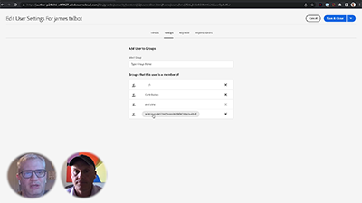
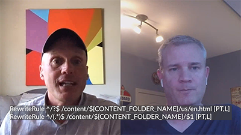

# 클라우드 시즌

>[!VIDEO](https://video.tv.adobe.com/v/346567?quality=12&learn=on)

## 소개

AEM Engineering의 시즌 2의 Cloud 5 시리즈에 오신 것을 환영합니다. 모든 제품의 구현 단계에서 가장 중요한 문제 중 하나는 충분한 코드 샘플 및/또는 이러한 샘플, 도구 또는 API에 대한 실시간 데모가 있다는 것입니다. 이 시리즈의 목표는 5분 이내에 AEM as a Cloud Service에 대한 유용한 정보를 제공하는 것입니다.

## 제안 상자

주제 아이디어를 제출하려면 [제안 상자](https://forms.office.com/r/74P5Xz4UH0)를 방문하세요.

## 시즌

각 시즌의 길이는 다양하며 고정된 일정에 따라 릴리스됩니다. 시즌 2의 주제는 주로 고객 및 파트너와의 일상적인 계약에서 접한 과거의 요청에서 비롯됩니다. 주간 업데이트를 보려면 이 페이지를 방문하거나 선택한 소셜 네트워크에서 팔로우하십시오.

<table>
    <tr>
        <td>
            
            

                <a href="season-2/cloud5-experience-v-content-fragments.md"><strong>조각</strong></a>        
                 <em>Darin Kuntze 및 James Talbot, 선임 클라우드 설계자와 함께</em>
            

            

                 
                경험과 콘텐츠 조각의 차이점을 다채롭게 살펴봅니다. 모두가 이깁니다.
            

        </td>   
         <td>
            
            

                <a href="season-2/cloud5-repo-modernizer.md"><strong>Repository Modernizer</strong></a> 
                <em>Darin Kuntze 및 James Talbot, 선임 클라우드 설계자와 함께</em>
            

            

                 
                저장소 현대화 도구 를 사용하여 기존 프로젝트 패키지를 AEM as a cloud service와 호환되는 개별 패키지로 재구성하는 방법에 대한 빠른 인사이트.
            

         </td>
         <td>
            
            

                  <a href="season-2/cloud5-admin-console.md"><strong>Admin Console</strong></a>
                <em>Darin Kuntze 및 James Talbot, 선임 클라우드 설계자와 함께</em>
            

            

             
               Darin과 James는 Admin Console, 프로비저닝 및 액세스에 대해 사람들이 알아야 할 몇 가지 일반적인 사항에 대해 설명합니다.
            

         </td> 
  </tr>
  <tr>
         <td>
            
            

                  <a href="season-2/cloud5-sling-job-scheduler.md"><strong>Sling 작업</strong></a>
                <em>Darin Kuntze 및 James Talbot, 선임 클라우드 설계자와 함께</em>
            

            

             
               Darin과 James는 AEM as a Cloud Service에서 작업 일정 및 소비에 대해 고려해야 할 사항과 사항에 대해 논의합니다.
            

         </td> 
         <td>
            
            

                  <a href="season-2/cloud5-repoinit.md"><strong>Sling 저장소 이니셜라이저</strong></a>
                <em>Darin Kuntze 및 James Talbot, 선임 클라우드 설계자와 함께</em>
            

            

             
              Sling Repository Initializer(repoinit라고도 함) 사용의 기능을 잠금 해제하는 몇 가지 방법을 알아봅니다.
            

         </td>   
     <td>
            
      

         <a href="season-2/cloud5-fix-your-cache.md"><strong>문제 해결... 캐시</strong></a>
          <em>Damian Langsweirdt &amp; James Talbot, 선임 클라우드 설계자와 함께</em>
      

      

          
             영역을 탐색하여 캐시를 최적화하고 AEM as a Cloud Service에서 실행되는 사이트를 가속화하십시오.
      

   </td> 
  </tr>
<tr>
   <td>
           
      

            <a href="season-2/cloud5-fix-your-rewrites.md"><strong>문제 해결... 다시 쓰기</strong></a>
          <em>Darin Kuntze 및 James Talbot, 선임 클라우드 설계자와 함께</em>
      

      

         
         AEM as a Cloud Service에서 재작성 개발 및 최적화를 가속화하는 데 도움이 되는 사항에 대한 빠른 통찰력입니다.
      

     </td>   
     <td>
            
      

            <a href="season-2/cloud5-mocm-experience-audit.md"><strong>Cloud Manager의 미스터리... 경험 감사</strong></a>
          <em>Darin Kuntze, Senior Cloud Architect</em>
      

      

         
        Cloud Manager의 기본 사항과 경험 감사 기능을 살펴보십시오.
      

   </td>
     <td>
            
      

            <a href="season-2/cloud5-mocm-unit-tests.md"><strong>Cloud Manager의 미스터리... 단위 테스트</strong></a>
          <em>Darin Kuntze 및 Bryan Stop와 함께 하는 선임 클라우드 설계자</em>
      

      

         
        Darin과 Bryan은 Cloud Manager이 단위 테스트 실행 및 코드 적용 범위 보고를 CI/CD 파이프라인에 통합하여 단위 테스트 AEM 코드의 모범 사례를 장려하고 홍보하는 방법에 대해 설명합니다.
      

   </td> 
  </tr>
    <tr>
        <td>
               
            

                <a href="season-2/cloud5-mocm-functional-tests.md"><strong>Cloud Manager의 미스터리... 기능 테스트</strong> </a>        
                <em>Darin Kuntze 및 Bryan Stop와 함께 하는 선임 클라우드 설계자</em>
            

            
 
                Darin과 Bryan은 코드의 품질과 신뢰성을 보장하기 위해 AEM as a Cloud Service 배포 프로세스에 내장된 다양한 유형의 기능 테스트에 대해 설명합니다.
            

        </td>
        <td></td>
        <td></td>
    </tr>
</table>
