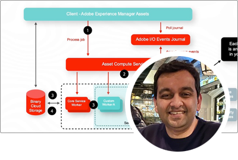

# Adobe Experience Manager as a Cloud Service 전문가 시리즈

Adobe을 구축하는 전문 엔지니어의 AEM(Adobe Experience Manager) as a Cloud Service 및 이를 제공하는 전문 서비스 팀에 대해 알아봅니다. Adobe의 전문가들과 함께 AEM as a Cloud Service이 무엇인지, AEM 6과 어떻게 동일하고 다른지, AEM 6에서 AEM으로 어떻게 이동하는지 살펴보십시오.

  
 

## AEM as a Cloud Service 시작하기

AEM as a Cloud Services의 기본 사항과 AEM 6과 어떻게 다른지 Adobe 엔지니어링 수석 클라우드 설계자와 학습합니다.

<table>
  <tr>
   <td>
      
      

         <a href="../../migration/moving-to-aem-as-a-cloud-service/introduction.md"><strong>다르게 생각하는 것</strong></a>         
          <em>수석 클라우드 설계자인 Darin Muntze와 함께</em>
      

      

         
         AEM as a Cloud Service의 아키텍처와 AEM 구현에 대해 다르게 생각하는 방법을 살펴봅니다.
      

     </td>   
     <td>
      
      

         <a href="../../migration/moving-to-aem-as-a-cloud-service/onboarding.md"><strong>AEM as a Cloud Service 온보딩</strong></a>
          <em>Damian Langsweirdt, 수석 클라우드 설계자와 함께</em>
      

      

         
         Cloud Manager를 사용하여 셀프서비스 환경을 설정하는 계약 단계부터 AEM as a Cloud Service으로 온보딩에 대해 알아봅니다.
      

   </td>     
   </td>   
     <td>
      
      

         <a href="../../migration/moving-to-aem-as-a-cloud-service/cloud-manager.md"><strong>AEM as a Cloud Service Cloud Manager</strong></a>
          <em>브라이언 스토프, 수석 클라우드 아키텍트</em>
      

      

         
         AEM as a Cloud Service용 Cloud Manager에 대해 알아보고, AMS(Adobe 관리 서비스)에서 AEM for과의 차이점을 파악합니다.
      

   </td> 
  </tr>
</table>

## AEM as a Cloud Service로 이동?

AEM 6에서 AEM as a Cloud Service으로 이동할 계획입니까? AEM as a Cloud Service으로 전환하는 방법론과 원활한 전환을 제공하는 다양한 도구 및 기능에 대해 알아봅니다.

<table>
  <tr>
   <td>
      
      

         <a href="../../migration/moving-to-aem-as-a-cloud-service/bpa-and-cam.md" target="_aem-experts-series-video"><strong>마이그레이션 방법론</strong></a>
          <em>Roger Blanton과 함께 Adobe 컨설팅 서비스 기술 설계자</em>
      

      

         
        AEM BPA(Best Practice Analyzer)와 CAM(Cloud Acceleration Manager)을 사용하여 AEM 6에서 AEM as a Cloud Service으로 이동하는 모범 사례 마이그레이션 방법을 살펴봅니다.
      

   </td>   
     <td>
      
      

         <a href="../../migration/moving-to-aem-as-a-cloud-service/aem-modernization-tools.md" target="_aem-experts-series-video"><strong>콘텐츠 현대화</strong></a>
          <em>브라이언 스토프, 수석 클라우드 아키텍트</em>
      

      

         
         최신 AEM as a Cloud Service 기능을 활용하기 위해 AEM 컨텐츠를 자동으로 현대화하는 방법을 알아봅니다.
      

   </td>     
   </td>   
     <td>
      
      

         <a href="../../migration/moving-to-aem-as-a-cloud-service/repository-modernization.md" target="_aem-experts-series-video"><strong>AEM Maven 프로젝트 현대화</strong></a>
          <em>Varun Mitra, Cloud Architect 사용</em>
      

      

         
         사용자 정의 AEM 애플리케이션의 Maven 프로젝트 구조 및 조직을 AEM as a Cloud Service 호환으로 현대화하고 Adobe의 최신 모범 사례에 맞게 조정하는 방법을 알아봅니다.
      

   </td> 
  </tr>
  <tr>
   <td>
      
      

         <a href="../../migration/moving-to-aem-as-a-cloud-service/search-and-indexing.md" target="_aem-experts-series-video"><strong>Oak 색인 현대화</strong></a>
          <em>수석 클라우드 설계자인 Darin Muntze와 함께</em>
      

      

         
        AEM 6 Oak 인덱스 정의를 AEM as a Cloud Service 호환으로 자동 변환하는 방법과 AEM을 위한 Oak 인덱스를 계속 유지 관리하는 방법as a Cloud Service을 알아봅니다.
      

   </td>   
     <td>
      
      

         <a href="../../migration/moving-to-aem-as-a-cloud-service/dispatcher.md" target="_aem-experts-series-video"><strong>Dispatcher 구성 현대화</strong></a>
          <em>브라이언 스토프, 수석 클라우드 아키텍트</em>
      

      

         
         Dispatcher for AEM 6, Dispatcher 전환 도구 및 Dispatcher 도구 SDK를 사용하는 방법에 중점을 두고 AEM용 AEM Dispatcher as a Cloud Service에 대해 알아봅니다.
      

   </td>     
   </td>   
     <td>
      
      

         <a href="../../migration/moving-to-aem-as-a-cloud-service/content-migration/content-transfer-tool.md" target="_aem-experts-series-video"><strong>AEM as a Cloud Service으로 컨텐츠 전송</strong></a>
          <em>Kiran Murugulla, 수석 클라우드 아키텍처와 함께</em>
      

      

         
         컨텐츠 전송 도구를 사용하여 컨텐츠를 AEM 6.3 이상에서 AEM as a Cloud Service으로 마이그레이션하는 방법을 알아봅니다.
      

   </td> 
  </tr>  
</table>

## AEM as a Cloud Services 기능

Adobe 전문가의 AEM as a Cloud Service의 고유한 기능에 대해 알아봅니다.

<table>
  <tr>
   <td>
      
      

         <a href="../../migration/moving-to-aem-as-a-cloud-service/asset-compute-microservices.md" target="_aem-experts-series-video"><strong>asset compute 마이크로서비스</strong></a>
          <em>Amol Anand, Principal Cloud Architect 사용</em>
      

      

         
        AEM Assets의 Asset compute 마이크로서비스, AEM 6 자산 처리를 대체하는 방법 및 사용자 지정 자산 렌디션을 생성하기 위해 확장할 수 있는 방법에 대해 알아봅니다.
      

   </td>   
   <td>
      
      

         <a href="../../migration/moving-to-aem-as-a-cloud-service/content-migration/bulk-import-service.md" target="_aem-experts-series-video"><strong>컨텐츠를 일괄적으로 가져오는 중</strong></a>
          <em>Kiran Murugulla, 수석 클라우드 아키텍처와 함께</em>
      

      

         
        대량 가져오기 서비스 및 AEM 패키지 관리자를 사용하여 컨텐츠를 AEM as a Cloud Service으로 안전하고 효율적으로 가져오는 방법을 알아봅니다.
      

   </td> 
    <td></td>
  </tr>
</table>

## AEM as a Cloud Services에 도움이 필요하십니까?

전문가로부터 AEM as a Cloud Service 및 AEM SDK를 디버그 및 해결하는 방법을 알아봅니다.

<table>
  <tr>
   <td>
      
      

         <a href="../../migration/moving-to-aem-as-a-cloud-service/troubleshooting.md" 
         target="_aem-experts-series-video"><strong>AEM 문제 해결 as a Cloud Service</strong></a>
          <em>클라우드 아키텍트, Munwar Saluja 사용</em>
      

      

         
        AEM SDK 디버깅 및 AEM Cloud Manager 빌드 및 배포 실패에 이르기까지 AEM as a Cloud Service의 다양한 측면을 해결하는 방법을 알아봅니다.
      

   </td>   
    <td></td>
    <td></td>
  </tr>
</table>
