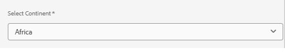

# 국가 구성 요소 빌드, 배포 및 테스트

모든 모듈을 빌드하고 `all` 패키지를 AEM의 로컬 인스턴스에 배포하려면 프로젝트 루트 디렉터리에서 다음 명령을 실행합니다.

```mvn clean install -PautoInstallSinglePackage```

## 구성 요소 테스트

국가 구성 요소를 AEM Forms Cloud Ready 인스턴스에 통합하고 구성하려면 다음 단계를 수행합니다.

* [국가](assets/countries.zip) zip 파일의 내용을 추출하십시오. 각 파일에는 특정 대륙에 대한 데이터가 포함되어야 합니다.
* content/dam/corecomponent.This 하에서의 json 파일 업로드는 코드가 json 파일을 찾는 위치입니다. JSON 파일을 다른 위치에 저장하려면 CountriesDropDownImpl 클래스에서 Java 코드를 업데이트해야 합니다. 특히 JSON 파일이 로드되는 init() 메서드의 경로를 업데이트합니다. 예를 들어 content/dam/mydata/에 JSON 파일을 저장하려면 다음과 같이 경로를 업데이트합니다

```java
String jsonPath = "/content/dam/mydata/" + getContinent() + ".json"; // Update path accordingly
```

* AEM Forms Cloud Ready 인스턴스에 로그인
* 적응형 양식을 만들고 국가 구성 요소를 양식에 드롭합니다.
* 대화 상자 편집기를 사용하여 국가 구성 요소를 구성하고 대륙을 포함한 다양한 속성을 설정합니다
  
* 양식을 미리 보고 국가 드롭다운이 예상대로 작동하는지 확인하십시오.
