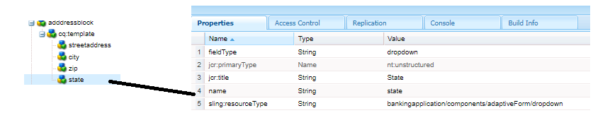

# 주소 구성 요소 만들기

AEM Forms 로컬 클라우드 준비 인스턴스의 CRXDE에 로그인합니다.

다음을 복사하십시오. ``/apps/bankingapplication/components/adaptiveForm/button`` node로 변경하고 이름을 addressblock으로 변경합니다. addressblock 노드를 선택하고 아래와 같이 속성을 설정합니다.

>[!NOTE]
>
> ``bankingapplication`` 는 Maven 프로젝트를 만들 때 제공된 appId입니다. 이 appId는 사용자 환경에서 다를 수 있습니다. 구성 요소를 복사할 수 있습니다. 버튼 구성 요소를 복사했습니다.

## cq-template 노드 속성

다음 항목 선택 ``cq-template`` 노드 아래의 ``addressblock`` 노드 를 만들고 아래와 같이 속성을 설정합니다. fieldType이 panel로 설정된 것을 확인합니다.

## cq-template 아래에 노드 추가

유형의 다음 노드 추가 ``nt:unstructured`` 아래에 ``cq-template``

* 주소
* 도시
* zip
* 시/도

이러한 노드는 주소 블록 구성 요소의 필드를 나타냅니다. 주소, 도시 및 우편 번호 필드는 텍스트 입력 필드이고 상태 필드는 드롭다운 필드입니다.

## Streetaddress 노드의 속성 설정

>[!NOTE]
>
> 다음 **_은행 애플리케이션_** 경로에서 는 maven 프로젝트의 appId를 나타냅니다. 이는 귀하의 환경에서 다를 수 있습니다

다음 항목 선택 ``streetaddress`` 노드 를 만들고 아래와 같이 속성을 설정합니다.

## 도시 노드의 속성 설정

다음 항목 선택 ``city`` 노드 를 만들고 아래와 같이 속성을 설정합니다.

## zip 노드의 속성 설정

다음 항목 선택 ``zip`` 노드 를 만들고 아래와 같이 속성을 설정합니다.

## 상태 노드의 속성 설정

다음 항목 선택 ``state`` 노드 를 만들고 아래와 같이 속성을 설정합니다. fieldType of state - 가 드롭다운으로 설정되어 있습니다.

최종 주소 블록 구성 요소는 다음과 같이 표시됩니다

## 다음 단계

[프로젝트 배포](./deploy-your-project.md)

