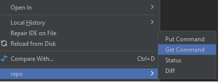
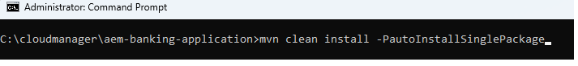

# 프로젝트 배포

AEM Forms as a Cloud Service에 프로젝트를 배포하기 전에 AEM Forms의 로컬 클라우드 준비 인스턴스에 프로젝트를 배포하는 것이 좋습니다.

## 변경 사항을 AEM 프로젝트와 동기화

IntelliJ를 시작하고 아래와 같이 ``ui.apps`` 폴더 아래의 adaptiveForm 폴더로 이동합니다

``adaptiveForm`` 노드를 마우스 오른쪽 단추로 클릭하고 새로 만들기 선택 | 패키지
패키지에 이름 **addressblock**&#x200B;을(를) 추가하세요.

새로 만든 패키지 ``addressblock``을(를) 마우스 오른쪽 단추로 클릭하고 아래와 같이 ``repo | Get Command``을(를) 선택합니다.

프로젝트를 로컬 클라우드 지원 AEM Forms 인스턴스와 동기화해야 합니다. .content.xml 파일을 확인하여 속성을 확인할 수 있습니다

## 로컬 인스턴스에 프로젝트 배포

새 명령 프롬프트 창을 시작하고 프로젝트의 루트 폴더로 이동한 다음 아래 표시된 명령을 사용하여 프로젝트를 빌드합니다.

프로젝트가 성공적으로 배포되면
이제 주소 구성 요소를 적응형 양식에서 사용할 수 있습니다

## 프로젝트를 클라우드 환경에 배포

모든 것이 로컬 개발 환경에서 잘 보이는 경우 다음 단계는 cloud manager를 사용하여 [클라우드 인스턴스에 배포하는 것입니다.](https://experienceleague.adobe.com/ko/docs/experience-manager-learn/cloud-service/forms/developing-for-cloud-service/push-project-to-cloud-manager-git)
