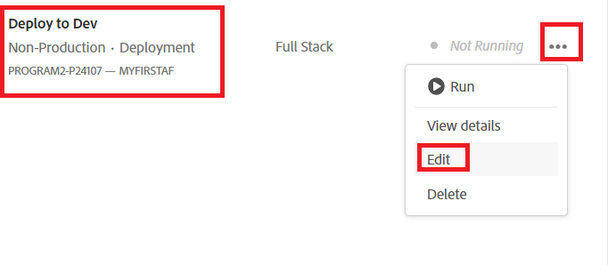

# 개발 환경에 배포

In the previous step we pushed our master branch from our local git repository into the MyFirstAF branch of the cloud manager repository.

다음 단계는 개발 환경에 코드를 배포하는 것입니다.
cloud manager에 로그인하고 프로그램을 선택합니다

Select the Deploy to Dev as shown below

Select Deployment Pipeline as shown

Select the source code and appropriate Git branch

Make sure you update your changes

Run the pipeline

코드가 배포되면 AEM Forms의 클라우드 서비스 인스턴스에 변경 사항이 표시됩니다.
