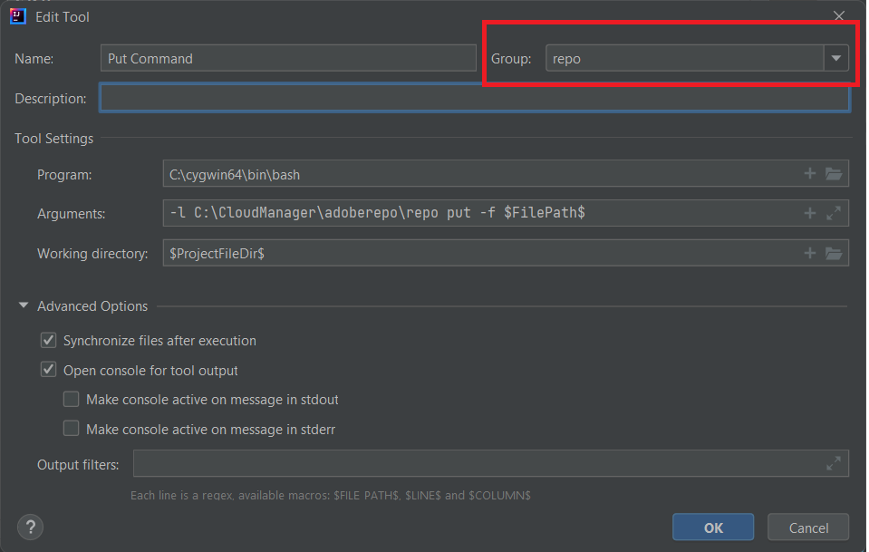

# Cygwin 설치

Cygwin은 Microsoft Windows에서 기본적으로 실행되는 POSIX 호환 프로그래밍 및 런타임 환경입니다.
설치 [시그윈](https://www.cygwin.com/). C:\cygwin64 폴더에 설치했습니다.
>[!NOTE]
> Cygwin 설치와 함께 zip, unzip, curl, rsync 패키지를 설치하십시오.

c:\cloudmanager 아래에 adoberepo라는 폴더를 만듭니다.

[저장소 도구 설치].(https://github.com/Adobe-Marketing-Cloud/tools/tree/master/repo).Installing repo tool은 repo 파일을 복사하여 c:\cloudmanger\adoberepo 폴더에 배치하는 것입니다.

경로 환경 변수 C:\cygwin64\bin;C:\CloudManager\adoberepo;에 다음을 추가합니다.

## 외부 도구 설정

* IntelliJ 시작
* Ctrl+Alt+S 키를 눌러 설정 창을 시작합니다.
* 도구->외부 도구 를 선택한 다음 + 기호를 클릭하고 스크린샷에 표시된 대로 다음을 입력합니다.
   
* 그룹 드롭다운 필드에 &quot;repo&quot;를 입력하여 repo라는 그룹을 만들어야 하며 작성한 모든 명령은 **보고** 그룹

**Put 명령**
**프로그램**: C:\cygwin64\bin\bash
**인수**: -l C:\CloudManager\adoberepo\repo put -f \$FilePath\$
**작업 디렉터리**: \$ProjectFileDir\$

**Get 명령**
**프로그램**: C:\cygwin64\bin\bash
**인수**: -l C:\CloudManager\adoberepo\repo get -f \$FilePath\$
**작업 디렉터리**: \$ProjectFileDir\$

**상태 명령**
**프로그램**: C:\cygwin64\bin\bash
**인수**: -l C:\CloudManager\adoberepo\repo st -f \$FilePath\$
**작업 디렉터리**: \$ProjectFileDir\$

**비교 명령**
**프로그램**: C:\cygwin64\bin\bash
**인수**: -l C:\CloudManager\adoberepo\repo diff -f $FilePath$
**작업 디렉터리**: \$ProjectFileDir\$

에서 .repo 파일 추출 [repo.zip](assets/repo.zip) AEM 프로젝트 루트 폴더에 넣습니다. (C:\CloudManager\aem-banking-application). .repo 파일을 열고 서버와 자격 증명 설정이 사용자 환경과 일치하는지 확인합니다.
.gitigore 파일을 열고 파일 하단에 다음을 추가하고 변경 사항을 저장합니다. \# repo .repo

aem 뱅킹 애플리케이션 프로젝트 내의 프로젝트(예: ui.content )를 선택하고 마우스 오른쪽 버튼을 클릭하면 보고 옵션이 표시되고, 보고 옵션 아래에 이전에 추가한 4개의 명령이 표시됩니다.

## AEM 작성자 인스턴스 설정

다음 단계에 따라 로컬 시스템에서 클라우드 준비 인스턴스를 빠르게 설정할 수 있습니다.
* [최신 AEM SDK 다운로드](https://experience.adobe.com/#/downloads/content/software-distribution/en/aemcloud.html)

* [최신 AEM Forms 추가 기능 다운로드](https://experience.adobe.com/#/downloads/content/software-distribution/en/aemcloud.html)

* 다음 폴더 구조 c:\aemformscs\aem-sdk\author 를 만듭니다.

* AEM SDK zip 파일에서 aem-sdk-quickstart-xxxxxxx.jar 파일을 추출하여 c:\aemformscs\aem-sdk\author 폴더에 넣습니다.jar 파일의 이름을 aem-author-p4502.jar로 바꿉니다

* 명령 프롬프트를 열고 c:\aemformscs\aem-sdk\author으로 이동한 후 다음 명령을 입력합니다 java -jar aem-author-p4502.jar -gui. 이렇게 하면 AEM 설치가 시작됩니다.
* 관리자/관리자 자격 증명을 사용하여 로그인
* AEM 인스턴스를 중지합니다
* 다음 폴더 구조를 만듭니다.C:\aemformscs\aem-sdk\author\crx-quickstart\install
* 설치 폴더에 aem-forms-addon-xxxxxx.far 복사
* 명령 프롬프트를 열고 c:\aemformscs\aem-sdk\author으로 이동한 후 다음 명령을 입력합니다 java -jar aem-author-p4502.jar -gui. 이렇게 하면 AEM 인스턴스에 양식 추가 기능 패키지가 배포됩니다.
