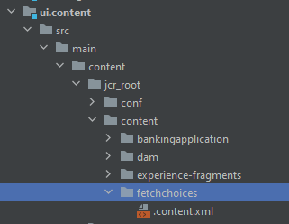

# 소개

경로별 바인딩 서블릿은 리소스 유형별 바인딩과 비교할 때 몇 가지 단점이 있습니다. 즉,

* 경로 바인딩 서블릿은 기본 JCR 저장소 ACL을 사용하여 액세스를 제어할 수 없습니다
* 경로 바인딩 서블릿은 경로에만 등록할 수 있으며 리소스 유형은 등록할 수 없습니다(즉, 접미사 처리 없음)
* 경로 바인딩 서블릿이 활성화되지 않은 경우(예: 번들이 누락되었거나 시작되지 않은 경우) POST으로 인해 예기치 않은 결과가 발생할 수 있습니다. 일반적으로 노드 생성 위치 `/bin/xyz` 이후에 매핑이 저장소만 보는 개발자에게 투명하지 않은 상태로 서블릿 경로를 오버레이합니다. 이러한 단점을 감안할 때 서블릿을 경로가 아닌 리소스 유형에 바인딩하는 것이 좋습니다

## 서블릿 만들기

IntelliJ에서 AEM 뱅킹 프로젝트를 시작합니다. 아래 스크린샷에 표시된 대로 서블릿 폴더 아래에 GetFieldChoices라는 서블릿을 만듭니다.


## 샘플 서블릿

다음 서블릿은 Sling 리소스 유형에 바인딩되어 있습니다. _**azure/fetchchoices**_


```java
import org.apache.sling.api.SlingHttpServletRequest;
import org.apache.sling.api.SlingHttpServletResponse;
import org.apache.sling.api.servlets.SlingAllMethodsServlet;
import org.apache.sling.servlets.annotations.SlingServletResourceTypes;
import org.osgi.framework.Constants;
import org.osgi.service.component.annotations.Component;
import org.osgi.service.component.annotations.Reference;
import org.slf4j.Logger;
import org.slf4j.LoggerFactory;

import javax.jcr.Session;
import javax.servlet.Servlet;
import java.io.IOException;
import java.io.Serializable;

@Component(
        service={Servlet.class }
)

        @SlingServletResourceTypes(
                resourceTypes="azure/fetchchoices",
                methods= "GET",
                extensions="json"
                )


public class GetFieldChoices extends SlingAllMethodsServlet implements Serializable {
    private static final long serialVersionUID = 1L;
    private final  transient Logger log = LoggerFactory.getLogger(this.getClass());


   

    protected void doGet(SlingHttpServletRequest request, SlingHttpServletResponse response) {

        log.debug("The form path I got was "+request.getParameter("formPath"));

    }
}
```

## CRX에서 리소스 만들기

* 로컬 AEM SDK에 로그인합니다.
* 이름이 인 리소스 만들기 `fetchchoices` (원하는 대로 이 노드의 이름을 지정할 수 있습니다) 유형의 `cq:Page` 콘텐츠 노드 아래에 있는 모든 세그먼트를 표시합니다.
* 변경 사항 저장
* 라는 노드 만들기 `jcr:content` 유형 `cq:PageContent` 및 변경 내용 저장
* 에 다음 속성을 추가합니다 `jcr:content` 노드

| 속성 이름 | 속성 값 |
|--------------------|--------------------|
| jcr:title | 유틸리티 서블릿 |
| sling:resourceType | `azure/fetchchoices` |


다음 `sling:resourceType` 값은 서블릿에 지정된 resourceTypes=&quot;azure/fetchchoices와 일치해야 합니다.

이제 를 사용하여 리소스를 요청하여 서블릿을 호출할 수 있습니다. `sling:resourceType` = `azure/fetchchoices` 전체 경로에서 Sling 서블릿에 등록된 모든 선택기 또는 확장이 있습니다.

```html
http://localhost:4502/content/fetchchoices/jcr:content.json?formPath=/content/forms/af/forrahul/jcr:content/guideContainer
```

경로 `/content/fetchchoices/jcr:content` 는 리소스 및 확장의 경로입니다. `.json` 서블릿에 지정된 것입니다.

## AEM 프로젝트 동기화

1. 즐겨찾는 편집기에서 AEM 프로젝트를 엽니다. 여기에 intelliJ를 사용했습니다.
1. 라는 폴더 만들기 `fetchchoices` 아래에 `\aem-banking-application\ui.content\src\main\content\jcr_root\content`
1. 마우스 오른쪽 버튼 클릭 `fetchchoices` 폴더 및 선택 `repo | Get Command` (이 메뉴 항목은 이 자습서의 이전 장에서 설정됩니다.)

이 노드를 AEM에서 로컬 AEM 프로젝트로 동기화해야 합니다.

AEM 프로젝트 구조는 다음과 같아야 합니다

다음 항목으로 aem-banking-application\ui.content\src\main\content\META-INF\vault 폴더의 filter.xml을 업데이트합니다

```xml
<filter root="/content/fetchchoices" mode="merge"/>
```

이제 Cloud Manager를 사용하여 변경 사항을 AEM as a Cloud Service 환경에 푸시할 수 있습니다.

## 다음 단계

[Forms 포털 구성 요소 활성화](./forms-portal-components.md)
