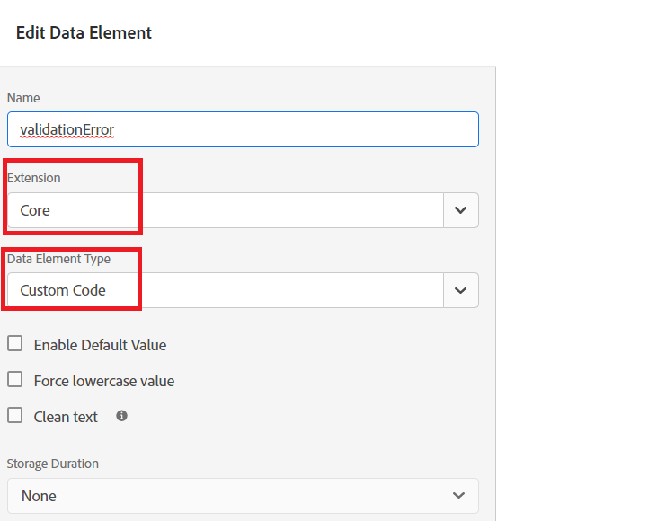

# 데이터 요소 만들기

Tags 속성에서 두 개의 새 데이터 요소(AppliancesStateOfResidence 및 validationError)를 추가했습니다.


## 지원자주국

아래 스크린샷과 같이 확장 드롭다운에서 **Core** 및 데이터 요소 유형에 대한 **사용자 지정 코드**&#x200B;를 선택하여 **ApplicantStateOfResidence** 데이터 요소를 구성했습니다


다음 사용자 지정 코드는 **_상태_** 적응형 양식 필드에서 값을 캡처하는 데 사용되었습니다.

```javascript
// use the GuideBridge API to access adaptive form elements
//The state field's SOM expression is used to access the state field
var ApplicantsStateOfResidence = guideBridge.resolveNode("guide[0].guide1[0].guideRootPanel[0].state[0]").value;
_satellite.logger.log("Returning  Applicants State Of Residence is "+ApplicantsStateOfResidence);
return ApplicantsStateOfResidence;
```

## validationError

**ValidationError** 데이터 요소는 아래 스크린샷과 같이 확장 드롭다운에서 **Core** 및 데이터 요소 유형에 대해 **사용자 지정 코드**&#x200B;을(를) 선택하여 구성되었습니다



`validationError` 데이터 요소 값을 설정하기 위해 다음 사용자 지정 코드를 작성했습니다.

```javascript
var validationError = "";
// Using GuideBridge API to access adaptive forms fields using the fields SOM expression
var tel = guideBridge.resolveNode("guide[0].guide1[0].guideRootPanel[0].telephone[0]");
var email = guideBridge.resolveNode("guide[0].guide1[0].guideRootPanel[0].email[0]");

_satellite.logger.log("Got tel in Tags custom script "+tel.isValid)
_satellite.logger.log("Got email in Tags custom script "+email.isValid)

if (tel.isValid == false) {  
  validationError = "error: telephone number";
  _satellite.logger.log("Validation error is "+ validationError);
}

if (email.isValid == false) {  
  validationError = "error: invalid email";
  _satellite.logger.log("Validation error is "+ validationError);
}

return validationError;
```

## 다음 단계

[규칙 만들기](./rules.md)