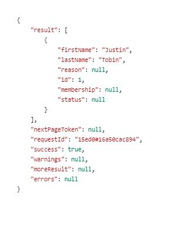

# Forms 데이터 모델 만들기

데이터 소스를 구성한 후 다음 단계는 이전 단계에서 구성한 데이터 소스를 기반으로 양식 데이터 모델을 만드는 것입니다. 양식 데이터 모델을 만들려면 다음 단계를 수행하십시오.

브라우저를 [데이터 통합 페이지로 가리킵니다.](http://localhost:4502/aem/forms.html/content/dam/formsanddocuments-fdm) AEM 인스턴스에서 만든 모든 데이터 통합을 나열합니다.

1. 만들기 를 클릭합니다 | 양식 데이터 모델
1. FormsAndMarketo와 같은 의미 있는 제목을 입력하고 다음 을 클릭합니다
1. 이전 단계에서 구성한 데이터 소스를 선택하고 만들기 및 편집 을 클릭하여 편집 모드에서 양식 데이터 모델 을 엽니다
1. &quot;FormsAndMarketo&quot; 노드를 확장합니다. 서비스 노드를 확장합니다.
1. 첫 번째 &quot;가져오기&quot; 작업 선택
1. 선택 항목 추가를 클릭합니다
1. &quot;연결된 모델 개체 추가&quot; 대화 상자에서 &quot;모두 선택&quot;을 클릭한 다음 추가를 클릭합니다
1. 저장 단추를 클릭하여 양식 데이터 모델을 저장합니다.
1. 서비스 탭 탭
1. 나열된 유일한 서비스를 선택하고 테스트 서비스 를 클릭합니다.
1. 유효한 leadId를 입력하고 Test 를 클릭합니다. 모든 것이 잘 진행되면 아래 스크린샷과 같이 리드 세부 정보를 다시 가져와야 합니다
   

이제 이 양식 데이터 모델을 기반으로 적응형 양식을 만들어 Marketo 개체를 삽입하고 가져올 수 있습니다.
