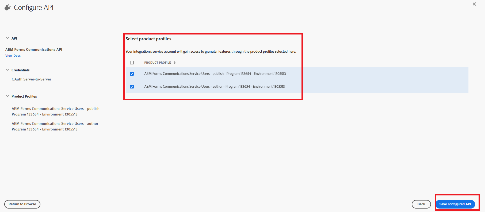

# AEM Forms as a Cloud Service에서 OpenAPI 기반 AEM Forms 통신 API 구성

## 사전 요구 사항

* AEM Forms as a Cloud Service의 최신 인스턴스.
* 필요한 모든 [제품 프로필이 환경에 추가됩니다.](https://experienceleague.adobe.com/ko/docs/experience-manager-learn/cloud-service/aem-apis/invoke-openapi-based-aem-apis)

* 아래와 같이 제품 프로필에 AEM API 액세스 권한을 부여합니다
  
  

## Adobe Developer Console 프로젝트 만들기

Adobe ID을 사용하여 [Adobe Developer Console](https://developer.adobe.com/console/)에 로그인합니다.
해당 아이콘을 클릭하여 새 프로젝트를 만듭니다

프로젝트에 의미 있는 이름을 지정하고 API 추가 아이콘을 클릭합니다.

Experience Cloud 선택

AEM Forms Communications API 를 선택하고 다음 을 클릭합니다

서버 간 인증을 선택했는지 확인하고 다음 을 클릭합니다

프로필을 선택하고 구성된 API 저장 버튼을 클릭하여 설정을 저장합니다.

OAuth 서버 간 클릭

클라이언트 ID, 클라이언트 암호 및 범위 복사

## ADC 프로젝트 통신을 사용하도록 AEM 인스턴스 구성

이미 AEM Forms 프로젝트가 있는 경우 [다음 지침에 따라](https://experienceleague.adobe.com/ko/docs/experience-manager-learn/cloud-service/aem-apis/invoke-openapi-based-aem-apis)Adobe Developer Console 프로젝트의 OAuth 서버 간 자격 증명 ClientID를 사용하여 AEM 인스턴스와 통신할 수 있습니다

AEM Forms 프로젝트가 없는 경우 이 설명서에 따라 [AEM Forms 프로젝트를 만드십시오.](https://experienceleague.adobe.com/en/docs/experience-manager-learn/cloud-service/forms/developing-for-cloud-service/getting-started)을(를) 만든 다음 이 설명서를 사용하여 Adobe Developer Console 프로젝트의 OAuth 서버 간 자격 증명 ClientID를 사용하여 AEM 인스턴스 [과(와) 통신할 수 있습니다.](https://experienceleague.adobe.com/ko/docs/experience-manager-learn/cloud-service/aem-apis/invoke-openapi-based-aem-apis)

## 다음 단계

[액세스 토큰 생성](./generate-access-token.md)
