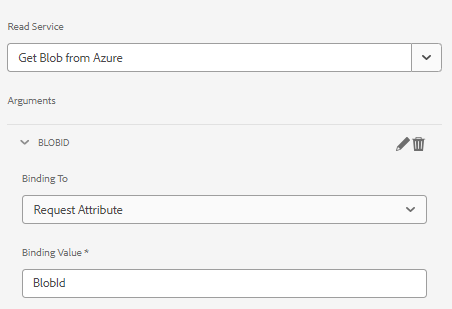

# 페이지 구성 요소

페이지 구성 요소는 페이지 렌더링을 담당하는 일반 구성 요소입니다. 새 페이지 구성 요소를 만들고 이 페이지 구성 요소를 새 적응형 양식 템플릿과 연결합니다. 이렇게 하면 적응형 양식이 이 특정 템플릿을 기반으로 할 때만 코드가 실행됩니다.

## 페이지 구성 요소 만들기

로컬 클라우드 지원 AEM Forms 인스턴스에 로그인합니다. 앱 폴더 아래에 다음 구조를 만듭니다


1. 페이지 폴더를 마우스 오른쪽 단추로 클릭하고 cq:Component 유형의 storeandfetch라는 노드를 만듭니다.
1. 변경 내용 저장
1. `storeandfetch` 노드에 다음 속성을 추가하고 저장합니다.

| **속성 이름** | **속성 유형** | **속성 값** |
|-------------------------|-------------------|----------------------------------------|
| 구성 요소 그룹 | 문자열 | 숨김 |
| jcr:description | 문자열 | 적응형 양식 템플릿 페이지 유형 |
| jcr:title | 문자열 | 적응형 양식 템플릿 페이지 |
| sling:resourceSuperType | 문자열 | `fd/af/components/page2/aftemplatedpage` |

`/libs/fd/af/components/page2/aftemplatedpage/aftemplatedpage.jsp`을(를) 복사하여 `storeandfetch` 노드 아래에 붙여넣습니다. `aftemplatedpage.jsp`의 이름을 `storeandfetch.jsp`(으)로 변경합니다.

`storeandfetch.jsp`을(를) 열고 다음 줄을 추가합니다.

```jsp
<cq:include script="azureportal.jsp"/>
```

다음 아래에

```jsp
<cq:include script="fallbackLibrary.jsp"/>
```

최종 코드는 다음과 같아야 합니다

```jsp
<cq:include script="fallbackLibrary.jsp"/>
<cq:include script="azureportal.jsp"/>
```

storeandfetch 노드 아래에 azureportal.jsp라는 파일을 생성합니다.
azureportal.jsp에 다음 코드를 복사하고 변경 사항을 저장합니다

```jsp
<%@page session="false" %>
<%@include file="/libs/fd/af/components/guidesglobal.jsp" %>
<%@ page import="org.apache.commons.logging.Log" %>
<%@ page import="org.apache.commons.logging.LogFactory" %>
<%
    if(request.getParameter("guid")!=null) {
            logger.debug( "Got Guid in the request" );
            String BlobId = request.getParameter("guid");
            java.util.Map paraMap = new java.util.HashMap();
            paraMap.put("BlobId",BlobId);
            slingRequest.setAttribute("paramMap",paraMap);
    } else {
            logger.debug( "There is no Guid in the request " );
    }            
%>
```

이 코드에서는 요청 매개 변수 **guid**&#x200B;의 값을 가져와 BlobId라는 변수에 저장합니다. 그런 다음 이 BlobId가 paramMap 특성을 사용하여 sling 요청으로 전달됩니다. 이 코드가 작동하려면 Azure Storage 지원 양식 데이터 모델을 기반으로 하는 양식이 있고 양식 데이터 모델의 읽기 서비스가 아래 스크린샷에 표시된 대로 BlobId라는 요청 속성에 바인딩되어 있다고 가정합니다.



### 다음 단계

[페이지 구성 요소를 템플릿과 연결](./associate-page-component.md)
