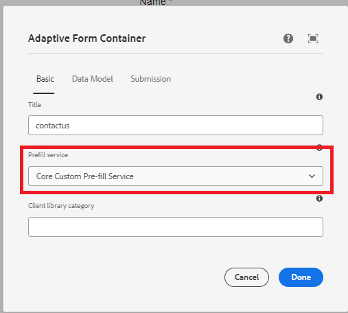

# 솔루션 테스트

코드가 배포되면 핵심 구성 요소를 기반으로 적응형 양식을 만듭니다. 아래 스크린샷과 같이 적응형 양식을 미리 채우기 서비스와 연결합니다.


양식이 렌더링될 때마다 연결된 미리 채우기 서비스가 실행되고 양식은 미리 채우기 서비스에서 반환된 데이터로 채워집니다.

예를 들어 GUID와 연결된 데이터로 양식을 미리 채우려면 **d815a2b3-5f4c-4422-8197-d0b73479bf0e**, 다음 url이 사용됩니다.
미리 채우기 서비스의 코드는 guid 매개 변수의 값을 추출하고 데이터 소스에서 guid와 연결된 데이터를 가져옵니다.

```html
http://localhost:4502/content/dam/formsanddocuments/contactus/jcr:content?wcmmode=disabled&guid=d815a2b3-5f4c-4422-8197-d0b73479bf0e
```
