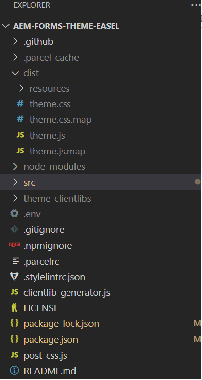

# 버튼 구성 요소의 변형 만들기

테마를 복제한 후 visual studio 코드를 사용하여 프로젝트를 엽니다. 유사한 보기가 표시됩니다.
visual studio 코드에서


src->components->button->_button.scss 파일을 엽니다. 이 파일에서 사용자 지정 변형을 정의합니다.

## 기업 변주

```css
.cmp-adaptiveform-button-corporate {
  @include container;
  .cmp-adaptiveform-button {
    &__widget {
      @include primary-button;
      background: $brand-red;
      text-transform: uppercase;
      border-radius: 0px;
      color: yellow;
    }
  }
}
```

## 설명

* **cmp-adaptiveform-button—corporate**: &quot;cmp-adaptiveform-button—corporate&quot; 구성 요소의 기본 래퍼 또는 컨테이너 클래스입니다.
이 블록 내의 모든 스타일 또는 mixin이 이 클래스 내의 요소에 적용됩니다.
* **@include 컨테이너**: _mixins.scss에 정의된 mixin 호출된 컨테이너를 사용합니다. mixin 컨테이너는 일반적으로 여백, 패딩 또는 기타 구조적 스타일과 같은 레이아웃 관련 스타일을 적용하여 컨테이너가 일관되게 작동하도록 합니다.
* **.cmp-adaptiveform-button**: corporate-style-button 블록 내에서 .cmp-adaptiveform-button 클래스를 사용하여 하위 요소를 타깃팅합니다.
* **&amp;__widget**: &amp; 기호가 부모 선택기를 참조합니다. 이 경우에는 .cmp-adaptiveform-button입니다.
즉, 타깃팅된 최종 클래스는 .cmp-adaptiveform-button__widget이며, .cmp-adaptiveform-button 블록 내의 하위 구성 요소(__위젯 요소)를 나타내는 BEM 스타일 클래스(블록 요소 수정자)입니다.
* **@include 기본 단추**: _mixin.scss에 정의되고 단추와 관련된 스타일(예: 패딩, 색상, 마우스로 가리키기 효과 등)을 추가하는 기본 단추 mixin이 포함됩니다. mixin 기본 단추에 정의된 백그라운드, 텍스트 변환, 테두리 반경, 색상 속성이 무시됩니다.

_mixins.scss 파일은 아래 스크린샷과 같이 src->site 아래에 정의됩니다


## 마케팅 변형

```css
.cmp-adaptiveform-button--marketing {
  
  @include container;
  .cmp-adaptiveform-button {
  &__widget {
    @include primary-button;
    background-color: #3498db;
    color: white;
    font-weight: bold;
    border: none;
    border-radius: 50px;
    box-shadow: 0 4px 6px rgba(0, 0, 0, 0.1);
    cursor: pointer;
    transition: all 0.3s ease;
    outline: none;
    text-transform: uppercase;
    letter-spacing: 0.05em;
    &:hover:not([disabled]) {
      position: relative;
      scale: 102%;
      transition: box-shadow 0.1s ease-out, transform 0.1s ease-out;
      background-color: #2980b9;
      box-shadow: 0 8px 15px rgba(0, 0, 0, 0.2);
      transform: translateY(-3px);
    }
  }
}
  
}
```

## 다음 단계

[변형 테스트](./build.md)


