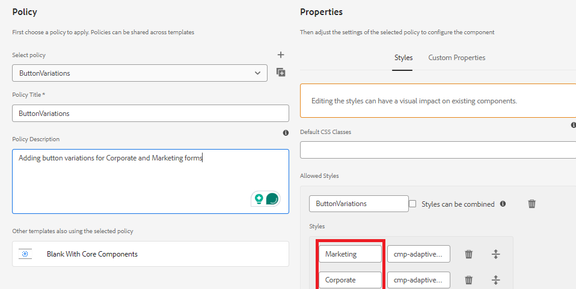

# 구성 요소 정책에 스타일 정의

* 로컬 클라우드 지원 AEM 인스턴스에 로그인하고 도구로 이동합니다 | 일반 | 템플릿 | 프로젝트 이름.

* 편집 모드에서 **핵심 구성 요소가 있는 공백** 템플릿을 선택하여 엽니다.
* 버튼 구성 요소의 정책 아이콘을 클릭하여 정책 편집기를 엽니다.

* 

아래와 같이 정책을 정의합니다

마케팅 및 기업이라는 2개의 스타일/변형을 정의했습니다.이러한 변형은 해당 CSS 클래스와 연결됩니다.**CSS 클래스 이름 앞뒤에 공백이 없는지 확인하십시오**.
변경 사항을 저장합니다.

| 스타일 | CSS 클래스 |
|-----------|------------------------------------|
| 마케팅 | cmp-adaptiveform-button - 마케팅 |
| 기업 | cmp-adaptiveform-button - 기업 |

이러한 CSS 클래스는 구성 요소의 scss 파일(_button.scss)에 정의됩니다.

## 다음 단계

[CSS 클래스 정의](./create-variations.md)
