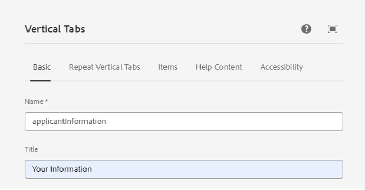

# 적응형 양식 만들기

적응형 양식 기반의 핵심 구성 요소를 만들고 세로 탭 구성 요소를 양식에 삽입합니다.

## 수직 구성 요소 구성

수직 탭 구성 요소를 클릭하여 구성 속성 시트를 엽니다. 다음 탭을 구성합니다

1. 기본 - 아래와 같이 세로 탭 구성 요소에 의미 있는 이름과 제목을 입력합니다
   
1. 항목 - 항목 탭에서는 세로 탭 구성 요소에 항목을 추가할 수 있습니다. 일반적으로 패널을 항목으로 추가한 다음 양식 요소를 패널에 추가합니다. 세로 탭에는 기본적으로 두 개의 항목이 있으며 아래에서 보는 것처럼 요구 사항에 따라 항목의 이름을 지정할 수 있습니다
   

## 개별 패널 구성

1. 세부 정보 - **사용자 정보** 노드 아래에서 항목 1을 선택하고 구성 속성 시트를 엽니다. 아래와 같이 의미 있는 이름과 제목을 입력합니다
   

아래와 같이 세부 정보 패널에 다음 필드를 추가합니다

1. 주소 - **사용자 정보** 노드 아래에서 항목 2를 선택하고 구성 속성 시트를 엽니다. 아래와 같이 의미 있는 이름과 제목을 입력합니다
   

아래와 같이 주소 패널에 다음 2개의 텍스트 필드를 추가합니다

