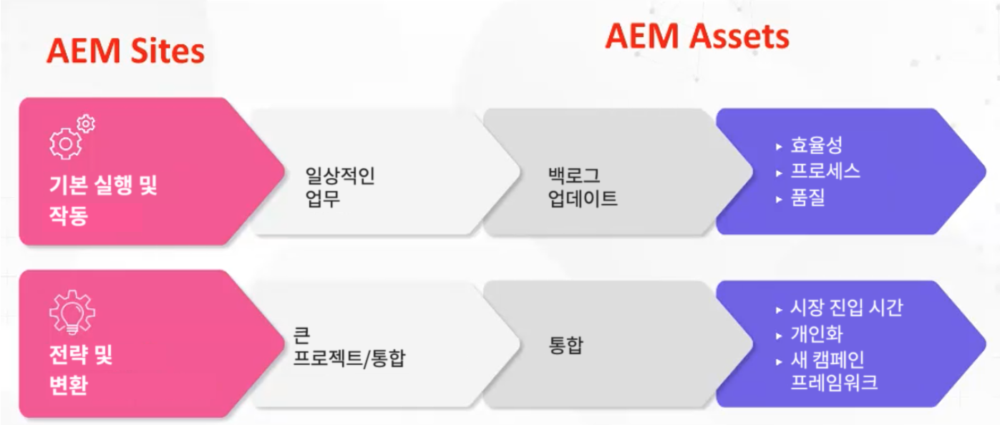

# Adobe Experience Manager (AEM) - 거버넌스 및 인력 모델과 원형

고객 경험 분야의 리더로서 우리는 운영 효율성을 높이는 데 적합한 인력과 거버넌스 프레임워크를 갖추는 것이 얼마나 어려운지 잘 알고 있습니다. Adobe의 업계 검증을 거친 거버넌스 및 인력 모델을 사용하면 견고한 콘텐츠 및 자산 관리 기반을 빌드하는 데 필요한 도구와 지식을 얻을 수 있습니다. 이 문서에서는 Adobe Experience Manager(AEM) 플랫폼을 운영하고 노력의 가치를 극대화하는 방법에 대해 논의합니다.

## 우수한 운영 프레임워크 만들기

AEM을 실행하고 운영하려면 다음 요소를 고려하십시오.

* 전략적 이정표 실행 - 개인화, 다중 채널 통합 등 다양한 전략적 이정표는 적절한 인력 모델 없이는 실행될 수 없습니다.
* 디지털 혁신을 위한 기반 만들기 - AEM은 조직의 현대화 과정에서 첫 번째 단계로 자주 사용됩니다. 기반을 잘 다져야 AEM의 역량을 최대로 활용할 수 있습니다.
* 사용자 참여 - 워크플로, 권한, CSS 업데이트 등의 실무 작업을 수행할 팀이 필요합니다. 사용자의 요구와 제공되는 시스템 간의 격차가 클수록 사용자의 불만이 커집니다. 따라서 사용자가 시스템과 솔루션에 계속 투자하고 올바른 운영 모델을 갖추도록 하는 것이 중요합니다.

그렇다면 올바른 모델은 무엇입니까? 어떤 역할 매트릭스를 구성해야 합니까?

정답은 하나가 아닙니다. 조직이 매우 다양한 만큼, AEM 구성 방식도 매우 다양하여 요구되는 지원 역할도 달라집니다. 업계, 업종, 팀 구조에 따라 구현 방식은 모두 다를 수밖에 없습니다. 그러나 원형을 정의함으로써 기준선을 마련할 수 있습니다.

## 원형

원형은 특정 속성에 매핑되는 특정 상위 수준의 역할 개념입니다. 이러한 원형은 어떤 모델이 정말로 필요한지 알려 주는 데 도움이 되는 기본 전제를 만드는 데 사용할 수 있습니다. 중요한 점은, 하나의 원형이 반드시 한 사람에게만 국한되는 것은 아니라는 것입니다. 예를 들어 DAM 사서는 일정 수준의 기술적 경험을 겸비하고 있을 수도 있습니다.

### 운영화의 흐름

[!DNL AEM Sites] 및 [!DNL AEM Assets]에는 두 가지 운영화의 흐름이 있습니다.

1. 일상적인 기본 실행 및 운영 작업(예: 메타데이터 업데이트)

1. 전략 및 변화 중심의 작업(예: 대규모 조직 간 프로젝트)

### 고차원 AEM Assets 역할

**일반적인 격차:** 이 기준선은 중앙 집중식 모델과 분산형 모델을 모두 지원합니다. 분산형 모델을 사용하는 경우 AEM을 추상적으로 사용할 수 있습니다. 제품 소유자 역할은 창의적으로 사용해야 하지만 자산 유형에 대해 서로 다른 스타일을 관리하는 제품 소유자와 조직 전체를 감독하는 제품 소유자도 있어야 합니다.

1. 기본 실행 및 운영 역할

   * 기술 리소스 - AEM 경험이 있고 권한 부여 및 메타데이터 스키마 업데이트가 가능한 인력
   * 릴리스 관리자
   * 제품 소유자 - 솔루션에 맞춰 설정된 역할입니다. 일부 제품 소유자는 분석에 참여하기도 합니다.
   * DAM 사서 - 통합 프레임워크 프로세스를 감독하는 데 도움을 줄 수 있는 역할입니다. 이 창의적인 역할은 다른 역할과 중복될 수 있습니다. (참고: 이 역할은 지난 5년간 급격히 인기를 끌었습니다.)
   * 크리에이티브 팀

1. 전략 및 변화 중심 역할

   * 개발 팀 - 주요 전략적 이정표에 참여할 때 필요한 팀입니다.
   * 비즈니스 설계자 - 기술 이정표 및 전략적 이니셔티브를 지원하기 위한 요구 사항을 개발합니다. 추가 제품 소유자를 통해 보완될 수 있습니다.
   * 기술 설계자 - 엔터프라이즈 수준의 이해력을 갖추고 있으며 조직 전반에 걸쳐 지속적으로 관여합니다. 이 역할은 DAM의 단일 진실 출처 역할을 합니다.

**샘플 시나리오**

1. **실행 및 운영:**

다음은 경량(스포츠 의류 회사) 및 중량(화장품 회사) 시나리오에 따른 역할 예시입니다.

1. 경량 - 스포츠 의류 회사의 역할 구성:

   * 파트타임 개발자 2명 - 파트타임, 해외 근무
   * 제품 소유자 1명 - 정규직, 국내 근무
   * DAM 사서 1명 - 정규직, 국내 근무
   * 기술 설계자 1명 - 파트타임, 국내 근무
   * 릴리스 관리자 1명 - 파트타임, 국내 근무

1. 중량 - 화장품 회사(멀티 브랜드)의 역할 구성:

   * 정규직 개발자 3명 - 정규직, 해외 근무
   * 제품 소유자 4명 - 브랜드별 소유자 3명, 기본 소유자 1명
   * DAM 사서 1명 - 정규직, 국내 근무
   * 브랜드별 전문 관리자 4명
   * 기술 설계자 1명

### 고차원 [!DNL AEM Sites] 역할

1. 기본 실행 및 운영

   **일반적인 격차:** CSS 개발자는 구성 요소에 대한 새로운 스킨을 만듭니다. Adobe 수석 비즈니스 컨설턴트인 Joseph Van Buskirk는 “코르크가 없는 구성 요소와 스타일 시스템을 확보하십시오. 이 역할이 비용 절감의 핵심입니다. 전체 경험 중 80%는 기존에 있었던 경험이나 핵심 구성 요소를 사용하여 구현되어야 합니다.”라고 말합니다. 목표는 CSS 개발자(또는 프론트엔드 개발 팀)를 활용하여 새로운 스타일로 핵심 또는 사용자 정의 구성 요소의 용도를 변경하는 것입니다.

   역할 예시:

   * CSS 개발 - 새로운 스타일로 구성 요소를 재활용하여 경험 아티팩트를 만듭니다.
   * 백엔드 개발 - 새로운 구성 요소를 만들거나 핵심 구성 요소를 확장할 수 있습니다. 올바르게 수행된다면 이 역할은 두 명 이상 필요하지 않습니다. 단, 대규모 애니메이션 작업이 필요한 경우는 예외입니다.
   * 릴리스 관리 - 코드 배포를 감독하고 현재 Adobe 계정 팀 역할을 수행합니다.
   * 제품 소유자 - BU와 협력하여 기술적 비전과 전략적 비전을 결합합니다. 유지 관리 작업과 개선 사항을 만들고 솔루션의 비즈니스 소유자 역할을 합니다.
   * 관리자 작성자 - CSS 스킨을 업데이트하고, 콘텐츠를 업데이트하고 적용하는 작성자에게 지침을 제공합니다. 이 역할은 워크플로 구성을 담당하며, 콘텐츠 작성자가 적용할 지침 문서를 제작합니다. 참고: 릴리스 6.5에서는는 편집 가능한 템플릿을 사용하는 것이 좋습니다.
   * 콘텐츠 작성자 - 콘텐츠를 적용하고, 계층화된 소유권을 반영하며, CSM과 함께 커뮤니케이션 관련 문제나 우려 사항을 전달합니다.

1. 전략 및 변화 중심 역할

   역할 예시:

   * 개발 팀 - AEM 지식을 제공하고 기술 설계자와 함께 새로운 전환적 이정표를 실행합니다.
   * 기술 설계자 - 통합에 대한 지식을 제공하며, 제품 소유자와 협력하여 기술적 이정표를 설계하고 AEM에 대한 심층적인 기술 지식을 제공합니다.
   * 비즈니스 설계자 - 사용자 스토리에 대한 작업을 생성하고, 제품 소유자가 기술적, 비즈니스적 이정표를 관리할 수 있도록 지원합니다.

### 샘플 시나리오

다음은 경량 및 중량 클라이언트 시나리오에 대한 역할 예시입니다.

1. 경량

   * CSS 개발자 2명 - 국내 근무
   * 제품 소유자 1명 - 정규직, 국내 근무
   * 백엔드 개발자 1명 - 해외 근무
   * 기술 설계자 1명 - 국내 근무
   * 릴리스 관리자 1명 - 파트타임, 국내 근무

1. 중량 (캠페인 중심)

   * CSS 개발자 4명 - 정규직, 국내 근무
   * 백엔드 개발자 2명 - 정규직, 국내 근무
   * 기술 설계자 1명 - 국내 근무
   * 제품 소유자 1명
   * 비즈니스 설계자 2명 - 해외 근무

### 핵심 사항

**원형 이해** -- 천천히 시작하여, 원형을 파악하고 분석하십시오. 하나의 정답 모델은 없다는 점을 기억하고, 창의적이고 유연하게 대처하십시오.

**로드맵 이해** - 일부 조직은 실행하고자 하는 이정표가 많습니다. 예상보다 더 많은 기술 리소스를 할당해야 할 수도 있으므로 대비하십시오.

**내부 리소스 활용** - 격차는 예기치 않게 발생할 수 있습니다. 조직 외부에서 인력을 찾는 것보다 내부 팀원으로 격차를 빠르게 보완할 수 있는 경우도 있습니다.

거버넌스 및 인력 모델과 원형에 대한 보다 심층적인 논의를 위해, 1시간 분량의 [ [!DNL AEM Assets] 및 [!DNL Sites]를 위한 역할 원형 및 운영 프레임워크 생성](https://adobecustomersuccess.adobeconnect.com/p8ml5nmy0758mp4/) 패널 토론을 시청하십시오.

[고객 성공](https://experienceleague.adobe.com/docs/customer-success/customer-success/overview.html) 허브에서 전략 및 사고 리더십에 대해 자세히 알아보십시오.
