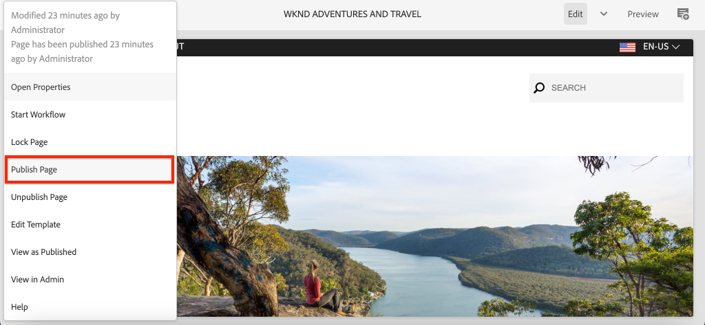

# 로컬 AEM 런타임 설정 {#set-up-local-aem-runtime}

>[!CONTEXTUALHELP]
>id="aemcloud_localdev_aemruntime"
>title="로컬 AEM 런타임"
>abstract="AEM(Adobe Experience Manager)은 AEM as a Cloud Service SDK의 Quickstart Jar를 사용하여 로컬에서 실행할 수 있습니다. 이 경우 개발자는 소스 제어에 커밋하기 전에 사용자 지정 코드, 구성 및 콘텐츠를 배포하고 테스트하고, AEM as a Cloud Service 환경에 배포할 수 있습니다."
>additional-url="https://experienceleague.adobe.com/docs/experience-manager-cloud-service/implementing/developing/aem-as-a-cloud-service-sdk.html" text="AEM as a Cloud Service SDK"
>additional-url="https://experience.adobe.com/#/downloads/content/software-distribution/en/aemcloud.html" text="AEM as a Cloud Service SDK 다운로드"

AEM(Adobe Experience Manager)은 AEM as a Cloud Service SDK의 Quickstart Jar를 사용하여 로컬에서 실행할 수 있습니다. 이 경우 개발자는 소스 제어에 커밋하기 전에 사용자 지정 코드, 구성 및 콘텐츠를 배포하고 테스트하고, AEM as a Cloud Service 환경에 배포할 수 있습니다.

참고 사항 `~` 는 사용자 디렉토리의 축약어로 사용됩니다. Windows에서는 다음과 같습니다 `%HOMEPATH%`.

## Java 설치

Experience Manager은 Java 애플리케이션이므로 개발 도구를 지원하도록 Java SDK가 필요합니다.

1. [최신 Java SDK 11 다운로드 및 설치](https://experience.adobe.com/#/downloads/content/software-distribution/en/general.html?1_group.propertyvalues.property=.%2Fjcr%3Acontent%2Fmetadata%2Fdc%3AsoftwareType&amp;1_group.propertyvalues.operation=equals&amp;1_group.propertyvalues.0_values=software-type%3Atologing&amp;fulltext=Oracle%7E+JDK%7E+11%7E&amp;orderby=%40jcr%3Acontent%3AlastModified&amp;orderby.sort=desc&amp;layout=0&amp;p.offset=0&amp;p.limit=0&amp;limit=1)
1. 명령을 실행하여 Java 11 SDK가 설치되어 있는지 확인합니다.
   + Windows:`java -version`
   + macOS / Linux: `java --version`


## AEM as a Cloud Service SDK 다운로드

AEM as a Cloud Service SDK 또는 AEM SDK에는 개발을 위해 AEM 작성자 및 게시를 로컬로 실행하는 데 사용되는 Quickstart Jar와 호환되는 Dispatcher 도구 버전이 포함되어 있습니다.

1. 에 로그인합니다. [https://experience.adobe.com/#/downloads](https://experience.adobe.com/#/downloads) Adobe ID 사용
   + Adobe 조직이 __반드시__ AEM as a Cloud Service SDK를 다운로드할 수 있는 AEM as a Cloud Service이 제공됩니다.
1. 로 이동합니다 __AEM as a Cloud Service__ 탭
1. 정렬 기준 __게시된 날짜__ in __내림차순__ 주문
1. 최신 항목을 클릭합니다. __AEM SDK__ 결과 행
1. EULA를 검토하고 수락한 후 __다운로드__ 버튼

## AEM SDK zip에서 Quickstart Jar 추출

1. 다운로드한 파일의 압축을 해제합니다 `aem-sdk-XXX.zip` 파일

## 로컬 AEM 작성자 서비스 설정{#set-up-local-aem-author-service}

로컬 AEM 작성자 서비스는 개발자에게 컨텐츠를 만들고 관리하기 위해 공유할 로컬 경험 디지털 마케터/컨텐츠 작성자가 공유하도록 제공합니다.  AEM 작성 서비스는 작성 및 미리 보기 환경으로 설계되었으므로, 기능 개발에 대한 대부분의 유효성 검사를 수행할 수 있으므로 로컬 개발 프로세스의 중요한 요소로 만듭니다.

1. 폴더를 만듭니다 `~/aem-sdk/author`
1. 를 복사합니다. __Quickstart JAR__ 파일 위치  `~/aem-sdk/author` 및 이름을 로 `aem-author-p4502.jar`
1. 명령줄에서 다음을 실행하여 로컬 AEM 작성자 서비스를 시작합니다.
   + `java -jar aem-author-p4502.jar`
      + 관리자 암호를 `admin`. 모든 관리자 암호는 사용할 수 있지만 로컬 개발에 기본값을 사용하여 다시 구성할 필요가 없습니다.

   사용자 *사용할 수 없음* AEM을 Cloud Service Quickstart Jar로 시작합니다. [두 번 클릭하여](#troubleshooting-double-click).
1. 에서 로컬 AEM 작성자 서비스에 액세스합니다 [http://localhost:4502](http://localhost:4502) 웹 브라우저에서

Windows:

```shell
$ mkdir -p c:\Users\<My User>\aem-sdk\author
$ copy aem-sdk-Quickstart-XXX.jar c:\Users\<My User>\aem-sdk\author\aem-author-p4502.jar
$ cd c:\Users\<My User>\aem-sdk\author
$ java -jar aem-author-p4502.jar
```

macOS / Linux:

```shell
$ mkdir -p ~/aem-sdk/author
$ cp aem-sdk-Quickstart-XXX.jar ~/aem-sdk/author/aem-author-p4502.jar
$ cd ~/aem-sdk/author
$ java -jar aem-author-p4502.jar
```

## 로컬 AEM 게시 서비스 설정

로컬 AEM 게시 서비스는 개발자에게 AEM에 호스팅된 웹 사이트 탐색과 같은 AEM의 로컬 경험 최종 사용자가 가질 수 있도록 제공합니다. 로컬 AEM 게시 서비스는 AEM SDK와 통합되므로 중요합니다 [Dispatcher 도구](./dispatcher-tools.md) 또한 개발자는 최종 최종 사용자 대면 경험을 테스트하고 미세 조정할 수 있습니다.

1. 폴더를 만듭니다 `~/aem-sdk/publish`
1. 를 복사합니다. __Quickstart JAR__ 파일 위치  `~/aem-sdk/publish` 및 이름을 로 `aem-publish-p4503.jar`
1. 명령줄에서 다음을 실행하여 로컬 AEM 게시 서비스를 시작합니다.
   + `java -jar aem-publish-p4503.jar`
      + 관리자 암호를 `admin`. 모든 관리자 암호는 사용할 수 있지만 로컬 개발에 기본값을 사용하여 다시 구성할 필요가 없습니다.

   사용자 *사용할 수 없음* AEM을 Cloud Service Quickstart Jar로 시작합니다. [두 번 클릭하여](#troubleshooting-double-click).
1. 에서 로컬 AEM 게시 서비스에 액세스합니다 [http://localhost:4503](http://localhost:4503) 웹 브라우저에서

Windows:

```shell
$ mkdir -p c:\Users\<My User>\aem-sdk\publish
$ copy aem-sdk-Quickstart-XXX.jar c:\Users\<My User>\aem-sdk\publish\aem-publish-p4503.jar
$ cd c:\Users\<My User>\aem-sdk\publish
$ java -jar aem-publish-p4503.jar
```

macOS / Linux:

```shell
$ mkdir -p ~/aem-sdk/publish
$ cp aem-sdk-Quickstart-XXX.jar ~/aem-sdk/publish/aem-publish-p4503.jar
$ cd ~/aem-sdk/publish
$ java -jar aem-publish-p4503.jar
```

## 사전 릴리스 모드에서 로컬 AEM 서비스 설정

로컬 AEM 런타임은에서 시작할 수 있습니다. [사전 릴리스 모드](https://experienceleague.adobe.com/docs/experience-manager-cloud-service/content/release-notes/prerelease.html) 개발자가 AEM as a Cloud Service의 다음 릴리스의 기능에 대해 빌드할 수 있도록 허용합니다. 사전 릴리스는 다음을 전달하여 활성화됩니다 `-r prerelease` 로컬 AEM 런타임의 첫 번째 시작에 대한 인수입니다. 로컬 AEM 작성자 및 AEM 게시 서비스 모두에서 사용할 수 있습니다.

```shell
# For AEM Author service in prerelease mode
$ java -jar aem-author-p4502.jar -r prerelease

# For AEM Publish service in prerelease mode
$ java -jar aem-publish-p4503.jar -r prerelease
```

## 컨텐츠 배포 시뮬레이션 {#content-distribution}

진정한 Cloud Service 환경 콘텐츠는 을 사용하여 작성 서비스에서 게시 서비스로 배포됩니다 [Sling 컨텐츠 배포](https://sling.apache.org/documentation/bundles/content-distribution.html) 및 Adobe 파이프라인. 다음 [Adobe 파이프라인](https://experienceleague.adobe.com/docs/experience-manager-cloud-service/core-concepts/architecture.html?lang=en#content-distribution) 는 클라우드 환경에서만 사용할 수 있는 분리된 마이크로 서비스입니다.

개발 중에 로컬 작성자 및 게시 서비스를 사용하여 컨텐츠 분포를 시뮬레이션하는 것이 좋을 수 있습니다. 이 작업은 기존 복제 에이전트를 활성화하여 수행할 수 있습니다.

>[!NOTE]
>
> 복제 에이전트는 로컬 Quickstart JAR에서만 사용할 수 있으며 컨텐츠 배포 시뮬레이션만 제공합니다.

1. 에 로그인합니다. **작성자** 서비스 및 탐색 [http://localhost:4502/etc/replication/agents.author.html](http://localhost:4502/etc/replication/agents.author.html).
1. 클릭 **기본 에이전트(게시)** 기본 복제 에이전트를 엽니다.
1. 클릭 **편집** 에이전트의 구성을 엽니다.
1. 아래에 **설정** 탭에서 다음 필드를 업데이트합니다.

   + **활성화됨** - true 확인
   + **에이전트 사용자 Id** - 이 필드를 비워 둡니다.

   

1. 아래에 **전송** 탭에서 다음 필드를 업데이트합니다.

   + **URI** - `http://localhost:4503/bin/receive?sling:authRequestLogin=1`
   + **사용자** - `admin`
   + **암호** - `admin`

   

1. 클릭 **확인** 구성을 저장하고 **기본값** 복제 에이전트.
1. 이제 작성 서비스에서 콘텐츠를 변경하고 게시 서비스에 게시할 수 있습니다.



## Quickstart Jar 시작 모드

Quickstart Jar 이름 지정, `aem-<tier>_<environment>-p<port number>.jar` 시작할 방법을 지정합니다. 특정 계층, 작성자 또는 게시에서 AEM을 시작한 후에는 대체 계층으로 변경할 수 없습니다. 이렇게 하려면 `crx-Quickstart` 첫 번째 실행 중에 생성된 폴더를 삭제해야 하며 Quickstart Jar를 다시 실행해야 합니다. 환경 및 포트는 변경할 수 있지만 로컬 AEM 인스턴스의 중지/시작은 필요합니다.

환경 변경, `dev`, `stage` 및 `prod`를 사용하면 개발자가 환경별 구성을 AEM에서 올바로 정의하고 확인할 수 있습니다. 로컬 개발을 주로 기본값에 대해 수행하는 것이 좋습니다 `dev` 환경 실행 모드.

사용 가능한 순열은 다음과 같습니다.

| Quickstart Jar 파일 이름 | 모드 설명 |
|------------------------------|-----------------------------------------------------------------------------|
| `aem-author-p4502.jar` | 포트 4502의 개발 실행 모드에서 작성자로 |
| `aem-author_dev-p4502.jar` | 포트 4502의 개발 실행 모드에서 작성자로(와 동일) `aem-author-p4502.jar`) |
| `aem-author_stage-p4502.jar` | 포트 4502에서 스테이징 실행 모드에서 작성자로 |
| `aem-author_prod-p4502.jar` | 포트 4502에서 프로덕션 실행 모드에서 작성자로 |
| `aem-publish-p4503.jar` | 포트 4503의 개발 실행 모드에서 게시로 |
| `aem-publish_dev-p4503.jar` | 포트 4503의 개발 실행 모드에서 게시로(와 동일) `aem-publish-p4503.jar`) |
| `aem-publish_stage-p4503.jar` | 포트 4503의 스테이징 실행 모드에서 게시로 |
| `aem-publish_prod-p4503.jar` | 포트 4503의 프로덕션 실행 모드에서 게시 |

포트 번호는 로컬 개발 시스템에서 사용 가능한 포트이지만 규칙에 따라 사용할 수 있습니다.

+ 포트 __4502년__ 에 사용됨 __로컬 AEM 작성자 서비스__
+ 포트 __4503년__ 에 사용됨 __로컬 AEM 게시 서비스__

이러한 변경 사항을 적용하려면 AEM SDK 구성을 조정해야 할 수 있습니다

## 로컬 AEM 런타임 중지

로컬 AEM 런타임을 중지하려면 AEM 작성자 또는 게시 서비스 중 하나를 선택하고, AEM 런타임을 시작하는 데 사용된 명령줄 창을 열고 를 탭합니다 `Ctrl-C`. AEM이 종료될 때까지 기다립니다. 종료 프로세스가 완료되면 명령줄 프롬프트를 사용할 수 있습니다.

## 선택적 로컬 AEM 런타임 설정 작업

+ __OSGi 구성 환경 변수 및 암호 변수__ is [AEM 로컬 런타임용으로 특별히 설정됨](https://experienceleague.adobe.com/docs/experience-manager-cloud-service/implementing/deploying/configuring-osgi.html#local-development)aio CLI를 사용하여 관리하는 대신

## Quickstart Jar를 업데이트해야 하는 경우

AEM SDK를 매월 또는 그 직후 매월 마지막 목요일에 업데이트할 수 있습니다. 이는 AEM as a Cloud Service &quot;기능 릴리스&quot;의 릴리스 케이던스입니다.

>[!WARNING]
>
> Quickstart Jar를 새 버전으로 업데이트해야 전체 로컬 개발 환경이 대체되므로 로컬 AEM 리포지토리의 모든 코드, 구성 및 컨텐츠가 손실됩니다. 파기하지 않아야 하는 모든 코드, 구성 또는 컨텐츠가 Git에 안전하게 커밋되거나 로컬 AEM 인스턴스에서 AEM 패키지로 내보내지지 않도록 합니다.

### AEM SDK를 업그레이드할 때 컨텐츠 손실을 방지하는 방법

AEM SDK를 업그레이드하면 새 저장소를 포함하여 완전히 새로운 AEM 런타임이 효과적으로 생성됩니다. 이는 이전 AEM SDK 리포지토리에 수행된 모든 변경 사항이 유실됨을 의미합니다. 다음은 AEM SDK 업그레이드 간 컨텐츠 지속을 지원하기 위한 실행 가능한 전략이며, 정확하게 사용하거나 함께 사용할 수 있습니다.

1. 개발에 도움이 되도록 &quot;샘플&quot; 컨텐츠를 포함하는 전용 컨텐츠 패키지를 만들어 Git에서 유지 관리합니다. AEM SDK 업그레이드를 통해 유지해야 하는 모든 컨텐츠는 이 패키지로 유지되며 AEM SDK를 업그레이드한 후 다시 배포됩니다.
1. 사용 [oak 업그레이드](https://jackrabbit.apache.org/oak/docs/migration.html) 사용 `includepaths` 지시어, 이전 AEM SDK 리포지토리의 컨텐츠를 새 AEM SDK 리포지토리에 복사합니다.
1. 이전 AEM SDK에서 AEM 패키지 관리자 및 컨텐츠 패키지를 사용하여 컨텐츠를 백업한 다음 새 AEM SDK에 다시 설치합니다.

위의 접근 방식을 사용하여 AEM SDK 업그레이드 간에 코드를 유지 관리하는 것은 개발 패턴 방지 를 나타냅니다. 일회용 코드는 배포 IDE에서 생성하여 AEM SDK로 전달해야 합니다.

## 문제 해결

### Quickstart Jar 파일을 두 번 클릭하면 오류가 발생합니다{#troubleshooting-double-click}

Quickstart Jar를 두 번 클릭하여 시작하면 AEM이 로컬로 시작되지 않도록 오류 모달이 표시됩니다.


AEM as a Cloud Service Quickstart Jar에서 Quickstart Jar를 두 번 클릭해도 AEM을 로컬에서 시작할 수 없기 때문입니다. 대신 해당 명령줄에서 Jar 파일을 실행해야 합니다.

AEM 작성자 서비스를 시작하려면 다음을 수행하십시오. `cd` quickstart Jar가 포함된 디렉토리로 이동하여 다음 명령을 실행합니다.

`$ java -jar aem-author-p4502.jar`

또는 AEM 게시 서비스를 시작하려면 다음을 수행하십시오. `cd` quickstart Jar가 포함된 디렉토리로 이동하여 다음 명령을 실행합니다.

`$ java -jar aem-publish-p4503.jar`

### 명령줄에서 Quickstart Jar를 시작하면 즉시 중단됩니다{#troubleshooting-java-8}

명령줄에서 Quickstart Jar를 시작할 때 프로세스가 즉시 중단되고 AEM 서비스가 시작되지 않으며 다음 오류가 발생합니다.

```shell
➜  ~/aem-sdk/author: java -jar aem-author-p4502.jar
Loading quickstart properties: default
Loading quickstart properties: instance
java.lang.Exception: Quickstart requires a Java Specification 11 VM, but your VM (Java HotSpot(TM) 64-Bit Server VM / Oracle Corporation) reports java.specification.version=1.8
  at com.adobe.granite.quickstart.base.impl.Main.checkEnvironment(Main.java:1046)
  at com.adobe.granite.quickstart.base.impl.Main.<init>(Main.java:646)
  at com.adobe.granite.quickstart.base.impl.Main.main(Main.java:981)
Quickstart: aborting
```

이것은 AEM as a Cloud Service이 Java SDK 11을 필요로 하며 다른 버전을 실행 중이며 대부분 Java 8일 수 있기 때문입니다. 이 문제를 해결하려면 다운로드하여 설치합니다 [Oracle Java SDK 11](https://experience.adobe.com/#/downloads/content/software-distribution/en/general.html?1_group.propertyvalues.property=.%2Fjcr%3Acontent%2Fmetadata%2Fdc%3AsoftwareType&amp;1_group.propertyvalues.operation=equals&amp;1_group.propertyvalues.0_values=software-type%3Atologing&amp;fulltext=Oracle%7E+JDK%7E+11%7E&amp;orderby=%40jcr%3Acontent%3AlastModified&amp;orderby.sort=desc&amp;layout=0&amp;p.offset=0&amp;p.limit=0&amp;limit=1).
Java SDK 11이 설치되면 명령줄에서 다음을 실행하여 활성 버전인지 확인합니다.

Java 11 SDK가 설치되면 명령줄에서 명령을 실행하여 활성 버전인지 확인합니다.

+ Windows: `java -version`
+ macOS / Linux: `java --version`

## 추가 리소스

+ [AEM SDK 다운로드](https://experience.adobe.com/#/downloads)
+ [Adobe Cloud Manager](https://my.cloudmanager.adobe.com/)
+ [Docker 다운로드](https://www.docker.com/)
+ [Experience Manager Dispatcher 설명서](https://experienceleague.adobe.com/docs/experience-manager-dispatcher/using/dispatcher.html?lang=ko-KR)
