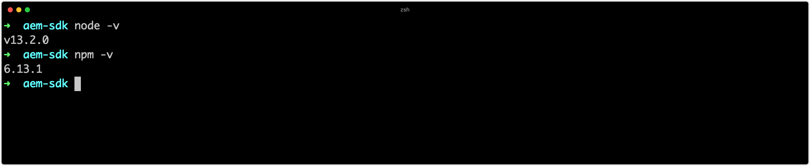

# 개발 도구 설정

Adobe Experience Manager(AEM) 개발을 위해서는 개발자 시스템에 최소한의 개발 도구를 설치하고 설정해야 합니다. 이러한 도구는 AEM 프로젝트의 개발 및 구축을 지원합니다.

사용자 디렉토리 `~` 의 약칭으로 사용됩니다. Windows의 경우 이 값은 `%HOMEPATH%`

## Java 설치

Experience Manager은 Java 애플리케이션이므로 Java SDK가 개발 및 AEM을 Cloud Service SDK로 지원해야 합니다.

1. [최신 릴리스 Java 11 SDK 다운로드 및 설치](https://experience.adobe.com/#/downloads/content/software-distribution/en/general.html?1_group.propertyvalues.property=.%2Fjcr%3Content%2Fmetadata%2Fdc%3AssoftwareType&amp;1_group.propertyvalues.operation=equals&amp;1_group.propertyvalues.0_values=software-type%3Atfoling&amp;fulltext=Oracle%7E+JDK%7E&amp;orderby%444 0jcr%3Acontent%2Fjcr%3AlastModified&amp;orderby.sort=desc&amp;layout=list&amp;p.offset=0&amp;p.limit=14)
1. 다음 명령을 실행하여 Java 11 SDK가 설치되어 있는지 확인합니다.
   + Windows: `java -version`
   + macOS/Linux: `java --version`

## Homebrew 설치

_Homebrew는 선택 사항이지만 권장됩니다._

Homebrew는 macOS, Windows 및 Linux용 오픈 소스 패키지 관리자입니다. 모든 지원 도구는 별도로 설치할 수 있으며 Homebrew는 Experience Manager 개발에 필요한 다양한 개발 도구를 편리하게 설치하고 업데이트할 수 있는 방법을 제공합니다.

1. 터미널 열기
1. 다음 명령을 실행하여 Homebrew가 이미 설치되어 있는지 확인합니다. `brew --version`.
1. Homebrew가 설치되지 않은 경우 Homebrew를 설치합니다
   + [macOS에 Homebrew 설치](https://brew.sh/)
      + macOS에서 Homebrew를 사용하려면 [Xcode](https://apps.apple.com/us/app/xcode/id497799835) 또는 [Command Line Tools](https://developer.apple.com/download/more/)가 필요합니다. 다음 명령을 통해 설치할 수 있습니다.
         + `xcode-select --install`
   + [Linux에 Homebrew 설치](https://docs.brew.sh/Installation#linux-or-windows-10-subsystem-for-linux)
   + [Windows 10에 Homebrew 설치](https://docs.brew.sh/Installation#linux-or-windows-10-subsystem-for-linux)
1. 다음 명령을 실행하여 Homebrew가 설치되었는지 확인합니다. `brew --version`

Homebrew를 사용하는 경우 아래 섹션에 있는 __Homebrew를 사용하여__ 설치 지침을 따르십시오. Homebrew를 사용하고 __있지__ 않은 경우 OS별 링크를 사용하여 도구를 설치합니다.

## Git 설치

[Git](https://git-scm.com/) 은 [Adobe Cloud Manager](https://docs.adobe.com/content/help/en/experience-manager-cloud-manager/using/requirements/source-code-repository.html)에서 사용하는 소스 제어 관리 시스템이므로 개발에 필요합니다.

+ Homebrew를 사용하여 Git 설치
   1. 터미널/명령 프롬프트 열기
   1. 명령을 실행합니다. `brew install git`
   1. 다음 명령을 사용하여 Git이 설치되었는지 확인합니다. `git --version`
+ 또는 Git(macOS, Linux 또는 Windows) 다운로드 및 설치
   1. [Git 다운로드 및 설치](https://git-scm.com/downloads)
   1. 터미널/명령 프롬프트 열기
   1. 다음 명령을 사용하여 Git이 설치되었는지 확인합니다. `git --version`

## Node.js(및 npm) 설치{#node-js}

[Node.js](https://nodejs.org) 는 AEM 프로젝트의 __ui.frontend 하위 프로젝트의 프런트 엔드 에셋을 사용하는 데 사용되는 JavaScript__ 런타임 환경입니다. Node.js는 JavaScript 종속성을 관리하는 데 사용되는 사실상의 [Node.js 패키지 관리자인 npm](https://www.npmjs.com/)과 함께 배포됩니다.

+ Homebrew를 사용하여 Node.js 설치
   1. 터미널/명령 프롬프트 열기
   1. 명령을 실행합니다. `brew install node`
   1. 다음 명령을 사용하여 Node.js가 설치되었는지 확인합니다. `node -v`
   1. npm이 설치되어 있는지 확인합니다. `npm -v`
+ 또는 Node.js(macOS, Linux 또는 Windows) 다운로드 및 설치
   1. [Node.js 다운로드 및 설치](https://nodejs.org/en/download/)
   1. 터미널/명령 프롬프트 열기
   1. 다음 명령을 사용하여 Node.js가 설치되었는지 확인합니다. `node -v`
   1. npm이 설치되어 있는지 확인합니다. `npm -v`

>[!TIP]
> [AEM Project Tranype](https://github.com/adobe/aem-project-archetype)기반의 AEM Projects는 구축 시 Node.js의 격리된 버전을 설치합니다. AEM Maven 프로젝트의 Reactor pom.xml에 지정된 Node.js 및 npm 버전과 로컬 개발 시스템의 버전을 동기화(또는 가까운)하는 것이 좋습니다.
Node.js 및 npm 빌드 버전을 찾을 위치에 대해서는 이 [예 AEM Project Reactor pom.xml](https://github.com/adobe/aem-guides-wknd/blob/9ac94f3f40c978a53ec88fae79fbc17dd2db72f2/pom.xml#L117-L118) 을 참조하십시오.

## Maven 설치

Apache Maven은 AEM Project Maven Tranype에서 생성된 AEM 프로젝트를 구축하는 데 사용되는 오픈 소스 Java 명령줄 도구입니다. 모든 주요 IDE([IntelliJ IDEA](https://www.jetbrains.com/idea/), [Visual Studio 코드](https://code.visualstudio.com/), [Eclipse](https://www.eclipse.org/)등) Maven이 통합되어 있습니다.

+ Homebrew를 사용하여 Maven 설치
   1. 터미널/명령 프롬프트 열기
   1. 명령을 실행합니다. `brew install maven`
   1. 다음 명령을 사용하여 Maven이 설치되어 있는지 확인합니다. `mvn -v`
+ 또는 Maven(macOS, Linux 또는 Windows)을 다운로드하여 설치하십시오.
   1. [Maven 다운로드](https://maven.apache.org/download.cgi)
   1. [Maven 설치](https://maven.apache.org/install.html)
   1. 터미널/명령 프롬프트 열기
   1. 다음 명령을 사용하여 Maven이 설치되어 있는지 확인합니다. `mvn -v`

## Adobe I/O CLI 설정{#aio-cli}

Adobe [I/O CLI](https://github.com/adobe/aio-cli)또는 `aio`Cloud Manager 및 Asset Compute를 비롯한 다양한 Adobe 서비스에 대한 명령줄 액세스  를 [제공합니다](https://github.com/adobe/aio-cli-plugin-asset-compute). Adobe I/O CLI는 개발자에게 다음과 같은 기능을 제공할 수 있기 때문에 AEM에서 Cloud Service으로 개발 시 중요한 역할을 합니다.

+ Cloud Services 서비스로 AEM에서 정보 기록
+ CLI에서 Cloud Manager 파이프라인 관리

### Adobe I/O CLI 설치

1. Adobe [I/O CLI가 npm 모듈이므로 Node.js가 설치되어](#node-js) 있는지 확인
   + 실행을 `node --version` 통해 확인
1. 실행 `npm install -g @adobe/aio-cli` 을 실행하여 전역 `aio` npm 모듈 설치

### Adobe I/O CLI Cloud Manager 플러그인 설정{#aio-cloud-manager}

Adobe I/O Cloud Manager 플러그인을 사용하면 aio CLI가 `aio cloudmanager` 명령을 통해 Adobe Cloud Manager와 상호 작용할 수 있습니다.

1. 실행 `aio plugins:install @adobe/aio-cli-plugin-cloudmanager` 을 실행하여 [Cloud Manager 플러그인을 설치합니다](https://github.com/adobe/aio-cli-plugin-cloudmanager).

### Adobe I/O CLI Asset Compute plugin 설정{#aio-asset-compute}

Adobe I/O Cloud Manager 플러그인을 사용하면 aio CLI가 명령을 통해 Asset Compute workers를 생성하고 실행할 수 `aio asset-compute` 있습니다.

1. 실행 `aio plugins:install @adobe/aio-cli-plugin-cloudmanager` 을 실행하여 [aio Asset Compute 플러그인을 설치합니다](https://github.com/adobe/aio-cli-plugin-asset-compute).

### Adobe I/O CLI 인증 설정

Adobe I/O CLI가 Cloud Manager와 통신하려면 Adobe I/O 콘솔에서 Cloud Manager 통합을 만들어야 하며 인증을 성공적으로 수행하려면 자격 증명을 받아야 합니다.

>[!VIDEO](https://video.tv.adobe.com/v/35094?quality=12&learn=on)

1. console. [adobe.io에 로그인](https://console.adobe.io)
1. 연결할 클라우드 관리자 제품이 포함된 조직이 Adobe 조직 전환기에서 활성화되어 있는지 확인합니다.
1. 새 [Adobe I/O 프로그램을 만들거나 기존 I/O 프로그램 열기](https://www.adobe.io/apis/experienceplatform/console/docs.html#!AdobeDocs/adobeio-console/master/projects.md)
   + Adobe I/O 콘솔 프로그램은 통합 관리 방법에 따라 통합, 생성 또는 사용 및 기존 프로그램의 구성입니다
   + 새 프로젝트를 만드는 경우 메시지가 표시되면(템플릿에서 만드는 경우와 비교) &quot;빈 프로젝트&quot;를 선택합니다
   + Adobe I/O 콘솔 프로그램은 Cloud Manager 프로그램의 개념과 다릅니다
1. &quot;개발자 - Cloud Service&quot; 프로파일과 새로운 Cloud Manager API 통합 만들기
1. Adobe I/O CLI의 config.json을 채우려면 JWT(서비스 계정) 자격 증명을 [얻습니다.](https://github.com/adobe/aio-cli-plugin-cloudmanager#authentication)
1. Adobe I/O CLI로 `config.json` 파일 로드
   + `$ aio config:set jwt-auth PATH_TO_CONFIG_JSON_FILE --file --json`
1. Adobe I/O CLI로 `private.key` 파일 로드
   + `$ aio config:set jwt-auth.jwt_private_key PATH_TO_PRIVATE_KEY_FILE --file`

Adobe [I/O CLI를 통해 Cloud Manager에 대한 명령](https://github.com/adobe/aio-cli-plugin-cloudmanager#commands) 실행을 시작합니다.

## 개발 IDE 설정

AEM 개발은 주로 Java 및 프런트 엔드(JavaScript, CSS 등) 개발 및 XML 관리로 구성됩니다. 다음은 AEM 개발에 가장 인기 있는 IDE입니다.

### IntelliJ IDEA

__[IntelliJ IDEA는](https://www.jetbrains.com/idea/)__ Java 개발을 위한 강력한 IDE입니다. IntelliJ IDEA는 무료 커뮤니티 에디션과 상업용(유료) Ultimate 버전으로 제공됩니다. 무료 커뮤니티 버전은 AEM 개발에 충분하지만 Ultimate는 기능 세트를 [확장합니다](https://www.jetbrains.com/idea/download).

>[!VIDEO](https://video.tv.adobe.com/v/26089/?quality=12&learn=on)

+ [IntelliJ IDEA 다운로드](https://www.jetbrains.com/idea/download)
+ [보고서 도구 다운로드](https://github.com/Adobe-Marketing-Cloud/tools/tree/master/repo#installation)

### Microsoft Visual Studio 코드

__[Visual Studio 코드](https://code.visualstudio.com/)__ (VS 코드)는 프런트 엔드 개발자를 위한 무료 오픈 소스 도구입니다. Visual Studio 코드는 Adobe 도구, __[repo의 도움으로 AEM과 컨텐츠 동기화를 통합하도록 설정할 수 있습니다](https://github.com/Adobe-Marketing-Cloud/tools/tree/master/repo#integration-into-visual-studio-code)__.

Visual Studio 코드는 프런트 엔드 개발자에게 주로 프런트 엔드 코드를 생성하는 데 이상적인 제품입니다.JavaScript, CSS 및 HTML VS 코드에는 [확장을 통한](https://code.visualstudio.com/docs/java/java-tutorial)Java 지원이 있지만, 더 많은 Java에 따라 제공되는 고급 기능 중 일부가 부족할 수 있습니다.

>[!VIDEO](https://video.tv.adobe.com/v/25907?quality=12&learn=on)

+ [Visual Studio 코드 다운로드](https://code.visualstudio.com/Download)
+ [보고서 도구 다운로드](https://github.com/Adobe-Marketing-Cloud/tools/tree/master/repo#integration-into-visual-studio-code)
+ [VS 코드 확장 다운로드](https://aemfed.io/)
+ [AEM Sync VS 코드 확장 다운로드](https://marketplace.visualstudio.com/items?itemName=Yinkai15.aemsync)

### Eclipse

__[Eclipse IDE는](https://www.eclipse.org/ide/)__ Java 개발을 위해 널리 사용되는 IDE로, Adobe에서 제공하는 __[AEM 개발자 툴](https://eclipse.adobe.com/aem/dev-tools/)__ 플러그인을 지원하므로, 저작을 위한 인IDE GUI를 제공하고 JCR 컨텐츠를 로컬 AEM 인스턴스와 동기화할 수 있습니다.

>[!VIDEO](https://video.tv.adobe.com/v/25906?quality=12&learn=on)

+ [Eclipse 다운로드](https://www.eclipse.org/ide/)
+ [Eclipse 개발 도구 다운로드](https://eclipse.adobe.com/aem/dev-tools/)
