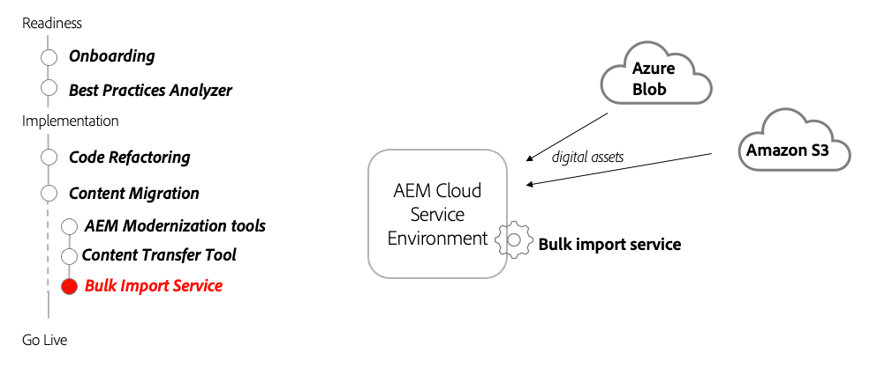

# 일괄 가져오기 서비스

AEM as a Cloud Service의 일괄 가져오기 서비스 를 사용하여 AEM이 아닌 소스에서 에셋을 가져오는 방법에 대해 알아봅니다.

>[!VIDEO](https://video.tv.adobe.com/v/336969?quality=12&learn=on)

## 일괄 가져오기 서비스 사용

일괄 가져오기 서비스는 Azure Blob Storage 또는 Amazon S3 저장소에 저장된 파일을 자산으로 AEM as a Cloud Service에 전송하는 데 사용됩니다.

>[!TIP]
>
> 이 비디오의 입력 소스에는 Azure Blob Storage 및 Amazon S3만 표시되지만 사용 가능한 소스는 시간이 지남에 따라 계속 증가합니다. 지원되는 입력 소스의 전체 목록에 대해서는 제품에서 사용 가능한 옵션 또는 [설명서](https://experienceleague.adobe.com/docs/experience-manager-cloud-service/content/assets/manage/add-assets.html#bulk-upload)를 참조하십시오.

## 주요 활동

+ 가져올 파일을 클라우드 스토리지 공급자에 업로드합니다.
+ AEM as a Cloud Service 작성자 서비스에서 일괄 가져오기 서비스를 구성하고 실행합니다.
+ 일괄 서비스 가져오기를 일회성 가져오기로 실행하거나 정기적 가져오기를 예약합니다.

## 기타 리소스

+ [일괄 가져오기 서비스 구성 옵션](https://experienceleague.adobe.com/docs/experience-manager-cloud-service/content/assets/manage/add-assets.html#configure-bulk-ingestor-tool)
+ 자산 수집의 [Adobe Developers Live 세션](https://experienceleague.adobe.com/docs/adobe-developers-live-events/events/2021/feb2021/asset-bulk-ingestion.html)

