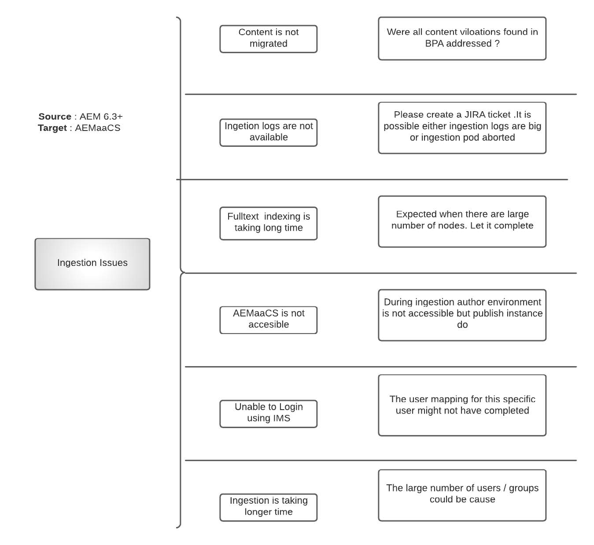

# AEM as a Cloud Service 콘텐츠 마이그레이션 FAQ

AEM으로의 콘텐츠 마이그레이션에 대한 FAQ에 대한 답변을 as a Cloud Service으로 제공합니다.

## 용어

+ **AEMaaCS**: [AEM as a Cloud Service](https://experienceleague.adobe.com/docs/experience-manager-cloud-service/content/overview/introduction.html)
+ **BPA**: [모범 사례 분석기](https://experienceleague.adobe.com/docs/experience-manager-cloud-service/content/migration-journey/cloud-migration/best-practices-analyzer/overview-best-practices-analyzer.html)
+ **CTT**: [컨텐츠 전송 도구](https://experienceleague.adobe.com/docs/experience-manager-cloud-service/content/migration-journey/cloud-migration/content-transfer-tool/overview-content-transfer-tool.html)
+ **캠**: [Cloud Acceleration Manager](https://experienceleague.adobe.com/docs/experience-manager-cloud-service/content/migration-journey/cloud-acceleration-manager/using-cam/getting-started-cam.html)
+ **IMS**: [Identity Management 시스템](https://experienceleague.adobe.com/docs/experience-manager-cloud-service/content/security/ims-support.html)
+ **DM**: [Dynamic Media](https://experienceleague.adobe.com/docs/experience-manager-cloud-service/content/assets/dynamicmedia/dm-journey/dm-journey-part1.html)

CTT 관련 Adobe 지원 티켓을 만드는 동안 자세한 내용을 제공하려면 아래 템플릿을 사용하십시오.

 { align=&quot;center&quot; }

## 일반 콘텐츠 마이그레이션 질문

### Q: 콘텐츠를 Cloud Service으로 AEM에 마이그레이션하는 다양한 방법은 무엇입니까?

세 가지 다른 방법을 사용할 수 있습니다

+ 컨텐츠 전송 도구 사용(AEM 6.3 이상 → AEMaaCS)
+ 패키지 관리자를 통해(AEM → AEMaaCS)
+ Assets(S3/Azure → AEMaaCS)에 대한 기본 제공 일괄 가져오기 서비스

### 질문: CTT를 사용하여 전송할 수 있는 콘텐츠 양에 제한이 있습니까?

아니. 도구로서의 CTT는 AEM 소스에서 추출하여 AEMaaCS로 수집할 수 있습니다. 그러나 AEMaaCS 플랫폼에는 마이그레이션 전에 고려해야 하는 특정 제한이 있습니다.

자세한 내용은 다음을 참조하십시오. [클라우드 마이그레이션 사전 요구 사항](https://experienceleague.adobe.com/docs/experience-manager-cloud-service/content/migration-journey/cloud-migration/content-transfer-tool/prerequisites-content-transfer-tool.html).

### Q: 소스 시스템의 최신 BPA 보고서가 있습니다. 이 보고서를 어떻게 해야 합니까?

보고서를 CSV로 내보낸 다음 Cloud Acceleration Manager에 업로드합니다. [IMS 조직과 연계됨](https://experienceleague.adobe.com/docs/experience-manager-cloud-service/content/migration-journey/cloud-acceleration-manager/using-cam/getting-started-cam.html). 그런 다음 검토 프로세스를 다음과 같이 진행합니다. [준비 단계에 요약됨](https://experienceleague.adobe.com/docs/experience-manager-cloud-service/content/migration-journey/cloud-acceleration-manager/using-cam/cam-readiness-phase.html).

도구에서 제공하는 코드 및 콘텐츠 복잡성 평가를 검토하고 코드 리팩터링 백로그 또는 클라우드 마이그레이션 평가를 초래하는 관련 작업 항목을 기록해 두십시오.

### Q: 소스 작성자에서 를 추출하고 AEMaaCS 작성자 및 게시로 수집하는 것이 권장됩니까?

작성자와 게시 계층 간에 1:1 추출 및 수집을 수행하는 것이 항상 좋습니다. 소스 프로덕션 작성자를 추출하여 Dev, Stage 및 Production CS로 수집하는 것은 허용됩니다.

### Q: CTT를 사용하여 소스 AEM에서 AEMaaCS로 콘텐츠를 마이그레이션하는 데 걸리는 시간을 예상할 수 있는 방법이 있습니까?

마이그레이션 프로세스는 인터넷 밴드 너비, CTT 프로세스에 할당된 힙, 사용 가능한 메모리, 각 소스 시스템의 주관적인 디스크 IO에 따라 다르므로 마이그레이션 입증을 초기에 실행하고 해당 데이터 포인트를 추정치를 추정하는 것이 좋습니다.

### Q: CTT 추출 프로세스를 시작할 때 소스 AEM 성능에 어떤 영향을 줍니까?

CTT 도구는 OSGi 구성을 통해 구성할 수 있는 최대 4GB의 힙을 사용하는 자체 Java™ 프로세스에서 실행됩니다. 이 숫자는 변경될 수 있지만 Java™ 프로세스에 대해 grep하고 확인할 수 있습니다.

AZCopy가 설치되어 있거나 사전 복사 옵션/유효성 검사 기능이 활성화된 경우 AZCopy 프로세스는 CPU 주기를 사용합니다.

jvm 외에도 이 도구는 디스크 IO를 사용하여 전환 임시 공간에 데이터를 저장하며 추출 주기 후 정리됩니다. RAM, CPU 및 디스크 IO 외에도 CTT 도구는 소스 시스템의 네트워크 밴드 너비를 사용하여 데이터를 Azure Blob Store에 업로드합니다.

CTT 추출 프로세스에 사용되는 리소스의 양은 노드 수, Blob 수 및 집계된 크기에 따라 다릅니다. 수식을 제공하기 어렵기 때문에 소규모 마이그레이션 증명을 실행하여 소스 서버의 용량 증가 요구 사항을 확인하는 것이 좋습니다.

클론 환경이 마이그레이션에 사용되는 경우 라이브 프로덕션 서버 리소스 사용률에 영향을 미치지 않지만 라이브 프로덕션과 클론 간 컨텐츠 동기화에 대한 나름의 단점이 있습니다

### Q: CTT의 컨텍스트에서 &quot;지우기&quot;와 &quot;덮어쓰기&quot;라는 용어는 무엇을 의미합니까?

의 맥락에서 [추출 단계](https://experienceleague.adobe.com/docs/experience-manager-cloud-service/content/migration-journey/cloud-migration/content-transfer-tool/getting-started-content-transfer-tool.html?lang=en#extraction-setup-phase), 옵션은 이전 추출 주기에서 스테이징 컨테이너의 데이터를 덮어쓰거나 차등(추가/업데이트/삭제)을 추가합니다. 스테이징 컨테이너는 아무것도 아니지만 마이그레이션 세트와 연결된 Blob 저장소 컨테이너입니다. 각 마이그레이션 세트는 고유한 스테이징 컨테이너를 가져옵니다.

의 맥락에서 [수집 단계](https://experienceleague.adobe.com/docs/experience-manager-cloud-service/content/migration-journey/cloud-migration/content-transfer-tool/ingesting-content.html), AEMaaCS의 전체 콘텐츠 저장소를 대체하거나 스테이징 마이그레이션 컨테이너에서 차등(추가/업데이트/삭제) 콘텐츠를 동기화하는 옵션은 +입니다.

### Q: 소스 시스템에는 여러 웹 사이트, 관련 에셋, 사용자, 그룹이 있습니다. AEMaaCS로 단계적으로 마이그레이션할 수 있습니까?

예, 가능하지만 다음 사항에 대한 신중한 계획이 필요합니다.

+ 사이트를 가정하고 마이그레이션 세트를 만들면 에셋이 해당 계층으로 이동합니다
   + 모든 에셋을 하나의 마이그레이션 세트의 일부로 마이그레이션하는 것이 허용되는지 확인한 다음 이를 사용하는 사이트를 단계적으로 가져옵니다
+ 현재 상태에서는 게시 계층이 콘텐츠를 제공할 수 있더라도 작성자 수집 프로세스를 통해 콘텐츠 작성에 작성자 인스턴스를 사용할 수 없습니다
   + 즉, 작성자에 수집이 완료될 때까지 콘텐츠 작성 활동이 동결됩니다
+ 그룹은 다음과 같지만 사용자는 더 이상 마이그레이션되지 않습니다.

마이그레이션을 계획하기 전에 문서화된 대로 추출 및 수집 프로세스 추가 를 검토하십시오.

### Q: AEMaaCS 작성자 또는 게시 인스턴스에서 수집이 발생하고 있어도 최종 사용자가 내 웹 사이트를 사용할 수 있습니까?

예. 최종 사용자 트래픽은 컨텐츠 마이그레이션 작업으로 인해 중단되지 않습니다. 단, 작성자 수집은 완료될 때까지 콘텐츠 작성을 중지합니다.

### Q: BPA 보고서에는 누락된 원본 렌디션과 관련된 항목이 표시됩니다. 추출하기 전에 원천 세척해야 하나요?

예. 원본 렌디션이 누락되었다는 것은 에셋 바이너리가 애초에 제대로 업로드되지 않았다는 것을 의미합니다. 잘못된 데이터로 간주하여 필요한 경우 패키지 관리자를 사용하여 백업을 검토하고 소스 AEM에서 제거한 후 추출을 실행하십시오. 잘못된 데이터는 에셋 처리 단계에 부정적인 결과를 갖게 됩니다.

### Q: BPA 보고서에 누락과 관련된 항목이 있습니다 `jcr:content` 폴더 노드. 어떻게 해야 하나요?

날짜 `jcr:content` 은(는) 폴더 수준, 처리 프로필 등과 같은 설정을 전달하는 모든 작업에서 누락됩니다. 부모로부터 받는 것이 이 수준에서 깨질 것이다. 누락된 이유를 검토해 주십시오. `jcr:content`. 이러한 폴더는 마이그레이션할 수 있지만 사용자 환경이 저하되고 나중에 불필요한 문제 해결 주기가 발생할 수 있습니다.

### Q: 마이그레이션 세트를 만들었습니다. 사이즈 확인이 가능한가요?

예, 다음 항목이 있습니다. [크기 확인](https://experienceleague.adobe.com/docs/experience-manager-cloud-service/content/migration-journey/cloud-migration/content-transfer-tool/getting-started-content-transfer-tool.html#migration-set-size) ctt의 일부인 피쳐입니다.

### Q: 마이그레이션(추출, 수집)을 수행하고 있습니다. 추출된 모든 콘텐츠가 타겟에 수집되는지 확인할 수 있습니까?

예, 다음 항목이 있습니다. [유효성 검사](https://experienceleague.adobe.com/docs/experience-manager-cloud-service/content/migration-journey/cloud-migration/content-transfer-tool/validating-content-transfers.html) CTT의 일부인 피쳐입니다.

### Q: 내 고객은 AEMaaCS Dev에서 AEMaaCS Stage 또는 AEMaaCS Prod와 같은 AEMaaCS 환경 간에 콘텐츠를 이동해야 합니다. 이러한 사용 사례에 콘텐츠 전송 도구를 사용할 수 있습니까?

불행히도, 아닙니다. CTT의 사용 사례는 온-프레미스/AMS 호스팅 AEM 6.3+ 소스에서 AEMaaCS 클라우드 환경으로 콘텐츠를 마이그레이션하는 것입니다. [CTT 설명서를 참조하십시오.](https://experienceleague.adobe.com/docs/experience-manager-cloud-service/content/migration-journey/cloud-migration/content-transfer-tool/overview-content-transfer-tool.html).

### 질문: 추출 중에 예상되는 문제는 무엇입니까?

추출 단계는 예상대로 작동하는 여러 측면을 필요로 하는 관련 프로세스입니다. 발생할 수 있는 다양한 종류의 문제와 이를 완화하는 방법에 대해 알아두면 콘텐츠 마이그레이션의 전반적인 성공률이 높아집니다.

공개 설명서는 학습을 기반으로 지속적으로 개선되지만, 여기에는 몇 가지 높은 수준의 문제 범주와 가능한 기본 이유가 있습니다.

 { align=&quot;center&quot; }

### 질문: 수집 중에 예상되는 문제는 무엇입니까?

수집 단계는 클라우드 플랫폼에서 완전히 수행되며 AEMaaCS 인프라에 액세스할 수 있는 리소스의 도움이 필요합니다. 도움이 더 필요하면 지원 티켓을 만드십시오.

가능한 문제 범주는 다음과 같습니다(제외 목록으로 간주하지 마십시오).

 { align=&quot;center&quot; }

### Q: CTT가 작동하려면 소스 서버에 아웃바운드 인터넷 연결이 있어야 합니까?

간단한 대답은 &quot;**예**&quot;.

CTT 프로세스에는 아래 리소스에 대한 연결이 필요합니다.

+ 대상 AEM as a Cloud Service 환경: `author-p<program_id>-e<env_id>.adobeaemcloud.com`
+ Azure Blob 스토리지 서비스: `casstorageprod.blob.core.windows.net`

에 대한 자세한 내용은 설명서 를 참조하십시오 [소스 연결](https://experienceleague.adobe.com/docs/experience-manager-cloud-service/content/migration-journey/cloud-migration/content-transfer-tool/getting-started-content-transfer-tool.html#source-environment-connectivity).

## 에셋 처리 Dynamic Media 관련 질문

### Q: AEMaaCS에서 에셋을 수집한 후 자동으로 재처리됩니까?

아니. 자산을 처리하려면 재처리 요청이 시작되어야 합니다.

### Q: AEMaaCS에서 수집 후 자산이 자동으로 다시 인덱싱됩니까?

예. 자산은 AEMaaCS에서 사용할 수 있는 색인 정의에 따라 다시 색인화됩니다.

### Q: 소스 AEM은 Dynamic Media과 통합되었습니다. 콘텐츠 마이그레이션 전에 고려해야 할 구체적인 사항이 있습니까?

예. 소스 AEM에 Dynamic Media 통합이 있는 경우 다음 사항을 고려하십시오.

+ AEMaaCS는 Dynamic Media Scene7 모드만 지원합니다. 소스 시스템이 하이브리드 모드에 있는 경우 Scene7 모드로의 DM 마이그레이션이 필요합니다.
+ 소스 클론 인스턴스에서 마이그레이션하는 방법이라면 CTT에 사용할 클론에서 DM 통합을 비활성화하는 것이 안전합니다. 이 단계는 DM에 대한 쓰기를 방지하거나 DM 트래픽에 대한 로드를 방지하기 위한 것입니다.
+ CTT는 소스 AEM에서 AEMaaCS로 마이그레이션 세트의 메타데이터인 노드를 마이그레이션합니다. DM에서 직접 작업을 수행하지 않습니다.

### Q: 소스 AEM에 DM 통합이 있을 때 다른 마이그레이션 접근 방식은 무엇입니까?

위의 질문과 답변을 미리 읽어주시기 바랍니다

(두 가지 가능한 옵션이지만 이 두 가지 옵션에만 국한되지는 않습니다.) 고객이 UAT에 어떻게 접근하고자 하는지, 성능 테스트, 사용 가능한 환경 및 클론을 마이그레이션에 사용하는지 여부에 따라 다릅니다. 이 두 가지를 논의의 출발점으로 삼아주세요

**옵션 1**

소스 환경의 자산/노드 수가 하단(~100K)에 있는 경우, 추출 및 수집을 포함하여 24 + 72시간 동안 마이그레이션할 수 있다고 가정할 때 더 나은 접근 방식이 제공됩니다.

+ 프로덕션에서 직접 마이그레이션 수행
+ 다음을 사용하여 AEMaaCS로 초기 추출 및 수집 실행 `wipe=true`
   + 이 단계에서는 모든 노드 및 바이너리를 마이그레이션합니다.
+ 온-프레미스/AMS Prod 작성자 작업 계속
+ 이제부터 다음을 사용하여 다른 모든 마이그레이션 증명 주기를 실행합니다. `wipe=true`
   + 이 작업은 전체 노드 저장소를 마이그레이션하지만 전체 Blob이 아닌 수정된 Blob만 마이그레이션합니다. 대상 AEMaaCS 인스턴스의 Azure blob 저장소에 이전 Blob 집합이 있습니다.
   + 이 마이그레이션 증명을 사용하여 마이그레이션 기간 측정, 테스트, 기타 모든 기능 검증
+ 마지막으로 Go-Live가 있는 주 전에 Wipe=true 마이그레이션을 수행합니다.
   + AEMaaCS에서 Dynamic Media 연결
   + AEM 온-프레미스 소스에서 DM 구성 연결 끊기

이 옵션을 사용하면 마이그레이션을 일대일(즉, 온프레미스 개발 → AEMaaCS 개발 등)로 실행할 수 있습니다. 각 환경에서 DM 구성 이동

(클론에서 마이그레이션이 수행되는 경우)

**옵션 2**

+ 프로덕션 작성자의 클론 생성, 클론에서 DM 구성 제거
+ AEMaaCS 개발/단계→ 온-프레미스 클론 마이그레이션
   + 유효성 검사를 위해 프로덕션 DM 회사를 AEMaaCS 개발/스테이지에 간단히 연결
   + DM 연결이 활성화되는 동안 AEMaaCS로의 에셋 수집을 방지합니다
   + 이를 통해 CTT, DM 관련 검증의 유효성을 확인할 수 있습니다
+ AEMaaCS에서 테스트가 완료되면
   + 온-프레미스 스테이지에서 AEMaaCS 스테이지로 지우기 마이그레이션 실행

온-프레미스 개발에서 AEMaaCS 개발로 지우기 마이그레이션을 실행합니다.

위의 접근 방식은 마이그레이션 기간을 측정하는 데 사용할 수 있지만 나중에 정리해야 합니다.

## 추가 리소스

+ [클라우드에서 Experience Manager으로 마이그레이션하기 위한 팁과 요령 ( Summit 2022)](https://business.adobe.com/summit/2022/sessions/tips-and-tricks-for-migrating-to-experience-manage-tw109.html)

+ [CTT 전문가 시리즈 비디오](https://experienceleague.adobe.com/docs/experience-manager-learn/cloud-service/migration/moving-to-aem-as-a-cloud-service/content-migration/content-transfer-tool.html)

+ [기타 AEMaaCS 주제에 대한 전문가 시리즈 비디오](https://experienceleague.adobe.com/docs/experience-manager-learn/cloud-service/expert-resources/aem-experts-series.html)
