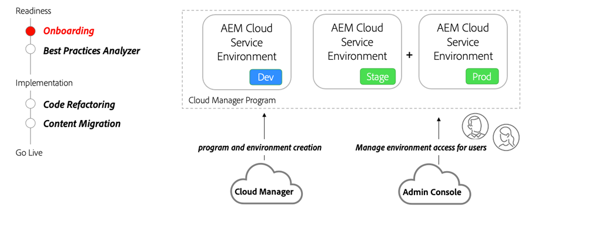

# AEM as a Cloud Service에 온보딩

계약 단계에서 시작하여 AEM as a Cloud Service을 사용한 환경 설정에 이르기까지 Cloud Manager에 온보딩하는 방법에 대해 알아봅니다.

>[!VIDEO](https://video.tv.adobe.com/v/3431508?quality=12&learn=on&captions=kor)

## Cloud Manager 및 Admin Console

온보딩의 중요한 부분은 AEM as a Cloud Service 프로그램을 만들고 Adobe Cloud Manager을 사용하여 다양한 환경을 프로비저닝하는 것입니다. [Admin Console](https://adminconsole.adobe.com/)은(는) 역할을 할당하고 조직의 사용자에게 AEM 환경에 대한 액세스 권한을 제공하는 데 사용됩니다.

## 주요 활동

+ 시스템 관리자는 [Admin Console](https://adminconsole.adobe.com/)을(를) 사용하여 하나 이상의 사용자를 [Cloud Manager - 비즈니스 소유자](https://experienceleague.adobe.com/docs/experience-manager-cloud-manager/using/requirements/setting-up-users-and-roles.html?lang=ko) 제품 프로필에 할당합니다.
+ 비즈니스 소유자 제품 프로필에 할당된 사용자가 [Cloud Manager](https://experienceleague.adobe.com/docs/experience-manager-cloud-manager/using/introduction-to-cloud-manager.html?lang=ko)에서 [프로그램 만들기](https://experienceleague.adobe.com/docs/experience-manager-cloud-service/implementing/using-cloud-manager/production-programs/creating-production-program.html?lang=ko) 및 [환경 추가](https://experienceleague.adobe.com/docs/experience-manager-cloud-service/implementing/using-cloud-manager/manage-environments.html?lang=ko)까지의 셀프서비스 기능을 사용합니다.
+ [Admin Console](https://adminconsole.adobe.com/)을(를) 사용하여 개발자와 사용자를 다른 [Cloud Manager 역할](https://experienceleague.adobe.com/docs/experience-manager-cloud-manager/using/requirements/setting-up-users-and-roles.html?lang=ko)에 할당하고 다양한 AEM 환경에 권한을 부여합니다.

## 실습 위주의 운동

이 실습으로 배운 것을 시도함으로써 지식을 적용하세요.

실습형 운동을 시도하기 전에 위의 비디오와 다음 자료를 시청하고 이해했는지 확인하십시오.

+ [AEM as a Cloud Service에 대해 다르게 생각](./introduction.md)
+ [Cloud Manager](./cloud-manager.md)

또한, 이전에 실습한 연습을 완료했는지 확인하십시오.

+ [AEM 현대화 도구 실습 연습](./aem-modernization-tools.md#hands-on-exercise)

<table style="border-width:0">
    <tr>
        <td style="width:150px">
                    
        </td>
        <td style="width:100%;margin-bottom:1rem;">
            
온보딩 실습

            

                AEM as a Cloud Service 온보딩 프로세스와 AEM 애플리케이션을 AEM SDK에 배포하는 방법을 살펴봅니다.
            

            <a  rel="noreferrer"
                target="_blank"
                href="https://github.com/adobe/aem-cloud-engineering-video-series-exercises/tree/session3-onboarding#bootcamp---session-3-on-boarding" class="spectrum-Button spectrum-Button--primary spectrum-Button--sizeM">
                온보딩 시도
            </a>
        </td>
    </tr>
</table>
