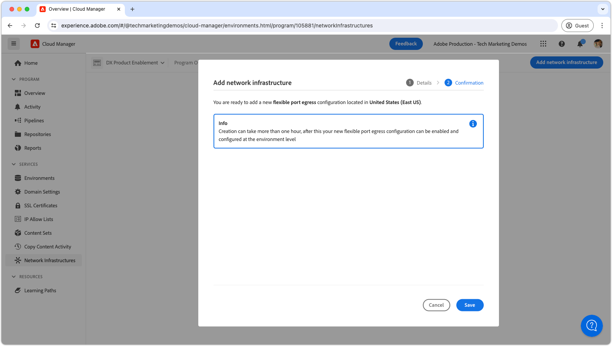
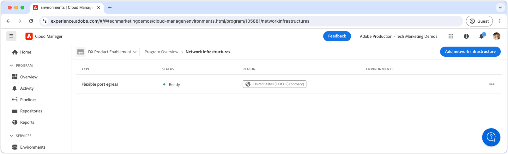

# 유연한 포트 전송

유연한 포트 이그레스를 설정하고 사용하여 AEM as a Cloud Service에서 외부 서비스로의 외부 연결을 지원하는 방법에 대해 알아봅니다.

## 유연한 포트 이그레스란 무엇입니까?

유연한 포트 이그레스에서는 사용자 지정 특정 포트 전달 규칙을 AEM as a Cloud Service에 첨부할 수 있으므로 AEM에서 외부 서비스에 연결할 수 있습니다.

Cloud Manager 프로그램에는 __single__ 네트워크 인프라 유형만 있을 수 있습니다. 다음 명령을 실행하기 전에 유연한 포트 이그레스가 AEM as a Cloud Service에 가장 [적합한 네트워크 인프라 유형](./advanced-networking.md)인지 확인하십시오.

>[!MORELIKETHIS]
>
> 유연한 포트 이그레스에 대한 자세한 내용은 AEM as a Cloud Service [고급 네트워크 구성 설명서](https://experienceleague.adobe.com/ko/docs/experience-manager-cloud-service/content/security/configuring-advanced-networking)를 참조하십시오.


## 사전 요구 사항

Cloud Manager API를 사용하여 유연한 포트 이그레스를 설정하거나 구성할 때 필요한 사항은 다음과 같습니다.

+ Cloud Manager API를 사용하는 Adobe Developer Console 프로젝트 및 [Cloud Manager 비즈니스 소유자 권한](https://developer.adobe.com/experience-cloud/cloud-manager/guides/getting-started/permissions/)
+ [Cloud Manager API의 인증 자격 증명](https://developer.adobe.com/experience-cloud/cloud-manager/guides/getting-started/create-api-integration/)에 액세스
   + 조직 ID(예: IMS 조직 ID)
   + 클라이언트 ID(예: API 키)
   + 액세스 토큰(예: 전달자 토큰)
+ Cloud Manager 프로그램 ID
+ Cloud Manager 환경 ID

자세한 내용을 보려면 [Cloud Manger API 자격 증명을 설정, 구성 및 얻는 방법](https://experienceleague.adobe.com/ko/docs/experience-manager-learn/cloud-service/developing/extensibility/app-builder/server-to-server-auth)을 검토하여 Cloud Manager API를 호출하는 데 사용하십시오.

이 자습서에서는 `curl`을(를) 사용하여 Cloud Manager API 구성을 만듭니다. 제공된 `curl` 명령은 Linux/macOS 구문을 사용합니다. Windows 명령 프롬프트를 사용하는 경우 `\` 줄 바꿈 문자를 `^`(으)로 바꾸십시오.


## 프로그램당 유연한 포트 이그레스 활성화

AEM as a Cloud Service에서 유연한 포트 이그레스를 활성화하여 시작합니다.

>[!BEGINTABS]

>[!TAB Cloud Manager]

Cloud Manager을 사용하여 유연한 포트 이그레스를 활성화할 수 있습니다. 다음 단계에서는 Cloud Manager을 사용하여 AEM as a Cloud Service에서 유연한 포트 이그레스를 활성화하는 방법에 대해 간략히 설명합니다.

1. [Adobe Experience Manager Cloud Manager](https://experience.adobe.com/cloud-manager/)에 Cloud Manager 비즈니스 소유자로 로그인합니다.
1. 원하는 프로그램으로 이동합니다.
1. 왼쪽 메뉴에서 __서비스 > 네트워크 인프라__&#x200B;로 이동합니다.
1. __네트워크 인프라 추가__ 단추를 선택하십시오.

   

1. __네트워크 인프라 추가__ 대화 상자에서 __유연한 포트 이그레스__ 옵션을 선택하고 __지역__&#x200B;을 선택하여 전용 이그레스 IP 주소를 만듭니다.

   

1. 유연한 포트 이그레스의 추가를 확인하려면 __저장__&#x200B;을(를) 선택하십시오.

   

1. 네트워크 인프라가 만들어지고 __준비__(으)로 표시될 때까지 기다립니다. 이 프로세스는 최대 1시간 정도 소요될 수 있습니다.

   

유연한 포트 이그레스가 생성되면 아래에 설명된 대로 Cloud Manager API를 사용하여 포트 전달 규칙을 구성할 수 있습니다.

>[!TAB Cloud Manager API]

Cloud Manager API를 사용하여 유연한 포트 이그레스를 활성화할 수 있습니다. 다음 단계에서는 Cloud Manager API를 사용하여 AEM as a Cloud Service에서 유연한 포트 이그레스를 활성화하는 방법에 대해 설명합니다.

1. 먼저 Cloud Manager API [listRegions](https://developer.adobe.com/experience-cloud/cloud-manager/reference/api/) 작업을 사용하여 고급 네트워킹이 설정된 지역을 확인합니다. 후속 Cloud Manager API를 호출하려면 `region name`이(가) 필요합니다. 일반적으로 프로덕션 환경이 있는 영역이 사용됩니다.

   [환경의 세부 정보](https://experienceleague.adobe.com/ko/docs/experience-manager-cloud-service/content/implementing/using-cloud-manager/manage-environments)에서 [Cloud Manager](https://my.cloudmanager.adobe.com)의 AEM as a Cloud Service 환경 지역을 찾으십시오. Cloud Manager에 표시되는 지역 이름은 Cloud Manager API에서 사용되는 지역 코드 [&#128279;](https://developer.adobe.com/experience-cloud/cloud-manager/guides/api-usage/creating-programs-and-environments/#creating-aem-cloud-service-environments)에 매핑될 수 있습니다.

   __listRegions HTTP 요청__

   ```shell
   $ curl -X GET https://cloudmanager.adobe.io/api/program/{programId}/regions \
       -H 'x-gw-ims-org-id: <ORGANIZATION_ID>' \
       -H 'x-api-key: <CLIENT_ID>' \
       -H 'Authorization: Bearer <ACCESS_TOKEN>' \
       -H 'Content-Type: application/json' 
   ```

2. Cloud Manager API [createNetworkInfrastructure](https://developer.adobe.com/experience-cloud/cloud-manager/reference/api/) 작업을 사용하여 Cloud Manager 프로그램에 대해 유연한 포트 이그레스를 활성화합니다. Cloud Manager API `listRegions` 작업에서 얻은 적절한 `region` 코드를 사용합니다.

   __createNetworkInfrastructure HTTP 요청__

   ```shell
   $ curl -X POST https://cloudmanager.adobe.io/api/program/{programId}/networkInfrastructures \
       -H 'x-gw-ims-org-id: <ORGANIZATION_ID>' \
       -H 'x-api-key: <CLIENT_ID>' \ 
       -H 'Authorization: Bearer <ACCESS_TOKEN>' \
       -H 'Content-Type: application/json' \
       -d '{ "kind": "flexiblePortEgress", "region": "va7" }'
   ```

   Cloud Manager 프로그램이 네트워크 인프라를 프로비저닝할 때까지 15분 동안 기다립니다.

3. 이전 단계의 `createNetworkInfrastructure` HTTP 요청에서 반환된 `id`을(를) 사용하여 환경이 Cloud Manager API [getNetworkInfrastructure](https://developer.adobe.com/experience-cloud/cloud-manager/reference/api/#operation/getNetworkInfrastructure) 작업을 사용하여 __유연한 포트 이그레스__ 구성을 완료했는지 확인하십시오.

   __getNetworkInfrastructure HTTP 요청__

   ```shell
   $ curl -X GET https://cloudmanager.adobe.io/api/program/{programId}/networkInfrastructure/{networkInfrastructureId} \
       -H 'x-gw-ims-org-id: <ORGANIZATION_ID>' \
       -H 'x-api-key: <CLIENT_ID>' \ 
       -H 'Authorization: Bearer <ACCESS_TOKEN>' \
       -H 'Content-Type: application/json'
   ```

   HTTP 응답에 __준비__&#x200B;의 __상태__&#x200B;가 포함되어 있는지 확인하십시오. 아직 준비되지 않은 경우 몇 분마다 상태를 다시 확인하십시오.

유연한 포트 이그레스가 생성되면 아래에 설명된 대로 Cloud Manager API를 사용하여 포트 전달 규칙을 구성할 수 있습니다.

>[!ENDTABS]

## 환경별로 유연한 포트 이그레스 프록시 구성

1. Cloud Manager API [enableEnvironmentAdvancedNetworkingConfiguration](https://developer.adobe.com/experience-cloud/cloud-manager/reference/api/) 작업을 사용하여 각 AEM as a Cloud Service 환경에서 __유연한 포트 이그레스__ 구성을 활성화하고 구성합니다.

   __enableEnvironmentAdvancedNetworkingConfiguration HTTP 요청__

   ```shell
   $ curl -X PUT https://cloudmanager.adobe.io/api/program/{programId}/environment/{environmentId}/advancedNetworking \
       -H 'x-gw-ims-org-id: <ORGANIZATION_ID>' \
       -H 'x-api-key: <CLIENT_ID>' \ 
       -H 'Authorization: Bearer <ACCESS_TOKEN>' \
       -H 'Content-Type: application/json' \
       -d @./flexible-port-egress.json
   ```

   `flexible-port-egress.json`에서 JSON 매개 변수를 정의하고 `... -d @./flexible-port-egress.json`을(를) 통해 curl에 제공합니다.

   [유연한 포트 이그레스.json 예제를 다운로드합니다](./assets/flexible-port-egress.json). 이 파일은 예제일 뿐입니다. [enableEnvironmentAdvancedNetworkingConfiguration](https://developer.adobe.com/experience-cloud/cloud-manager/reference/api/)에 문서화된 선택적/필수 필드를 기반으로 파일을 필요에 따라 구성합니다.

   ```json
   {
       "portForwards": [
           {
               "name": "mysql.example.com",
               "portDest": 3306,
               "portOrig": 30001
           },
           {
               "name": "smtp.sendgrid.com",
               "portDest": 465,
               "portOrig": 30002
           }
       ]
   }
   ```

   각 `portForwards` 매핑에 대해 고급 네트워킹은 다음 전달 규칙을 정의합니다.

   | 프록시 호스트 | 프록시 포트 |  | 외부 호스트 | 외부 포트 |
   |---------------------------------|----------|----------------|------------------|----------|
   | `AEM_PROXY_HOST` | `portForwards.portOrig` | → | `portForwards.name` | `portForwards.portDest` |

   AEM 배포 __only__&#x200B;에서 외부 서비스에 대한 HTTP/HTTPS 연결(포트 80/443)이 필요한 경우 `portForwards` 배열을 비워 두십시오. 이러한 규칙은 HTTP/HTTPS가 아닌 요청에만 필요합니다.

1. 각 환경에 대해 Cloud Manager API [getEnvironmentAdvancedNetworkingConfiguration](https://developer.adobe.com/experience-cloud/cloud-manager/reference/api/) 작업을 사용하여 이그레스 규칙이 적용되는지 확인하십시오.

   __getEnvironmentAdvancedNetworkingConfiguration HTTP 요청__

   ```shell
   $ curl -X GET https://cloudmanager.adobe.io/api/program/{programId}/environment/{environmentId}/advancedNetworking \
       -H 'x-gw-ims-org-id: <ORGANIZATION_ID>' \
       -H 'Authorization: Bearer <ACCESS_TOKEN>' \
       -H 'x-api-key: <CLIENT_ID>' \ 
       -H 'Content-Type: application/json'
   ```

1. Cloud Manager API [enableEnvironmentAdvancedNetworkingConfiguration](https://developer.adobe.com/experience-cloud/cloud-manager/reference/api/) 작업을 사용하여 유연한 포트 이그레스 구성을 업데이트할 수 있습니다. `enableEnvironmentAdvancedNetworkingConfiguration`은(는) `PUT` 작업이므로 이 작업을 호출할 때마다 모든 규칙을 제공해야 합니다.

1. 이제 사용자 지정 AEM 코드 및 구성에서 유연한 포트 이그레스 구성을 사용할 수 있습니다.


## 유연한 포트 이그레스를 통해 외부 서비스에 연결

유연한 포트 이그레스 프록시가 활성화되면 AEM 코드 및 구성은 이를 사용하여 외부 서비스를 호출할 수 있습니다. AEM에서 다르게 처리하는 외부 호출에는 두 가지 유형이 있습니다.

1. 비표준 포트의 외부 서비스에 대한 HTTP/HTTPS 호출
   + 표준 80 또는 443 포트 이외의 포트에서 실행되는 서비스에 대한 HTTP/HTTPS 호출을 포함합니다.
1. 외부 서비스에 대한 비 HTTP/HTTPS 호출
   + 메일 서버, SQL 데이터베이스 또는 HTTP/HTTPS가 아닌 다른 프로토콜에서 실행되는 서비스와의 연결과 같은 HTTP가 아닌 호출을 포함합니다.

표준 포트(80/443)의 AEM에서 HTTP/HTTPS 요청은 기본적으로 허용되며 추가 구성이나 고려 사항이 필요하지 않습니다.


### 비표준 포트에서의 HTTP/HTTPS

AEM에서 비표준 포트(80/443이 아님)에 대한 HTTP/HTTPS 연결을 만드는 경우 자리 표시자를 통해 제공되는 특수 호스트 및 포트를 통해 연결해야 합니다.

AEM은 AEM의 HTTP/HTTPS 프록시에 매핑되는 두 세트의 특별한 Java™ 시스템 변수를 제공합니다.

| 변수 이름 | 사용 | Java™ 코드 | OSGi 구성 |
| - |  - | - | - |
| `AEM_PROXY_HOST` | HTTP/HTTPS 연결 모두에 대한 프록시 호스트 | `System.getenv().getOrDefault("AEM_PROXY_HOST", "proxy.tunnel")` | `$[env:AEM_PROXY_HOST;default=proxy.tunnel]` |
| `AEM_HTTP_PROXY_PORT` | HTTPS 연결을 위한 프록시 포트(대체 항목을 `3128`(으)로 설정) | `System.getenv().getOrDefault("AEM_HTTP_PROXY_PORT", 3128)` | `$[env:AEM_HTTP_PROXY_PORT;default=3128]` |
| `AEM_HTTPS_PROXY_PORT` | HTTPS 연결을 위한 프록시 포트(대체 항목을 `3128`(으)로 설정) | `System.getenv().getOrDefault("AEM_HTTPS_PROXY_PORT", 3128)` | `$[env:AEM_HTTPS_PROXY_PORT;default=3128]` |

비표준 포트에서 외부 서비스에 HTTP/HTTPS를 호출하는 경우 포트 전달 &quot;규칙&quot;이 &quot;코드 내&quot;에 정의되어 있으므로 Cloud Manager API `enableEnvironmentAdvancedNetworkingConfiguration` 작업을 사용하여 해당 `portForwards`을(를) 정의하지 않아야 합니다.

>[!TIP]
>
> [전체 라우팅 규칙 집합](https://experienceleague.adobe.com/ko/docs/experience-manager-cloud-service/content/security/configuring-advanced-networking)에 대해서는 AEM as a Cloud Service의 유연한 포트 이그레스 설명서를 참조하십시오.

#### 코드 예

<table>
<tr>
<td>
    <a  href="./examples/http-on-non-standard-ports-flexible-port-egress.md"></a>
    <div><strong><a href="./examples/http-on-non-standard-ports-flexible-port-egress.md">비표준 포트의 HTTP/HTTPS</a></strong></div>
    <p>
        AEM as a Cloud Service에서 비표준 HTTP/HTTPS 포트의 외부 서비스로의 HTTP/HTTPS 연결을 만드는 Java™ 코드 예입니다.
    </p>
</td>   
<td></td>   
<td></td>   
</tr>
</table>

### 외부 서비스에 대한 비 HTTP/HTTPS 연결

비HTTP/HTTPS 연결을 만드는 경우(예: SQL, SMTP 등). AEM에서 연결은 AEM에서 제공하는 특수 호스트 이름을 통해 이루어져야 합니다.

| 변수 이름 | 사용 | Java™ 코드 | OSGi 구성 |
| - |  - | - | - |
| `AEM_PROXY_HOST` | 비 HTTP/HTTPS 연결용 프록시 호스트 | `System.getenv().getOrDefault("AEM_PROXY_HOST", "proxy.tunnel")` | `$[env:AEM_PROXY_HOST;default=proxy.tunnel]` |


외부 서비스에 대한 연결은 `AEM_PROXY_HOST` 및 매핑된 포트(`portForwards.portOrig`)를 통해 호출되며, AEM은 매핑된 외부 호스트 이름(`portForwards.name`) 및 포트(`portForwards.portDest`)로 라우팅됩니다.

| 프록시 호스트 | 프록시 포트 |  | 외부 호스트 | 외부 포트 |
|---------------------------------|----------|----------------|------------------|----------|
| `AEM_PROXY_HOST` | `portForwards.portOrig` | → | `portForwards.name` | `portForwards.portDest` |

#### 코드 예

<table><tr>
   <td>
      <a  href="./examples/sql-datasourcepool.md"></a>
      <div><strong><a href="./examples/sql-datasourcepool.md">JDBC DataSourcePool을 사용한 SQL 연결</a></strong></div>
      <p>
            AEM의 JDBC 데이터 소스 풀을 구성하여 외부 SQL 데이터베이스에 연결하는 Java™ 코드 예입니다.
      </p>
    </td>   
   <td>
      <a  href="./examples/sql-java-apis.md"></a>
      <div><strong><a href="./examples/sql-java-apis.md">Java™ API를 사용한 SQL 연결</a></strong></div>
      <p>
            Java™ 코드 예제 Java™의 SQL API를 사용하여 외부 SQL 데이터베이스에 연결.
      </p>
    </td>   
   <td>
      <a  href="./examples/email-service.md"></a>
      <div><strong><a href="./examples/email-service.md">전자 메일 서비스</a></strong></div>
      <p>
        AEM을 사용하여 외부 이메일 서비스에 연결하는 OSGi 구성 예입니다.
      </p>
    </td>   
</tr></table>
