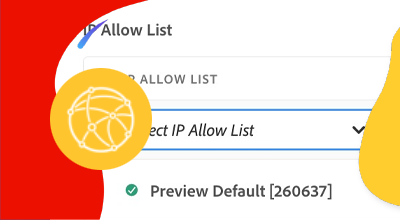

# Virtual Private Network(VPN)

AEM을 VPN과 as a Cloud Service으로 연결하여 AEM과 내부 서비스 간에 보안 통신 채널을 만드는 방법을 알아봅니다.

## 가상 개인 네트워크란 무엇입니까?

VPN(가상 개인 네트워크)을 사용하면 AEM as a Cloud Service 고객이 연결할 수 있습니다 **AEM 환경** Cloud Manager 프로그램 내에서 기존 [지원](https://experienceleague.adobe.com/docs/experience-manager-cloud-service/content/security/configuring-advanced-networking.html#vpn) VPN. 이렇게 하면 고객 네트워크 내에서 AEM as a Cloud Service과 서비스 간의 보안 및 제어 연결이 가능합니다.

Cloud Manager 프로그램은 __단일__ 네트워크 인프라 유형. 가상 사설 네트워크가 가장 중요한지 확인합니다. [적절한 유형의 네트워크 인프라](https://experienceleague.adobe.com/docs/experience-manager-cloud-service/content/security/configuring-advanced-networking.html#general-vpn-considerations) 다음 명령을 실행하기 전에 AEM as a Cloud Service에 대해 설명합니다.

>[!NOTE]
>
>Cloud Manager에서 VPN에 빌드 환경을 연결하는 것은 지원되지 않습니다. 개인 저장소에서 이진 객체에 액세스해야 하는 경우 공용 인터넷에서 사용할 수 있는 URL을 사용하여 보안 및 암호로 보호된 리포지토리를 설정해야 합니다 [여기에 설명된 대로](https://experienceleague.adobe.com/docs/experience-manager-cloud-service/content/implementing/using-cloud-manager/create-application-project/setting-up-project.html#password-protected-maven-repositories).

>[!MORELIKETHIS]
>
> AEM as a Cloud Service 읽기 [고급 네트워크 구성 설명서](https://experienceleague.adobe.com/docs/experience-manager-cloud-service/content/security/configuring-advanced-networking.html#vpn) 가상 개인 네트워크에 대한 자세한 정보

## 사전 요구 사항

가상 사설 네트워크를 설정할 때는 다음 사항이 필요합니다.

+ Adobe 계정 [Cloud Manager 비즈니스 소유자 권한](https://developer.adobe.com/experience-cloud/cloud-manager/guides/getting-started/permissions/)
+ 액세스 권한 [Cloud Manager API의 인증 자격 증명](https://developer.adobe.com/experience-cloud/cloud-manager/guides/getting-started/authentication/)
   + 조직 ID(IMS 조직 ID라고도 함)
   + 클라이언트 ID(API 키라고도 함)
   + 액세스 토큰(베어러 토큰이라고도 함)
+ Cloud Manager 프로그램 ID입니다
+ Cloud Manager 환경 ID
+ 필요한 모든 연결 매개 변수에 액세스할 수 있는 가상 개인 네트워크.

자세한 내용은 Cloud Manager API 자격 증명을 설정, 구성 및 얻는 방법과 이를 사용하여 Cloud Manager API 호출을 만드는 방법에 대한 다음 연습을 참조하십시오.

>[!VIDEO](https://video.tv.adobe.com/v/342235/?quality=12&learn=on)

이 자습서에서는 을 사용합니다 `curl` 클라우드 관리자 API 구성을 설정하는 중입니다. 제공된 `curl` 명령은 Linux/macOS 구문을 가정합니다. Windows 명령 프롬프트를 사용하는 경우 `\` 줄 바꿈 문자 `^`.

## 프로그램당 가상 사설 네트워크 사용

먼저 AEM as a Cloud Service에서 가상 전용 네트워크를 활성화합니다.

1. 먼저 Cloud Manager API를 사용하여 고급 네트워킹을 설정할 영역을 결정합니다 [listRegions](https://developer.adobe.com/experience-cloud/cloud-manager/reference/api/) 작업. 다음 `region name` 후속 Cloud Manager API 호출을 수행하려면 가 필요합니다. 일반적으로 프로덕션 환경이 상주하는 영역이 사용됩니다.

   __listRegions HTTP 요청__

   ```shell
   $ curl -X GET https://cloudmanager.adobe.io/api/program/{programId}/regions \
       -H 'x-gw-ims-org-id: <ORGANIZATION_ID>' \
       -H 'x-api-key: <CLIENT_ID>' \
       -H 'Authorization: Bearer <ACCESS_TOKEN>' \
       -H 'Content-Type: application/json'
   ```

1. Cloud Manager API를 사용하여 Cloud Manager 프로그램용 Virtual Private Network 활성화 [createNetworkInfrastructure](https://developer.adobe.com/experience-cloud/cloud-manager/reference/api/) 작업. 적절한 `region` Cloud Manager API에서 가져온 코드 `listRegions` 작업.

   __createNetworkInfrastructure HTTP 요청__

   ```shell
   $ curl -X POST https://cloudmanager.adobe.io/api/program/{programId}/networkInfrastructures \
       -H 'x-gw-ims-org-id: <ORGANIZATION_ID>' \
       -H 'x-api-key: <CLIENT_ID>' \
       -H 'Authorization: Bearer <ACCESS_TOKEN>' \
       -H 'Content-Type: application/json'
       -d @./vpn-create.json
   ```

   에서 JSON 매개 변수를 정의합니다 `vpn-create.json` 컬을 통해 제공 `... -d @./vpn-create.json`.

   [vpn-create.json 예제 다운로드](./assets/vpn-create.json).  이 파일은 예일 뿐입니다. 에 설명된 선택 사항/필수 필드를 기반으로 파일을 필요에 따라 구성합니다. [enableEnvironmentAdvancedNetworkingConfiguration](https://developer.adobe.com/experience-cloud/cloud-manager/reference/api/).

   ```json
   {
       "kind": "vpn",
       "region": "va7",
       "addressSpace": [
           "10.104.182.64/26"
       ],
       "dns": {
           "resolvers": [
               "10.151.201.22",
               "10.151.202.22",
               "10.154.155.22"
           ],
           "domains": [
               "wknd.site",
               "wknd.com"
           ]
       },
       "connections": [{
           "name": "connection-1",
           "gateway": {
               "address": "195.231.212.78",
               "addressSpace": [
                   "10.151.0.0/16",
                   "10.152.0.0/16",
                   "10.153.0.0/16",
                   "10.154.0.0/16",
                   "10.142.0.0/16",
                   "10.143.0.0/16",
                   "10.124.128.0/17"
               ]
           },
           "sharedKey": "<secret_shared_key>",
           "ipsecPolicy": {
               "dhGroup": "ECP256",
               "ikeEncryption": "AES256",
               "ikeIntegrity": "SHA256",
               "ipsecEncryption": "AES256",
               "ipsecIntegrity": "SHA256",
               "pfsGroup": "ECP256",
               "saDatasize": 102400000,
               "saLifetime": 3600
           }
       }]
   }
   ```

   Cloud Manager 프로그램이 네트워크 인프라를 프로비저닝할 때까지 45-60분을 기다립니다.

1. 환경이 완료되었는지 확인합니다 __가상 사설 네트워크__ cloud Manager API를 사용한 구성 [getNetworkInfrastructure](https://developer.adobe.com/experience-cloud/cloud-manager/reference/api/#operation/getNetworkInfrastructure) 작업, `id` 이전 단계의 createNetworkInfrastructure HTTP 요청에서 반환됩니다.

   __getNetworkInfrastructure HTTP 요청__

   ```shell
   $ curl -X GET https://cloudmanager.adobe.io/api/program/{programId}/networkInfrastructure/{networkInfrastructureId} \
       -H 'x-gw-ims-org-id: <ORGANIZATION_ID>' \
       -H 'x-api-key: <CLIENT_ID>' \
       -H 'Authorization: <YOUR_BEARER_TOKEN>' \
       -H 'Content-Type: application/json'
   ```

   HTTP 응답에 가 포함되어 있는지 확인합니다. __상태__ 의 __ready__. 아직 준비되지 않은 경우 몇 분마다 상태를 다시 확인합니다.

## 환경별 가상 사설 네트워크 프록시 구성

1. 활성화 및 구성 __가상 사설 네트워크__ cloud Manager API를 사용하여 각 AEM as a Cloud Service 환경에서 구성 [enableEnvironmentAdvancedNetworkingConfiguration](https://developer.adobe.com/experience-cloud/cloud-manager/reference/api/) 작업.

   __enableEnvironmentAdvancedNetworkingConfiguration HTTP 요청__

   ```shell
   $ curl -X PUT https://cloudmanager.adobe.io/api/program/{programId}/environment/{environmentId}/advancedNetworking \
       -H 'x-gw-ims-org-id: <ORGANIZATION_ID>' \
       -H 'x-api-key: <CLIENT_ID>' \
       -H 'Authorization: Bearer <ACCESS_TOKEN>' \
       -H 'Content-Type: application/json' \
       -d @./vpn-configure.json
   ```

   에서 JSON 매개 변수를 정의합니다 `vpn-configure.json` 컬을 통해 제공 `... -d @./vpn-configure.json`.

[vpn-configure.json 예제 다운로드](./assets/vpn-configure.json)

   ```json
   {
       "nonProxyHosts": [
           "example.net",
           "*.example.org"
       ],
       "portForwards": [
           {
               "name": "mysql.example.com",
               "portDest": 3306,
               "portOrig": 30001
           },
           {
               "name": "smtp.sendgrid.com",
               "portDest": 465,
               "portOrig": 30002
           }
       ]
   }
   ```

   `nonProxyHosts` 는 전용 송신 IP가 아닌 기본 공유 IP 주소 범위를 통해 포트 80 또는 443을 라우팅해야 하는 호스트 집합을 선언합니다. `nonProxyHosts` 공유 IP를 통한 트래픽 추적이 Adobe에 의해 자동으로 최적화될 수 있으므로 유용할 수 있습니다.

   각 `portForwards` 매핑 시 고급 네트워킹은 다음 전달 규칙을 정의합니다.

   | 프록시 호스트 | 프록시 포트 |  | 외부 호스트 | 외부 포트 |
   |---------------------------------|----------|----------------|------------------|----------|
   | `AEM_PROXY_HOST` | `portForwards.portOrig` | → | `portForwards.name` | `portForwards.portDest` |

   AEM 배포인 경우 __전용__ 외부 서비스에 대한 HTTP/HTTPS 연결이 필요한 경우 `portForwards` 배열이 비어 있는 경우, 비HTTP/HTTPS 요청에만 이러한 규칙이 필요합니다.


1. 각 환경에 대해 Cloud Manager API의 [getEnvironmentAdvancedNetworkingConfiguration](https://developer.adobe.com/experience-cloud/cloud-manager/reference/api/) 작업.

   __getEnvironmentAdvancedNetworkingConfiguration HTTP 요청__

   ```shell
   $ curl -X GET https://cloudmanager.adobe.io/api/program/{programId}/environment/{environmentId}/advancedNetworking \
       -H 'x-gw-ims-org-id: <ORGANIZATION_ID>' \
       -H 'x-api-key: <CLIENT_ID>' \
       -H 'Authorization: Bearer <ACCESS_TOKEN>' \
       -H 'Content-Type: application/json'
   ```

1. Cloud Manager API의 [enableEnvironmentAdvancedNetworkingConfiguration](https://developer.adobe.com/experience-cloud/cloud-manager/reference/api/) 작업. 기억 `enableEnvironmentAdvancedNetworkingConfiguration` is `PUT` 작업을 수행하므로 이 작업의 모든 호출과 함께 모든 규칙을 제공해야 합니다.

1. 이제 사용자 지정 AEM 코드 및 구성에서 가상 개인 네트워크 송신 구성을 사용할 수 있습니다.

## 가상 개인 네트워크를 통해 외부 서비스에 연결

가상 사설 네트워크를 사용하도록 설정하면 AEM 코드 및 구성을 사용하여 VPN을 통해 외부 서비스를 호출할 수 있습니다. AEM에서 다르게 처리하는 외부 호출에는 두 가지 방식이 있습니다.

1. 외부 서비스에 대한 HTTP/HTTPS 호출
   + 표준 80 또는 443 포트 이외의 포트에서 실행되는 서비스에 대한 HTTP/HTTPS 호출을 포함합니다.
1. 외부 서비스에 대한 비HTTP/HTTPS 호출
   + 메일 서버와의 연결, SQL 데이터베이스 또는 다른 비HTTP/HTTPS 프로토콜에서 실행되는 서비스와 같은 HTTP가 아닌 모든 호출을 포함합니다.

표준 (80/443)의 AEM에서 HTTP/HTTPS 요청은 기본적으로 허용되지만 아래 설명된 대로 적절히 구성되지 않은 경우 VPN 연결을 사용하지 않습니다.

### HTTP/HTTPS

AEM에서 HTTP/HTTPS 연결을 만들 때 VPN을 사용할 때 HTTP/HTTPS 연결이 AEM에서 자동으로 프록시됩니다. HTTP/HTTPS 연결을 지원하려면 추가 코드나 구성이 필요하지 않습니다.

>[!TIP]
>
> 에 대해서는 AEM as a Cloud Service의 가상 사설 네트워크 설명서를 참조하십시오 [전체 라우팅 규칙 세트](https://experienceleague.adobe.com/docs/experience-manager-cloud-service/content/security/configuring-advanced-networking.html#vpn-traffic-routing).

#### 코드 예

<table>
<tr>
<td>
    <a  href="./examples/http-dedicated-egress-ip-vpn.md"></a>
    <div><strong><a href="./examples/http-dedicated-egress-ip-vpn.md">HTTP/HTTPS</a></strong></div>
    <p>
        HTTP/HTTPS 프로토콜을 사용하여 AEM에서 as a Cloud Service으로 외부 서비스에 HTTP/HTTPS를 연결하는 Java™ 코드 예입니다.
    </p>
</td>
<td></td>
<td></td>
</tr>
</table>

### 비HTTP/HTTPS 연결 코드 예제

비HTTP/HTTPS 연결을 만들 때(예: AEM의 SQL, SMTP 등)에서 AEM에서 제공하는 특수 호스트 이름을 통해 연결을 만들어야 합니다.

| 변수 이름 | 사용 | Java™ 코드 | OSGi 구성 | | - | - | - | - | | `AEM_PROXY_HOST` | 비HTTP/HTTPS 연결을 위한 프록시 호스트 | `System.getenv("AEM_PROXY_HOST")` | `$[env:AEM_PROXY_HOST]` |


그런 다음 외부 서비스에 대한 연결을 `AEM_PROXY_HOST` 및 매핑된 포트(`portForwards.portOrig`). 그러면 AEM이 매핑된 외부 호스트 이름( )으로 라우팅됩니다.`portForwards.name`) 및 port( )`portForwards.portDest`).

| 프록시 호스트 | 프록시 포트 |  | 외부 호스트 | 외부 포트 |
|---------------------------------|----------|----------------|------------------|----------|
| `AEM_PROXY_HOST` | `portForwards.portOrig` | → | `portForwards.name` | `portForwards.portDest` |


#### 코드 예

<table><tr>
   <td>
      <a  href="./examples/sql-datasourcepool.md"></a>
      <div><strong><a href="./examples/sql-datasourcepool.md">JDBC DataSourcePool을 사용한 SQL 연결</a></strong></div>
      <p>
            AEM JDBC 데이터 소스 풀을 구성하여 외부 SQL 데이터베이스에 연결하는 Java™ 코드 예입니다.
      </p>
    </td>
   <td>
      <a  href="./examples/sql-java-apis.md"></a>
      <div><strong><a href="./examples/sql-java-apis.md">Java™ API를 사용한 SQL 연결</a></strong></div>
      <p>
            Java™의 SQL API를 사용하여 외부 SQL 데이터베이스에 연결하는 Java™ 코드 예입니다.
      </p>
    </td>
   <td>
      <a  href="./examples/email-service.md"></a>
      <div><strong><a href="./examples/email-service.md">이메일 서비스</a></strong></div>
      <p>
        AEM을 사용하여 외부 이메일 서비스에 연결하는 OSGi 구성 예입니다.
      </p>
    </td>
</tr></table>

### VPN을 통해 AEM as a Cloud Service에 대한 액세스 제한

가상 개인 네트워크 구성은 AEM as a Cloud Service 환경에 대한 VPN에 대한 액세스를 제한합니다.

#### 구성 예

<table><tr>
   <td>
      <a href="https://experienceleague.adobe.com/docs/experience-manager-cloud-service/content/implementing/using-cloud-manager/ip-allow-lists/apply-allow-list.html"></a>
      <div><strong><a href="https://experienceleague.adobe.com/docs/experience-manager-cloud-service/content/implementing/using-cloud-manager/ip-allow-lists/apply-allow-list.html">IP 허용 목록에 추가하다 적용</a></strong></div>
      <p>
            VPN 허용 목록에 추가하다 트래픽만 AEM에 액세스할 수 있도록 IP 트래픽을 구성합니다.
      </p>
    </td>
   <td>
      <a  href="https://experienceleague.adobe.com/docs/experience-manager-cloud-service/content/security/configuring-advanced-networking.html#restrict-vpn-to-ingress-connections"></a>
      <div><strong><a href="https://experienceleague.adobe.com/docs/experience-manager-cloud-service/content/security/configuring-advanced-networking.html#restrict-vpn-to-ingress-connections">AEM 게시에 대한 경로 기반 VPN 액세스 제한</a></strong></div>
      <p>
            AEM 게시의 특정 경로에 대해 VPN 액세스 권한이 필요합니다.
      </p>
    </td>
   <td></td>
</tr></table>
