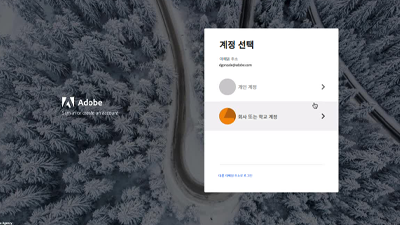

# 개요 {#overview}

Adobe Experience Manager(AEM)는 이제 클라우드 서비스로 제공됩니다. AEM은 Cloud Service로서 모든 사용 사례와 기능을 유지하고 확장하면서 과거 투자 및 혁신을 바탕으로 차세대 Experience Manager 제품 라인을 출시했습니다.

>[!VIDEO](https://video.tv.adobe.com/v/31085/?quality=12&learn=on)

## 새로운 기능

* **[자산 계산 마이크로서비스 확장성(자습서)](./asset-compute/overview.md)**

    
   *사용자 지정 자산 표현물을 생성하기 위해 자산 계산 작업자를 개발하는 방법에 대해 알아봅니다.*

* **[AEM에 대한 액세스를 Cloud Service으로 구성(자습서)](./accessing/overview.md)**

    
   *AEM에 액세스할 수 있도록 Adobe Admin Console에서 IMS 사용자를 구성하는 방법에 대해 알아봅니다.*

* **[AEM을 Cloud Service으로 디버깅(자습서)](./debugging/cloud-service/overview.md)**

    
   *AEM을 Cloud Service으로 디버깅하는 방법 살펴보기*

* **[AEM SDK 디버깅(자습서)](./debugging/aem-sdk-local-quickstart/overview.md)**

    
   *AEM에서 Cloud Service SDK의 로컬 quickstart로 애플리케이션을 디버깅하는 데 사용되는 다양한 도구를 살펴보십시오*

* **[로컬 개발 환경 설정(자습서)](./local-development-environment/overview.md)**

    
   *Cloud Service 개발으로서 AEM용 로컬 개발 시스템을 설정하는 방법을 알아봅니다.*

## 직원 선택

<table>
   <td>
      
      

         <a href="./accessing/overview.md">
         <strong>AEM 자습서에 대한 액세스 권한 구성</strong>
         </a>
      

      

         <em>Adobe Admin Console의 IMS 사용자가 AEM에 액세스하도록 구성합니다.</em>
      

   </td>   
   <td>
      
      

         <a href="./local-development-environment/overview.md">
         <strong>로컬 개발 환경 설정 자습서</strong>
         </a>
      

      

         <em>Cloud Service 개발으로 AEM용으로 로컬 개발 시스템을 준비할 수 있습니다.</em>
      

   </td>   
   <td>
      
      

         <a href="./debugging/aem-sdk-local-quickstart/overview.md">
         <strong>AEM SDK 디버깅</strong>
         </a>
      

      

         <em>Cloud Service SDK의 로컬 빠른 시작으로서 AEM에서 애플리케이션을 디버깅하는 데 사용되는 툴을 살펴보십시오.</em>
      

   </td>
</table>

## 추가 리소스

* [경험 리그 - Adobe Experience Manager 둘러보기](https://experienceleague.adobe.com/#recommended/solutions/experience-manager)
* [Cloud Service 문서로서 Adobe Experience Manager](https://docs.adobe.com/content/help/en/experience-manager-cloud-service/landing/home.html)
