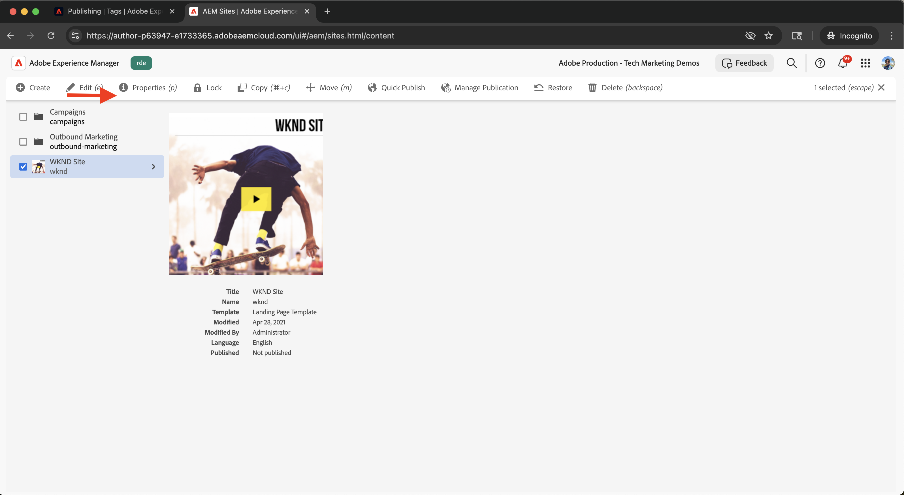

# Adobe Experience Platform의 태그 통합

Adobe Experience Platform의 태그와 AEM as a Cloud Service(AEMCS)를 통합하는 방법을 알아봅니다. 태그(즉, Launch) 통합을 사용하면 Adobe Web SDK을 배포하고 데이터 수집 및 개인화를 위한 사용자 지정 JavaScript을 AEM 페이지에 삽입할 수 있습니다.

통합을 통해 마케팅 또는 개발 팀은 AEM 코드를 재배포할 필요 없이 개인화 및 데이터 수집을 위해 JavaScript을 관리하고 배포할 수 있습니다.

## 높은 수준의 단계

통합 프로세스에는 AEM과 Tags 간의 연결을 설정하는 4가지 주요 단계가 포함됩니다.

1. **Adobe Experience Platform에서 Tags 속성 만들기, 구성 및 게시**
2. **AEM의 태그에 대한 Adobe IMS 구성 확인**
3. **AEM에서 태그 구성 만들기**
4. **AEM 페이지에 태그 구성 적용**

## Adobe Experience Platform에서 태그 속성 만들기, 구성 및 게시

Adobe Experience Platform에서 Tags 속성을 생성하여 시작합니다. 이 속성은 개인화 및 데이터 수집에 필요한 Adobe Web SDK 및 모든 사용자 지정 JavaScript 배포를 관리하는 데 도움이 됩니다.

1. [Adobe Experience Platform](https://experience.adobe.com/platform)&#x200B;(으)로 이동하여 Adobe ID으로 로그인하고 왼쪽 메뉴에서 **태그**(으)로 이동합니다.\
   

2. 새 Tags 속성을 만들려면 **새 속성**&#x200B;을 클릭합니다.\
   

3. **속성 만들기** 대화 상자에서 다음을 입력합니다.
   - **속성 이름**: Tags 속성의 이름입니다.
   - **속성 유형**: **웹** 선택
   - **도메인**: 속성을 배포하는 도메인(예: `.adobeaemcloud.com`)

   **저장**&#x200B;을 클릭합니다.

   

4. 새 속성을 엽니다. **Core** 확장을 이미 포함해야 합니다. **데이터 스트림 ID**&#x200B;와 같은 추가 구성이 필요하므로 나중에 실험 사용 사례를 설정할 때 **웹 SDK** 확장을 추가할 예정입니다.\
   

5. **흐름 게시**&#x200B;로 이동하고 **라이브러리 추가**&#x200B;를 클릭하여 배포 라이브러리를 만들어 Tags 속성을 게시합니다.
   

6. **라이브러리 만들기** 대화 상자에서 다음을 제공합니다.
   - **이름**: 라이브러리 이름
   - **환경**: **개발** 선택
   - **리소스 변경**: **변경된 모든 리소스 추가** 선택

   **개발에 저장 및 구축**&#x200B;을 클릭합니다.

   

7. 라이브러리를 프로덕션에 게시하려면 **승인 및 프로덕션에 게시**&#x200B;를 클릭하십시오. 게시가 완료되면 AEM에서 속성을 사용할 수 있습니다.\
   

## AEM의 태그에 대한 Adobe IMS 구성 확인

AEMCS 환경이 프로비저닝되면 해당 Adobe Developer Console 프로젝트와 함께 태그에 대한 Adobe IMS 구성이 자동으로 포함됩니다. 이 구성은 AEM과 Tags 간에 안전한 API 통신을 보장합니다.

1. AEM에서 **도구** > **보안** > **Adobe IMS 구성**&#x200B;으로 이동합니다.\
   

2. **Adobe 시작** 구성을 찾습니다. 사용 가능한 경우 연결을 선택하고 **상태 확인**&#x200B;을 클릭하여 연결을 확인합니다. 성공 응답이 표시됩니다.\
   

## AEM에서 태그 구성 만들기

AEM에서 태그 구성을 만들어 사이트 페이지에 필요한 속성 및 설정을 지정합니다.

1. AEM에서 **도구** > **클라우드 서비스** > **Adobe Launch 구성**&#x200B;으로 이동합니다.\
   

2. 사이트의 루트 폴더(예: WKND 사이트)를 선택하고 **만들기**&#x200B;를 클릭합니다.\
   

3. 대화 상자에서 다음을 입력합니다.
   - **제목**: 예: &quot;Adobe 태그&quot;
   - **IMS 구성**: 확인된 **Adobe 시작** IMS 구성 선택
   - **회사**: Tags 속성에 연결된 회사를 선택합니다.
   - **속성**: 이전에 만든 Tags 속성을 선택합니다.

   **다음**&#x200B;을 클릭합니다.

   

4. 데모용으로 **스테이징** 및 **프로덕션** 환경의 기본값을 유지하십시오. **만들기**&#x200B;를 클릭합니다.\
   

5. 새로 만든 구성을 선택하고 **게시**&#x200B;를 클릭하여 사이트 페이지에서 사용할 수 있도록 합니다.\
   

## AEM 사이트에 태그 구성 적용

태그 구성을 적용하여 사이트 페이지에 웹 SDK 및 개인화 논리를 주입합니다.

1. AEM에서 **사이트**(으)로 이동하여 루트 사이트 폴더(예: WKND 사이트)를 선택하고 **속성**&#x200B;을 클릭합니다.\
   

2. **사이트 속성** 대화 상자에서 **고급** 탭을 엽니다. **구성**&#x200B;에서 `/conf/wknd`클라우드 구성&#x200B;**에 대해**&#x200B;이(가) 선택되었는지 확인하십시오.\
   

## 통합 확인

태그 구성이 올바르게 작동하는지 확인하려면 다음을 수행할 수 있습니다.

1. AEM 게시 페이지의 보기 소스를 확인하거나 브라우저 개발자 도구를 사용하여 페이지를 검사합니다
2. [Adobe Experience Platform Debugger](https://chromewebstore.google.com/detail/adobe-experience-platform/bfnnokhpnncpkdmbokanobigaccjkpob)을(를) 사용하여 Web SDK 및 JavaScript 삽입의 유효성을 검사합니다.

## 추가 리소스

- [Adobe Experience Platform Debugger 개요](https://experienceleague.adobe.com/en/docs/experience-platform/debugger/home)
- [태그 개요](https://experienceleague.adobe.com/ko/docs/experience-platform/tags/home)
