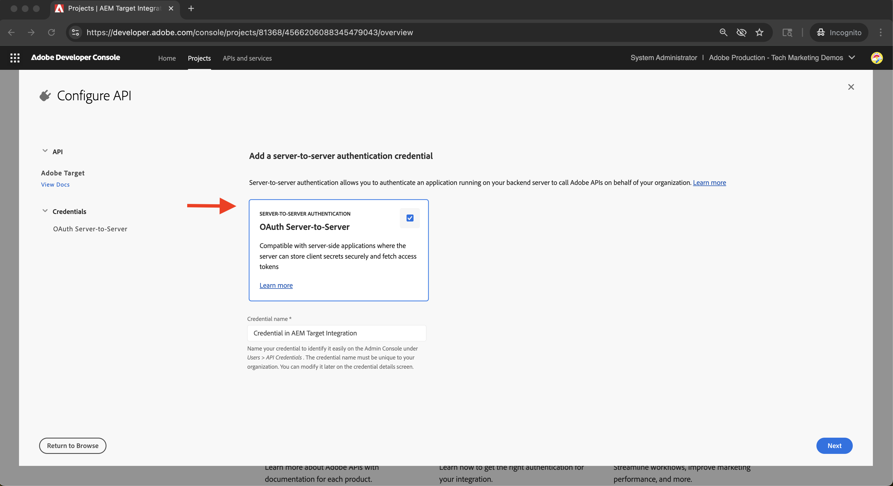

# Adobe Target 통합

AEM as a Cloud Service(AEMCS)를 Adobe Target과 통합하여 경험 조각과 같은 개인화된 콘텐츠를 Adobe Target의 오퍼로 활성화하는 방법을 알아봅니다.

이러한 통합을 통해 마케팅 팀은 AEM을 중심으로 개인화된 콘텐츠를 만들고 관리할 수 있습니다. 그런 다음 Adobe Target에서 오퍼로 원활하게 활성화할 수 있습니다.

>[!IMPORTANT]
>
>팀이 AEM을 중앙 컨텐츠 저장소로 사용하지 않고 Adobe Target 내에서 오퍼를 완전히 관리하기를 선호하는 경우 통합 단계는 선택 사항입니다.

## 높은 수준의 단계

통합 프로세스에는 AEM과 Adobe Target 간의 연결을 설정하는 4가지 주요 단계가 포함됩니다.

1. **Adobe Developer Console 프로젝트 만들기 및 구성**
2. **AEM에서 Target에 대한 Adobe IMS 구성 만들기**
3. **AEM에서 레거시 Adobe Target 구성 만들기**
4. **경험 조각에 Adobe Target 구성 적용**

## Adobe Developer Console 프로젝트 만들기 및 구성

AEM이 Adobe Target과 안전하게 통신할 수 있도록 하려면 OAuth 서버 간 인증을 사용하여 Adobe Developer Console 프로젝트를 구성해야 합니다. 기존 프로젝트를 사용하거나 새 프로젝트를 만들 수 있습니다.

1. [Adobe Developer Console](https://developer.adobe.com/console)&#x200B;(으)로 이동하여 Adobe ID으로 로그인합니다.

2. 새 프로젝트를 만들거나 기존 프로젝트를 선택합니다.\
   

3. **API 추가**&#x200B;를 클릭합니다. **API 추가** 대화 상자에서 **Experience Cloud**&#x200B;을(를) 기준으로 필터링하고 **Adobe Target**&#x200B;을(를) 선택한 후 **다음**&#x200B;을(를) 클릭합니다.\
   

4. **API 구성** 대화 상자에서 **OAuth 서버 간** 인증 방법을 선택하고 **다음**&#x200B;을(를) 클릭합니다.\
   

5. **제품 프로필 선택** 단계에서 **기본 Workspace**&#x200B;을 선택하고 **구성된 API 저장**&#x200B;을 클릭합니다.\
   

6. 왼쪽 탐색에서 **OAuth 서버 간**&#x200B;을(를) 선택하고 구성 세부 사항을 검토합니다. 클라이언트 ID 및 클라이언트 암호 참고 - AEM에서 IMS 통합을 구성하려면 다음 값이 필요합니다.
   

## AEM에서 Target에 대한 Adobe IMS 구성 만들기

AEM에서 Adobe Developer Console의 자격 증명을 사용하여 Target에 대한 Adobe IMS 구성을 만듭니다. 이 구성을 통해 AEM은 Adobe Target API를 인증할 수 있습니다.

1. AEM에서 **도구** > **보안**(으)로 이동한 다음 **Adobe IMS 구성**&#x200B;을 선택합니다.\
   

2. **만들기**&#x200B;를 클릭합니다.\
   

3. **Adobe IMS 기술 계정 구성** 페이지에서 다음을 입력하십시오.
   - **클라우드 솔루션**: Adobe Target
   - **제목**: &quot;Adobe Target&quot;와 같은 구성 레이블
   - **인증 서버**: `https://ims-na1.adobelogin.com`
   - **클라이언트 ID**: Adobe Developer Console에서
   - **클라이언트 암호**: Adobe Developer Console에서
   - **범위**: Adobe Developer Console에서
   - **조직 ID**: Adobe Developer Console에서

   **만들기**&#x200B;를 클릭합니다.

   

4. 구성을 선택하고 **상태 확인**&#x200B;을 클릭하여 연결을 확인합니다. 성공 메시지는 AEM이 Adobe Target에 연결할 수 있음을 확인합니다.\
   

## AEM에서 기존 Adobe Target 구성 만들기

경험 조각을 Adobe Target에 오퍼로 내보내려면 AEM에서 레거시 Adobe Target 구성을 만드십시오.

1. AEM에서 **도구** > **클라우드 서비스**(으)로 이동하고 **레거시 클라우드 서비스**&#x200B;를 선택합니다.\
   

2. **Adobe Target** 섹션에서 **지금 구성**&#x200B;을 클릭합니다.\
   

3. **구성 만들기** 대화 상자에서 &quot;Adobe Target 레거시&quot;과 같은 이름을 입력하고 **만들기**&#x200B;를 클릭합니다.\
   

4. **Adobe Target 레거시 구성** 페이지에서 다음을 제공하십시오.
   - **인증**: IMS
   - **클라이언트 코드**: Adobe Target 클라이언트 코드(**관리** > **구현** 아래의 Adobe Target에 있음)
   - **IMS 구성**: 이전에 만든 IMS 구성

   연결을 확인하려면 **Adobe Target에 연결**&#x200B;을 클릭하세요.

   

## 경험 조각에 Adobe Target 구성 적용

Adobe Target 구성을 경험 조각과 연결하여 Target에서 오퍼로 내보내고 사용할 수 있습니다.

1. AEM에서 **경험 조각**(으)로 이동합니다.\
   

2. 경험 조각이 포함된 루트 폴더(예: `WKND Site Fragments`)를 선택하고 **속성**&#x200B;을 클릭합니다.\
   

3. **속성** 페이지에서 **클라우드 서비스** 탭을 엽니다. **Cloud Service 구성** 섹션에서 Adobe Target 구성을 선택합니다.\
   

4. 표시되는 **Adobe Target** 섹션에서 다음을 완료하십시오.
   - **Adobe Target 내보내기 형식**: HTML
   - **Adobe Target Workspace**: 사용할 작업 영역을 선택합니다(예: &quot;기본 Workspace&quot;).
   - **외부화 도메인**: 외부 URL을 생성할 도메인을 입력하십시오.

   

5. 구성을 적용하려면 **저장 및 닫기**&#x200B;를 클릭하십시오.

## 통합 확인

통합이 올바르게 작동하는지 확인하려면 내보내기 기능을 테스트합니다.

1. AEM에서 새 경험 조각을 만들거나 기존 경험 조각을 엽니다. 도구 모음에서 **Adobe Target으로 내보내기**&#x200B;를 클릭합니다.\
   

2. Adobe Target에서 **오퍼** 섹션으로 이동하여 경험 조각이 오퍼로 표시되는지 확인하십시오.\
   

## 추가 리소스

- [Target API 개요](https://experienceleague.adobe.com/en/docs/target-dev/developer/api/target-api-overview)
- [오퍼 타깃팅](https://experienceleague.adobe.com/en/docs/target/using/experiences/offers/manage-content)
- [Adobe Developer Console](https://developer.adobe.com/developer-console/docs/guides/)
- [AEM의 경험 조각](https://experienceleague.adobe.com/en/docs/experience-manager-learn/sites/experience-fragments/experience-fragments-feature-video-use)