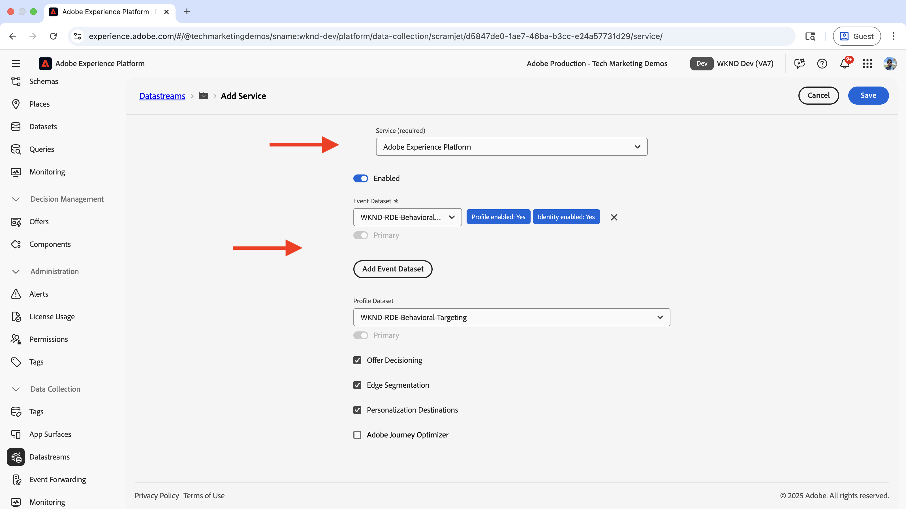
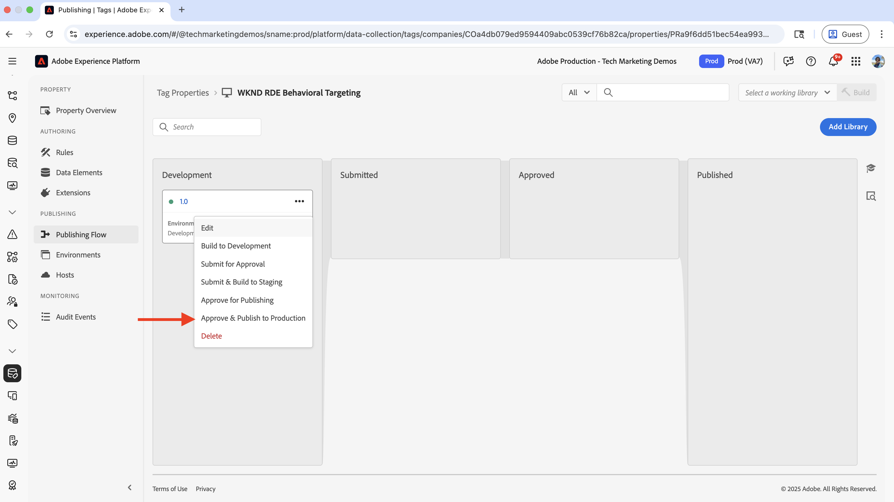
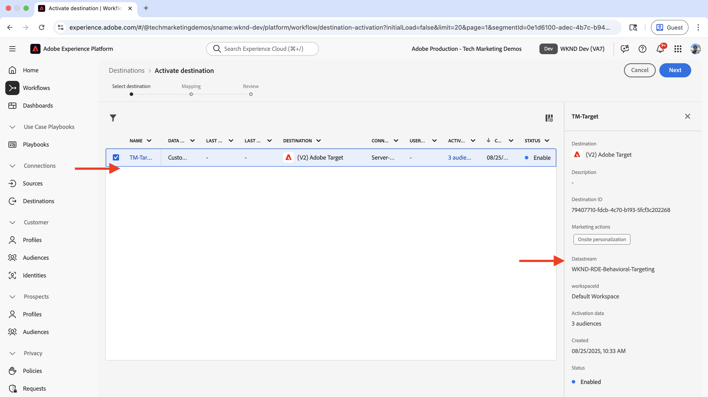
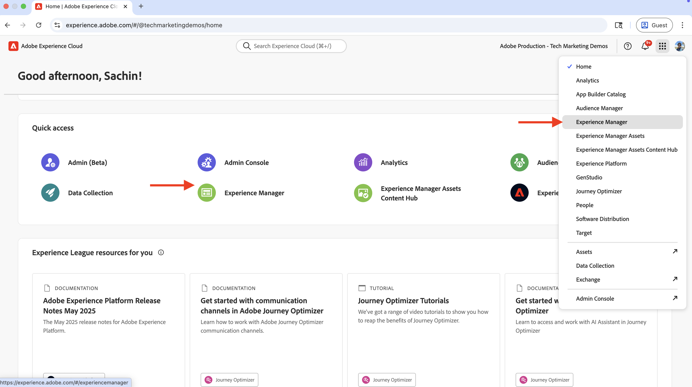
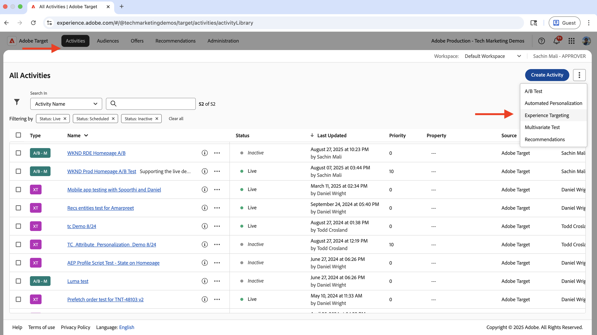

# 행동 타기팅

Adobe Experience Platform(AEP) 및 Adobe Target을 사용하여 사용자 행동을 기반으로 콘텐츠를 개인화하는 방법을 알아봅니다.

행동 타깃팅은 방문자가 방문한 페이지, 검색한 제품 또는 범주와 같은 사용자 행동을 기반으로 다음 페이지 개인화를 제공하는 데 도움이 됩니다. 일반적인 시나리오는 다음과 같습니다.

- **영웅 섹션 Personalization**: 사용자의 탐색 활동을 기반으로 다음 페이지에 개인화된 영웅 콘텐츠를 표시합니다
- **콘텐츠 요소 사용자 지정**: 사용자의 탐색 활동을 기반으로 헤드라인, 이미지 또는 call-to-action 단추를 변경합니다.
- **페이지 콘텐츠 조정**: 사용자의 탐색 활동을 기반으로 전체 페이지 콘텐츠를 수정합니다

## 데모 사용 사례

이 자습서에서는 **발리 서프 캠프**, _리버사이드 캠핑_ 또는 _타호 스키_ 어드벤처 페이지를 방문한 _익명 사용자_&#x200B;가 WKND 홈 페이지의 **다음 모험** 섹션 위에 표시되는 개인화된 영웅을 보는 방법을 보여줍니다.


이 탐색 동작을 사용하는 사용자는 데모용으로 **가족 여행자** 대상으로 분류됩니다.

### 라이브 데모

동작 중인 동작 타깃팅을 보려면 [WKND 지원 웹 사이트](https://wknd.enablementadobe.com/us/en.html)를 방문하세요. 이 사이트에는 다음과 같은 세 가지 행동 타겟팅 경험이 있습니다.

- **홈 페이지**: 사용자가 _발리 서프 캠프_, _리버사이드 캠핑_ 또는 _타호 스키_ 어드벤처 페이지를 둘러본 후 홈 페이지를 방문하면 **가족 여행자** 대상으로 분류되고 _다음 모험_ 섹션 위에 개인화된 영웅 섹션이 표시됩니다.

- **모험 페이지**: 사용자가 _발리 서프 캠프_ 또는 코스타리카 서프 캠프&#x200B;_를 볼 때_&#x200B;서핑 관심사&#x200B;**대상으로 분류되며 모험 페이지에서 개인화된 영웅 섹션을 봅니다.**

- **매거진 페이지**: 사용자가 _3개 이상_&#x200B;개의 문서를 읽을 때 **매거진 리더**&#x200B;로 분류되고 매거진 페이지에서 개인화된 영웅 섹션을 봅니다.

>[!VIDEO](https://video.tv.adobe.com/v/3474001/?learn=on&enablevpops)

>[!TIP]
>
>첫 번째 대상자는 실시간 개인화를 위해 **Edge** 평가를 사용하고, 두 번째 대상자와 세 번째 대상자는 재방문자에게 적합한 개인화를 위해 **일괄** 평가를 사용합니다.

## 사전 요구 사항

동작 타기팅 사용 사례를 진행하기 전에 다음을 완료했는지 확인하십시오.

- [Adobe Target 통합](../setup/integrate-adobe-target.md): 팀이 AEM의 중앙에서 개인화된 콘텐츠를 만들고 관리하며 Adobe Target의 오퍼로 활성화할 수 있습니다.
- [Adobe Experience Platform의 태그 통합](../setup/integrate-adobe-tags.md): 팀이 AEM 코드를 다시 배포할 필요 없이 개인화 및 데이터 수집을 위해 JavaScript을 관리하고 배포할 수 있도록 허용합니다.

스키마, 데이터스트림, 대상, ID 및 프로필과 같은 [ECID(Adobe Experience Cloud Identity Service)](https://experienceleague.adobe.com/en/docs/id-service/using/home) 및 [Adobe Experience Platform](https://experienceleague.adobe.com/en/docs/experience-platform/landing/home) 개념에도 익숙합니다.

Adobe Target에서 간단한 대상을 만들 수 있지만 Adobe Experience Platform(AEP)에서는 행동 및 트랜잭션 데이터와 같은 다양한 데이터 소스를 사용하여 대상을 만들고 관리하고 전체 고객 프로필을 빌드하는 최신 접근 방식을 제공합니다.

## 높은 수준의 단계

행동 타깃팅 설정 프로세스에는 Adobe Experience Platform, AEM 및 Adobe Target의 단계가 포함됩니다.

1. **Adobe Experience Platform에서:**
   1. 스키마 만들기 및 구성
   2. 데이터 세트 만들기 및 구성
   3. 데이터 스트림 만들기 및 구성
   4. 태그 속성 만들기 및 구성
   5. 프로필에 대한 병합 정책 구성
   6. (V2) Adobe Target 대상 설정
   7. 대상자 만들기 및 구성

2. **AEM에서:**
   1. 경험 조각을 사용하여 개인화된 오퍼 만들기
   2. AEM 페이지에 태그 속성 통합 및 삽입
   3. Adobe Target 통합 및 Adobe Target으로 개인화된 오퍼 내보내기

3. **Adobe Target에서:**
   1. 대상 및 오퍼 확인
   2. 활동 만들기 및 구성

4. **AEM 페이지에서 동작 타깃팅 구현 확인**

AEP의 다양한 솔루션을 사용하여 행동 데이터를 수집, 관리 및 수집하여 대상자를 만듭니다. 그런 다음 Adobe Target에서 이러한 대상이 활성화됩니다. Adobe Target의 활동을 사용하면 개인화된 경험이 대상 기준과 일치하는 사용자에게 전달됩니다.

## Adobe Experience Platform 단계

행동 데이터를 기반으로 대상을 만들려면 사용자가 웹 사이트를 방문하거나 웹 사이트와 상호 작용할 때 데이터를 수집하고 저장해야 합니다. 이 예제에서 사용자를 **가족 여행자** 대상으로 분류하려면 페이지 보기 데이터를 수집해야 합니다. 이 프로세스는 Adobe Experience Platform에서 시작되어 이 데이터를 수집하는 데 필요한 구성 요소를 설정합니다.

[Adobe Experience Cloud](https://experience.adobe.com/)에 로그인한 다음 앱 전환기 또는 빠른 액세스 섹션에서 **Experience Platform**(으)로 이동합니다.


### 스키마 만들기 및 구성

스키마는 Adobe Experience Platform에서 수집하는 데이터의 구조와 형식을 정의합니다. 데이터 일관성을 보장하고 표준화된 데이터 필드를 기반으로 의미 있는 대상을 만들 수 있습니다. 동작 타깃팅의 경우 페이지 보기 이벤트 및 사용자 상호 작용을 캡처할 수 있는 스키마가 필요합니다.

행동 타깃팅용 페이지 보기 데이터를 수집하기 위한 스키마를 만듭니다.

- **Adobe Experience Platform** 홈 페이지의 왼쪽 탐색에서 **스키마**&#x200B;을(를) 클릭하고 **스키마 만들기**&#x200B;를 클릭합니다.

  

- **스키마 만들기** 마법사에서 **스키마 세부 정보** 단계에 대해 **경험 이벤트** 옵션을 선택하고 **다음**&#x200B;을 클릭합니다.

  

- **이름 및 검토** 단계에 대해 다음을 입력하십시오.
   - **스키마 표시 이름**: WKND-RDE-Behavioral-Targeting
   - **선택한 클래스**: XDM ExperienceEvent

  

- 스키마를 다음과 같이 업데이트합니다.
   - **필드 그룹 추가**: AEP 웹 SDK ExperienceEvent
   - **프로필**: 사용

  

- 스키마를 만들려면 **저장**&#x200B;을 클릭합니다.

### 데이터 세트 만들기 및 구성

데이터 집합은 특정 스키마를 따르는 데이터의 컨테이너입니다. 행동 데이터를 수집하고 정리하는 저장 위치 역할을 한다. 대상자 만들기 및 개인화를 허용하려면 프로필에 대해 데이터 세트를 활성화해야 합니다.

페이지 보기 데이터를 저장하는 데이터 세트를 만들어 보겠습니다.

- **Adobe Experience Platform**&#x200B;에서 왼쪽 탐색에서 **데이터 세트**&#x200B;를 클릭하고 **데이터 세트 만들기**&#x200B;를 클릭합니다.
  

- **데이터 집합 만들기** 단계에서 **스키마에서 데이터 집합 만들기** 옵션을 선택하고 **다음**&#x200B;을 클릭합니다.
  

- **스키마에서 데이터 집합 만들기** 마법사에서 **스키마 선택** 단계에서는 **WKND-RDE-Behavioral-Targeting** 스키마를 선택하고 **다음**&#x200B;을(를) 클릭합니다.
  

- **데이터 집합 구성** 단계에 대해 다음을 입력하십시오.
   - **이름**: WKND-RDE-동작-타깃팅
   - **설명**: 페이지 보기 데이터를 저장할 데이터 집합

  

  데이터 집합을 만들려면 **마침**&#x200B;을 클릭하세요.

- 다음과 같이 데이터 세트를 업데이트합니다.
   - **프로필**: 사용

  

### 데이터 스트림 만들기 및 구성

데이터 스트림은 데이터가 웹 SDK을 통해 웹 사이트에서 Adobe Experience Platform으로 흐르는 방식을 정의하는 구성입니다. 웹 사이트와 플랫폼 간의 가교 역할을 하여 데이터의 형식이 제대로 지정되고 올바른 데이터 세트로 라우팅되도록 합니다. 동작 타깃팅의 경우 Edge 세그멘테이션 및 Personalization 대상과 같은 특정 서비스를 활성화해야 합니다.

웹 SDK을 통해 Experience Platform으로 페이지 보기 데이터를 전송하는 데이터 스트림을 생성해 보겠습니다.

- **Adobe Experience Platform**&#x200B;에서 왼쪽 탐색 메뉴에서 **데이터스트림**&#x200B;을 클릭하고 **데이터스트림 만들기**&#x200B;를 클릭합니다.

- **새 데이터스트림** 단계에서 다음을 입력하십시오.
   - **이름**: WKND-RDE-동작-타깃팅
   - **설명**: 페이지 보기 데이터를 Experience Platform에 보내는 데이터스트림
   - **매핑 스키마**: WKND-RDE-동작-타깃팅
데이터 스트림을 만들려면 **저장**&#x200B;을 클릭합니다.

  

- 데이터 스트림이 만들어지면 **서비스 추가**&#x200B;를 클릭합니다.

  

- **서비스 추가** 단계의 드롭다운에서 **Adobe Experience Platform**&#x200B;을(를) 선택하고 다음을 입력합니다.
   - **이벤트 데이터 세트**: WKND-RDE-Behavioral-Targeting
   - **프로필 데이터 세트**: WKND-RDE-Behavioral-Targeting
   - **Offer Decisioning**: 사용
   - **Edge 세그멘테이션**: 사용
   - **Personalization 대상**: 사용

  서비스를 추가하려면 **저장**&#x200B;을 클릭하세요.

  

- **서비스 추가** 단계의 드롭다운에서 **Adobe Target**&#x200B;을(를) 선택하고 **Target 환경 ID**&#x200B;를 입력합니다. Target 환경 ID는 **관리** > **환경**&#x200B;에서 Adobe Target에 있습니다. 서비스를 추가하려면 **저장**&#x200B;을 클릭하세요.
  

### 태그 속성 만들기 및 구성

Tags 속성은 웹 사이트에서 데이터를 수집하여 Adobe Experience Platform으로 전송하는 JavaScript 코드의 컨테이너입니다. 사용자 상호 작용 및 페이지 보기를 캡처하는 데이터 수집 레이어 역할을 합니다. 행동 타깃팅의 경우 페이지 이름, URL, 사이트 섹션 및 호스트 이름과 같은 특정 페이지 세부 정보를 수집하여 의미 있는 대상을 만듭니다.

사용자가 웹 사이트를 방문할 때 페이지 보기 데이터를 캡처하는 태그 속성을 만들겠습니다.

이 사용 사례에서는 페이지 이름, URL, 사이트 섹션 및 호스트 이름 등 페이지 세부 사항이 수집됩니다. 이러한 세부 정보는 동작 대상을 만드는 데 사용됩니다.

[Adobe 태그 통합](../setup/integrate-adobe-tags.md) 단계에서 만든 Tags 속성을 업데이트할 수 있습니다. 그러나 단순하게 유지하기 위해 새 Tags 속성이 만들어집니다.

#### 태그 속성 만들기

태그 속성을 만들려면 다음 단계를 완료하십시오.

- **Adobe Experience Platform**&#x200B;에서 왼쪽 탐색 메뉴에서 **태그**&#x200B;를 클릭하고 **새 속성** 단추를 클릭합니다.
  

- **속성 만들기** 대화 상자에서 다음을 입력합니다.
   - **속성 이름**: WKND-RDE-Behavioral-Targeting
   - **속성 유형**: **웹** 선택
   - **도메인**: 속성을 배포하는 도메인(예: `.adobeaemcloud.com`)

  속성을 만들려면 **저장**&#x200B;을 클릭합니다.

  

- 새 속성을 열고 왼쪽 탐색에서 **확장**&#x200B;을 클릭한 다음 **카탈로그** 탭을 클릭합니다. **웹 SDK**&#x200B;을 검색하고 **설치** 단추를 클릭합니다.
  

- **확장 설치** 대화 상자에서 이전에 만든 **데이터스트림**&#x200B;을 선택하고 **저장**&#x200B;을 클릭합니다.
  

#### 데이터 요소 추가

데이터 요소는 웹 사이트에서 특정 데이터 포인트를 캡처하여 규칙 및 기타 태그 구성에서 사용할 수 있도록 하는 변수입니다. 데이터 수집을 위한 빌딩 블록 역할을 하며 사용자 상호 작용 및 페이지 보기에서 의미 있는 정보를 추출할 수 있습니다. 동작 타깃팅의 경우 대상 세그먼트를 만들려면 호스트 이름, 사이트 섹션 및 페이지 이름과 같은 페이지 세부 정보를 캡처해야 합니다.

다음 데이터 요소를 만들어 중요한 페이지 세부 정보를 캡처합니다.

- 왼쪽 탐색에서 **데이터 요소**&#x200B;를 클릭하고 **새 데이터 요소 만들기** 단추를 클릭합니다.
  

- **새 데이터 요소 만들기** 대화 상자에서 다음을 입력합니다.
   - **이름**: 호스트 이름
   - **확장**: **코어** 선택
   - **데이터 요소 형식**: **사용자 지정 코드** 선택
   - **편집기 열기** 단추를 클릭하고 다음 코드 조각을 입력하십시오.

     ```javascript
     if(window && window.location && window.location.hostname) {
         return window.location.hostname;
     }
     ```

  

- 마찬가지로 다음 데이터 요소를 만듭니다.

   - **이름**: 사이트 섹션
   - **확장**: **코어** 선택
   - **데이터 요소 형식**: **사용자 지정 코드** 선택
   - **편집기 열기** 단추를 클릭하고 다음 코드 조각을 입력하십시오.

     ```javascript
     if(event && event.component && event.component.hasOwnProperty('repo:path')) {
         let pagePath = event.component['repo:path'];
     
         let siteSection = '';
     
         //Check for html String in URL.
         if (pagePath.indexOf('.html') > -1) { 
         siteSection = pagePath.substring(0, pagePath.lastIndexOf('.html'));
     
         //replace slash with colon
         siteSection = siteSection.replaceAll('/', ':');
     
         //remove `:content`
         siteSection = siteSection.replaceAll(':content:','');
         }
     
         return siteSection 
     }        
     ```

   - **이름**: 페이지 이름
   - **확장**: **코어** 선택
   - **데이터 요소 형식**: **사용자 지정 코드** 선택
   - **편집기 열기** 단추를 클릭하고 다음 코드 조각을 입력하십시오.

     ```javascript
     if(event && event.component && event.component.hasOwnProperty('dc:title')) {
         // return value of 'dc:title' from the data layer Page object, which is propagated via 'cmp:show' event
         return event.component['dc:title'];
     }        
     ```

- 그런 다음 **변수** 유형의 데이터 요소를 만듭니다. 이 데이터 요소는 Experience Platform으로 보내기 전에 페이지 세부 사항으로 채워집니다.

   - **이름**: XDM-변수 페이지 보기
   - **확장**: **Adobe Experience Platform Web SDK** 선택
   - **데이터 요소 형식**: **변수** 선택

  오른쪽 패널에서

   - **샌드박스**: 샌드박스 선택
   - **스키마**: **WKND-RDE-Behavioral-Targeting** 스키마를 선택합니다.

  데이터 요소를 만들려면 **저장**&#x200B;을 클릭합니다.

  

- **데이터 요소** 목록에는 네 개의 데이터 요소가 있어야 합니다.

  

#### 규칙 추가

규칙은 데이터를 수집하여 Adobe Experience Platform으로 보내는 시기와 방법을 정의합니다. 특정 이벤트가 웹 사이트에서 발생할 때 발생하는 상황을 결정하는 논리 계층 역할을 합니다. 행동 타깃팅의 경우, 페이지 보기 이벤트를 캡처하고 데이터 요소를 플랫폼으로 보내기 전에 수집된 정보로 채우는 규칙이 만들어집니다.

Experience Platform으로 보내기 전에 다른 데이터 요소를 사용하여 **XDM-Variable Pageview** 데이터 요소를 채우는 규칙을 만듭니다. 사용자가 WKND 웹 사이트를 검색할 때 규칙이 트리거됩니다.

- 왼쪽 탐색에서 **규칙**&#x200B;을 클릭하고 **새 규칙 만들기** 단추를 클릭합니다.
  

- **새 규칙 만들기** 대화 상자에서 다음을 입력합니다.

   - **이름**: 모든 페이지 - 로드 중

   - **이벤트** 섹션의 경우 **추가**&#x200B;를 클릭하여 **이벤트 구성** 마법사를 엽니다.
      - **확장**: **코어** 선택
      - **이벤트 유형**: **사용자 지정 코드** 선택
      - **편집기 열기** 단추를 클릭하고 다음 코드 조각을 입력하십시오.

        ```javascript
        var pageShownEventHandler = function(evt) {
            // defensive coding to avoid a null pointer exception
            if(evt.hasOwnProperty("eventInfo") && evt.eventInfo.hasOwnProperty("path")) {
                //trigger Launch Rule and pass event
                console.debug("cmp:show event: " + evt.eventInfo.path);
                var event = {
                    //include the path of the component that triggered the event
                    path: evt.eventInfo.path,
                    //get the state of the component that triggered the event
                    component: window.adobeDataLayer.getState(evt.eventInfo.path)
                };
        
                //Trigger the Launch Rule, passing in the new 'event' object
                // the 'event' obj can now be referenced by the reserved name 'event' by other Launch data elements
                // i.e 'event.component['someKey']'
                trigger(event);
            }
        }
        
        //set the namespace to avoid a potential race condition
        window.adobeDataLayer = window.adobeDataLayer || [];
        
        //push the event listener for cmp:show into the data layer
        window.adobeDataLayer.push(function (dl) {
            //add event listener for 'cmp:show' and callback to the 'pageShownEventHandler' function
            dl.addEventListener("cmp:show", pageShownEventHandler);
        });
        ```

   - **조건** 섹션의 경우 **추가**&#x200B;를 클릭하여 **조건 구성** 마법사를 엽니다.
      - **논리 형식**: **보통** 선택
      - **확장**: **코어** 선택
      - **조건 유형**: **사용자 지정 코드** 선택
      - **편집기 열기** 단추를 클릭하고 다음 코드 조각을 입력하십시오.

        ```javascript
        if(event && event.component && event.component.hasOwnProperty('@type') && event.component.hasOwnProperty('xdm:template')) {
            console.log('The cmp:show event is from PAGE HANDLE IT');
            return true;
        }else{
            console.log('The cmp:show event is NOT from PAGE IGNORE IT');
            return false;
        }            
        ```

   - **작업** 섹션의 경우 **추가**&#x200B;를 클릭하여 **작업 구성** 마법사를 엽니다.
      - **확장**: **Adobe Experience Platform Web SDK** 선택
      - **작업 유형**: **변수 업데이트** 선택
      - **웹** > **웹 페이지 세부 정보** > **이름**&#x200B;을(를) **페이지 이름** 데이터 요소에 매핑합니다.

        

      - 마찬가지로 **server**&#x200B;을(를) **호스트 이름** 데이터 요소에 매핑하고 **siteSection**&#x200B;을(를) **사이트 섹션** 데이터 요소에 매핑합니다. **pageView** > **value**&#x200B;에 대해 페이지 보기 이벤트를 나타내려면 `1`을(를) 입력하십시오.

      - 작업 구성을 저장하려면 **변경 내용 유지**&#x200B;를 클릭합니다.

   - 다른 작업을 추가하고 **작업 구성** 마법사를 열려면 다시 **추가**&#x200B;를 클릭하십시오.
      - **확장**: **Adobe Experience Platform Web SDK** 선택
      - **작업 유형**: **이벤트 보내기** 선택
      - 오른쪽 패널의 **데이터** 섹션에서 **XDM-변수 페이지 보기** 데이터 요소를 **웹 웹 페이지 세부 정보 페이지 보기** 유형에 매핑합니다.

     

      - 또한 오른쪽 패널의 **Personalization** 섹션에서 **시각적 개인화 결정 렌더링** 옵션을 선택합니다.  그런 다음 **변경 내용 유지**&#x200B;를 클릭하여 작업을 저장합니다.

     

   - 규칙을 저장하려면 **변경 내용 유지**&#x200B;를 클릭합니다.

- 규칙은 다음과 같아야 합니다.

  

위의 규칙 작성 단계는 상당히 많은 세부 사항을 포함하고 있으므로 규칙을 작성하는 동안 주의하십시오. 복잡하게 들릴 수 있지만 이러한 구성 단계를 사용하면 AEM 코드를 업데이트하고 애플리케이션을 다시 배포할 필요 없이 플러그 앤 플레이할 수 있습니다.

#### 라이브러리 추가 및 게시

라이브러리는 웹 사이트에 빌드 및 배포되는 모든 Tags 구성(데이터 요소, 규칙, 확장)의 컬렉션입니다. 데이터 수집이 제대로 작동하도록 모든 항목을 함께 패키지화합니다. 동작 타깃팅의 경우 라이브러리가 게시되어 데이터 수집 규칙이 웹 사이트에서 활성화됩니다.

- 왼쪽 탐색에서 **흐름 게시**&#x200B;를 클릭하고 **라이브러리 추가** 단추를 클릭합니다.
  

- **라이브러리 추가** 대화 상자에서 다음을 입력합니다.
   - **이름**: 1.0
   - **환경**: **개발** 선택
   - **변경된 모든 리소스 추가**&#x200B;를 클릭하여 모든 리소스를 선택합니다.

  라이브러리를 만들려면 **개발에 저장 및 빌드**&#x200B;를 클릭하십시오.

  

- **개발** 수영 레인에 대한 라이브러리를 빌드한 후 줄임표(세 점)를 클릭하고 **프로덕션에 승인 및 게시** 옵션을 선택하십시오.
  

축하합니다! 페이지 세부 사항을 수집하여 Experience Platform으로 전송하는 규칙으로 Tags 속성을 만들었습니다. 비헤이비어 대상을 만드는 기본 단계입니다.

### 프로필에 대한 병합 정책 구성

병합 정책은 여러 소스의 고객 데이터를 단일 프로필로 통합하는 방법을 정의합니다. 충돌이 있을 때 우선하는 데이터를 결정하므로 행동 타깃팅에 대한 각 고객을 완전하고 일관되게 볼 수 있습니다.

이 사용 사례에서는 병합 정책이 생성되거나 다음과 같이 업데이트됩니다.

- **기본 병합 정책**: 사용
- **Active-On-Edge 병합 정책**: 사용

병합 정책을 만들려면 다음 단계를 완료하십시오.

- **Adobe Experience Platform**&#x200B;에서 왼쪽 탐색 메뉴에서 **프로필**&#x200B;을 클릭하고 **병합 정책** 탭을 클릭합니다.

  

- 기존 병합 정책을 사용할 수 있지만 이 자습서에서는 다음 구성을 사용하여 새 병합 정책이 만들어집니다.

  

- **기본 병합 정책** 및 **Active-On-Edge 병합 정책** 옵션을 모두 사용하도록 설정하십시오. 이러한 설정은 동작 데이터가 올바르게 통합되고 실시간 대상 평가에 사용할 수 있도록 합니다.

### (V2) Adobe Target 대상 설정

Adobe Target 대상(V2)을 사용하면 Adobe Target에서 직접 Experience Platform에서 만든 동작 대상을 활성화할 수 있습니다. 이 연결을 통해 동작 대상을 Adobe Target의 개인화 활동에 사용할 수 있습니다.

- **Adobe Experience Platform**&#x200B;에서 왼쪽 탐색에서 **대상**&#x200B;을 클릭하고 **카탈로그** 탭을 클릭한 다음 **Personalization**&#x200B;을(를) 기준으로 필터링하고 **(v2) Adobe Target** 대상을 선택합니다.

  

- **대상 활성화** 단계에서 대상 이름을 입력하고 **대상에 연결** 단추를 클릭합니다.
  

- **대상 세부 정보** 섹션에서 다음을 입력하십시오.
   - **이름**: WKND-RDE-Behavioral-Targeting-Destination
   - **설명**: 동작 타깃팅 대상의 대상
   - **데이터 스트림**: 이전에 만든 **데이터 스트림**&#x200B;을(를) 선택하십시오.
   - **Workspace**: Adobe Target 작업 영역 선택

  

- **다음**&#x200B;을 클릭하고 대상 구성을 완료합니다.

구성하고 나면 이 대상을 통해 개인화 활동에 사용할 수 있도록 Experience Platform에서 Adobe Target으로 행동 대상을 활성화할 수 있습니다.

### 대상자 만들기 및 구성

대상은 행동 패턴과 특성에 따라 특정 사용자 그룹을 정의합니다. 이 단계에서는 행동 데이터 규칙을 사용하여 &quot;가족 여행자&quot; 대상이 만들어집니다.

대상자를 만들려면 다음 단계를 완료하십시오.

- **Adobe Experience Platform**&#x200B;에서 왼쪽 탐색 메뉴에서 **대상**&#x200B;을 클릭하고 **대상 만들기** 단추를 클릭합니다.
  

- **대상 만들기** 대화 상자에서 **빌드 규칙** 옵션을 선택하고 **만들기** 단추를 클릭합니다.
  

- **만들기** 단계에서 다음을 입력하십시오.
   - **이름**: 가족 여행자
   - **설명**: 가족 친화적인 모험 페이지를 방문한 사용자
   - **평가 메서드**: **Edge**(실시간 대상 평가용)을 선택합니다.

  

- 그런 다음 **이벤트** 탭을 클릭하고 **웹** > **웹 페이지 세부 정보**&#x200B;로 이동한 다음 **URL** 필드를 **이벤트 규칙** 섹션으로 끌어다 놓습니다. **URL** 필드를 **이벤트 규칙** 섹션으로 두 번 더 끌어옵니다. 다음 값을 입력합니다.
   - **URL**: **포함** 옵션을 선택하고 `riverside-camping-australia`을(를) 입력하십시오.
   - **URL**: **포함** 옵션을 선택하고 `bali-surf-camp`을(를) 입력하십시오.
   - **URL**: **포함** 옵션을 선택하고 `gastronomic-marais-tour`을(를) 입력하십시오.

  

- **이벤트** 섹션에서 **오늘** 옵션을 선택합니다. 대상은 다음과 같아야 합니다.

  

- 대상을 검토하고 **대상에 활성화** 단추를 클릭하십시오.

  

- **대상에 활성화** 대화 상자에서 이전에 만든 Adobe Target 대상을 선택하고 단계에 따라 대상자를 활성화합니다.

  

- AEP에 아직 데이터가 없으므로 대상자 수는 0입니다. 사용자가 웹 사이트를 방문하기 시작하면 데이터가 수집되고 대상 수가 증가합니다.

  

축하합니다! 대상을 만들고 Adobe Target 대상에 활성화했습니다.

이렇게 하면 Adobe Experience Platform 단계가 완료되고 이 프로세스는 AEM에서 개인화된 경험을 만들고 Adobe Target에서 사용할 준비가 되었습니다.

## AEM 단계

AEM에서 Tags 속성은 통합되어 페이지 보기 데이터를 수집하고 Experience Platform으로 전송합니다. 또한 Adobe Target이 통합되고 **가족 여행자** 대상자에 대해 개인화된 오퍼가 만들어집니다. 이 단계를 통해 AEM은 Experience Platform에서 만든 행동 타깃팅 설정으로 작업할 수 있습니다.

먼저 AEM Author 서비스에 로그인하여 개인화된 콘텐츠를 만들고 구성합니다.

- [Adobe Experience Cloud](https://experience.adobe.com/)에 로그인한 다음 앱 전환기 또는 빠른 액세스 섹션에서 **Experience Manager**(으)로 이동합니다.

  

- AEM 작성자 환경으로 이동하여 **사이트** 버튼을 클릭합니다.
  

### AEM 페이지에 태그 속성 통합 및 삽입

이 단계에서는 이전에 만든 태그 속성을 AEM 페이지에 통합하여 행동 타깃팅을 위한 데이터 수집을 활성화합니다. Tags 속성은 페이지 보기 데이터를 자동으로 캡처하여 사용자가 웹 사이트를 방문할 때 Experience Platform으로 보냅니다.

Tags 속성을 AEM 페이지에 통합하려면 [Adobe Experience Platform에서 태그 통합](../setup/integrate-adobe-tags.md)의 단계를 따르십시오.

다른 속성이 아니라 이전에 만든 **WKND-RDE-Behavioral-Targeting** Tags 속성을 사용해야 합니다.


통합되면 Tags 속성은 AEM 페이지에서 행동 데이터를 수집한 다음 대상 생성을 위해 Experience Platform으로 보내기 시작합니다.

### Adobe Target 통합 및 Adobe Target으로 개인화된 오퍼 내보내기

이 단계에서는 Adobe Target을 AEM과 통합하고 개인화된 콘텐츠(경험 조각)를 Adobe Target으로 내보낼 수 있습니다. 이 연결을 통해 Adobe Target은 AEM에서 만든 콘텐츠를 Experience Platform에서 만든 동작 대상과 함께 개인화 활동에 사용할 수 있습니다.

Adobe Target을 통합하고 **가족 여행자** 대상 오퍼를 Adobe Target으로 내보내려면 [Adobe Experience Platform에서 Adobe Target 통합](../setup/integrate-adobe-target.md)의 단계를 따르십시오.

Target 구성이 경험 조각에 적용되어 개인화 활동에 사용할 수 있도록 Adobe Target으로 내보낼 수 있는지 확인합니다.


통합되면 AEM에서 Adobe Target으로 경험 조각을 내보내어 행동 대상을 위한 개인화된 오퍼로 사용할 수 있습니다.

### 타겟팅된 대상을 위한 개인화된 오퍼 만들기

경험 조각 은 Adobe Target에 개인화된 오퍼로 내보낼 수 있는 재사용 가능한 콘텐츠 구성 요소입니다. 행동 타깃팅의 경우, 사용자가 행동 기준과 일치할 때 표시되는 **가족 여행자** 대상자를 위해 특별히 설계된 콘텐츠가 만들어집니다.

가족 여행자 대상을 위한 개인화된 콘텐츠로 새 경험 조각을 만듭니다.

- AEM에서 **경험 조각**&#x200B;을 클릭합니다.

  

- **WKND 사이트 조각** 폴더로 이동한 다음 **추천** 하위 폴더로 이동하고 **만들기** 단추를 클릭합니다.

  

- **경험 조각 만들기** 대화 상자에서 웹 변형 템플릿을 선택하고 **다음**&#x200B;을 클릭합니다.

  

- 티저 구성 요소를 추가하여 새로 만든 경험 조각을 작성하고 가족 여행자와 관련된 콘텐츠로 맞춤화합니다. 모험 여행에 관심이 있는 가족에게 흥미를 일으키는 매력적인 헤드라인, 설명 및 call-to-action을 추가하십시오.

  

- 작성된 경험 조각을 선택하고 **Adobe Target으로 내보내기** 단추를 클릭합니다.

  

축하합니다! **가족 여행자** 대상 오퍼를 작성하여 Adobe Target으로 내보냈습니다. 경험 조각 은 이제 Adobe Target에서 개인화 활동에 사용할 수 있는 개인화된 오퍼로 사용할 수 있습니다.

## Adobe Target 단계

Adobe Target에서는 Experience Platform에서 만든 행동 대상 및 AEM에서 내보낸 개인화된 오퍼를 제대로 사용할 수 있는지 확인합니다. 그런 다음 대상 타깃팅을 개인화된 콘텐츠와 결합하여 행동 타깃팅 경험을 전달하는 활동이 만들어집니다.

- [Adobe Experience Cloud](https://experience.adobe.com/)에 로그인한 다음 앱 전환기 또는 빠른 액세스 섹션에서 **Adobe Target**(으)로 이동합니다.

  

### 대상 및 오퍼 확인

개인화 활동을 작성하기 전에 Experience Platform의 행동 대상자 및 AEM의 개인화된 오퍼를 Adobe Target에서 제대로 사용할 수 있는지 확인합니다. 이렇게 하면 행동 타깃팅에 필요한 모든 구성 요소가 제대로 갖춰집니다.

- Adobe Target에서 **대상**&#x200B;을 클릭하고 가족 여행자 대상이 만들어졌는지 확인하십시오.

  

- 대상을 클릭하면 대상 세부 사항을 확인하고 제대로 구성되어 있는지 확인할 수 있습니다.

  

- 그런 다음 **오퍼**&#x200B;를 클릭하고 내보낸 AEM 오퍼가 있는지 확인합니다. 내 경우 오퍼(또는 경험 조각)를 **온 가족을 위한 모험의 맛**&#x200B;이라고 합니다.

  

### 활동 만들기 및 구성

Adobe Target의 활동은 개인화된 콘텐츠가 특정 대상에게 제공되는 시기와 방법을 정의하는 개인화 캠페인입니다. 행동 타깃팅의 경우, 가족 여행자 대상 기준과 일치하는 사용자에게 개인화된 오퍼를 표시하는 활동이 만들어집니다.

이제 **가족 여행자** 대상의 홈 페이지에 개인화된 경험을 전달하기 위한 활동이 만들어집니다.

- Adobe Target에서 **활동**&#x200B;을 클릭하고 **활동 만들기** 단추를 클릭한 다음 **경험 타깃팅** 활동 유형을 선택합니다.
  

- **경험 타깃팅 활동 만들기** 대화 상자에서 **Web** 유형과 **Visual** 작성기 옵션을 선택하고 WKND 사이트 홈 페이지 URL을 입력합니다. **만들기** 단추를 클릭하여 활동을 만듭니다.

  

- 편집기에서 **가족 여행자** 대상을 선택하고 **다음 모험** 섹션 앞에 **온 가족을 위한 모험의 맛** 오퍼를 추가하십시오. 아래 스크린샷 참조 바랍니다.

  

- **다음**&#x200B;을 클릭하고 적절한 목표와 지표로 **목표 및 설정** 섹션을 구성한 다음 활성화하여 변경 내용을 실시간으로 적용합니다.

  

축하합니다! WKND 사이트 홈 페이지의 **가족 여행자** 대상자에게 개인화된 경험을 전달하는 활동을 만들고 시작했습니다. 이제 활동이 라이브 상태이며 행동 기준과 일치하는 사용자에게 개인화된 콘텐츠를 표시합니다.

## AEM 페이지에서 동작 타깃팅 구현 확인

전체 동작 타기팅 흐름이 설정되었으므로 이제 모든 것이 올바르게 작동하는지 확인합니다. 이 확인 프로세스를 통해 데이터 수집, 대상 평가 및 개인화가 모두 예상대로 작동하는지 확인할 수 있습니다.

AEM 페이지에서 동작 타깃팅 구현을 확인합니다.

- 게시된 사이트(예: [WKND 지원 웹 사이트](https://wknd.enablementadobe.com/us/en.html))를 방문하여 _발리 서프 캠프_ 또는 _리버사이드 캠핑_ 또는 _타호 스키_ 어드벤처 페이지를 찾아보십시오. 페이지에서 페이지 보기 이벤트를 트리거하고 데이터를 수집할 수 있도록 최소 30초를 투자해야 합니다.

- 그런 다음 홈 페이지를 다시 방문하면 **다음 모험** 섹션 전에 **가족 여행자** 대상자에 대해 개인화된 경험이 표시됩니다.

  

- 브라우저의 개발자 도구를 열고 **네트워크** 탭을 확인합니다. `interact`(으)로 필터링하여 웹 SDK 요청을 찾습니다. 요청에는 웹 SDK 이벤트 세부 사항이 표시됩니다.

  

- 응답에는 사용자가 **가족 여행자** 대상자에 있음을 나타내는 Adobe Target의 개인화 결정이 포함되어야 합니다.

  

축하합니다! AEM 페이지에서 동작 타깃팅 구현을 확인했습니다. 이제 데이터 수집에서 대상 평가로 이어지는 전체 흐름이 올바르게 작동합니다.

## 라이브 데모

동작 중인 동작 타깃팅을 보려면 [WKND 지원 웹 사이트](https://wknd.enablementadobe.com/us/en.html)를 방문하세요. 다음 세 가지 행동 타깃팅 경험이 있습니다.

- **홈 페이지**: 가족 여행자의 경우 _다음 모험_ 섹션 위에 개인화된 영웅 오퍼가 표시됩니다. 사용자가 홈 페이지를 방문하여 _발리 서프 캠프_ 또는 _리버사이드 캠핑_ 또는 _타호 스키_ 어드벤처 페이지를 방문하면 사용자는 **가족 여행자** 대상으로 분류됩니다. 대상 유형이 **Edge**&#x200B;이므로 실시간으로 평가됩니다.

- **모험 페이지**: 서핑 애호가의 경우 모험 페이지에 개인화된 영웅 섹션이 표시됩니다. 사용자가 _코스타리카의 Bali Surf Camp_ 또는 _Surf Camp_ 모험 페이지를 볼 때 사용자는 **서핑 관심사** 대상으로 분류됩니다. 대상 유형이 **일괄 처리**&#x200B;이므로 평가가 실시간이 아니라 하루 같은 기간 동안 수행됩니다. 재방문자에게 유용합니다.

  

- **매거진 페이지**: 매거진 독자의 경우 매거진 페이지가 개인화된 히어로 섹션과 함께 표시됩니다. 사용자가 _3개 이상의_&#x200B;개 문서를 읽을 때 사용자는 **매거진 리더** 대상으로 분류됩니다. 대상 유형이 **일괄 처리**&#x200B;이므로 평가가 실시간이 아니라 하루 같은 기간 동안 수행됩니다. 재방문자에게 유용합니다.

  

첫 번째 대상자는 실시간 개인화를 위해 **Edge** 평가를 사용하고, 두 번째 대상자와 세 번째 대상자는 재방문자에게 적합한 개인화를 위해 **일괄** 평가를 사용합니다.


## 추가 리소스

- [Adobe Experience Platform 웹 SDK](https://experienceleague.adobe.com/en/docs/experience-platform/web-sdk/home)
- [데이터스트림 개요](https://experienceleague.adobe.com/en/docs/experience-platform/datastreams/overview)
- [VEC(시각적 경험 작성기)](https://experienceleague.adobe.com/en/docs/target/using/experiences/vec/visual-experience-composer)
- [Edge 세그멘테이션](https://experienceleague.adobe.com/en/docs/experience-platform/segmentation/methods/edge-segmentation)
- [대상 유형](https://experienceleague.adobe.com/en/docs/experience-platform/segmentation/types/overview)
- [Adobe Target 연결](https://experienceleague.adobe.com/en/docs/experience-platform/destinations/catalog/personalization/adobe-target-connection)
