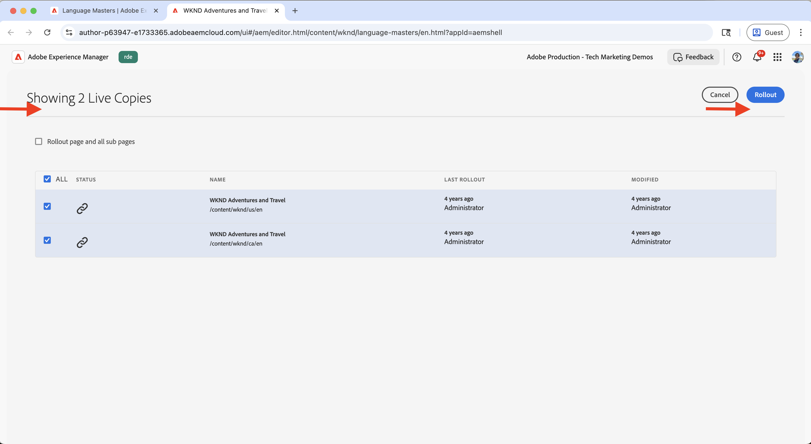
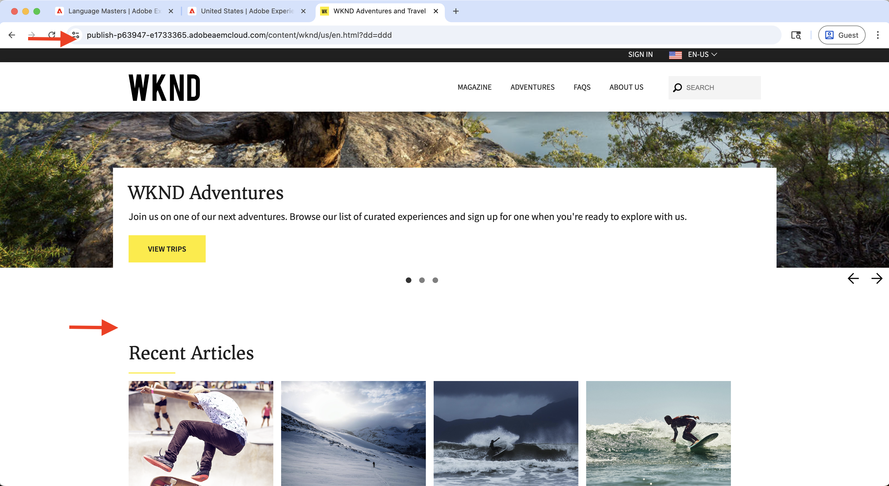
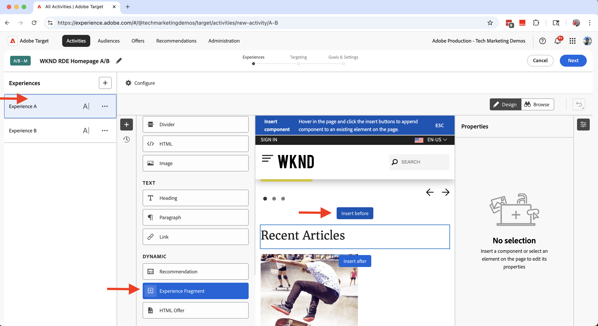
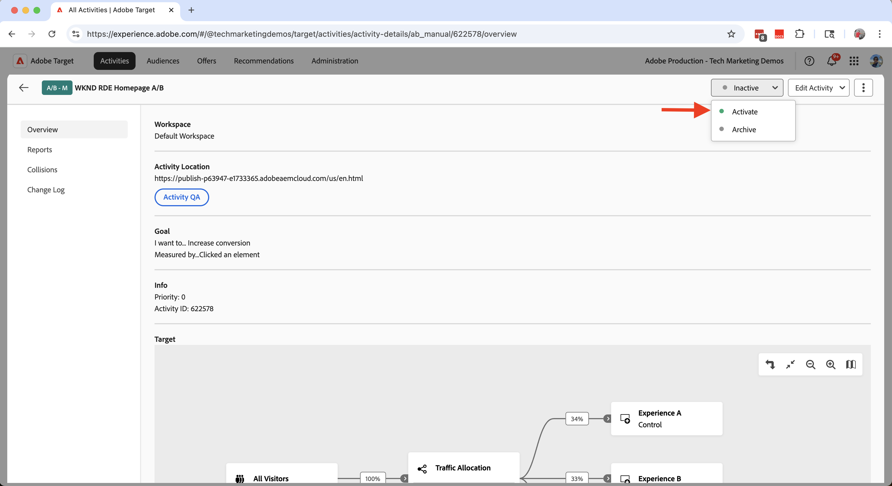
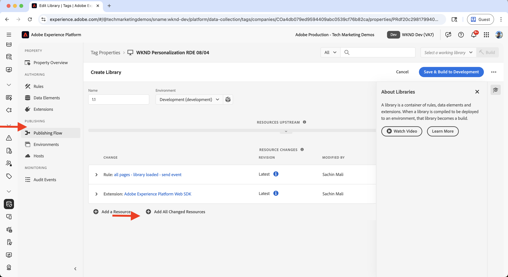

# 실험(A/B 테스트)

Adobe Target을 사용하여 AEM as a Cloud Service(AEMCS) 웹 사이트에서 다양한 콘텐츠 변형을 테스트하는 방법을 알아봅니다.

A/B 테스트는 다양한 버전의 콘텐츠를 비교하여 어떤 것이 비즈니스 목표를 달성하는 데 더 적합한지 결정하는 데 도움이 됩니다. 일반적인 시나리오는 다음과 같습니다.

- 랜딩 페이지의 헤드라인, 이미지 또는 call-to-action 버튼에서 변형 테스트
- 제품 세부 사항 페이지에 대한 서로 다른 레이아웃 또는 디자인 비교
- 프로모션 오퍼 또는 할인 전략 평가

## 데모 사용 사례

이 자습서에서는 WKND 웹 사이트에서 **서부 오스트레일리아에서 캠핑** 경험 조각(XF)에 대한 A/B 테스트를 구성합니다. 세 개의 XF 변형을 만들고 Adobe Target을 통해 A/B 테스트를 관리합니다.

변형 은 WKND 홈 페이지에 표시되므로 성능을 측정하고 어떤 버전이 더 나은 참여 및 전환을 유도하는지 확인할 수 있습니다.

### 라이브 데모

[WKND 지원 웹 사이트](https://wknd.enablementadobe.com/us/en.html)를 방문하여 작동 중인 A/B 테스트를 확인하십시오. 아래 비디오에서는 **서부 호주에서 캠핑**&#x200B;의 세 가지 변형이 모두 다른 브라우저를 통해 홈 페이지에 표시됩니다.

>[!VIDEO](https://video.tv.adobe.com/v/3473005/?learn=on&enablevpops)

## 사전 요구 사항

실험 사용 사례를 진행하기 전에 다음을 완료했는지 확인하십시오.

- [Adobe Target 통합](../setup/integrate-adobe-target.md): 팀이 AEM에서 개인화된 콘텐츠를 만들고 관리하고 Adobe Target에서 오퍼로 활성화할 수 있습니다.
- [Adobe Experience Platform의 태그 통합](../setup/integrate-adobe-tags.md): 팀이 AEM 코드를 다시 배포할 필요 없이 개인화 및 데이터 수집을 위해 JavaScript을 관리하고 배포할 수 있도록 해 줍니다.

## 높은 수준의 단계

A/B 테스트 설정 프로세스에는 실험을 만들고 구성하는 6가지 주요 단계가 포함됩니다.

1. **AEM에서 콘텐츠 변형 만들기**
2. **변형을 Adobe Target에 오퍼로 내보내기**
3. **Adobe Target에서 A/B 테스트 활동 만들기**
4. **Adobe Experience Platform에서 데이터 스트림 만들기 및 구성**
5. **Web SDK 확장으로 Tags 속성 업데이트**
6. **AEM 페이지에서 A/B 테스트 구현 확인**

## AEM에서 컨텐츠 변형 만들기

이 예제에서는 AEM WKND 프로젝트의 **Camping in Western Australia** Experience Fragment(XF)를 사용하여 A/B 테스트를 위해 WKND 웹 사이트 홈페이지에 사용될 세 가지 변형을 만듭니다.

1. AEM에서 **경험 조각** 카드를 클릭하고 **호주 서부 캠핑**&#x200B;으로 이동한 다음 **편집**을 클릭합니다.
   

1. 편집기의 **변형** 섹션에서 **만들기**&#x200B;를 클릭하고 **변형**&#x200B;을 선택합니다.\
   

1. **변형 만들기** 대화 상자에서 다음 작업을 수행합니다.
   - **템플릿**: 경험 조각 웹 변형 템플릿
   - **제목**: 예: &quot;눈금 없음&quot;

   **완료**&#x200B;를 클릭합니다.

   

1. 마스터 변형에서 **티저** 구성 요소를 복사하여 변형을 만든 다음 콘텐츠를 사용자 지정합니다(예: 제목 및 이미지 업데이트).\
   

   >[!TIP]
   >[변형 생성](https://experience.adobe.com/aem/generate-variations/)을 사용하여 마스터 XF에서 새 변형을 빠르게 만들 수 있습니다.

1. 단계를 반복하여 다른 변형(예: &quot;Wandering the Wild&quot;)을 만듭니다.\
   

   이제 A/B 테스트를 위한 경험 조각 변형이 3개 있습니다.

1. Adobe Target을 사용하여 변형을 표시하려면 먼저 홈페이지에서 기존 정적 티저를 제거해야 합니다. 경험 조각 변형은 Target을 통해 동적으로 삽입되므로 중복 콘텐츠를 방지합니다.

   - **영어** 홈 페이지 `/content/wknd/language-masters/en`(으)로 이동
   - 편집기에서 **Camping in Western Australia** 티저 구성 요소를 삭제합니다.\
     

1. **미국 > 영어** 홈 페이지(`/content/wknd/us/en`)에 변경 내용을 롤아웃하여 업데이트를 전파합니다.\
   

1. **미국 > 영어** 홈페이지를 게시하여 업데이트를 실시간으로 만듭니다.\
   

## 변형을 Adobe Target에 오퍼로 내보내기

A/B 테스트를 위해 Adobe Target에서 오퍼로 사용할 수 있도록 경험 조각 변형을 내보냅니다.

1. AEM에서 **서부 오스트레일리아에서 캠핑**&#x200B;으로 이동하고 세 가지 변형을 선택한 다음 **Adobe Target으로 내보내기**&#x200B;를 클릭합니다.\
   

2. Adobe Target에서 **오퍼**(으)로 이동하여 변형을 가져왔는지 확인하십시오.\
   

## Adobe Target에서 A/B 테스트 활동 만들기

이제 홈 페이지에서 실험을 실행할 A/B 테스트 활동을 만듭니다.

1. [Adobe Experience Cloud Visual Editing Helper](https://chromewebstore.google.com/detail/adobe-experience-cloud-vi/kgmjjkfjacffaebgpkpcllakjifppnca) Chrome 확장 기능을 설치합니다.

1. Adobe Target에서 **활동**(으)로 이동한 다음 **활동 만들기**&#x200B;를 클릭합니다.\
   

1. **A/B 테스트 활동 만들기** 대화 상자에서 다음을 입력합니다.
   - **유형**: 웹
   - **작성기**: 시각적
   - **활동 URL**: 예: `https://wknd.enablementadobe.com/us/en.html`

   **만들기**&#x200B;를 클릭합니다.

   

1. 활동의 이름을 의미 있는 이름으로 변경합니다(예: &quot;WKND 홈 페이지 A/B 테스트&quot;).\
   

1. **경험 A**&#x200B;에서 **최근 문서** 섹션 위에 **경험 조각** 구성 요소를 추가합니다.\
   

1. 구성 요소 대화 상자에서 **오퍼 선택**&#x200B;을 클릭합니다.\
   

1. **서부 오스트레일리아에서 캠핑** 변형을 선택하고 **추가**&#x200B;를 클릭합니다.\
   

1. **경험 B** 및 **C**&#x200B;에 대해 반복하고 각각 **그리드 해제** 및 **와일드 배회**&#x200B;를 선택합니다.\
   

1. **타깃팅** 섹션에서 트래픽이 모든 경험에서 균등하게 분할되었는지 확인합니다.\
   

1. **목표 및 설정**&#x200B;에서 성공 지표(예: 경험 조각에 대한 CTA 클릭)를 정의합니다.\
   

1. 오른쪽 상단의 **활성화**&#x200B;를 클릭하여 테스트를 시작합니다.\
   

## Adobe Experience Platform에서 데이터 스트림 만들기 및 구성

Adobe Web SDK을 Adobe Target에 연결하려면 Adobe Experience Platform에서 데이터 스트림을 만듭니다. 데이터 스트림은 웹 SDK과 Adobe Target 사이에서 라우팅 계층 역할을 합니다.

1. Adobe Experience Platform에서 **데이터스트림**(으)로 이동하고 **데이터스트림 만들기**&#x200B;를 클릭합니다.\
   

1. **데이터 스트림 만들기** 대화 상자에서 데이터 스트림의 **이름**&#x200B;을 입력하고 **저장**&#x200B;을 클릭합니다.\
   

1. 데이터 스트림이 만들어지면 **서비스 추가**&#x200B;를 클릭합니다.\
   

1. **서비스 추가** 단계의 드롭다운에서 **Adobe Target**&#x200B;을(를) 선택하고 **Target 환경 ID**&#x200B;를 입력합니다. Target 환경 ID는 **관리** > **환경**&#x200B;에서 Adobe Target에 있습니다. 서비스를 추가하려면 **저장**&#x200B;을 클릭하세요.\
   

1. 데이터스트림 세부 정보를 검토하여 Adobe Target 서비스가 나열되고 올바르게 구성되었는지 확인합니다.\
   

## 웹 SDK 확장으로 태그 속성 업데이트

AEM 페이지에서 개인화 및 데이터 수집 이벤트를 보내려면 Web SDK 확장을 태그 속성에 추가하고 페이지 로드 시 트리거하는 규칙을 구성합니다.

1. Adobe Experience Platform에서 **태그**(으)로 이동하여 [Adobe 태그 통합](../setup/integrate-adobe-tags.md) 단계에서 만든 속성을 엽니다.
   

1. 왼쪽 메뉴에서 **확장**&#x200B;을 클릭하고 **카탈로그** 탭으로 전환한 다음 **웹 SDK**&#x200B;을(를) 검색합니다. 오른쪽 패널에서 **설치**&#x200B;를 클릭합니다.\
   

1. **확장 설치** 대화 상자에서 이전에 만든 **데이터스트림**&#x200B;을 선택하고 **저장**&#x200B;을 클릭합니다.\
   

1. 설치 후 **Adobe Experience Platform Web SDK** 및 **Core** 확장이 모두 **설치됨** 탭에 표시되는지 확인하십시오.\
   

1. 다음으로, 라이브러리가 로드될 때 웹 SDK 이벤트를 전송하는 규칙을 구성합니다. 왼쪽 메뉴에서 **규칙**(으)로 이동한 다음 **새 규칙 만들기**&#x200B;를 클릭합니다.

   

   >[!TIP]
   >
   >규칙을 사용하면 사용자 상호 작용 또는 브라우저 이벤트에 따라 태그가 실행되는 시기와 방법을 정의할 수 있습니다.

1. **규칙 만들기** 화면에서 규칙 이름(예: `All Pages - Library Loaded - Send Event`)을 입력하고 **이벤트** 섹션 아래에서 **+ 추가**를 클릭합니다.
   

1. **이벤트 구성** 대화 상자에서:
   - **확장**: **코어** 선택
   - **이벤트 유형**: **로드된 라이브러리(페이지 상단) 선택**
   - **이름**: `Core - Library Loaded (Page Top)` 입력

   이벤트를 저장하려면 **변경 내용 유지**&#x200B;를 클릭합니다.

   

1. **작업** 섹션에서 **+ 추가**&#x200B;를 클릭하여 이벤트가 실행될 때 발생하는 작업을 정의합니다.

1. **작업 구성** 대화 상자에서:
   - **확장**: **Adobe Experience Platform Web SDK** 선택
   - **작업 유형**: **이벤트 보내기** 선택
   - **이름**: **AEP Web SDK - 이벤트 보내기** 선택

   

1. 오른쪽 패널의 **Personalization** 섹션에서 **시각적 개인화 결정 렌더링** 옵션을 선택합니다. 그런 다음 **변경 내용 유지**&#x200B;를 클릭하여 작업을 저장합니다.\
   

   >[!TIP]
   >
   >   이 작업은 페이지가 로드될 때 AEP Web SDK 이벤트를 전송하여 Adobe Target에서 개인화된 콘텐츠를 전달할 수 있도록 합니다.

1. 완료된 규칙을 검토하고 **저장**을 클릭합니다.
   

1. 변경 사항을 적용하려면 **플로우 게시**(으)로 이동하여 업데이트된 규칙을 **라이브러리**&#x200B;에 추가하십시오.\
   

1. 마지막으로 라이브러리를 **프로덕션**(으)로 승격합니다.
   

## AEM 페이지에서 A/B 테스트 구현 확인

활동이 활성 상태이고 태그 라이브러리가 프로덕션에 게시되면 AEM 페이지에서 A/B 테스트를 확인할 수 있습니다.

1. 게시된 사이트(예: [WKND 지원 웹 사이트](https://wknd.enablementadobe.com/us/en.html))를 방문하여 표시되는 변형을 확인하십시오. 다른 브라우저나 모바일 장치에서 액세스하여 대체 변형을 보십시오.
   

1. 브라우저의 개발자 도구를 열고 **네트워크** 탭을 확인합니다. `interact`(으)로 필터링하여 웹 SDK 요청을 찾습니다. 요청은 웹 SDK 이벤트 세부 정보여야 합니다.

   

응답에는 제공된 변형을 나타내는 Adobe Target의 개인화 결정이 포함되어야 합니다.\

1. 또는 [Adobe Experience Platform Debugger](https://chromewebstore.google.com/detail/adobe-experience-platform/bfnnokhpnncpkdmbokanobigaccjkpob) Chrome 확장을 사용하여 웹 SDK 이벤트를 검사할 수 있습니다.
   

## 라이브 데모

A/B 테스트가 제대로 작동하는지 확인하려면 [WKND 지원 웹 사이트](https://wknd.enablementadobe.com/us/en.html)를 방문하여 경험 조각의 다양한 변형이 홈 페이지에 어떻게 표시되는지 확인하십시오.

## 추가 리소스

- [A/B 테스트 개요](https://experienceleague.adobe.com/en/docs/target/using/activities/abtest/test-ab)
- [Adobe Experience Platform 웹 SDK](https://experienceleague.adobe.com/en/docs/experience-platform/web-sdk/home)
- [데이터스트림 개요](https://experienceleague.adobe.com/en/docs/experience-platform/datastreams/overview)
- [VEC(시각적 경험 작성기)](https://experienceleague.adobe.com/en/docs/target/using/experiences/vec/visual-experience-composer)
