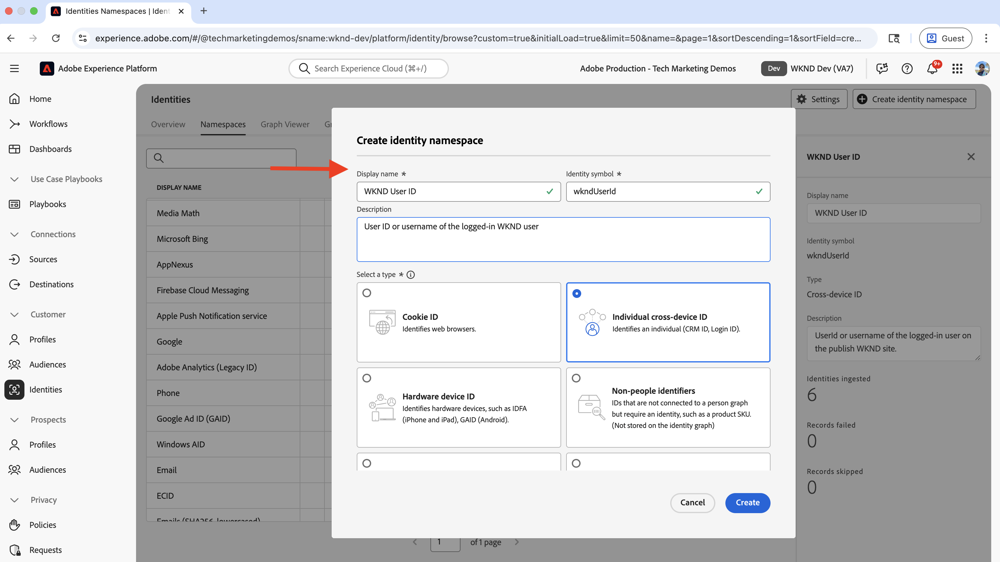
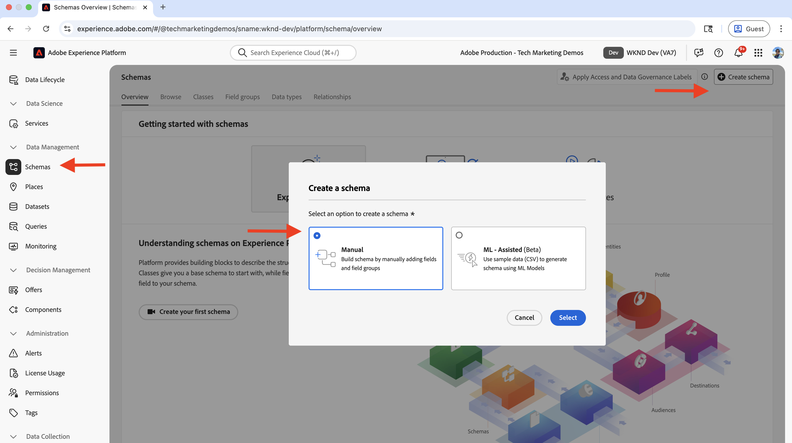
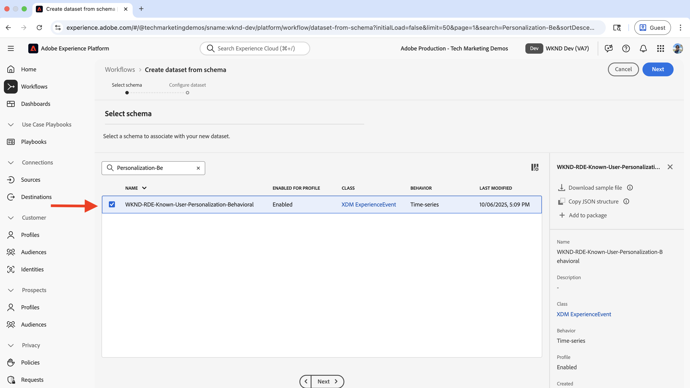
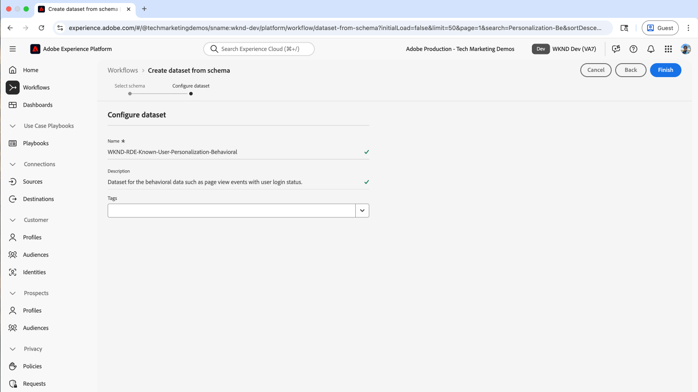
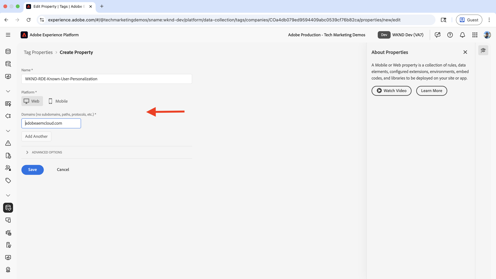
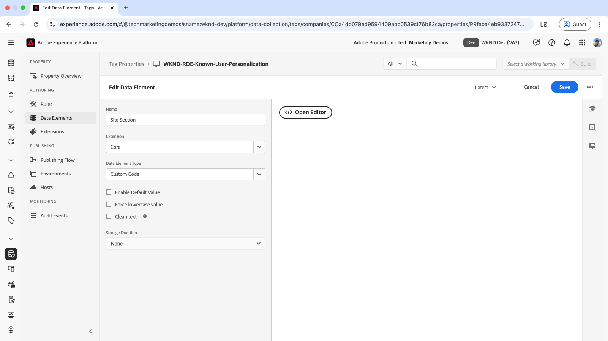
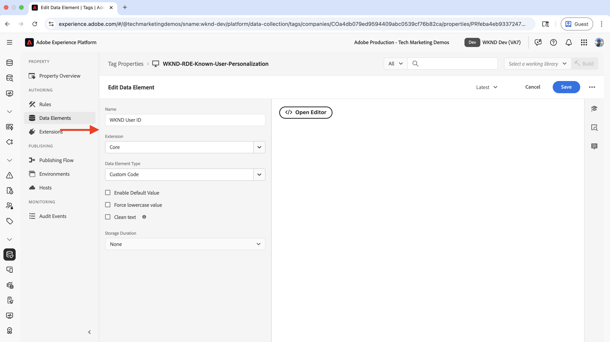
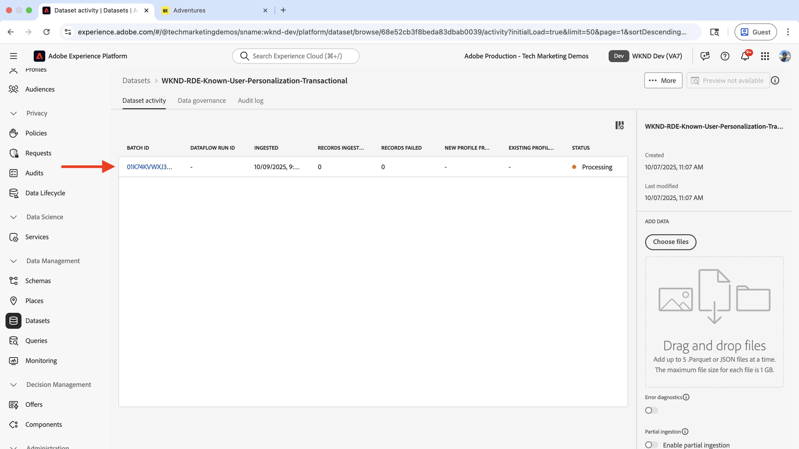
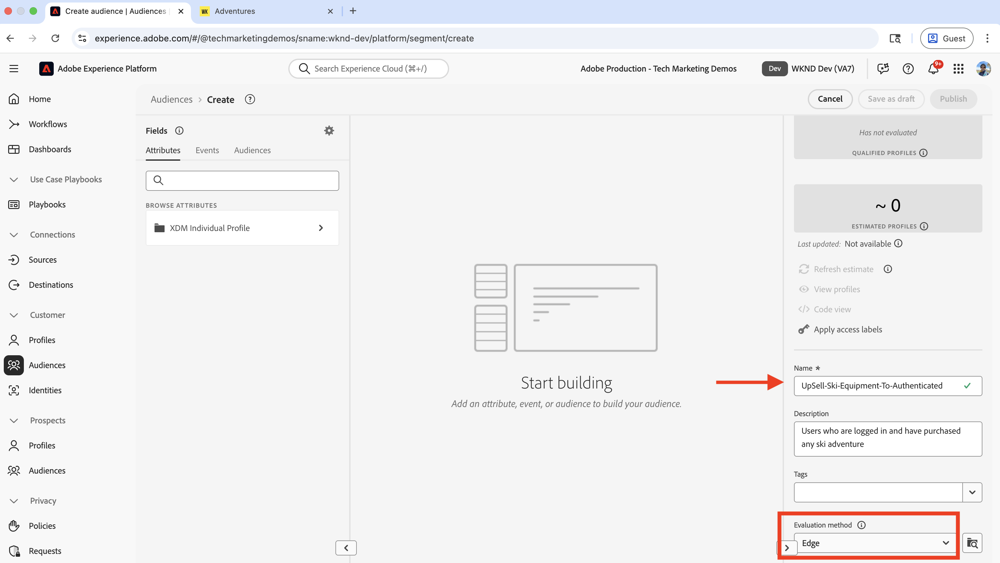

# 알려진 사용자 개인화

구매 내역, CRM 데이터 또는 사용자에 대해 수집된 기타 데이터와 같은 알려진 사용자 데이터를 기반으로 콘텐츠를 개인화하는 방법을 알아봅니다.

알려진 사용자 개인화는 사용자에 대해 수집한 데이터를 기반으로 개인화된 경험을 사용자에게 제공하는 데 도움이 됩니다. _사용자 데이터는 다른 시스템_ 또는 웹 사이트, 모바일 앱, 콜 센터 등과 같은 채널을 통해 수집되었을 수 있습니다. 그런 다음 이 _데이터를 함께 결합하여 전체 사용자 프로필을 만듭니다_. 이 데이터는 경험을 개인화하는 데 사용됩니다.

일반적인 시나리오는 다음과 같습니다.

- **콘텐츠 개인화**: 사용자의 프로필 데이터를 기반으로 개인화된 경험을 표시합니다. 예를 들어 사용자의 구매 내역을 기반으로 홈 페이지에 개인화된 영웅을 표시합니다.
- **업셀 및 크로스셀**: 사용자의 구매 기록에 따라 개인화된 업셀 및 크로스셀 권장 사항을 표시합니다. 예를 들어 사용자의 구매 내역에 대한 개인화된 상향 판매 추천을 표시합니다.
- **충성도 프로그램**: 사용자의 구매 기록에 따라 개인화된 충성도 프로그램 혜택을 표시합니다. 예를 들어 사용자의 구매 내역에 대한 개인화된 충성도 프로그램 혜택을 표시합니다.

조직에는 알려진 사용자 개인화에 대한 다양한 사용 사례가 있을 수 있습니다. 위의 내용은 몇 가지 예에 불과합니다.

## 예제 사용 사례


이 자습서에서는 [샘플 WKND 사이트](https://github.com/adobe/aem-guides-wknd)를 사용하여 **스키** 모험을 구매한 **로그인한 사용자**&#x200B;가 **WKND 홈 페이지**&#x200B;에서 개인화된 영웅을 보는 방법을 보여줍니다.

영웅 경험은 _스키_ 모험을 구매한 사용자에게 필수 스키 장비를 **업셀**&#x200B;하려고 합니다. **스키** 모험을 구매하지 않은 사용자에게는 기본 히어로 콘텐츠가 표시됩니다. 따라서 영웅 경험은 구매 내역 및 로그인 상태에 따라 사용자에게 개인화됩니다. 이러한 개인화를 활성화하기 위해 다양한 시스템의 데이터를 함께 결합하여 전체 고객 프로필을 생성하고 개인화 활동에 사용합니다.


### 시스템 전반에 걸친 사용자 데이터 관리

데모 목적으로 WKND 사용자 데이터가 다음 시스템에 있다고 가정합니다. 각 시스템은 두 가지 범주로 분류할 수 있는 다양한 유형의 데이터를 저장합니다.

- **동작 데이터**: 디지털 채널에서 사용자 상호 작용과 활동(페이지 보기, 클릭 수, 사이트 탐색, 로그인 상태, 탐색 패턴)을 캡처합니다.
- **트랜잭션 데이터**: 완료된 비즈니스 트랜잭션 및 고객 프로필 정보(구매, 주문 내역, 프로필 세부 정보, 환경 설정)를 기록합니다.

| 시스템 | 목적 | 어떤 데이터가 저장됩니까? | 데이터 유형 |
|------|------|------|------|
| AEM | 콘텐츠 관리 시스템(CMS), 어드벤처 목록 및 예약, 로그인 기능 | 사용자 상호 작용: 페이지 보기, 로그인 상태, 사이트 탐색 사용자 ID, 이름, 이메일 등 최소 사용자 식별자. | 행동 데이터 |
| 기타 시스템 | 사용자 프로필 및 구매 거래 레코드를 전체 레코드 시스템으로 사용합니다. | 전체 고객 프로필: 사용자 ID, 이름, 주소, 전화번호, 구매 내역, 주문 세부 사항, 환경 설정. | 트랜잭션 데이터 |

다른 시스템은 OMS(Order Management 시스템), CRM(고객 관계 관리) 시스템, MDM(기본 데이터 관리) 시스템 또는 트랜잭션 데이터를 저장하는 다른 시스템일 수 있습니다.

또한 WKND 사이트에는 사용자가 **모험**&#x200B;을 구매/예약할 수 있는 UI(사용자 인터페이스)가 있다고 가정합니다. AEM은 다른 시스템과 통합되어 어드벤처 구매 데이터를 저장합니다. 또한 구매 전이나 구매 중에 사용자가 WKND 사이트에서 계정을 만들었습니다.

논리 다이어그램은 WKND 사이트와의 사용자 상호 작용과 행동 및 트랜잭션 데이터를 수집하여 Experience Platform에 제공하는 방법을 보여 줍니다.


이는 알려진 사용자 개인화의 개념을 보여 주기 위해 과도하게 단순화된 버전입니다. 실제 시나리오에서는 동작 및 트랜잭션 데이터가 수집 및 저장되는 시스템이 여러 개 있을 수 있습니다.

### 핵심 사항

- **분산 데이터 저장소**: 사용자 데이터는 여러 시스템에 저장됩니다. AEM은 로그인 기능을 위해 최소한의 사용자 데이터(사용자 ID, 이름, 전자 메일)를 저장하는 반면, 다른 시스템(OMS, CRM, MDM)은 구매 내역과 같은 전체 사용자 프로필 및 트랜잭션 데이터를 유지합니다.
- **ID 연결**: 시스템이 서로 다른 플랫폼 및 채널에서 사용자를 고유하게 식별하는 공통 식별자(WKND 사용자 ID - `wkndUserId`)를 사용하여 연결되어 있습니다.
- **프로필 만들기 완료**: 목표는 이러한 분산 시스템의 사용자 데이터를 연결하여 통합 고객 프로필을 만드는 것입니다. 이 프로필은 개인화된 경험을 전달하는 데 사용됩니다.

사용 사례에는 다른 시스템과 데이터 저장소가 있을 수 있습니다. 다른 플랫폼 및 채널에서 사용자를 고유하게 식별하는 공통 식별자를 식별하는 것이 핵심입니다.

## 사전 요구 사항

알려진 사용자 개인화 사용 사례를 진행하기 전에 다음을 완료했는지 확인하십시오.

- [Adobe Target 통합](../setup/integrate-adobe-target.md): 팀이 AEM의 중앙에서 개인화된 콘텐츠를 만들고 관리하며 Adobe Target의 오퍼로 활성화할 수 있습니다.
- [Adobe Experience Platform의 태그 통합](../setup/integrate-adobe-tags.md): 팀이 AEM 코드를 다시 배포할 필요 없이 개인화 및 데이터 수집을 위해 JavaScript을 관리하고 배포할 수 있도록 허용합니다.

스키마, 데이터 세트, 데이터스트림, 대상, ID 및 프로필과 같은 [ECID(Adobe Experience Cloud Identity Service)](https://experienceleague.adobe.com/en/docs/id-service/using/home) 및 [Adobe Experience Platform](https://experienceleague.adobe.com/en/docs/experience-platform/landing/home) 개념에도 익숙합니다.

이 자습서에서는 Adobe Experience Platform에서 ID 결합에 대해 알아보고 고객 프로필을 빌드합니다. 따라서 행동 데이터를 트랜잭션 데이터와 결합하여 완전한 고객 프로필을 만듭니다.

## 상위 수준 단계

알려진 사용자 개인화 설정 프로세스에는 Adobe Experience Platform, AEM 및 Adobe Target의 단계가 포함됩니다.

1. **Adobe Experience Platform에서:**
   1. WKND 사용자 ID(_)에 대해_ ID 네임스페이스`wkndUserId`를 만듭니다.
   1. 두 개의 XDM(경험 데이터 모델) 스키마(데이터 구성 및 유효성 검사 방법을 정의하는 표준화된 데이터 구조)를 만들고 구성합니다(하나는 행동 데이터용, 하나는 트랜잭션 데이터용).
   1. 동작 데이터와 트랜잭션 데이터에 대해 각각 하나씩, 두 개의 데이터 세트를 만들고 구성합니다
   1. 데이터 스트림 만들기 및 구성
   1. 태그 속성 만들기 및 구성
   1. 프로필에 대한 병합 정책 구성
   1. (V2) Adobe Target 대상 설정

2. **AEM에서:**
   1. 브라우저의 세션 저장소에 사용자 ID를 저장하도록 WKND 사이트 로그인 기능을 개선합니다.
   1. AEM 페이지에 태그 속성 통합 및 삽입
   1. AEM 페이지에서 데이터 수집 확인
   1. Adobe Target 통합
   1. 개인화된 오퍼 만들기

3. **Adobe Experience Platform에서:**
   1. 동작 데이터 및 프로필 만들기 확인
   1. 트랜잭션 데이터 수집
   1. 동작 및 트랜잭션 데이터 결합 확인
   1. 대상자 만들기 및 구성
   1. Adobe Target에 대상자 활성화

4. **Adobe Target에서:**
   1. 대상 및 오퍼 확인
   1. 활동 만들기 및 구성

5. **AEM 페이지에서 알려진 사용자 개인화 구현을 확인**

Adobe Experience Platform(AEP)의 다양한 솔루션은 여러 시스템에서 사용자 데이터를 수집, 관리, 식별 및 연결하는 데 사용됩니다. 결합된 사용자 데이터를 사용하여 Adobe Target에서 대상이 만들어지고 활성화됩니다. Adobe Target의 활동을 사용하면 개인화된 경험이 대상 기준과 일치하는 사용자에게 전달됩니다.

## Adobe Experience Platform 설정

완전한 고객 프로필을 만들기 위해서는 행동(페이지 보기 데이터)과 트랜잭션(WKND Adventure 구매) 데이터를 모두 수집하고 저장해야 합니다. 행동 데이터는 태그 속성을 사용하여 수집되고 트랜잭션 데이터는 WKND 어드벤처 구매 시스템을 사용하여 수집됩니다.

그런 다음 트랜잭션 데이터를 Experience Platform에 수집하고 동작 데이터와 결합하여 전체 고객 프로필을 만듭니다.

이 예제에서는 **Ski** 모험을 구매한 사용자를 분류하려면 어드벤처 구매 데이터와 함께 페이지 보기 데이터가 필요합니다. 데이터는 여러 시스템의 공통 식별자인 WKND 사용자 ID(`wkndUserId`)를 사용하여 함께 결합됩니다.

먼저 Adobe Experience Platform에 로그인하여 데이터를 수집하고 연결하는 데 필요한 구성 요소를 설정해 보겠습니다.

[Adobe Experience Cloud](https://experience.adobe.com/)에 로그인하고 앱 전환기 또는 빠른 액세스 섹션에서 **Experience Platform**(으)로 이동합니다.


### ID 네임스페이스 만들기

ID 네임스페이스는 ID에 컨텍스트를 제공하는 논리적 컨테이너로서, Experience Platform에서 사용 중인 ID 시스템(예: 이메일, CRM ID 또는 로열티 ID)을 이해하는 데 도움이 됩니다. 두 개 이상의 개별 프로필 데이터와 관련시키기 위해 ID 네임스페이스가 사용됩니다. 이러한 개별 프로필 데이터 조각이 모두 속성에 대해 동일한 값을 가지고 동일한 네임스페이스를 공유하면 함께 결합됩니다. 속성을 ID 결합 속성으로 정규화하려면 동일한 네임스페이스여야 합니다.

이 예에서 WKND 사용자 ID(`wkndUserId`)는 동작 및 트랜잭션 데이터의 공통 식별자입니다. 이 공통 식별자를 사용하여 데이터를 함께 결합함으로써 완전한 고객 프로필을 만듭니다.

WKND 사용자 ID(`wkndUserId`)에 대한 ID 네임스페이스를 만들어 보겠습니다.

- **Adobe Experience Platform**&#x200B;의 왼쪽 탐색 메뉴에서 **ID**&#x200B;을(를) 클릭합니다. 그런 다음 오른쪽 상단에서 **ID 네임스페이스 만들기** 단추를 클릭합니다.

  

- **ID 네임스페이스 만들기** 대화 상자에서 다음을 입력합니다.
   - **표시 이름**: WKND 사용자 ID
   - **설명**: 로그인한 WKND 사용자의 사용자 ID 또는 사용자 이름
   - **유형 선택**: 개별 교차 장치 ID

  ID 네임스페이스를 만들려면 **만들기**&#x200B;를 클릭합니다.

  

### 스키마 만들기

스키마는 Adobe Experience Platform에서 수집하는 데이터의 구조와 형식을 정의합니다. 데이터 일관성을 보장하고 표준화된 데이터 필드를 기반으로 의미 있는 대상을 만들 수 있습니다. 알려진 사용자 개인화의 경우 두 개의 스키마, 즉 동작 데이터와 트랜잭션 데이터에 대한 스키마가 필요합니다.

#### 동작 데이터 스키마

먼저 스키마를 만들어 페이지 보기 이벤트 및 사용자 상호 작용과 같은 동작 데이터를 수집합니다.

- **Adobe Experience Platform**&#x200B;에서 왼쪽 탐색 메뉴에서 **스키마**&#x200B;을(를) 클릭하고 오른쪽 상단에서 **스키마 만들기** 단추를 클릭합니다. 그런 다음 **수동** 옵션을 선택하고 **선택** 단추를 클릭합니다.

  

- **스키마 만들기** 마법사에서 **스키마 세부 정보** 단계에 대해 **경험 이벤트** 옵션(페이지 보기, 클릭 수 및 사용자 상호 작용과 같은 시계열 데이터)을 선택하고 **다음**&#x200B;을 클릭합니다.

  

- **이름 및 검토** 단계에 대해 다음을 입력하십시오.
   - **스키마 표시 이름**: WKND-RDE-Known-User-Personalization-Behavioral
   - **선택한 클래스**: XDM ExperienceEvent

  

- 스키마를 다음과 같이 업데이트합니다.
   - **필드 그룹 추가**: AEP 웹 SDK ExperienceEvent
   - **프로필**: 사용

  스키마를 만들려면 **저장**&#x200B;을 클릭합니다.

  

- 사용자가 로그인(인증됨) 또는 익명으로 로그인했는지 확인하려면 스키마에 사용자 지정 필드를 추가합니다. 이 사용 사례의 목표는 **스키** 모험을 구매한 알려진 사용자를 위한 콘텐츠를 개인화하는 것입니다. 따라서 사용자가 로그인(인증)했는지 또는 익명으로 로그인했는지 확인하는 것이 중요합니다.


   - 스키마 이름 옆에 있는 **+** 단추를 클릭합니다.
   - **필드 속성** 섹션에서 다음을 입력하십시오.
      - **필드 이름**: wkndLoginStatus
      - **표시 이름**: WKND 로그인 상태
      - **유형**: 문자열
      - **할당 대상**: 필드 그룹 > `wknd-user-details`

     아래로 스크롤하여 **적용** 단추를 클릭합니다.

     

- 최종 동작 데이터 스키마는 다음과 같아야 합니다.

  

#### 트랜잭션 데이터 스키마

그런 다음 스키마를 만들어 WKND Adventure 구매와 같은 트랜잭션 데이터를 수집합니다.

- **스키마 만들기** 마법사에서 **스키마 세부 정보** 단계에 대해 **개인 프로필** 옵션(고객 특성, 환경 설정 및 구매 내역과 같은 레코드 기반 데이터의 경우)을 선택하고 **다음**&#x200B;을 클릭합니다.

  

- **이름 및 검토** 단계에 대해 다음을 입력하십시오.
   - **스키마 표시 이름**: WKND-RDE-Known-User-Personalization-Transactional
   - **선택한 클래스**: XDM 개별 프로필

  

- 사용자의 WKND Adventure 구매 세부 사항을 저장하기 위해 먼저 구매에 대한 식별자 역할을 하는 사용자 지정 필드를 추가하겠습니다. WKND 사용자 ID(`wkndUserId`)는 시스템의 공통 식별자입니다.
   - 스키마 이름 옆에 있는 **+** 단추를 클릭합니다.
   - **필드 속성** 섹션에서 다음을 입력하십시오.
      - **필드 이름**: wkndUserId
      - **표시 이름**: WKND 사용자 ID
      - **유형**: 문자열
      - **할당 대상**: 필드 그룹 > `wknd-user-purchase-details`

  

   - 아래로 스크롤하여 **ID**, **기본 ID**(다른 소스의 데이터를 통합 프로필로 연결하는 데 사용되는 기본 식별자)을 확인하고 **ID 네임스페이스** 드롭다운에서 **WKND 사용자 ID**&#x200B;을(를) 선택합니다. 마지막으로 **적용** 단추를 클릭합니다.

  

- 사용자 지정 기본 ID 필드를 추가한 후 스키마는 다음과 같아야 합니다.

  

- 마찬가지로 다음 필드를 추가하여 추가 사용자 및 어드벤처 구매 세부 정보를 저장합니다.

  | 필드 이름 | 표시 이름 | 유형 | 할당 대상 |
  |----------|------------|----|---------|
  | adventurePurchased | 구매한 모험 | 문자열 | 필드 그룹 > `wknd-user-purchase-details` |
  | adventurePurchaseAmount | 어드벤처 구매 금액 | 이중 | 필드 그룹 > `wknd-user-purchase-details` |
  | adventurePurchaseQuantity | 어드벤처 구매 수량 | 정수 | 필드 그룹 > `wknd-user-purchase-details` |
  | adventurePurchasdate | 어드벤처 구매일 | 날짜 | 필드 그룹 > `wknd-user-purchase-details` |
  | adventureStartDate | 모험 시작일 | 날짜 | 필드 그룹 > `wknd-user-purchase-details` |
  | adventureEnddate | 어드벤처 종료일 | 날짜 | 필드 그룹 > `wknd-user-purchase-details` |
  | 이름 | 이름 | 문자열 | 필드 그룹 > `wknd-user-purchase-details` |
  | 성 | 성 | 문자열 | 필드 그룹 > `wknd-user-purchase-details` |
  | 이메일 | 이메일 | 이메일 주소 | 필드 그룹 > `wknd-user-purchase-details` |
  | 전화 | 모바일 | 오브젝트 | 필드 그룹 > `wknd-user-purchase-details` |
  | 성별 | 성별 | 문자열 | 필드 그룹 > `wknd-user-purchase-details` |
  | 나이 | 나이 | 정수 | 필드 그룹 > `wknd-user-purchase-details` |
  | 주소 | 주소 | 문자열 | 필드 그룹 > `wknd-user-purchase-details` |
  | 도시 | 도시 | 문자열 | 필드 그룹 > `wknd-user-purchase-details` |
  | 시/도 | 상태 | 문자열 | 필드 그룹 > `wknd-user-purchase-details` |
  | 국가 | 국가 | 문자열 | 필드 그룹 > `wknd-user-purchase-details` |
  | 우편번호 | 우편번호 | 문자열 | 필드 그룹 > `wknd-user-purchase-details` |

  

- 스키마에 대해 프로필 을 활성화합니다.

  

이제 동작 및 트랜잭션 데이터에 대한 스키마를 모두 만들었습니다.

### 데이터 세트 만들기 및 구성

데이터 집합은 특정 스키마를 따르는 데이터의 컨테이너입니다. 이 예제에서는 동작 데이터에 대해 데이터 세트를 만들고 트랜잭션 데이터에 대해 데이터 세트를 만드는 두 개의 데이터 세트를 만듭니다.

#### 동작 데이터 세트

- **Adobe Experience Platform**&#x200B;에서 왼쪽 탐색 메뉴에서 **데이터 세트**&#x200B;를 클릭하고 오른쪽 상단에서 **데이터 세트 만들기** 단추를 클릭합니다. 그런 다음 **스키마 기반** 옵션을 선택하고 **다음**&#x200B;을 클릭합니다.

  

- **스키마 선택** 단계에서 **WKND-RDE-Known-User-Personalization-Behavior** 스키마를 선택하고 **다음**&#x200B;을(를) 클릭합니다.

  

- **데이터 집합 구성** 단계에 대해 다음을 입력하십시오.
   - **이름**: WKND-RDE-Known-User-Personalization-Behavioral
   - **설명**: 사용자 로그인 상태의 페이지 보기와 같은 동작 데이터 집합입니다.

  

  데이터 집합을 만들려면 **마침**&#x200B;을 클릭하세요.

- **프로필** 스위치를 전환하여 프로필에 대한 데이터 세트를 사용하도록 설정합니다.

  

#### 트랜잭션 데이터 데이터 세트

- 트랜잭션 데이터 데이터 세트에 대해 동일한 단계를 반복합니다. 유일한 차이점은 스키마와 데이터 세트 이름입니다.

   - **스키마**: WKND-RDE-Known-User-Personalization-Transactional
   - **데이터 집합**: WKND-RDE-Known-User-Personalization-Transactional
   - **설명**: WKND Adventure 구매 등 트랜잭션 데이터의 데이터 세트입니다.
   - **프로필**: 사용

  최종 트랜잭션 데이터 데이터 세트는 다음과 같아야 합니다.

  

두 데이터 세트가 모두 준비되면 이제 데이터 스트림을 만들어 웹 사이트에서 Experience Platform으로의 데이터 흐름을 활성화할 수 있습니다.

### 데이터 스트림 만들기 및 구성

데이터 스트림은 데이터가 웹 SDK을 통해 웹 사이트에서 Adobe Experience Platform으로 흐르는 방식을 정의하는 구성입니다. 웹 사이트와 플랫폼 간의 Bridge 역할을 하여 데이터의 형식이 제대로 지정되고 올바른 데이터 세트로 라우팅되도록 합니다. 알려진 사용자 개인화의 경우 Edge 세그멘테이션 및 Personalization 대상과 같은 서비스를 활성화합니다.

웹 SDK을 통해 _동작_(트랜잭션 아님) 데이터를 Experience Platform으로 전송하는 데이터 스트림을 만들어 보겠습니다.

- **Adobe Experience Platform**&#x200B;에서 왼쪽 탐색 메뉴에서 **데이터스트림**&#x200B;을 클릭하고 **데이터스트림 만들기**&#x200B;를 클릭합니다.

  

- **새 데이터스트림** 단계에서 다음을 입력하십시오.

   - **이름**: WKND-RDE-Known-User-Personalization-Behavioral
   - **설명**: 동작 데이터를 Experience Platform에 보낼 데이터스트림
   - **매핑 스키마**: WKND-RDE-Known-User-Personalization-Behavioral

  

  데이터 스트림을 만들려면 **저장**&#x200B;을 클릭합니다.

- 데이터 스트림이 만들어지면 **서비스 추가**&#x200B;를 클릭합니다.

  

- **서비스 추가** 단계의 드롭다운에서 **Adobe Experience Platform**&#x200B;을(를) 선택하고 다음을 입력합니다.
   - **이벤트 데이터 세트**: WKND-RDE-Known-User-Personalization-Behavioral
   - **프로필 데이터 세트**: WKND-RDE-Known-User-Personalization-Behavioral
   - **Offer Decisioning**: 활성화(Adobe Target에서 실시간으로 개인화된 오퍼를 요청하고 제공할 수 있음)
   - **Edge 세분화**: 활성화(즉각적인 개인화를 위해 Edge Network에서 실시간으로 대상 평가)
   - **Personalization 대상**: 활성화(Adobe Target과 같은 개인화 도구로 대상자를 공유할 수 있음)

  서비스를 추가하려면 **저장**&#x200B;을 클릭하세요.

  

- **서비스 추가** 단계의 드롭다운에서 **Adobe Target**&#x200B;을(를) 선택하고 **Target 환경 ID**&#x200B;를 입력합니다. Target 환경 ID는 **관리** > **환경**&#x200B;에서 Adobe Target에 있습니다. 서비스를 추가하려면 **저장**&#x200B;을 클릭하세요.
  

- 최종 데이터 스트림은 다음과 같아야 합니다.

  

이제 데이터 스트림은 웹 SDK을 통해 Experience Platform으로 동작 데이터를 전송하도록 구성됩니다.

_트랜잭션_ 데이터는 일괄 처리 수집(실시간으로 수집되지 않고 예약된 간격으로 대용량 데이터 세트를 업로드하는 방법)을 사용하여 Experience Platform에 수집됩니다. WKND Adventure 구매 데이터는 WKND 사이트를 사용하여 수집되고 다른 시스템(예: OMS, CRM 또는 MDM)에 저장됩니다. 그런 다음 일괄 처리 수집을 사용하여 데이터가 Experience Platform에 수집됩니다.

또한 이 자습서에서는 다루지 않는 웹 사이트에서 Experience Platform으로 직접 데이터를 수집할 수도 있습니다. 사용 사례에서는 시스템 간에 사용자 데이터를 결합하고 전체 고객 프로필을 만드는 프로세스를 강조하고자 합니다.

## 태그 속성 만들기 및 구성

Tags 속성은 웹 사이트에서 데이터를 수집하여 Adobe Experience Platform으로 전송하는 JavaScript 코드의 컨테이너입니다. 사용자 상호 작용 및 페이지 보기를 캡처하는 데이터 수집 레이어 역할을 합니다. 알려진 사용자 개인화의 경우 페이지 보기 데이터(예: 페이지 이름, URL, 사이트 섹션 및 호스트 이름)와 함께 사용자 로그인 상태 및 WKND 사용자 ID도 수집됩니다. WKND 사용자 ID(`wkndUserId`)가 ID 맵 개체의 일부로 전송됩니다.

사용자가 WKND 사이트를 방문할 때 페이지 보기 데이터 및 사용자 로그인 상태 + 사용자 ID(로그인한 경우)를 캡처하는 태그 속성을 만들겠습니다.

[Adobe 태그 통합](../setup/integrate-adobe-tags.md) 단계에서 만든 Tags 속성을 업데이트할 수 있습니다. 그러나 단순하게 유지하기 위해 새 Tags 속성이 만들어집니다.

### 태그 속성 만들기

- **Adobe Experience Platform**&#x200B;에서 왼쪽 탐색 메뉴에서 **태그**&#x200B;를 클릭하고 **새 속성** 단추를 클릭합니다.

  

- **속성 만들기** 대화 상자에서 다음을 입력합니다.
   - **속성 이름**: WKND-RDE-Known-User-Personalization
   - **속성 유형**: **웹** 선택
   - **도메인**: 속성을 배포하는 도메인(예: `adobeaemcloud.com`)

  속성을 만들려면 **저장**&#x200B;을 클릭합니다.

  

- 새 속성을 열고 왼쪽 탐색에서 **확장**&#x200B;을 클릭한 다음 **카탈로그** 탭을 클릭합니다. **웹 SDK**&#x200B;을 검색하고 **설치** 단추를 클릭합니다.
  

- **확장 설치** 대화 상자에서 이전에 만든 **데이터스트림**&#x200B;을 선택하고 **저장**&#x200B;을 클릭합니다.
  

#### 데이터 요소 추가

데이터 요소는 웹 사이트에서 특정 데이터 포인트를 캡처하여 규칙 및 기타 태그 구성에서 사용할 수 있도록 하는 변수입니다. 데이터 수집을 위한 빌딩 블록 역할을 하며 사용자 상호 작용 및 페이지 보기에서 의미 있는 정보를 추출할 수 있습니다. 알려진 사용자 개인화의 경우 대상 세그먼트를 만들려면 호스트 이름, 사이트 섹션 및 페이지 이름과 같은 페이지 세부 정보를 캡처해야 합니다. 이와 함께 사용자 로그인 상태와 WKND 사용자 ID(로그인한 경우)를 캡처해야 합니다.

다음 데이터 요소를 만들어 중요한 페이지 세부 정보를 캡처합니다.

- 왼쪽 탐색에서 **데이터 요소**&#x200B;를 클릭하고 **새 데이터 요소 만들기** 단추를 클릭합니다.
  

- **새 데이터 요소 만들기** 대화 상자에서 다음을 입력합니다.
   - **이름**: 호스트 이름
   - **확장**: **코어** 선택
   - **데이터 요소 형식**: **사용자 지정 코드** 선택
   - **편집기 열기** 단추를 클릭하고 다음 코드 조각을 입력하십시오.

     ```javascript
     if(window && window.location && window.location.hostname) {
         return window.location.hostname;
     }        
     ```

  

- 마찬가지로 다음 데이터 요소를 만듭니다.

   - **이름**: 사이트 섹션
   - **확장**: **코어** 선택
   - **데이터 요소 형식**: **사용자 지정 코드** 선택
   - **편집기 열기** 단추를 클릭하고 다음 코드 조각을 입력하십시오.

     ```javascript
     if(event && event.component && event.component.hasOwnProperty('repo:path')) {
         let pagePath = event.component['repo:path'];
     
         let siteSection = '';
     
         //Check of html String in URL.
         if (pagePath.indexOf('.html') > -1) { 
         siteSection = pagePath.substring(0, pagePath.lastIndexOf('.html'));
     
         //replace slash with colon
         siteSection = siteSection.replaceAll('/', ':');
     
         //remove `:content`
         siteSection = siteSection.replaceAll(':content:','');
         }
     
         return siteSection 
     }        
     ```

  

   - **이름**: 페이지 이름
   - **확장**: **코어** 선택
   - **데이터 요소 형식**: **사용자 지정 코드** 선택
   - **편집기 열기** 단추를 클릭하고 다음 코드 조각을 입력하십시오.

     ```javascript
     if(event && event.component && event.component.hasOwnProperty('dc:title')) {
         // return value of 'dc:title' from the data layer Page object, which is propogated via 'cmp:show' event
         return event.component['dc:title'];
     }
     ```

  


   - **이름**: WKND 사용자 ID
   - **확장**: **코어** 선택
   - **데이터 요소 형식**: **사용자 지정 코드** 선택
   - **편집기 열기** 단추를 클릭하고 다음 코드 조각을 입력하십시오.

     ```javascript
     // Data element for WKND User ID
     if(event && event.user && event.user.userId) {
         console.log('UserID:', event.user.userId);
         return event.user.userId;
     } else {
         console.log('UserID:');
         return "";
     }        
     ```

  


   - **이름**: WKND 사용자 상태
   - **확장**: **코어** 선택
   - **데이터 요소 형식**: **사용자 지정 코드** 선택
   - **편집기 열기** 단추를 클릭하고 다음 코드 조각을 입력하십시오.

     ```javascript
     // Data element for user login status
     if(event && event.user && event.user.status) {
         console.log('User status:', event.user.status);
         return event.user.status;
     } else {
         console.log('User status:anonymous');
         return 'anonymous';
     }        
     ```

  

- 그런 다음 **ID 맵** 유형의 데이터 요소를 만듭니다. ID 맵은 여러 사용자 식별자를 저장하고 서로 연결하는 표준 XDM 구조로서, 시스템 간에 ID 결합을 가능하게 합니다. 이 데이터 요소는 WKND 사용자 ID(로그인한 경우)를 ID 맵 개체의 일부로 저장하는 데 사용됩니다.

   - **이름**: IdentityMap-WKND 사용자 ID
   - **확장**: **Adobe Experience Platform Web SDK** 선택
   - **데이터 요소 유형**: **ID 맵** 선택

  오른쪽 패널에서
   - **네임스페이스**: **wkndUserId** 선택
   - **ID**: **WKND 사용자 ID** 데이터 요소 선택
   - **인증 상태**: **인증됨** 선택
   - **기본**: **true** 선택


  데이터 요소를 만들려면 **저장**&#x200B;을 클릭합니다.

  

- 그런 다음 **변수** 유형의 데이터 요소를 만듭니다. 이 데이터 요소는 Experience Platform으로 보내기 전에 페이지 세부 사항으로 채워집니다.

   - **이름**: XDM-변수 페이지 보기
   - **확장**: **Adobe Experience Platform Web SDK** 선택
   - **데이터 요소 형식**: **변수** 선택

  오른쪽 패널에서
   - **샌드박스**: 샌드박스 선택
   - **스키마**: **WKND-RDE-Known-User-Personalization** 스키마를 선택합니다.

  데이터 요소를 만들려면 **저장**&#x200B;을 클릭합니다.

  

   - 최종 데이터 요소는 다음과 같아야 합니다.

     

#### 규칙 추가

규칙은 데이터를 수집하여 Adobe Experience Platform으로 보내는 시기와 방법을 정의합니다. 특정 이벤트가 웹 사이트에서 발생할 때 발생하는 상황을 결정하는 논리 계층 역할을 합니다. 알려진 사용자 개인화의 경우, 사용자가 WKND 사이트를 방문할 때 페이지 보기 데이터 및 사용자 로그인 상태 + 사용자 ID(로그인된 경우)를 캡처하는 규칙을 만듭니다.

Experience Platform으로 보내기 전에 다른 데이터 요소를 사용하여 **XDM-Variable Pageview** 데이터 요소를 채우는 규칙을 만듭니다. 사용자가 WKND 웹 사이트를 검색할 때 규칙이 트리거됩니다.

- 왼쪽 탐색에서 **규칙**&#x200B;을 클릭하고 **새 규칙 만들기** 단추를 클릭합니다.
  

- **새 규칙 만들기** 대화 상자에서 다음을 입력합니다.
   - **이름**: 모든 페이지 - 로드 중 - 사용자 데이터 포함

   - **이벤트** 섹션의 경우 **추가**&#x200B;를 클릭하여 **이벤트 구성** 마법사를 엽니다.
      - **확장**: **코어** 선택
      - **이벤트 유형**: **사용자 지정 코드** 선택
      - **편집기 열기** 단추를 클릭하고 다음 코드 조각을 입력하십시오.

     ```javascript
     var pageShownEventHandler = function(evt) {
         // defensive coding to avoid a null pointer exception
         if(evt.hasOwnProperty("eventInfo") && evt.eventInfo.hasOwnProperty("path")) {
             //trigger Launch Rule and pass event
             console.debug("cmp:show event: " + evt.eventInfo.path);
     
             // Get user data from session storage
             var userData = getUserDataFromSession();
     
             var event = {
                 //include the path of the component that triggered the event
                 path: evt.eventInfo.path,
                 //get the state of the component that triggered the event
                 component: window.adobeDataLayer.getState(evt.eventInfo.path),
                 //include user data in the event
                 user: userData
             };
     
             //Trigger the Launch Rule, passing in the new 'event' object
             trigger(event);
         }
     }
     
     /**
      * Get user data from session storage
     */
     function getUserDataFromSession() {
         var userData = {
             userId: null,
             status: 'anonymous'
         };
     
         try {
             var cachedUserState = sessionStorage.getItem('wknd_user_state');
     
             if (cachedUserState) {
                 var userState = JSON.parse(cachedUserState);
                 var userInfo = userState.data;
     
                 // Validate user data structure before transformation
                 if (userInfo && typeof userInfo === 'object' && userInfo.hasOwnProperty('authorizableId')) {
                     // Transform AEM user data to minimal AEP format
                     userData = {
                         userId: userInfo.authorizableId !== 'anonymous' ? userInfo.authorizableId : null,
                         status: userInfo.authorizableId === 'anonymous' ? 'anonymous' : 'authenticated',
                     };
     
                     //console.log('User details from session storage:', userData.username || 'Anonymous');
                 } else {
                     console.warn('Invalid user data structure in session storage');
                     console.log('Using anonymous user data');
                 }
             } else {
                 console.log('No user data in session storage, using anonymous');
             }
         } catch (e) {
             console.warn('Failed to read user data from session storage:', e);
             console.log('Using anonymous user data');
         }
     
         return userData;
     }
     
     //set the namespace to avoid a potential race condition
     window.adobeDataLayer = window.adobeDataLayer || [];
     
     //push the event listener for cmp:show into the data layer
     window.adobeDataLayer.push(function (dl) {
         //add event listener for 'cmp:show' and callback to the 'pageShownEventHandler' function
         dl.addEventListener("cmp:show", pageShownEventHandler);
     });
     ```

     `getUserDataFromSession` 함수는 세션 저장소에서 사용자 로그인 상태 및 WKND 사용자 ID(로그인한 경우)를 가져오는 데 사용됩니다. AEM 코드는 사용자 로그인 상태 및 WKND 사용자 ID로 세션 저장소를 채우는 역할을 합니다. AEM 특정 단계에서 사용자 ID를 브라우저의 세션 저장소에 저장하도록 WKND 사이트 로그인 기능을 개선했습니다.

   - **조건** 섹션의 경우 **추가**&#x200B;를 클릭하여 **조건 구성** 마법사를 엽니다.
      - **논리 형식**: **보통** 선택
      - **확장**: **코어** 선택
      - **조건 유형**: **사용자 지정 코드** 선택
      - **편집기 열기** 단추를 클릭하고 다음 코드 조각을 입력하십시오.

     ```javascript
     if(event && event.component && event.component.hasOwnProperty('@type') && event.component.hasOwnProperty('xdm:template')) {
         console.log('The cmp:show event is from PAGE HANDLE IT');
         return true;
     } else {
         console.log('The event is NOT from PAGE - IGNORE IT');
         return false;
     }
     ```

   - **작업** 섹션의 경우 **추가**&#x200B;를 클릭하여 **작업 구성** 마법사를 엽니다.
      - **확장**: **Adobe Experience Platform Web SDK** 선택
      - **작업 유형**: **변수 업데이트** 선택

      - XDM 필드를 데이터 요소에 매핑합니다.

        | XDM 필드 | 데이터 요소 |
        |----------|------------|
        | web.webPageDetails.name | 페이지 이름 |
        | web.webPageDetails.server | 호스트 이름 |
        | web.webPageDetails.siteSection | 사이트 섹션 |
        | web.webPageDetails.value | 1 |
        | identityMap | IdentityMap-WKND 사용자 ID |
        | _$YOUR_NAMESPACE$.wkndLoginStatus | WKND 사용자 상태 |

     

      - 작업 구성을 저장하려면 **변경 내용 유지**&#x200B;를 클릭합니다.

   - 다시 추가 를 클릭하여 다른 작업을 추가하고 작업 구성 마법사를 엽니다.

      - **확장**: **Adobe Experience Platform Web SDK** 선택
      - **작업 유형**: **이벤트 보내기** 선택
      - 오른쪽 패널의 **데이터** 섹션에서 **XDM-변수 페이지 보기** 데이터 요소를 **웹 웹 페이지 세부 정보 페이지 보기** 유형에 매핑합니다.

     

   - 또한 오른쪽 패널의 **Personalization** 섹션에서 **시각적 개인화 결정 렌더링** 옵션을 선택합니다. 그런 다음 **변경 내용 유지**&#x200B;를 클릭하여 작업을 저장합니다.

     

- 규칙은 다음과 같아야 합니다.

  

이제 페이지 보기 데이터 및 사용자 로그인 상태 + 사용자 ID(로그인한 경우)를 Experience Platform으로 보내도록 규칙이 구성되었습니다.

위의 규칙 작성 단계는 상당히 많은 세부 사항을 포함하고 있으므로 규칙을 작성하는 동안 주의하십시오. 복잡하게 들릴 수 있지만 이러한 구성 단계를 사용하면 AEM 코드를 업데이트하고 애플리케이션을 다시 배포할 필요 없이 플러그 앤 플레이할 수 있습니다.

#### 태그 라이브러리 추가 및 게시

라이브러리는 웹 사이트에 빌드 및 배포되는 모든 Tags 구성(데이터 요소, 규칙, 확장)의 컬렉션입니다. 데이터 수집이 제대로 작동하도록 모든 항목을 함께 패키지화합니다. 알려진 사용자 개인화를 위해 라이브러리는 웹 사이트에서 데이터 수집 규칙을 활성화하기 위해 게시됩니다.

- 왼쪽 탐색에서 **흐름 게시**&#x200B;를 클릭하고 **라이브러리 추가** 단추를 클릭합니다.
  

- **라이브러리 추가** 대화 상자에서 다음을 입력합니다.
   - **이름**: 1.0
   - **환경**: **개발** 선택
   - **변경된 모든 리소스 추가**&#x200B;를 클릭하여 모든 리소스를 선택합니다.

  라이브러리를 만들려면 **개발에 저장 및 빌드**&#x200B;를 클릭하십시오.

  

- 라이브러리를 프로덕션에 게시하려면 **승인 및 프로덕션에 게시**&#x200B;를 클릭하십시오. 게시가 완료되면 AEM에서 속성을 사용할 수 있습니다.
  

이제 라이브러리가 게시되었으며 AEM 페이지에서 데이터를 수집할 준비가 되었습니다.

### 프로필에 대한 병합 정책 구성

병합 정책은 여러 소스의 고객 데이터를 단일 프로필로 통합하는 방법을 정의합니다. 충돌이 있을 때 우선하는 데이터를 결정하므로 알려진 사용자 개인화에 대한 각 고객을 완전하고 일관되게 볼 수 있습니다.

- **Adobe Experience Platform**&#x200B;에서 왼쪽 탐색 메뉴에서 **프로필**&#x200B;을 클릭하고 **병합 정책** 탭을 클릭합니다.

  

이 사용 사례에서는 병합 정책이 작성됩니다. 그러나 기존 병합 정책이 있는 경우 이를 사용할 수 있습니다. **기본 병합 정책**&#x200B;과(와) **Active-On-Edge 병합 정책** 옵션을 모두 사용하도록 설정하십시오(실시간 개인화 결정에 대해 Edge 네트워크에서 프로필 데이터를 사용할 수 있도록 설정).

이러한 설정을 통해 행동 및 트랜잭션 데이터가 올바르게 통합되고 실시간 대상 평가에 사용할 수 있습니다.


### (V2) Adobe Target 대상 설정

Adobe Target 대상(V2)을 사용하면 Adobe Target에서 직접 Experience Platform에서 만든 대상을 활성화할 수 있습니다. 이 연결을 통해 대상을 Adobe Target의 개인화 활동에 사용할 수 있습니다.

- **Adobe Experience Platform**&#x200B;에서 왼쪽 탐색 메뉴에서 **대상**&#x200B;을 클릭하고 **카탈로그** 탭을 클릭합니다. **Personalization**&#x200B;을(를) 검색하고 **(v2) Adobe Target** 대상을 선택하십시오.

  

- **대상 활성화** 단계에서 대상 이름을 입력하고 **대상에 연결** 단추를 클릭합니다.
  

- **대상 세부 정보** 섹션에서 다음을 입력하십시오.
   - **이름**: WKND-RDE-Known-User-Personalization-Destination
   - **설명**: 알려진 사용자 개인화의 대상
   - **데이터 스트림**: 이전에 만든 **데이터 스트림**&#x200B;을(를) 선택하십시오.
   - **Workspace**: Adobe Target 작업 영역 선택

  

- **다음**&#x200B;을 클릭하고 대상 구성을 완료합니다.

  

구성하고 나면 이 대상을 통해 Experience Platform에서 만든 대상자를 Adobe Target에 활성화하여 개인화 활동에 사용할 수 있습니다.

## AEM 설정

다음 단계에서는 사용자 ID를 브라우저의 세션 저장소에 저장하고 태그 속성을 AEM 페이지에 통합하고 삽입하기 위해 WKND 사이트 로그인 기능을 향상합니다.

태그 속성은 사용자가 WKND 사이트를 방문할 때 페이지 보기 데이터와 사용자 로그인 상태 + 사용자 ID(로그인된 경우)를 수집하기 위해 AEM 페이지에 삽입됩니다. Adobe Target 통합을 사용하면 개인화된 오퍼를 Adobe Target으로 내보낼 수 있습니다.

### WKND 사이트 로그인 기능 향상

WKND 사이트 로그인 기능을 향상시키려면 GitHub에서 [WKND 사이트 프로젝트](https://github.com/adobe/aem-guides-wknd)를 복제하고 새 기능 분기를 만든 다음 즐겨 사용하는 IDE에서 엽니다.

```shell
$ mkdir -p ~/Code
$ git clone git@github.com:adobe/aem-guides-wknd.git
$ cd aem-guides-wknd
$ git checkout -b feature/known-user-personalization
```

- `ui.frontend` 모듈로 이동하여 `ui.frontend/src/main/webpack/components/form/sign-in-buttons/sign-in-buttons.js` 파일을 엽니다. 코드를 검토한 후 AJAX에서 `currentuser.json`을(를) 호출하면 사용자 로그인 상태에 따라 로그인 또는 로그아웃 단추가 표시됩니다.

- 브라우저의 세션 저장소에 사용자 ID를 저장하도록 코드를 업데이트하고 `currentuser.json`에 대해 여러 AJAX 호출을 하지 않도록 코드를 최적화합니다.

  ```javascript
  import jQuery from "jquery";
  
  jQuery(function($) {
      "use strict";
  
      (function() {
          const currentUserUrl = $('.wknd-sign-in-buttons').data('current-user-url'),
              signIn = $('[href="#sign-in"]'),
              signOut = $('[href="#sign-out"]'),
              greetingLabel = $('#wkndGreetingLabel'),
              greetingText = greetingLabel.text(),
              body = $('body');
  
          // Cache configuration
          const CACHE_KEY = 'wknd_user_state';
          const CACHE_DURATION = 5 * 60 * 1000; // 5 minutes in milliseconds
  
          /**
           * Get cached user state from session storage
           */
          function getCachedUserState() {
              try {
                  const cached = sessionStorage.getItem(CACHE_KEY);
                  if (cached) {
                      const userState = JSON.parse(cached);
                      const now = Date.now();
  
                      // Check if cache is still valid
                      if (userState.timestamp && (now - userState.timestamp) < CACHE_DURATION) {
                          return userState.data;
                      } else {
                          // Cache expired, remove it
                          sessionStorage.removeItem(CACHE_KEY);
                      }
                  }
              } catch (e) {
                  console.warn('Failed to read cached user state:', e);
                  sessionStorage.removeItem(CACHE_KEY);
              }
              return null;
          }
  
          /**
           * Cache user state in session storage
           */
          function cacheUserState(userData) {
              try {
                  const userState = {
                      data: userData,
                      timestamp: Date.now()
                  };
                  sessionStorage.setItem(CACHE_KEY, JSON.stringify(userState));
              } catch (e) {
                  console.warn('Failed to cache user state:', e);
              }
          }
  
          /**
           * Clear cached user state
           */
          function clearCachedUserState() {
              try {
                  sessionStorage.removeItem(CACHE_KEY);
              } catch (e) {
                  console.warn('Failed to clear cached user state:', e);
              }
          }
  
          /**
           * Update UI based on user state
           */
          function updateUI(userData) {
              const isAnonymous = 'anonymous' === userData.authorizableId;
  
              if(isAnonymous) {
                  signIn.show();
                  signOut.hide();
                  greetingLabel.hide();
                  body.addClass('anonymous');
              } else {
                  signIn.hide();
                  signOut.show();
                  greetingLabel.text(greetingText + ", " + userData.name);
                  greetingLabel.show();
                  body.removeClass('anonymous');
              }
          }
  
          /**
           * Fetch user data from AEM endpoint
           */
          function fetchUserData() {
              return $.getJSON(currentUserUrl + "?nocache=" + new Date().getTime())
                  .fail(function(xhr, status, error) {
                      console.error('Failed to fetch user data:', error);
                      updateUI({ authorizableId: 'anonymous' });
                  });
          }
  
          /**
           * Initialize user state (check cache first, then fetch if needed)
           */
          function initializeUserState() {
              const cachedUserState = getCachedUserState();
  
              if (cachedUserState) {
                  updateUI(cachedUserState);
              } else {
                  fetchUserData().done(function(currentUser) {
                      updateUI(currentUser);
                      cacheUserState(currentUser);
                  });
              }
          }
  
          // Initialize user state
          initializeUserState();
  
          // Clear cache on sign-in/sign-out clicks
          $(document).on('click', '[href="#sign-in"], [href="#sign-out"]', function() {
              clearCachedUserState();
          });
  
          // Clear cache when modal is shown
          $('body').on('wknd-modal-show', function() {
              clearCachedUserState();
          });
  
          // Clear cache when on dedicated sign-in page
          if (window.location.pathname.includes('/sign-in') || window.location.pathname.includes('/errors/sign-in')) {
              clearCachedUserState();
          }
  
          // Clear cache when sign-in form is submitted
          $(document).on('submit', 'form[id*="sign-in"], form[action*="login"]', function() {
              clearCachedUserState();
          });
  
          // Clear cache on successful login redirect
          const urlParams = new URLSearchParams(window.location.search);
          if (urlParams.has('login') || urlParams.has('success') || window.location.hash === '#login-success') {
              clearCachedUserState();
          }
  
          // Debug function for testing
          window.debugUserState = function() {
              console.log('Cache:', sessionStorage.getItem('wknd_user_state'));
              clearCachedUserState();
              initializeUserState();
          };
  
      })();
  });
  ```

  Tags 속성 규칙은 사용자 ID가 브라우저의 세션 저장소에 저장되어야 합니다. `wknd_user_state` 키는 사용자 ID를 저장하고 검색하기 위한 AEM 코드와 Tags 속성 규칙 간의 공통 계약입니다.

- 프로젝트를 빌드하고 로컬에서 실행하여 로컬에서 변경 사항을 확인합니다.

  ```shell
  $ mvn clean install -PautoInstallSinglePackage
  ```

  `asmith/asmith`(또는 사용자가 만든 다른 사용자) 자격 증명을 사용하여 로그인합니다. 해당 자격 증명은 [&#x200B; 프로젝트에 &#x200B;](https://github.com/adobe/aem-guides-wknd/blob/main/ui.content.sample/src/main/content/jcr_root/home/users/wknd/l28HasMYWAMHAaGkv-Lj/.content.xml)포함`aem-guides-wknd`됩니다.

  

  이 사용자의 경우 테스트를 위해 ID가 `teddy`인 새 사용자를 만들었습니다.

- 사용자 ID가 브라우저의 개발자 도구를 사용하여 브라우저의 세션 저장소에 저장되어 있는지 확인한 후 변경 사항을 커밋하고 Adobe Cloud Manager 원격 저장소에 푸시합니다.

  ```shell
  $ git add .
  $ git commit -m "Enhance the WKND site Login functionality to store the user ID in browser's session storage"
  $ git push adobe-origin feature/known-user-personalization
  ```

- Cloud Manager 파이프라인을 사용하거나 AEM RDE 명령을 사용하여 AEM as a Cloud Service 환경에 변경 사항을 배포합니다.

### AEM 페이지에 태그 속성 통합 및 삽입

이 단계에서는 이전에 만든 태그 속성을 AEM 페이지에 통합하여 알려진 사용자 개인화를 위한 데이터 수집을 활성화합니다. Tags 속성은 사용자가 WKND 사이트를 방문할 때 페이지 보기 데이터 및 사용자 로그인 상태 + 사용자 ID(로그인된 경우)를 자동으로 캡처합니다.

Tags 속성을 AEM 페이지에 통합하려면 [Adobe Experience Platform에서 태그 통합](../setup/integrate-adobe-tags.md)의 단계를 따르십시오.

다른 속성이 아니라 이전에 만든 **WKND-RDE-Known-User-Personalization** Tags 속성을 사용해야 합니다.


통합되면 태그 속성은 AEM 페이지에서 알려진 사용자 개인화 데이터를 수집한 다음 대상 생성을 위해 Experience Platform으로 보내기 시작합니다.

### AEM 페이지에서 데이터 수집 확인

AEM 페이지에서 데이터 수집을 확인하려면 브라우저의 개발자 도구를 사용하여 네트워크 요청을 검사하고 Experience Platform으로 전송되는 데이터를 볼 수 있습니다. [Experience Platform Debugger](https://chromewebstore.google.com/detail/adobe-experience-platform/bfnnokhpnncpkdmbokanobigaccjkpob)를 사용하여 데이터 수집을 확인할 수도 있습니다.

- 브라우저에서 AEM as a Cloud Service 환경에 배포된 WKND 사이트로 이동합니다. 익명으로 제공되면 유사한 데이터 수집 요청이 표시됩니다.

  

- `asmith/asmith` 자격 증명을 사용하여 로그인하면 유사한 데이터 수집 요청이 표시됩니다.

  

`identityMap` 및 `_YOUR_NAMESPACE.wkndLoginStatus` 변수가 각각 사용자 ID 및 로그인 상태로 설정되어 있습니다.

### Adobe Target 통합

이 단계에서는 Adobe Target을 AEM과 통합하고 개인화된 콘텐츠(경험 조각)를 Adobe Target으로 내보낼 수 있습니다. 이 연결을 통해 Adobe Target은 AEM에서 만든 콘텐츠를 Experience Platform에서 만든 알려진 사용자 대상과 함께 개인화 활동에 사용할 수 있습니다.

Adobe Target을 통합하고 **WKND-RDE-Known-User-Personalization** 대상 오퍼를 Adobe Target으로 내보내려면 [Adobe Experience Platform에서 Adobe Target 통합](../setup/integrate-adobe-target.md)의 단계를 따릅니다.

Target 구성이 경험 조각에 적용되어 개인화 활동에 사용할 수 있도록 Adobe Target으로 내보낼 수 있는지 확인합니다.


통합되면 경험 조각을 AEM에서 Adobe Target으로 내보내고, 여기에서 알려진 사용자 대상을 위한 개인화된 오퍼로 사용할 수 있습니다.

### 개인화된 오퍼 만들기

경험 조각 은 Adobe Target에 개인화된 오퍼로 내보낼 수 있는 재사용 가능한 콘텐츠 구성 요소입니다. 알려진 사용자 개인화를 위해 새 경험 조각을 만들어 스키 장비를 _업셀_&#x200B;해 보겠습니다.

- AEM에서 **경험 조각**&#x200B;을 클릭하고 **WKND 사이트 조각** 폴더로 이동합니다. 원하는 위치에서 새 경험 조각을 만듭니다.

  

- 티저 구성 요소를 추가하여 경험 조각을 작성하고 스키 장비 업셀링과 관련된 콘텐츠로 사용자 지정합니다.

  

- 경험 조각을 Adobe Target으로 내보냅니다.

  

이제 개인화된 오퍼를 Adobe Target에서 활동에 사용할 수 있습니다.

## Adobe Experience Platform 설정

Adobe Experience Platform을 다시 방문하여 동작 데이터가 수집되고 관련 프로필이 생성되는지 확인하십시오. 그런 다음 트랜잭션 데이터를 수집하고, 행동 및 트랜잭션 데이터 결합을 확인하고, 대상을 만들고 구성하고, Adobe Target에 대한 대상을 활성화합니다.

### 동작 데이터 및 프로필 만들기 확인

행동 데이터가 수집되고 관련 프로필이 생성되는지 확인하겠습니다.

- Adobe Experience Platform에서 **데이터 세트**&#x200B;를 클릭하고 **WKND-RDE-Known-User-Personalization-Behavioral** 데이터 세트를 엽니다. 수집된 데이터 통계가 올바른지 확인하십시오.

  

- 프로필이 만들어졌는지 확인하려면 왼쪽 탐색에서 **프로필**&#x200B;을 클릭합니다. 그런 다음 **찾아보기** 탭으로 이동하여 다음 기준을 사용하여 필터링합니다.
   - **병합 정책**: $YOUR_MERGE_POLICY_NAME
   - **ID 네임스페이스**: ECID(Experience Cloud ID, Adobe에서 모든 방문자의 브라우저에 자동으로 할당하는 고유 식별자)
   - **ID 값**: 브라우저의 개발자 도구 또는 Experience Platform Debugger를 사용하여 찾습니다. `MCMID|` 접두사가 없는 AMCV_$NAMESPACE$ 쿠키 값입니다.

  

- **보기** 단추를 클릭합니다.
  

- 프로필을 클릭하면 프로필의 세부 정보가 표시됩니다.
  

  내 경우에는 두 개의 다른 브라우저에서 WKND 사이트에 액세스했으므로 `teddy` 사용자와 연결된 두 개의 ECID가 있습니다. 두 ECID의 데이터는 프로필을 만들기 위해 함께 결합됩니다. ID 결합의 힘과 이를 사용하여 전체 고객 프로필을 만드는 방법을 구현하기 시작했습니다. 곧 트랜잭션 데이터가 행동 데이터와 결합되어 전체 고객 프로필을 만듭니다.

- **이벤트** 탭을 클릭하면 프로필과 관련된 이벤트가 표시됩니다.
  

### 트랜잭션 데이터 수집

그런 다음 더미 트랜잭션 데이터를 Experience Platform에 수집합니다. 이 예에서 트랜잭션 데이터는 다른 시스템(예: OMS 또는 CRM 또는 MDM)에 저장되고 배치 수집을 사용하여 Experience Platform으로 수집됩니다. 트랜잭션 데이터에는 동작 및 트랜잭션 데이터를 연결하는 데 사용되는 WKND 사용자 ID가 포함되어 있습니다.

- Adobe Experience Platform에서 **데이터 세트**&#x200B;를 클릭하고 **WKND-RDE-Known-User-Personalization-Transactional** 데이터 세트를 엽니다.

  

- 오른쪽 패널에서 **데이터 추가** 섹션을 찾아 [ski-adventure-purchase-data.json](../assets/use-cases/known-user-personalization/ski-adventure-purchase-data.json) 파일을 해당 섹션으로 끌어옵니다. 이 파일에는 WKND Adventure 구매를 위한 더미 트랜잭션 데이터가 포함되어 있습니다. 실제 시나리오에서는 일괄 처리 또는 스트리밍 수집을 사용하여 다른 시스템(예: OMS 또는 CRM 또는 MDM)에서 이 데이터를 수집합니다.

  

- 데이터 처리가 완료될 때까지 기다립니다.

  

- 데이터 처리가 완료되면 데이터 세트 페이지를 새로 고칩니다.

  

### 동작 및 트랜잭션 데이터 결합 확인

다음으로, 알려진 사용자 개인화 사용 사례에서 가장 중요한 부분인 행동 및 트랜잭션 데이터 결합을 확인합니다. WKND 사이트 사용자 id는 시스템 간의 공통 식별자이며 데이터를 결합하는 데 사용됩니다. 이 예제에서는 사용자 ID `teddy`을(를) 사용하여 데이터를 연결합니다.

- 왼쪽 탐색에서 **프로필**&#x200B;을 클릭합니다. 그런 다음 **찾아보기** 탭으로 이동하여 다음 기준을 사용하여 필터링합니다.
   - **병합 정책**: $YOUR_MERGE_POLICY_NAME
   - **ID 네임스페이스**: ECID
   - **ID 값**: 동작 데이터 및 관련 프로필을 필터링하는 데 사용한 것과 동일한 ECID 값을 사용합니다.

  

- 프로필을 클릭하면 프로필의 세부 정보가 표시됩니다. 트랜잭션 데이터는 행동 데이터와 결합하여 전체 고객 프로필을 만듭니다.

  

- **특성** 탭을 클릭하면 프로필과 관련된 트랜잭션 및 동작 데이터 세부 정보가 표시됩니다.
  

- 프로필의 ID 그래프를 보려면 **ID 그래프 보기** 링크를 클릭하십시오.
  

축하합니다! 완전한 고객 프로필을 만들기 위해 행동 및 트랜잭션 데이터를 결합했습니다.

ID 결합은 여러 시스템의 데이터를 결합하여 완전한 고객 프로필을 만드는 강력한 기능입니다. 데모 목적으로 두 개의 시스템만 데이터를 결합하는 데 사용됩니다. 실제 시나리오에서는 모바일 앱, 콜 센터, 챗봇, 판매 지점 등과 같은 여러 시스템을 사용할 수 있습니다. 데이터를 수집하여 해당 시스템에 저장합니다. 공통 식별자를 사용하여 데이터를 함께 결합하여 전체 고객 프로필을 생성하고 개인화 활동에 사용합니다. 이 접근 방식은 사용자에게 개인화된 경험을 제공하고, 모든 콘텐츠에 적합한 정적 콘텐츠를 개별 고객 프로필을 기반으로 한 맞춤 경험으로 대체하여 고객 경험을 현대화합니다.

#### WKND 사용자 ID를 사용한 프로필 조회

Experience Platform에서 WKND 사용자 ID(ECID가 아님)를 사용하여 프로필을 조회할 수 있습니다.

- 왼쪽 탐색에서 **프로필**&#x200B;을 클릭합니다. 그런 다음 **찾아보기** 탭으로 이동하여 다음 기준을 사용하여 필터링합니다.
   - **병합 정책**: $YOUR_MERGE_POLICY_NAME
   - **ID 네임스페이스**: WKND 사용자 ID
   - **ID 값**: `teddy` 또는 `asmith` 또는 사용한 다른 사용자 ID.

  

- 프로필을 클릭하면 이전 단계에서 확인한 프로필과 동일한 프로필 세부 정보가 표시됩니다.
  

### 대상자 만들기 및 구성

대상자는 행동 및 트랜잭션 데이터를 기반으로 특정 사용자 그룹을 정의합니다. 이 예제에서는 **Ski** 모험을 구매하고 WKND 사이트에 로그인한 사용자를 자격을 부여하는 대상을 만듭니다.

대상자를 만들려면 다음 단계를 완료하십시오.

- Adobe Experience Platform의 왼쪽 탐색에서 **대상**&#x200B;을 클릭하고 **대상 만들기** 단추를 클릭합니다. 그런 다음 **빌드 규칙** 옵션을 선택하고 **만들기** 단추를 클릭합니다.
  

- **만들기** 단계에서 다음을 입력하십시오.
   - **이름**: UpSell-Ski-Equipment-To-Authenticated
   - **설명**: 로그인하고 스키 모험을 구매한 사용자
   - **평가 메서드**: **Edge**&#x200B;을(를) 선택합니다(사용자가 검색할 때 실시간으로 대상 멤버십을 평가하여 즉각적인 개인화를 활성화).

  

- 그런 다음 **특성** 탭을 클릭하고 **Techmarketingdemos**(또는 $NAMESPACE$) 필드 그룹으로 이동합니다. **구매한 모험** 필드를 **빌드 시작** 섹션으로 끌어다 놓습니다. 다음 세부 정보를 입력합니다.

  **모험 구매**: **포함**&#x200B;을 선택하고 **스키** 값을 입력하십시오.

  

- 그런 다음 **이벤트** 탭으로 전환하고 **techmarketingdemos**(또는 $NAMESPACE$) 필드 그룹으로 이동합니다. **WKND 로그인 상태** 필드를 **이벤트** 섹션으로 끌어다 놓습니다. 다음 세부 정보를 입력합니다.

  **WKND 로그인 상태**: **같음**&#x200B;을 선택하고 **인증됨** 값을 입력하십시오.

  **오늘** 옵션도 선택하십시오.

  

- 대상을 검토하고 **대상에 활성화** 단추를 클릭하십시오.

  

- **대상에 활성화** 대화 상자에서 이전에 만든 Adobe Target 대상을 선택하고 단계에 따라 대상자를 활성화합니다. **다음**&#x200B;을 클릭하고 대상 구성을 완료합니다.

  

축하합니다! 대상을 만들고 Adobe Target 대상에 활성화했습니다.

## Adobe Target 설정

Adobe Target에서는 Experience Platform에서 만든 대상과 AEM에서 내보낸 개인화된 오퍼를 제대로 사용할 수 있는지 확인합니다. 그런 다음 대상 타깃팅을 개인화된 콘텐츠와 결합하여 알려진 사용자 개인화 경험을 전달하는 활동이 만들어집니다.

- Adobe Experience Cloud에 로그인하고 앱 전환기 또는 빠른 액세스 섹션에서 **Adobe Target**(으)로 이동합니다.

  

### 대상 및 오퍼 확인

Adobe Target에서 대상과 오퍼를 제대로 사용할 수 있는지 확인하겠습니다.

- Adobe Target에서 **대상**&#x200B;을 클릭하고 **UpSell-Ski-Equipment-To-Authenticated** 대상이 만들어졌는지 확인하십시오.

  

- 대상을 클릭하면 대상 세부 사항을 확인하고 제대로 구성되어 있는지 확인할 수 있습니다.

  

- **오퍼**&#x200B;를 클릭하고 내보낸 AEM 오퍼가 있는지 확인합니다. 내 경우 오퍼(또는 경험 조각)는 **Must Have Items for Ski**(으)로 호출됩니다.

  

  Adobe Experience Platform, AEM 및 Adobe Target 간의 통합 작업을 확인합니다.

### 활동 만들기 및 구성

Adobe Target의 활동은 개인화된 콘텐츠가 특정 대상에게 제공되는 시기와 방법을 정의하는 개인화 캠페인입니다. 알려진 사용자 개인화를 위해 로그인하고 스키 모험을 구매한 사용자에게 스키 장비 상향 판매 오퍼를 표시하는 활동이 만들어집니다.

- Adobe Target에서 **활동**&#x200B;을 클릭하고 **활동 만들기** 단추를 클릭한 다음 **경험 타깃팅** 활동 유형을 선택합니다.
  

- **경험 타깃팅 활동 만들기** 대화 상자에서 **웹** 유형과 **시각적** 작성기 옵션(웹 사이트에서 직접 개인화된 경험을 만들고 테스트할 수 있는 WYSIWYG 편집기)을 선택하고 WKND 사이트 홈 페이지 URL을 입력합니다. **만들기** 단추를 클릭하여 활동을 만듭니다.

  

- 편집기에서 **UpSell-Ski-Equipment-To-Authenticated** 대상을 선택하고 최상위 영웅 콘텐츠 대신 **Must Have Items for Ski** 오퍼를 추가합니다. 아래 스크린샷 참조 바랍니다.

  

- **다음**&#x200B;을 클릭하고 적절한 목표와 지표로 **목표 및 설정** 섹션을 구성한 다음 활성화하여 변경 내용을 실시간으로 적용합니다.

  

축하합니다! 로그인하고 스키 모험을 구매한 사용자에게 알려진 사용자 개인화 경험을 제공할 수 있습니다.

## 알려진 사용자 개인화 구현 확인

WKND 사이트에서 알려진 사용자 개인화 구현을 확인할 차례입니다.

- WKND 사이트 홈 페이지를 방문합니다. 로그인하지 않은 경우 기본 히어로 콘텐츠가 표시됩니다.

  

- `teddy/teddy`(또는 `asmith/asmith`) 자격 증명을 사용하여 로그인하면 개인화된 히어로 콘텐츠가 표시됩니다.

  

- 브라우저의 개발자 도구를 열고 **네트워크** 탭을 확인합니다. `interact`(으)로 필터링하여 웹 SDK 요청을 찾습니다. 요청/응답에는 웹 SDK 이벤트 및 Adobe Target 결정 세부 사항이 표시되어야 합니다.

  요청 출력은 다음과 같아야 합니다.
  

  응답 출력은 다음과 같아야 합니다.

  

축하합니다! 시스템 간에 결합된 데이터를 사용하여 전체 고객 프로필을 빌드하여 알려진 사용자 개인화 경험을 전달하는 데 전문가입니다.

## 추가 리소스

- [Adobe Experience Platform 웹 SDK](https://experienceleague.adobe.com/en/docs/experience-platform/web-sdk/home)
- [데이터스트림 개요](https://experienceleague.adobe.com/en/docs/experience-platform/datastreams/overview)
- [VEC(시각적 경험 작성기)](https://experienceleague.adobe.com/en/docs/target/using/experiences/vec/visual-experience-composer)
- [Edge 세그멘테이션](https://experienceleague.adobe.com/en/docs/experience-platform/segmentation/methods/edge-segmentation)
- [대상 유형](https://experienceleague.adobe.com/en/docs/experience-platform/segmentation/types/overview)
- [Adobe Target 연결](https://experienceleague.adobe.com/en/docs/experience-platform/destinations/catalog/personalization/adobe-target-connection)
