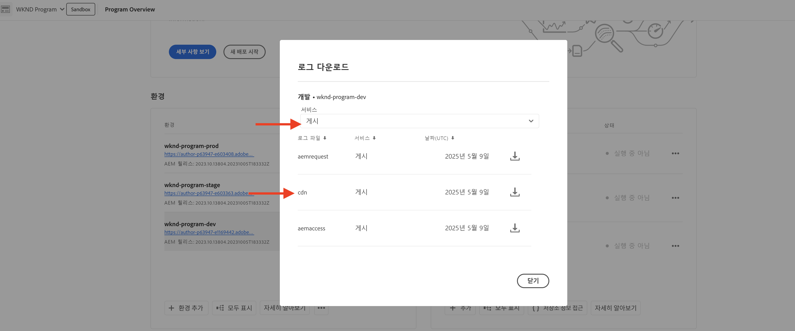
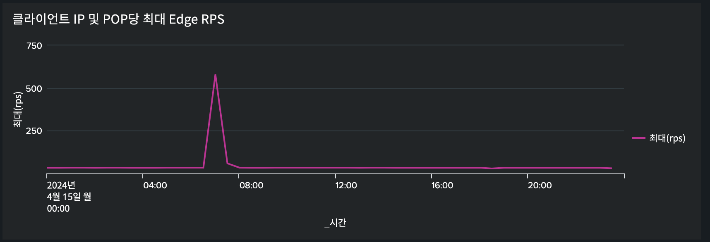
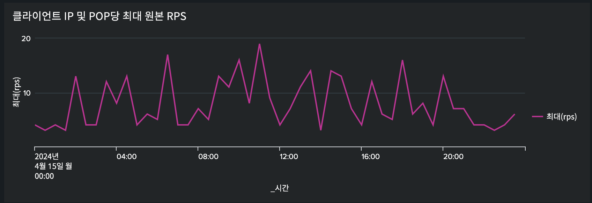

# 트래픽 필터 규칙을 사용하여 DoS 및 DDoS 공격 차단

AEM as a Cloud Service(AEMCS) 관리 CDN에서 **속도 제한 트래픽 필터** 규칙 및 기타 전략을 사용하여 DoS(서비스 거부) 및 DDoS(분산 서비스 거부) 공격을 차단하는 방법에 대해 알아봅니다. 이러한 공격은 CDN 및 잠재적으로 AEM Publish 서비스(즉, 원본)에서 트래픽 스파이크를 발생시키며 사이트 응답성 및 가용성에 영향을 줄 수 있습니다.

이 자습서는 _트래픽 패턴을 분석하고 속도 제한을 구성하는 방법 [트래픽 필터 규칙](https://experienceleague.adobe.com/en/docs/experience-manager-cloud-service/content/security/traffic-filter-rules-including-waf)_&#x200B;을 안내하여 이러한 공격을 완화합니다. 또한 이 자습서에서는 의심되는 공격이 있을 때 알림을 받을 수 있도록 [경고를 구성](https://experienceleague.adobe.com/en/docs/experience-manager-cloud-service/content/security/traffic-filter-rules-including-waf#traffic-filter-rules-alerts)하는 방법에 대해 설명합니다.

## 보호 이해

AEM 웹 사이트의 기본 DDoS 보호에 대해 알아보겠습니다.

- **캐싱:** 캐싱 정책이 좋으면 CDN이 대부분의 요청이 원본으로 이동하지 않고 성능 저하를 일으키므로 DDoS 공격의 영향은 더 제한됩니다.
- **자동 크기 조정:** 트래픽 스파이크를 처리하기 위해 AEM 작성자 및 게시 서비스가 자동 크기 조정을 수행하지만 급격한 트래픽 증가에 영향을 받을 수 있습니다.
- **차단:** Adobe CDN은 CDN PoP(Point of Presence)당 특정 IP 주소의 Adobe 정의 속도를 초과하는 경우 원본으로의 트래픽을 차단합니다.
- **경고:** 트래픽이 특정 비율을 초과할 때 작업 센터에서 트래픽 스파이크를 원본 경고 알림으로 보냅니다. 지정된 CDN PoP에 대한 트래픽이 IP 주소당 _Adobe 정의_ 요청 속도를 초과하면 이 경고가 실행됩니다. 자세한 내용은 [트래픽 필터 규칙 경고](https://experienceleague.adobe.com/en/docs/experience-manager-cloud-service/content/security/traffic-filter-rules-including-waf#traffic-filter-rules-alerts)를 참조하십시오.

기본 제공되는 이러한 보호 기능은 DDoS 공격의 성능 영향을 최소화하는 조직의 기능을 위한 기준선으로 간주되어야 합니다. 각 웹 사이트에는 서로 다른 성능 특성이 있으므로 Adobe 정의 속도 제한이 충족되기 전에 성능이 저하될 수 있으므로 _고객 구성_&#x200B;을 통해 기본 보호를 확장하는 것이 좋습니다.

고객이 DDoS 공격으로부터 웹 사이트를 보호하기 위해 취할 수 있는 몇 가지 추가 권장 조치를 살펴보겠습니다.

- PoP당 단일 IP 주소에서 특정 비율을 초과하는 트래픽을 차단하려면 **비율 제한 트래픽 필터 규칙**&#x200B;을 선언하십시오. 이는 일반적으로 Adobe 정의 비율 제한보다 낮은 임계값입니다.
- &quot;경고 작업&quot;을 통해 속도 제한 트래픽 필터 규칙에 대한 **경고**&#x200B;를 구성하면 규칙이 트리거될 때 작업 센터 알림이 전송됩니다.
- 쿼리 매개 변수를 무시하도록 **요청 변환**&#x200B;을 선언하여 캐시 범위를 늘리십시오.

>[!NOTE]
>
>[트래픽 필터 규칙 경고](https://experienceleague.adobe.com/en/docs/experience-manager-cloud-service/content/security/traffic-filter-rules-including-waf#traffic-filter-rules-alerts) 기능이 아직 릴리스되지 않았습니다. 얼리 어답터 프로그램을 통해 액세스 권한을 얻으려면 **<aemcs-waf-adopter@adobe.com>**(으)로 전자 메일을 보내십시오.

### 비율 제한 트래픽 규칙 변형 {#rate-limit-variations}

비율 제한 트래픽 규칙에는 두 가지 변형이 있습니다.

1. Edge - PoP당 주어진 IP에 대한 모든 트래픽(CDN 캐시에서 제공할 수 있는 트래픽 포함) 비율을 기반으로 요청을 차단합니다.
1. 원본 - PoP당 주어진 IP에 대해 원본으로 전송되는 트래픽 비율을 기반으로 요청을 차단합니다.

## 고객 여정

아래 단계는 고객이 웹 사이트를 보호해야 하는 가능한 프로세스를 반영합니다.

1. 비율 제한 트래픽 필터 규칙의 필요성을 인식합니다. 이는 원본 경고에서 Adobe의 즉시 사용 가능한 트래픽 스파이크를 수신한 결과이거나 성공적인 DDoS의 위험을 줄이기 위해 예방 조치를 취하는 사전 예방적 결정일 수 있습니다.
1. 사이트가 이미 활성화되어 있는 경우 대시보드를 사용하여 트래픽 패턴을 분석하여 비율 제한 트래픽 필터 규칙에 대한 최적의 임계값을 결정합니다. 사이트가 아직 라이브가 아닌 경우 트래픽 예상 값을 기반으로 값을 선택합니다.
1. 이전 단계의 값을 사용하여 비율 제한 트래픽 필터 규칙을 구성합니다. 임계값이 충족될 때마다 알림을 받을 수 있도록 해당 경고를 활성화해야 합니다.
1. 트래픽 스파이크가 발생할 때마다 트래픽 필터 규칙 경고를 수신하여 조직이 악의적인 행위자에 의해 타깃팅될 가능성이 있는지에 대한 중요한 통찰력을 제공합니다.
1. 필요한 경우 경고에 따라 조치합니다. 트래픽을 분석하여 스파이크가 공격이 아닌 적절한 요청을 반영하는지 확인합니다. 트래픽이 적합한 경우 임계값을 늘리거나 그렇지 않은 경우 임계값을 낮춥니다.

이 자습서의 나머지 부분에서는 이 프로세스를 안내합니다.

## 규칙 구성의 필요성 인식 {#recognize-the-need}

앞에서 언급했듯이 기본적으로 Adobe은 CDN에서 특정 속도를 초과하는 트래픽을 차단하지만 일부 웹 사이트의 경우 해당 임계값 아래로 성능이 저하될 수 있습니다. 따라서 속도 제한 트래픽 필터 규칙을 구성해야 합니다.

프로덕션으로 시작하기 전에 규칙을 구성하는 것이 좋습니다. 실제로 많은 조직은 공격 가능성을 나타내는 트래픽 스파이크에 대해 한 번만 규칙을 반응적으로 선언합니다.

Adobe은 지정된 PoP에 대해 단일 IP 주소의 기본 트래픽 임계값을 초과하는 경우 원본 경고에서 [작업 센터 알림](https://experienceleague.adobe.com/en/docs/experience-manager-cloud-service/content/operations/actions-center)(으)로 트래픽 스파이크를 보냅니다. 이러한 경고를 받은 경우 비율 제한 트래픽 필터 규칙을 구성하는 것이 좋습니다. 이 기본 경고는 향후 섹션에서 살펴볼 트래픽 필터 규칙을 정의할 때 고객이 명시적으로 활성화해야 하는 경고와 다릅니다.


## 트래픽 패턴 분석 {#analyze-traffic}

사이트가 이미 활성 상태인 경우 CDN 로그 및 Adobe 제공 대시보드를 사용하여 트래픽 패턴을 분석할 수 있습니다.

- **CDN 트래픽 대시보드**: CDN 및 원본 요청 속도, 4xx 및 5xx 오류율 및 캐시되지 않은 요청을 통해 트래픽에 대한 통찰력을 제공합니다. 또한 클라이언트 IP 주소당 초당 최대 CND 및 Origin 요청 수와 CDN 구성을 최적화하는 더 많은 통찰력을 제공합니다.

- **CDN 캐시 적중률**: HIT, PASS 및 MISS 상태별 총 캐시 적중률 및 총 요청 수에 대한 통찰력을 제공합니다. 또한 최상위 히트, 전달 및 누락 URL도 제공합니다.

_다음 옵션 중 하나_&#x200B;를 사용하여 대시보드 도구를 구성합니다.

### ELK - 대시보드 도구 구성

Adobe에서 제공하는 **Elasticsearch, Logstash 및 Kibana(ELK)** 대시보드 도구를 사용하여 CDN 로그를 분석할 수 있습니다. 이 도구에는 트래픽 패턴을 시각화하는 대시보드가 포함되어 있으므로 속도 제한 트래픽 필터 규칙에 대한 최적의 임계값을 더 쉽게 결정할 수 있습니다.

- [AEMCS-CDN-Log-Analysis-Tooling](https://github.com/adobe/AEMCS-CDN-Log-Analysis-Tooling) GitHub 리포지토리를 복제합니다.
- [ELK 도커 컨테이너를 설정하는 방법](https://github.com/adobe/AEMCS-CDN-Log-Analysis-Tooling/blob/main/ELK/README.md#how-to-set-up-the-elk-docker-containerhow-to-setup-the-elk-docker-container) 단계에 따라 도구를 설정합니다.
- 설정의 일부로 `traffic-filter-rules-analysis-dashboard.ndjson` 파일을 가져와서 데이터를 시각화합니다. _CDN 트래픽_ 대시보드에는 CDN Edge 및 원본의 IP/POP당 최대 요청 수를 표시하는 시각화가 포함됩니다.
- [Cloud Manager](https://my.cloudmanager.adobe.com/)의 _환경_ 카드에서 AEMCS Publish 서비스의 CDN 로그를 다운로드합니다.

  

  >[!TIP]
  >
  > 새 요청이 CDN 로그에 표시되는 데 최대 5분이 걸릴 수 있습니다.

### Splunk - 대시보드 도구 구성

[Splunk 로그 전달이 활성화됨](https://experienceleague.adobe.com/en/docs/experience-manager-cloud-service/content/implementing/developing/logging#splunk-logs)인 고객은 새 대시보드를 만들어 트래픽 패턴을 분석할 수 있습니다.

Splunk에서 대시보드를 만들려면 [AEMCS CDN 로그 분석용 Splunk 대시보드](https://github.com/adobe/AEMCS-CDN-Log-Analysis-Tooling/blob/main/Splunk/README.md#splunk-dashboards-for-aemcs-cdn-log-analysis)를 따르십시오.

### 데이터 보기

ELK 및 Splunk 대시보드에서 다음 시각화를 사용할 수 있습니다.

- **클라이언트 IP 및 POP당 Edge RPS**: 이 시각화는 CDN Edge에서 IP/POP당 최대 요청 수 **개**&#x200B;를 표시합니다. 시각화의 피크는 최대 요청 수를 나타냅니다.

  **ELK 대시보드**:
  

  **Splunk 대시보드**:\
  

- **클라이언트 IP 및 POP당 원본 RPS**: 이 시각화는 원본의 IP/POP당 최대 요청 수 **을(를) 표시합니다**. 시각화의 피크는 최대 요청 수를 나타냅니다.

  **ELK 대시보드**:
  

  **Splunk 대시보드**:
  

## 임계값 선택

속도 제한 트래픽 필터 규칙의 임계값은 위의 분석을 기반으로 하며 합법적인 트래픽이 차단되지 않았는지 확인해야 합니다. 임계값을 선택하는 방법에 대한 지침은 다음 표를 참조하십시오.

| 변형 | 값 |
| :--------- | :------- |
| 원본 | **normal** 트래픽 조건(즉, DDoS 시점의 비율 아님)에서 IP/POP당 최대 원본 요청 값을 가져와서 배수로 증가시킵니다. |
| Edge | **보통** 트래픽 조건(즉, DDoS 시점의 비율 아님)에서 IP/POP당 최대 Edge 요청 수 값을 가져와서 배수로 늘립니다. |

사용할 복수는 유기 트래픽, 캠페인 및 기타 이벤트로 인한 일반적인 트래픽 급증에 대한 기대에 따라 다릅니다. 5-10 사이의 배수가 적절할 수 있습니다.

사이트가 아직 라이브가 아닌 경우 분석할 데이터가 없으며, 비율 제한 트래픽 필터 규칙에 설정할 적절한 값을 잘 알고 있어야 합니다. 예:

| 변형 | 값 |
|------------------------------ |:-----------:|
| Edge | 500 |
| 원본 | 100 |

## 규칙 구성 {#configure-rules}

위의 설명에 따라 값을 사용하여 AEM 프로젝트의 `/config/cdn.yaml` 파일에서 **속도 제한 트래픽 필터** 규칙을 구성합니다. 필요한 경우 웹 보안 팀에 문의하여 비율 제한 값이 적절하고 합법적인 트래픽을 차단하지 않는지 확인하십시오.

자세한 내용은 [AEM 프로젝트에 규칙 만들기](https://experienceleague.adobe.com/en/docs/experience-manager-learn/cloud-service/security/traffic-filter-and-waf-rules/how-to-setup#create-rules-in-your-aem-project)를 참조하십시오.

```yaml
kind: CDN
version: '1'
metadata:
  envTypes:
    - dev
    - stage
    - prod
data:
  trafficFilters:
    rules:
    ...
    #  Prevent attack at edge by blocking client for 5 minutes if they make more than 500 requests per second on average
      - name: prevent-dos-attacks-edge
        when:
          reqProperty: tier
          in: ["author","publish"]
        rateLimit:
          limit: 500 # replace with the appropriate value
          window: 10 # compute the average over 10s
          penalty: 300 # block IP for 5 minutes
          count: all # count all requests
          groupBy:
            - reqProperty: clientIp
        action: 
          type: log
          experimental_alert: true
    #  Prevent attack at origin by blocking client for 5 minutes if they make more than 100 requests per second on average            
      - name: prevent-dos-attacks-origin
        when:
          reqProperty: tier
          in: ["author","publish"]
        rateLimit:
          limit: 100 # replace with the appropriate value
          window: 10 # compute the average over 10s
          penalty: 300 # block IP for 5 minutes
          count: fetches # count only fetches
          groupBy:
            - reqProperty: clientIp
        action: 
          type: log
          experimental_alert: true   
          
```

원본 및 에지 규칙이 모두 선언되고 Alert 속성이 `true`(으)로 설정되어 임계값이 충족될 때마다 경고를 받을 수 있으므로 공격을 나타낼 수 있습니다.

>[!NOTE]
>
>experimental_alert 앞에 있는 _experimental_ 접두사는 경고 기능이 해제되면 제거됩니다. 얼리 어답터 프로그램에 참여하려면 **<aemcs-waf-adopter@adobe.com>**&#x200B;에게 전자 메일을 보내십시오.

작업 유형은 처음에 기록하도록 설정되므로 합법적인 트래픽이 이러한 비율을 초과하지 않도록 몇 시간 또는 며칠 동안 트래픽을 모니터링할 수 있습니다. 며칠 후 차단 모드로 변경합니다.

AEMCS 환경에 변경 사항을 배포하려면 아래 단계를 따르십시오.

- 위의 변경 사항을 커밋하고 Cloud Manager Git 저장소에 푸시합니다.
- Cloud Manager의 구성 파이프라인을 사용하여 AEMCS 환경에 변경 사항을 배포합니다. 자세한 내용은 [Cloud Manager을 통해 규칙 배포](https://experienceleague.adobe.com/en/docs/experience-manager-learn/cloud-service/security/traffic-filter-and-waf-rules/how-to-setup#deploy-rules-through-cloud-manager)를 참조하세요.
- **속도 제한 트래픽 필터 규칙**&#x200B;이(가) 예상대로 작동하는지 확인하려면 [공격 시뮬레이션](#attack-simulation) 섹션에 설명된 대로 공격을 시뮬레이션할 수 있습니다. 요청 수를 규칙에 설정된 비율 제한 값보다 큰 값으로 제한합니다.

### 요청 변환 규칙 구성 {#configure-request-transform-rules}

속도 제한 트래픽 필터 규칙 외에 [변환 요청](https://experienceleague.adobe.com/en/docs/experience-manager-cloud-service/content/implementing/content-delivery/cdn-configuring-traffic#request-transformations)을 사용하여 애플리케이션에서 필요하지 않은 쿼리 매개 변수를 설정 해제하여 캐시 무효화 기술을 통해 캐시를 우회하는 방법을 최소화하는 것이 좋습니다. 예를 들어 `search` 및 `campaignId` 쿼리 매개 변수만 허용하려는 경우 다음 규칙을 선언할 수 있습니다.

```yaml
kind: "CDN"
version: "1"
metadata:
  envTypes: 
    - dev
    - stage
    - prod  
data:  
  experimental_requestTransformations:
    rules:            
      - name: unset-all-query-params-except-those-needed
        when:
          reqProperty: tier
          in: ["publish"]
        actions:
          - type: unset
            queryParamMatch: ^(?!search$|campaignId$).*$
```

## 트래픽 필터 규칙 경고 수신 {#receiving-alerts}

위에서 언급했듯이 트래픽 필터 규칙에 *experimental_alert: true*&#x200B;가 포함되어 있으면 규칙이 일치할 때 경고가 수신됩니다.

## 경고에 대한 작업 {#acting-on-alerts}

때때로 경보는 정보 제공용이므로 공격 빈도를 파악할 수 있습니다. 트래픽 스파이크가 정당한 트래픽 볼륨의 증가뿐만 아니라 공격으로 인한 것인지 확인하기 위해 위에서 설명한 대시보드를 사용하여 CDN 데이터를 분석하는 것이 좋습니다. 후자의 경우, 임계값을 늘리는 것을 고려하십시오.

## 공격 시뮬레이션{#attack-simulation}

이 섹션에서는 DoS 공격을 시뮬레이션하는 방법에 대해 설명합니다. 이 방법은 이 자습서에서 사용되는 대시보드용 데이터를 생성하고 구성된 모든 규칙이 공격을 성공적으로 차단하는지 확인하는 데 사용할 수 있습니다.

>[!CAUTION]
>
> 프로덕션 환경에서는 이러한 단계를 수행하지 마십시오. 다음 단계는 시뮬레이션 목적으로만 사용됩니다.
> 
>트래픽 급증을 나타내는 경고가 표시되면 [트래픽 패턴 분석](#analyzing-traffic-patterns) 섹션으로 진행하십시오.

공격을 시뮬레이션하려면 [Apache Benchmark](https://httpd.apache.org/docs/2.4/programs/ab.html), [Apache JMeter](https://jmeter.apache.org/), [Vegeta](https://github.com/tsenart/vegeta) 등의 도구를 사용할 수 있습니다.

### Edge 요청

다음 [Vegeta](https://github.com/tsenart/vegeta) 명령을 사용하여 웹 사이트에 많은 요청을 할 수 있습니다.

```shell
$ echo "GET https://<YOUR-WEBSITE-DOMAIN>" | vegeta attack -rate=120 -duration=5s | vegeta report
```

위 명령은 5초 동안 120개의 요청을 하고 보고서를 출력합니다. 웹 사이트가 속도 제한이 없다고 가정할 경우 트래픽이 급증할 수 있습니다.

### 원본 요청

CDN 캐시를 무시하고 원본(AEM Publish 서비스)에 대한 요청을 수행하려면 URL에 고유한 쿼리 매개 변수를 추가할 수 있습니다. [JMeter 스크립트를 사용하여 DoS 시뮬레이션](https://experienceleague.adobe.com/en/docs/experience-manager-learn/foundation/security/modsecurity-crs-dos-attack-protection#simulate-dos-attack-using-jmeter-script)에서 샘플 Apache JMeter 스크립트를 참조하십시오.

