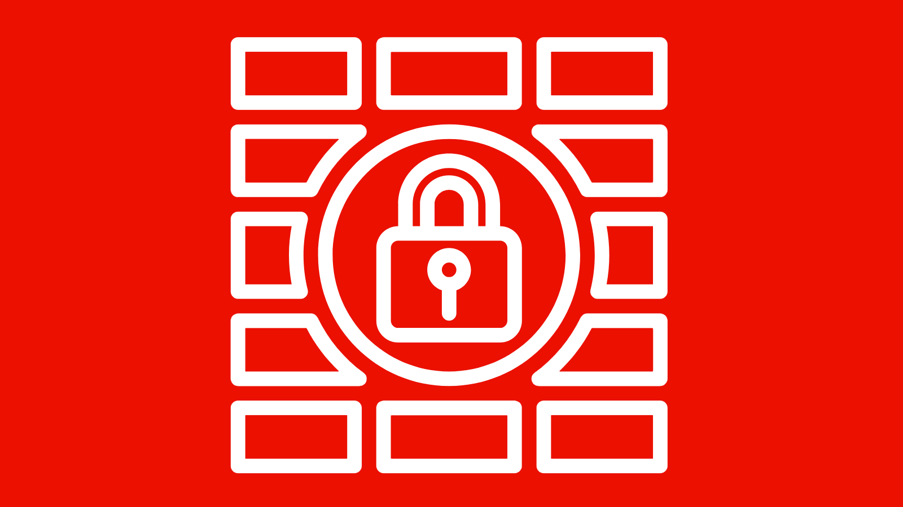

# 트래픽 필터 규칙을 사용하여 DoS, DDoS 및 정교한 공격 차단

AEM as a Cloud Service(AEMCS) 관리 CDN에서 **트래픽 필터 규칙**&#x200B;을 사용하여 서비스 거부(DoS), 분산 서비스 거부(DDoS) 및 정교한 공격을 차단하는 방법을 알아봅니다.

이러한 공격은 CDN과 잠재적으로 AEM 게시 서비스(Origin이라고도 함)에서 트래픽 스파이크를 유발하여 사이트 응답성과 가용성에 영향을 미칠 수 있습니다.

이 문서에서는 AEM 웹 사이트에 대한 기본 보호 기능과 고객 구성을 통해 이러한 보호 기능을 확장하는 방법에 대한 개요를 제공합니다. 또한 트래픽 패턴을 분석하고 표준 트래픽 필터 규칙을 구성하여 이러한 공격을 차단하는 방법을 설명합니다.

## AEM as a Cloud Service의 기본 보호 기능

AEM 웹 사이트를 위한 기본 DDoS 보호에 대해 알아보겠습니다.

- **캐싱:** 적절한 캐싱 정책을 사용하면 DDoS 공격의 영향이 제한됩니다. CDN이 대부분의 요청이 Origin으로 전달되는 것을 방지하여 성능 저하를 막기 때문입니다.
- **자동 크기 조정:** AEM 작성자 및 게시 서비스는 트래픽 스파이크에 대응하여 자동으로 확장되지만 갑작스럽고 대규모의 트래픽 스파이크에는 여전히 영향을 받을 수 있습니다.
- **차단:** Adobe CDN은 특정 IP 주소에서 각 CDN PoP(Point of Presence) 기준으로 Adobe에서 정의한 속도를 초과하는 트래픽이 Origin으로 이동하는 경우 해당 트래픽을 차단합니다.
- **경고:** 트래픽이 일정 수준을 초과하면 액션 센터에서 오리진 트래픽 스파이크 경고가 전송됩니다. 이 경고는 특정 CDN PoP에 대한 트래픽이 IP 주소당 _Adobe에서 정의한_ 요청 속도를 초과할 때 실행됩니다. 자세한 내용은 [트래픽 필터 규칙 경고](https://experienceleague.adobe.com/ko/docs/experience-manager-cloud-service/content/security/traffic-filter-rules-including-waf#traffic-filter-rules-alerts)를 참조하십시오.

이러한 기본 제공 보호 기능은 DDoS 공격으로 인한 성능 영향을 최소화하기 위한 조직의 기준선으로 간주되어야 합니다. 웹 사이트마다 성능 특성이 다르기 때문에 Adobe에서 정의한 속도 제한에 도달하기 전에 성능 저하가 발생할 수 있습니다. 따라서 _고객 구성_&#x200B;을 통해 기본 보호 기능을 확장하는 것이 좋습니다.

## 트래픽 필터 규칙으로 보호 확장

고객이 DDoS 공격으로부터 웹 사이트를 보호하기 위해 추가로 수행할 수 있는 권장 조치를 살펴보겠습니다.

- Adobe 권장 [표준 트래픽 필터 규칙](./traffic-filter-and-waf-rules/use-cases/using-traffic-filter-rules.md)을 구현하여 의심스러운 동작을 로깅하고 경고함으로써 잠재적으로 악성 트래픽 패턴을 식별합니다.
- **WAF-DDoS 보호** 또는 **향상된 보안** 추가 기능을 사용하고 Adobe에서 권장하는 [WAF 트래픽 필터 규칙](./traffic-filter-and-waf-rules/use-cases/using-waf-rules.md)을 구현하여 고급 프로토콜 또는 페이로드 기반 기술을 사용하는 공격을 포함한 정교한 공격에 대비합니다.
- 불필요한 쿼리 매개변수를 무시하도록 [요청 변환](./traffic-filter-and-waf-rules/how-to/request-transformation.md)을 구성하여 캐시 적용 범위를 확대합니다.

## 시작하기

Adobe에서 권장하는 공격 차단 규칙을 구성하려면 다음 튜토리얼을 살펴보십시오.

<!-- CARDS
{target = _self}

* ./traffic-filter-and-waf-rules/setup.md
  {title = How to set up traffic filter rules including WAF rules}
  {description = Learn how to set up to create, deploy, test, and analyze the results of traffic filter rules including WAF rules.}
  {image = ./traffic-filter-and-waf-rules/assets/setup/rules-setup.png}
  {cta = Start Now}

* ./traffic-filter-and-waf-rules/use-cases/using-traffic-filter-rules.md
  {title = Protecting AEM websites using standard traffic filter rules}
  {description = Learn how to protect AEM websites from DoS, DDoS and bot abuse using Adobe-recommended standard traffic filter rules in AEM as a Cloud Service.}
  {image = ./traffic-filter-and-waf-rules/assets/use-cases/using-traffic-filter-rules.png}
  {cta = Apply Rules}

* ./traffic-filter-and-waf-rules/use-cases/using-waf-rules.md
  {title = Protecting AEM websites using WAF traffic filter rules}
  {description = Learn how to protect AEM websites from sophisticated threats including DoS, DDoS, and bot abuse using Adobe-recommended Web Application Firewall (WAF) traffic filter rules in AEM as a Cloud Service.}
  {image = ./traffic-filter-and-waf-rules/assets/use-cases/using-waf-rules.png}
  {cta = Activate WAF}

-->
<!-- START CARDS HTML - DO NOT MODIFY BY HAND -->

    

        

            

                <figure class="image x-is-16by9">
                    
                </figure>
            

            

                

                    

                        <a href="./traffic-filter-and-waf-rules/setup.md" target="_self" rel="referrer" title="WAF 규칙을 포함한 트래픽 필터 규칙을 설정하는 방법">WAF 규칙을 포함한 트래픽 필터 규칙을 설정하는 방법</a>
                    

                    
WAF 규칙을 포함한 트래픽 필터 규칙의 결과를 생성, 배포, 테스트 및 분석하는 방법을 알아봅니다.

                

                <a href="./traffic-filter-and-waf-rules/setup.md" target="_self" rel="referrer" class="spectrum-Button spectrum-Button--outline spectrum-Button--primary spectrum-Button--sizeM" style="align-self: flex-start; margin-top: 1rem;">
                    지금 시작
                </a>
            

        

    

    

        

            

                <figure class="image x-is-16by9">
                    
                </figure>
            

            

                

                    

                        <a href="./traffic-filter-and-waf-rules/use-cases/using-traffic-filter-rules.md" target="_self" rel="referrer" title="표준 트래픽 필터 규칙을 사용한 AEM 웹 사이트 보호">표준 트래픽 필터 규칙을 사용한 AEM 웹 사이트 보호</a>
                    

                    
AEM as a Cloud Service에서 Adobe 권장 표준 트래픽 필터 규칙을 사용하여 DoS, DDoS 및 봇 남용으로부터 AEM 웹 사이트를 보호하는 방법에 대해 알아봅니다.

                

                <a href="./traffic-filter-and-waf-rules/use-cases/using-traffic-filter-rules.md" target="_self" rel="referrer" class="spectrum-Button spectrum-Button--outline spectrum-Button--primary spectrum-Button--sizeM" style="align-self: flex-start; margin-top: 1rem;">
                    규칙 적용
                </a>
            

        

    

    

        

            

                <figure class="image x-is-16by9">
                    
                </figure>
            

            

                

                    

                        <a href="./traffic-filter-and-waf-rules/use-cases/using-waf-rules.md" target="_self" rel="referrer" title="WAF 트래픽 필터 규칙을 사용하여 AEM 웹 사이트 보호">WAF 트래픽 필터 규칙을 사용하여 AEM 웹 사이트 보호</a>
                    

                    
AEM as a Cloud Service에서 Adobe 권장 웹 애플리케이션 방화벽(WAF) 트래픽 필터 규칙을 사용하여 DoS, DDoS 및 봇 남용을 포함한 정교한 위협으로부터 AEM 웹 사이트를 보호하는 방법에 대해 알아봅니다.

                

                <a href="./traffic-filter-and-waf-rules/use-cases/using-waf-rules.md" target="_self" rel="referrer" class="spectrum-Button spectrum-Button--outline spectrum-Button--primary spectrum-Button--sizeM" style="align-self: flex-start; margin-top: 1rem;">
                    WAF 활성화
                </a>
            

        

    

<!-- END CARDS HTML - DO NOT MODIFY BY HAND -->
