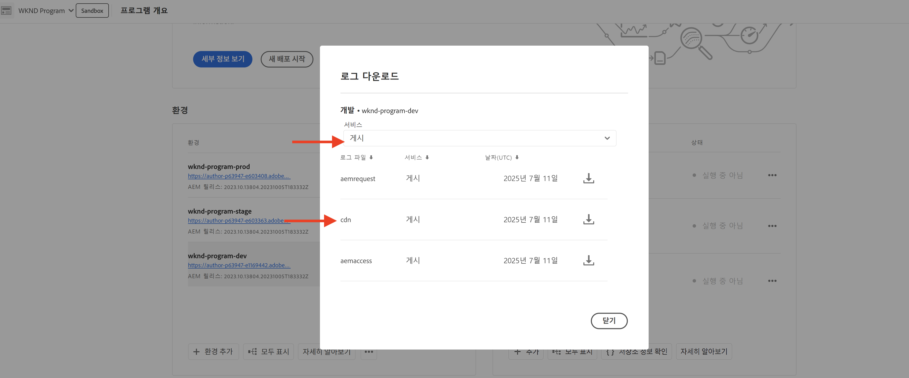

# 중요한 요청 모니터링

AEM as a Cloud Service에서 트래픽 필터 규칙을 사용하여 중요한 요청을 기록하여 모니터링하는 방법을 알아봅니다.

로깅을 사용하면 최종 사용자 또는 서비스에 영향을 주지 않고 트래픽 패턴을 관찰할 수 있으며 차단 규칙을 구현하기 전에 중요한 첫 번째 단계입니다.

이 자습서에서는 AEM Publish 서비스에 대해 **WKND 로그인 및 로그아웃 경로의 요청을 기록**&#x200B;하는 방법을 보여줍니다.

## 요청을 기록할 이유 및 시기

특정 요청 로깅은 사용자 및 잠재적으로 악의적인 행위자가 AEM 애플리케이션과 상호 작용하는 방법을 이해하는 위험성이 낮고 가치가 높은 방법입니다. 이는 차단 규칙을 적용하기 전에 특히 유용하여 합법적인 트래픽을 방해하지 않으면서 보안 자세를 개선할 수 있는 자신감을 제공합니다.

로깅에 대한 일반적인 시나리오는 다음과 같습니다.

- `block` 모드로 승격하기 전에 규칙의 영향 및 도달 범위를 확인합니다.
- 로그인/로그아웃 경로 및 인증 엔드포인트를 모니터링하여 비정상적인 패턴 또는 무차별 시도.
- 잠재적인 남용 또는 DoS 활동을 위해 API 엔드포인트에 대한 고주파 액세스를 추적합니다.
- 더 엄격한 컨트롤을 적용하기 전에 보트 동작에 대한 기준선을 설정합니다.
- 보안 사고의 경우, 공격의 특성 및 영향을 받는 리소스를 이해하기 위한 법의학 데이터를 제공하십시오.

## 사전 요구 사항

계속하기 전에 [트래픽 필터 및 WAF 규칙을 설정하는 방법](../setup.md) 자습서에 설명된 대로 필요한 설정을 완료했는지 확인하십시오. 또한 [AEM WKND Sites 프로젝트](https://github.com/adobe/aem-guides-wknd)를 AEM 환경에 복제 및 배포했습니다.

## 예: 로그 WKND 로그인 및 로그아웃 요청

이 예에서는 트래픽 필터 규칙을 만들어 AEM Publish 서비스의 WKND 로그인 및 로그아웃 경로에 대한 요청을 기록합니다. 인증 시도를 모니터링하고 잠재적인 보안 문제를 식별하는 데 도움이 됩니다.

- WKND 프로젝트의 `/config/cdn.yaml` 파일에 다음 규칙을 추가합니다.

```yaml
kind: "CDN"
version: "1"
metadata:
  envTypes: ["dev", "stage", "prod"]
data:
  trafficFilters:
    rules:
    # On AEM Publish service log WKND Login and Logout requests
    - name: publish-auth-requests
      when:
        allOf:
          - reqProperty: tier
            matches: publish
          - reqProperty: path
            in:
              - /system/sling/login/j_security_check
              - /system/sling/logout
      action: log   
```

- 변경 사항을 Cloud Manager Git 저장소에 커밋하고 푸시합니다.

- Cloud Manager 구성 파이프라인 [이전에 만든](../setup.md#deploy-rules-using-adobe-cloud-manager)을(를) 사용하여 AEM 환경에 변경 사항을 배포합니다.

- 프로그램의 WKND 사이트에서 로그인하여 로그아웃하여 규칙을 테스트합니다(예: `https://publish-pXXXX-eYYYY.adobeaemcloud.com/us/en.html`). `asmith/asmith`를 사용자 이름과 암호로 사용할 수 있습니다.

  

## 분석

Cloud Manager에서 AEMCS CDN 로그를 다운로드하고 `publish-auth-requests`AEMCS CDN 로그 분석 도구[를 사용하여 ](../setup.md#setup-the-elastic-dashboard-tool) 규칙의 결과를 분석해 보겠습니다.

- [Cloud Manager](https://my.cloudmanager.adobe.com/)의 **환경** 카드에서 AEMCS **게시** 서비스의 CDN 로그를 다운로드합니다.

  

  >[!TIP]
  >
  > 새로운 요청이 CDN 로그에 나타나기까지 최대 5분 정도 소요될 수 있습니다.

- 다운로드한 로그 파일(예: 아래 스크린샷의 `publish_cdn_2023-10-24.log`)을 Elastic 대시보드 도구 프로젝트의 `logs/dev` 폴더에 복사합니다.

  

- Elastic 대시보드 도구 페이지를 새로 고칩니다.
   - 상단의 **전역 필터** 섹션에서 `aem_env_name.keyword` 필터를 편집하고 `dev` 환경 값을 선택합니다.

     

   - 시간 간격을 변경하려면 오른쪽 상단에 있는 캘린더 아이콘을 클릭하고 원하는 시간 간격을 선택합니다.

     

- 업데이트된 대시보드의 **분석된 요청**, **플래그가 지정된 요청** 및 **플래그가 지정된 요청 세부 정보** 패널을 검토합니다. CDN 로그 항목을 일치시키려면 각 항목의 클라이언트 IP(cli_ip), 호스트, URL, 작업(waf_action) 및 규칙 이름(waf_match) 값을 표시해야 합니다.

  

