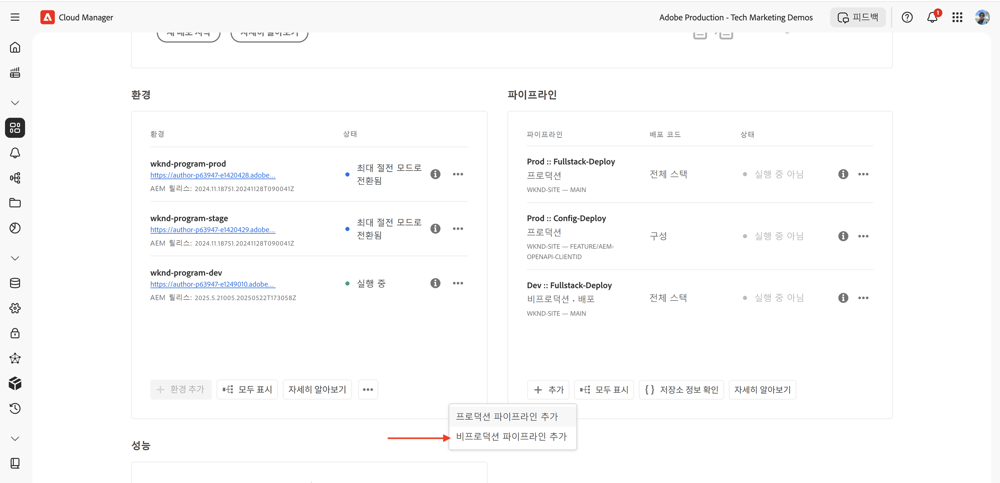
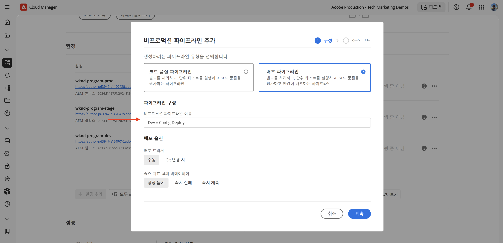
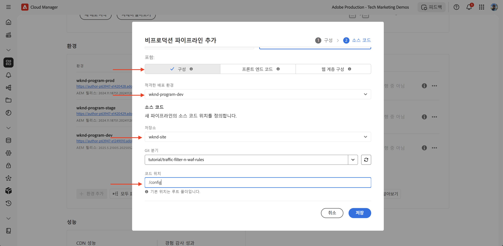
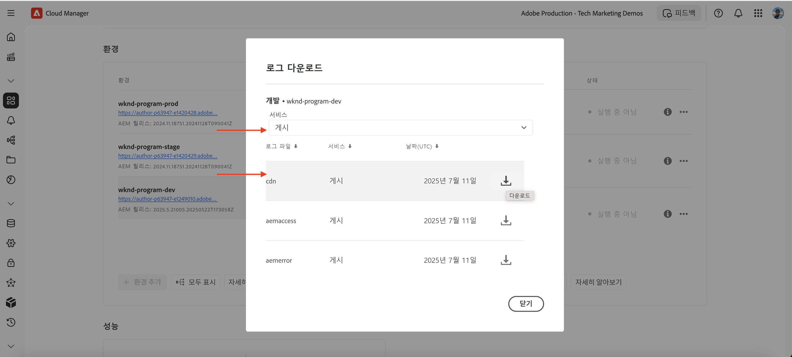

# WAF 규칙을 포함한 트래픽 필터 규칙을 설정하는 방법

웹 응용 프로그램 방화벽(WAF) 규칙을 포함하여 **트래픽 필터 규칙을 설정하는 방법**&#x200B;을 알아봅니다. 이 튜토리얼에서는 규칙을 구성하고 배포한 다음 결과를 테스트 및 분석하는 후속 튜토리얼의 토대를 설정합니다.

이 자습서에서는 설정 프로세스를 보여주기 위해 [AEM WKND Sites 프로젝트](https://github.com/adobe/aem-guides-wknd)를 사용합니다.

## 설정 개요

후속 튜토리얼의 기본 단계에는 다음 단계가 포함됩니다.

- _폴더의 AEM 프로젝트에서_&#x200B;규칙을 만드는 중`config`
- Adobe Cloud Manager 구성 파이프라인을 사용하여 _규칙 배포_.
- Curl, Vegeta 및 Nikto와 같은 도구를 사용하여 _규칙 테스트_
- AEMCS CDN 로그 분석 도구를 사용하여 _결과 분석_

## AEM 프로젝트에서 규칙 만들기

AEM 프로젝트 내에서 **standard** 및 **WAF** 트래픽 필터 규칙을 정의하려면 다음 단계를 수행합니다.

1. AEM 프로젝트의 최상위 수준에서 `config` 폴더를 만듭니다.

2. `config` 폴더 내에서 이름이 `cdn.yaml`인 파일을 만듭니다.

3. `cdn.yaml`에서 다음 메타데이터 구조 사용:

```yaml
kind: "CDN"
version: "1"
metadata:
  envTypes: ["dev", "stage", "prod"]
data:
  trafficFilters:
    rules:
```


[다음 자습서](#next-steps)에서는 구현을 위한 견고한 기반으로 위의 파일에 Adobe의 **권장 표준 트래픽 필터 및 WAF 규칙**&#x200B;을 추가하는 방법에 대해 알아봅니다.

## Adobe Cloud Manager을 사용하여 규칙 배포

규칙 배포를 준비하려면 다음 단계를 수행합니다.

1. [my.cloudmanager.adobe.com](https://my.cloudmanager.adobe.com/)에 로그인하고 프로그램을 선택합니다.

2. **프로그램 개요** 페이지에서 **파이프라인** 카드로 이동한 다음 **+추가**&#x200B;를 클릭하여 새 파이프라인을 만듭니다.

   

3. 파이프라인 마법사에서 다음을 수행합니다.

   - **유형**: 배포 파이프라인
   - **파이프라인 이름**: Dev-Config

   

4. Source 코드 구성:

   - **코드 배포 방식**: 타기팅 배포
   - **포함 항목**: 구성
   - **배포 환경**: 예: `wknd-program-dev`
   - **저장소**: Git 저장소(예: `wknd-site`)
   - **Git 분기**: 작업 분기
   - **코드 위치**: `/config`

   

5. 파이프라인 구성을 검토하고 **저장**&#x200B;을 클릭합니다.

[다음 자습서](#next-steps)에서 파이프라인을 AEM 환경에 배포하는 방법을 알아봅니다.

## 도구를 사용하여 규칙 테스트

표준 트래픽 필터 및 WAF 규칙의 효과를 테스트하기 위해 다양한 도구를 사용하여 요청을 시뮬레이션하고 규칙이 응답하는 방식을 분석할 수 있습니다.

로컬 시스템에 다음 도구가 설치되어 있는지 확인하거나 지침에 따라 설치합니다.

- [Curl](https://curl.se/): 요청/응답 흐름을 테스트합니다.
- [Vegeta](https://github.com/tsenart/vegeta): 높은 요청 로드(DoS 테스트)를 시뮬레이션합니다.
- [Nikto](https://github.com/sullo/nikto/wiki): 취약성을 검사합니다.

다음 명령을 사용하여 설치를 확인할 수 있습니다.

```shell
# Curl version check
$ curl --version

# Vegeta version check
$ vegeta -version

# Nikto version check
$ cd <PATH-OF-CLONED-REPO>/program
$ ./nikto.pl -Version
```

[다음 자습서](#next-steps)에서 이러한 도구를 사용하여 높은 요청 로드와 악의적인 요청을 시뮬레이션하여 트래픽 필터 및 WAF 규칙의 효과를 테스트하는 방법을 알아봅니다.

## 결과 분석

결과 분석을 준비하려면 다음 단계를 수행합니다.

1. 미리 빌드된 대시보드를 사용하여 패턴을 시각화하고 분석하려면 **AEMCS CDN 로그 분석 도구**&#x200B;를 설치하십시오.

2. Cloud Manager UI에서 로그를 다운로드하여 **CDN 로그 수집**&#x200B;을 수행합니다. 또는 Splunk 또는 Elasticsearch과 같이 지원되는 호스팅된 로깅 대상에 로그를 직접 전달할 수 있습니다.

### AEMCS CDN 로그 분석 도구

트래픽 필터 및 WAF 규칙의 결과를 분석하려면 **AEMCS CDN 로그 분석 도구**&#x200B;를 사용합니다. 이 도구는 AEMCS CDN에서 수집된 로그를 활용하여 CDN 트래픽 및 WAF 활동을 시각화하기 위한 사전 빌드된 대시보드를 제공합니다.

AEMCS CDN 로그 분석 도구는 두 개의 관찰 가능성 플랫폼인 **ELK**(Elasticsearch, Logstash, Kibana)와 **Splunk**&#x200B;을 지원합니다.

로그 전달 기능을 사용하여 호스팅된 ELK 또는 Splunk 로깅 서비스에 로그를 스트리밍할 수 있습니다. 여기서 대시보드를 설치하여 표준 트래픽 필터 및 WAF 트래픽 필터 규칙을 시각화하고 분석할 수 있습니다. 그러나 이 자습서에서는 컴퓨터에 설치된 로컬 ELK 인스턴스에 대시보드를 설정합니다.

1. [AEMCS-CDN-Log-Analysis-Tooling](https://github.com/adobe/AEMCS-CDN-Log-Analysis-Tooling) 리포지토리를 복제합니다.

2. [ELK Docker 컨테이너 설치 가이드](https://github.com/adobe/AEMCS-CDN-Log-Analysis-Tooling/blob/main/ELK/README.md)에 따라 ELK 스택을 로컬로 설치하고 구성하십시오.

3. ELK 대시보드를 사용하여 IP 요청, 차단된 트래픽, URI 패턴 및 보안 경고와 같은 지표를 탐색할 수 있습니다.

   

>[!NOTE]
> 
> AEMCS CDN에서 로그가 아직 수집되지 않은 경우 대시보드가 비어 있는 것으로 표시됩니다.

### CDN 로그 수집

CDN 로그를 ELK 스택으로 수집하려면 다음 단계를 수행합니다.

- [Cloud Manager](https://my.cloudmanager.adobe.com/)의 **환경** 카드에서 AEMCS **게시** 서비스의 CDN 로그를 다운로드합니다.

  

  >[!TIP]
  >
  > 새로운 요청이 CDN 로그에 나타나기까지 최대 5분 정도 소요될 수 있습니다.

- 다운로드한 로그 파일(예: 아래 스크린샷의 `publish_cdn_2025-06-06.log`)을 Elastic 대시보드 도구 프로젝트의 `logs/dev` 폴더에 복사합니다.

  {width="800" zoomable="yes"}

- Elastic 대시보드 도구 페이지를 새로 고칩니다.
   - 상단의 **전역 필터** 섹션에서 `aem_env_name.keyword` 필터를 편집하고 `dev` 환경 값을 선택합니다.

     

   - 시간 간격을 변경하려면 오른쪽 상단에 있는 캘린더 아이콘을 클릭하고 원하는 시간 간격을 선택합니다.

- [다음 튜토리얼](#next-steps)에서는 ELK 스택에 사전 설치된 대시보드를 사용하여 표준 트래픽 필터 및 WAF 트래픽 필터 규칙의 결과를 분석하는 방법을 알아봅니다.

  

## 요약

AEM as a Cloud Service에서 WAF 규칙을 포함하여 트래픽 필터 규칙을 구현하기 위한 토대를 성공적으로 설정했습니다. 구성 파일 구조, 배포할 파이프라인을 만들고 결과를 테스트 및 분석할 도구를 준비했습니다.

## 다음 단계

다음 자습서를 사용하여 Adobe 권장 규칙을 구현하는 방법을 알아봅니다.

<!-- CARDS
{target = _self}

* ./use-cases/using-traffic-filter-rules.md
  {title = Protecting AEM websites using standard traffic filter rules}
  {description = Learn how to protect AEM websites from DoS, DDoS and bot abuse using Adobe-recommended standard traffic filter rules in AEM as a Cloud Service.}
  {image = ./assets/use-cases/using-traffic-filter-rules.png}
  {cta = Apply Rules}

* ./use-cases/using-waf-rules.md
  {title = Protecting AEM websites using WAF traffic filter rules}
  {description = Learn how to protect AEM websites from sophisticated threats including DoS, DDoS, and bot abuse using Adobe-recommended Web Application Firewall (WAF) traffic filter rules in AEM as a Cloud Service.}
  {image = ./assets/use-cases/using-waf-rules.png}
  {cta = Activate WAF}
-->
<!-- START CARDS HTML - DO NOT MODIFY BY HAND -->
<div class="columns">
    <div class="column is-half-tablet is-half-desktop is-one-third-widescreen" aria-label="Protecting AEM websites using standard traffic filter rules">
        <div class="card" style="height: 100%; display: flex; flex-direction: column; height: 100%;">
            <div class="card-image">
                <figure class="image x-is-16by9">
                    <a href="./use-cases/using-traffic-filter-rules.md" title="표준 트래픽 필터 규칙을 사용하여 AEM 웹 사이트 보호" target="_self" rel="referrer">
                        
                    </a>
                </figure>
            </div>
            <div class="card-content is-padded-small" style="display: flex; flex-direction: column; flex-grow: 1; justify-content: space-between;">
                <div class="top-card-content">
                    <p class="headline is-size-6 has-text-weight-bold">
                        <a href="./use-cases/using-traffic-filter-rules.md" target="_self" rel="referrer" title="표준 트래픽 필터 규칙을 사용하여 AEM 웹 사이트 보호">표준 트래픽 필터 규칙을 사용하여 AEM 웹 사이트 보호</a>
                    </p>
                    <p class="is-size-6">AEM as a Cloud Service에서 Adobe 권장 표준 트래픽 필터 규칙을 사용하여 DoS, DDoS 및 봇 남용으로부터 AEM 웹 사이트를 보호하는 방법을 알아봅니다.</p>
                </div>
                <a href="./use-cases/using-traffic-filter-rules.md" target="_self" rel="referrer" class="spectrum-Button spectrum-Button--outline spectrum-Button--primary spectrum-Button--sizeM" style="align-self: flex-start; margin-top: 1rem;">
                    <span class="spectrum-Button-label has-no-wrap has-text-weight-bold">규칙 적용</span>
                </a>
            </div>
        </div>
    </div>
    <div class="column is-half-tablet is-half-desktop is-one-third-widescreen" aria-label="Protecting AEM websites using WAF traffic filter rules">
        <div class="card" style="height: 100%; display: flex; flex-direction: column; height: 100%;">
            <div class="card-image">
                <figure class="image x-is-16by9">
                    <a href="./use-cases/using-waf-rules.md" title="WAF 트래픽 필터 규칙을 사용하여 AEM 웹 사이트 보호" target="_self" rel="referrer">
                        
                    </a>
                </figure>
            </div>
            <div class="card-content is-padded-small" style="display: flex; flex-direction: column; flex-grow: 1; justify-content: space-between;">
                <div class="top-card-content">
                    <p class="headline is-size-6 has-text-weight-bold">
                        <a href="./use-cases/using-waf-rules.md" target="_self" rel="referrer" title="WAF 트래픽 필터 규칙을 사용하여 AEM 웹 사이트 보호">WAF 트래픽 필터 규칙을 사용하여 AEM 웹 사이트 보호</a>
                    </p>
                    <p class="is-size-6">AEM as a Cloud Service에서 Adobe 권장 웹 애플리케이션 방화벽(WAF) 트래픽 필터 규칙을 사용하여 DoS, DDoS 및 봇 남용을 비롯한 정교한 위협으로부터 AEM 웹 사이트를 보호하는 방법에 대해 알아봅니다.</p>
                </div>
                <a href="./use-cases/using-waf-rules.md" target="_self" rel="referrer" class="spectrum-Button spectrum-Button--outline spectrum-Button--primary spectrum-Button--sizeM" style="align-self: flex-start; margin-top: 1rem;">
                    <span class="spectrum-Button-label has-no-wrap has-text-weight-bold">WAF 활성화</span>
                </a>
            </div>
        </div>
    </div>
</div>
<!-- END CARDS HTML - DO NOT MODIFY BY HAND -->

## 고급 사용 사례

Adobe에서 권장하는 표준 트래픽 필터 및 WAF 규칙을 벗어나 특정 비즈니스 요구 사항을 충족하기 위해 고급 시나리오를 구현할 수 있습니다. 이러한 시나리오는 다음과 같습니다.

<!-- CARDS
{target = _self}

* ./how-to/request-logging.md

* ./how-to/request-blocking.md

* ./how-to/request-transformation.md
-->
<!-- START CARDS HTML - DO NOT MODIFY BY HAND -->
<div class="columns">
    <div class="column is-half-tablet is-half-desktop is-one-third-widescreen" aria-label="Monitoring sensitive requests">
        <div class="card" style="height: 100%; display: flex; flex-direction: column; height: 100%;">
            <div class="card-image">
                <figure class="image x-is-16by9">
                    <a href="./how-to/request-logging.md" title="중요한 요청 모니터링" target="_self" rel="referrer">
                        
                    </a>
                </figure>
            </div>
            <div class="card-content is-padded-small" style="display: flex; flex-direction: column; flex-grow: 1; justify-content: space-between;">
                <div class="top-card-content">
                    <p class="headline is-size-6 has-text-weight-bold">
                        <a href="./how-to/request-logging.md" target="_self" rel="referrer" title="중요한 요청 모니터링">중요한 요청 모니터링</a>
                    </p>
                    <p class="is-size-6">AEM as a Cloud Service에서 트래픽 필터 규칙을 사용하여 중요한 요청을 기록하여 모니터링하는 방법을 알아봅니다.</p>
                </div>
                <a href="./how-to/request-logging.md" target="_self" rel="referrer" class="spectrum-Button spectrum-Button--outline spectrum-Button--primary spectrum-Button--sizeM" style="align-self: flex-start; margin-top: 1rem;">
                    <span class="spectrum-Button-label has-no-wrap has-text-weight-bold">자세히 알아보기</span>
                </a>
            </div>
        </div>
    </div>
    <div class="column is-half-tablet is-half-desktop is-one-third-widescreen" aria-label="Restricting access">
        <div class="card" style="height: 100%; display: flex; flex-direction: column; height: 100%;">
            <div class="card-image">
                <figure class="image x-is-16by9">
                    <a href="./how-to/request-blocking.md" title="액세스 제한" target="_self" rel="referrer">
                        
                    </a>
                </figure>
            </div>
            <div class="card-content is-padded-small" style="display: flex; flex-direction: column; flex-grow: 1; justify-content: space-between;">
                <div class="top-card-content">
                    <p class="headline is-size-6 has-text-weight-bold">
                        <a href="./how-to/request-blocking.md" target="_self" rel="referrer" title="액세스 제한">액세스 제한</a>
                    </p>
                    <p class="is-size-6">AEM as a Cloud Service에서 트래픽 필터 규칙을 사용하여 특정 요청을 차단하여 액세스를 제한하는 방법에 대해 알아봅니다.</p>
                </div>
                <a href="./how-to/request-blocking.md" target="_self" rel="referrer" class="spectrum-Button spectrum-Button--outline spectrum-Button--primary spectrum-Button--sizeM" style="align-self: flex-start; margin-top: 1rem;">
                    <span class="spectrum-Button-label has-no-wrap has-text-weight-bold">자세히 알아보기</span>
                </a>
            </div>
        </div>
    </div>
    <div class="column is-half-tablet is-half-desktop is-one-third-widescreen" aria-label="Normalizing requests">
        <div class="card" style="height: 100%; display: flex; flex-direction: column; height: 100%;">
            <div class="card-image">
                <figure class="image x-is-16by9">
                    <a href="./how-to/request-transformation.md" title="요청 표준화" target="_self" rel="referrer">
                        
                    </a>
                </figure>
            </div>
            <div class="card-content is-padded-small" style="display: flex; flex-direction: column; flex-grow: 1; justify-content: space-between;">
                <div class="top-card-content">
                    <p class="headline is-size-6 has-text-weight-bold">
                        <a href="./how-to/request-transformation.md" target="_self" rel="referrer" title="요청 표준화">요청 정규화</a>
                    </p>
                    <p class="is-size-6">AEM as a Cloud Service에서 트래픽 필터 규칙을 사용하여 요청을 변환하여 요청을 정규화하는 방법을 알아봅니다.</p>
                </div>
                <a href="./how-to/request-transformation.md" target="_self" rel="referrer" class="spectrum-Button spectrum-Button--outline spectrum-Button--primary spectrum-Button--sizeM" style="align-self: flex-start; margin-top: 1rem;">
                    <span class="spectrum-Button-label has-no-wrap has-text-weight-bold">자세히 알아보기</span>
                </a>
            </div>
        </div>
    </div>
</div>
<!-- END CARDS HTML - DO NOT MODIFY BY HAND -->

## 추가 리소스

- [WAF 규칙을 포함하는 트래픽 필터 규칙](https://experienceleague.adobe.com/ko/docs/experience-manager-cloud-service/content/security/traffic-filter-rules-including-waf)