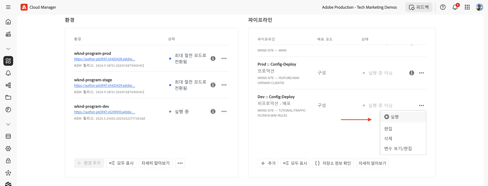

# 표준 트래픽 필터 규칙을 사용한 AEM 웹 사이트 보호

AEM as a Cloud Service에서 _Adobe 권장_ **표준 트래픽 필터 규칙**&#x200B;을 사용하여 서비스 거부(DoS), 분산 서비스 거부(DDoS) 및 봇 남용으로부터 AEM 웹 사이트를 보호하는 방법에 대해 알아봅니다.


>[!VIDEO](https://video.tv.adobe.com/v/3469396/?quality=12&learn=on)

## 학습 목표

- Adobe 권장 표준 트래픽 필터 규칙을 검토합니다.
- 규칙의 결과를 정의하고, 배포하고, 테스트하고, 분석합니다.
- 트래픽 패턴에 따라 규칙을 개선하는 시기 및 방법에 대해 이해합니다.
- AEM 액션 센터를 사용하여 규칙에 의해 생성된 경고를 검토하는 방법에 대해 알아봅니다.

### 구현 개요

구현 단계는 다음과 같습니다.

- AEM WKND 프로젝트의 `/config/cdn.yaml` 파일에 표준 트래픽 필터 규칙을 추가합니다.
- 변경 사항을 Cloud Manager Git 저장소에 커밋하고 푸시합니다.
- Cloud Manager 구성 파이프라인을 사용하여 AEM 환경에 변경 사항을 배포합니다.
- [Vegeta](https://github.com/tsenart/vegeta)를 사용하여 DoS 공격을 시뮬레이션하여 규칙을 테스트합니다.
- AEMCS CDN 로그 및 ELK 대시보드 도구를 사용하여 결과를 분석합니다.

## 사전 요구 사항

진행하기 전에 트래픽 [필터 및 WAF 규칙 설정 방법](../setup.md) 튜토리얼에 설명된 필수 기초 작업을 완료했는지 확인하시기 바랍니다. 또한 [AEM WKND Sites 프로젝트](https://github.com/adobe/aem-guides-wknd)를 AEM 환경에 복제하고 배포했는지 확인하십시오.

## 규칙의 주요 동작

표준 트래픽 필터 규칙의 세부 사항을 살펴보기 전에 이러한 규칙이 수행하는 주요 작업을 살펴보겠습니다. 각 규칙의 `action` 속성은 조건이 충족될 때 트래픽 필터가 어떻게 응답해야 하는지를 정의합니다. 작업에는 다음이 포함됩니다.

- **로그**: 규칙은 모니터링 및 분석을 위해 이벤트를 로깅하여 트래픽 패턴을 검토하고 필요에 따라 임계값을 조정할 수 있도록 합니다. 이는 `type: log` 속성으로 지정됩니다.

- **경고**: 규칙은 조건이 충족될 때 경고를 트리거하여 잠재적인 문제를 식별하는 데 도움이 됩니다. 이는 `alert: true` 속성으로 지정됩니다.

- **차단**: 규칙은 조건이 충족될 때 트래픽을 차단하여 AEM 사이트에 대한 액세스가 차단됩니다. 이는 `action: block` 속성으로 지정됩니다.

## 규칙 검토 및 정의

Adobe 권장 표준 트래픽 필터 규칙은 IP 기반 속도 제한 초과와 같은 이벤트를 로깅하고 특정 국가의 트래픽을 차단하여 잠재적인 악성 트래픽 패턴을 식별하기 위한 기본 계층 역할을 합니다. 이러한 로그는 팀이 임계값을 검증하고 합법적인 트래픽을 방해하지 않고 궁극적으로 **차단 모드 규칙으로 전환**&#x200B;하는 데 도움이 되는 정보에 입각한 결정을 내리는 데 도움이 됩니다.

AEM WKND 프로젝트의 `/config/cdn.yaml` 파일에 추가해야 하는 세 가지 표준 트래픽 필터 규칙을 검토해 보겠습니다.

- **에지에서 DoS 방지**: 이 규칙은 클라이언트 IP의 초당 요청(RPS)을 모니터링하여 CDN Edge에서 잠재적인 서비스 거부(DoS) 공격을 감지합니다.
- **원본에서 DoS 방지**: 이 규칙은 클라이언트 IP의 가져오기 요청을 모니터링하여 원본에서 잠재적인 서비스 거부(DoS) 공격을 감지합니다.
- **OFAC 국가 차단**: 이 규칙은 해외 자산 통제국(OFAC) 제한에 해당하는 특정 국가의 액세스를 차단합니다.

### &#x200B;1. 에지에서 DoS 방지

이 규칙은 CDN에서 잠재적인 서비스 거부(DoS) 공격을 감지하면 **경고를 보냅니다**. 이 규칙을 트리거하는 기준은 클라이언트가 에지의 CDN POP(Point of Presence)당 **초당 500개 요청**(10초 평균)을 초과하는 경우입니다.

이는 **모든** 요청을 계산하고 클라이언트 IP별로 그룹화합니다.

```yaml
kind: "CDN"
version: "1"
metadata:
  envTypes: ["dev", "stage", "prod"]
data:
  trafficFilters:
    rules:
    - name: prevent-dos-attacks-edge
      when:
        reqProperty: tier
        equals: 'publish'
      rateLimit:
        limit: 500
        window: 10
        penalty: 300
        count: all
        groupBy:
          - reqProperty: clientIp
      action:
        type: log
        alert: true
```

`action` 속성은 조건이 충족될 때 규칙이 이벤트를 로깅하고 경고를 트리거해야 함을 지정합니다. 이를 통해 합법적인 트래픽을 차단하지 않고 잠재적인 DoS 공격을 모니터링하는 데 도움이 됩니다. 그러나 목표는 트래픽 패턴을 검증하고 임계값을 조정한 후 궁극적으로 이 규칙을 차단 모드로 전환하는 것입니다.

### &#x200B;2. 원본에서 DoS 방지

이 규칙은 원본에서 잠재적인 서비스 거부(DoS) 공격을 감지하면 **경고를 보냅니다**. 이 규칙을 트리거하는 기준은 클라이언트가 원본에서 클라이언트 IP당 **초당 100개 요청**(10초 평균)을 초과하는 경우입니다.

이는 **가져오기**(캐시 우회 요청)를 계산하고 클라이언트 IP별로 그룹화합니다.

```yaml
...
    - name: prevent-dos-attacks-origin
      when:
        reqProperty: tier
        equals: 'publish'
      rateLimit:
        limit: 100
        window: 10
        penalty: 300
        count: fetches
        groupBy:
          - reqProperty: clientIp
      action:
        type: log
        alert: true
```

`action` 속성은 조건이 충족될 때 규칙이 이벤트를 로깅하고 경고를 트리거해야 함을 지정합니다. 이를 통해 합법적인 트래픽을 차단하지 않고 잠재적인 DoS 공격을 모니터링하는 데 도움이 됩니다. 그러나 목표는 트래픽 패턴을 검증하고 임계값을 조정한 후 궁극적으로 이 규칙을 차단 모드로 전환하는 것입니다.

### &#x200B;3. OFAC 국가 차단

이 규칙은 [OFAC](https://ofac.treasury.gov/sanctions-programs-and-country-information) 제한에 해당하는 특정 국가의 액세스를 차단합니다.
필요에 따라 국가 목록을 검토하고 수정할 수 있습니다.

```yaml
...
    - name: block-ofac-countries
      when:
        allOf:
          - { reqProperty: tier, in: ["author", "publish"] }
          - reqProperty: clientCountry
            in:
              - SY
              - BY
              - MM
              - KP
              - IQ
              - CD
              - SD
              - IR
              - LR
              - ZW
              - CU
              - CI
      action: block
```

`action` 속성은 규칙이 지정된 국가의 액세스를 차단해야 함을 지정합니다. 이는 보안 위험을 초래할 수 있는 지역에서 AEM 사이트에 대한 액세스를 방지하는 데 도움이 됩니다.

위 규칙이 적용된 전체 `cdn.yaml` 파일은 다음과 같습니다.


## 규칙 배포

위 규칙을 배포하려면 다음 단계를 따릅니다.

- 변경 사항을 Cloud Manager Git 저장소에 커밋하고 푸시합니다.

- [앞서 만든](../setup.md#deploy-rules-using-adobe-cloud-manager) Cloud Manager 구성 파이프라인을 사용하여 AEM 환경에 변경 사항을 배포합니다.

  

## 규칙 테스트

표준 트래픽 필터 규칙의 효과를 **CDN Edge**&#x200B;와 **원본** 모두에서 확인하려면 다용도 HTTP 부하 테스트 도구인 [Vegeta](https://github.com/tsenart/vegeta)를 사용하여 높은 요청 트래픽을 시뮬레이션합니다.

- 에지에서 DoS 규칙을 테스트합니다(500rps 제한). 다음 명령은 초당 200개의 요청을 15초 동안 시뮬레이션하며, 이는 에지 임계값(500 rps)을 초과합니다.

  ```shell
  $echo "GET https://publish-p63947-e1249010.adobeaemcloud.com/us/en.html" | vegeta attack -rate=200 -duration=15s | vegeta report
  ```

  

  >[!IMPORTANT]
  >
  >  위 보고서에서 *100%* 성공 및 _200_ 상태 코드를 확인합니다. 규칙이 `log` 및 `alert`로 설정되어 있으므로 요청은 _차단되지 않지만_ 모니터링 및 분석, 경고 목적으로 로깅됩니다.

- 원본에서 DoS 규칙을 테스트합니다(100rps 제한). 다음 명령은 초당 110개의 가져오기 요청을 1초 동안 시뮬레이션하며, 이는 원본 임계값(100 rps)을 초과합니다. 캐시 우회 요청을 시뮬레이션하기 위해 각 요청이 가져오기 요청으로 처리되도록 고유한 쿼리 매개변수를 사용하여 `targets.txt` 파일이 생성됩니다.

  ```shell
  # Create targets.txt with unique query parameters
  $for i in {1..110}; do
    echo "GET https://publish-p63947-e1249010.adobeaemcloud.com/us/en.html?ts=$(date +%s)$i"
  done > targets.txt
  
  # Use the targets.txt file to simulate fetch requests
  $vegeta attack -rate=110 -duration=1s -targets=targets.txt | vegeta report
  ```

  

  >[!IMPORTANT]
  >
  >  위 보고서에서 *100%* 성공 및 _200_ 상태 코드를 확인합니다. 규칙이 `log` 및 `alert`로 설정되어 있으므로 요청은 _차단되지 않지만_ 모니터링 및 분석, 경고 목적으로 로깅됩니다.

- 단순성을 위해 OFAC 규칙은 여기에서 테스트되지 않습니다.

## 경고 검토

트래픽 필터 규칙이 트리거되면 경고가 생성됩니다. [AEM Actions Center](https://experience.adobe.com/aem/actions-center)에서 이러한 경고를 검토할 수 있습니다.


## 결과 분석

트래픽 필터 규칙의 결과를 분석하려면 AEMCS CDN 로그 및 ELK 대시보드 도구를 사용할 수 있습니다. CDN 로그를 ELK 스택으로 수집하려면 [CDN 로그 수집](../setup.md#ingest-cdn-logs) 설정 섹션의 지침을 따르십시오.

다음 스크린샷에서 AEM 개발 환경의 CDN 로그가 ELK 스택으로 수집된 것을 확인할 수 있습니다.


ELK 애플리케이션 내에서 **CDN 트래픽 대시보드**&#x200B;는 시뮬레이션된 DoS 공격 중 **에지**&#x200B;와 **원본**&#x200B;에서의 스파이크를 보여 주어야 합니다.

_클라이언트 IP 및 POP당 Edge RPS_ 및 _클라이언트 IP 및 POP당 Origin RPS_&#x200B;의 두 패널은 각각 에지 및 원본에서의 초당 요청(RPS)을 클라이언트 IP 및 POP(Point of Presence)별로 그룹화하여 표시합니다.


CDN 트래픽 대시보드에서 _상위 클라이언트 IP_, _상위 국가_ 및 _상위 사용자 에이전트_&#x200B;와 같은 다른 패널을 사용하여 트래픽 패턴을 분석할 수도 있습니다. 이러한 패널은 잠재적인 위협을 식별하고 그에 따라 트래픽 필터 규칙을 조정하는 데 도움이 됩니다.

### Splunk 통합

[활성화된 Splunk 로그 전달](https://experienceleague.adobe.com/ko/docs/experience-manager-cloud-service/content/implementing/developing/logging#splunk-logs)이 있는 고객은 새 대시보드를 만들어 트래픽 패턴을 분석할 수 있습니다.

Splunk에서 대시보드를 만들려면 [AEMCS CDN 로그 분석을 위한 Splunk 대시보드](https://github.com/adobe/AEMCS-CDN-Log-Analysis-Tooling/blob/main/Splunk/README.md#splunk-dashboards-for-aemcs-cdn-log-analysis) 단계를 따르십시오.

다음 스크린샷은 IP당 최대 원본 및 에지 요청을 표시하는 Splunk 대시보드의 예시로, 잠재적인 DoS 공격을 식별하는 데 도움이 될 수 있습니다.


## 규칙을 개선하는 시기 및 방법

목표는 합법적인 트래픽을 차단하지 않으면서 잠재적인 위협으로부터 AEM 사이트를 보호하는 것입니다. 표준 트래픽 필터 규칙은 합법적인 트래픽을 차단하지 않고 위협에 대해 경고하고 로깅(모드가 전환되면 차단)하도록 설계되었습니다.

규칙을 개선하려면 다음 단계를 고려하십시오.

- **트래픽 패턴 모니터링**: CDN 로그 및 ELK 대시보드를 사용하여 트래픽 패턴을 모니터링하고 예외 항목 또는 스파이크를 식별합니다.
- **임계값 조정**: 트래픽 패턴을 기반으로 특정 요구 사항에 더 잘 맞도록 규칙의 임계값(속도 제한 증가 또는 감소)을 조정합니다. 예를 들어 합법적인 트래픽이 경고를 트리거한 경우 속도 제한을 늘리거나 그룹화를 조정할 수 있습니다.
아래 표에서는 임계값을 설정하는 데 도움이 되는 지침을 제공합니다.

  | 변형 | 값 |
  | :--------- | :------- |
  | Origin | **일반적인** 트래픽 조건(즉, DDoS 발생 시 속도가 아님)에서의 IP/POP당 Origin 최대 요청 수를 기준으로 하여, 여기에 배수를 곱해 증가시킵니다. |
  | Edge | **일반적인** 트래픽 조건(즉, DDoS 발생 시 속도가 아님)에서의 IP/POP당 Edge 최대 요청 수를 기준으로 하여, 여기에 배수를 곱해 증가시킵니다. |

  자세한 내용은 [임계값 선택](../../blocking-dos-attack-using-traffic-filter-rules.md#choosing-threshold-values) 섹션을 참조하십시오.

- **차단 규칙으로 이동**: 트래픽 패턴을 검증하고 임계값을 조정한 후에는 규칙을 차단 모드로 전환해야 합니다.

## 요약

이 튜토리얼에서는 AEM as a Cloud Service에서 Adobe 권장 표준 트래픽 필터 규칙을 사용하여 서비스 거부(DoS), 분산 서비스 거부(DDoS) 및 봇 남용으로부터 AEM 웹 사이트를 보호하는 방법을 배웠습니다.

## 권장 WAF 규칙

기존 보안 조치를 우회하기 위해 고급 기술을 사용하는 정교한 위협으로부터 AEM 웹 사이트를 보호하기 위해 Adobe에서 권장하는 WAF 규칙을 구현하는 방법에 대해 알아봅니다.

<!-- CARDS
{target = _self}

* ./using-waf-rules.md
  {title = Protecting AEM websites using WAF traffic filter rules}
  {description = Learn how to protect AEM websites from sophisticated threats including DoS, DDoS, and bot abuse using Adobe-recommended Web Application Firewall (WAF) traffic filter rules in AEM as a Cloud Service.}
  {image = ../assets/use-cases/using-waf-rules.png}
  {cta = Activate WAF}
-->
<!-- START CARDS HTML - DO NOT MODIFY BY HAND -->
<div class="columns">
    <div class="column is-half-tablet is-half-desktop is-one-third-widescreen" aria-label="Protecting AEM websites using WAF traffic filter rules">
        <div class="card" style="height: 100%; display: flex; flex-direction: column; height: 100%;">
            <div class="card-image">
                <figure class="image x-is-16by9">
                    <a href="./using-waf-rules.md" title="WAF 트래픽 필터 규칙을 사용하여 AEM 웹 사이트 보호" target="_self" rel="referrer">
                        
                    </a>
                </figure>
            </div>
            <div class="card-content is-padded-small" style="display: flex; flex-direction: column; flex-grow: 1; justify-content: space-between;">
                <div class="top-card-content">
                    <p class="headline is-size-6 has-text-weight-bold">
                        <a href="./using-waf-rules.md" target="_self" rel="referrer" title="WAF 트래픽 필터 규칙을 사용하여 AEM 웹 사이트 보호">WAF 트래픽 필터 규칙을 사용하여 AEM 웹 사이트 보호</a>
                    </p>
                    <p class="is-size-6">AEM as a Cloud Service에서 Adobe 권장 웹 애플리케이션 방화벽(WAF) 트래픽 필터 규칙을 사용하여 DoS, DDoS 및 봇 남용을 포함한 정교한 위협으로부터 AEM 웹 사이트를 보호하는 방법에 대해 알아봅니다.</p>
                </div>
                <a href="./using-waf-rules.md" target="_self" rel="referrer" class="spectrum-Button spectrum-Button--outline spectrum-Button--primary spectrum-Button--sizeM" style="align-self: flex-start; margin-top: 1rem;">
                    <span class="spectrum-Button-label has-no-wrap has-text-weight-bold">WAF 활성화</span>
                </a>
            </div>
        </div>
    </div>
</div>
<!-- END CARDS HTML - DO NOT MODIFY BY HAND -->


## 사용 사례 - 표준 규칙 이상

더 고급 시나리오의 경우, 특정 비즈니스 요구 사항에 따라 사용자 정의 트래픽 필터 규칙을 구현하는 방법을 보여 주는 다음 사용 사례를 살펴볼 수 있습니다.

<!-- CARDS
{target = _self}

* ../how-to/request-logging.md

* ../how-to/request-blocking.md

* ../how-to/request-transformation.md
-->
<!-- START CARDS HTML - DO NOT MODIFY BY HAND -->
<div class="columns">
    <div class="column is-half-tablet is-half-desktop is-one-third-widescreen" aria-label="Monitoring sensitive requests">
        <div class="card" style="height: 100%; display: flex; flex-direction: column; height: 100%;">
            <div class="card-image">
                <figure class="image x-is-16by9">
                    <a href="../how-to/request-logging.md" title="민감한 요청 모니터링" target="_self" rel="referrer">
                        
                    </a>
                </figure>
            </div>
            <div class="card-content is-padded-small" style="display: flex; flex-direction: column; flex-grow: 1; justify-content: space-between;">
                <div class="top-card-content">
                    <p class="headline is-size-6 has-text-weight-bold">
                        <a href="../how-to/request-logging.md" target="_self" rel="referrer" title="민감한 요청 모니터링">민감한 요청 모니터링</a>
                    </p>
                    <p class="is-size-6">AEM as a Cloud Service에서 트래픽 필터 규칙을 사용하여 민감한 요청을 로깅하여 모니터링하는 방법에 대해 알아봅니다.</p>
                </div>
                <a href="../how-to/request-logging.md" target="_self" rel="referrer" class="spectrum-Button spectrum-Button--outline spectrum-Button--primary spectrum-Button--sizeM" style="align-self: flex-start; margin-top: 1rem;">
                    <span class="spectrum-Button-label has-no-wrap has-text-weight-bold">자세히 알아보기</span>
                </a>
            </div>
        </div>
    </div>
    <div class="column is-half-tablet is-half-desktop is-one-third-widescreen" aria-label="Restricting access">
        <div class="card" style="height: 100%; display: flex; flex-direction: column; height: 100%;">
            <div class="card-image">
                <figure class="image x-is-16by9">
                    <a href="../how-to/request-blocking.md" title="액세스 제한" target="_self" rel="referrer">
                        
                    </a>
                </figure>
            </div>
            <div class="card-content is-padded-small" style="display: flex; flex-direction: column; flex-grow: 1; justify-content: space-between;">
                <div class="top-card-content">
                    <p class="headline is-size-6 has-text-weight-bold">
                        <a href="../how-to/request-blocking.md" target="_self" rel="referrer" title="액세스 제한">액세스 제한</a>
                    </p>
                    <p class="is-size-6">AEM as a Cloud Service에서 트래픽 필터 규칙을 사용하여 특정 요청을 차단하여 액세스를 제한하는 방법에 대해 알아봅니다.</p>
                </div>
                <a href="../how-to/request-blocking.md" target="_self" rel="referrer" class="spectrum-Button spectrum-Button--outline spectrum-Button--primary spectrum-Button--sizeM" style="align-self: flex-start; margin-top: 1rem;">
                    <span class="spectrum-Button-label has-no-wrap has-text-weight-bold">자세히 알아보기</span>
                </a>
            </div>
        </div>
    </div>
    <div class="column is-half-tablet is-half-desktop is-one-third-widescreen" aria-label="Normalizing requests">
        <div class="card" style="height: 100%; display: flex; flex-direction: column; height: 100%;">
            <div class="card-image">
                <figure class="image x-is-16by9">
                    <a href="../how-to/request-transformation.md" title="요청 표준화" target="_self" rel="referrer">
                        
                    </a>
                </figure>
            </div>
            <div class="card-content is-padded-small" style="display: flex; flex-direction: column; flex-grow: 1; justify-content: space-between;">
                <div class="top-card-content">
                    <p class="headline is-size-6 has-text-weight-bold">
                        <a href="../how-to/request-transformation.md" target="_self" rel="referrer" title="요청 표준화">요청 표준화</a>
                    </p>
                    <p class="is-size-6">AEM as a Cloud Service에서 트래픽 필터 규칙을 사용하여 요청을 변환하여 정규화하는 방법에 대해 알아봅니다.</p>
                </div>
                <a href="../how-to/request-transformation.md" target="_self" rel="referrer" class="spectrum-Button spectrum-Button--outline spectrum-Button--primary spectrum-Button--sizeM" style="align-self: flex-start; margin-top: 1rem;">
                    <span class="spectrum-Button-label has-no-wrap has-text-weight-bold">자세히 알아보기</span>
                </a>
            </div>
        </div>
    </div>
</div>
<!-- END CARDS HTML - DO NOT MODIFY BY HAND -->


## 추가 리소스

- [권장 스타터 규칙](https://experienceleague.adobe.com/ko/docs/experience-manager-cloud-service/content/security/traffic-filter-rules-including-waf#recommended-starter-rules)
