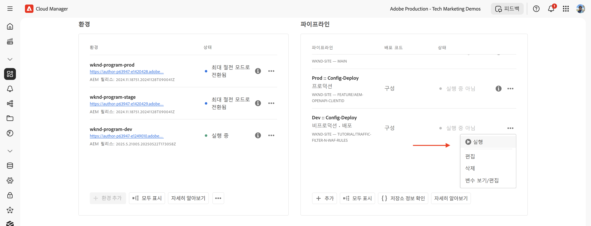
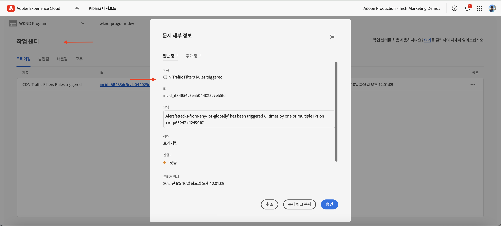

# WAF 규칙을 사용하여 AEM 웹 사이트 보호

AEM as a Cloud Service에서 _Adobe 권장_ **Web Application Firewall(WAF) 규칙**&#x200B;을(를) 사용하여 DoS, DDoS 및 봇 남용을 포함한 정교한 위협으로부터 AEM 웹 사이트를 보호하는 방법에 대해 알아봅니다.

정교한 공격은 높은 요청율, 복잡한 패턴, 전통적인 보안 조치를 우회하기 위한 고급 기술의 사용으로 특징지어진다.

>[!IMPORTANT]
>
> WAF 트래픽 필터 규칙에는 추가 **WAF-DDoS 보호** 또는 **향상된 보안** 라이선스가 필요합니다. 표준 트래픽 필터 규칙은 기본적으로 Sites 및 Forms 고객이 사용할 수 있습니다.

## 학습 목표

- Adobe에서 권장하는 WAF 규칙을 검토합니다.
- 규칙의 결과를 정의, 배포, 테스트 및 분석합니다.
- 결과를 기반으로 규칙을 세분화하는 시기와 방법을 이해합니다.
- AEM 작업 센터를 사용하여 규칙으로 생성된 경고를 검토하는 방법에 대해 알아봅니다.

### 구현 개요

구현 단계에는 다음이 포함됩니다.

- AEM WKND 프로젝트의 `/config/cdn.yaml` 파일에 WAF 규칙을 추가하는 중입니다.
- 변경 사항을 Cloud Manager Git 저장소에 커밋하고 푸시합니다.
- Cloud Manager 구성 파이프라인을 사용하여 AEM 환경에 변경 사항 배포
- [Nikto](https://github.com/sullo/nikto/wiki)을(를) 사용하여 DDoS 공격을 시뮬레이션하여 규칙을 테스트합니다.
- AEMCS CDN 로그 및 ELK 대시보드 도구를 사용하여 결과 분석

## 사전 요구 사항

계속하기 전에 [트래픽 필터 및 WAF 규칙을 설정하는 방법](../setup.md) 자습서에 설명된 대로 필요한 설정을 완료했는지 확인하십시오. 또한 [AEM WKND Sites 프로젝트](https://github.com/adobe/aem-guides-wknd)를 AEM 환경에 복제하고 배포했습니다.

## 규칙 검토 및 정의

Adobe 권장 웹 애플리케이션 방화벽(WAF) 규칙은 DoS, DDoS 및 봇 남용을 포함한 정교한 위협으로부터 AEM 웹 사이트를 보호하는 데 필수적입니다. 정교한 공격은 높은 요청율, 복잡한 패턴, 기존의 보안 조치를 우회하는 고급 기술(프로토콜 기반 또는 페이로드 기반 공격)의 사용으로 특징지어진다.

AEM WKND 프로젝트의 `cdn.yaml` 파일에 추가해야 하는 세 가지 권장 WAF 규칙을 검토해 보겠습니다.

### &#x200B;1. 알려진 악성 IP의 공격 차단

이 규칙은 의심스러운 **및** 요청이 모두 악의적인 것으로 플래그가 지정된 IP 주소에서 비롯된 *블록* 요청입니다. 이 두 가지 기준이 모두 충족되므로 긍정 오류(합법적인 트래픽 차단)의 위험이 매우 낮다고 확신할 수 있습니다. 알려진 잘못된 IP는 위협 인텔리전스 피드 및 기타 소스를 기반으로 식별됩니다.

`ATTACK-FROM-BAD-IP` WAF 플래그를 사용하여 이러한 요청을 식별합니다. [여기에 나열된](https://experienceleague.adobe.com/ko/docs/experience-manager-cloud-service/content/security/traffic-filter-rules-including-waf#waf-flags-list) WAF 플래그 중 일부를 집계합니다.

```yaml
kind: "CDN"
version: "1"
metadata:
  envTypes: ["dev", "stage", "prod"]
data:
  trafficFilters:
    rules:
    - name: attacks-from-bad-ips-globally
      when:
        reqProperty: tier
        in: ["author", "publish"]
      action:
        type: block
        wafFlags:
          - ATTACK-FROM-BAD-IP
```

### &#x200B;2. IP의 공격을 전체적으로 로그(및 이후 차단)

IP 주소를 위협 인텔리전스 피드에서 찾을 수 없는 경우에도 이 규칙 **로그** 요청은 잠재적인 공격으로 식별됩니다.

`ATTACK` WAF 플래그를 사용하여 이러한 요청을 식별합니다. `ATTACK-FROM-BAD-IP`과(와) 비슷합니다   여러 WAF 플래그를 집계합니다.

이러한 요청은 악의적일 수 있지만 IP 주소가 위협 인텔리전스 피드에서 식별되지 않으므로 차단 모드가 아닌 `log` 모드에서 시작하는 것이 신중할 수 있습니다. 로그에서 긍정 오류(false positive)를 분석하고, 유효성을 검사한 후에는 **규칙을 `block` 모드로 전환**&#x200B;하십시오.

```yaml
...
    - name: attacks-from-any-ips-globally
      when:
        reqProperty: tier
        in: ["author", "publish"]
      action:
        type: log
        alert: true
        wafFlags:
          - ATTACK
```

비즈니스 요구 사항이 악성 트래픽을 허용하지 않으려는 경우 `block` 모드를 즉시 사용하도록 선택할 수도 있습니다.

이러한 권장 WAF 규칙은 알려진 위협과 새로운 위협에 대한 추가 보안 계층을 제공합니다.


## 가장 최근의 Adobe 권장 WAF 규칙으로 마이그레이션

`ATTACK-FROM-BAD-IP` 및 `ATTACK` WAF 플래그(2025년 7월)가 도입되기 전에 권장되는 WAF 규칙은 다음과 같습니다. 여기에는 `SANS`, `TORNODE`, `NOUA` 등과 같은 특정 기준과 일치하는 요청을 차단하기 위한 특정 WAF 플래그 목록이 포함되어 있습니다.

```yaml
...
data:
  trafficFilters:
    rules:
    ...
    # Enable WAF protections (only works if WAF is enabled for your environment)
      - name: block-waf-flags
        when:
          reqProperty: tier
          matches: "author|publish"
        action:
          type: block
          wafFlags:
            - SANS
            - TORNODE
            - NOUA
            - SCANNER
            - USERAGENT
            - PRIVATEFILE
            - ABNORMALPATH
            - TRAVERSAL
            - NULLBYTE
            - BACKDOOR
            - LOG4J-JNDI
            - SQLI
            - XSS
            - CODEINJECTION
            - CMDEXE
            - NO-CONTENT-TYPE
            - UTF8
...
```

위의 규칙은 여전히 유효하지만 `ATTACK-FROM-BAD-IP` 및 `ATTACK` WAF 플래그 _을(를) 사용하는 새 규칙으로 마이그레이션하는 것이 좋습니다. 비즈니스 요구 사항에 맞게 `wafFlags`을(를) 아직 사용자 지정하지 않은 경우_&#x200B;입니다.

다음 단계를 수행하여 모범 사례와 일치하도록 새 규칙으로 마이그레이션할 수 있습니다.

- `cdn.yaml` 파일의 기존 WAF 규칙을 검토하십시오. 위의 예제와 비슷할 수 있습니다. 비즈니스 요구 사항에 맞는 `wafFlags`의 사용자 지정이 없는지 확인합니다.

- 기존 WAF 규칙을 `ATTACK-FROM-BAD-IP` 및 `ATTACK` 플래그를 사용하는 새 Adobe 권장 WAF 규칙으로 바꾸십시오. 모든 규칙이 차단 모드에 있는지 확인합니다.

이전에 `wafFlags`을(를) 사용자 지정한 경우 이러한 새 규칙으로 마이그레이션할 수 있지만, 사용자 지정한 내용이 수정된 규칙에 적용되도록 주의해서 마이그레이션해야 합니다.

마이그레이션을 통해 WAF 규칙을 단순화하는 동시에 정교한 위협에 대한 강력한 보호 기능을 제공할 수 있습니다. 새 규칙은 보다 효과적이고 관리하기 쉽도록 설계되었습니다.


## 규칙 배포

위의 규칙을 배포하려면 다음 단계를 따르십시오.

- 변경 사항을 Cloud Manager Git 저장소에 커밋하고 푸시합니다.

- Cloud Manager 구성 파이프라인 [이전에 만든](../setup.md#deploy-rules-using-adobe-cloud-manager)을(를) 사용하여 AEM 환경에 변경 사항을 배포합니다.

  

## 테스트 규칙

WAF 규칙의 효과를 확인하려면 취약성 및 구성 오류를 감지하는 웹 서버 스캐너인 [Nikto](https://github.com/sullo/nikto)을(를) 사용하여 공격을 시뮬레이션하십시오. 다음 명령은 WAF 규칙으로 보호되는 AEM WKND 웹 사이트에 대해 SQL 삽입 공격을 트리거합니다.

```shell
$./nikto.pl -useragent "AttackSimulationAgent (Demo/1.0)" -D V -Tuning 9 -ssl -h https://publish-pXXXX-eYYYY.adobeaemcloud.com/us/en.html
```


공격 시뮬레이션에 대해 자세히 알아보려면 [Nikto - Scan Tuning](https://github.com/sullo/nikto/wiki/Scan-Tuning) 설명서를 검토하십시오. 여기에서는 포함하거나 제외할 테스트 공격 유형을 지정하는 방법을 설명합니다.

## 경고 검토

트래픽 필터 규칙이 트리거되면 경고가 생성됩니다. [AEM 작업 센터](https://experience.adobe.com/aem/actions-center)에서 이러한 경고를 검토할 수 있습니다.



## 결과 분석

트래픽 필터 규칙의 결과를 분석하기 위해 AEMCS CDN 로그 및 ELK 대시보드 도구를 사용할 수 있습니다. [CDN 로그 수집](../setup.md#ingest-cdn-logs) 설정 섹션의 지침에 따라 CDN 로그를 ELK 스택으로 수집합니다.

다음 스크린샷에서는 AEM 개발 환경의 CDN 로그가 ELK 스택에 수집되는 것을 볼 수 있습니다.


ELK 응용 프로그램 내에서 **WAF 대시보드**&#x200B;에
클라이언트 IP(cli_ip), 호스트, url, 작업(waf_action) 및 규칙 이름(waf_match) 열에 플래그가 지정된 요청 및 해당 값.


또한 **WAF 플래그 분포** 및 **상위 공격** 패널에는 추가 세부 정보가 표시됩니다.


### Splunk 통합

[활성화된 Splunk 로그 전달](https://experienceleague.adobe.com/ko/docs/experience-manager-cloud-service/content/implementing/developing/logging#splunk-logs)이 있는 고객은 새 대시보드를 만들어 트래픽 패턴을 분석할 수 있습니다.

Splunk에서 대시보드를 만들려면 [AEMCS CDN 로그 분석을 위한 Splunk 대시보드](https://github.com/adobe/AEMCS-CDN-Log-Analysis-Tooling/blob/main/Splunk/README.md#splunk-dashboards-for-aemcs-cdn-log-analysis) 단계를 따르십시오.

## 규칙 세분화 시기 및 방법

목표는 합법적인 트래픽을 차단하지 않으면서도 정교한 위협으로부터 AEM 웹 사이트를 보호하는 것입니다. 권장 WAF 규칙은 보안 전략의 시작점이 되도록 설계되었습니다.

규칙을 세분화하려면 다음 단계를 고려하십시오.

- **트래픽 패턴 모니터링**: CDN 로그 및 ELK 대시보드를 사용하여 트래픽 패턴을 모니터링하고 트래픽 이상 현상이나 스파이크를 식별합니다. 탐지되는 공격 유형을 이해하려면 ELK 대시보드의 _WAF 플래그 분포_ 및 _상위 공격_ 패널에 주의하십시오.
- **wafFlags 조정**: `ATTACK` 플래그가 너무 자주 트리거되거나
공격 벡터를 세밀하게 조정해야 합니다. 특정 WAF 플래그로 사용자 지정 규칙을 만들 수 있습니다. 설명서에서 [WAF 플래그](https://experienceleague.adobe.com/ko/docs/experience-manager-cloud-service/content/security/traffic-filter-rules-including-waf#waf-flags-list)의 전체 목록을 확인하십시오. 먼저 `log` 모드에서 새 사용자 지정 규칙을 사용해 보십시오.
- **차단 규칙으로 이동**: 트래픽 패턴의 유효성을 검사하고 WAF 플래그를 조정했으면 차단 규칙으로 이동하는 것을 고려해 볼 수 있습니다.

## 요약

이 자습서에서는 AEM 권장 웹 애플리케이션 방화벽(WAF) 규칙을 사용하여 DoS, DDoS 및 봇 남용을 비롯한 정교한 위협으로부터 Adobe 웹 사이트를 보호하는 방법에 대해 알아보았습니다.

## 사용 사례 - 표준 규칙 이상

고급 시나리오의 경우 특정 비즈니스 요구 사항을 기반으로 사용자 지정 트래픽 필터 규칙을 구현하는 방법을 보여 주는 다음 사용 사례를 살펴볼 수 있습니다.

<!-- CARDS
{target = _self}

* ../how-to/request-logging.md

* ../how-to/request-blocking.md

* ../how-to/request-transformation.md
-->
<!-- START CARDS HTML - DO NOT MODIFY BY HAND -->
<div class="columns">
    <div class="column is-half-tablet is-half-desktop is-one-third-widescreen" aria-label="Monitoring sensitive requests">
        <div class="card" style="height: 100%; display: flex; flex-direction: column; height: 100%;">
            <div class="card-image">
                <figure class="image x-is-16by9">
                    <a href="../how-to/request-logging.md" title="중요한 요청 모니터링" target="_self" rel="referrer">
                        
                    </a>
                </figure>
            </div>
            <div class="card-content is-padded-small" style="display: flex; flex-direction: column; flex-grow: 1; justify-content: space-between;">
                <div class="top-card-content">
                    <p class="headline is-size-6 has-text-weight-bold">
                        <a href="../how-to/request-logging.md" target="_self" rel="referrer" title="중요한 요청 모니터링">중요한 요청 모니터링</a>
                    </p>
                    <p class="is-size-6">AEM as a Cloud Service에서 트래픽 필터 규칙을 사용하여 중요한 요청을 로깅함으로써 모니터링하는 방법에 대해 알아봅니다.</p>
                </div>
                <a href="../how-to/request-logging.md" target="_self" rel="referrer" class="spectrum-Button spectrum-Button--outline spectrum-Button--primary spectrum-Button--sizeM" style="align-self: flex-start; margin-top: 1rem;">
                    <span class="spectrum-Button-label has-no-wrap has-text-weight-bold">자세히 알아보기</span>
                </a>
            </div>
        </div>
    </div>
    <div class="column is-half-tablet is-half-desktop is-one-third-widescreen" aria-label="Restricting access">
        <div class="card" style="height: 100%; display: flex; flex-direction: column; height: 100%;">
            <div class="card-image">
                <figure class="image x-is-16by9">
                    <a href="../how-to/request-blocking.md" title="액세스 제한" target="_self" rel="referrer">
                        
                    </a>
                </figure>
            </div>
            <div class="card-content is-padded-small" style="display: flex; flex-direction: column; flex-grow: 1; justify-content: space-between;">
                <div class="top-card-content">
                    <p class="headline is-size-6 has-text-weight-bold">
                        <a href="../how-to/request-blocking.md" target="_self" rel="referrer" title="액세스 제한">액세스 제한</a>
                    </p>
                    <p class="is-size-6">AEM as a Cloud Service에서 트래픽 필터 규칙을 사용하여 특정 요청을 차단하여 액세스를 제한하는 방법에 대해 알아봅니다.</p>
                </div>
                <a href="../how-to/request-blocking.md" target="_self" rel="referrer" class="spectrum-Button spectrum-Button--outline spectrum-Button--primary spectrum-Button--sizeM" style="align-self: flex-start; margin-top: 1rem;">
                    <span class="spectrum-Button-label has-no-wrap has-text-weight-bold">자세히 알아보기</span>
                </a>
            </div>
        </div>
    </div>
    <div class="column is-half-tablet is-half-desktop is-one-third-widescreen" aria-label="Normalizing requests">
        <div class="card" style="height: 100%; display: flex; flex-direction: column; height: 100%;">
            <div class="card-image">
                <figure class="image x-is-16by9">
                    <a href="../how-to/request-transformation.md" title="요청 표준화" target="_self" rel="referrer">
                        
                    </a>
                </figure>
            </div>
            <div class="card-content is-padded-small" style="display: flex; flex-direction: column; flex-grow: 1; justify-content: space-between;">
                <div class="top-card-content">
                    <p class="headline is-size-6 has-text-weight-bold">
                        <a href="../how-to/request-transformation.md" target="_self" rel="referrer" title="요청 표준화">요청 정규화</a>
                    </p>
                    <p class="is-size-6">AEM as a Cloud Service에서 트래픽 필터 규칙을 사용하여 요청을 변환하여 요청을 정규화하는 방법을 알아봅니다.</p>
                </div>
                <a href="../how-to/request-transformation.md" target="_self" rel="referrer" class="spectrum-Button spectrum-Button--outline spectrum-Button--primary spectrum-Button--sizeM" style="align-self: flex-start; margin-top: 1rem;">
                    <span class="spectrum-Button-label has-no-wrap has-text-weight-bold">자세히 알아보기</span>
                </a>
            </div>
        </div>
    </div>
</div>
<!-- END CARDS HTML - DO NOT MODIFY BY HAND -->

## 추가 리소스

- [권장 시작 규칙](https://experienceleague.adobe.com/ko/docs/experience-manager-cloud-service/content/security/traffic-filter-rules-including-waf#recommended-nonwaf-starter-rules)
- [WAF 플래그 목록](https://experienceleague.adobe.com/ko/docs/experience-manager-cloud-service/content/security/traffic-filter-rules-including-waf#waf-flags-list)
