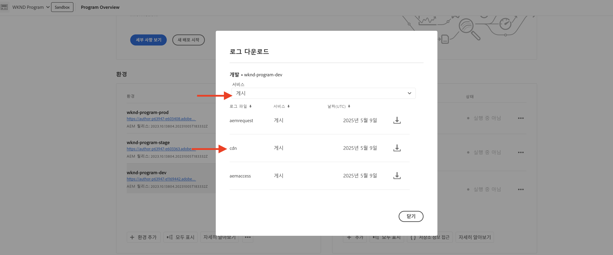
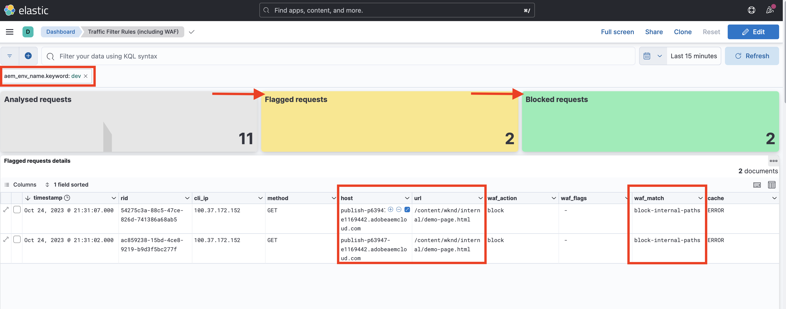
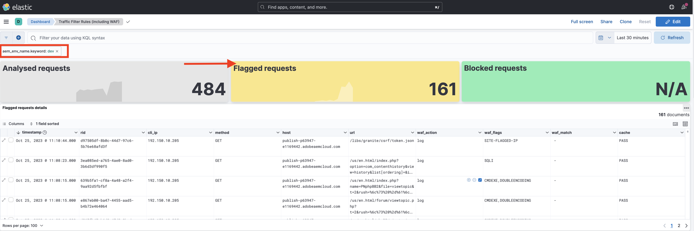

# WAF 규칙을 포함한 트래픽 필터 규칙의 예 및 결과 분석

Adobe Experience Manager as a Cloud Service(AEMCS) CDN 로그 및 대시보드 도구를 사용하여 다양한 유형의 트래픽 필터 규칙을 선언하고 결과를 분석하는 방법을 알아봅니다.

이 섹션에서는 WAF 규칙을 포함한 트래픽 필터 규칙의 실제 예를 살펴보겠습니다. [AEM WKND Sites 프로젝트](https://github.com/adobe/aem-guides-wknd#aem-wknd-sites-project)를 사용하여 URI(또는 경로), IP 주소, 요청 수 및 다양한 공격 유형을 기반으로 요청을 기록하고, 허용하고, 차단하는 방법을 알아봅니다.

또한 대시보드 도구를 사용하여 Adobe에서 제공하는 샘플 대시보드를 통해 AEMCS CDN 로그를 수집하여 필수 지표를 시각화하는 방법도 살펴보겠습니다.

특정 요구 사항에 맞게 사용자 정의 대시보드를 만들고 개선하여 더욱 심층적인 인사이트를 얻고 AEM 사이트에 대한 규칙 구성을 최적화할 수 있습니다.

>[!VIDEO](https://video.tv.adobe.com/v/3425404?quality=12&learn=on)

## 예

WAF 규칙을 포함한 트래픽 필터 규칙의 다양한 예를 살펴보겠습니다. 이전의 [설정 방법](./how-to-setup.md) 장에서 설명한 대로 필요한 설정 프로세스를 완료했는지, 그리고 [AEM WKND Sites 프로젝트](https://github.com/adobe/aem-guides-wknd#aem-wknd-sites-project)를 복제했는지 확인하십시오.

### 요청 로깅

먼저 AEM 게시 서비스에 대한 **WKND 로그인 및 로그아웃 경로의 요청을 로깅**&#x200B;합니다.

- WKND 프로젝트의 `/config/cdn.yaml` 파일에 다음 규칙을 추가합니다.

```yaml
kind: CDN
version: '1'
metadata:
  envTypes:
    - dev
    - stage
    - prod
data:
  trafficFilters:
    rules:
    # On AEM Publish service log WKND Login and Logout requests
      - name: publish-auth-requests
        when:
          allOf:
            - reqProperty: tier
              matches: publish
            - reqProperty: path
              in:
                - /system/sling/login/j_security_check
                - /system/sling/logout
        action: log
```

- 변경 사항을 Cloud Manager Git 저장소에 커밋하고 푸시합니다.

- [앞서 만든](how-to-setup.md#deploy-rules-through-cloud-manager) Cloud Manager `Dev-Config` 구성 파이프라인을 사용하여 AEM 개발자 환경에 변경 사항을 배포합니다.

  

- 게시 서비스에서 프로그램의 WKND 사이트(예: `https://publish-pXXXX-eYYYY.adobeaemcloud.com/us/en.html`)에 로그인 및 로그아웃하여 규칙을 테스트합니다. `asmith/asmith`를 사용자 이름과 암호로 사용할 수 있습니다.

  

#### 분석{#analyzing}

Cloud Manager에서 AEMCS CDN 로그를 다운로드하고 [대시보드 도구](how-to-setup.md#analyze-results-using-elk-dashboard-tool)를 사용하여 이전 장에서 설정한 `publish-auth-requests` 규칙의 결과를 분석해 보겠습니다.

- [Cloud Manager](https://my.cloudmanager.adobe.com/)의 **환경** 카드에서 AEMCS **게시** 서비스의 CDN 로그를 다운로드합니다.

  

  >[!TIP]
  >
  >    새로운 요청이 CDN 로그에 나타나기까지 최대 5분 정도 소요될 수 있습니다.

- 다운로드한 로그 파일(예: 아래 스크린샷의 `publish_cdn_2023-10-24.log`)을 Elastic 대시보드 도구 프로젝트의 `logs/dev` 폴더에 복사합니다.

  {width="800" zoomable="yes"}

- Elastic 대시보드 도구 페이지를 새로 고칩니다.
   - 상단의 **전역 필터** 섹션에서 `aem_env_name.keyword` 필터를 편집하고 `dev` 환경 값을 선택합니다.

     

   - 시간 간격을 변경하려면 오른쪽 상단에 있는 캘린더 아이콘을 클릭하고 원하는 시간 간격을 선택합니다.

     

- 업데이트된 대시보드의 **분석된 요청**, **플래그가 지정된 요청** 및 **플래그가 지정된 요청 세부 정보** 패널을 검토합니다. CDN 로그 항목을 일치시키려면 각 항목의 클라이언트 IP(cli_ip), 호스트, URL, 작업(waf_action) 및 규칙 이름(waf_match) 값을 표시해야 합니다.

  


### 요청 차단

이 예제에서는 배포된 WKND 프로젝트의 `/content/wknd/internal` 경로에 있는 _내부_ 폴더에 페이지를 추가해 보겠습니다. 그런 다음 조직과 일치하는 지정된 IP 주소(예: 회사 VPN) 외의 위치에서 해당 하위 페이지로의 **트래픽을 차단**&#x200B;하는 트래픽 필터 규칙을 선언합니다.

자체 내부 페이지를 만들거나(예: `demo-page.html`) [첨부된 패키지](./assets/demo-internal-pages-package.zip)를 사용할 수 있습니다.

- WKND 프로젝트의 `/config/cdn.yaml` 파일에 다음 규칙을 추가합니다.

```yaml
kind: CDN
version: '1'
metadata:
  envTypes:
    - dev
    - stage
    - prod
data:
  trafficFilters:
    rules:
    ...

    # Block requests to (demo) internal only page/s from public IP address but allow from internal IP address.
    # Make sure to replace the IP address with your own IP address.
      - name: block-internal-paths
        when:
          allOf:
            - reqProperty: path
              matches: /content/wknd/internal
            - reqProperty: clientIp
              notIn: [192.150.10.0/24]
        action: block
```

- 변경 사항을 Cloud Manager Git 저장소에 커밋하고 푸시합니다.

- [앞서 만든](how-to-setup.md#deploy-rules-through-cloud-manager) Cloud Manager `Dev-Config` 구성 파이프라인을 사용하여 AEM 개발자 환경에 변경 사항을 배포합니다.

- WKND 사이트의 내부 페이지(예: `https://publish-pXXXX-eYYYY.adobeaemcloud.com/content/wknd/internal/demo-page.html`)에 액세스하거나 아래의 CURL 명령을 사용하여 규칙을 테스트합니다.

  ```bash
  $ curl -I https://publish-pXXXX-eYYYY.adobeaemcloud.com/content/wknd/internal/demo-page.html
  ```

- 규칙에서 사용한 IP 주소와 다른 IP 주소(예: 휴대전화 사용)에서 위의 단계를 반복합니다.

#### 분석

`block-internal-paths` 규칙의 결과를 분석하려면 [이전 예](#analyzing)에서 설명한 것과 동일한 단계를 따릅니다.

하지만 이번에는 클라이언트 IP(cli_ip), 호스트, URL, 작업(waf_action) 및 규칙 이름(waf_match) 열에 **차단된 요청**&#x200B;과 해당 값이 표시되어야 합니다.




### DoS 공격 방지

초당 100건의 요청을 보내는 IP 주소를 5분 동안 차단하여 **DoS 공격을 방지**&#x200B;해 보겠습니다.

- WKND 프로젝트의 `/config/cdn.yaml` 파일에 다음 [속도 제한 트래픽 필터 규칙](https://experienceleague.adobe.com/docs/experience-manager-cloud-service/content/security/traffic-filter-rules-including-waf.html?lang=ko#ratelimit-structure)을 추가합니다.

```yaml
kind: CDN
version: '1'
metadata:
  envTypes:
    - dev
    - stage
    - prod
data:
  trafficFilters:
    rules:
    ...
    #  Prevent DoS attacks by blocking client for 5 minutes if they make more than 100 requests in 1 second.
      - name: prevent-dos-attacks
        when:
          reqProperty: path
          like: '*'
        rateLimit:
          limit: 100
          window: 1
          penalty: 300
          groupBy:
            - reqProperty: clientIp
        action: block
```

>[!WARNING]
>
>프로덕션 환경의 경우 웹 보안 팀과 협력하여 적절한 `rateLimit` 값을 결정하십시오.

- [이전 예](#logging-requests)에서 언급한 대로 변경 사항을 커밋하고 푸시하고 배포합니다.

- DoS 공격을 시뮬레이션하려면 다음 [Vegeta](https://github.com/tsenart/vegeta) 명령을 사용합니다.

  ```shell
  $ echo "GET https://publish-pXXXX-eYYYY.adobeaemcloud.com/us/en.html" | vegeta attack -rate=120 -duration=60s | vegeta report
  ```

  이는 5초 동안 120개의 요청을 보내고 보고서를 출력합니다. 여기에 표시된 것처럼 성공률은 32.5%이며, 나머지 요청에 대해서는 406 HTTP 응답 코드가 반환되어 트래픽이 차단되었음을 보여 줍니다.

  

#### 분석

`prevent-dos-attacks` 규칙의 결과를 분석하려면 [이전 예](#analyzing)에서 설명한 것과 동일한 단계를 따릅니다.

이번에는 클라이언트 IP(cli_ip), 호스트, URL, 작업(waf_action) 및 규칙 이름(waf_match) 열에 많은 **차단된 요청**&#x200B;과 해당 값이 표시되어야 합니다.


또한 **클라이언트 IP, 국가 및 사용자 에이전트별 상위 100개 공격** 패널에는 규칙 구성을 더욱 최적화하는 데 사용할 수 있는 추가 세부 정보가 표시됩니다.


DoS 및 DDoS 공격을 방지하는 방법에 대한 자세한 내용은 [트래픽 필터 규칙을 사용하여 DoS 및 DDoS 공격 차단](../blocking-dos-attack-using-traffic-filter-rules.md) 튜토리얼을 검토하십시오.

### WAF 규칙

지금까지의 트래픽 필터 규칙 예는 모든 Sites 및 Forms 고객이 구성할 수 있는 것입니다.

다음으로, 향상된 보안 또는 WAF-DDoS 보호 라이선스를 구매한 고객의 경험을 살펴보겠습니다. 이를 통해 고객은 웹 사이트를 보다 정교한 공격으로부터 보호하기 위한 고급 규칙을 구성할 수 있습니다.

계속하기 전에 트래픽 필터 규칙 설명서 [설정 단계](https://experienceleague.adobe.com/docs/experience-manager-cloud-service/content/security/traffic-filter-rules-including-waf.html?lang=ko#setup)에 설명된 대로 프로그램에 대한 WAF-DDoS 보호를 활성화하십시오.

#### WAFFlags 미사용

WAF 규칙이 선언되기 전의 경험을 먼저 살펴보겠습니다. 프로그램에서 WAF-DDoS가 활성화되면 CDN 로그는 기본적으로 악성 트래픽과 일치하는 모든 항목을 기록하므로, 적절한 규칙을 구상하는 데 필요한 정보를 얻을 수 있습니다.

WAF 규칙을 추가하지 않고(또는 `wafFlags` 속성을 사용하지 않고) WKND 사이트를 공격해 보고, 그 결과를 분석해 보겠습니다.

- 공격을 시뮬레이션하려면 아래의 [Nikto](https://github.com/sullo/nikto) 명령을 사용합니다. 이 명령은 6분 동안 약 700개의 악성 요청을 전송합니다.

  ```shell
  $ ./nikto.pl -useragent "AttackSimulationAgent (Demo/1.0)" -D V -Tuning 9 -ssl -h https://publish-pXXXX-eYYYY.adobeaemcloud.com/us/en.html
  ```

  

  공격 시뮬레이션에 대해 자세히 알아보려면 [Nikto - Scan Tuning](https://github.com/sullo/nikto/wiki/Scan-Tuning) 설명서를 검토하십시오. 여기에서는 포함하거나 제외할 테스트 공격 유형을 지정하는 방법을 설명합니다.

##### 분석

공격 시뮬레이션 결과를 분석하려면 [이전 예제](#analyzing)에서 설명한 것과 동일한 단계를 따릅니다.

하지만 이번에는 클라이언트 IP(cli_ip), 호스트, URL, 작업(waf_action) 및 규칙 이름(waf_match) 열에 **플래그가 지정된 요청**&#x200B;과 해당 값이 표시되어야 합니다. 이 정보를 사용하여 결과를 분석하고 규칙 구성을 최적화할 수 있습니다.



**WAF 플래그 분포** 및 **상위 공격** 패널에 표시되는 추가 세부 정보를 확인합니다. 이를 활용해 규칙 구성을 더욱 최적화할 수 있습니다.


#### WAFFlags 사용

이제 `action` 속성을 `wafFlags` 속성의 일부로 포함하는 WAF 규칙을 추가하여 **시뮬레이션된 공격 요청을 차단**&#x200B;해 보겠습니다.

문법적으로 WAF 규칙은 이전에 살펴본 규칙과 유사하지만 `action` 속성에 하나 이상의 `wafFlags` 값을 참조한다는 점이 다릅니다. `wafFlags`에 대해 자세히 알아보려면 [WAF 플래그 목록](https://experienceleague.adobe.com/docs/experience-manager-cloud-service/content/security/traffic-filter-rules-including-waf.html?lang=ko#waf-flags-list) 섹션을 검토하십시오.

- WKND 프로젝트의 `/config/cdn.yaml` 파일에 다음 규칙을 추가합니다. `block-waf-flags` 규칙에는 시뮬레이션된 악성 트래픽 공격 시 대시보드 도구에 나타난 일부 wafFlags가 포함되어 있음을 확인할 수 있습니다. 실제로 위협 환경이 변화함에 따라 시간이 지남에 따라 로그를 분석하여 어떤 새로운 규칙을 선언해야 할지 결정하는 것이 좋은 방법입니다.

```yaml
kind: CDN
version: '1'
metadata:
  envTypes:
    - dev
    - stage
    - prod
data:
  trafficFilters:
    rules:
    ...
    # Enable WAF protections (only works if WAF is enabled for your environment)
      - name: block-waf-flags
        when:
          reqProperty: tier
          matches: "author|publish"
        action:
          type: block
          wafFlags:
            - SANS
            - TORNODE
            - NOUA
            - SCANNER
            - USERAGENT
            - PRIVATEFILE
            - ABNORMALPATH
            - TRAVERSAL
            - NULLBYTE
            - BACKDOOR
            - LOG4J-JNDI
            - SQLI
            - XSS
            - CODEINJECTION
            - CMDEXE
            - NO-CONTENT-TYPE
            - UTF8
```

- [이전 예](#logging-requests)에서 언급한 대로 변경 사항을 커밋하고 푸시하고 배포합니다.

- 공격을 시뮬레이션하려면 이전과 같이 동일한 [Nikto](https://github.com/sullo/nikto) 명령을 사용합니다.

  ```shell
  $ ./nikto.pl -useragent "AttackSimulationAgent (Demo/1.0)" -D V -Tuning 9 -ssl -h https://publish-pXXXX-eYYYY.adobeaemcloud.com/us/en.html
  ```

##### 분석

[이전 예](#analyzing)에서 설명된 것과 동일한 단계를 반복합니다.

이번에는 클라이언트 IP(cli_ip), 호스트, URL, 작업(waf_action) 및 규칙 이름(waf_match) 열에 많은 **차단된 요청**&#x200B;과 해당 값의 항목이 표시되어야 합니다.


또한 **WAF 플래그 분포** 및 **상위 공격** 패널에는 추가 세부 정보가 표시됩니다.


### 종합 분석

위의 _분석_ 섹션에서는 대시보드 도구를 사용하여 특정 규칙의 결과를 분석하는 방법을 알아보았습니다. 다음을 포함한 다른 대시보드 패널을 사용하여 결과 분석을 더욱 자세히 살펴볼 수 있습니다.


- 분석된 요청, 플래그가 지정된 요청 및 차단된 요청
- 시간 경과에 따른 WAF 플래그 분포
- 시간 경과에 따른 트래픽 필터 규칙 트리거
- WAF 플래그 ID별 상위 공격
- 가장 많이 트리거된 트래픽 필터
- 클라이언트 IP, 국가 및 사용자 에이전트별 상위 100개 공격자


## 다음 단계

권장 [모범 사례](./best-practices.md)를 숙지하여 보안 침해 위험을 줄여 보십시오.

## 추가 리소스

[트래픽 필터 규칙 구문](https://experienceleague.adobe.com/docs/experience-manager-cloud-service/content/security/traffic-filter-rules-including-waf.html?lang=ko#rules-syntax)

[CDN 로그 형식](https://experienceleague.adobe.com/docs/experience-manager-cloud-service/content/security/traffic-filter-rules-including-waf.html?lang=ko#cdn-log-format)

