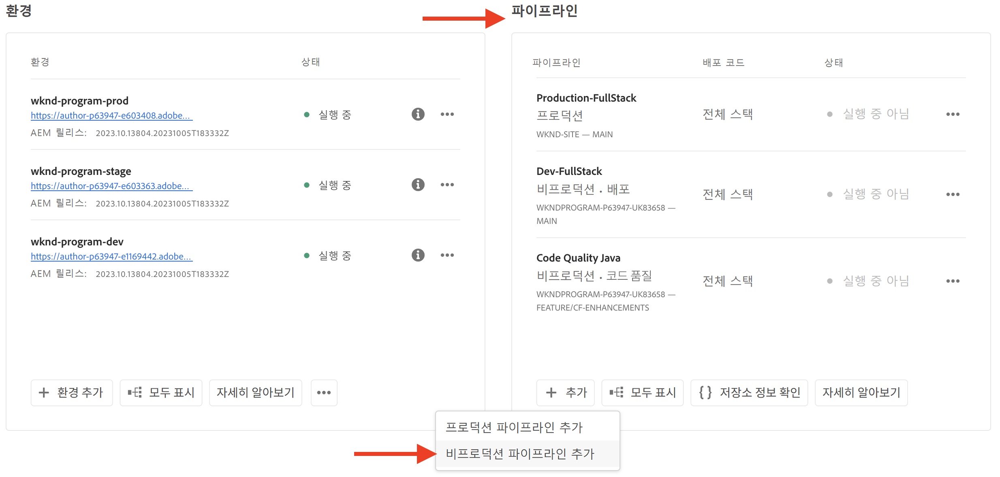
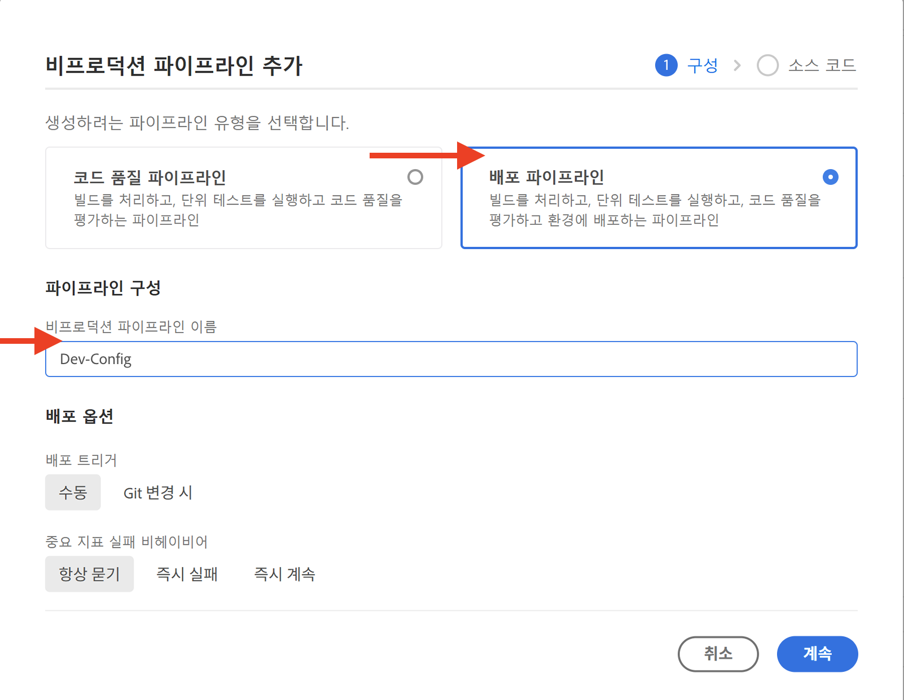
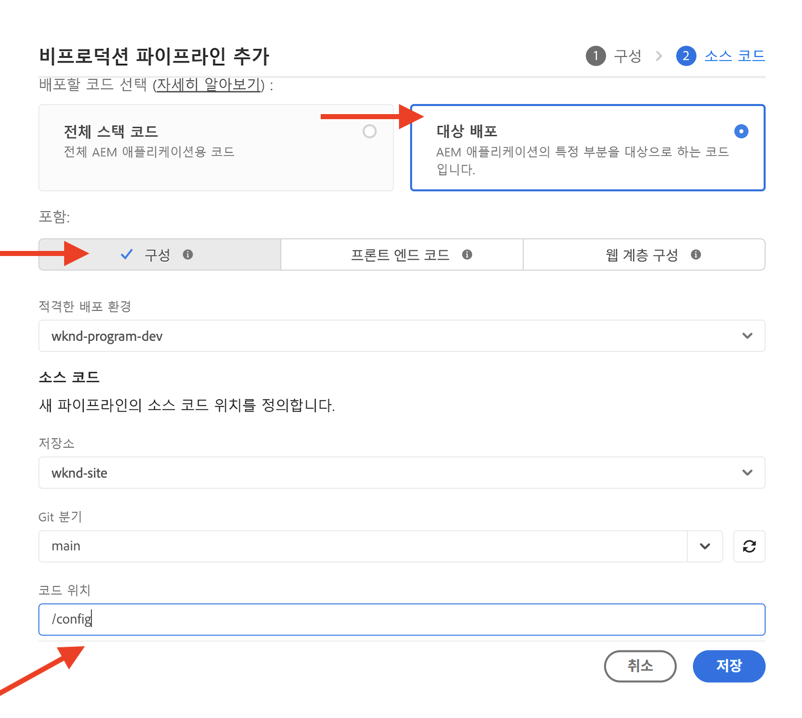

# WAF 규칙을 포함한 트래픽 필터 규칙을 설정하는 방법

WAF 규칙을 포함하여 **트래픽 필터 규칙을 설정하는 방법**&#x200B;을 알아보세요. 결과 생성, 배포, 테스트 및 분석에 대해 알아보십시오.

>[!VIDEO](https://video.tv.adobe.com/v/3425407?quality=12&learn=on)

## 설정

설정 프로세스에는 다음이 포함됩니다.

- 적절한 AEM 프로젝트 구조 및 구성 파일을 사용하여 _규칙을 만드는 중_.
- Adobe Cloud Manager의 구성 파이프라인을 사용하여 _규칙을 배포_.
- 트래픽을 생성하기 위해 다양한 도구를 사용하여 _규칙 테스트_.
- AEMCS CDN 로그 및 대시보드 도구를 사용하여 _결과 분석_.

### AEM 프로젝트에서 규칙 만들기

규칙을 만들려면 다음 단계를 수행합니다.

1. AEM 프로젝트의 최상위 수준에서 `config` 폴더를 만듭니다.

1. `config` 폴더 내에서 이름이 `cdn.yaml`인 새 파일을 만듭니다.

1. `cdn.yaml` 파일에 다음 메타데이터를 추가합니다.

```yaml
kind: CDN
version: '1'
metadata:
  envTypes:
    - dev
    - stage
    - prod
data:
  trafficFilters:
    rules:
```

AEM Guides WKND Sites 프로젝트 내에서 `cdn.yaml` 파일의 예를 참조하십시오.

{width="800" zoomable="yes"}

### Cloud Manager을 통해 규칙 배포 {#deploy-rules-through-cloud-manager}

규칙을 배포하려면 다음 단계를 수행합니다.

1. [my.cloudmanager.adobe.com](https://my.cloudmanager.adobe.com/)에서 Cloud Manager에 로그인한 다음 적절한 조직과 프로그램을 선택합니다.

1. _프로그램 개요_ 페이지에서 _파이프라인_ 카드로 이동한 다음 **+추가** 단추를 클릭하고 원하는 파이프라인 유형을 선택합니다.

   

   위의 예에서는 개발 환경이 사용되므로 데모 목적으로 _비프로덕션 파이프라인 추가_&#x200B;가 선택됩니다.

1. _비프로덕션 파이프라인 추가_ 대화 상자에서 다음 세부 정보를 선택하고 입력합니다.

   1. 구성 단계:

      - **유형**: 배포 파이프라인
      - **파이프라인 이름**: Dev-Config

      

   2. Source 코드 단계:

      - **배포할 코드**: 타깃팅된 배포
      - **포함**: 구성
      - **배포 환경**: 환경 이름(예: wknd-program-dev)입니다.
      - **저장소**: 파이프라인이 코드를 검색해야 하는 Git 저장소입니다(예: `wknd-site`).
      - **Git 분기**: Git 저장소 분기의 이름입니다.
      - **코드 위치**: `/config`, 이전 단계에서 만든 최상위 구성 폴더에 해당합니다.

      

### 트래픽을 생성하여 규칙 테스트

규칙을 테스트하기 위해 사용할 수 있는 다양한 타사 도구가 있으며 조직에 선호하는 도구가 있을 수 있습니다. 데모 목적으로 다음 도구를 사용해 보겠습니다.

- URL 호출 및 응답 코드 확인과 같은 기본 테스트를 위해 [Curl](https://curl.se/)을(를) 만듭니다.

- DOS(서비스 거부)를 수행하려면 [Vegeta](https://github.com/tsenart/vegeta)하십시오. [Vegeta GitHub](https://github.com/tsenart/vegeta#install)의 설치 지침을 따르십시오.

- XSS, SQL 주입 등과 같은 잠재적인 문제 및 보안 취약점을 찾기 위해 [Nikto](https://github.com/sullo/nikto/wiki). [Nikto GitHub](https://github.com/sullo/nikto)의 설치 지침을 따르십시오.

- 아래 명령을 실행하여 터미널에 도구가 설치되어 있고 사용할 수 있는지 확인하십시오.

  ```shell
  # Curl version check
  $ curl --version
  
  # Vegeta version check
  $ vegeta -version
  
  # Nikto version check
  $ cd <PATH-OF-CLONED-REPO>/program
  ./nikto.pl -Version
  ```

### 대시보드 도구를 사용하여 결과 분석

규칙을 만들고, 배포하고, 테스트한 후 **CDN** 로그와 **AEMCS-CDN-Log-Analysis-Tooling**&#x200B;을(를) 사용하여 결과를 분석할 수 있습니다. 이 툴은 Splunk 및 ELK(Elasticsearch, Logstash 및 Kibana) 스택의 결과를 시각화하기 위한 대시보드 세트를 제공합니다.

[AEMCS-CDN-Log-Analysis-Tooling](https://github.com/adobe/AEMCS-CDN-Log-Analysis-Tooling) GitHub 리포지토리에서 도구를 복제할 수 있습니다. 그런 다음 지침에 따라 선호하는 가시성 도구에 대해 **CDN 트래픽 대시보드** 및 **WAF 대시보드** 대시보드를 설치하고 로드합니다.

이 자습서에서는 ELK 스택을 사용하겠습니다. AEMCS CDN 로그 분석에 대한 [ELK Docker 컨테이너](https://github.com/adobe/AEMCS-CDN-Log-Analysis-Tooling/blob/main/ELK/README.md) 지침에 따라 ELK 스택을 설정합니다.

- 샘플 대시보드를 로드한 후 Elastic Dashboard Tool 페이지는 다음과 같이 표시되어야 합니다.

  

>[!NOTE]
>
>    아직 수집된 AEMCS CDN 로그가 없으므로 대시보드가 비어 있습니다.


## 다음 단계

AEM WKND Sites 프로젝트를 사용하여 [예 및 결과 분석](./examples-and-analysis.md) 장에서 WAF 규칙을 포함한 트래픽 필터 규칙을 선언하는 방법을 알아봅니다.
