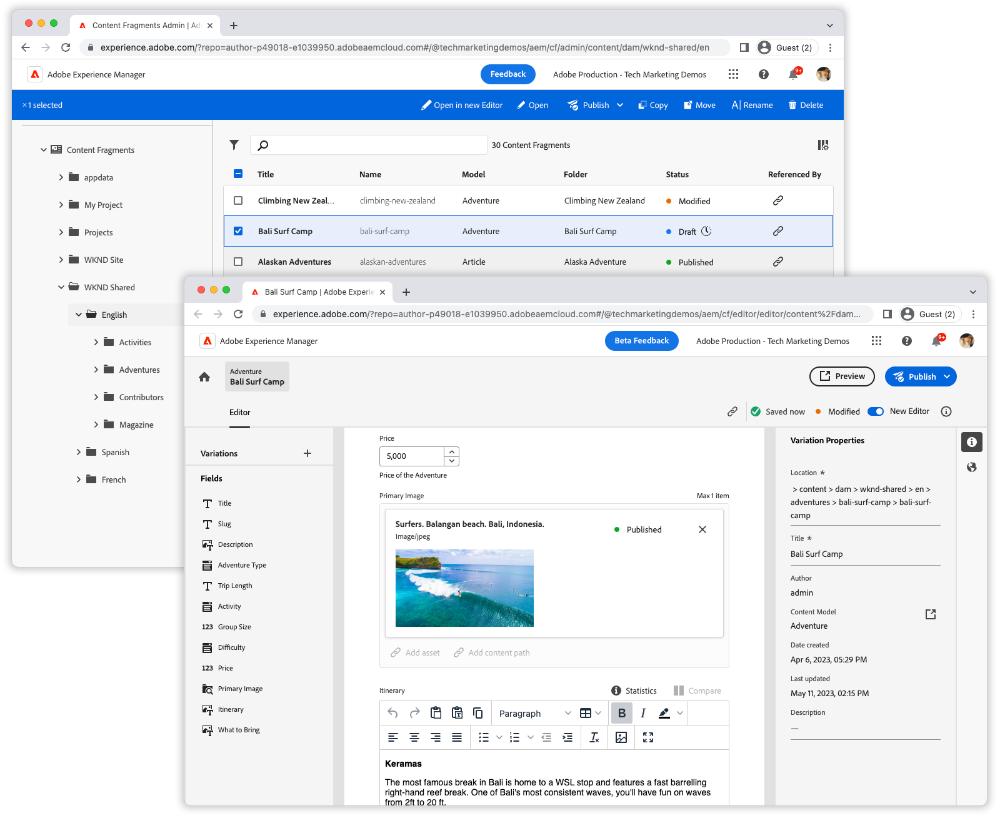

# 컨텐츠 조각 콘솔 비디오

Adobe Experience Manager의 컨텐츠 조각 콘솔을 사용하면 컨텐츠 조각을 쉽게 관리하고 작성할 수 있습니다. 이러한 비디오로 컨텐츠 조각 콘솔을 최대한 활용하는 방법을 살펴볼 수 있습니다.

를 검토합니다. [설명서](https://experienceleague.adobe.com/docs/experience-manager-cloud-service/content/sites/administering/content-fragments/content-fragments-console.html)  컨텐츠 조각 콘솔 및 해당 기능에 대한 전체 세부 사항을 확인하십시오.

## 비디오

    <!-- Overview -->
    

      

        

          <figure class="image is-16by9">
            
          </figure>
        

        

          

            
5분

            

              <a href="./basics/content-fragments-console.md" title="개요">개요</a>
            

            
컨텐츠 조각 콘솔에 대한 간략한 개요.

            <a href="./basics/content-fragments-console.md" class="spectrum-Button
              spectrum-Button--outline spectrum-Button--primary
              spectrum-Button--sizeM">
              비디오 보기
            </a>
          

        

      

    

    <!-- Fast filtering -->
    

      

        

          <figure class="image is-16by9">
            
          </figure>
        

        

          

            
1분

            

              <a href="./search/fast-filtering.md" title="빠른 필터링">빠른 필터링</a>
            

            
인라인 필터링을 사용하여 컨텐츠 조각을 신속하게 찾습니다.

            <a href="./search/fast-filtering.md" class="spectrum-Button
              spectrum-Button--outline spectrum-Button--primary
              spectrum-Button--sizeM">
              비디오 보기
            </a>
          

        

      

    

    <!-- New Editor toggle -->
    

      

        

          <figure class="image is-16by9">
            
          </figure>
        

        

          

            
1분

            

              <a href="./editor/new-editor-toggle.md" title="새 편집기 전환">새 편집기 전환</a>
            

            
클래식 편집기에서 새 편집기로 원활하게 전환.

            <a href="./editor/new-editor-toggle.md" class="spectrum-Button
              spectrum-Button--outline spectrum-Button--primary
              spectrum-Button--sizeM">
              비디오 보기
            </a>
          

        

      

    

    <!-- Non-asset content references --->
    

      

        

          <figure class="image is-16by9">
            
          </figure>
        

        

          

            
1분

            

              <a href="./editor/non-asset-content-references.md" title="Non-asset
                content references">비자산 컨텐츠 참조</a>
            

            
경험 조각 및 페이지를 컨텐츠 조각에 통합합니다.

            <a href="./editor/non-asset-content-references.md"
              class="spectrum-Button spectrum-Button--outline
              spectrum-Button--primary spectrum-Button--sizeM">
              비디오 보기
            </a>
          

        

      

    

    <!-- RTE variant compare -->
    

      

        

          <figure class="image is-16by9">
            
          </figure>
        

        

          

            
1분

            

              <a href="./editor/rte-variant-compare.md" title="RTE variant
                compare">RTE 변형 비교</a>
            

            
다양한 채널에서 리치 텍스트 컨텐츠를 쉽게 정렬할 수 있습니다.

            <a href="./editor/rte-variant-compare.md" class="spectrum-Button
              spectrum-Button--outline spectrum-Button--primary
              spectrum-Button--sizeM">
              비디오 보기
            </a>
          

        

      

    

    <!-- Language copies -->
    

      

        

          <figure class="image is-16by9">
            
          </figure>
        

        

          

            
1분

            

              <a href="./editor/language-copies.md" title="언어 사본">언어 복사</a>
            

            
컨텐츠 조각 언어 사본을 쉽게 관리

            <a href="./editor/language-copies.md" class="spectrum-Button
              spectrum-Button--outline spectrum-Button--primary
              spectrum-Button--sizeM">
              비디오 보기
            </a>
          

        

      

    

  

