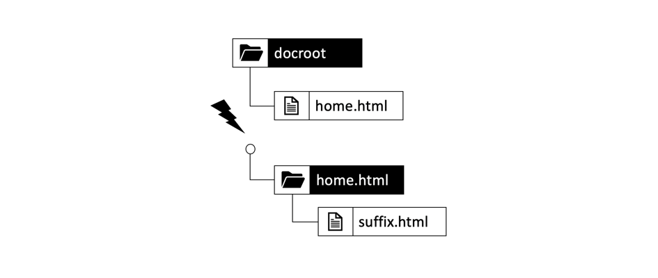
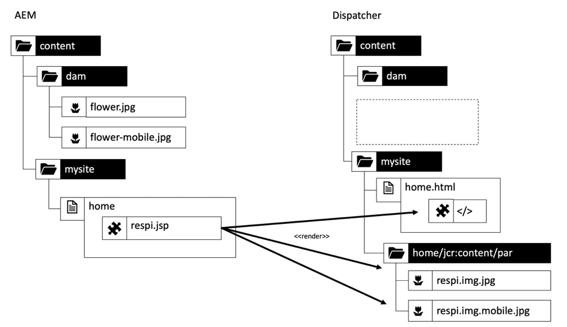

# 1장 - 발송자 개념, 패턴 및 안티패턴

## 개요

이 장에서는 Dispatcher의 역사와 구조에 대한 간략한 소개 내용을 제공하고 AEM 개발자가 구성 요소를 디자인하는 방식에 미치는 영향에 대해 설명합니다.

## 개발자가 인프라에 관심을 가져야 하는 이유

모든 AEM 설치가 아닌 경우 Dispatcher는 대부분의 필수 요소입니다. 다양한 온라인 문서에서 Dispatcher 구성 방법, 팁 및 기법을 찾아볼 수 있습니다.

이러한 정보 조각과 조각은 항상 매우 전문적인 수준에서 시작됩니다. - 사용자가 원하는 작업을 이미 알고 있으며 따라서 원하는 것을 얻는 방법에 대한 세부 정보만 제공한다고 가정할 경우 디스패처를 사용하여 할 수 있는 것과 할 수 없는 것에 대해 _무엇이 무엇이고 왜 s_&#x200B;인지 설명하는 개념 논문을 찾지 못했습니다.

### 항패턴:Dispatcher - Afterthink

이러한 기본적인 정보의 부족은 많은 반패턴을 초래한다. 우리는 많은 AEM 프로젝트에서 보아왔다.

1. Dispatcher가 Apache 웹 서버에 설치되면 프로젝트에서 &quot;Unix Gods&quot;를 사용하여 구성합니다. &#39;인간적 자바 개발자&#39;는 그것을 신경 쓸 필요가 없다.

2. Java 개발자는 코드가 작동하는지 확인해야 합니다. 나중에 디스패처가 마술처럼 빠르게 만들 것입니다. 디스패처는 항상 때늦은 생각이다. 그러나 이것은 효과가 없습니다. 개발자는 디스패처를 염두에 두고 자신의 코드를 설계해야 합니다. 그리고 그는 그것을 하기 위해 그것의 기본 개념을 알아야 합니다.

### &quot;먼저 작동하게 하고 빠르게 만들어&quot; 항상 옳지는 않음

여러분은 프로그래밍 조언 _&quot;먼저 작동하게 한 다음 빨리 만들어 주세요.&quot;를 들었을지도 모릅니다._. 완전히 틀린 것은 아니다. 그러나 올바른 컨텍스트가 없으면 잘못 해석되고 올바로 적용되지 않는 경향이 있습니다.

이러한 권고 사항은 개발자가 너무 빨리 코드를 최적화하지 못하도록 해야 하며, 이러한 코드는 실행되지 않거나 거의 실행되지 않으므로 최적화가 최적화에 투입되는 노력을 정당화하기에 충분한 영향을 주지 않습니다. 또한 최적화를 통해 더 복잡한 코드가 생성되어 버그가 발생할 수 있습니다. 따라서 개발자는 각 단일 코드 줄을 미시적으로 최적화하는 데 많은 시간을 허비하지 않아도 됩니다. 적합한 데이터 구조, 알고리즘 및 라이브러리를 선택했는지 확인하고 프로파일러의 핫스팟 분석을 통해 최적화를 통해 전반적인 성능을 향상시킬 수 있는 상황을 확인할 수 있습니다.

### 건축결정 및 가공물

하지만 &quot;우선 성공하고 빠르게 만들어라&quot; 는 조언은 &quot;건축&quot; 결정에 있어서 완전히 잘못된 것이다. 건축적 결정이란? 간단히 말해서, 그것들은 비싸고, 어렵거나, 또는 나중에 바꿀 수 없는 결정들이다. &quot;비싼&quot;은 &quot;불가능하&quot;와 같다는 것을 명심해라.  예를 들어 프로젝트가 예산이 부족한 경우 값비싼 변경 사항을 구현할 수 없습니다. 사회 기반 시설 변화는 대부분 사람들의 마음에 떠오르는 그 분야에서 가장 첫 번째 종류의 변화입니다. 하지만 또한 변화하기 매우 험악해질 수 있는 다른 종류의 &quot;건축&quot; 유물들이 있다:

1. 애플리케이션의 &quot;중심&quot;에 있는 코드 조각이며 다른 많은 부분이 사용하고 있습니다. 이를 변경하려면 모든 종속성을 한 번에 변경하고 다시 테스트해야 합니다.

2. 객체(일부 비동기, 시간 종속 시나리오)에서 입력의 위치에 따라 시스템 동작이 매우 임의로 다를 수 있습니다. 변화는 예측할 수 없는 효과를 가질 수 있고 테스트하기도 어려울 수 있습니다.

3. 시스템의 모든 부분과 일부에서 반복해서 사용되고 재사용되는 소프트웨어 패턴입니다. 소프트웨어 패턴이 최적이 아닌 것으로 밝혀지면 패턴을 사용하는 모든 객체를 다시 코딩해야 합니다.

기억? 이 페이지 상단에서 Dispatcher는 AEM 애플리케이션의 필수 구성 요소라고 설명했습니다. 웹 애플리케이션에 대한 액세스는 매우 무작위적인 것으로, 사용자는 예측할 수 없는 상황에 몰려 있습니다. 마지막으로 모든 컨텐츠는 디스패처에 캐시됩니다(또는 그래야 함). 따라서 집중을 했다면 캐싱은 &quot;건축&quot; 유물로 보여질 수 있으므로 팀 구성원, 개발자, 관리자 모두 이해해야 한다는 것을 알게 되었을 것입니다.

개발자가 실제로 디스패처를 구성해야 한다고 말하는 것은 아닙니다. 따라서 Dispatcher에서도 자신의 코드를 활용할 수 있도록 개념과 특히 경계를 알아야 합니다.

디스패처는 코드 속도를 마술처럼 향상시키지 않습니다. 개발자는 Dispatcher를 염두에 두고 자신의 구성 요소를 만들어야 합니다. 따라서 어떻게 작동하는지를 알 필요가 있다.

## 발송자 캐싱 - 기본 원칙

### Dispatcher as Caching Http - 로드 밸런서

디스패처가 무엇이며, 처음부터 &quot;디스패처&quot;라고 불리는 이유는?

디스패처는

* 캐시

* 역방향 프록시

* Apache httpd 웹 서버용 모듈로, Apache의 다용성에 AEM 관련 기능을 추가하고, 기타 모든 Apache 모듈(예: SSL 또는 SSI도 추후 보듯이 포함)과 원활하게 작동합니다.

웹 초기에는 수백 명의 방문자가 사이트를 방문할 것으로 예상됩니다. 하나의 Dispatcher 설정, 여러 AEM 게시 서버에 대한 요청 부하를 &quot;전달&quot; 또는 균형 있게 조정하며 일반적으로 충분했습니다. 따라서 &quot;발송자&quot; 이름입니다. 하지만 요즘은 이런 설정이 더 이상 자주 사용되지 않습니다.

본 문서의 후반부에 있는 다양한 방법으로 디스패처 및 게시 시스템을 설정할 수 있습니다. 먼저 http 캐싱 기본 사항을 살펴보겠습니다.


*Dispatcher 캐시의 기본 기능*

<br> 

디스패처의 기본 사항은 여기에서 설명합니다. 디스패처는 HTTP 요청을 받고 만드는 기능을 갖춘 단순 캐싱 역방향 프록시입니다. 일반적인 요청/응답 주기는 다음과 같습니다.

1. 사용자가 페이지를 요청합니다.
2. Dispatcher는 해당 페이지의 렌더링된 버전이 이미 있는지 확인합니다. 이 페이지에 대한 첫 번째 요청이고 Dispatcher가 로컬 캐시된 사본을 찾을 수 없다고 가정합니다.
3. 디스패처가 게시 시스템에서 페이지를 요청합니다
4. 게시 시스템에서 페이지는 JSP 또는 HTL 템플릿으로 렌더링됩니다
5. 페이지가 Dispatcher로 반환됩니다.
6. 디스패처가 페이지를 캐시합니다.
7. Dispatcher가 페이지를 브라우저에 반환합니다.
8. 동일한 페이지가 두 번째로 요청되는 경우 게시 인스턴스에서 다시 렌더링하지 않고도 Dispatcher 캐시에서 직접 해당 페이지를 제공할 수 있습니다. 이렇게 하면 게시 인스턴스의 사용자 및 CPU 사이클에 대한 대기 시간이 절약됩니다.

마지막 섹션의 &quot;페이지&quot;에 대해 이야기하고 있었습니다. 그러나 동일한 구성표는 이미지, CSS 파일, PDF 다운로드 등과 같은 다른 리소스에도 적용됩니다.

#### 데이터가 캐시되는 방식

Dispatcher 모듈은 Apache 서버가 제공하는 시설을 활용합니다. HTML-페이지, 다운로드 및 사진과 같은 리소스는 Apache 파일 시스템에서 간단한 파일로 저장됩니다. 간단합니다.

파일 이름은 요청된 리소스의 URL에 의해 파생됩니다. `/foo/bar.html` 파일을 요청하면 이 파일은 /`var/cache/docroot/foo/bar.html` 아래에 저장됩니다.

원칙적으로 모든 파일이 캐싱되어 디스패처에 정적으로 저장되는 경우 게시 시스템의 플러그인을 가져올 수 있으며 디스패처는 간단한 웹 서버 역할을 합니다. 그러나 이것은 그 원칙을 설명하기 위한 것이다. 실제 생활은 더 복잡합니다. 렌더링 프로세스의 동적 특성으로 인해 리소스 수가 무한할 수 있으므로 모든 것을 캐싱할 수 없으며 캐시는 절대 &quot;꽉 찬&quot; 상태가 아닙니다. 정적 파일 시스템 모델은 발송자의 기능에 대한 대략적인 그림을 생성하는 데 도움이 됩니다. 그리고 디스패처의 한계를 설명하는 데 도움이 됩니다.

#### AEM URL 구조 및 파일 시스템 매핑

Dispatcher를 보다 자세히 이해하려면 간단한 샘플 URL의 구조를 다시 방문하면 됩니다.  아래 예를 살펴보겠습니다.

`http://domain.com/path/to/resource/pagename.selectors.html/path/suffix.ext?parameter=value&amp;otherparameter=value#fragment`

* `http` 프로토콜

* `domain.com` 은 도메인 이름입니다.

* `path/to/resource` 는 리소스가 CRX에 저장되어 다음에 Apache 서버의 파일 시스템에 저장되는 경로입니다.

여기서 AEM 파일 시스템과 Apache 파일 시스템 사이에는 약간 차이가 있습니다.

AEM,

* `pagename` 리소스 레이블임

* `selectors` 은 리소스를 렌더링하는 방법을 결정하기 위해 Sling에서 사용되는 여러 선택기를 의미합니다. URL에는 임의 개수의 선택기가 있을 수 있습니다. 그것들은 마침표로 분리되어 있다. 예를 들어 선택기 섹션은 &quot;french.mobile.fancy&quot;와 같은 것일 수 있습니다. 선택기에는 문자, 숫자 및 대시만 포함되어야 합니다.

* `html` &quot;선택기&quot;의 마지막 부분으로 확장이라고 합니다. AEM/Sling에서도 렌더링 스크립트를 일부 결정합니다.

* `path/suffix.ext` 은 URL에 접미사를 사용할 수 있는 경로 같은 표현식입니다.  이 플러그인을 AEM 스크립트에서 사용하여 리소스가 렌더링되는 방식을 추가로 제어할 수 있습니다. 이 부분에 대한 모든 부분이 나중에 나올 예정입니다 현재로서는 추가 매개 변수로 사용할 수 있음을 알면 충분합니다. 접미사는 확장자가 있어야 합니다.

* `?parameter=value&otherparameter=value` 는 URL의 쿼리 섹션입니다. 임의의 매개 변수를 AEM에 전달하는 데 사용됩니다. 매개 변수가 있는 URL은 캐싱할 수 없으므로 매개 변수가 절대적으로 필요한 경우에만 매개 변수가 제한됩니다.

* `#fragment`, URL의 조각 부분은 AEM에 전달되지 않으며, 이 부분은 브라우저에서만 사용됩니다.JavaScript 프레임워크에서 &quot;라우팅 매개 변수&quot;로 표시하거나 페이지의 특정 부분으로 이동할 수 있습니다.

Apache(*아래 다이어그램* 참조)에서

* `pagename.selectors.html` 는 캐시의 파일 시스템에서 파일 이름으로 사용됩니다.

URL에 접미사 `path/suffix.ext`이 있는 경우,

* `pagename.selectors.html` 는 폴더로 생성됩니다.

* `path` 폴더의  `pagename.selectors.html` 폴더

* `suffix.ext` 는  `path` 폴더에 있는 파일입니다. 참고:접미사에 확장자가 없으면 파일이 캐시되지 않습니다.


*Dispatcher에서 URL을 가져온 후 파일 시스템 레이아웃*

<br> 

#### 기본 제한 사항

URL, 리소스와 파일 이름 간의 매핑은 매우 간단합니다.

하지만 약간의 덫을 발견했을지 몰라도

1. URL이 매우 길어질 수 있습니다. 로컬 파일 시스템에 `/docroot`의 &quot;path&quot; 부분을 추가하면 일부 파일 시스템의 제한을 쉽게 초과할 수 있습니다. Windows에서 NTFS로 Dispatcher를 실행하면 문제가 될 수 있습니다. 그러나 리눅스는 안전하다.

2. URL에는 특수 문자와 움라우트가 포함될 수 있습니다. 이는 일반적으로 디스패처에 문제가 되지 않습니다. 그러나 URL은 애플리케이션의 여러 위치에서 해석된다는 점을 염두에 두십시오. 자주 볼 때 특수 문자에서 드물게 사용되는(사용자 지정) 코드 중 하나가 철저하게 테스트되지 않았다는 사실을 알기 위해 애플리케이션의 이상한 비헤이비어가 발견되었습니다. 할 수 있다면 피해야 한다. 그렇지 않다면 철저한 테스트를 계획해 보십시오.

3. CRX에서는 리소스에 하위 리소스가 있습니다. 예를 들어 페이지에 여러 개의 하위 페이지가 있습니다. 파일 시스템에 파일 또는 폴더가 있으므로 파일 시스템에서 이 파일을 일치시킬 수 없습니다.

#### 확장 기능이 없는 URL은 캐시되지 않습니다.

URL은 항상 확장자가 있어야 합니다. AEM에서 익스텐션 없이 URL을 제공할 수 있습니다. 이러한 URL은 디스패처에 캐시되지 않습니다.

**예**

`http://domain.com/home.html` 을(를)  **취소할 수 있음**

`http://domain.com/home` 액세스할 수  **없습니다.**

URL에 접미사가 포함되어 있을 때에도 동일한 규칙이 적용됩니다. 접미사를 사용하려면 확장자가 있어야 합니다.

**예**

`http://domain.com/home.html/path/suffix.html` 을(를)  **취소할 수 있음**

`http://domain.com/home.html/path/suffix` 액세스할 수  **없습니다.**

리소스 부품에 확장자가 없지만 접미사가 있다면 어떻게 될까요? 음, 이 경우 URL은 전혀 접미어가 없습니다. 다음 예를 보십시오.

**예**

`http://domain.com/home/path/suffix.ext`

`/home/path/suffix`은 리소스의 경로이므로 URL에 접미사가 없습니다.

**결론**

항상 패스와 접미어 모두에 확장자를 추가합니다. SEO를 알고 있는 사람들은 이것이 검색 결과에서 여러분을 순위를 매기고 있다고 말한다. 그러나 페이지가 닫히지 않으면 속도가 너무 느려지고 순위가 더 내려간다.

#### 충돌하는 접미사 URL

두 개의 유효한 URL이 있다고 가정합니다.

`http://domain.com/home.html`

및

`http://domain.com/home.html/suffix.html`

AEM에서는 절대적으로 유효하다. 로컬 개발 컴퓨터에서는 Dispatcher가 없으면 문제가 발생하지 않습니다. UAT 또는 로드 테스트에서도 문제가 발생하지 않을 가능성이 높습니다. 우리가 직면하고 있는 문제는 너무 미세해서 대부분의 시험을 통과한다.  가장 많은 시간에 사용자에게 타격을 입힐 수 있으며, 이를 해결할 시간에 제한을 받게 되며, 서버 액세스 권한이 없거나 수정할 리소스가 없을 수 있습니다. 우리는 그곳에..

그래서.. 뭐가 문제죠?

`home.html` 파일 시스템에서 파일 또는 폴더일 수 있습니다. AEM에서와 같이 동시에 둘 다 아닙니다.

`home.html`을 먼저 요청하면 파일로 만들어집니다.

`home.html/suffix.html`에 대한 후속 요청은 올바른 결과를 반환하지만 파일 시스템(`home.html` &quot;blocks&quot; 파일)의 위치에 대해 `home.html`을(를) 폴더로 두 번째로 만들 수 없으므로 `home.html/suffix.html`이 캐시되지 않습니다.



*파일 시스템의 파일 차단 위치에 하위 리소스가 캐시되지 않음*

<br> 

반대로 회전합니다. 먼저 `home.html/suffix.html`을 요청하는 경우 `suffix.html`은 처음에 `/home.html` 폴더 아래에 캐시됩니다. 그러나 나중에 리소스로 `home.html`을 요청할 때 이 폴더는 삭제되고 `home.html` 파일로 대체됩니다.


*상위 항목을 리소스로 가져오는 경우 경로 구조 삭제*

<br> 

따라서 캐시된 결과의 데이터는 들어오는 요청의 순서에 따라 완전히 무작위적으로 결정됩니다. 문제는 발송자가 한 명 이상이라는 점이다. 또한 성능, 캐시 적중 및 동작은 한 디스패처와 다른 방식으로 다를 수 있습니다. 웹 사이트에서 응답이 없는 이유를 알고 싶으면 잘못된 캐싱 순서와 함께 올바른 발송자를 보고 있어야 합니다. 만약 당신이 우연히 디스패처를 보고 있다면 - 더 호의적인 요청 패턴이 있다면, 당신은 문제를 찾으려고 노력하는데 길을 잃게 될 것이다.

#### URL 충돌 방지

접미어가 붙은 경우 리소스에 대해 다른 확장명을 사용하는 경우 폴더 이름과 파일 이름이 파일 시스템의 동일한 경로에 대해 &quot;competitive&quot;인 &quot;URL 충돌&quot;을 방지할 수 있습니다.

**예**

* `http://domain.com/home.html`

* `http://domain.com/home.dir/suffix.html`

둘 다 완벽하게 취소될 수 있고


접미사를 요청하거나 접미사를 모두 사용하지 않을 때 리소스에 대한 전용 확장 &quot;dir&quot;을 선택합니다. 유용할 경우는 드물다. 이러한 사례를 정확하게 구현하기가 쉽습니다.  다음 장에서는 캐시 무효화와 플러싱에 대해 설명합니다.

#### 취소할 수 없는 요청

마지막 장에 대한 빠른 요약과 몇 가지 더 많은 예외 사항을 검토해 봅시다. 디스패처는 캐시 가능한 URL로 구성되어 있고 GET 요청인 경우 URL을 캐싱할 수 있습니다. 다음 예외 중 하나로 캐시할 수 없습니다.

**액세스 가능한 요청**

* 요청이 발송자 구성에서 캐시되도록 구성되었습니다.
* 요청이 일반 GET 요청입니다.

**액세스 불가능한 요청 또는 응답**

* 구성에 의해 캐싱이 거부된 요청(경로, 패턴, MIME 유형)
* &quot;발송자:no-cache&quot; 헤더
* &quot;Cache-Control:no-cache|private&quot; 헤더
* &quot;Pragma:no-cache&quot; 헤더
* 쿼리 매개 변수를 사용한 요청
* 확장자가 없는 URL
* 확장자가 없는 접미어의 URL
* 200 이외의 상태 코드를 반환하는 응답
* POST 요청

## 캐시 무효화 및 플러싱

### 개요

마지막 장에서는 Dispatcher가 요청을 캐시할 수 없을 때 많은 수의 예외가 표시되었습니다. 그러나 고려해야 할 것이 더 있습니다.Dispatcher _이 요청을 캐시할 수 있기 때문에 반드시_&#x200B;가&#x200B;_이어야 한다는 의미는 아닙니다._

요점은 다음과 같습니다.캐싱은 대개 쉽습니다. Dispatcher는 응답의 결과를 저장한 다음 동일한 요청이 수신될 때 반환해야 합니다. 오른쪽? 틀렸습니다!

어려운 부분은 캐시의 _무효화_ 또는 _플러싱_&#x200B;입니다. Dispatcher는 리소스가 변경된 시기를 파악하고 다시 렌더링해야 합니다.

이것은 언뜻 보기에 사소한 일로 보인다.. 하지만 그렇지 않다. 또한 하나의 리소스와 여러 리소스가 매우 지능적인 구조를 사용하는 페이지 간의 미묘한 차이점을 살펴볼 수 있습니다.

### 간단한 리소스 및 플러싱

특별한 &quot;thumb&quot; 선택기를 사용하여 요청할 때 각 이미지에 대한 축소판 표현물을 동적으로 만들도록 AEM 시스템을 설정했습니다.

`/content/dam/path/to/image.thumb.png`

그리고 - 물론, 선택기 없는 URL과 함께 원본 이미지를 제공하는 URL을 제공합니다.

`/content/dam/path/to/image.png`

축소판이나 원본 이미지를 모두 다운로드하면

```
/var/cache/dispatcher/docroot/content/dam/path/to/image.thumb.png

/var/cache/dispatcher/docroot/content/dam/path/to/image.png
```

을 참조하십시오.

이제 사용자가 해당 파일의 새 버전을 업로드하고 활성화합니다. 결국 무효화 요청은 AEM에서 발송인,

```
GET /invalidate
invalidate-path:  /content/dam/path/to/image

<no body>
```

무효화는 매우 쉽다.디스패처의 특수 &quot;/invalidate&quot; URL에 대한 간단한 GET 요청. HTTP 본문을 필요로 하지 않으며, &quot;페이로드&quot;는 &quot;invalidate-path&quot; 헤더일 뿐입니다. 헤더의 무효화 경로는 AEM이 알고 있는 리소스이며 Dispatcher가 캐시한 파일이나 파일은 아닙니다. AEM은 리소스만 알고 있습니다. 리소스가 요청되면 런타임 시 확장 기능, 선택기 및 접미어가 사용됩니다. AEM에서는 어떤 선택기가 자원에서 사용되었는지에 대해 부기를 수행하지 않으므로 리소스 경로는 리소스를 활성화할 때 확실히 알 수 있는 모든 정보입니다.

우리의 경우에는 충분합니다. 리소스가 변경된 경우 해당 리소스의 모든 표현도 변경되었다고 생각할 수 있습니다. 이 예에서는 이미지가 변경된 경우 새로운 축소판도 렌더링됩니다.

디스패처가 캐시한 모든 표현물과 함께 리소스를 안전하게 삭제할 수 있습니다. 그런 일을 할 겁니다

`$ rm /content/dam/path/to/image.*`

`image.png` 및 `image.thumb.png` 및 해당 패턴과 일치하는 다른 모든 변환 제거

매우 간단합니다.. 하나의 리소스만 요청에 응답하는 한

### 참조 및 메쉬드 컨텐츠

#### 메쉬드 컨텐츠 문제

AEM에 업로드된 이미지 또는 다른 이진 파일과는 달리, HTML 페이지는 독거적이지 않습니다. 그들은 양 떼에서 살고 있으며 하이퍼링크와 참조 자료를 통해 서로 매우 상호 연결되어 있습니다. 간단한 링크는 해롭지 않지만 컨텐츠 참조를 말할 때는 까다롭습니다. 페이지에 있는 유비쿼터스 상단 내비게이션 또는 티저는 컨텐츠 참조입니다.

#### 컨텐츠 참조 및 문제가 되는 이유

간단한 예를 살펴보겠습니다. 여행사에는 캐나다 여행을 홍보하는 웹페이지가 있다. 이 프로모션은 &quot;홈&quot; 페이지와 &quot;겨울 특별 광고&quot; 페이지의 두 개의 다른 페이지의 티저 섹션에 설명되어 있습니다.

두 페이지 모두 동일한 Teaser를 표시하므로 작성자에게 표시해야 하는 각 페이지에 대해 Teaser를 여러 번 만들도록 요청하는 것은 불필요합니다. 대신, 대상 페이지 &quot;캐나다&quot;는 Teaser에 대한 정보를 제공하거나 Teaser를 모두 렌더링하는 URL을 제공하기 위해 페이지 속성의 섹션을 예약합니다.

`<sling:include resource="/content/home/destinations/canada" addSelectors="teaser" />`

또는

`<sling:include resource="/content/home/destinations/canada/jcr:content/teaser" />`


AEM에서는 매력적으로 작동하지만 게시 인스턴스에서 Dispatcher를 사용하면 이상한 일이 발생합니다.

웹 사이트를 게시했다고 가정해 보십시오. 캐나다 페이지의 제목은 &quot;캐나다&quot;입니다. 방문자가 해당 페이지에 대한 티저 참조가 있는 홈 페이지를 요청하면 &quot;캐나다&quot; 페이지의 구성 요소는 다음과 같은 항목을 렌더링합니다

```
<div class="teaser">
  <h3>Canada</h3>
  
</div>
```

*홈 페이지* 로 이동합니다. 홈 페이지는 Dispatcher가 Teaser를 비롯한 정적 .html 파일로 저장합니다.

이제 마케터는 Teaser 헤드라인이 실행 가능한 것이어야 한다는 사실을 알게 되었습니다. 따라서, 그는 &quot;캐나다&quot;에서 &quot;캐나다 방문&quot;으로 제목을 바꾸고 이미지를 업데이트하기로 합니다.

편집된 &quot;캐나다&quot; 페이지를 게시하고 이전에 게시된 홈 페이지를 수정하여 변경 내용을 확인합니다. 하지만.. 아무것도 변한 게 없어 이전 티저가 계속 표시됩니다. 그는 &quot;겨울 스페셜&quot;을 두 번 확인한다. 이 페이지는 이전에 요청되지 않았으므로 Dispatcher에 자동으로 캐시되지 않습니다. 이 페이지는 게시에서 새로 렌더링되며 이 페이지에는 새로운 &quot;캐나다 방문&quot; 티저가 포함되어 있습니다.


*홈 페이지에 오래된 포함 컨텐츠 저장*

<br> 

무슨 일이야? Dispatcher는 렌더링하는 동안 다른 리소스에서 그린 모든 컨텐츠 및 마크업이 포함된 페이지의 정적 버전을 저장합니다.

파일 시스템 기반의 웹 서버인 Dispatcher는 속도가 빠르지만 비교적 간단합니다. 포함된 리소스가 변경되는 경우 이 사실을 깨닫지 못합니다. 포함 페이지가 렌더링될 때 있었던 컨텐츠가 여전히 클릭됩니다.

&quot;겨울 특별&quot; 페이지는 아직 렌더링되지 않았기 때문에 디스패처에 정적 버전이 없으므로 요청 시 새로 렌더링되므로 새 티저와 함께 표시됩니다.

이러한 리소스가 변경될 때 Dispatcher는 이 리소스를 사용한 모든 페이지를 렌더링하고 플러싱하는 동안 Dispatcher가 접하는 모든 리소스를 추적한다고 생각할 수 있습니다. 그러나 디스패처는 페이지를 렌더링하지 않습니다. 렌더링은 게시 시스템에서 수행됩니다. Dispatcher는 렌더링된 .html 파일에 어떤 리소스가 포함되는지 알지 못합니다.

아직도 확신하지 못합니까? *&quot;종속성 추적&quot;*&#x200B;을(를) 구현하는 방법이 있을 수 있습니다. 음, 또는 더 정확히 *was*&#x200B;이 있습니다. AEM의 대 증조부인 An코뮈니케는 페이지를 렌더링하는 데 사용된 _session_&#x200B;에 구현된 종속성 추적기를 가지고 있었습니다.

요청 중, 이 세션을 통해 얻은 각 리소스는 현재 렌더링되고 있는 URL의 종속으로 추적되었습니다.

그러나 의존 관계를 추적하는 것은 매우 비용이 많이 들었습니다. 사람들은 종속성 추적 기능을 완전히 비활성화하고 하나의 html 페이지가 변경된 후 모든 html 페이지를 다시 렌더링하는 데 의존하면 웹 사이트가 더 빨라진다는 사실을 곧 알게 되었습니다. 게다가, 그 계획은 완벽하지 않았다 - 그 도중에 많은 함정과 예외가 있었다. 일부의 경우, 요청을 가져오기 위해 기본 세션을 사용하지 않고, 요청을 렌더링하기 위해 일부 헬퍼 리소스를 가져오는 관리 세션을 사용했을 수 있습니다. 이러한 종속성은 일반적으로 추적되지 않고 두통과 전화 통화를 통해 캐시를 수동으로 플러시하도록 요청되었습니다. 그들이 그것을 하는 표준 절차를 가졌다면 당신은 운이 좋았다. 그 동안 더 많은 일들이 있었지만... 추억에 잠기지 말자. 2005년으로 돌아갑니다. 결국 이 기능은 기본적으로 An코뮈니케에서 비활성화되었고 후속 CQ5로 다시 전환되지 못하고 AEM으로 전환되지 못했습니다.

### 자동 무효화

#### 전체 플러싱이 종속성 추적보다 더 싼 경우

CQ5 이후 페이지 중 하나만 변경하는 경우 전체 사이트를 무효화하는 데 전적으로 의존합니다. 이 기능을 &quot;자동 무효화&quot;라고 합니다.

하지만 다시 한 번, 수백 개의 페이지를 버리고 다시 렌더링하는 것이 적합한 종속성 추적 및 부분 다시 렌더링을 하는 것보다 더 저렴하다는 것은 어떻게 될까요?

두 가지 주요 이유가 있습니다.

1. 평균 웹 사이트에서는 페이지의 작은 하위 집합만 자주 요청됩니다. 따라서 렌더링된 모든 컨텐츠를 버리더라도 실제로는 수십 개만 즉시 요청됩니다. 페이지의 긴 꼬리 렌더링을 실제로 요청하는 시간에 따라 배포할 수 있습니다. 따라서 실제로 렌더링 페이지의 로드는 생각보다 높지 않습니다. 물론 항상 예외가 있습니다. 나중에 빈 Dispatcher 캐시를 통해 대규모 웹 사이트에서 고르게 배포된 로드를 처리하는 방법을 설명합니다.

2. 모든 페이지는 주 탐색으로 연결됩니다. 따라서 대부분의 페이지는 궁극적으로 서로 종속됩니다. 이는 가장 똑똑한 종속성 추적기라도 우리가 이미 알고 있는 것을 알 수 있다는 것을 의미합니다.페이지 중 하나가 변경되면 다른 모든 페이지를 무효화해야 합니다.

안 믿으세요? 마지막 요점을 설명하겠습니다.

마지막 예제와 동일한 인수를 사용하여 원격 페이지의 컨텐츠를 참조하는 티저가 사용됩니다. 이제는 좀 더 극단적인 예를 사용하고 있습니다.자동으로 렌더링되는 기본 탐색. Teaser에서와 마찬가지로, 내비게이션 제목은 연결된 페이지 또는 &quot;원격&quot; 페이지에서 컨텐츠 참조로 그려집니다. 원격 탐색 제목은 현재 렌더링된 페이지에 저장되지 않습니다. 내비게이션은 웹 사이트의 각 페이지와 모든 페이지에서 렌더링됩니다. 따라서, 한 페이지의 제목은 주 탐색이 있는 모든 페이지에서 반복해서 사용됩니다. 탐색 제목을 변경하려면 해당 페이지를 참조하는 모든 페이지와 각 페이지가 아니라 원격 페이지에서 한 번만 변경하려고 합니다.

따라서 탐색 도구에서 대상 페이지의 &quot;NavTitle&quot;을 사용하여 탐색 도구에서 이름을 렌더링하면 모든 페이지가 함께 탐색됩니다. &quot;아이슬란드&quot;의 내비게이션 제목은 &quot;아이슬란드&quot; 페이지에서 만든 후 주 탐색 영역이 있는 각 페이지로 렌더링됩니다.


*기본 탐색은 &quot;NavTitles&quot;를 당깁니다.*

<br> 

아이슬란드 페이지의 NavTitle을 &quot;Iceland&quot;에서 &quot;Beautiful Iceland&quot;로 변경하면 다른 모든 페이지의 기본 메뉴에서 제목이 즉시 변경됩니다. 따라서 페이지 변경 전에 렌더링되고 캐시되는 페이지는 모두 오래된 상태로 되어 무효화되어야 합니다.

#### 자동 무효화 구현 방법:.stat 파일

이제 수천 개의 페이지가 있는 대규모 사이트가 있다면, 모든 페이지를 반복하고 실제로 삭제하기까지 상당한 시간이 걸릴 것입니다. 이 기간 동안 Dispatcher는 비의도적으로 부실 컨텐츠를 제공할 수 있습니다. 또한 캐시 파일에 액세스하는 동안 일부 충돌이 발생할 수 있으며, 페이지가 삭제되는 동안 페이지가 요청되거나, 즉시 다음 활성화 이후 발생한 두 번째 무효화로 페이지가 다시 삭제될 수도 있습니다. 무엇이 엉망인지 생각해 보세요. 다행히 이런 일은 일어나지 않는다. 디스패처는 이를 피하기 위해 영리한 방법을 사용합니다.수백 수천 개의 파일을 삭제하는 대신 파일이 게시되면 파일 시스템의 루트에 빈 단순 파일을 배치하므로 모든 종속 파일이 잘못된 것으로 간주됩니다. 이 파일을 &quot;상태 파일&quot;이라고 합니다. statefile은 비어 있습니다. 상태 파일의 생성 날짜만 중요합니다.

생성일이 상태 파일보다 오래된 디스패처의 모든 파일이 마지막 활성화(및 무효화) 전에 렌더링되어 &quot;무효&quot;로 간주됩니다. 파일 시스템에 실제로 존재하지만 Dispatcher는 이를 무시합니다. 그것들은 &quot;진부하다&quot;. 오래된 리소스에 대한 요청이 있을 때마다 Dispatcher는 AEM 시스템에서 페이지를 다시 렌더링하도록 요청합니다. 새로 렌더링된 페이지는 파일 시스템에 저장됩니다. 이제 새 작성 날짜가 있고 다시 새로 만들어집니다.


*.stat 파일의 작성 날짜는 오래된 컨텐츠와 새로 고친 컨텐츠를 정의합니다.*

<br> 

왜 이것이 &quot;.stat&quot;라고 부르는지 질문할 수 있습니다. 그리고 아마도 &quot;무효화&quot;는 아니겠죠? 파일 시스템에 이 파일을 저장한다면 Dispatcher가 정적 웹 서버에서와 같이 *정적으로*&#x200B;서비스를 제공할 수 있는 리소스를 결정하는 데 도움이 됩니다. 이러한 파일을 더 이상 동적으로 렌더링할 필요가 없습니다.

그러나 &#39;순수한 이름&#39;은 은유적이지 않다. 이 값은 파일 수정 시간(다른 속성 포함)을 반환하는 Unix 시스템 호출 `stat()`에서 파생됩니다.

#### 단순 및 자동 유효성 검사 혼합

하지만 잠깐.. 우리가 말했듯이, 하나의 자원이 물리적으로 삭제된다고 이제 보다 최근의 스타트파일은 Dispatcher의 눈에 거의 유효하지 않게 렌더링됩니다. 그렇다면, 먼저 물리적 삭제는 무엇일까요?

답은 간단하다. 일반적으로 두 가지 전략을 동시에 사용하지만 서로 다른 종류의 리소스에서 사용합니다. 이미지와 같은 이진 자산은 자체 포함됩니다. 따라서 정보를 렌더링해야 한다는 의미에서 다른 리소스와 연결되지 않습니다.

반면에 HTML 페이지는 상호 의존적입니다. 그러면 자동 무효화를 적용할 수 있습니다. Dispatcher의 기본 설정입니다. 무효화된 리소스에 속하는 모든 파일은 물리적으로 삭제됩니다. 또한 &quot;.html&quot;로 끝나는 파일은 자동으로 무효화됩니다.

Dispatcher는 파일 확장명에 대해 자동 무효화 체계를 적용할지 여부를 결정합니다.

자동 무효화에 대한 파일 끝을 구성할 수 있습니다. 이론적으로 자동 무효화에 대한 모든 확장을 포함할 수 있습니다. 그러나 이것은 매우 높은 가격이라는 것을 명심하십시오. 과하게 제공된 부실 리소스가 표시되지 않지만, 과잉 무효화로 인해 배달 성능이 크게 저하됩니다.

예를 들어 PNG 및 JPG가 동적으로 렌더링되고 다른 리소스에 따라 렌더링되는 체계를 구현한다고 가정해 보십시오. 고해상도 이미지의 크기를 더 작은 웹 호환 해상도로 재조정할 수 있습니다. 현재 상태에서는 압축 속도도 변경됩니다. 이 예제의 해상도 및 압축률은 고정된 상수가 아니지만 이미지를 사용하는 구성 요소에서 구성 가능한 매개 변수입니다. 이제 이 매개 변수가 변경되면 이미지를 무효화해야 합니다.

문제 없습니다. 자동 무효화에 이미지를 추가하고 변경 사항이 있을 때마다 항상 새로 렌더링된 이미지를 만들 수 있다는 사실을 방금 알았습니다.

#### 목욕물과 함께 아기 버려라

맞아, 그리고 그것은 큰 문제이다. 마지막 단락을 다시 읽어 보십시오. &quot;변경 사항이 있을 때마다 새로 렌더링된 이미지&quot; 아시다시피, 좋은 웹 사이트는 끊임없이 변화합니다.여기에 새 컨텐츠를 추가하고 타자를 수정하고 타자를 다른 곳에서 조정할 수 있습니다. 즉, 모든 이미지가 지속적으로 무효화되므로 다시 렌더링해야 합니다. 그렇게 과소평가하지 마세요 로컬 개발 시스템에서 동적으로 이미지 데이터를 렌더링하고 전송하는 작업은 밀리초 단위로 이루어집니다. 제작 환경에서 100배 더 자주 수행해야 합니다.

이제 HTML 페이지가 변경되거나 HTML 페이지가 변경되면 페이지를 다시 렌더링해야 합니다. 자동 무효화할 파일의 &quot;버킷&quot;은 하나만 있습니다. 전체가 다 빨개진다. 더 자세한 구조물들로 들어갈 방법이 없다.

자동 무효화가 기본적으로 &quot;.html&quot;로 유지되는 데는 합당한 이유가 있습니다. 목표는 그 양동이를 가능한 한 작게 유지하는 것이다. 목욕물로 아기를 버리지 마세요. 모든 것을 다 무효화해서 그냥 안전한 쪽으로 가지세요.

자족자원이 해당 자원의 경로에 제공되어야 한다. 그것은 많은 것을 무효화하는 데 도움이 된다. 단순하게 유지하면서 &quot;/x/y/z&quot;에서 &quot;resource /a/b/c&quot;와 같은 매핑 체계를 만들지 마십시오. 구성 요소를 기본 Dispatcher의 자동 무효화 설정으로 대로 만듭니다. 디스패처의 무효화가 너무 심해서 잘못 디자인된 구성 요소를 복구하려고 하지 마십시오.

##### 자동 무효화에 대한 예외:리소스만 무효화

디스패처에 대한 무효화 요청은 일반적으로 복제 에이전트가 게시 시스템에서 실행합니다.

자신의 종속성에 대해 매우 확신을 갖고 있다면 귀사에서 무효화된 복제 에이전트를 구축할 수 있습니다.

자세한 내용을 살펴보려면 이 가이드의 범위를 조금 벗어나야 하지만 몇 가지 힌트를 제공하고자 합니다.

1. 당신이 뭘 하고 있는지 정말 알고 있어요 무효화를 하는 것은 정말 어렵다. 그래서 자동 무효화가 매우 엄격하다.오래된 콘텐츠를 제공하지 않는

2. 에이전트가 HTTP-header `CQ-Action-Scope: ResourceOnly`을(를) 보내는 경우, 이 단일 무효화 요청이 자동 무효화를 트리거하지 않습니다. 이 ( [https://github.com/cqsupport/webinar-dispatchercache/tree/master/src/refetching-flush-agent/refetch-bundle](https://github.com/cqsupport/webinar-dispatchercache/tree/master/src/refetching-flush-agent/refetch-bundle)) 코드 조각은 자신의 복제 에이전트에 적합한 시작점이 될 수 있습니다.

3. `ResourceOnly`은 자동 무효화만 방지합니다. 실제로 필요한 종속성 해결 및 무효화를 수행하려면 무효화 요청을 직접 트리거해야 합니다. 실제로 이러한 문제가 발생할 수 있는 방법에 대한 영감을 얻을 수 있도록 패키지 Dispatcher 플러시 규칙([https://adobe-consulting-services.github.io/acs-aem-commons/features/dispatcher-flush-rules/index.html](https://adobe-consulting-services.github.io/acs-aem-commons/features/dispatcher-flush-rules/index.html))을 확인할 수 있습니다.

종속성 해결 체계를 빌드하는 것이 권장되지 않습니다. 노력도 많고 얻는 것도 별로 없다. 그리고 전에도 말했듯이, 당신이 틀릴 것은 너무 많다.

오히려, 다른 리소스에 대한 종속성이 없고 자동 무효화 없이 무효화될 수 있는 리소스를 찾아야 합니다. 하지만 해당 문제에 대해 사용자 지정 복제 에이전트를 사용할 필요는 없습니다. Dispatcher 구성에서 이러한 리소스를 자동 무효화에서 제외하는 사용자 지정 규칙을 만들면 됩니다.

주 탐색이나 티저가 종속성의 원천이라고 했습니다. 글쎄요 - 내비게이션 및 티저를 비동기식으로 로드하거나 Apache에서 SSI 스크립트와 함께 포함시키는 경우 추적해야 하는 종속성이 없습니다. 나중에 이 문서에서 &quot;Sling Dynamic Includes&quot;에 대해 언급할 때 구성 요소를 비동기식으로 로드하는 방법에 대해 자세히 설명합니다.

팝업 창이나 lightbox에 로드되는 컨텐츠에도 동일하게 적용됩니다. 이러한 조각에는 탐색(일명 &quot;종속성&quot;)이 거의 없으며 단일 리소스로 무효화할 수 있습니다.

## 발송자를 고려한 구성 요소 구축

### 실제 사례에서 디스패처 기계 적용

마지막 장에서는 Dispatcher의 기본 역학이 어떻게 작동하는지, 일반적으로 어떻게 작동하며 제한 사항이 무엇인지 설명했습니다.

이제 이러한 기술들을 프로젝트의 요구 사항에서 찾을 수 있는 구성 요소 유형에 적용하려고 합니다. 또한 조만간 직면할 문제를 증명하기 위해 구성 요소를 의도적으로 선택합니다. 공포는 아니다 - 모든 구성요소들이 우리가 제시할 그 정도의 고려를 필요로 하지는 않는다. 그러나 그러한 구성 요소를 구축할 필요가 있다면, 결과를 잘 알고 그것들을 처리하는 방법을 알 수 있습니다.

### 스풀링 구성 요소(안티) 패턴

#### 응답형 이미지 구성 요소

서로 연결된 이진 파일이 있는 구성 요소의 공통 패턴(또는 패턴 반대)을 설명하겠습니다. &quot;응답형 이미지&quot;용 구성 요소를 만듭니다. 이 구성 요소는 표시된 이미지를 표시된 장치에 적용할 수 있어야 합니다. 데스크톱 및 태블릿에서는 이미지의 전체 해상도를 보여주며, 작은 크기의 휴대폰에서는 자르기 기능을 사용하거나 완전히 다른 모티프(반응형 환경에서 &quot;아트 디렉션&quot;이라고 함)를 사용합니다.

자산은 AEM의 DAM 영역에 업로드되며 응답형 이미지 구성 요소의 _참조된_&#x200B;만 업로드됩니다.

응답 구성 요소는 마크업의 렌더링과 이진 이미지 데이터 제공을 모두 처리합니다.

여기서 구현하는 방법은 여러 프로젝트에서 우리가 본 일반적인 패턴이고 AEM 핵심 구성 요소 중 하나는 이 패턴을 기반으로 합니다. 따라서, 개발자로서 여러분이 그 패턴을 적응할 가능성이 매우 높습니다. 캡슐화라는 측면에서 탁월한 점은 있지만 Dispatcher를 지원하는 데 많은 노력이 필요합니다. 우리는 그 문제를 나중에 완화하는 몇 가지 방법에 대해 논의할 것이다.

Macromedia는 이 문제를 Cookie 3의 초기 날짜로부터 &quot;스풀&quot;이라는 메서드가 있었던 것으로 알고 있기 때문에 여기서 사용되는 패턴을 &quot;스풀러 패턴&quot;이라고 합니다. 이때 리소스에서 해당 바이너리 Raw 데이터를 응답으로 스트리밍할 수 있습니다.

원래 용어 &quot;스풀링&quot;은 프린터와 같은 느린 오프라인 주변 장치를 공유하므로 여기에 제대로 적용되지 않습니다. 그러나 온라인 세계가 구별 가능성이 거의 없기 때문에 이 용어가 좋다. 그리고 각 패턴은 구별할 수 있는 이름을 가져야 합니다. 그렇죠? 이것이 패턴인지 반패턴인지 결정하는 것은 당신에게 달려 있습니다.

#### 구현

다음은 응답형 이미지 구성 요소를 구현하는 방식입니다.

구성 요소에는 두 개의 부분이 있습니다.첫 번째 부분은 이미지의 HTML 마크업을 렌더링하고 두 번째 부분은 참조된 이미지의 이진 데이터를 &quot;스풀&quot;합니다. 반응형 디자인을 갖는 최신 웹 사이트이므로 간단한 `` 태그가 아니라 `<picture/>` 태그의 이미지 집합을 렌더링하고 있습니다. 각 장치에 대해 두 개의 서로 다른 이미지를 DAM에 업로드하고 이미지 구성 요소에서 참조합니다.

구성 요소에는 JSP, HTL 또는 서블릿으로 구현된 세 개의 렌더링 스크립트가 있으며 각 스크립트는 전용 선택기로 해결되었습니다.

1. `/respi.jsp` - HTML 마크업을 렌더링할 선택기 없음
2. `/respi.img.java` 데스크톱 버전을 렌더링하려면
3. `/respi.img.mobile.java` to render the mobile version.


구성 요소는 홈 페이지의 parsys에 배치됩니다. CRX의 결과 구조가 아래에 표시되어 있습니다.


*CRX에서 응답형 이미지의 리소스 구조*

<br> 

구성 요소 마크업은 이렇게 렌더링됩니다

```plain
  #GET /content/home.html

  <html>

  …

  <div class="responsive-image>

  <picture>
    <source src="/content/home/jcr:content/par/respi.img.mobile.jpg" …/>
    <source src="/content/home/jcr:content/par/respi.img.jpg …/>

    …

  </picture>
  </div>
  …
```

우리는 잘 캡슐화된 구성 요소를 완성했습니다

#### 반응형 이미지 구성 요소 작동

이제 사용자가 Dispatcher를 통해 페이지와 자산을 요청합니다. 이렇게 하면 Dispatcher 파일 시스템에 파일이 아래 그림과 같이 나타납니다.



*캡슐화된 응답형 이미지 구성 요소의 캐시된 구조*

<br> 

사용자가 DAM에 대한 두 꽃 이미지의 새 버전을 업로드하고 활성화한다고 가정합니다. AEM은 무효화 요청에 따라

`/content/dam/flower.jpg`

및

`/content/dam/flower-mobile.jpg`

을 참조하십시오. 그러나 이러한 요구들은 허사가 아니다. 컨텐츠는 구성 요소의 하위 구조 아래에 있는 파일로 캐시되었습니다. 이러한 파일은 이제 오래되었지만 요청 시 계속 제공됩니다.


*구조가 일치하지 않아 오래된 컨텐츠가 발생합니다.*

<br> 

이 접근법에 또 다른 문제점이 있다. 여러 페이지에 동일한 flower.jpg를 사용하는 것이 좋습니다. 그러면 여러 URL 또는 파일에서 동일한 에셋이 캐시됩니다.

```
/content/home/products/jcr:content/par/respi.img.jpg

/content/home/offers/jcr:content/par/respi.img.jpg

/content/home/specials/jcr:content/par/respi.img.jpg

…
```

새로운 페이지와 캐시되지 않은 페이지가 요청될 때마다, 자산은 AEM에서 다른 URL로 가져옵니다. Dispatcher 캐싱이 없으며 브라우저 캐싱이 전달 속도를 높일 수 없습니다.

#### 스풀러 패턴이 나타나는 위치

이 패턴은 간단한 형태로도 유용할 수 있는 한 가지 자연스런 예외가 있습니다.바이너리가 DAM이 아닌 구성 요소 자체에 저장되는 경우 그러나 웹 사이트에서 한 번 사용되는 이미지에만 유용하며 DAM에 에셋을 저장하지 않으면 에셋을 관리하는 데 어려움을 겪을 수 있습니다. 특정 자산에 대한 사용 라이선스가 만료된 경우를 생각해 보십시오. 자산을 사용한 구성 요소를 어떻게 알 수 있습니까?

봤지? DAM의 &quot;M&quot;은 디지털 자산 관리에서와 같이 &quot;관리&quot;를 의미합니다. 이 기능을 무료로 제공하는 것은 원하지 않습니다.

#### 결론

AEM 개발자의 관점에서 보면 그 패턴은 매우 우아해 보였다. 하지만 디스패처가 방정식에 들어감으로써, 당신은 순진한 접근이 충분하지 않을 수도 있다는 것에 동의할 지도 모릅니다.

우리는 이것이 지금으로서는 패턴인지 반패턴인지 결정하는 것을 당신에게 맡깁니다. 그리고 아마도 여러분은 이미 위에서 설명한 문제들을 어떻게 완화시킬 수 있는지 생각해 놓은 좋은 생각들을 가지고 있을 것입니다. 좋아 그러면 다른 프로젝트들이 이러한 문제를 어떻게 해결했는지 보고 싶어할 것이다.

### 일반적인 발송자 문제 해결

#### 개요

그것이 어떻게 좀 더 캐시 친화적으로 구현될 수 있었는지에 대해 이야기합시다. 몇 가지 옵션이 있습니다. 경우에 따라 최적의 솔루션을 선택할 수 없습니다. 이미 실행 중인 프로젝트에 참여했을 수도 있고, 한정된 예산을 통해 &quot;캐시 문제&quot;를 해결할 수 있고, 충분히 정확한 리팩토링을 수행할 수 없을 수도 있습니다. 또는 예제 이미지 구성 요소보다 더 복잡한 문제가 발생할 수 있습니다.

다음 조항에 원칙과 주의할 것입니다.

다시, 이것은 실생활의 경험에 기반을 둔 것이다. 우리는 이미 야생에서 그런 모든 패턴을 보았기 때문에 그것은 학문적인 운동이 아니다. 이것이 우리가 여러분에게 반패턴을 보여주고 있는 이유입니다. 그래서 여러분은 다른 사람들이 이미 저지른 실수로부터 배울 기회를 갖게 됩니다.

#### 캐시 킬러

>[!WARNING]
>
>이것은 반패턴입니다. 사용하지 마십시오. 언제든지

`?ck=398547283745`과 같은 쿼리 매개 변수를 본 적이 있습니까? 이를 &#39;캐시 킬러(&quot;ck&quot;)라고 합니다. 쿼리 매개 변수를 추가하면 리소스는 검색되지 않습니다. 또한 임의 숫자를 매개 변수의 값(예: &quot;398547283745&quot;)으로 추가하면 URL이 고유해지고 AEM 시스템과 화면 사이의 다른 캐시도 되지 않도록 합니다. 일반적인 중간 용의자는 Dispatcher, CDN 또는 브라우저 캐시 앞에 있는 &quot;Varnish&quot; 캐시입니다. 다시 한 번:그러지 마 리소스를 가능한 한 많이 캐시해야 합니다. 캐시는 당신의 친구입니다 친구를 죽이지 마

#### 자동 무효화

>[!WARNING]
>
>이것은 반패턴입니다. 디지털 자산에 사용하지 마십시오. Dispatcher의 기본 구성을 유지하십시오. 이 구성 > 은 &quot;.html&quot; 파일의 자동 무효화입니다.

단기적으로 디스패처의 자동 무효화 구성에 &quot;.jpg&quot; 및 &quot;.png&quot;를 추가할 수 있습니다. 즉, 무효화가 발생할 때마다 모든 &quot;.jpg&quot;, &quot;.png&quot; 및 &quot;.html&quot;을 다시 렌더링해야 합니다.

이러한 패턴은 비즈니스 소유자가 라이브 사이트에서 변경 사항이 실현되는 것을 충분히 빨리 보지 못한다고 불평하면 매우 쉽게 구현됩니다. 그러나 이것은 당신에게 더 정교한 해결책을 제안하는데 시간을 줄 수 있을 뿐입니다.

성능에 미치는 영향을 정확하게 파악할 수 있습니다. 이렇게 하면 웹 사이트 속도가 크게 저하되고 안정성에 영향을 줄 수 있습니다. 사이트가 뉴스 포털과 같이 빈번한 변경 사항이 있는 로드 웹 사이트일 경우 말입니다.

#### URL 지문

URL 지문은 캐시 킬러처럼 보입니다. 하지만 그렇지 않습니다. 무작위 숫자가 아니라 리소스의 내용을 나타내는 값입니다. 리소스 컨텐츠의 해시 또는 리소스가 업로드, 편집 또는 업데이트되었을 때의 타임스탬프일 수 있습니다.

Unix 타임스탬프는 실제 구현에 충분합니다. 가독성을 높이기 위해 이 튜토리얼에서 보다 읽기 쉬운 형식을 사용하고 있습니다.`2018 31.12 23:59 or fp-2018-31-12-23-59`.

지문은 쿼리 매개 변수가 있는 URL이므로 쿼리 매개 변수로 사용해서는 안 됩니다   캐시할 수 없습니다. 지문에 선택기 또는 접미어를 사용할 수 있습니다.

파일 `/content/dam/flower.jpg`에 2018년 12월 31일의 `jcr:lastModified` 날짜가 23:59인 경우를 가정해 봅시다. 지문이 있는 URL은 `/content/home/jcr:content/par/respi.fp-2018-31-12-23-59.jpg`입니다.

참조된 리소스(`flower.jpg`) 파일이 변경되지 않는 한 이 URL은 안정적으로 유지됩니다. 그래서 그것은 무기한 캐싱될 수 있고 캐시 킬러가 아닙니다.

참고, 이 URL은 응답형 이미지 구성 요소에서 만들고 제공해야 합니다. 최신 AEM 기능이 아닙니다.

그게 기본 개념입니다. 그러나 쉽게 간과될 수 있는 몇 가지 세부 사항들이 있다.

이 예에서는 구성 요소가 23:59에 렌더링되고 캐시되었습니다. 이제 00:00에 이미지가 변경되었습니다.  구성 요소 _would_&#x200B;은 마크업에 새로운 지문 URL을 생성합니다.

_이_&#x200B;이어야 한다고 생각할 수 있지만 그렇지 않습니다.이미지의 바이너리만 변경되고 포함 페이지가 터치되지 않았으므로 HTML 마크업을 다시 렌더링할 필요가 없습니다. 따라서 Dispatcher는 이전 지문과 이전 버전의 이미지를 제공하는 페이지를 제공합니다.


*이미지 구성 요소가 참조된 이미지보다 더 최근이며, 새로운 지문이 렌더링되지 않습니다.*

<br> 

이제 홈 페이지(또는 해당 사이트의 다른 페이지)를 다시 활성화하면 상태 파일이 업데이트됩니다. 이 경우 Dispatcher는 home.html을 오래된 것으로 간주하여 이미지 구성 요소의 새로운 지문으로 다시 렌더링합니다.

하지만 홈페이지는 활성화하지 않았어요? 그런데 손대지 않은 페이지를 활성화시키는 이유는 무엇일까요? 또한 페이지를 활성화할 수 있는 충분한 권한이 없거나 승인 워크플로우가 시간이 너무 길어서 갑자기 게시할 수 없습니다. 어떻게 해야 합니까?

#### 지연 관리자의 도구 - 상태 파일 수준 감소

>[!WARNING]
>
>이것은 반패턴입니다. 짧은 기간에만 사용할 수 있으므로 시간을 절약하고 보다 정교한 솔루션을 개발할 수 있습니다.

게으른 관리자는 보통 &quot;_에 자동 무효화를 jpg와 stfile 수준을 0으로 설정합니다. 이는 모든 종류의 캐싱 문제에 항상 도움이 됩니다.&quot;_ 기술 포럼에서 그 조언을 찾을 수 있으며 무효화 문제에 도움이 됩니다.

지금까지 상태 파일 수준에 대해 논의하지 않았습니다. 기본적으로 자동 무효화는 동일한 하위 트리에 있는 파일에만 작동합니다. 그러나 일반적으로 페이지와 자산이 같은 하위 트리에서 존재하지 않는다는 문제가 있습니다. 페이지는 `/content/mysite` 아래에 있는 반면 자산은 `/content/dam` 아래에 있습니다.

&quot;stitfile level&quot;은 하위 트리의 깊이 루트 노드가 있는 위치를 정의합니다. 위의 예에서 수준 위의 예로는 &quot;2&quot;(1=/content, 2=/mysite,dam)이 있습니다.

기본적으로 상태 파일 수준을 0으로 &quot;감소&quot;하는 아이디어는 전체 /content 트리를 하나의 하위 트리로 정의하여 페이지와 자산을 동일한 자동 무효화 도메인에서 라이브로 만드는 것입니다. 따라서 최상위 수준(문서 &quot;/&quot;)에서만 큰 나무를 가질 수 있습니다. 하지만 이렇게 하면 전혀 관련 없는 사이트에서도 게시될 때마다 서버의 모든 사이트를 자동으로 무효화합니다. Adobe를 신뢰하십시오.전반적인 캐시 히트 비율이 크게 저하될 것이기 때문에 이 방법은 장기적으로 좋지 않은 생각입니다. AEM 서버가 캐시 없이도 실행할 수 있는 충분한 화력을 갖길 바랄 뿐입니다.

보다 나중에 더 깊은 상태 파일의 이점을 충분히 파악할 수 있습니다.

#### 사용자 지정 무효화 에이전트 구현

어쨌든 - 새 URL로 다시 렌더링할 수 있도록 &quot;.jpg&quot; 또는 &quot;.png&quot;가 변경된 경우 Dispatcher에 HTML-Pages를 무효화해야 합니다.

프로젝트에서 우리가 본 것은, 예를 들어, 해당 사이트의 이미지가 게시될 때마다 사이트에 대한 무효화 요청을 보내는 게시 시스템의 특수 복제 에이전트입니다.

여기서 명명 규칙으로 자산의 경로에서 사이트의 경로를 추출할 수 있는 경우 많은 도움이 됩니다.

일반적으로 다음과 같은 사이트 및 자산 경로와 일치하는 것이 좋습니다.

**예**

```
/content/dam/site-a
/content/dam/site-b

/content/site-a
/content/site-b
```

이렇게 하면 사용자 지정 Dispatcher Flashing 에이전트가 `/content/dam/site-a`에 변경 사항이 있을 때 /content/site-a에 요청을 쉽게 보내고 무효화할 수 있습니다.

실제로 Dispatcher에게 무효화하도록 명령하는 경로는 상관없습니다. 단, 동일한 사이트, 동일한 &quot;하위 트리&quot;에 있는 한 마찬가지입니다. 실제 리소스 경로를 사용하지 않아도 됩니다. &quot;가상&quot;이 될 수도 있습니다.

`GET /dispatcher-invalidate
Invalidate-path /content/mysite/dummy`


1. DAM의 파일이 변경되면 게시 시스템의 리스너가 트리거됩니다

2. 리스너는 Dispatcher에 무효화 요청을 보냅니다. 자동 무효화 때문에 사이트의 홈 페이지 아래에 있거나 사이트의 상태 파일 수준에 더 정밀하지 않은 경우 자동 무효화에 보내는 경로는 문제가 되지 않습니다.

3. 상태 파일이 업데이트됩니다.

4. 다음에 홈 페이지가 요청되면 다시 렌더링됩니다. 이미지의 lastModified 속성에서 새로운 지문/날짜가 추가 선택기로 획득되었습니다.

5. 이렇게 하면 새 이미지에 대한 참조가 암시적으로 만들어집니다

6. 이미지가 실제로 요청되는 경우 새 변환이 만들어지고 Dispatcher에 저장됩니다


#### 청소의 필요성

휴. 완료됨. 만세!

아직..

경로

`/content/mysite/home/jcr:content/par/respi.img.fp-2018-31-12-23-59.jpg`

는 무효화된 리소스 중 하나와 관련이 없습니다. 기억? &quot;더미&quot; 리소스만 무효화했으며 &quot;홈&quot;이 유효하지 않다고 간주하기 위해 자동 무효화에 의존했습니다. 이미지 자체는 _물리적으로_&#x200B;삭제되지 않았을 수 있습니다. 따라서 캐시는 확장되고 증가할 것입니다. 이미지가 변경되고 활성화되면 Dispatcher의 파일 시스템에 새 파일 이름이 생성됩니다.

캐시된 파일을 물리적으로 삭제하지 않고 무기한으로 유지할 수 있는 세 가지 문제가 있습니다.

1. 스토리지 용량을 크게 낭비하고 있습니다. 허가 - 지난 몇 년 동안 저장 공간이 점점 더 저렴해지고 저렴해졌다. 그러나 지난 몇 년간 이미지 해상도와 파일 크기가 커졌으며 수정처럼 선명한 이미지에 대한 수요가 많은 레티나 디스플레이가 출현했다.

2. 하드 드라이브가 저렴해졌지만, &quot;저장&quot;이 더 싸지는 않을 수도 있다. 데이터 센터 제공업체가 NAS에 가상 스토리지를 임대해 저렴하고 bare metal HDD 스토리지를 제공하지 않는 추이 있습니다. 이러한 종류의 스토리지는 다소 안정적이고 확장 가능하지만 더욱 비용이 높습니다. 오래된 쓰레기를 보관해서 낭비하고 싶지 않을 수도 있다. 이는 운영 스토리지뿐만 아니라 백업 기능도 고려해야 합니다. 기본 백업 솔루션이 있는 경우 캐시 디렉토리를 제외할 수 없습니다. 마지막으로 가비지 데이터도 백업하게 됩니다.

3. 더 나쁜 것은특정 이미지에 대한 사용 라이선스를 원하는 기간 동안만 구매했을 수 있습니다. 이제 라이선스가 만료된 후에도 이미지를 계속 저장하는 경우 저작권 침해로 볼 수 있습니다. 웹 페이지에서 이미지를 더 이상 사용하지 않을 수도 있지만 Google에서는 여전히 이미지를 찾을 수 있습니다.

마지막으로, 1주일 동안 이런 쓰레기 처리도 할 수 있게 해두자.

#### URL 지문을 서비스 거부 공격

그러나 잠깐, 이 해결에는 또 다른 결함이 있다.

우리는 선택기를 매개변수로 남용하고 있습니다.fp-2018-31-12-23-59는 일종의 &quot;cache-killer&quot;로 동적으로 생성됩니다. 그러나 일부 지루했던 아이(또는 완전히 이상한 검색 엔진 크롤러)가 페이지를 요청하기 시작할 수 있습니다.

```
/content/mysite/home/jcr:content/par/img.fp-0000-00-00-00-00.jpg
/content/mysite/home/jcr:content/par/img.fp-0000-00-00-00-01.jpg
/content/mysite/home/jcr:content/par/img.fp-0000-00-00-00-02.jpg

…
```

각 요청은 디스패처를 무시하여 게시 인스턴스에 로드를 발생시킵니다. 그리고 - 더 나쁜 것은 디스패처에 기준 파일을 만드는 것입니다.

그래서... 단순한 캐시 킬러로서 지문을 사용하는 대신, 이미지의 jcr:lastModified 날짜를 확인하고, 예상일이 아닌 경우 404를 반환해야 합니다. 게시 시스템에서 약간의 시간과 CPU 사이클이 소요되는데, 이것이 바로 여러분이 처음부터 막고자 했던 것입니다.

#### 고주파 릴리스에 있는 URL 지문주의

DAM에서 생성된 에셋뿐만 아니라 JS 및 CSS 파일 및 관련 리소스에 대해서도 지문 스키마를 사용할 수 있습니다.

[Versioned ](https://adobe-consulting-services.github.io/acs-aem-commons/features/versioned-clientlibs/index.html) Clientlibis는 이 방법을 사용하는 모듈입니다.

그러나 여기에서 여러분은 URL 지문을 가지고 있는 또 다른 원시적인 문제에 직면할 수 있습니다.URL을 컨텐츠에 연결합니다. 또한 URL을 변경하지 않으면 컨텐츠를 변경할 수 없습니다(또는 수정 날짜 업데이트). 이것이 그 지문들이 처음부터 고안된 것이다. 그러나 새로운 CSS 및 JS 파일과 새로운 URL이 포함된 새로운 릴리스를 출시한다는 점을 고려해 보십시오. 모든 HTML 페이지에는 여전히 이전 지문 URL에 대한 참조가 있습니다. 따라서 새로운 릴리스가 일관되게 작동하려면 모든 HTML 페이지를 한 번에 무효화해야 새로 지문을 인쇄한 파일에 대한 참조가 포함된 다시 렌더링할 수 있습니다. 동일한 라이브러리에 의존하는 여러 사이트가 있는 경우 상당한 양의 다시 렌더링이 될 수 있으며 여기에서 `statfiles`을(를) 활용할 수 없습니다. 따라서 롤아웃 후 게시 시스템에서 로드 픽스를 볼 수 있습니다. 캐시 온난화와 함께 녹색 환경을 구축하거나 Dispatcher 앞에서 TTL 기반 캐시를 사용하는 것으로 간주할 수 있습니다... 가능성은 무궁무진합니다.

#### 짧은 휴식

와 - 그것은 고려해야 할 꽤 많은 세부 사항이죠, 그렇죠? 그리고 그것은 쉽게 이해되고, 테스트되고, 디버깅하기를 거부합니다. 이 모든 것이 세련된 솔루션으로 제공됩니다. 인정하건대, 이것은 우아하지만 AEM만의 관점에서 볼 뿐이다. 디스패처와 함께 불쾌해집니다.

그리고 여전히 - 하나의 기본 경고를 해결하지 못합니다. 이미지를 여러 페이지에서 여러 번 사용해도 해당 페이지 아래에 캐시됩니다. 거기서 시너지는 별로 없다.

일반적으로 URL 지문은 툴킷에 포함할 수 있는 좋은 툴이지만, 몇 가지 기존 문제를 해결하면서 새로운 문제를 야기할 수 있으므로 주의해서 적용해야 합니다.

그래서.. 그건 긴 장. 그러나 우리는 이 패턴을 매우 자주 보았고, 우리는 당신에게 모든 장단점을 가지고 전체 상황을 보여줄 필요가 있다고 느꼈습니다. URL 지문은 스풀러 패턴에서 몇 가지 문제를 해결하지만 구현하려는 노력이 매우 높으므로 다른 솔루션도 고려해야 합니다. Adobe는 제공된 리소스 경로에 URL을 기반으로 할 수 있고 중간 구성 요소가 없는지 항상 확인하는 것이 좋습니다. 다음 장에서 이 일을 할 것이다.

##### 런타임 종속성 해결

런타임 종속성 해결은 한 프로젝트에서 생각해 본 개념입니다. 하지만 그것을 통해 생각하는 것은 꽤 복잡했고 우리는 그것을 시행하지 않기로 결정했다.

다음은 기본 사항입니다.

디스패처는 리소스의 종속성에 대해 알지 못합니다. 단순한 의미 체계를 갖춘 하나의 파일일 뿐입니다.

AEM도 의존성을 잘 모른다. 그것은 적절한 의미론이나 &quot;종속성 추적기&quot;가 없다.

AEM은 몇몇 참고사항을 알고 있다. 참조되는 페이지나 자산을 삭제하거나 이동할 때 이 지식을 사용하여 사용자에게 경고합니다. 자산을 삭제할 때 내부 검색을 쿼리하여 이렇게 합니다. 컨텐츠 참조에는 매우 특별한 양식이 있습니다. 경로 표현식은 &quot;/content&quot;로 시작합니다. 따라서 전체 텍스트 색인을 쉽게 지정할 수 있으며 필요한 경우 쿼리할 수 있습니다.

이 경우 게시 시스템에 해당 경로가 변경될 때 특정 경로를 검색하는 사용자 지정된 복제 에이전트가 필요합니다.

자,

`/content/dam/flower.jpg`

게시에서 변경되었습니다. 에이전트는 &quot;/content/dam/flower.jpg&quot;에 대한 검색을 실행하고 해당 이미지를 참조하는 모든 페이지를 찾습니다.

그런 다음 디스패처에 여러 가지 무효화 요청을 발행할 수 있습니다. 자산이 포함된 각 페이지에 대해 하나씩.

이론적으로, 그래야 한다. 하지만 첫 번째 수준의 종속성에 대해서만 가능합니다. 페이지에 사용되는 경험 조각에서 이미지를 사용하는 경우, 다중 수준 종속성에 해당 체계를 적용하려는 것은 아닙니다. 사실, 우리는 접근 방식이 너무 복잡하다고 생각하는데 - 그리고 런타임 문제가 있을 수도 있다. 그리고 일반적으로 가장 좋은 조언은 이벤트 핸들러에서 값비싼 계산을 하지 않는 것입니다. 그리고 특히 수색은 비용이 많이 들 수 있습니다.

##### 결론

구현에서 스풀러 패턴을 사용하고 사용하지 않는 시기를 결정할 수 있도록 스풀러 패턴에 대해 자세히 설명했으면 합니다.

## 발송자 문제 방지

### 리소스 기반 URL

의존성 문제를 해결하기 위한 보다 세련된 방법은 전혀 의존성을 가지지 않는 것입니다. 마지막 예에서처럼 한 리소스를 사용하여 다른 리소스를 간단하게 프록시할 때 발생하는 인공 의존성을 방지합니다. 리소스를 최대한 자주 &quot;독방&quot; 개체로 보도록 하세요.

Adobe의 예는 쉽게 해결됩니다.


*구성 요소가 아닌 이미지에 바인딩되는 서블릿으로 이미지를 스풀링합니다.*

<br> 

Adobe는 데이터를 렌더링하기 위해 자산의 원래 리소스 경로를 사용합니다. 원본 이미지를 그대로 렌더링해야 한다면 에셋에 AEM 기본 렌더러를 사용할 수 있습니다.

특정 구성 요소에 대해 일부 특수 처리를 해야 하는 경우 해당 경로 및 선택기에 전용 서블릿을 등록하여 구성 요소를 대신하여 변환을 수행합니다. 우리는 여기서 &quot;.respi&quot;를 가지고 그것을 모범적으로 했습니다. selector. 전역 URL 공간(예: `/content/dam`)에서 사용되는 선택기 이름을 추적하고 이름 충돌을 피하기 위한 적절한 명명 규칙을 갖는 것이 좋습니다.

그런데, 우리는 코드 일관성이 있는 어떤 문제도 보지 못합니다. 서블릿은 구성 요소 슬링 모델과 동일한 Java 패키지에서 정의할 수 있습니다.

또한 전 세계에 있는

`/content/dam/flower.respi.thumbnail.jpg`

진정해, 그렇지? 그럼 왜 스풀러처럼 복잡한 패턴은 생각해내죠?

외부 구성 요소가 내부 리소스의 렌더링에 약간의 값이나 정보를 추가했기 때문에 외부 구성 요소는 분리된 자원의 표현을 제어하는 정적 선택기 집합으로 쉽게 인코딩될 수 있기 때문에 내부 컨텐츠 참조를 피하는 문제를 해결할 수 있었습니다.

그러나 리소스 기반 URL로 쉽게 해결할 수 없는 경우가 한 가지있습니다. 이러한 유형의 경우를 &quot;Parameter Inferening Components&quot;라고 하며 다음 장에 설명되어 있습니다.

### 매개 변수 삽입 구성 요소

#### 개요

마지막 장의 스풀러는 리소스 주위의 얇은 래퍼에 불과합니다. 그것은 문제를 해결하는 데 도움이 되는 것보다 더 많은 문제를 일으켰다.

간단한 선택기를 사용하여 이러한 배치를 쉽게 대체하고 이러한 요청을 처리하기 위해 해당 서블릿을 추가할 수 있습니다.

하지만 &quot;응답&quot; 구성 요소가 단순히 프록시 이상이라면 어떻게 해야 합니까? 구성 요소가 구성 요소의 렌더링에 진정으로 기여하는 경우 어떻게 합니까?

우리의 &quot;응답&quot; 구성 요소의 작은 확장을 소개하겠습니다. 그것은 약간 판도를 돌립니다. 다시 한번, 우리는 새로운 도전들을 해결하고 무엇이 부족한지를 보여주는 순진한 해결책을 먼저 소개할 것입니다.

#### The Responpi2 Component

respi2 구성 요소는 응답형 이미지를 표시하는 구성 요소로서, 응답 구성 요소입니다. 하지만 약간의 추가 기능이 있어요


*CRX 구조:delivery에 품질 속성을 추가하는 responi2 구성 요소*

<br> 

이미지는 크기가 조정되고 크기가 압축될 수 있습니다. jpeg 이미지를 압축할 때 파일 크기에 맞게 품질을 교환합니다. 압축은 &quot;1&quot;에서 &quot;100&quot;까지의 숫자 &quot;quality&quot; 매개 변수로 정의됩니다. &#39;1&#39;은 &#39;작지만 질이 떨어지는&#39;, &#39;100&#39;은 &#39;우수하지만 대용량 파일&#39;을 뜻한다. 그렇다면 어느 것이 가장 완벽한 가치일까요?

모든 IT와 마찬가지로 대답은 다음과 같습니다.&quot;상황에 따라 다릅니다.&quot;

여기 모티브에 따라 다릅니다 텍스트, 건물의 사진, 일러스트레이션, 스케치 또는 제품 상자 사진(선명한 윤곽과 텍스트가 위에 쓰여져 있음)과 같은 모티브가 풍부한 모티브가 있는 모티브는 보통 해당 카테고리로 분류됩니다. 풍경이나 초상화와 같은 부드러운 색상 및 대비 전환이 적용된 모티브는 품질을 그대로 유지하면서 약간 더 압축될 수 있습니다. 자연사진은 대개 그 부문으로 들어간다.

또한 - 이미지가 사용되는 위치에 따라 다른 매개 변수를 사용할 수도 있습니다. Teaser의 작은 축소판은 화면 전체 영웅 배너에 사용된 것과 동일한 이미지보다 더 나은 압축을 견딜 수 있습니다. 즉, 품질 매개 변수는 이미지가 아니라 이미지 및 컨텍스트에 따라 달라집니다. 저자의 취향에 따라

간단히 말해:모든 사진에 적합한 설정이 없습니다. 획일적인 것은 없다. 저자가 결정하는 것이 최선이다. 그는 &quot;quality&quot; 매개 변수를 품질에 만족할 때까지 구성 요소에서 속성으로 수정하고 대역폭을 희생하지 않도록 더 이상 수행하지 않습니다.

이제 DAM과 구성 요소에 품질 속성을 제공하는 이진 파일이 있습니다. URL은 어떻게 표시되어야 합니까? 스풀링하는 구성 요소는 무엇입니까?

#### 순진도 접근 1:속성을 쿼리 매개 변수로 전달

>[!WARNING]
>
>이것은 반패턴입니다. 사용하지 마십시오.

마지막 장에서는 구성 요소에서 렌더링한 이미지 URL이 다음과 같이 표시되었습니다.

`/content/dam/flower.respi.jpg`

없는 것은 품질 값입니다. 구성 요소는 작성자가 입력한 속성을 알고 있습니다... 마크업을 렌더링할 때 다음과 같이 이미지 렌더링 서블릿에 쿼리 매개 변수로 쉽게 전달할 수 있습니다.`flower.respi2.jpg?quality=60`

```plain
  <div class="respi2">
  <picture>
    <source src="/content/dam/flower.respi2.jpg?quality=60" …/>
    …
  </picture>
  </div>
  …
```

이건 나쁜 생각이에요 기억? 쿼리 매개 변수가 있는 요청은 취소할 수 없습니다.

#### 순진도 접근 2:추가 정보를 선택기로 전달

>[!WARNING]
>
>이것이 반패턴이 될 수도 있다. 잘 쓰세요


*구성 요소 속성을 선택기로 전달*

<br> 

마지막 URL의 약간 다릅니다. Only this time we use a selector to pass the property to the servlet, so that the result is cacheable:

`/content/dam/flower.respi.q-60.jpg`

이게 훨씬 낫긴 한데, 마지막 장에서 그런 무늬를 찾아본 악당 대본쟁이를 기억해? 그는 그가 가치들에 대해 계속 반복되는 것을 얼마나 멀리 볼 수 있는지 볼 것입니다.

```plain
  /content/dam/flower.respi.q-60.jpg
  /content/dam/flower.respi.q-61.jpg
  /content/dam/flower.respi.q-62.jpg
  /content/dam/flower.respi.q-63.jpg
  …
```

다시 캐시를 무시하고 게시 시스템에서 로드를 만듭니다. 그래서, 그것은 나쁜 생각일지도 모릅니다. 일부 매개 변수만 필터링하여 이를 줄일 수 있습니다. `q-20, q-40, q-60, q-80, q-100`만 허용하려는 경우

#### 선택기 사용 시 잘못된 요청 필터링

선택기 수를 줄이는 것은 좋은 시작이었다. 경험상 항상 유효한 매개 변수의 수를 절대 최소로 제한해야 합니다. 교묘하게 대응하면 기본 AEM 시스템에 대한 전문적인 지식 없이도 정적인 필터 세트를 사용하여 AEM 외부의 웹 애플리케이션 방화벽을 활용하여 시스템을 보호할 수 있습니다.

`Allow: /content/dam/(-\_/a-z0-9)+/(-\_a-z0-9)+
\.respi\.q-(20|40|60|80|100)\.jpg`

웹 응용 프로그램 방화벽이 없는 경우 디스패처 또는 AEM 자체에서 필터링해야 합니다. AEM에서 하시려면

1. CRX에 너무 많이 액세스하고 메모리와 시간을 허비하지 않고도 필터를 매우 효율적으로 구현할 수 있습니다.

2. 필터는 &quot;404 - 찾을 수 없음&quot; 오류 메시지에 응답합니다.

마지막 점을 다시 강조합시다. HTTP 대화는 다음과 같습니다.

```plain
  GET /content/dam/flower.respi.q-41.jpg

  Response: 404 – Not found
  << empty response body >>
```

잘못된 매개 변수를 필터링했지만 잘못된 매개 변수를 사용하는 경우 올바른 폴백 렌더링을 반환하는 구현도 살펴보았습니다. 20-100의 매개 변수만 허용한다고 가정합니다. 사이에 있는 값은 유효한 값에 매핑됩니다. 그래서

`q-41, q-42, q-43, …`

는 q-40과 동일한 이미지에 항상 응답합니다.

```plain
  GET /content/dam/flower.respi.q-41.jpg

  Response: 200 – OK
  << flower.jpg with quality = 40 >>
```

그 방법은 전혀 도움이 되지 않는다. 이러한 요청은 실제로 유효한 요청입니다.  처리 능력을 사용하고 디스패처의 캐시 디렉토리에서 공간을 차지합니다.

`301 – Moved permanently`을(를) 반환하는 것이 좋습니다.

```plain
  GET /content/dam/flower.respi.q-41.jpg

  Response: 301 – Moved permanently
  Location: /content/dam/flower.respi.q-40.jpg
```

여기 AEM이 브라우저에게 말하고 있습니다. &quot;I don&#39;t have `q-41`. 하지만, 당신은 나에게 `q-40`&quot;에 대해 물어볼 수 있습니다.

그러면 대화에 요청 응답 루프가 추가되는데, 이는 약간의 오버헤드이지만, `q-41`에서 전체 처리를 하는 것보다 더 싸습니다. 또한 `q-40` 아래에 이미 캐시되어 있는 파일을 활용할 수 있습니다. 하지만 302개의 응답이 Dispatcher에 캐시되지 않는다는 점을 이해해야 합니다. AEM에서 실행되는 로직에 대해 이야기하고 있습니다. 계속 반복해 따라서 슬림하고 빠르게 만드는 것이 좋습니다.

우리는 개인적으로 404가 가장 반응이 좋아요. 그것은 일어나고 있는 일을 매우 분명하게 만든다. 로그 파일을 분석할 때 웹 사이트에서 오류를 검색하는 데 도움이 됩니다. 301은 404를 항상 분석 및 제거해야 하는 곳에서 의도될 수 있습니다.

## 보안 - 여행

### 요청 필터링

#### 최상의 필터링 위치

마지막 장의 끝에서 알려진 선택기에 대해 들어오는 트래픽을 필터링해야 하는 필요성을 지적했습니다. 그러면 다음과 같은 문제가 발생합니다.요청을 실제로 필터링하려면 어디로 가야 합니까?

상황에 따라 다릅니다 빠를수록 좋다.

#### 웹 애플리케이션 방화벽

웹 애플리케이션 방화벽 어플라이언스 또는 웹 보안용으로 설계된 &quot;WAF&quot; 장치를 사용하는 경우 이러한 기능을 반드시 활용해야 합니다. 그러나 WAF는 컨텐츠 애플리케이션에 대해 제한된 지식이 있는 사용자에 의해 작동되며 유효한 요청을 필터링하거나 너무 많은 유해 요청을 전달한다는 사실을 알 수 있습니다. WAF를 운영하는 사람들이 서로 다른 교대근무 및 릴리스 일정이 있는 다른 부서에 할당되고, 커뮤니케이션이 다이렉트 팀원들과 같이 긴밀하지 않으며, 시간이 흘러도 항상 변화를 얻지 못한다는 점을 알게 될 것입니다. 따라서 개발 및 컨텐츠 속도가 저하될 것입니다.

아마도 몇 가지 일반적인 규칙이나 심지어 차단 목록에 추가하다 심지어 여러분의 직감이 말하는로 끝날 수도 있습니다.

#### 발송자 및 게시 필터링

다음 단계는 Apache 코어 및/또는 Dispatcher에서 URL 필터링 규칙을 추가하는 것입니다.

여기에서 URL만 액세스할 수 있습니다. 패턴 기반 필터로 제한됩니다. 컨텐츠 기반 필터링을 설정해야 하거나(예: 올바른 타임스탬프에서만 파일 허용) 작성자에서 일부 필터링을 제어하려는 경우, 사용자 정의 서블릿 필터와 같은 내용을 쓰게 됩니다.

#### 모니터링 및 디버깅

실제로 각 수준에 몇 가지 보안이 있을 것입니다. 그러나 어떤 수준의 요청이 필터링되었는지 확인할 수 있는 방법이 있는지 확인하십시오. 게시 시스템, 디스패처 및 WAF의 로그 파일에 직접 액세스하여 체인의 어떤 필터가 요청을 차단하는지 확인합니다.

### 선택기 및 선택기 확산

마지막 장에서 &quot;selector-parameters&quot;를 사용하는 접근 방식은 빠르고 간단하며 새 구성 요소의 개발 시간을 단축할 수 있지만 제한 사항이 있습니다.

&quot;quality&quot; 속성을 설정하는 것은 간단한 예일 뿐입니다. 그러나 서블릿은 &quot;width&quot;에 대한 매개 변수들이 보다 다재다능하다고 예상합니다.

가능한 선택기 값 수를 줄여 유효한 URL 수를 줄일 수 있습니다. 너비로도 동일한 작업을 수행할 수 있습니다.

quality = q-20, q-40, q-60, q-80, q-100

width = w-100, w-200, w-400, w-800, w-1000, w-1200

하지만 이제 모든 조합이 유효한 URL입니다.

```
/content/dam/flower.respi.q-40.w-200.jpg
/content/dam/flower.respi.q-60.w-400.jpg
…
```

이제 한 리소스에 대해 5x6=30개의 유효한 URL이 있습니다. 각 추가 속성은 복잡성에 추가됩니다. 그리고 합리적인 양의 값으로 줄일 수 없는 재산이 있을 수 있습니다.

그래서, 이 접근법은 한계가 있습니다.

#### 의도치 않게 API 노출

여기서 무슨 일이 일어나고 있습니까? 자세히 살펴보면, 정적으로 렌더링된 웹 사이트에서 매우 다이내믹한 웹 사이트로 점차 이동하는 것을 알 수 있습니다. 또한 이미지 렌더링 API를 작성자만 사용하도록 의도한 고객 브라우저에 잘못 표시하고 있습니다.

이미지의 품질 및 크기 설정은 작성자가 페이지를 편집해야 합니다. 서브렛에 의해 동일한 기능을 노출하는 것은 서비스 거부 공격에 대한 기능이나 벡터로 보일 수 있습니다. 사실 그것은 상황에 따라 다릅니다. 웹 사이트가 비즈니스에 얼마나 중요합니까? 서버에 있는 로드는 얼마입니까? 머리방은 얼마나 남았나요? 구현 비용은 얼마나 됩니까? 이러한 요인들을 균형 있게 조정해야 합니다. 장단점을 알아야 한다.

## 스풀러 패턴 - 재방문 및 재활

### 스풀러가 API 노출 방지 방법

마지막 장에서 스풀러 패턴의 신빙성이 떨어졌어요 그것을 회복시킬 시간이다.


스풀러 패턴은 마지막 장에서 설명한 API를 노출하는 문제를 방지합니다. 속성은 구성 요소에 저장되고 캡슐화됩니다. 이러한 속성에 액세스하면 구성 요소의 경로입니다. 마크업과 바이너리 렌더링 간에 매개 변수를 전송하기 위해 URL을 도구로 사용할 필요는 없습니다.

1. 클라이언트는 기본 요청 루프 내에서 구성 요소가 요청되면 HTML 마크업을 렌더링합니다

2. 구성 요소 경로는 구성 요소에 대한 마크업에서 역참조 역할을 합니다

3. 브라우저는 이 역참조를 사용하여 바이너리를 요청합니다

4. 요청이 구성 요소에 도달하면 이진 데이터의 크기 조정, 압축 및 스풀링을 위해 모든 속성이 손에 있습니다

5. 이미지는 구성 요소를 통해 클라이언트 브라우저로 전송됩니다.

스풀러 패턴은 결국 그렇게 나쁘지는 않아, 그래서 그것이 매우 인기 있는 거야. 캐시 무효화에만 문제가 없다면..

### 뒤집어진 스풀러 - 양쪽의 최고?

그것이 우리에게 문제를 야기한다. 왜 우리는 양쪽의 장점을 얻을 수 없는 거죠? 스풀러 패턴의 캡슐화와 리소스 기반 URL의 멋진 캐싱 속성이 적절합니까?

우리는 우리가 그것을 실제 실물 프로젝트에서 보지 않았다는 것을 인정해야 합니다. 그러나 여러분의 해결책의 시작점으로 여기서도 작은 사고 실험을 해보겠습니다.

이 패턴을 _반전된 스풀러_&#x200B;라고 합니다. 반전된 스풀러는 모든 멋진 캐시 무효화 속성을 가지려면 이미지 리소스를 기반으로 해야 합니다.

그러나 매개 변수를 노출해서는 안 됩니다. 모든 속성은 구성 요소에 캡슐화되어야 합니다. 하지만 구성 요소 경로를 속성에 대한 불투명한 참조로 표시할 수 있습니다.

그러면 양식의 URL이 표시됩니다.

`/content/dam/flower.respi3.content-mysite-home-jcrcontent-par-respi.jpg`

`/content/dam/flower` 은 이미지의 리소스 경로입니다.

`.respi3` is selector to select the correct servlet to deliver the image

`.content-mysite-home-jcrcontent-par-respi` 은 추가 선택기입니다. 이미지 변환에 필요한 속성을 저장하는 구성 요소의 경로를 인코딩합니다. 선택기는 경로보다 작은 문자 범위로 제한됩니다. 여기 인코딩 구조는 정말 잘 보입니다. &quot;/&quot;를 &quot;-&quot;로 대체합니다. 경로 자체에도 &quot;-&quot;가 포함될 수 있다는 것은 고려하지 않습니다. 좀 더 정교한 인코딩 구조는 현실 세계의 예에서 보이게 될 것이다. Base64는 괜찮을 것입니다. 하지만 디버깅은 좀 더 어려워집니다.

`.jpg` 파일 접미어임

### 결론

스풀러에 대한 토론이 예상보다 더 길고 복잡해졌습니다 우리는 당신에게 변명을 해야 합니다. 그러나 우리는 여러분에게 좋은 것과 나쁜 것들의 다양한 측면 - 을 제공하는 것이 필요하다고 느꼈습니다. 그래서 여러분은 디스패처 땅에서 잘 작동하는 것과 잘 안 되는 것에 대해 직관적으로 발전시킬 수 있습니다.

## 상태 파일 및 상태 파일 수준

### 기본 사항

#### 소개

이전에 _stfile_&#x200B;에 대해 간단히 언급했었습니다. 자동 무효화와 관련이 있습니다.

자동 무효화되도록 구성된 Dispatcher 파일 시스템의 모든 캐시 파일은 마지막으로 수정한 날짜가 `statfile's` 마지막 수정 날짜보다 오래된 경우 유효하지 않은 것으로 간주됩니다.

>[!NOTE]
>
>마지막으로 수정한 날짜는 캐시된 파일이 클라이언트의 브라우저에서 파일을 요청하고 파일 시스템에서 생성된 날짜입니다. 리소스의 `jcr:lastModified` 날짜가 아닙니다.

상태 파일(`.stat`)의 마지막 수정 날짜는 디스패처에서 AEM의 무효화 요청을 받은 날짜입니다.

둘 이상의 디스패처가 있는 경우 이 경우 이상한 효과가 발생할 수 있습니다. 브라우저에 디스패처 최신 버전이 있을 수 있습니다(둘 이상의 디스패처가 있는 경우). 또는 Dispatcher가 발행한 브라우저 버전이 오래된 버전이며 불필요한 새 사본을 보내는 것으로 생각할 수 있습니다. 이러한 효과는 성능 또는 기능 요구 사항에 크게 영향을 주지 않습니다. 또한 시간이 지남에 따라 브라우저에 최신 버전이 있을 때 표시됩니다. 그러나 브라우저 캐싱 동작을 최적화하고 디버깅하는 경우 약간 혼동될 수 있습니다. 주의하십시오.

#### /statefileslevel을 사용하여 무효화 도메인 설정

자동 무효화를 도입했을 때, 그리고 우리가 말한 stfile은, *모든* 파일이 변경이 있을 때 유효하지 않은 것으로 간주되며, 어쨌든 모든 파일이 상호 종속됩니다.

그건 정확하지 않아요 일반적으로 공통 주 탐색 루트를 공유하는 모든 파일은 상호 종속적입니다. 그러나 하나의 AEM 인스턴스는 다양한 웹 사이트(*독립적인* 웹 사이트)를 호스팅할 수 있습니다. 일반적인 탐색이 공유되지 않음 - 사실 아무것도 공유하지 않습니다.

사이트 A에 변경이 있기 때문에 사이트 B를 무효화하는 것은 낭비되지 않을까요? 네, 그렇습니다. 그렇게 될 필요는 없습니다.

Dispatcher는 사이트를 서로 구분하는 간단한 방법을 제공합니다.`statfiles-level`.

파일 시스템의 수준을 정의하는 숫자입니다. 두 개의 하위 트리가 &quot;독립&quot;으로 간주됩니다.

상태 파일 수준이 0인 기본 사례를 살펴보겠습니다.

를 포함하는 전체 설치 전체에 걸쳐 있습니다.

`/statfileslevel "0":` 이  `.stat` 파일은 docroot에 만들어집니다. 무효화 도메인은 모든 사이트를 포함한 전체 설치 전체에 적용됩니다.

어떤 파일이 무효화되었든, 디스패처 문서 루트 맨 위에 있는 `.stat` 파일은 항상 업데이트됩니다. 따라서 `/content/site-b/home`을(를) 무효화할 경우, 이제 문서 루트의 `.stat` 파일보다 더 오래되었기 때문에 `/content/site-a`에 있는 모든 파일도 무효화됩니다. `site-b`을(를) 무효화할 때, 필요한 것은 분명히 아닙니다.

이 예에서는 `statfileslevel`을 `1`으로 설정하는 것이 좋습니다.

이제 게시하고 `/content/site-b/home` 또는 `/content/site-b` 아래의 다른 리소스를 무효화하면 `.stat` 파일이 `/content/site-b/`에 생성됩니다.

`/content/site-a/` 아래의 콘텐츠는 영향을 받지 않습니다. 이 콘텐트는 `/content/site-a/`의 `.stat` 파일과 비교됩니다. 두 개의 별도 무효화 도메인을 만들었습니다.


*상태 파일 수준 &quot;1&quot;은 서로 다른 무효화 도메인을 만듭니다.*

<br> 

대규모 설치는 일반적으로 조금 더 복잡하고 더 깊이 조직되어 있습니다. 공통적 계획은 사이트를 브랜드, 국가 및 언어별로 구성하는 것이다. 이 경우 상태 파일 수준을 더 높게 설정할 수 있습니다. _1_ 는 브랜드당 무효화 도메인, 국가당  _2_ 개 및  _언어당_ 3개를 만듭니다.

### 균질부지의 필요성

상태 파일 수준은 설정의 모든 사이트에 동일하게 적용됩니다. 따라서 모든 사이트가 동일한 구조를 따르고 동일한 수준에서 시작해야 합니다.

포트폴리오에 몇 개의 작은 시장에서만 판매되는 일부 브랜드를 보유하고 있으며 다른 브랜드는 전 세계적으로 판매되는 경우도 있습니다. 소규모 시장은 세계 시장에 하나 이상의 언어를 사용하는 국가가 있는 동안 단지 하나의 지역 언어만을 가지고 있다:

```plain
  /content/tiny-local-brand/finland/home
  /content/tiny-local-brand/finland/products
  /content/tiny-local-brand/finland/about
                              ^
                          /statfileslevel "2"
  …

  /content/tiny-local-brand/norway
  …

  /content/shiny-global-brand/canada/en
  /content/shiny-global-brand/canada/fr
  /content/shiny-global-brand/switzerland/fr
  /content/shiny-global-brand/switzerland/de
  /content/shiny-global-brand/switzerland/it
                                          ^
                                /statfileslevel "3"
  ..
```

이전 버전에는 _2_&#x200B;의 `statfileslevel`이 필요하고 후자는 _3_&#x200B;이 필요합니다.

이상적 상황이 아닙니다 _3_&#x200B;으로 설정하면 자동 무효화는 하위 분기 `/home`, `/products` 및 `/about` 사이의 작은 사이트 내에서 작동하지 않습니다.

_2_&#x200B;로 설정하면 큰 사이트에서 `/canada/en` 및 `/canada/fr` 종속 항목을 선언하며 그렇지 않을 수 있습니다. 따라서 `/en`의 각 무효화는 `/fr`도 무효화됩니다. 이로 인해 캐시 히트 비율이 약간 감소하지만 오래된 캐시된 컨텐츠를 제공하는 것보다 여전히 낫습니다.

가장 좋은 해결책은 모든 사이트의 뿌리를 공평하게 만드는 것이다.

```
/content/tiny-local-brand/finland/fi/home
/content/tiny-local-brand/finland/fi/products
/content/tiny-local-brand/finland/fi/about
…
/content/tiny-local-brand/norway/no/home
                                 ^
                        /statfileslevel "3"
```

### 사이트 간 연결

지금 어느 정도가 적당합니까? 사이트 간 종속성 수에 따라 다릅니다. 페이지 렌더링을 위해 해결하는 포함은 &quot;하드 종속성&quot;으로 간주됩니다. Adobe는 이 안내서의 시작 부분에 _Teaser_ 구성 요소를 소개했을 때 이러한 _포함_&#x200B;을 시연했습니다.

_하이퍼링크_ 는 더 부드러운 종속성 형태입니다. 하나의 웹 사이트 내에서 하이퍼링크가 만들어집니다... 웹 사이트 간에 링크가 있을 가능성은 별로 없습니다. [단순 하이퍼링크]는 일반적으로 웹 사이트 간 종속 관계를 만들지 않습니다. 사이트에서 facebook으로 설정한 외부 링크에 대해 생각해 보십시오.facebook에서 변경되는 사항이 있으면 페이지를 렌더링하지 않아도 됩니다.

연결된 리소스에서 컨텐츠를 읽을 때 종속성이 발생합니다(예: 탐색 제목). 이러한 종속성은 로컬로 입력된 탐색 제목에만 의존하여 대상 페이지에서 가져오지 않는 경우 피할 수 있습니다(외부 링크에서와 마찬가지로).

#### 예기치 않은 종속성

그러나 설정 중 일부는 - 추측으로는 독립적인 - 사이트가 함께 있을 수 있습니다. 우리의 프로젝트 중 하나에서 우리가 만난 실제 시나리오를 봅시다.

고객은 마지막 장에 스케치한 것과 같은 사이트 구조를 가졌습니다.

```
/content/brand/country/language
```

예,

```
/content/shiny-brand/switzerland/fr
/content/shiny-brand/switzerland/de

/content/shiny-brand/france/fr

/content/shiny-brand/germany/de
```

나라마다 고유의 영토가 있는데

```
www.shiny-brand.ch

www.shiny-brand.fr

www.shiny-brand.de
```

언어 사이트 간에 탐색 가능한 링크와 명확한 포함이 없으므로 상태 파일 수준을 3으로 설정합니다.

모든 사이트는 기본적으로 동일한 컨텐츠를 제공했습니다. 유일한 큰 차이는 언어였다.

Google과 같은 검색 엔진은 다른 URL에 동일한 컨텐츠를 &quot;기만적&quot;으로 간주합니다. 사용자는 동일한 컨텐츠를 제공하는 농장을 만들어 더 자주 순위가 높거나 목록에 오르고자 할 수 있습니다. 검색 엔진은 이러한 시도를 인식하고 단순히 컨텐츠를 재활용하는 페이지의 등급을 낮춥니다.

각 페이지의 헤더 섹션에 있는 각 관련 페이지에 `<link rel="alternate">` 태그를 설정하여, 실제로 동일한 컨텐츠가 있는 페이지가 두 개 이상 있고, 시스템을 &quot;게임&quot;하려고 시도하지 않는 등(각 페이지의 헤더 섹션에 있는 각 관련 페이지에 &lt;a2/> 태그를 설정하여 [&quot;Google에 페이지의 현지화된 버전에 대해 알려주기&quot;](https://support.google.com/webmasters/answer/189077?hl=en) 참조) 다운그레이드를 방지할 수 있습니다.

```
# URL: www.shiny-brand.fr/fr/home/produits.html

<head>

  <link rel="alternate" 
        hreflang="fr-ch" 
        href="http://www.shiny-brand.ch/fr/home/produits.html">
  <link rel="alternate" 
        hreflang="de-ch" 
        href="http://www.shiny-brand.ch/de/home/produkte.html">
  <link rel="alternate" 
        hreflang="de-de" 
        href="http://www.shiny-brand.de/de/home/produkte.html">

</head>

----

# URL www.shiny-brand.de/de/home/produkte.html

<head>

  <link rel="alternate" 
        hreflang="fr-fr" 
        href="http://www.shiny-brand.fr/fr/home/produits.html">
  <link rel="alternate" 
        hreflang="fr-ch" 
        href="http://www.shiny-brand.ch/fr/home/produits.html">
  <link rel="alternate" 
        hreflang="de-ch"
         href="http://www.shiny-brand.ch/de/home/produits.html">

</head>
```


*모든 링크 간 연결*

<br> 

심지어 몇몇 SEO 전문가들은 이것이 명성을 다른 언어로 고랭이 웹 사이트에서 동일한 웹 사이트로 옮길 수 있다고 주장한다.

이 구성표는 많은 링크뿐만 아니라 일부 문제를 만들었습니다. _n_ 언어의 _p_&#x200B;에 필요한 링크의 수는 _p x(n<sup>2</sup>-n)_&#x200B;입니다.각 페이지는 (_n x_) 자체를 제외한 다른 페이지(_-n_)에 연결합니다. 이 구성표는 각 페이지에 적용됩니다. 20페이지가 있는 4개 언어로 된 작은 사이트가 있는 경우 각각 _240_ 링크에 해당합니다.

먼저 편집자가 이러한 링크를 수동으로 유지 관리할 필요가 없습니다. 링크를 시스템에서 자동으로 생성해야 합니다.

둘째, 정확해야 한다. 시스템에서 새로운 &quot;상대&quot;를 감지할 때마다 동일한 컨텐츠가 있는 다른 모든 페이지에서 연결할 수 있습니다(하지만 다른 언어).

저희 프로젝트에서는 새로운 관련 페이지가 자주 등장했습니다. 하지만 그들은 &quot;대체&quot; 링크로 구현되지 않았다. 예를 들어, `de-de/produkte` 페이지가 독일 웹 사이트에 게시되었을 때 다른 사이트에는 즉시 표시되지 않았습니다.

그 이유는, 우리가 설치한 사이트들은 독립적이어야 하기 때문입니다. 그래서 독일 웹 사이트의 변화가 프랑스 웹 사이트에 무효화를 유발하지는 않았다.

당신은 이미 그 문제를 해결하는 방법을 알고 있다. 무효화 도메인을 넓히려면 상태 파일 수준을 2로 줄이십시오. 물론 이는 캐시 적중 비율을 감소시켜, 특히 출판물이 발행되는 경우 - 이로 인해 무효화가 더욱 자주 발생합니다.

우리의 경우에는 훨씬 더 복잡했다:

비록 우리가 같은 내용을 가지고 있었지만, 실제 브랜드 이름은 각 나라에서 달랐다.

`shiny-brand` 이 `marque-brillant` 는 프랑스와 독일 `blitzmarke` 에서 호출되었습니다.

```
/content/marque-brillant/france/fr
/content/shiny-brand/switzerland/fr
/content/shiny-brand/switzerland/de
/content/blitzmarke/germany/de
…
```

이 경우 `statfiles` 수준을 1로 설정하려고 했습니다. 이 경우 무효화 도메인이 너무 커집니다.

현장 구조조정을 통해 해결할 수 있었을 것이다. 하나의 공통 루트로 모든 브랜드를 병합합니다. 그러나 우리는 그 당시 그 능력을 가지고 있지 않았고, 그것은 우리에게 단지 2단계만 주어졌을 것입니다.

우리는 3등급을 고수하기로 결정했고 최신 &quot;대체&quot; 링크가 항상 있는 것은 아니라는 가격을 지불했다. 이를 줄이기 위해 Dispatcher에서 &quot;리퍼(reaper)&quot; cron-job이 실행되어 1주 이상 오래된 파일을 정리할 수 있었습니다. 결국 모든 페이지가 어떤 시점에 다시 렌더링됩니다. 하지만 그것은 각각의 프로젝트에서 개별적으로 결정되어야 할 필요가 있는 거래입니다.

## 결론

Adobe는 Dispatcher가 일반적으로 작동하는 방식에 대한 몇 가지 기본 원칙을 제시하며, 이를 바로 잡기 위해 좀 더 많은 구현 작업을 수행해야 할 사례와 거래를 성사시킬 수 있는 방법을 제시했습니다.

Dispatcher에 구성된 방식에 대한 자세한 내용은 설명하지 않았습니다. Adobe는 사용자가 콘솔에 너무 빨리 빠져들지 않고 기본적인 개념과 문제를 먼저 파악하고자 했습니다. 그리고 - 실제 구성 작업은 문서화되어 있습니다. 기본 개념을 이해하면 다양한 스위치가 어떤 용도로 사용되는지 알아야 합니다.

## 발송자 팁 및 기법

이 책의 첫 부분은 어떤 상황에서든 유용할 수 있는 힌트와 트릭의 무작위로 정리될 것입니다. 우리가 전에 했던 것처럼, 우리는 해결책을 제시하고 있지 않지만, 여러분이 아이디어와 개념을 이해하고 실제 구성을 더 자세히 설명하는 집필에 연결할 수 있는 기회를 얻을 수 있도록 그 아이디어를 보여주고 있습니다.

### 정확한 무효화 시간

AEM 작성자 및 게시 상자를 바로 설치하면 토폴로지는 약간 다릅니다. 작성자는 컨텐츠를 게시 시스템으로 보내고 무효화 요청을 동시에 디스패처에게 보냅니다. Publish 시스템과 Dispatcher 모두 Author에서 대기열별로 분리가 해제되어 있을 때 타이밍이 다소 불행할 수 있습니다. Dispatcher는 컨텐츠가 게시 시스템에서 업데이트되기 전에 작성자로부터 무효화 요청을 받을 수 있습니다.

클라이언트가 그 동안 해당 컨텐츠를 요청하는 경우, 디스패처는 부실 컨텐츠를 요청하고 저장합니다.

보다 적절한 설정이 컨텐트를 받은 후 게시 시스템 _에서 무효화 요청을 보냅니다._ 게시 인스턴스](https://helpx.adobe.com/experience-manager/dispatcher/using/page-invalidate.html#InvalidatingDispatcherCachefromaPublishingInstance)&quot;에서 발송자 캐시를 무효화하는 문서 &quot;[에 자세한 내용이 설명되어 있습니다.

**참조**

[helpx.adobe.com - 게시 인스턴스에서 발송자 캐시 무효화](https://helpx.adobe.com/experience-manager/dispatcher/using/page-invalidate.html#InvalidatingDispatcherCachefromaPublishingInstance)

### HTTP 헤더 및 헤더 캐싱

예전에는 Dispatcher가 파일 시스템에 일반 파일을 저장했습니다. 고객에게 전달할 HTTP 헤더(헤더)가 필요한 경우 파일 또는 위치에서 얻은 작은 정보를 기반으로 Apache를 구성하여 배포해야 합니다. HTTP 헤더를 많이 사용하는 AEM에서 웹 애플리케이션을 구현할 때 특히 불쾌했습니다. AEM 전용 인스턴스에서 모든 것이 제대로 작동했지만 디스패처를 사용할 때는 제대로 작동하지 않았습니다.

일반적으로 리소스 경로와 접미어로 파생될 수 있는 정보를 사용하여 Apache 서버의 리소스에 누락된 헤더를 `mod_headers`으로 다시 적용하기 시작했습니다. 그러나 그것이 항상 충분하지 않았다.

특히 디스패처가 브라우저에서의 첫 번째 _캐시되지 않은_ 응답을 모든 범위의 헤더가 있는 게시 시스템에서 가져온 반면, 후속 응답은 제한된 헤더 세트로 디스패처에 의해 생성되었습니다.

Dispatcher 4.1.11 이상 버전에서 Dispatcher는 게시 시스템에서 생성된 헤더를 저장할 수 있습니다.

이를 통해 Dispatcher에서 헤더 로직을 중복하지 않고 HTTP 및 AEM의 풍부한 기능을 활용할 수 있습니다.

**참조**

* [helpx.adobe.com - 응답 헤더 캐싱](https://helpx.adobe.com/experience-manager/kb/dispatcher-cache-response-headers.html)

### 개인 캐싱 예외

일반적으로 모든 페이지와 이미지를 캐시할 수 있지만 일부 상황에서는 예외로 합니다. 예를 들어 PNG 이미지를 캐시하지만 캡처를 표시하는 PNG 이미지는 캐시하지 않습니다(각 요청에 대해 변경한다고 가정함). 디스패처는 캡차를 캡차라고 인식하지 못할 수도 있지만 AEM은 확실히 그렇다. Dispatcher에게 응답과 함께 According 헤더를 전송하여 한 요청을 캐시하지 않도록 요청할 수 있습니다.

```plain
  response.setHeader("Dispatcher", "no-cache");

  response.setHeader("Cache-Control: no-cache");

  response.setHeader("Cache-Control: private");

  response.setHeader("Pragma: no-cache");
```

캐시-컨트롤 및 프라그마는 CDN과 같은 상위 캐싱 레이어로 전파되고 해석되는 공식 HTTP 헤더입니다. `Dispatcher` 헤더는 Dispatcher가 캐시하지 않도록 하는 힌트일 뿐입니다. Dispatcher에게 캐시하지 않도록 하면서 여전히 상위 캐싱 레이어가 캐시하도록 하는 데 사용할 수 있습니다. 사실, 그것이 유용할 수 있는 사례를 찾기는 어렵습니다. 하지만 우리는 어딘가에 몇 개가 있다는 것을 확신한다.

**참조**

* [발송자 - 캐시 없음](https://helpx.adobe.com/experience-manager/kb/DispatcherNoCache.html)

### 브라우저 캐싱

가장 빠른 http 응답은 브라우저 자체에서 제공하는 응답입니다. 요청과 응답이 높은 부하의 웹 서버로 네트워크를 통해 이동할 필요가 없는 경우.

리소스에 대한 만료 날짜를 설정하여 브라우저가 서버의 새 파일 버전 요청 시기를 결정하는 데 도움을 줄 수 있습니다.

일반적으로 Apache의 `mod_expires`를 사용하거나 보다 개별적인 제어가 필요한 경우 AEM에서 오는 캐시-제어 및 만료 헤더를 저장하여 정적으로 수행합니다.

브라우저에 캐시된 문서는 세 가지 수준의 최신 문서를 가질 수 있습니다.

1. _새 문서_  보장 - 브라우저가 캐시된 문서를 사용할 수 있습니다.

2. _잠재적으로 부실_  - 브라우저가 캐시된 문서가 아직 최신 상태인지 서버에게 먼저 물어봐야 합니다.

3. _오래된_  버전 - 브라우저가 서버에 새 버전을 요청해야 합니다.

첫 번째는 서버에서 설정한 만료 날짜로 보장됩니다. 리소스가 만료되지 않은 경우 서버에 다시 요청할 필요가 없습니다.

문서가 만료일에 도달해도 여전히 새로 고침될 수 있습니다. 만료 날짜는 문서가 배달될 때 설정됩니다. 그러나 종종 새로운 컨텐츠가 사용 가능한 시기를 미리 알지 못하는 경우가 있으므로 이는 보수적인 평가입니다.

브라우저 캐시의 문서가 새 요청에 의해 배달될 문서와 동일한지 확인하려면 브라우저가 문서의 `Last-Modified` 날짜를 사용할 수 있습니다. 브라우저가 서버에 다음 사항을 요청합니다.

&quot;_6월 10일부터 버전이 있습니다.. 업데이트가 필요합니까?_&quot; 서버가

&quot;_304 - 리소스를 다시 전송하지 않고 버전이 여전히 최신_&quot;이거나, 서버에서

&quot;_200 - HTTP 헤더에 있는 최신 버전_&quot;과 HTTP 본문에 있는 실제 최신 컨텐츠가 있습니다.

두 번째 부분이 작동하려면 `Last-Modified` 날짜를 브라우저로 전송하여 업데이트를 요청할 참조 지점이 있어야 합니다.

앞서 설명했듯이, `Last-Modified` 날짜가 디스패처에 의해 생성되면 캐시된 파일과 그 날짜가 브라우저에서 파일을 요청할 때 생성되므로 다른 요청에 따라 달라질 수 있습니다. 대체 방법은 &quot;e-tags&quot;를 사용하는 것입니다. 이 숫자는 날짜 대신 실제 컨텐트(예: 해시 코드 생성)를 식별하는 숫자입니다.

&quot;_ACS 커머스 패키지_&#x200B;의 태그 지원](https://adobe-consulting-services.github.io/acs-aem-commons/features/etag/index.html)&quot;은 이 방법을 사용합니다. [ 그러나 다음과 같은 비용이 발생합니다.E-Tag는 헤더로 전송되어야 하지만, 해시 코드의 처리를 위해서는 응답을 완전히 읽어야 하므로, 응답이 배달될 수 있으려면 먼저 기본 메모리에서 완전 버퍼링되어야 합니다. 이렇게 하면 웹 사이트에 캐시되지 않은 리소스가 있을 가능성이 크고 AEM 시스템에서 사용하는 메모리를 잘 지켜봐야 하는 경우 지연에 부정적인 영향을 줄 수 있습니다.

URL 지문을 사용하는 경우 매우 긴 만료 날짜를 설정할 수 있습니다. 브라우저에 지문을 남긴 리소스를 영구적으로 캐시할 수 있습니다. 새 버전이 새 URL로 표시되고 이전 버전은 업데이트할 필요가 없습니다.

스풀러 패턴을 소개할 때 URL 지문을 사용했어요 `/etc/design`(CSS, JS)에서 나오는 정적 파일은 거의 변경되지 않으며 지문으로 사용할 수 있는 좋은 후보자도 됩니다.

일반 파일의 경우 일반적으로 30분마다 HTML을 다시 확인하고 4시간마다 이미지 등 고정된 체계를 설정합니다.

브라우저 캐싱은 작성자 시스템에서 매우 유용합니다. 브라우저에서 가능한 한 많이 캐시하여 편집 환경을 개선하려는 경우 그러나 가장 비싼 자산인 html 페이지는 캐시될 수 없습니다. 작성자가 자주 변경해야 합니다.

AEM UI로 구성된 [화강암 라이브러리]는 상당한 시간 동안 캐시될 수 있습니다. 또한 브라우저에서 사이트 정적 파일(글꼴, CSS 및 JavaScript)을 캐시할 수 있습니다. `/content/dam`의 이미지도 페이지의 텍스트 복사처럼 자주 변경되지 않으므로 약 15분 동안 캐시될 수 있습니다. 이미지는 AEM에서 대화형으로 편집되지 않습니다. AEM에 업로드되기 전에 먼저 편집하고 승인됩니다. 따라서 텍스트 만큼 자주 변경되지 않는다고 가정할 수 있습니다.

UI 파일을 캐싱하면 편집 모드에 있을 때 사이트 라이브러리 파일과 이미지를 사용하여 페이지 재로드 속도를 크게 높일 수 있습니다.


**참조**

*[developer.mozilla.org - 캐싱](https://developer.mozilla.org/en-US/docs/Web/HTTP/Caching)

* [apache.org - Mod Expires](https://httpd.apache.org/docs/current/mod/mod_expires.html)

* [ACS Commons - Etag 지원](https://adobe-consulting-services.github.io/acs-aem-commons/features/etag/index.html)

### URL 자르기

리소스는

`/content/brand/country/language/…`

하지만 물론 고객에게 표시하려는 URL은 아닙니다. 미세, 가독성 및 SEO의 이유로 도메인 이름에 이미 표시된 부분을 잘라낼 수 있습니다.

도메인이 있는 경우

`www.shiny-brand.fi`

보통 브랜드와 국가를 그 길로 갈 필요가 없다. 대신

`www.shiny-brand.fi/content/shiny-brand/finland/fi/home.html`

당신이 원하신다면

`www.shiny-brand.fi/home.html`

AEM은 잘린 형식에 따라 링크를 렌더링하는 방법을 알아야 하기 때문에 AEM에서 해당 매핑을 구현해야 합니다.

그러나 AEM에만 의존하지 마십시오. 이 경우 캐시의 루트 디렉토리에 `/home.html`과 같은 경로가 있습니다. 지금, 그것은 마니스트 또는 독일어의 &quot;홈&quot;입니까 아니면 캐나다 웹 사이트입니까? 그리고 Dispatcher에 `/home.html` 파일이 있는 경우 Dispatcher는 `/content/brand/fi/fi/home`에 대한 무효화 요청이 들어올 때 이 파일이 무효화되어야 한다는 것을 어떻게 알 수 있습니까?

각 도메인에 대해 별도의 분리가 있는 프로젝트를 보았습니다. 디버깅하고 유지 관리하는 것은 악몽이었고 완벽하게 작동하는 것을 전혀 보지 못했습니다.

캐시를 다시 만들어 문제를 해결할 수 있어요 모든 도메인에 대한 단일 문서 루트가 있고 서버의 모든 파일이 `/content`으로 시작되므로 무효화 요청이 1:1로 처리될 수 있습니다.

자르는 부분도 매우 쉽다.  AEM에서 `/etc/map`의 구성에 따라 잘린 링크를 생성했습니다.

이제 요청 `/home.html`이 디스패처를 강타할 때, 발생하는 첫 번째 일은 경로를 내부적으로 확장하는 다시 작성 규칙을 적용하는 것입니다.

이 규칙은 각 호스트 구성에서 정적으로 설정되었습니다. 간단히 말해서, 규칙들은 이렇게 보였고

```plain
  # vhost www.shiny-brand.fi

  RewriteRule "^(.\*\.html)" "/content/shiny-brand/finland/fi/$1"
```

이제 파일 시스템에는 일반 `/content` 기반 경로가 있으며 이 경로는 작성자 및 게시 역시 찾을 수 있습니다. 이 경로는 많은 디버깅을 돕습니다. 정확한 무효화는 말할 것도 없고 더 이상 문제가 되지 않았습니다.

참고, &quot;표시&quot; URL, 브라우저의 URL 슬롯에 표시되는 URL에 대해서만 수행했습니다. 예를 들어 이미지의 URL은 여전히 순수한 &quot;/content&quot; URL이었습니다. &quot;기본&quot; URL을 미화하면 검색 엔진 최적화 측면에서 충분합니다.

한 가지 일반적인 문서를 갖는 것 또한 또 다른 좋은 특징이었다. 디스패처가 잘못된 부분이 있으면, 실행해서 전체 캐시를 정리할 수 있었습니다.

`rm -rf /cache/dispatcher/*`

(고로드 최고점에서 원하지 않을 수 있습니다.)

**참조**

* [apache.org - 수정 다시 작성](https://httpd.apache.org/docs/2.4/mod/mod_rewrite.html)

* [helpx.adobe.com - 리소스 매핑](https://helpx.adobe.com/experience-manager/6-4/sites/deploying/using/resource-mapping.html)

### 오류 처리

AEM 클래스에서는 Sling에서 오류 핸들러를 프로그래밍하는 방법을 알아봅니다. 일반적인 템플릿을 작성하는 것과 다르지 않습니다. JSP 또는 HTL에 템플릿을 작성하면 됩니다.

네, 하지만 이것은 AEM입니다. 기억 - 디스패처는 `404 – not found` 또는 `500 – internal server error` 응답을 캐시하지 않습니다.

각(실패) 요청에서 이러한 페이지를 동적으로 렌더링하는 경우 게시 시스템에서 불필요한 높은 로드가 발생합니다.

오류가 발생할 때 전체 오류 페이지를 렌더링하지 않고 장식이나 논리 없이 매우 단순화되고 작은 정적 버전의 해당 페이지만 렌더링하는 것이 유용하다고 결론을 내렸습니다.

물론 이것은 고객이 본 것이 아니다. Dispatcher에서 다음과 같이 `ErrorDocuments`을(를) 등록했습니다.

```
ErrorDocument 404 "/content/shiny-brand/fi/fi/edocs/error-404.html"
ErrorDocument 500 "/content/shiny-brand/fi/fi/edocs/error-500.html"
```

이제 AEM 시스템은 Dispatcher에게 어떤 것이 잘못되었다는 사실을 알려줄 수 있었고, Dispatcher는 오류 문서의 반짝이는 아름다운 버전을 제공할 수 있었습니다.

여기에서는 두 가지 사항을 명시해야 한다.

첫째, `error-404.html`은 항상 동일한 페이지입니다. 따라서 &quot;_producten_&quot;에 대한 검색 결과가 없습니다&quot;와 같은 개별 메시지가 없습니다. 우리는 그것을 가지고 쉽게 살 수 있었다.

둘째,... 만약 내부 서버 오류가 발견된다면 - 아니면 AEM 시스템의 작동 중단이 발생한다면, AEM에게 오류 페이지를 렌더링하도록 요청할 방법이 없습니다, 그렇죠? `ErrorDocument` 지시문에 정의된 대로 필요한 후속 요청도 실패합니다. Adobe에서는 `wget`을 통해 정의된 위치에서 오류 페이지를 정기적으로 끌어오고 `ErrorDocuments` 지시어에 정의된 정적 파일 위치에 저장하는 cron-job을 실행하여 이 문제를 해결했습니다.

**참조**

* [apache.org - 사용자 지정 오류 문서](https://httpd.apache.org/docs/2.4/custom-error.html)

### 보호된 콘텐츠 캐싱

Dispatcher는 기본적으로 리소스를 전달할 때 권한을 확인하지 않습니다. 이 툴은 공공 웹 사이트 작업 시간을 단축하기 위해 이러한 방식으로 구현됩니다. 로그인으로 일부 리소스를 보호하려는 경우 기본적으로 세 가지 옵션이 있습니다.

1. 요청이 캐시에 도달하기 전에 리소스를 Protect(즉, 디스패처 앞에 있는 SSO(Single Sign On) 게이트웨이 또는 Apache 서버의 모듈로)

2. 민감한 리소스가 캐시되지 않도록 하여 항상 게시 시스템에서 실시간으로 제공합니다.

3. Dispatcher에서 권한 구분 캐싱 사용

또한 세 가지 방법을 모두 혼합하여 적용할 수 있습니다.

**옵션 1**. &quot;SSO&quot; 게이트웨이는 어쨌든 조직에서 실행할 수 있습니다. 액세스 체계가 매우 조잡한 경우, 리소스에 대한 액세스 허용 또는 거부 여부를 결정하기 위해 AEM의 정보가 필요하지 않을 수 있습니다.

>[!NOTE]
>
>이 패턴을 사용하려면 _게이트웨이_&#x200B;이 필요합니다. _는 각 요청을 가로채서 실제_ authorization _을(를) 수행하고 디스패처에 요청을 부여하거나 거부합니다._ SSO 시스템이 _인증자_&#x200B;인 경우, Option 3을 구현해야 하는 사용자의 ID만 설정합니다. SSO 시스템 핸드셋에서 &quot;SAML&quot; 또는 &quot;OAauth&quot;와 같은 용어를 읽는 경우, 이 용어는 옵션 3을 구현해야 하는 강력한 지표입니다.


**옵션 2**. &quot;캐싱 안 함&quot;은 일반적으로 좋지 않은 생각입니다. 그런 방식으로 이동하는 경우 트래픽 양과 제외된 민감한 리소스 수가 적은지 확인하십시오. 또는 게시 시스템에 일부 메모리 내 캐시가 설치되어 있어야 게시 시스템에서 결과 로드를 처리할 수 있습니다(이 시리즈의 3부).

**옵션 3**. &quot;사용 권한 감지 캐싱&quot;은 흥미로운 방법입니다. Dispatcher가 리소스를 캐싱하고 있지만 전달하기 전에 AEM 시스템에서 그럴 수 있는지 묻습니다. 이렇게 하면 Dispatcher에서 Publish로 추가 요청이 생성되지만, 이미 캐시되어 있는 경우 일반적으로 Publish 시스템이 페이지를 다시 렌더링하는 데 사용되지 않습니다. 하지만 이 방법을 사용하려면 몇 가지 사용자 지정 구현이 필요합니다. 아티클 [권한 구분 캐싱](https://helpx.adobe.com/experience-manager/dispatcher/using/permissions-cache.html)에서 세부 정보를 찾습니다.

**참조**

* [helpx.adobe.com - 권한 구분 캐싱](https://helpx.adobe.com/experience-manager/dispatcher/using/permissions-cache.html)

### 유예 기간 설정

트리 활성화나 컨텐츠를 최신 상태로 유지하기 위한 단순한 필요 등으로 짧은 연속으로 자주 귀가되는 경우 캐시를 지속적으로 플러싱하고 방문자가 거의 항상 빈 캐시를 히트할 수 있습니다.

아래 다이어그램은 단일 페이지에 액세스할 때 가능한 타이밍을 보여줍니다.  요청되는 여러 페이지의 수가 증가하면 물론 문제가 더 심각해집니다.


*잦은 활성화로 인해 대부분의 시간 동안 캐시가 잘못되었습니다.*

<br> 

이 &quot;캐시 무효화 스톰&quot;의 문제를 완화하려면 `statfile` 해석에서 다소 까다로울 수 있습니다.

자동 무효화에 `grace period`을 사용하도록 Dispatcher를 설정할 수 있습니다. 이 경우 내부적으로 `statfiles` 수정 날짜에 약간의 추가 시간이 추가됩니다.

예를 들어 `statfile`은 오늘 12:00의 수정 시간을 가지며 `gracePeriod`은 2분으로 설정되어 있습니다. 그러면 12:01과 12:02에 모든 자동 무효화된 파일이 유효한 것으로 간주됩니다. 12:02 이후에 다시 렌더링됩니다.

참조 구성은 합당한 이유로 2분의 `gracePeriod`을 제안합니다. &#39;2분? 거의 아무것도 아니에요 콘텐츠가 표시되기까지는 10분이 걸릴 것 같습니다.&quot;  따라서 10분 후에 컨텐츠가 나타난다고 가정할 때 더 긴 기간을 설정하려고 할 수 있습니다.

>[!WARNING]
>
>이는 `gracePeriod`이(가) 작동하는 방식이 아닙니다. 유예 기간은 문서가 무효화될 수 있는 시간이 아닌 _이지만, 기간 동안 무효화가 발생하지 않습니다._ 이 프레임 _에 속하는 각 후속 무효화는 시간 프레임_&#x200B;을(를) 늘립니다. 이 값은 무한하게 길어질 수 있습니다.

예를 사용하여 `gracePeriod`이(가) 실제로 어떻게 작동하는지 설명하겠습니다.

예를 들어 미디어 사이트를 운영하고 있으며 편집 직원은 5분마다 정기적으로 컨텐츠 업데이트를 제공합니다. gracePeriod를 5분으로 설정한다고 가정합니다.

간단한 예를 12시에 시작합니다.

12:00 - Stfile이 12:00으로 설정됩니다. 캐시된 모든 파일은 12:05까지 유효한 것으로 간주됩니다.

12:01 - 무효화가 발생합니다. 시간이 12시 6분으로 늘어납니다

12:05 - 다른 편집자가 자신의 아티클을 게시하여 유예 시간을 다른 유예 기간으로 12:10으로 연장합니다.

또한 컨텐츠는 무효화되지 않습니다. *within* gracePeriod의 각 무효화는 유예 시간을 효과적으로 연장합니다. `gracePeriod`은 무효화를 기르기 위해 고안되었지만.. 결국 비를 맞으러 나가야 합니다... 따라서 `gracePeriod`은 대피소에 영원히 숨지 못하도록 크게 짧게 두십시오.

#### 결정적 유예 기간

우리는 당신이 어떻게 무효화를 일으킬 수 있는지 또 다른 아이디어를 소개하고 싶습니다. 그것은 단지 아이디어일 뿐이다. 제작 과정에서 시도해본 적은 없지만 컨셉이 매우 흥미로워서 여러분들과 아이디어를 공유할 수 있었습니다.

정규 복제 간격이 `gracePeriod`보다 짧은 경우 `gracePeriod`이(가) 예측 불가능한 길어질 수 있습니다.

대체 아이디어는 다음과 같습니다.고정 시간 간격만 무효화합니다. 그 사이 시간은 오래된 컨텐츠를 제공하는 것을 의미합니다. 무효화는 결국 발생하지만, 많은 무효화가 하나의 &quot;일괄&quot; 무효화에 수집되어 디스패처가 그 동안 일부 캐시된 컨텐츠를 제공하고 출판 시스템에 숨을 쉬게 할 기회를 갖게 됩니다.

구현은 다음과 같습니다.

무효화가 발생한 후 실행할 &quot;사용자 지정 무효화 스크립트&quot;(참조)를 사용합니다. 이 스크립트는 `statfile's` 마지막 수정 날짜를 읽고 다음 간격 정지까지 반올림합니다. Unix 셸 명령 `touch --time`에서 시간을 지정하겠습니다.

예를 들어 유예 기간을 30초로 설정하면 Dispatcher는 상태 파일의 마지막 수정 날짜를 다음 30초로 반올림합니다. 다음 전체 30초 동안 동일한 값을 설정하기만 하면 무효화 요청이 발생합니다.


*다음 30초로 무효화를 연기하면 히트가 증가합니다.*

<br> 

무효화 요청과 다음 30초 슬롯 사이에 발생하는 캐시 히트는 오래된 것으로 간주됩니다.게시에 업데이트가 있지만 Dispatcher는 여전히 이전 컨텐츠를 제공합니다.

이 방법은 이후 요청이 결정적으로 기간을 연장할지 모른다는 걱정을 하지 않고 더 긴 유예 기간을 정의하는 데 도움이 될 수 있습니다. 우리가 전에 언급했듯이 - 그것은 단지 아이디어이고 우리는 그것을 시험할 기회가 없었습니다.

**참조**

[helpx.adobe.com - 발송자 구성](https://helpx.adobe.com/kr/experience-manager/dispatcher/using/dispatcher-configuration.html을 참조하십시오.)

### 자동 다시 가져오기

사이트에 매우 특별한 액세스 패턴이 있습니다. 수신 트래픽이 높고 대부분의 트래픽은 페이지의 작은 부분에 집중됩니다. 홈 페이지, 캠페인 랜딩 페이지 및 가장 주요 제품 세부 사항 페이지는 트래픽의 90%를 받습니다. 또는 새 사이트를 운영하는 경우 최신 아티클의 트래픽이 이전 사이트에 비해 더 높습니다.

이제 이러한 페이지는 너무 자주 요청되므로 Dispatcher에서 캐시될 가능성이 높습니다.

임의 무효화 요청이 디스패처에 전송되어 가장 인기 있는 한 페이지를 포함하여 모든 페이지가 무효화됩니다.

그 결과, 이러한 페이지가 매우 유명하므로 다른 브라우저에서 새로 들어오는 요청이 있습니다. 홈 페이지를 예로 들어보겠습니다.

이제 캐시가 유효하지 않으므로 동시에 들어오는 홈 페이지에 대한 모든 요청은 높은 로드를 생성하는 게시 시스템으로 전달됩니다.


*빈 캐시의 동일한 리소스에 대한 병렬 요청:요청이 게시로 전달됨*

자동 다시 반입을 사용하면 어느 정도까지는 완화할 수 있습니다. 대부분의 무효화된 페이지는 자동 무효화 후에도 디스패처에 물리적으로 저장됩니다. 이 값은 _부실_&#x200B;으로 간주됩니다. _자동_ 리플로우(Automatic Refching): 부실 컨텐츠를 다시 가져오기 위해 게시 시스템에  _단일_ 요청을 시작하는 동안 이러한 오래된 페이지를 몇 초 동안 계속 제공한다는 것을 의미합니다.


*백그라운드에서 다시 가져오는 동안 오래된 컨텐츠 제공*

<br> 

다시 페치를 활성화하려면 Dispatcher에 자동 무효화 후 다시 가져올 리소스를 알려주어야 합니다. 활성화한 모든 페이지는 자주 사용하는 페이지를 비롯하여 다른 모든 페이지를 자동으로 무효화합니다.

다시 반입하는 것은 실제로 Dispatcher에게 각(!)의 내용을 알려 주는 것을 의미합니다. 가장 인기 있는 것과 가장 인기 있는 것을 다시 가져오라는 무효화 요청입니다.

이것은 무효화 요청 본문에 리소스 URL(경로 뿐만이 아니라 실제 URL) 목록을 삽입하여 수행됩니다.

```
POST /dispatcher/invalidate.cache HTTP/1.1

CQ-Action: Activate
CQ-Handle: /content/my-brand/home/path/to/some/resource
Content-Type: Text/Plain
Content-Length: 207

/content/my-brand/home.html
/content/my-brand/campaigns/landing-page-1.html
/content/my-brand/campaigns/landing-page-2.html
/content/my-brand/products/product-1.html
/content/my-brand/products/product-2.html
```

디스패처가 이러한 요청을 보면 보통 때처럼 자동 무효화가 트리거되며, 즉시 요청 대기열에 추가되어 게시 시스템에서 새 컨텐츠를 다시 가져옵니다.

현재 요청 본문을 사용하고 있으므로 HTTP 표준에 따라 컨텐츠 유형과 컨텐츠 길이를 설정해야 합니다.

또한 디스패처는 자동 무효화에 의해 무효화되더라도 이러한 리소스를 직접 전달할 수 있음을 알 수 있도록 내부적으로 URL을 표시합니다.

나열된 모든 URL은 하나씩 요청됩니다. 따라서 Publish 시스템에서 너무 높은 로드를 만들 필요가 없습니다. 그러나 해당 목록에 URL을 너무 많이 삽입하는 것도 원하지 않습니다. 마지막으로, 부실 컨텐츠를 너무 오랫동안 제공하지 않기 위해 큐를 처리하는 데 한계가 있는 시간이 걸립니다. 가장 자주 이용하는 페이지 10개만 포함시키십시오.

Dispatcher의 캐시 디렉토리를 살펴보면 타임스탬프로 표시된 임시 파일이 표시됩니다. 이러한 파일은 현재 백그라운드에서 로드되고 있는 파일입니다.

**참조**

[helpx.adobe.com - AEM에서 캐시된 페이지 무효화](https://helpx.adobe.com/experience-manager/dispatcher/using/page-invalidate.html)

### 게시 시스템 보호

디스패처는 유지 관리 목적으로만 작성된 요청으로부터 게시 시스템을 보호함으로써 약간의 추가 보안을 제공합니다. 예를 들어 `/crx/de` 또는 `/system/console` URL을 노출하지 않으려는 경우

시스템에 웹 응용 프로그램 방화벽(WAF)이 설치되어 있는 경우에는 아무런 피해가 없습니다. 그러나 이는 귀하의 예산에 상당한 수를 더하고, 모든 프로젝트가 그들이 감당할 수 있고, - 절대 잊지 말아야 할 - WAF를 운영하고 유지할 수 있는 상황에 있지는 않습니다.

Dispatcher 구성에 있는 Apache 재작성 규칙 집합으로 취약한 리소스에 대한 액세스를 방지합니다.

그러나 다른 방법을 고려할 수도 있습니다.

Dispatcher 구성에 따라 Dispatcher 모듈은 특정 디렉토리에 바인딩됩니다.

```
<Directory />
  SetHandler dispatcher-handler
  …
</Directory>
```

하지만 나중에 필터링해야 할 때 왜 핸들러를 전체 문서 루트에 바인딩해야 합니까?

핸들러의 구속력을 일소할 수 있다. `SetHandler` 핸들러를 디렉토리에 바인딩하기만 하면 핸들러를 URL 또는 URL 패턴에 바인딩할 수 있습니다.

```
<LocationMatch "^(/content|/etc/design|/dispatcher/invalidate.cache)/.\*">
  SetHandler dispatcher-handler
</LocationMatch>

<LocationMatch "^/dispatcher/invalidate.cache">
  SetHandler dispatcher-handler
</LocationMatch>

…
```

이 경우 디스패처의 무효화 URL에 디스패처 핸들러를 항상 바인딩하는 것을 잊지 마십시오. 그렇지 않으면 AEM에서 디스패처에 무효화 요청을 보낼 수 없습니다.

Dispatcher를 필터로 사용하는 또 다른 방법은 `dispatcher.any`에서 필터 지시어를 설정하는 것입니다.

```
/filter {
  /0001  { /glob "\*" /type "deny" }
  /0002  { /type "allow"  /url "/content\*"  }
```

우리는 한 지시문의 사용을 다른 지시문에 대해 강제하지 않고, 오히려 모든 지시문의 적절한 조합을 권장한다.

하지만 URL 공간을 가능한 한 빨리 좁히고 가능한 가장 간단한 방식으로 범위를 좁히는 것을 고려할 것을 제안합니다. 이러한 기술은 민감한 웹 사이트에서 WAF를 대체할 수 없다는 점을 염두에 두십시오. 어떤 사람들은 이러한 기술을 &quot;가난한 사람의 방화벽&quot; 이라고 부르는데, 이유가 있다.

**참조**

[apache.org- sethandler 지시어](https://httpd.apache.org/docs/2.4/mod/core.html#sethandler)

[helpx.adobe.com - 컨텐츠 필터에 대한 액세스 구성](https://helpx.adobe.com/experience-manager/dispatcher/using/dispatcher-configuration.html#ConfiguringAccesstoContentfilter)

### 정규 표현식 및 글로브를 사용한 필터링

초기에는 &quot;글로벌&quot;이라는 간단한 자리 표시자만 사용하여 발송자 구성에서 필터를 정의할 수 있었습니다.

다행스럽게도 Dispatcher의 최신 버전에서 변경되었습니다. 이제 POSIX 정규 표현식도 사용할 수 있으며 요청의 다양한 부분에 액세스하여 필터를 정의할 수 있습니다. Dispatcher로 방금 시작한 사람이면 당연하게 됩니다. 하지만 만약 여러분이 글로브만 가지고 있다면, 이것은 일종의 놀라움이고 쉽게 간과될 수 있습니다. 글로브와 레게즈의 구문 외에, 구문은 매우 유사하다. 동일한 두 버전을 비교해 보겠습니다.

```
# Version A

/filter {
  /0001  { /glob "\*" /type "deny" }
  /0002  { /type "allow"  /url "/content\*"  }

# Version B

/filter {
  /0001  { /glob "\*" /type "deny" }
  /0002  { /type "allow"  /url '/content.\*'  }
```

차이가 보이시나요?

버전 B는 작은 따옴표 `'`를 사용하여 _정규 표현식 패턴_&#x200B;을 표시합니다. &quot;모든 문자&quot;는 `.*`을 사용하여 표현됩니다.

_글로빙 패턴_, 반면 큰따옴표는  `"` 사용하고 간단한 자리표시자만 사용할 수  `*`있습니다.

이러한 차이점을 알고 있다면 사소한 일이지만 그렇지 않을 경우 견적을 손쉽게 취합하여 구성을 디버깅하는 화창한 오후를 보낼 수 있습니다. 이제 경고를 받겠습니다.

&quot;구성에 `'/url'`이(가) 있습니다...하지만 질문할 수 있는 필터에 있는 `'/glob'`은 무엇입니까?

이 지시문은 메서드 및 경로를 포함하여 전체 요청 문자열을 나타냅니다. 그건

`"GET /content/foo/bar.html HTTP/1.1"`

패턴과 비교할 문자열입니다. 초보자는 첫 부분인 `method`(GET, POST, ...)을 잊는 경향이 있습니다. 그러니까,

`/0002  { /glob "/content/\*" /type "allow" }`

&quot;/content&quot;가 &quot;GET..&quot;과 일치하지 않으므로 항상 실패합니다. 를 참조하십시오.

글로브를 사용하시려면

`/0002  { /glob "GET /content/\*" /type "allow" }`

정답입니다.

초기 거부 규칙

`/0001  { /glob "\*" /type "deny" }`

괜찮아요. 그러나 이후 허용에서는 보다 표현력이 풍부하고 보다 명확하며 요청의 개별 부분을 보다 안전하게 사용할 수 있습니다.

```
/method
/url
/path
/selector
/extension
/suffix
```

다음과 같습니다.

```
/005  {

  /type "allow"
  /method "GET"
  /extension '(css|gif|ico|js|png|swf|jpe?g)' }
```

규칙에서 정규식과 글로브 표현식을 혼합할 수 있습니다.

각 정의 앞에 있는 `/005`과 같은 &quot;라인 번호&quot;에 대한 마지막 단어

그들은 전혀 뜻이 없어! 규칙에 대한 임의의 분모를 선택할 수 있습니다. 숫자를 사용하는 것은 계획을 생각하는데 많은 노력을 필요로 하지 않지만, 그 순서가 중요하다는 것을 명심하세요.

다음과 같은 수백 개의 규칙이 있는 경우:

```
/001
/002
/003
…
/100
…
```

및 /001과 /002 사이에 다음 숫자 사이에 결과를 삽입하시겠습니까? 그 사람들 수가 늘어나고 있나요? 중간 숫자를 삽입하고 계신가요?

```
/001
/001a
/002
/003
…
/100
…
```

또는 /003 및 /001을 다시 주문하려면 이름과 ID를 변경하거나

```
/003
/002
/001
…
/100
…
```

처음에는 간단한 선택이 긴 기간의 한계에 다다랐지만 번호 매기기. 식별자 숫자를 선택하는 것은 어쨌든 잘못된 프로그래밍 스타일이다.

우리는 다른 접근 방식을 제안하려고 합니다.대부분의 경우 각 개별 필터 규칙에 대한 의미 있는 식별자를 제공하지 않습니다. 하지만 그들은 아마도 더 큰 목적을 가지고 있기 때문에, 그들은 그 목적에 따라 어떤 방법으로 그룹화할 수 있습니다. 예: &quot;기본 설정&quot;, &quot;응용 프로그램 특정 예외&quot;, &quot;전역 예외&quot; 및 &quot;보안&quot;

그런 다음 규칙의 이름을 지정하고 그룹화하여 구성 리더(귀하의 동료)를 파일에 제공할 수 있습니다.

```plain
  # basic setup:

  /filter {

    # basic setup

    /basic_01  { /glob "\*"             /type "deny"  }
    /basic_02  { /glob "/content/\*"    /type "allow" }
    /basic_03  { /glob "/etc/design/\*" /type "allow" }

    /basic_04  { /extension '(json|xml)'  /type "deny"  }
    …


    # login

    /login_01 { /glob "/api/myapp/login/\*" /type "allow" }
    /login_02 { … }

    # global exceptions

    /global_01 { /method "POST" /url '.\*contact-form.html' }
```


새 규칙을 그룹 중 하나에 추가하거나 새 그룹을 만들 가능성이 높습니다. 이 경우 이름 바꾸기/번호 변경을 수행할 항목 수는 해당 그룹으로 제한됩니다.

>[!WARNING]
>
>보다 정교한 설정을 통해 필터링 규칙을 여러 파일로 분할할 수 있으며 기본 `dispatcher.any` 구성 파일에 포함되어 있습니다. 그러나 새 파일에는 새 네임스페이스가 없습니다. 따라서 한 파일에 &quot;001&quot; 규칙이 있고 다른 파일에 &quot;001&quot; 규칙이 있으면 오류가 발생합니다. 더 많은 이유가 의미심장하게 강한 이름들이다.

**참조**

[helpx.adobe.com - 전역 속성에 대한 패턴 디자인](https://helpx.adobe.com/experience-manager/dispatcher/using/dispatcher-configuration.html#DesigningPatternsforglobProperties)

### 프로토콜 사양

마지막 팁은 실제 팁은 아니지만 그래도 이 팁을 여러분과 공유할 가치가 있다고 느꼈습니다.

AEM과 Dispatcher는 대부분의 경우 곧바로 사용할 수 있습니다. 따라서 무효화 프로토콜에 대한 종합적인 Dispatcher 프로토콜 사양을 발견해서는 안 됩니다. 그 정보는 공개적이지만, 많은 자원에 약간 흩어져 있다.

우리는 여기서 어느 정도 공백을 메우려고 한다. 다음은 무효화 요청의 모양입니다.

```
POST /dispatcher/invalidate.cache HTTP/1.1
CQ-Action: <action>
CQ-Handle: <path-pattern>
[CQ-Action-Scope]
[Content-Type: Text/Plain]
[Content-Length: <bytes in request body>]

<newline>

<refetch-url-1>
<refetch-url-2>

…

<refetch-url-n>
```

`POST /dispatcher/invalidate.cache HTTP/1.1` - 첫 번째 줄은 Dispatcher 컨트롤 끝점의 URL이므로 변경하지 않을 수 있습니다.

`CQ-Action: <action>` - 어떻게 해야 합니까? `<action>` is either:

* `Activate:` 삭제  `/path-pattern.*`
* `Deactive:` 삭제  `/path-pattern.*`
및 삭제  `/path-pattern/*`
* `Delete:`   삭제  `/path-pattern.*`
및 삭제 
`/path-pattern/*`
* `Test:`   &quot;확인&quot;을 반환하지만 아무 작업도 수행하지 않습니다.

`CQ-Handle: <path-pattern>` - 무효화할 컨텐츠 리소스 경로 참고: `<path-pattern>`은 실제로 &quot;패턴&quot;이 아니라 &quot;경로&quot;입니다.

`CQ-Action-Scope: ResourceOnly` - 선택 사항:이 헤더를 설정하면  `.stat` 파일이 터치되지 않습니다.

```
[Content-Type: Text/Plain]
[Content-Length: <bytes in request body>]
```

자동 참조 URL 목록을 정의하는 경우 이러한 헤더를 설정합니다. `<bytes in request body>` HTTP 본문에 있는 문자 수입니다.

`<newline>` - 요청 본문이 있는 경우 헤더에서 빈 행으로 구분해야 합니다.

```
<refetch-url-1>
<refetch-url-2>
…
<refetch-url-n>
```

무효화 후 즉시 다시 가져올 URL을 나열합니다.

## 추가 리소스

Dispatcher 캐싱에 대한 유용한 개요와 소개:[https://helpx.adobe.com/experience-manager/dispatcher/using/dispatcher.html](https://helpx.adobe.com/experience-manager/dispatcher/using/dispatcher.html)

더 많은 팁 및 기법:[https://helpx.adobe.com/experience-manager/kb/optimizing-the-dispatcher-cache.html#use-ttls](https://helpx.adobe.com/experience-manager/kb/optimizing-the-dispatcher-cache.html#use-ttls)

모든 지시문이 있는 발송자 설명서 설명:[https://helpx.adobe.com/experience-manager/dispatcher/using/dispatcher-configuration.html](https://helpx.adobe.com/experience-manager/dispatcher/using/dispatcher-configuration.html)

FAQ:[https://helpx.adobe.com/experience-manager/using/dispatcher-faq.html](https://helpx.adobe.com/experience-manager/using/dispatcher-faq.html)

발송자 최적화에 대한 웨비나 기록 - 적극 권장됨:[https://my.adobeconnect.com/p7th2gf8k43?proto=true](https://my.adobeconnect.com/p7th2gf8k43?proto=true)

프레젠테이션 &quot;콘텐츠 무효화의 저평가된 힘&quot;, &quot;adaptTo()&quot; 컨퍼런스가 2018년 Potsdam 2018에서 개최되었습니다. [https://adapt.to/2018/en/schedule/the-underappreciated-power-of-content-invalidation.html](https://adapt.to/2018/en/schedule/the-underappreciated-power-of-content-invalidation.html)

AEM에서 캐시된 페이지 무효화:[https://helpx.adobe.com/experience-manager/dispatcher/using/page-invalidate.html](https://helpx.adobe.com/experience-manager/dispatcher/using/page-invalidate.html)

## 다음 단계

* [2 - 인프라 패턴](chapter-2.md)
