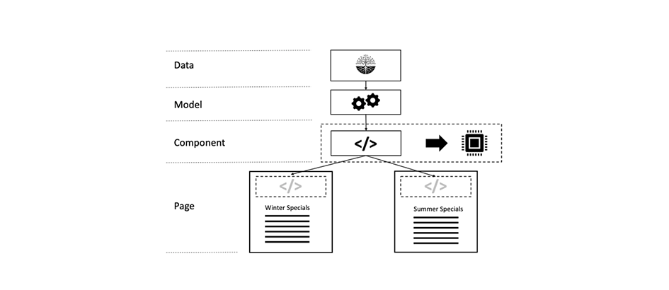

# 3장 - 고급 캐싱 항목

*&quot;컴퓨터 과학에는 두 가지 어려운 것들만 있습니다.캐시 무효화 및 이름 지정&quot;*

— PHIL KARLTON

## 개요

AEM에서 캐싱할 3부 중 3부입니다. 처음 두 부분은 Dispatcher의 일반 http 캐싱에 중점을 두었으며 어떤 제한이 있습니까? 이 섹션에서는 이러한 한계를 극복할 수 있는 방법에 대한 몇 가지 아이디어를 설명합니다.

## 일반 캐싱

[이 시리즈](chapter-1.md) 의  [제1장](chapter-2.md) 과 제2장은 주로 디스패처에 중점을 두었다. 기본 사항, 제한 사항 및 특정 거래를 위해 필요한 위치에 대해 설명했습니다.

캐싱 복잡도 및 복잡성은 Dispatcher에만 해당되는 문제가 아닙니다. 일반적으로 캐싱은 어렵습니다.

Dispatcher를 툴박스에서 유일한 툴로 사용하면 사실상 한계가 없어집니다.

이 장에서 우리는 캐싱에 대한 우리의 관점을 넓히고 디스패처의 단점을 극복할 수 있는 몇 가지 아이디어를 발전시키고자 한다. 효과적인 총알은 없습니다. 프로젝트에서 거래를 해야 합니다. 캐싱 및 무효화 정확도는 항상 복잡하므로 오류가 발생할 수 있습니다.

이 분야에서는 거래를 해야 할 겁니다

* 성능 및 지연
* 리소스 사용 / CPU 로드 / 디스크 사용량
* 정확성/통화/동일성/보안
* 단순성/복잡성/비용/유지 관리/오류 대명사

이러한 차원은 다소 복잡한 시스템에서 상호 연결됩니다. 그렇게 간단한 것은 없다. 시스템을 단순화하면 시스템을 더 빠르고 느리게 만들 수 있습니다. 개발 비용을 절감할 수 있지만 헬프데스크(예: 고객이 오래된 컨텐츠를 보거나 느린 웹 사이트에 대해 불평하는 경우)에서 비용을 향상시킬 수 있습니다. 이러한 모든 요인들은 서로 고려되고 균형을 잡을 필요가 있다. 하지만 지금으로서는 좋은 생각이 있어야 한다. 은박도 없고, 단 하나의 &quot;모범 사례&quot;도 없다 - 단지 많은 나쁜 연습과 몇몇 좋은 것들만.

## 체인 캐싱

### 개요

#### 데이터 흐름

서버에서 클라이언트의 브라우저로 페이지를 전달하는 것은 다양한 시스템과 하위 시스템에 걸쳐 이루어집니다. 자세히 살펴보면 소스에서 배수관으로 가져가야 하는 많은 운영 데이터가 있으며, 각 데이터가 캐싱할 가능성이 있습니다.


*일반적인 CMS 애플리케이션의 데이터 흐름*

<br> 

하드 디스크에 저장되어 있고 브라우저에 표시되어야 하는 데이터를 사용하여 여정을 시작하겠습니다.

#### 하드웨어 및 운영 체제

먼저, 하드 디스크 드라이브(HDD) 자체에는 하드웨어에 내장된 캐시가 있습니다. 둘째, 하드 디스크를 마운트하는 운영 체제는 사용 가능한 메모리를 사용하여 자주 액세스되는 블록을 캐시하여 액세스 속도를 높입니다.

#### 컨텐츠 리포지토리

다음 수준은 AEM에서 사용하는 문서 데이터베이스인 CRX 또는 Oak입니다. CRX와 Oak는 데이터를 메모리에 캐싱할 수 있고 HDD에 대한 액세스 속도가 느려지지 않도록 세그먼트로 나눌 수 있습니다.

#### 제3자 데이터

대부분의 대규모 웹 설치에는 타사 데이터도 있습니다.제품 정보 시스템, 고객 관계 관리 시스템, 기존 데이터베이스 또는 기타 임의의 웹 서비스에서 얻은 데이터 이 데이터는 필요 시 소스에서 가져올 필요가 없습니다. 특히 자주 변경하지 않는 것으로 알려진 경우는 없습니다. 따라서 CRX 데이터베이스에서 동기화되지 않으면 캐싱할 수 있습니다.

#### 비즈니스 계층 - 앱/모델

일반적으로 템플릿 스크립트는 JCR API를 통해 CRX에서 오는 원시 컨텐츠를 렌더링하지 않습니다. 비즈니스 도메인 개체의 데이터를 병합, 계산 및/또는 변환하는 사이에 비즈니스 계층이 있을 수 있습니다. 이러한 작업이 비싼 경우 캐시를 고려해야 합니다.

#### 마크업 조각

이제 모델은 구성 요소에 대한 마크업을 렌더링하기 위한 기본입니다. 렌더링된 모델도 캐시하지 않는 이유는 무엇입니까?

#### 발송자, CDN 및 기타 프록시

[해제]를 선택하면 렌더링된 HTML-페이지가 Dispatcher로 이동합니다. Dispatcher의 주요 목적은 HTML 페이지 및 기타 웹 리소스를 캐시하는 것입니다(이름에도 불구하고). 리소스가 브라우저에 도달하기 전에 캐싱에 사용되는 역방향 프록시(캐시 및 CDN)를 전달할 수 있습니다. 클라이언트는 사무실에 앉아 프록시를 통해서만 웹 액세스 권한을 부여하고 해당 프록시가 트래픽을 저장하도록 결정할 수 있습니다.

#### 브라우저 캐시

마지막으로, 적어도 아님 - 브라우저도 캐시합니다. 이것은 쉽게 간과되는 자산이다. 하지만 캐싱 체인에 있는 캐시는 가장 가깝고 빠릅니다. 안타깝게도 - 사용자 간에 공유되지 않지만 한 사용자의 다른 요청 간에 공유됩니다.

### 캐시할 위치 및 이유

그것은 오랜 잠재적 캐시이다. 그리고 우리 모두는 오래된 내용을 본 문제에 직면했다. 하지만 얼마나 많은 단계가 있는지 고려하면, 그것이 항상 일하고 있는 것은 기적이다.

하지만 그 사슬에서 캐시하는 것이 전혀 의미가 없는 것은 무엇일까요? 처음부터? 마지막에? 어디에요? 그것은... 그리고 그것은 많은 요인들에 따라 달라집니다. 동일한 웹 사이트에 있는 두 리소스도 이 질문에 대한 다른 답변을 원할 수 있습니다.

어떤 요인을 고려할지 대략적으로 알기 위해서

**라이브**  시간 - 개체의 라이브 시간이 짧은 경우(트래픽 데이터의 라이브 시간이 날씨 데이터보다 짧을 수 있음) 캐싱할 가치가 없을 수 있습니다.

**제작 비용 -** CPU 주기 및 입출력이 얼마나 비싼지(객체의 재제작 및 전달) 저렴한 캐싱이라면 필요 없을 수도 있습니다.

**크기**  - 큰 개체를 캐시하려면 더 많은 리소스가 필요합니다. 그것은 제한 요인이 될 수 있고 이점에 대해 균형을 맞추어야 한다.

**액세스 빈도**  - 객체에 거의 액세스하지 않는 경우 캐싱이 효과적이지 않을 수 있습니다. 캐시에서 두 번째 시간에 액세스하기 전에 오래된 상태로 전환되거나 무효화됩니다. 이러한 항목은 메모리 리소스를 차단합니다.

**공유 액세스**  - 둘 이상의 엔티티가 사용하는 데이터는 체인의 맨 위에 캐시되어야 합니다. 사실, 캐싱 체인은 체인이 아니라 나무입니다. 저장소에 있는 데이터 중 하나를 둘 이상의 모델에서 사용할 수 있습니다. 두 개 이상의 렌더링 스크립트에서 이러한 모델을 사용하여 HTML 조각을 생성할 수 있습니다. 이러한 조각은 브라우저에서 비공개 캐시를 통해 여러 사용자에게 배포되는 여러 페이지에 포함됩니다. 따라서 &quot;공유&quot;는 소프트웨어 간에 사람들 사이에 공유하는 것을 의미하지 않습니다. 잠재적인 &quot;공유&quot; 캐시를 찾으려면 트리를 루트로 되돌아가서 캐싱해야 하는 공통 조상을 찾습니다.

**지리 공간 배포**  - 사용자가 전세계에 분산되어 있는 경우 분산 캐시 네트워크를 사용하면 지연을 줄이는 데 도움이 될 수 있습니다.

**네트워크 대역폭 및 지연**  시간 - 지연을 언급하면 고객은 누구이며 어떤 종류의 네트워크를 사용하고 있습니까? 오래된 스마트폰의 3G 연결을 사용하는 선진국 고객은 모바일 고객일 수 있습니다. 작은 개체를 만들고 브라우저 캐시에서 캐시하는 것이 좋습니다.

지금까지 이 목록은 종합적이지 않지만, 우리는 당신이 지금쯤이면 그 아이디어를 얻을 것이라고 생각합니다.

### 체인 캐싱을 위한 기본 규칙

다시 한 번 말하지만 캐싱은 어렵습니다. 프로젝트에서 문제를 방지할 수 있는 이전 프로젝트에서 추출된 몇 가지 기본 규칙을 공유할 수 있습니다.

#### 이중 캐싱 방지

마지막 장에 도입된 각 레이어는 캐싱 체인에 몇 가지 값을 제공합니다. 컴퓨팅 주기를 절약하거나 데이터를 소비자에 보다 가깝게 가져올 수 있습니다. 여러 단계의 체인에 데이터를 캐시하는 것은 잘못되지 않지만 다음 단계의 이점과 비용이 무엇인지 항상 고려해야 합니다. 게시 시스템에서 전체 페이지를 캐싱하는 것은 일반적으로 아무런 이점이 없습니다. 이는 Dispatcher에서 이미 수행되기 때문입니다.

#### 혼합 무효화 전략

다음 세 가지 기본 무효화 전략이 있습니다.

* **TTL, 유지시간:** 개체가 고정된 시간(예: &quot;2시간 후&quot;) 후 만료됩니다.
* **만료 날짜:** 개체가 미래에 정의된 시간에 만료됩니다(예: &quot;2019년 6월 10일 오후 5시&quot;).
* **이벤트 기반:** 플랫폼(예: 페이지가 변경되고 활성화된 경우)에서 발생한 이벤트에 의해 개체가 명시적으로 무효화됩니다

이제 서로 다른 캐시 레이어에서 다른 전략을 사용할 수 있지만 몇 가지 &quot;독성&quot; 레이어가 있습니다.

#### 이벤트 기반 무효화


*순수한 이벤트 기반 무효화:내부 캐시에서 외부 레이어로 무효화*

<br> 

순수한 이벤트 기반 무효화는 이해하기 쉽고 이론적으로 옳은 것과 가장 정확한 것을 얻기 쉬운 것이다.

간단히 말해 객체가 변경된 후 캐시가 하나씩 무효화됩니다.

하나의 규칙을 염두에 두어야 합니다.

내면에서 외부 캐시까지 항상 무효화합니다. 외부 캐시를 먼저 무효화하면 내부 캐시를 통해 오래된 콘텐츠를 다시 캐시할 수 있습니다. 캐시가 다시 업데이트되는 시간을 추측하지 마십시오. 반드시 확인하십시오. 가장 좋습니다. 외부 캐시 _after_&#x200B;에 대한 무효화를 트리거하여 내부 캐시를 무효화합니다.

자, 그것이 이론입니다. 하지만 실제로는 많은 것이 있습니다. 이벤트를 네트워크를 통해 배포해야 합니다. 실제로, 이것은 구현하기에 가장 어려운 실효 제도이다.

#### 자동 - 복구

이벤트 기반 무효화 시 비상 계획 계획이 있어야 합니다. 무효화 이벤트가 누락되면 어떻게 합니까? 간단한 전략은 일정 시간 후에 무효화하거나 숙청하는 것이다. 따라서 - 해당 이벤트를 놓치고 부실 콘텐츠를 제공할 수 있습니다. 그러나 개체는 몇 시간(일)의 암시적 TTL도 있습니다. 결국 이 시스템은 자동으로 치유됩니다.

#### TTL 기반 무효화


*동기화되지 않은 TTL 기반 무효화*

<br> 

그것은 또한 꽤 흔한 체계이다. 여러 개의 캐시 레이어를 스택할 수 있으며 각 캐시는 특정 시간 동안 객체를 제공할 수 있습니다.

구현하기가 쉽습니다. 안타깝게도 데이터의 효과적인 수명 예측이 어렵습니다.


*외부 캐시는 내부 개체의 수명을 연장합니다.*

<br> 

위의 그림을 생각해 보십시오. 각 캐싱 레이어에는 TTL(2분)이 적용됩니다. 이제 - 전체 TTL도 2분이 되어야 합니다, 그렇죠? 전혀 그렇지 않습니다. 외부 레이어가 오래된 상태로 되기 직전에 객체를 가져오면 외부 레이어는 실제로 객체의 유효한 라이브 시간을 연장합니다. 이 경우 유효 라이브 시간은 2분에서 4분 사이여야 합니다. 비즈니스 부서의 동의를 받은 경우, 어느 날이 허용되므로 4개의 캐시로 구성된 캐시가 있습니다. 각 레이어의 실제 TTL은 6시간 이상이어야 합니다... 캐시 지연 비율을 증가시킵니다..

우리는 그것이 나쁜 계획이라고 말하고 있지 않다. 그 한계만 알면 돼 그리고 이것은 시작하기에 쉽고 좋은 전략입니다. 사이트의 트래픽이 증가하는 경우에만 보다 정확한 전략을 고려할 수 있습니다.

*특정 날짜를 설정하여 무효화 시간 동기화*

#### 만료 날짜 기반 무효화

내부 개체에 특정 날짜를 설정하고 외부 캐시에 이를 전파하는 경우 보다 예측 가능한 효과적인 라이프타임이 표시됩니다.


*만료 날짜 동기화*

<br> 

그러나 일부 캐시에서는 날짜를 전파할 수 없습니다. 그리고 외부 캐시는 만료 날짜가 다른 두 개의 내부 개체를 취합하는 경우 문제가 될 수 있습니다.

#### 이벤트 기반 및 TTL 기반 무효화를 혼합하는 중


*이벤트 기반 및 TTL 기반 전략 혼합*

<br> 

또한 AEM 환경의 일반적인 구성표는 내부 캐시에서 이벤트 기반 무효화를 사용하는 것입니다(예: 이벤트가 거의 실시간으로 처리될 수 있는 메모리 내 캐시). TTL 기반 캐시를 바깥쪽에서 사용하는 것입니다. 여기서 명시적 무효화에 액세스할 수 없을 수도 있습니다.

AEM 세계에서는 기본 리소스가 변경되고 이벤트 기반도 작동하는 디스패처에 이 변경 이벤트를 전파할 때 무효화된 게시 시스템에 비즈니스 개체 및 HTML 조각에 대한 메모리 내 캐시가 있습니다. 그 앞에 TTL 기반 CDN이 있어야 합니다.

디스패처 앞에 TTL(짧은) 기반 캐싱의 레이어를 사용하면 자동 무효화 이후 일반적으로 발생하는 스파이크를 효과적으로 부드럽게 만들 수 있습니다.

#### TTL 혼합 - 및 이벤트 기반 무효화


*독성:TTL 혼합 - 및 이벤트 기반 무효화*

<br> 

이 결합은 독성이 있다. TTL 또는 만료 기반 캐시된 이후 이벤트 기반 캐시를 배치하지 않습니다. 우리가 &quot;순수한 TTL&quot; 전략에 가졌던 번짐 효과를 기억하는가? 여기에서 동일한 효과를 볼 수 있습니다. 외부 캐시의 무효화 이벤트가 이미 발생한 경우에만 다시 발생하지 않을 수 있습니다. 이렇게 하면 캐시된 개체의 수명 범위를 무한대로 확장할 수 있습니다.


*TTL 기반 및 이벤트 기반 결합:무한 번짐*

<br> 

## 부분 캐싱 및 메모리 내 캐싱

렌더링 프로세스의 스테이지에 연결하여 캐싱 레이어를 추가할 수 있습니다. 원격 데이터 전송 객체 가져오기 또는 로컬 비즈니스 객체 작성에서 단일 구성 요소의 렌더링된 마크업을 캐시하는 데 이르기까지 모든 작업을 수행할 수 있습니다. 구체적인 구현 방법은 나중 튜토리얼로 남겨 둡니다. 하지만 이미 몇 개의 캐싱 레이어를 이미 구현했을 수도 있습니다. 그래서 여기서 우리가 할 수 있는 최소한의 것은 기본 원칙을 도입하고 - 고타를 사용하는 것입니다.

### 경고 단어

#### 액세스 제어 준수

여기에 설명된 기법은 매우 강력하며 각 AEM 개발자의 도구 상자에 _필수_&#x200B;가 있어야 합니다. 하지만 너무 흥분하지 말고 현명하게 사용하십시오. 객체를 캐시에 저장하고 다른 사용자와 후속 요청에 공유하면 실제로 액세스 제어를 우회하는 것을 의미합니다. 일반적으로 공개 웹 사이트에서는 문제가 되지 않지만 사용자가 액세스 권한을 받기 전에 로그인해야 하는 경우가 있습니다.

사이트 기본 메뉴의 HTML 마크업을 메모리 내 캐시에 저장하여 다양한 페이지 간에 공유할 수 있습니다. 실제로 내비게이션을 만들 때 부분적으로 렌더링된 HTML을 저장하기에 완벽한 예로는 많은 페이지를 탐색해야 하는 만큼 비용이 많이 드는 경우가 많습니다.

모든 페이지 간에 동일한 메뉴 구조를 공유하지 않고 보다 효율적인 모든 사용자와 공유합니다. 그러나 잠시 기다려 주십시오... 그러나 메뉴에 특정 사용자 그룹에만 예약된 항목이 있을 수 있습니다. 이러한 경우 캐싱이 좀 더 복잡해질 수 있습니다.

#### 사용자 지정 비즈니스 개체만 캐시

만약 있다면 - 그것이 가장 중요한 조언이라면, 우리는 당신에게 줄 수 있습니다.

>[!WARNING]
>
>자신의 것과 변경할 수 없는 것, 사용자가 직접 구축한 것, 얕은 것뿐 아니라 외적인 참조도 하지 않는 것뿐이다.

그게 무슨 뜻이야?

1. 여러분은 다른 사람들의 물체의 의도된 라이브 주기에 대해 모릅니다. 요청 개체에 대한 참조를 확인하고 이를 캐시하기로 결정하십시오. 이제 요청이 종료되고 서블릿 컨테이너가 다음 수신 요청에 대해 해당 객체를 재활용하려고 합니다. 이 경우 다른 사람이 사용자가 독점적으로 제어할 수 있다고 생각했던 컨텐츠를 변경하고 있습니다. 이를 무시하지 마십시오. 프로젝트에서 이러한 문제가 발생하는 것을 목격했습니다. 고객은 자체 데이터가 아닌 다른 고객 데이터를 보고 있었습니다.

2. 객체가 다른 참조 체인에 의해 참조되는 한 힙에서 제거할 수 없습니다. 캐시에서 참조하는 작은 개체를 보유하고 있는 경우 4MB의 이미지 표현을 사용하면 메모리 누수에 문제가 생길 수 있습니다. 캐시는 잘못된 참조를 기반으로 합니다. 하지만 - 약한 참조는 예상대로 작동하지 않습니다. 메모리 누수를 만들어 메모리 부족 오류로 끝나는 데 가장 좋은 방법입니다. 그리고 - 여러분은 이물체의 보존된 기억의 크기가 얼마인지 알지 못합니다, 그렇죠?

3. 특히 Sling에서 각 객체를 서로 변경(거의)할 수 있습니다. 리소스를 캐시에 저장하는 것이 좋습니다. 다음 요청(다른 액세스 권한 포함)은 해당 리소스를 가져와서 이 리소스를 resourceResolver 또는 세션에 적용하여 액세스 권한이 없을 다른 리소스에 액세스합니다.

4. AEM의 리소스를 둘러싸고 가는 &quot;래퍼&quot;를 만드는 경우에도 자체 및 변경할 수 없는 경우에도 이를 캐시하지 않아야 합니다. 래핑된 개체는 참조일 수 있으며(이전에 허용하지 않은 참조), 선명하게 보이는 경우 기본적으로 마지막 항목에 설명된 것과 동일한 문제를 생성합니다.

5. 캐시하려는 경우 원시 데이터를 자체 허용 개체에 복사하여 자신의 개체를 만듭니다. 참조를 사용하여 자체 개체 간에 연결할 수 있습니다. 예를 들어 개체 트리를 캐시할 수 있습니다. 좋습니다. 하지만 동일한 요청에서 방금 만든 캐시 객체만 캐시에 저장하며 다른 곳에서 요청한 객체는 없습니다(&#39;사용자의&#39; 객체의 이름 공간이라도). _객체_ 를 복사하면 키가 됩니다. 또한 연결된 개체의 전체 구조를 한 번에 제거하고 구조에 대한 수신 및 나가는 참조를 피하십시오.

6. 예 - 개체를 변경할 수 없도록 할 수 있습니다. 전용 속성, 설정만 및 설정되지 않습니다.

그건 많은 규칙이지만, 그것들을 따를 가치가 있어요. 비록 여러분이 경험이 있고 매우 똑똑하며 모든 것을 통제한다 할지라도. 당신 프로젝트의 젊은 동료는 대학을 막 졸업했어요. 그는 이 모든 함정을 모른다. 함정이 없다면 피할 것이 없다. 간단하고 이해하기 쉽게 유지할 수 있습니다.

### 툴 및 라이브러리

이 시리즈는 개념을 이해하고 사용 사례에 가장 적합한 아키텍처를 구축할 수 있도록 도와줍니다.

특별히 어떤 도구도 홍보하지 않습니다. 하지만 그것들을 어떻게 평가하는지 힌트를 주어라. 예를 들어, AEM은 버전 6.0 이후 고정 TTL을 갖는 단순한 내장 캐시를 가지고 있습니다. 이 설정을 사용하시겠습니까? 이벤트 기반 캐시가 체인의 뒤에 오는 게시(힌트:발송자 참조). 하지만 작가에게는 적절한 선택일 수 있다. 검토할 가치가 있는 Adobe ACS 공유지에 의한 HTTP 캐시도 있습니다.

또는 [Ehcache](https://www.ehcache.org)와 같은 성숙한 캐싱 프레임워크를 기반으로 자체 프레임워크를 구축할 수도 있습니다. Java 객체를 캐시하고 렌더링된 마크업(`String` 객체)을 캐시하는 데 사용할 수 있습니다.

간단한 경우 동시 해시 맵을 사용할 수도 있습니다. 도구나 기술력으로는 제한이 여기에서 빠르게 표시됩니다. 동시 사용은 이름 지정 및 캐싱만큼 마스터하기 어렵습니다.

#### 참조

* [ACS Commons http 캐시  ](https://adobe-consulting-services.github.io/acs-aem-commons/features/http-cache/index.html)
* [캐시 캐싱 프레임워크](https://www.ehcache.org)

### 기본 용어

여기서 너무 깊은 캐싱 이론에는 들어가지 않지만, 좋은 점프시작을 하기 위해 몇 가지 버즈 단어를 제공해야 한다는 의무감이 있습니다.

#### 캐시 제거

우리는 무효화와 숙소에 대해 많이 얘기했다. _캐시_ 이벤트는 다음 용어와 관련이 있습니다.항목을 제거한 후에는 더 이상 사용할 수 없습니다. 그러나 항목이 오래되지 않은 경우 제거가 수행되지만 캐시가 꽉 찼을 때는 제거됩니다. 최신 항목 또는 &quot;더 중요&quot; 항목은 더 오래된 항목 또는 덜 중요한 항목을 캐시에서 밀어냅니다. 어떤 출품작에 대한 소송 사건 처리 여부를 결정해야 합니다. 아주 드물게 또는 오랫동안 접근해 왔던 오래된 것을 쫓아내기를 원할 수도 있다.

#### 선제 캐싱

선제 캐싱은 무효화되거나 오래된 것으로 간주되는 즉시 새 컨텐츠로 항목을 다시 만드는 것을 의미합니다. 물론 몇 가지 리소스만 있으면 자주 즉시 액세스할 수 있습니다. 그렇지 않으면 요청되지 않을 수 있는 캐시 항목을 만드는 데 리소스를 허비하게 됩니다. 캐시 항목을 미리 만들어 캐시 무효화 후 첫 번째 요청의 리소스에 대한 지연을 줄일 수 있습니다.

#### 캐시 온난화

캐시 온난화는 선제 캐싱과 밀접한 관련이 있다. 하지만 라이브 시스템으로는 이 용어를 사용하지 않습니다. 그리고 그것은 전자보다 구속되는 시간이 적다. 무효화 후 바로 다시 캐시하지 않지만 시간이 허용되면 단계적으로 캐시를 채웁니다.

예를 들어 로드 밸런서에서 게시/디스패처 다리를 제거하여 업데이트합니다. 다시 통합하기 전에 가장 자주 액세스하는 페이지를 자동으로 크롤하여 캐시에 다시 가져옵니다. 캐시가 &quot;따뜻함&quot; 인 경우 - 다리를 로드 밸런서에 적절히 다시 통합합니다.

혹은 다리를 한꺼번에 다시 통합시킬 수도 있습니다. 하지만 다리를 움직이게 해서 정기적인 사용 방법에 의해 노심지를 따뜻하게 할 수 있습니다.

또는 시스템이 유휴 상태일 때 자주 액세스하지 않는 일부 페이지를 캐시하여 실제 요청에 의해 실제로 액세스되는 경우 지연을 줄일 수도 있습니다.

#### 캐시 객체 ID, 페이로드, 무효화 종속성 및 TTL

일반적으로 캐시된 개체 또는 &quot;항목&quot;에는 5개의 주요 속성이 있습니다.

#### 키

ID는 식별하여 객체를 지정하는 속성입니다. 페이로드를 검색하거나 캐시에서 해당 페이로드를 제거합니다. 예를 들어 디스패처는 페이지의 URL을 키로 사용합니다. 참고: 디스패처는 페이지 경로를 사용하지 않습니다. 이것은 다른 렌더링을 구별하기에 충분하지 않다. 다른 캐시에서는 다른 키를 사용할 수 있습니다. 나중에 몇 가지 예를 볼 것입니다.

#### 값/페이로드

그것은 그 물체의 보물 가슴이고, 당신이 검색하고자 하는 자료입니다. 디스패처의 경우 파일 컨텐츠입니다. 하지만 Java 객체 트리일 수도 있습니다.

#### TTL

우리는 이미 TTL을 다루었다. 항목이 오래된 것으로 간주되어 더 이상 배달할 수 없는 시간입니다.

#### 종속성

이것은 이벤트 기반 무효화와 관련이 있습니다. 그 개체는 원래 데이터가 무엇인가요? 1부에서, 우리는 이미 진실하고 정확한 의존성 추적이 너무 복잡하다고 말했습니다. 그러나 시스템에 대한 우리의 지식으로, 더욱 단순한 모델에 대한 의존성을 어림잡을 수 있다. 오래된 컨텐츠를 제거할 수 있는 충분한 객체를 무효화하고 실수로 필요한 것보다 더 많은 객체를 무효화합니다. 하지만 우리는 &quot;모든 것을 숙청하라&quot;는 말을 계속 하려고 노력합니다.

각 애플리케이션에서 다른 사람이 정품인지에 따라 어떤 객체가 달라집니까? 나중에 종속성 전략을 구현하는 방법에 대한 몇 가지 예를 드리겠습니다.

### HTML 조각 캐싱



*다른 페이지에서 렌더링된 조각 다시 사용*

<br> 

HTML 조각 캐싱은 강력한 툴입니다. 메모리 내 캐시에서 구성 요소로 생성된 HTML 마크업을 캐시하는 것이 좋습니다. 제가 왜 그렇게 해야 하는지 물어보세요. 구성 요소의 마크업을 포함하여 Dispatcher에서 전체 페이지 마크업을 캐시합니다. 동의합니다. 합니다. 하지만 페이지당 한 번. 페이지 간에 해당 마크업을 공유하지 않습니다.

각 페이지 위에 내비게이션을 렌더링한다고 가정해 보십시오. 마크업은 각 페이지에서 동일하게 표시됩니다. 그러나 각 페이지에 대해 Dispatcher에 없는 렌더링이 계속 수행됩니다. 기억하십시오.자동 무효화 후 모든 페이지를 다시 렌더링해야 합니다. 기본적으로 동일한 코드를 수백 번 실행하게 됩니다.

경험에서 중첩 위쪽 탐색 기능을 렌더링하는 것은 매우 비용이 많이 드는 작업입니다. 일반적으로 탐색 항목을 생성하기 위해 문서 트리의 적절한 부분을 탐색합니다. 탐색 제목 및 URL만 필요한 경우에도 페이지를 메모리에 로드해야 합니다. 그리고 여기에서 그들은 귀중한 자원을 탐구하고 있다. 계속해서

하지만 구성 요소는 여러 페이지 간에 공유됩니다. 그리고 어떤 것을 공유하는 것은 캐시를 사용하는 것을 나타내는 것입니다. 따라서 - 탐색 구성 요소가 이미 렌더링되어 캐시되었는지 확인하고 다시 렌더링하는 대신 캐시 값을 전송하는 것이 좋습니다.

그 계획은 쉽게 놓치지는 않은 두 가지의 훌륭한 예들이 있다.

1. Java 문자열을 캐시하고 있습니다. String에는 나가는 참조가 없으며 변경할 수 없습니다. 그래서, 위의 경고들을 고려한다면 - 이것은 매우 안전합니다.

2. 무효화는 매우 쉽다. 웹 사이트가 변경될 때마다 이 캐시 항목은 무효화해야 합니다. 재구축은 한 번만 수행해야 하고 수백 페이지의 모든 페이지에서 다시 사용할 수 있으므로 상대적으로 저렴합니다.

이는 게시 서버에 대한 큰 안도감입니다.

### 조각 캐시 구현

#### 사용자 지정 태그

템플릿 엔진 역할을 하는 JSP를 사용하던 옛날에는 구성 요소 렌더링 코드 주위에 사용자 정의 JSP 태그를 래핑하는 것이 매우 일반적이었습니다.

```
<!-- Pseudo Code -->

<myapp:cache
  key=' ${info.homePagePath} + ${component.path}'
  cache='main-navigation'
  dependency='${info.homePagePath}'>

… original components code ..

</myapp:cache>
```

사용자 지정 태그는 본문을 캡처하여 캐시에 기록하거나 본문 실행을 방지하고 캐시 항목의 페이로드를 출력하는 것보다 더 큽니다.

&quot;키&quot;는 홈 페이지에 있는 구성 요소 경로입니다. 현재 페이지에서는 구성 요소의 경로를 사용하지 않으며, 이는 해당 구성 요소를 공유하려는 우리의 의도와 상반되는 페이지당 하나의 캐시 항목을 만들 것입니다. 구성 요소 상대 경로(`jcr:conten/mainnavigation`)만 사용하는 것은 아니므로 다른 사이트에서 다른 탐색 구성 요소를 사용할 수 없습니다.

&quot;캐시&quot;는 항목을 저장할 위치를 나타내는 표시기입니다. 일반적으로 항목을 저장할 캐시가 두 개 이상 있습니다. 각각의 것은 약간 다르게 행동할 수 있다. 따라서 저장 내용을 차별화하는 것이 좋습니다. 마지막에 있는 것은 단지 문자열일 지라도 말입니다.

&quot;종속성&quot; 이것은 캐시 항목이 종속되는 것입니다. &quot;주 탐색&quot; 캐시에는 &quot;종속성&quot; 노드 아래에 변경 내용이 있으면 해당 항목을 제거해야 한다는 규칙이 있을 수 있습니다. 따라서 캐시 구현은 변경 사항을 인식하기 위해 저장소에서 이벤트 리스너로 자신을 등록해야 하며 캐시별 규칙을 적용하여 무효화해야 할 사항을 찾아야 합니다.

상기의 예가 바로 그것이다. 캐시 트리를 선택할 수도 있습니다. 첫 번째 수준을 사용하여 사이트(또는 임차인)를 구분한 다음 두 번째 레벨을 컨텐츠 유형(예: &quot;기본 탐색&quot;)으로 분기하여 위 예제와 같이 홈 페이지 경로를 추가할 수 있습니다.

이 방법을 최신 HTL 기반 구성 요소와 함께 사용할 수도 있습니다. HTL 스크립트 주위에 JSP 래퍼가 있습니다.

#### 구성 요소 필터

그러나 순수한 HTL 방식에서는 Sling 구성 요소 필터로 조각 캐시를 빌드하는 것이 좋습니다. 우리는 아직 이것을 야생에서 보지 못했지만, 그것이 우리가 그 문제에 관해 취할 접근 방식입니다.

#### Sling 동적 포함

조각 캐시는 변화하는 환경(다른 페이지) 컨텍스트에서 상수(탐색)가 있는 경우에 사용됩니다.

그러나 상대적으로 지속적인 컨텍스트(거의 변경되지 않는 페이지)와 해당 페이지의 일부 변경 조각(예: 라이브 티커)도 반대의 경우가 있을 수 있습니다.

이 경우 [Sling 동적 포함](https://sling.apache.org/documentation/bundles/dynamic-includes.html)에 대한 기회를 제공할 수 있습니다. 기본적으로 이것은 구성 요소 필터이며, 동적 구성 요소를 참조하는 페이지로 렌더링하는 대신 이 구성 요소를 둘러싸는 것입니다. 이 참조는 Ajax 호출일 수 있으므로 구성 요소가 브라우저에 포함되어 있고 주변 페이지를 정적으로 캐시할 수 있습니다. 또는 - 또는 - Sling Dynamic Include는 SSI 지시문을 생성할 수 있습니다(서버측 포함). 이 지시문은 Apache 서버에서 실행됩니다. Varnish 또는 ESI 스크립트를 지원하는 CDN을 사용하는 경우 ESI - Edge Side Include 지시문을 사용할 수도 있습니다.


*Sling 동적 포함을 사용한 요청의 시퀀스 다이어그램*

<br> 

SDI 설명서에서는 동적 구성 요소를 처리할 때 &quot;*.nocache.html&quot;로 끝나는 URL에 대한 캐싱을 비활성화해야 한다고 말합니다.

SDI를 사용하는 다른 옵션이 표시될 수 있습니다._이(가) 포함에 대해 디스패처 캐시를 사용하지 않도록 설정하지 않으면 디스패처는 마지막 장에 설명된 것과 비슷한 조각 캐시처럼 동작합니다.페이지 및 구성 요소 조각은 페이지 요청이 요청되면 페이지 및 구성 요소 조각은 디스패처에 동일하게 그리고 독립적으로 캐시되고 Apache 서버의 SSI 스크립트로 함께 결합됩니다._ 이렇게 하면 기본 탐색과 같은 공유 구성 요소를 구현할 수 있습니다(동일한 구성 요소 URL을 항상 사용하는 경우).

그것은 이론적으로 효과가 있을 것이다. 하지만...

우리는 그것을 하지 말라고 충고한다:실제 동적 구성 요소에 대해 캐시를 건너뛰는 기능을 사용할 수 없습니다. SDI는 전체적으로 구성되며 &quot;fer-mann-fragment-cache&quot;에 대해 수행한 변경 사항이 동적 구성 요소에도 적용됩니다.

SDI 설명서를 주의 깊게 연구하시기 바랍니다. 몇 가지 다른 제한 사항들이 있지만, SDI는 어떤 경우에는 가치 있는 도구이다.

#### 참조

* [docs.oracle.com - 사용자 정의 JSP 태그를 작성하는 방법](https://docs.oracle.com/cd/E11035_01/wls100/taglib/quickstart.html)
* [도미니크 수스 - 구성 요소 필터 만들기 및 사용](https://www.slideshare.net/connectwebex/prsentation-dominik-suess)
* [sling.apache.org - Sling 동적 포함](https://sling.apache.org/documentation/bundles/dynamic-includes.html)
* [helpx.adobe.com - AEM에서 Sling 동적 포함 설정](https://helpx.adobe.com/experience-manager/kt/platform-repository/using/sling-dynamic-include-technical-video-setup.html)


#### 모델 캐싱


*모델 기반 캐싱:서로 다른 렌더링이 있는 하나의 비즈니스 개체*

<br> 

탐색 시 사례를 다시 살펴보겠습니다. 각 페이지에 동일한 탐색 마크업이 필요할 것으로 가정했습니다.

그러나 아마, 그것은 사실이 아닐 것이다. 탐색 시 _현재 페이지_&#x200B;를 나타내는 항목에 대해 다른 마크업을 렌더링할 수 있습니다.

```
Travel Destinations

<ul class="maninnav">
  <li class="currentPage">Travel Destinations
    <ul>
      <li>Finland
      <li>Canada
      <li>Norway
    </ul>
  <li>News
  <li>About us
<ul>
```

```
News

<ul class="maninnav">
  <li>Travel Destinations
  <li class="currentPage">News
    <ul>
      <li>Winter is coming>
      <li>Calm down in the wild
    </ul>
  <li>About us
<is
```

이 두가지는 완전히 다른 렌더링입니다. 그러나 여전히 전체 탐색 트리인 _비즈니스 객체_&#x200B;는 동일합니다.  여기에 _business object_&#x200B;는 트리의 노드를 나타내는 개체 그래프가 됩니다. 이 그래프는 메모리 내 캐시에 쉽게 저장할 수 있습니다. 그러나 이 그래프는 객체를 포함하거나 직접 생성하지 않은 객체를 참조해서는 안 됩니다(특히 현재 JCR 노드).

#### 브라우저에서 캐싱

이미 브라우저에서의 캐싱 중요도에 큰 영향을 미쳤으며 유용한 자습서가 많이 제공됩니다. 마지막으로 - 브라우저의 경우 - 디스패처는 HTTP 프로토콜을 따르는 웹 서버일 뿐입니다.

하지만 - 그 이론에도 불구하고, 우리는 우리가 다른 어떤 곳에서도 찾을 수 없고 우리가 공유하고 싶은 약간의 지식을 모았습니다.

기본적으로 브라우저 캐싱은 두 가지 방법으로 이용할 수 있습니다.

1. 브라우저에 캐시된 리소스가 있으며 정확한 만료 날짜를 알고 있습니다. 이 경우 리소스를 다시 요청하지 않습니다.

2. 브라우저에 리소스가 있지만 여전히 유효한지 확실하지 않습니다. 이 경우 웹 서버(Dispatcher의 경우)에 문의하십시오. 마지막으로 제공한 후 수정한 리소스가 있으면 알려주십시오. 변경되지 않으면 &quot;304 - 변경하지 않음&quot;으로 응답하고 메타 데이터만 전송되었습니다.

#### 디버깅

브라우저 캐싱을 위해 Dispatcher 설정을 최적화하는 경우 브라우저와 웹 서버 간에 데스크탑 프록시 서버를 사용하는 것이 매우 유용합니다. Karl von Randow의 &quot;Charles Web Debugging Proxy&quot;를 선호합니다.

Charles를 사용하여 서버와 전송되는 요청 및 응답을 읽을 수 있습니다. HTTP 프로토콜에 대한 자세한 내용을 살펴볼 수 있습니다. 최신 브라우저에서도 몇 가지 디버깅 기능을 제공하지만 데스크탑 프록시의 기능은 전례가 없는 기능입니다. 전송된 데이터를 조작하고, 전송을 제한하며, 단일 요청을 재생하는 등 다양한 작업을 할 수 있습니다. 유저 인터페이스는 명확하고 포괄적입니다.

가장 기본적인 테스트는 시간 경과에 따라 정적 요청(/etc/..)의 수가 점점 감소하여 캐시에 있어야 하고 더 이상 요청되지 않아야 하기 때문에 프록시를 사용하여 해당 웹 사이트를 일반 사용자로 사용하는 것입니다.

캐시된 요청이 로그에 표시되지 않는 반면 일부 브라우저에 내장된 디버거는 여전히 &quot;0ms&quot; 또는 &quot;디스크에서&quot; 요청을 보여주므로 프록시가 보다 명확한 개요를 제공할 수 있습니다. 그것은 정확하고 괜찮지만 당신의 관점을 약간 흐릴 수 있다.

그런 다음 &quot;만료&quot; http 헤더가 올바른 경우 등 전송된 파일의 헤더를 드릴다운하여 확인할 수 있습니다. 서버가 304 또는 200 응답 코드로 올바르게 응답하는지 확인하기 위해, &#39;수정 후&#39;인 헤더가 설정된 요청을 다시 재생할 수 있습니다. 비동기 호출의 타이밍을 관찰하고 특정 수준으로 보안 가정을 테스트할 수도 있습니다. 명시적으로 예상되지 않은 선택기를 모두 수락하지 않도록 주의했습니다. 여기에서 URL 및 매개 변수를 사용하여 재생할 수 있으며 응용 프로그램이 잘 작동하는지 확인할 수 있습니다.

캐시를 디버깅할 때 하지 않도록 요청하는 것은 한 가지 뿐입니다.

브라우저에서 페이지를 다시 로드하지 마십시오!

&quot;브라우저 다시 로드&quot;, _단순 다시 로드_ 및 _강제 다시 로드_(&quot;_shift-reload_&quot;)는 일반적인 페이지 요청과 동일하지 않습니다. 단순 다시 로드 요청은 헤더를 설정합니다.

```
Cache-Control: max-age=0
```

Shift-다시 로드(&quot;Shift&quot; 키를 누른 채 [다시 로드] 단추를 클릭)는 일반적으로 요청 헤더를 설정합니다

```
Cache-Control: no-cache
```

두 헤더 모두 비슷하지만 약간 다른 효과를 가지지만, 가장 중요한 것은 URL 슬롯에서 URL을 열 때 또는 사이트의 링크를 사용하여 일반 요청과는 완전히 다릅니다. 일반적인 탐색은 캐시-제어 헤더를 설정하지 않지만, 아마도 if-modified-since 헤더일 것입니다.

따라서 일반적인 탐색 동작을 디버깅하려면 다음을 수행해야 합니다._보통_&#x200B;로 찾아봅니다. 브라우저의 [다시 로드] 단추를 사용하면 구성에서 캐시 구성 오류를 볼 수 없는 가장 좋은 방법입니다.

Charles Proxy를 사용하여 Adobe가 말하는 내용을 보십시오. 예 - 열려 있는 동안 바로 해당 애플리케이션에서 요청을 재생할 수 있습니다. 브라우저에서 다시 로드할 필요가 없습니다.

## 성능 테스트

프록시를 사용하면 페이지의 타이밍 동작을 이해할 수 있습니다. 물론, 그것은 전혀 성능시험이 아니다.  성능 테스트를 수행하려면 페이지를 동시에 요청하는 많은 클라이언트가 필요합니다.

성능 테스트는 매우 적은 수의 페이지만 포함되며 이러한 페이지는 Dispatcher 캐시에서만 전달된다는 일반적인 실수입니다.

애플리케이션을 라이브 시스템으로 홍보하는 경우 로드는 테스트한 것과 완전히 다릅니다.

라이브 시스템에서 액세스 패턴은 테스트(홈 페이지 및 일부 컨텐츠 페이지)에 있는 동일하게 배포된 페이지 수가 아닙니다. 페이지 수가 훨씬 많고 요청은 매우 균등하게 배포됩니다. 그리고 - 물론, 라이브 페이지는 캐시에서 100% 제공할 수 없습니다.게시 시스템에서 제공된 무효화 요청이 있으며 귀중한 리소스의 많은 부분을 자동으로 무효화합니다.

예 - Dispatcher 캐시를 다시 작성할 때 소수의 페이지만 요청하는지 또는 더 많은 수의 페이지만을 요청하는지에 따라 게시 시스템도 매우 다르게 동작한다는 것을 알 수 있습니다. 모든 페이지가 유사하게 복잡하더라도 해당 숫자는 역할을 수행합니다. 체인화된 캐싱에 대해 했던 말 기억나요? 항상 동일한 수의 페이지를 요청하면 원시 데이터가 있는 각 블록이 하드 드라이브 캐시에 있거나 운영 체제에 의해 블록이 캐시되는 경우가 좋습니다. 또한 Repository가 기본 메모리에 각 세그먼트를 캐시했을 가능성이 높습니다. 따라서 렌더링이 다른 페이지가 서로 다른 페이지로 전환된 다음 다양한 캐시에서 실행되는 경우보다 훨씬 빨라졌습니다.

캐싱은 어려우므로 캐싱에 의존하는 시스템의 테스트도 어렵습니다. 그렇다면, 더 정확한 실제 삶의 시나리오를 가지려면 무엇을 할 수 있을까요?

두 개 이상의 테스트를 실시해야 하며 솔루션의 품질을 측정하기 위해 두 개 이상의 성능 색인을 제공해야 합니다.

이미 기존 웹 사이트가 있는 경우 요청 수와 요청 배포 방법을 측정합니다. 비슷한 요청 배포를 사용하는 테스트를 모델링해 봅니다. 무작위 요소를 추가해도 아무런 문제가 없습니다. JS 및 CSS와 같은 정적 리소스를 로드할 브라우저를 시뮬레이션할 필요는 없습니다. 이러한 리소스는 중요하지 않습니다. 결국 브라우저나 Dispatcher에서 캐시되고 추가로 로드되지 않습니다. 하지만 참조된 이미지는 중요한 역할을 합니다. 이전 로그 파일에서 배포를 검색하고 유사한 요청 패턴을 모델링할 수 있습니다.

이제 Dispatcher에서 전혀 캐싱하지 않고 테스트를 수행합니다. 최악의 시나리오야 최악의 상황에서 시스템의 최고 부하가 불안정해지는 것을 확인합니다. 원할 경우 Dispatcher/Publish 다리 몇 개를 제거함으로써 작업 시간을 단축할 수도 있습니다.

다음으로 모든 필수 캐시 설정을 &quot;설정&quot;으로 하여 동일한 테스트를 수행합니다. 병렬 요청을 천천히 증가시켜 캐시를 따뜻하게 하고 이러한 최상의 조건에서 시스템이 얼마나 많은 양을 사용할 수 있는지 확인합니다.

평균 사례 시나리오는 Dispatcher가 활성화된 상태에서 테스트를 실행하는 것이지만 일부 잘못된 경우도 발생합니다. 정문을 크워크로 터치하거나 Dispatcher에 불규칙한 간격으로 무효화 요청을 전송하여 시뮬레이트할 수 있습니다. 또한 때때로 자동이 아닌 일부 리소스를 삭제하는 것을 잊지 마십시오.

무효화 요청을 늘리고 로드를 증가시켜 마지막 시나리오를 변경할 수 있습니다.

이는 단순한 선형 부하 테스트보다 약간 복잡하지만 솔루션에 훨씬 더 많은 신뢰를 줍니다.

너는 그 노력을 회피할지도 모른다. 그러나 시스템의 한계를 보기 위해 페이지 수(동일하게 분포)가 많은 게시 시스템에서 최악의 사례 테스트를 수행합니다. 최상의 시나리오의 수를 올바르게 해석할 수 있고 충분한 헤딩룸으로 시스템을 프로비저닝해야 합니다.