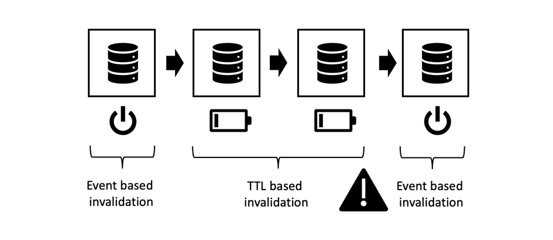

# 3장 - 고급 캐싱 항목

*&quot;컴퓨터 과학에는 두 가지 어려운 것들만 있습니다.캐시 무효화 및 이름 지정 항목.&quot;*

— 필 칼튼

## 개요

AEM에서 캐싱할 세 가지 부분 중 3부입니다. 첫 번째 두 부분이 Dispatcher의 일반 http 캐싱에 중점을 두고 있고 그 안에 어떤 제한 사항이 있는지 설명합니다. 이 단원에서는 이러한 제한 사항을 어떻게 극복하는지에 대해 설명합니다.

## 일반 캐싱

[이 시리즈의 주요 내용은 Dispatcher](chapter-1.md) 와  [제2장](chapter-2.md) 을 참조하십시오. 기본 사항, 제한 사항 및 특정 장해를 수행해야 하는 위치에 대해 설명했습니다.

캐싱 복잡성 및 복잡성은 Dispatcher에만 적용되는 문제가 아닙니다. 일반적으로 캐싱은 어렵습니다.

Dispatcher를 도구 상자에 유일한 도구로 사용하는 것은 실제로 큰 제한이 됩니다.

이 장에서는 캐싱에 대한 보기를 더 넓히고 Dispatcher의 단점을 어떻게 극복할 수 있는지 아이디어를 개발하려고 합니다. 이 총알은 없습니다. 프로젝트에서 거래를 해야 합니다. 캐싱 및 무효화 정확성은 항상 복잡성과 오류 가능성이 있다는 것을 기억하십시오.

이 분야에서는 거래를 해야 합니다

* 성능 및 지연
* 리소스 사용량/CPU 로드/디스크 사용량
* 정확성 / 통화 / 종말 / 보안
* 단순성 / 복잡성 / 비용 / 유지 관리 능력 / 오류 발음

이 차원들은 다소 복잡한 시스템에서 연동됩니다. 그렇게 간단한 건 없어요 시스템을 단순화하면 속도가 더 빠르거나 느려질 수 있습니다. 따라서 개발 비용은 낮출 수 있지만 헬프데스크의 비용(예: 고객이 오래된 컨텐츠가 발견되거나 느린 웹 사이트에 대한 불만 사항이 있는 경우)을 늘릴 수 있습니다. 이러한 모든 요인들은 서로 고려되고 균형을 맞출 필요가 있다. 하지만 지금쯤은 벌써 좋은 생각을 가지고 있어야 한다. 그것은 은색 탄환이나 단 하나의 &quot;모범 사례&quot;가 없다는 것이다 - 단지 많은 나쁜 사례와 좋은 것들 중 몇 가지만.

## 체인 캐싱

### 개요

#### 데이터 흐름

서버에서 클라이언트의 브라우저로 페이지를 전달하는 것은 많은 시스템과 하위 시스템을 교차합니다. 자세히 살펴보면 소스에서 드레인으로 가져가야 하는 많은 hops 데이터가 있으며, 각각 캐싱에 대한 잠재적 후보입니다.


*일반적인 CMS 애플리케이션의 데이터 흐름*

<br> 

하드 디스크에 있고 브라우저에 표시되어야 하는 데이터 조각을 사용하여 여정을 시작하겠습니다.

#### 하드웨어 및 운영 체제

먼저, 하드 디스크 드라이브(HDD) 자체에는 하드웨어에 일부 내장된 캐시가 있습니다. 둘째, 하드 디스크를 마운트하는 운영 체제는 사용 가능한 메모리를 사용하여 자주 액세스하는 블록을 캐시하여 액세스 속도를 높입니다.

#### 컨텐츠 리포지토리

다음 수준은 AEM에서 사용하는 문서 데이터베이스인 CRX 또는 Oak입니다. CRX 및 Oak는 데이터를 메모리에 캐싱할 수 있는 세그먼트로 나누어 HDD에 대한 액세스 속도가 느려지지 않도록 합니다.

#### 타사 데이터

대부분의 더 큰 웹 설치에는 타사 데이터도 있습니다.제품 정보 시스템, 고객 관계 관리 시스템, 레거시 데이터베이스 또는 기타 임의 웹 서비스에서 오는 데이터. 이 데이터는 필요 시 언제든지 소스에서 가져올 필요가 없습니다. 특히 자주 변경되지 않는 것으로 알려진 경우에는 이러한 데이터를 가져올 필요가 없습니다. 따라서 CRX 데이터베이스에서 동기화되지 않은 경우 캐시할 수 있습니다.

#### 비즈니스 계층 - 앱/모델

일반적으로 템플릿 스크립트는 JCR API를 통해 CRX에서 오는 원시 컨텐츠를 렌더링하지 않습니다. 이 두 대상 사이에 비즈니스 도메인 개체의 데이터를 병합, 계산 및/또는 변환하는 비즈니스 계층이 있을 수 있습니다. 맞춰보세요. 이러한 작업이 비싼 경우 캐싱을 고려해야 합니다.

#### 마크업 조각

이제 모델은 구성 요소에 대한 마크업을 렌더링하는 베이스입니다. 렌더링된 모델도 캐시하지 않는 이유는 무엇입니까?

#### Dispatcher, CDN 및 기타 프록시

off를 사용하면 렌더링된 HTML-Page가 Dispatcher에 전송됩니다. Dispatcher의 주요 목적은 HTML 페이지 및 기타 웹 리소스를 캐시하는 것입니다(해당 이름에도 불구하고). 리소스가 브라우저에 도달하기 전에 캐싱과 CDN을 캐싱할 수 있는 역방향 프록시( )를 전달할 수 있습니다. 클라이언트는 사무실에 앉아서 프록시를 통해서만 웹 액세스를 부여하는 동시에 해당 프록시가 트래픽을 저장하도록 결정할 수 있습니다.

#### 브라우저 캐시

마지막으로, 가장 중요한 것은 아니지만 브라우저도 캐시합니다. 이것은 쉽게 간과되는 자산이다. 하지만 캐싱 체인에 있는 캐시는 가장 가깝고 빠릅니다. 안타깝게도 - 사용자 간에 공유되지 않지만 한 사용자의 서로 다른 요청 간에 공유됩니다.

### 캐싱할 위치 및 그 이유

그것은 잠재적인 캐시의 긴 사슬입니다. 그리고 우리 모두는 오래된 내용들을 본 문제에 직면했다. 그러나 얼마나 많은 단계가 있는지 고려한다면, 그것은 거의 모든 시간이 효과가 있다는 것은 기적입니다.

하지만 그 체인에서 캐싱하는 것이 전혀 의미가 없는 것은? 처음에? 끝? 어디에나? 그것은.. 그리고 그것은 많은 요인들에 따라 달라집니다. 동일한 웹 사이트에 있는 두 리소스 조차 해당 질문에 대한 다른 답변을 원할 수 있습니다.

어떤 요소를 고려할지도 대략적으로 알려드리고

**유지 시간**  - 개체의 라이브 시간이 짧은 경우(트래픽 데이터의 라이브 시간이 날씨 데이터보다 짧을 수 있음) 캐시할 필요가 없습니다.

**운영 비용 -** CPU 주기 및 I/O 측면에서 얼마나 비용이 많이 소요되는지는 객체의 재생산 및 전달입니다. 저렴한 캐싱이라면 필요 없을 수도 있습니다.

**크기**  - 큰 개체는 더 많은 리소스를 캐시해야 합니다. 그것은 제한 요인이 될 수 있고, 이익으로부터 균형을 잡아야만 합니다.

**액세스 빈도**  - 객체에 거의 액세스하지 않는 경우 캐싱이 적용되지 않을 수 있습니다. 캐시에서 두 번째 액세스 전에 오래된 상태이거나 무효화됩니다. 그런 품목들은 메모리 리소스를 차단합니다.

**공유 액세스**  - 두 개 이상의 엔티티가 사용하는 데이터는 체인을 더 캐시해야 합니다. 실제로 캐싱 체인은 체인이 아니라 트리입니다. 저장소의 데이터 한 조각은 두 개 이상의 모델에서 사용할 수 있습니다. 두 개 이상의 렌더링 스크립트에서 이러한 모델을 사용하여 HTML 조각을 생성할 수 있습니다. 이러한 조각은 브라우저에서 개인 캐시가 있는 여러 사용자에게 배포되는 여러 페이지에 포함됩니다. 그래서 &quot;공유&quot;는 단지 사람들 사이에 공유하는 것을 의미하지 않고, 소프트웨어 간에 공유하는 것을 의미하지는 않습니다. 잠재적인 &quot;공유&quot; 캐시를 찾으려면 루트로 트리를 추적하여 공통 조상을 찾아 캐시해야 하는 위치를 찾으면 됩니다.

**지리 공간 배포**  - 사용자가 전 세계에 분산되어 있는 경우, 분산된 캐시 네트워크를 사용하여 지연을 줄이는 데 도움이 될 수 있습니다.

**네트워크 대역폭 및 지연 시간**  - 지연이 발생하면 고객이며 어떤 종류의 네트워크를 사용하고 있습니까? 혹시 3세대 스마트폰을 3G식으로 사용하는 선진국 이동통신사에서는 고객이 아닐 수 없다. 더 작은 개체를 만들고 브라우저 캐시에 캐시해 보십시오.

지금까지 이 목록은 종합적이지 않지만, 우리는 당신이 지금쯤이면 그 아이디어를 얻을 것이라고 생각합니다.

### 체인 캐싱에 대한 기본 규칙

다시 한 번 - 캐싱이 어렵습니다. 이전 프로젝트에서 추출한 몇 가지 기본 규칙을 공유하여 프로젝트의 문제를 방지하겠습니다.

#### 이중 캐싱 방지

마지막 장에 도입된 각 레이어는 캐싱 체인에서 일부 값을 제공합니다. 컴퓨팅 사이클을 절약하거나 데이터를 소비자에 더욱 가깝게 가져와서 여러 단계의 체인에 데이터를 캐시하는 것은 잘못되지 않지만, 다음 단계의 이점 및 비용이 무엇인지 항상 고려해야 합니다. 게시 시스템에서 전체 페이지를 캐싱하면 일반적으로 이점이 없습니다. 이는 Dispatcher에서 이미 수행되기 때문입니다.

#### 무효화 전략 혼합

다음 세 가지 기본 무효화 전략이 있습니다.

* **TTL, Time to Live:**  고정된 시간(예: &quot;2시간 후&quot;) 후에 개체가 만료됩니다
* **만료 날짜:**  개체가 미래의 정의된 시간에 만료됩니다(예: &quot;2019년 6월 10일 오후 5:00&quot;)
* **이벤트 기반:** 플랫폼에서 발생한 이벤트(예: 페이지가 변경되고 활성화될 때)에 의해 개체가 명시적으로 무효화됩니다

이제 서로 다른 캐시 계층에서 다른 전략을 사용할 수 있지만 몇 가지 &quot;유해한&quot; 전략이 있습니다.

#### 이벤트 기반 무효화


*순수 이벤트 기반 무효화:내부 캐시에서 외부 레이어로 무효화*

<br> 

순수한 이벤트 기반 무효화는 이해하기 가장 쉽고 이론적으로 정확하기 쉬운 것과 가장 정확한 것입니다.

즉, 객체가 변경된 후 캐시가 하나씩 무효화됩니다.

한 가지 규칙을 염두에 두어야 합니다.

항상 내부에서 외부 캐시로 무효화하십시오. 외부 캐시를 먼저 무효화하면 내부 캐시에서 오래된 콘텐츠를 다시 캐시할 수 있습니다. 캐시가 새로 고쳐질 때 어떤 가정을 하지 마십시오. 반드시 하십시오. 가장 좋습니다. 외부 캐시 _의 무효화를 트리거하면 내부 캐시가 무효화되는 것이 좋습니다._

그게 이론입니다. 하지만 실제로 많은 뇌들이 있습니다. 이벤트는 네트워크를 통해 배포해야 합니다. 실제로, 이 경우 구현하기가 가장 어려운 무효화 체계가 됩니다.

#### 자동 - 복구

이벤트 기반 무효화를 사용하면 우발사항 계획이 있어야 합니다. 무효화 이벤트가 누락된 경우 어떻게 합니까? 단순한 전략은 일정 시간 후에 무효화하거나 삭제하는 것일 수 있습니다. 따라서 - 해당 이벤트를 누락하고 이제 오래된 컨텐츠를 제공할 수 있습니다. 그러나 객체에는 몇 시간(일)의 암시적 TTL도 있습니다. 결국 이 시스템은 스스로 치유됩니다.

#### 순수 TTL 기반 무효화


*동기화되지 않은 TTL 기반 무효화*

<br> 

그것은 또한 꽤 흔한 구성이다. 여러 개의 캐시 레이어를 스택하고 각 캐시는 특정 시간 동안 객체를 제공할 수 있습니다.

구현이 쉽습니다. 안타깝게도, 데이터의 유효 수명을 예측하는 것은 어렵습니다.


*외부 캐시는 내부 개체의 수명을 연장합니다*

<br> 

위의 그림을 생각해 보십시오. 각 캐싱 레이어에는 TTL이 2분입니다. 이제 - 전체 TTL도 2분이 되어야 합니다. 그렇죠? 그렇진 않아 외부 레이어가 부실해지기 바로 전에 객체를 가져오는 경우 외부 레이어는 실제로 객체의 유효한 라이브 시간을 연장합니다. 이 경우 유효 라이브 시간은 2분에서 4분 사이일 수 있습니다. 비즈니스 부서의 동의를 받은 경우 하루 동안 허용될 수 있으며 4개의 계층으로 구성된 캐시가 있습니다. 각 레이어의 실제 TTL은 6시간 이상이어야 합니다.. 캐시 누락 비율을 높이는 중...

우리는 그것이 나쁜 계획이라고 말하지 않는다. 한계를 알아야 합니다. 그리고 그것은 시작하기에 멋지고 쉬운 전략입니다. 사이트의 트래픽이 증가하는 경우에만 더 정확한 전략을 고려할 수 있습니다.

*특정 날짜를 설정하여 무효화 시간 동기화*

#### 만료 날짜 기반 무효화

내부 개체에 특정 날짜를 설정하고 외부 캐시에 전달하는 경우 보다 예측 가능한 유효 수명을 얻게 됩니다.


*만료 날짜 동기화*

<br> 

그러나 모든 캐시가 날짜를 전파할 수 있는 것은 아닙니다. 그리고 외부 캐시가 만료 날짜가 다른 두 개의 내부 개체를 집계할 때 문제가 될 수 있습니다.

#### 이벤트 기반 무효화와 TTL 기반 무효화 혼합


*이벤트 기반 및 TTL 기반 전략 혼합*

<br> 

또한 AEM 환경의 일반적인 구성표는 내부 캐시(예: 이벤트가 거의 실시간으로 처리될 수 있는 메모리 내 캐시)에서 이벤트 기반 무효화와 TTL 기반 캐시를 외부에서 사용하는 것입니다. 여기서 명시적 무효화에 액세스할 수 없습니다.

AEM 세계에서는 기본 리소스가 변경되면 무효화된 게시 시스템에 비즈니스 개체 및 HTML 조각에 대한 메모리 내 캐시가 있고 이 변경 이벤트를 이벤트 기반도 작동하는 디스패처에 전파합니다. 그 앞에 TTL 기반 CDN이 있을 것입니다.

Dispatcher 앞에 (짧은) TTL 기반 캐싱 레이어가 있으면 자동 무효화 후 일반적으로 발생하는 스파이크를 효과적으로 부드럽게 할 수 있습니다.

#### TTL 혼합 및 이벤트 기반 무효화



*독성:TTL 혼합 - 및 이벤트 기반 무효화*

<br> 

이 조합은 독성이 있다. TTL 또는 Expiry 기반 캐시 후에 및 이벤트 기반 캐시를 배치하지 마십시오. 우리가 &quot;순수한-TTL&quot; 전략에서 가졌던 유출 효과 기억하는가? 여기에서 동일한 효과를 확인할 수 있습니다. 외부 캐시의 무효화 이벤트가 이미 발생한 경우에만 다시 발생하지 않을 수 있습니다. 이렇게 하면 캐시된 개체의 수명을 무한대로 확장할 수 있습니다.


*TTL 기반 및 이벤트 기반 결합:무한대로 엎질러지다*

<br> 

## 부분 캐싱 및 메모리 내 캐싱

렌더링 프로세스의 스테이지에 후크하여 캐싱 레이어를 추가할 수 있습니다. 원격 데이터 전송 개체 가져오기 또는 로컬 비즈니스 개체 만들기에서 단일 구성 요소의 렌더링된 마크업을 캐싱하는 데 이르기까지 구체적인 구현을 최신 자습서에 남겨둡니다. 하지만 이미 이러한 캐싱 레이어 중 일부를 구현했을 수도 있습니다. 그래서 여기서 우리가 할 수 있는 최소한의 것은 기본 원칙을 - 그리고 고타를 도입하는 것입니다.

### 경고 단어

#### 액세스 제어 존중

여기에 설명된 기법은 매우 강력하며 각 AEM 개발자의 도구 상자에 _반드시_&#x200B;을 사용해야 합니다. 하지만 너무 흥분하지 말고 현명하게 사용하십시오. 개체를 캐시에 저장하고 다른 사용자에게 후속 요청에서 공유하면 실제로 액세스 제어를 회피하는 것입니다. 이 문제는 일반적으로 공개 웹 사이트에서 문제가 되지 않지만 사용자가 액세스 전에 로그인해야 할 때 발생할 수 있습니다.

사이트 주 메뉴의 HTML 마크업을 메모리 내 캐시에 저장하여 여러 페이지 간에 공유할 수 있습니다. 실제로 내비게이션을 만들 때 부분적으로 렌더링된 HTML을 저장하는 완벽한 예로는 많은 페이지를 통과해야 하므로 일반적으로 비용이 많이 듭니다.

모든 페이지 간에 동일한 메뉴 구조를 공유하는 것이 아니라 보다 효율적인 메뉴 구조를 만드는 모든 사용자와 공유합니다. 하지만 잠시 기다려 주십시오.. 하지만 메뉴에 특정 사용자 그룹에만 예약된 항목이 있을 수 있습니다. 이 경우 캐싱은 더 복잡해질 수 있습니다.

#### 사용자 지정 비즈니스 객체만 캐시

만약 있다면, 그것이 가장 중요한 조언이라면, 우리는 당신에게 줄 수 있습니다.

>[!WARNING]
>
>캐시 객체만 캐시되며, 변경할 수 없으며, 사용자가 직접 구축하며, 얕고 발신 참조가 없습니다.

그게 무슨 뜻이죠?

1. 여러분은 다른 사람들의 물체의 의도된 라이브 주기에 대해 모릅니다. 요청 개체에 대한 참조를 확인하여 캐싱하도록 결정하십시오. 이제 요청이 종료되고 서블릿 컨테이너가 다음 수신 요청에 대해 해당 개체를 재활용하려고 합니다. 이 경우 다른 사용자가 독점적으로 제어할 수 있다고 생각했던 콘텐츠를 변경하고 있습니다. 무시하지 마십시오. 프로젝트에서 이러한 문제가 발생하는 것을 보았습니다. 고객이 자신의 데이터가 아닌 다른 고객 데이터를 보고 있었습니다.

2. 다른 참조 체인에서 개체를 참조하는 한 힙에서 제거할 수 없습니다. 캐시에서 참조하는 작은 개체를 그대로 보존하면 4MB의 이미지 표현을 사용하면 메모리 누수에 문제가 생길 수 있습니다. 캐시는 약한 참조를 기반으로 합니다. 하지만 - 약한 참조는 예상대로 작동하지 않습니다. 이는 메모리 누수를 생성하고 메모리 부족 오류가 발생할 때 종료되는 최상의 방법입니다. 그리고, 여러분은 이물체의 보존된 메모리의 크기가 얼마인지 알지 못합니다, 그렇죠?

3. 특히 Sling에서 각 개체를 서로 적응할 수 있습니다(거의). 리소스를 캐시에 저장하는 것이 좋습니다. 다음 요청(다른 액세스 권한이 있음)은 해당 리소스를 가져와 resourceResolver 또는 세션에 적응하여 액세스 권한이 없을 다른 리소스에 액세스합니다.

4. AEM의 리소스 주위에 얇은 &quot;래퍼&quot;를 만드는 경우에도 자체 및 변경할 수 없는 경우에도 캐시하지 말아야 합니다. 래핑된 객체는 참조이며(이전에 금지했던), 날카롭게 보이면 마지막 항목에 설명된 것과 동일한 문제를 기본적으로 만듭니다.

5. 캐싱하려면 기본 데이터를 고유한 공유 객체로 복사하여 고유한 객체를 만듭니다. 개체 트리를 캐시하는 등의 방법으로 개체 간에 연결할 수도 있습니다. 좋습니다. 그러나 방금 만든 캐시 객체만 동일한 요청에 캐시하고 다른 곳에서 요청한 객체가 없습니다(&#39;사용자의&#39; 객체의 이름 공간인 경우에도). _개체_ 를 복사하면 키가 복사됩니다. 또한 연결된 객체의 전체 구조를 한 번에 제거하고 구조에 대한 들어오는 참조 및 나가는 참조를 사용하지 않도록 하십시오.

6. 예 - 개체를 변경할 수 없도록 유지합니다. 개인 속성, 설정자만 및 설정자가 없습니다.

그건 많은 규칙이지만, 그것들을 따라 할 가치가 있어요. 비록 여러분이 경험이 있고 매우 똑똑하며 모든 것을 통제한다고 할지라도. 네 프로젝트의 젊은 동료가 방금 대학을 졸업했어. 그는 이 모든 함정을 알지 못한다. 위험 요소가 없으면 피할 것이 없습니다. 간단하고 쉽게 이해할 수 있도록 유지합니다.

### 도구 및 라이브러리

이 시리즈는 개념을 이해하고 사용 사례에 가장 잘 맞는 아키텍처를 구축할 수 있도록 지원하는 것입니다.

우리는 특별히 어떤 도구도 홍보하지 않습니다. 하지만 어떻게 평가하는지 힌트를 드리세요. 예를 들어, AEM에는 버전 6.0 이후 고정된 TTL을 사용하여 간단한 기본 제공 캐시가 있습니다. 이 캐시를 사용하시겠습니까? 이벤트 기반 캐시가 체인에서 따르는 게시에 있지 않을 수 있습니다(힌트:Dispatcher). 하지만 작가에게는 적절한 선택일 수도 있다. 또한 고려해볼 만한 가치가 있는 Adobe ACS 공유자에 의한 HTTP 캐시가 있습니다.

또는 [Ehcache](https://www.ehcache.org)와 같은 성숙한 캐싱 프레임워크를 기반으로 직접 빌드할 수도 있습니다. Java 개체와 렌더링된 마크업(`String` 개체)을 캐시하는 데 사용할 수 있습니다.

간단한 경우 동시 해시 맵을 사용할 수도 있습니다. 도구 또는 기술에서 제한을 빨리 확인할 수 있습니다. 동시성은 이름 지정 및 캐싱만큼 마스터하기 어렵습니다.

#### 참조

* [ACS Commons http Cache  ](https://adobe-consulting-services.github.io/acs-aem-commons/features/http-cache/index.html)
* [캐시 캐싱 프레임워크](https://www.ehcache.org)

### 기본 용어

우리는 여기서 너무 깊은 곳에 캐싱 이론으로 가지는 않을 것이지만, 우리는 당신이 좋은 점프 스타트를 가지도록 몇 개의 버즈-단어를 제공해야 한다고 생각합니다.

#### 캐시 제거

우리는 무효화와 숙소에 대해 많은 이야기를 했다. _캐시_ 이벤트는 다음과 같은 용어와 관련되어 있습니다.항목이 제거된 후에는 더 이상 사용할 수 없습니다. 그러나 항목이 오래된 항목이 아니라 캐시가 가득 찬 경우 제거가 발생합니다. 더 최신 또는 &quot;더 중요한&quot; 항목은 오래된 또는 덜 중요한 항목을 캐시에서 푸시합니다. 어떤 항목을 희생해야 하는 것은 사례별 결정입니다. 아주 드물거나 오랫동안 액세스해 온 오래된 것들, 또는 가장 오래된 것들을 쫓아내기를 원할지도 모른다.

#### 선제 캐싱

선제 캐싱은 무효화되거나 오래된 것으로 간주되는 즉시 새 콘텐츠가 있는 항목을 다시 만드는 것을 의미합니다. 물론 몇 가지 리소스만 있으면 액세스할 수 있습니다. 그렇지 않으면 요청되지 않을 수 있는 캐시 항목을 만드는 데 리소스를 낭비하게 됩니다. 캐시 항목을 미리 작성하여 캐시 무효화 후 첫 번째 요청에서 자원으로 보내는 지연 시간을 줄일 수 있습니다.

#### 캐시 준비

캐시 온난화는 선제 캐싱과 밀접한 관련이 있습니다. 하지만 당신은 라이브 시스템에 그 용어를 사용하지 않을 것이다. 그리고 그것은 이전의 시간보다 구속되는 시간이 적습니다. 무효화 직후 다시 캐시하지 않지만 시간이 허용되면 캐시를 점차 채웁니다.

예를 들어 로드 밸런서에서 게시/디스패처 다리를 꺼내어 업데이트합니다. 다시 통합하기 전에 가장 자주 액세스하는 페이지를 자동으로 크롤링하여 캐시에 다시 가져옵니다. 캐시가 &quot;준비&quot; 상태인 경우 - 다리를 로드 밸런서에 다시 통합하도록 적절히 채웁니다.

아니면 다리를 한꺼번에 다시 합쳐서 다리를 묶을 수도 있고, 다리를 움직이게 해서 다리를 녹일 수도 있습니다.

또는 실제 요청으로 실제로 액세스했을 때 지연을 줄이기 위해 시스템 유휴 상태일 때 액세스 빈도가 낮은 페이지를 캐시할 수도 있습니다.

#### 캐시 개체 Id, 페이로드, 무효화 종속성 및 TTL

일반적으로, 캐시된 객체 또는 &quot;항목&quot;에는 다섯 가지 주요 속성이 있습니다.

#### 키

ID는 및 개체를 식별하는 속성입니다. 페이로드를 검색하거나 캐시에서 해당 페이로드를 제거할지 선택합니다. 예를 들어 디스패처는 페이지의 URL을 키로 사용합니다. 참고: 디스패처는 페이지 경로를 사용하지 않습니다. 이렇게 해도 다른 렌더링을 구분하기에는 충분하지 않습니다. 다른 캐시에서는 다른 키를 사용할 수 있습니다. 나중에 몇 가지 예를 볼 수 있습니다.

#### 값 / 페이로드

그것은 그 물체의 보물 가슴이며, 당신이 검색하고 싶은 데이터입니다. 디스패처의 경우 파일 컨텐츠입니다. 하지만 Java 개체 트리일 수도 있습니다.

#### TTL

우리는 이미 TTL을 다루었습니다. 항목이 오래된 것으로 간주되어 더 이상 배달되지 않는 시간입니다.

#### 종속성

이벤트 기반 무효화와 관련이 있습니다. 그 개체는 어떤 원본 데이터에 의존하는가? 제1부에서는, 우리는 이미 진실하고 정확한 의존도 추적이 너무 복잡하다고 말했습니다. 그러나 시스템에 대한 우리의 지식을 통해 보다 단순한 모델과 의존 관계를 대략적으로 파악할 수 있습니다. 사용되지 않는 컨텐츠를 삭제할 수 있는 충분한 개체를 무효화했으며... 의도치 않게 필요 이상의 항목을 무효화했습니다. 그러나 우리는 &quot;모든 것을 제거&quot;하는 것을 계속 하려고 노력합니다.

각 응용 프로그램에서 다른 사용자가 진화하는 내용에 따라 어떤 개체가 표시되는지 지정합니다. 나중에 종속성 전략을 구현하는 방법에 대한 몇 가지 예를 드리겠습니다.

### HTML 조각 캐싱


*다른 페이지에서 렌더링된 조각 다시 사용*

<br> 

HTML 조각 캐싱은 강력한 도구입니다. 아이디어는 구성 요소에서 생성한 HTML 마크업을 메모리 내 캐시에서 캐시하는 것입니다. 제가 왜 그렇게 해야 하는지 물어보시겠어요? 어쨌든 해당 구성 요소의 마크업을 포함하여 Dispatcher에서 전체 페이지의 마크업을 캐싱하고 있습니다. 우리는 동의한다. 할 수 있습니다. 하지만 페이지당 한 번. 페이지 간에 해당 마크업을 공유하지 않습니다.

각 페이지의 맨 위에서 탐색 기능을 렌더링하고 있다고 가정해 보십시오. 마크업이 각 페이지에서 동일하게 표시됩니다. 그러나 Dispatcher에 없는 각 페이지에 대해 반복해서 렌더링합니다. 그리고 기억하십시오.자동 무효화 후 모든 페이지를 다시 렌더링해야 합니다. 따라서 기본적으로 동일한 코드를 수백 번 실행하게 됩니다.

경험상 중첩 위쪽 탐색을 렌더링하는 것은 매우 비싼 작업입니다. 일반적으로 문서 트리의 적절한 부분을 트래버스하여 탐색 항목을 생성합니다. 탐색 제목과 URL만 필요한 경우에도 페이지를 메모리에 로드해야 합니다. 그리고 여기 그들은 귀중한 자원들을 막고있다. 계속 반복해

하지만 구성 요소는 여러 페이지 간에 공유됩니다. 그리고 어떤 것을 공유하는 것은 캐시를 사용한다는 것을 나타냅니다. 따라서 - 탐색 구성 요소가 이미 렌더링되고 캐시되어 있는지 확인하고 다시 렌더링하는 대신 캐시 값을 방출합니다.

그 계획에 대한 두 가지 훌륭한 요인들이 쉽게 놓쳐져 있다:

1. Java 문자열을 캐싱하고 있습니다. 문자열이 나가는 참조가 없으며 변경할 수 없습니다. 그래서, 위의 경고들을 고려한다면, 이것은 매우 안전합니다.

2. 무효화 또한 매우 쉽다. 웹 사이트를 변경할 때마다 이 캐시 항목을 무효화하려고 합니다. 재구축은 한 번만 해야 하고 수백 페이지의 모든 페이지에서 재사용할 필요가 있기 때문에 상대적으로 저렴합니다.

이는 게시 서버에 큰 도움이 됩니다.

### 조각 캐시 구현

#### 사용자 지정 태그

JSP를 템플릿 엔진으로 사용했던 이전 시대에는 구성 요소 렌더링 코드 주위에 사용자 지정 JSP 태그를 래핑하는 것이 일반적이었습니다.

```
<!-- Pseudo Code -->

<myapp:cache
  key=' ${info.homePagePath} + ${component.path}'
  cache='main-navigation'
  dependency='${info.homePagePath}'>

… original components code ..

</myapp:cache>
```

사용자 지정 태그는 본문을 캡처하고 캐시에 기록하거나 본문 실행을 방지하고 캐시 항목의 페이로드를 대신 출력합니다.

&quot;키&quot;는 홈 페이지에 있을 구성 요소 경로입니다. 현재 페이지에서 구성 요소의 경로를 사용하지 않습니다. 이 경우 페이지당 하나의 캐시 항목이 생성되며, 이 항목은 해당 구성 요소를 공유하려는 우리의 의도와 상충됩니다. 또한 구성 요소 상대 경로(`jcr:conten/mainnavigation`)만 사용하는 것이 아니므로 다른 사이트에서 다른 탐색 구성 요소를 사용할 수 없습니다.

&quot;캐시&quot;는 항목을 저장할 표시기입니다. 일반적으로 항목을 저장하는 캐시가 두 개 이상 있습니다. 각각 약간 다르게 행동할 수 있습니다. 따라서, 저장 내용을 구분하는 것이 좋습니다 - 마지막에 단순한 문자열이라도.

&quot;종속성&quot; 이것은 캐시 항목이 종속되는 것입니다. 기본 탐색 캐시에 &quot;종속성&quot; 노드 아래에 변경 사항이 있으면 해당 항목을 제거해야 하는 규칙이 있을 수 있습니다. 따라서 - 캐시 구현은 변경 사항을 인식하기 위해 저장소에서 자신을 이벤트 리스너로 등록한 다음 캐시 특정 규칙을 적용하여 무효화해야 하는 사항을 확인해야 합니다.

위의 것은 단지 한 예입니다. 캐시 트리를 선택할 수도 있습니다. 첫 번째 수준을 사용하여 사이트(또는 테넌트)를 분리한 다음 두 번째 수준을 컨텐츠 유형(예: &quot;기본 탐색&quot;)으로 분사하는 경우 위의 예와 같이 홈 페이지 경로를 추가할 수 있습니다.

방법을 사용하면 보다 최신 HTL 기반 구성 요소에서 이 방법을 사용할 수도 있습니다. 그런 다음 HTL 스크립트 주위에 JSP 래퍼가 있습니다.

#### 구성 요소 필터

그러나 순수한 HTL 방법에서는 Sling 구성 요소 필터를 사용하여 조각 캐시를 빌드하는 것이 좋습니다. 우리는 아직 야생에서 이것을 보지 못했지만, 그것이 우리가 그 문제에 대해 취할 접근법입니다.

#### Sling 동적 포함

조각 캐시는 변화하는 환경(다른 페이지) 컨텍스트에서 상수(탐색)가 있는 경우 사용됩니다.

하지만 반대편이 있을 수도 있습니다. 상대적으로 일정한 컨텍스트(거의 변경되지 않는 페이지)와 해당 페이지의 일부 변경 조각(예: 라이브 티커)이 있을 수 있습니다.

이 경우 [Sling Dynamic Includes](https://sling.apache.org/documentation/bundles/dynamic-includes.html)에 기회를 줄 수 있습니다. 기본적으로 이것은 구성 요소 필터이며, 구성 요소를 만들기 위해 페이지를 렌더링하는 대신 동적 구성 요소를 래핑합니다. 이 참조는 Ajax 호출일 수 있으므로 구성 요소가 브라우저에 의해 포함되므로 주변 페이지를 자동으로 캐시할 수 있습니다. 또는 - 또는 - Sling Dynamic Include는 SSI 지시문을 생성할 수 있습니다(서버측 포함). 이 지시어는 Apache 서버에서 실행됩니다. Varnish 또는 ESI 스크립트를 지원하는 CDN을 활용하는 경우 ESI - Edge Side Include 지시어를 사용할 수도 있습니다.


*Sling 다이내믹 포함을 사용한 요청의 시퀀스 다이어그램*

<br> 

SDI 설명서에서는 동적 구성 요소를 처리할 때 &quot;*.nocache.html&quot;로 끝나는 URL에 대해 캐싱을 비활성화해야 한다고 설명합니다.

SDI를 사용하는 다른 옵션이 표시될 수 있습니다._에 대해 디스패처 캐시를 사용하지 않도록 설정하지 않은 경우, Dispatcher는 마지막 장에 설명된 것과 비슷한 조각 캐시처럼 작동합니다.페이지와 구성 요소 조각이 동등하게 독립적으로 디스패처에서 캐시되며, 페이지가 요청될 때 Apache 서버에서 SSI 스크립트로 함께 결합됩니다._ 이렇게 하면 기본 탐색과 같은 공유 구성 요소를 구현할 수 있습니다(항상 동일한 구성 요소 URL을 사용하는 경우).

그것은 이론적으로 작동해야 한다. 하지만...

우리는 그렇게 하지 말라고 충고한다:실제 동적 구성 요소에 대해 캐시를 건너뛸 수 없습니다. SDI는 전체적으로 구성되며 &quot;for-mans-fragment-cache&quot;에 대해 변경하는 변경 사항도 동적 구성 요소에 적용됩니다.

SDI 설명서를 주의 깊게 학습하시기 바랍니다. 몇 가지 다른 제한 사항이 있지만, 경우에 따라 SDI는 중요한 도구입니다.

#### 참조

* [docs.oracle.com - 사용자 지정 JSP 태그를 작성하는 방법](https://docs.oracle.com/cd/E11035_01/wls100/taglib/quickstart.html)
* [도미니크 수스 - 구성 요소 필터 만들기 및 사용](https://www.slideshare.net/connectwebex/prsentation-dominik-suess)
* [sling.apache.org - Sling Dynamic Include](https://sling.apache.org/documentation/bundles/dynamic-includes.html)
* [helpx.adobe.com - AEM에서 Sling Dynamic Include 설정](https://helpx.adobe.com/experience-manager/kt/platform-repository/using/sling-dynamic-include-technical-video-setup.html)


#### 모델 캐싱


*모델 기반 캐싱:두 개의 서로 다른 렌더링 기능이 있는 하나의 비즈니스 객체*

<br> 

탐색 기능을 사용하여 해당 사례를 다시 살펴보겠습니다. 각 페이지에는 탐색 마크업이 동일하다고 가정합니다.

하지만, 아마도, 그것은 사실이 아닙니다. 탐색에서 항목에 대해 _현재 페이지_&#x200B;를 나타내는 다른 마크업을 렌더링할 수 있습니다.

```
Travel Destinations

<ul class="maninnav">
  <li class="currentPage">Travel Destinations
    <ul>
      <li>Finland
      <li>Canada
      <li>Norway
    </ul>
  <li>News
  <li>About us
<ul>
```

```
News

<ul class="maninnav">
  <li>Travel Destinations
  <li class="currentPage">News
    <ul>
      <li>Winter is coming>
      <li>Calm down in the wild
    </ul>
  <li>About us
<is
```

이 두 가지는 완전히 다른 렌더링입니다. 그러나 여전히 _비즈니스 개체_ - 전체 탐색 트리는 동일합니다.  _비즈니스 개체_&#x200B;은 트리의 노드를 나타내는 개체 그래프입니다. 이 그래프는 메모리 내 캐시에 쉽게 저장할 수 있습니다. 이 그래프는 직접 만들지 않은 개체를 참조하거나 개체를 포함하지 않아야 합니다(특히 현재 JCR 노드).

#### 브라우저에서 캐싱

Adobe에서는 이미 브라우저에서 캐싱의 중요성에 대해 언급했으며, 여기에는 유용한 자습서가 많이 있습니다. 마지막에 - 브라우저의 경우 Dispatcher는 HTTP 프로토콜을 따르는 웹 서버일 뿐입니다.

하지만, 이론에도 불구하고, 우리는 우리가 다른 어떤 곳에서도 발견하지 못했고 우리가 공유하기를 원하는 약간의 지식을 모았습니다.

기본적으로 브라우저 캐싱은 두 가지 방법으로 활용할 수 있습니다.

1. 브라우저에 캐시된 리소스가 있으며, 이 리소스가 정확한 만료 날짜를 알고 있습니다. 이 경우 리소스를 다시 요청하지 않습니다.

2. 브라우저에 리소스가 있지만, 여전히 유효한지 확실하지 않습니다. 이 경우 웹 서버(이 경우 Dispatcher)에 문의하십시오. 마지막으로 배달한 이후에 수정한 경우 리소스를 제공해 주십시오. 변경되지 않은 경우 서버가 &quot;304 - 변경되지 않음&quot;으로 응답하고 메타데이터만 전송했습니다.

#### 디버깅

브라우저 캐싱을 위해 Dispatcher 설정을 최적화하는 경우 브라우저와 웹 서버 간에 데스크탑 프록시 서버를 사용하는 것이 매우 유용합니다. Karl von Randow의 &quot;Charles Web Debugging Proxy&quot;를 선호합니다.

Charles를 사용하여 서버와 전송되는 요청 및 응답을 읽을 수 있습니다. 그리고 HTTP 프로토콜에 대해 많이 알 수 있습니다. 최신 브라우저에서도 일부 디버깅 기능을 제공하지만 데스크탑 프록시의 기능은 전례가 없는 일입니다. 전송된 데이터를 조작하고, 전송을 조절하고, 단일 요청을 재생하는 등의 작업을 수행할 수 있습니다. 그리고 사용자 인터페이스는 명확하게 정리되어 매우 포괄적입니다.

가장 기본적인 테스트는 프록시를 사이에 두고 웹 사이트를 일반 사용자로 사용하고, 시간이 지남에 따라 정적 요청(/etc/..)의 수가 점점 작아지는 경우 프록시를 체크 인하는 것입니다. 이는 캐시에 있어야 하며 더 이상 요청되지 않아야 하기 때문입니다.

캐시된 요청이 로그에 표시되지 않는 반면 일부 브라우저 내장 디버거는 이러한 요청을 &quot;0ms&quot; 또는 &quot;from disk&quot;로 표시하므로 프록시가 더 명확하게 개요를 제공할 수 있습니다. 그것은 정확하고 괜찮지만 당신의 견해를 약간 흐리게 할 수 있습니다.

그런 다음 드릴다운하고 전송된 파일의 헤더를 확인하여 예를 들어 &quot;만료&quot; http 헤더가 올바른지 확인할 수 있습니다. 서버가 304 또는 200 응답 코드로 올바르게 응답하는지 확인하기 위해 if-modified-since 헤더가 설정된 상태에서 요청을 재생할 수 있습니다. 비동기 호출의 타이밍을 관찰할 수 있고 특정 수준으로 보안 가정을 테스트할 수도 있습니다. 명시적으로 예상되지 않는 선택기를 모두 수락하지 않도록 말씀드렸습니까? 여기에서 URL 및 매개 변수로 주변을 재생할 수 있고 애플리케이션이 제대로 동작하는지 확인할 수 있습니다.

캐시를 디버깅할 때 하지 않도록 요청하는 것은 하나만 있습니다.

브라우저에서 페이지를 다시 로드하지 마십시오!

&quot;브라우저 다시 로드&quot;, _simple-reload_ 및 _forced-reload_(&quot;_shift-reload_&quot;)는 일반적인 페이지 요청과 동일하지 않습니다. 단순 다시 로드 요청은 헤더를 설정합니다

```
Cache-Control: max-age=0
```

Shift 키를 누른 채 다시 로드 단추를 클릭하면 일반적으로 요청 헤더가 설정됩니다

```
Cache-Control: no-cache
```

두 헤더 모두 비슷하지만 약간 다른 효과가 있습니다. 그러나 가장 중요한 것은 URL 슬롯에서 URL을 열 때 또는 사이트에서 링크를 사용하여 일반적인 요청과 완전히 다르다는 것입니다. 일반적인 검색은 Cache-Control 헤더를 설정하지 않지만 if-modified-since 헤더일 수 있습니다.

따라서 일반적인 탐색 동작을 디버깅하려면 정확히 다음을 수행해야 합니다._정상적으로 찾아보기_ 브라우저의 다시 로드 단추를 사용하면 구성에서 캐시 구성 오류를 볼 수 없는 가장 좋은 방법입니다.

Charles Proxy를 사용하여 우리가 이야기하고 있는 것을 확인합니다. 예 - 그리고 열려 있는 동안 여기에서 요청을 재생할 수 있습니다. 브라우저에서 다시 로드할 필요가 없습니다.

## 성능 테스트

프록시를 사용하면 페이지의 타이밍 동작이 감지됩니다. 물론, 그것은 전혀 성능 시험이 아닙니다.  성능 테스트에는 페이지를 동시에 요청하는 많은 클라이언트가 필요합니다.

자주 본 일반적인 오류는 성능 테스트에 매우 적은 수의 페이지만 포함되어 있으며 이러한 페이지는 Dispatcher 캐시에서만 전달됩니다.

애플리케이션을 라이브 시스템으로 승격하는 경우 부하가 테스트한 것과 완전히 다릅니다.

라이브 시스템에서 액세스 패턴은 테스트(홈 페이지 및 컨텐츠 페이지 수가 적음)에 있는 균등하게 분배된 페이지 수가 아닙니다. 페이지 수가 훨씬 많고 요청이 매우 고르게 분포되어 있습니다. 그리고 - 물론, 라이브 페이지는 캐시에서 100% 제공할 수 없습니다.귀중한 리소스의 대부분을 자동으로 무효화하는 게시 시스템에서 오는 무효화 요청이 있습니다.

예 - 그리고 Dispatcher 캐시를 다시 구축할 때 게시 시스템도 소수의 페이지만 요청하는지 아니면 더 큰 수의 페이지만 요청하는지에 따라 매우 다르게 동작한다는 것을 알 수 있습니다. 모든 페이지가 유사하게 복잡하더라도 페이지 수가 역할을 합니다. 체인으로 캐싱에 대해 했던 말 기억해요? 항상 동일한 적은 수의 페이지를 요청하는 경우, 원시 데이터가 있는 각 블록이 하드 드라이브 캐시에 있거나 운영 체제에 의해 블록이 캐시되는 가능성이 높습니다. 또한 리포지토리가 기본 메모리의 각 세그먼트를 캐시한 가능성이 있습니다. 따라서 현재 다른 페이지가 서로 다른 캐시 환경에서 충돌하는 경우보다 다시 렌더링하는 작업이 훨씬 빠릅니다.

캐싱은 어렵고 캐싱에 의존하는 시스템의 테스트도 어렵습니다. 그렇다면, 보다 정확한 실제 상황을 위해 무엇을 할 수 있을까요?

두 개 이상의 테스트를 수행해야 하며 솔루션의 품질을 측정하기 위해 두 개 이상의 성능 지표를 제공해야 합니다.

기존 웹 사이트가 이미 있는 경우, 요청 수와 요청이 어떻게 배포되는지 측정합니다. 유사한 요청 분포를 사용하는 테스트를 모델링해 보십시오. 일부 임의 항목을 추가하는 것은 손상되지 않습니다. JS 및 CSS와 같은 정적 리소스를 로드하는 브라우저를 시뮬레이션할 필요는 없습니다. 이러한 작업은 실제로 중요하지 않습니다. 이러한 구성 요소는 결국 브라우저 또는 Dispatcher에서 캐시되며 로드에 크게 추가되지 않습니다. 하지만 참조된 이미지는 문제가 됩니다. 이전 로그 파일에서 배포를 찾고 유사한 요청 패턴을 모델링합니다.

이제 Dispatcher에서 전혀 캐싱하지 않고 테스트를 수행합니다. 최악의 시나리오야 최악의 상황에서 시스템의 최대 로드가 불안정해지는 상황을 확인합니다. 원할 경우 Dispatcher/Publish 다리를 몇 개 꺼내면 더 나빠질 수도 있습니다.

다음으로, 모든 필수 캐시 설정을 &quot;on&quot;으로 사용하여 동일한 테스트를 수행합니다. 병렬 요청을 느리게 램프하여 캐시를 따뜻하게 하고 이러한 최상의 사례 조건에서 시스템이 얼마나 많이 사용할 수 있는지 확인합니다.

평균 사례 시나리오는 Dispatcher가 활성화된 상태에서 테스트를 실행하는 것이지만 일부 무효화가 발생합니다. 크로작업별로 상태 파일을 터치하거나 불규칙한 간격으로 무효화 요청을 Dispatcher에 보내어 시뮬레이션할 수 있습니다. 가끔 자동 무효화되지 않은 리소스 중 일부를 제거하는 것을 잊지 마십시오.

마지막 시나리오는 무효화 요청을 늘리고 로드를 증가시켜 변경할 수 있습니다.

이는 선형 로드 테스트보다 약간 더 복잡하지만 솔루션에 훨씬 더 많은 자신감을 줍니다.

너는 그 노력을 회피할지도 모른다. 그러나 페이지의 수가 더 많으며(동일하게 배포됨) 게시 시스템에서 최악의 사례 테스트를 수행하여 시스템의 한계를 확인합니다. 최상의 사례 시나리오의 수를 올바르게 해석하고 충분한 헤드룸을 사용하여 시스템을 프로비저닝해야 합니다.