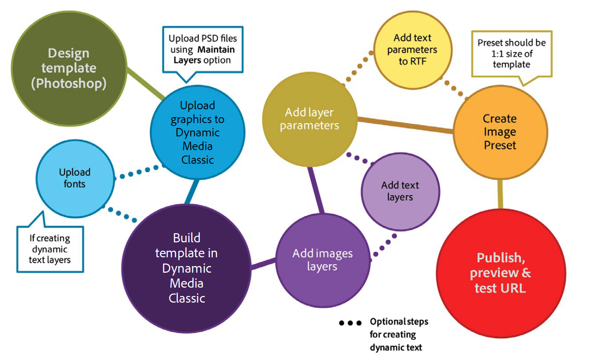
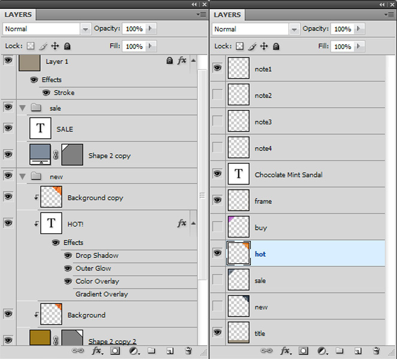

# 기본 템플릿 소개 {#basic-templates}

Dynamic Media Classic 용어에서 템플릿은 템플릿이 게시된 후 URL을 통해 동적으로 변경할 수 있는 문서입니다. Dynamic Media Classic에서는 이미지 서버에서 호출되는 이미지 기반 템플릿과 이미지 및 렌더링된 텍스트로 구성된 기본 템플릿을 제공합니다.

템플릿의 가장 강력한 측면 중 하나는 템플릿에 연결할 수 있는 직접 통합 지점이 있다는 것입니다. 따라서 이미지를 제공하고 크기를 조정할 수 있을 뿐만 아니라 데이터베이스를 쿼리하여 새 항목 또는 판매 항목을 찾아 이미지에 오버레이로 표시할 수 있습니다. 항목에 대한 설명을 요청할 수 있으며 해당 설명을 선택한 글꼴에 레이블로 표시할 수 있습니다. 무한한 가능성을 경험해 보십시오.

기본 템플릿은 단순에서 복잡까지 다양한 방법으로 구현할 수 있습니다. 예:

- 기본 상품 판매 해당 제품에 무료 배송 기능이 있는 경우 &quot;무료 배송&quot;과 같은 레이블을 사용합니다. 이러한 레이블은 Photoshop에 있는 상품 팀이 설정하며 웹은 로직을 사용하여 이미지에 이러한 레이블을 적용하는 시점을 파악합니다.
- 고급 상품 판매. 각 템플릿에는 여러 변수가 있으며 동시에 두 개 이상의 옵션이 표시될 수 있습니다. 데이터베이스, 재고 및 비즈니스 규칙을 사용하여 제품을 &quot;정가&quot;, &quot;재고&quot; 또는 &quot;매진&quot;으로 표시할 시기를 결정합니다. 또한 제품 뒤에 투명도를 사용하여 다른 회의실처럼 다른 배경에 표시할 수도 있습니다. 동일한 템플릿 및/또는 자산을 제품 세부 정보 페이지에서 재구성하여 동일한 제품의 더 큰 버전 또는 확대/축소할 수 있는 버전을 다양한 배경으로 표시할 수 있습니다.

Dynamic Media Classic은 이러한 템플릿 기반 애플리케이션의 시각적 부분만 제공한다는 것을 이해해야 합니다. Dynamic Media Classic 회사 또는 통합 파트너는 애플리케이션을 만들기 위해 비즈니스 규칙, 데이터베이스 및 개발 기술을 제공해야 합니다. &quot;기본 제공&quot; 템플릿 응용 프로그램이 없습니다.디자이너는 Dynamic Media Classic에서 템플릿을 설정하고 개발자는 URL 호출을 사용하여 템플릿의 변수를 변경합니다.

튜토리얼의 이 섹션 끝 부분에는 다음 방법을 알 수 있습니다.

- Photoshop PSD를 Dynamic Media Classic에 업로드하여 템플릿의 기초로 사용할 수 있습니다.
- 이미지 레이어로 구성된 간단한 머천다이징 기본 템플릿을 만듭니다.
- 텍스트 레이어를 추가하고 매개 변수를 사용하여 변수를 변경합니다.
- 템플릿 URL을 만들고 웹 브라우저를 통해 이미지를 동적으로 조작합니다.

>[!NOTE]
>
>이 장의 모든 URL은 실례만을 위한 것입니다.라이브 링크가 아닙니다.

## 기본 템플릿 개요

기본 템플릿의 정의(또는 간단한 &quot;템플릿&quot;만 해당)는 URL 주소 지정 가능한 레이어로 구성된 이미지입니다. 최종 결과는 이미지이지만 URL로 변경할 수 있습니다. Dynamic Media Classic에서 P-TIFF 에셋을 조합하여 사진, 텍스트 또는 그래픽으로 구성할 수 있습니다.

템플릿은 워크플로우와 유사한 기능을 제공하므로 Photoshop PSD 파일과 가장 유사합니다.

- 두 레이어는 모두 아세테이트 시트처럼 쌓여 있는 레이어로 구성되어 있다. 부분적으로 투명한 이미지를 합성하고 레이어의 투명한 영역을 통해 아래 레이어에 대해 확인할 수 있습니다.
- 레이어를 이동 및 회전하여 컨텐츠 위치를 변경할 수 있으며 불투명도 및 혼합 모드를 변경하여 컨텐츠를 부분적으로 투명하게 만들 수 있습니다.
- 텍스트 기반 레이어를 만들 수 있습니다. 이미지 서버가 Photoshop 및 Illustrator과 동일한 텍스트 엔진을 사용하기 때문에 품질이 매우 높을 수 있습니다.
- 간단한 레이어 스타일을 각 레이어에 적용하여 그림자 또는 광선과 같은 특수 효과를 만들 수 있습니다.

그러나 Photoshop PSD와 달리 레이어는 이미지 서버의 URL을 통해 완전히 동적이고 제어할 수 있습니다.

- 모든 템플릿 속성에 변수를 추가할 수 있으므로 신속하게 컴포지션을 손쉽게 변경할 수 있습니다.
- 매개 변수라는 변수를 사용하면 변경할 템플릿의 부분만 표시할 수 있습니다.

Photoshop에서와 같이 모든 레이어를 하나의 파일에 놓고 표시하거나 숨기는 대신 다양한 각 레이어에 대한 자리 표시자만 추가해야 합니다(원하는 경우 이 자리 표시자만 추가할 수 있음).

자리 표시자를 사용하면 레이어의 컨텐츠를 게시된 다른 에셋으로 동적으로 교체할 수 있으며, 레이어 크기가 바뀐 레이어와 동일한 속성(예: 크기 및 회전)이 자동으로 적용됩니다.

기본 템플릿은 일반적으로 Photoshop에서 설계되지만 URL을 통해 배포되므로 템플릿 프로젝트에서는 디자인과 기술 기술이 모두 혼합되어야 합니다. 일반적으로 크리에이티브 템플릿 작업을 수행하는 사람은 Photoshop 디자이너이고 템플릿을 구현하는 사람은 웹 개발자라고 가정합니다. 템플릿을 성공적으로 만들려면 크리에이티브 팀과 개발 팀이 긴밀하게 협력해야 합니다.

템플릿 프로젝트는 애플리케이션의 비즈니스 규칙 및 요구 사항에 따라 상대적으로 간단하거나 매우 복잡할 수 있습니다. 기본 템플릿은 이미지 서버에서 호출되지만 Dynamic Media Classic 환경의 유연성으로 인해 다른 템플릿 내에 템플릿을 중첩할 수 있으므로 일반적으로 이름이 지정된 변수에 의해 링크될 수 있는 매우 복잡한 이미지를 만들 수 있습니다.

- [템플릿 기본 사항](https://docs.adobe.com/content/help/en/dynamic-media-classic/using/template-basics/quick-start-template-basics.html)에 대해 자세히 알아보십시오.
- [기본 템플릿](https://docs.adobe.com/content/help/en/dynamic-media-classic/using/template-basics/creating-template.html#creating_a_template)을 만드는 방법을 알아봅니다.

## 기본 템플릿 만들기

기본 템플릿으로 작업할 때는 일반적으로 아래 다이어그램의 워크플로우 단계를 따릅니다. 동적 텍스트 레이어를 사용하는 경우 점선으로 표시된 단계는 선택 사항이며 아래 지침에 &quot;텍스트 워크플로우&quot;로 표시됩니다. 텍스트를 사용하지 않는 경우 기본 경로만 따르십시오.

_기본 템플릿 작업 과정입니다._

1. 에셋 디자인 및 제작 대부분의 사용자가 Adobe Photoshop에서 이 작업을 수행합니다. 축소판 페이지에 200픽셀 이미지를 적용하는 등 필요한 정확한 크기로 에셋을 디자인할 수 있으며 200픽셀로 디자인할 수 있습니다. 확대해야 하는 경우 약 2000픽셀의 크기로 디자인합니다. Photoshop(및/또는 비트맵으로 저장된 Illustrator)을 사용하여 에셋을 만들고 Dynamic Media Classic을 사용하여 부품을 조합하고 레이어를 관리하며 변수를 추가합니다.
2. 그래픽 에셋을 디자인한 후 Dynamic Media Classic에 업로드합니다. PSD에서 개별 에셋을 업로드하지 않고 Dynamic Media Classic에서 업로드할 때 **레이어 유지 관리** 옵션을 사용하여 레이어당 파일을 만드는 것이 좋습니다(자세한 내용은 아래 참조). _텍스트 워크플로우:동적 텍스트를 만드는 경우 글꼴도 업로드합니다. 동적 텍스트는 변수를 사용하며 URL을 통해 제어됩니다. 텍스트가 정적이거나 변경되지 않는 몇 개의 짧은 구문(예: X가 변수 번호인 &quot;X% Off&quot;가 아니라 &quot;New&quot; 또는 &quot;Sale&quot;이라고 하는 태그)만 있는 경우, Photoshop에서 텍스트를 미리 렌더링하고 래스터화된 레이어로 이미지로 업로드하는 것이 좋습니다. 간편해지며 텍스트 스타일을 원하는 대로 지정할 수 있습니다._
3. 작성 메뉴의 템플릿 기본 편집기를 사용하여 Dynamic Media Classic에서 템플릿을 만들고 이미지 레이어를 추가합니다. 텍스트 워크플로우:동일한 편집기에서 텍스트 레이어를 만들 수 있습니다. 이 단계는 Dynamic Media Classic에서 템플릿을 수동으로 작성할 때 필요합니다. 디자인과 일치하는 캔버스 크기를 선택하고 이미지를 캔버스로 드래그하여 놓고 레이어 속성(크기, 회전, 불투명도 등)을 설정할 수 있습니다. 템플릿에 모든 가능한 레이어를 추가하지 않고 이미지 레이어당 하나의 자리 표시자만 추가할 수 있습니다. _텍스트 워크플로우:Photoshop에서 텍스트 레이어를 만드는 것과 유사한 텍스트 툴을 사용하여 텍스트 레이어를 만듭니다. Photoshop 문자 툴과 동일한 옵션을 사용하여 글꼴을 선택하고 스타일을 지정할 수 있습니다._ 또 다른 워크플로우는 PSD를 업로드하고 Dynamic Media Classic에서 &quot;무료&quot; 템플릿을 생성하도록 하여 텍스트 레이어를 다시 만들 수 있습니다. 이 문제는 나중에 더 자세히 설명될 것입니다.
4. 레이어가 만들어지면 레이어의 소스(이미지 자체)를 비롯하여 URL을 통해 제어하려는 레이어의 모든 속성에 매개 변수(변수)를 추가합니다. _텍스트 워크플로우:또한 텍스트 레이어에 매개 변수를 추가하여 텍스트 컨텐츠와 레이어 자체의 크기 및 위치뿐만 아니라 글꼴 색상, 글꼴 크기, 가로 추적 등과 같은 모든 서식 옵션을 제어할 수 있습니다._
5. 템플릿 크기와 일치하는 이미지 사전 설정을 만듭니다. 템플릿을 항상 1:1 크기로 호출하고 템플릿에 맞게 크기가 조정되는 모든 큰 이미지 레이어에 선명하게 하기를 추가할 것을 권장합니다. 확대할 템플릿을 작성하는 경우 이 단계는 불필요합니다.
6. Dynamic Media Classic 미리 보기에서 URL을 게시하고 복사한 다음 브라우저에서 테스트합니다.

## Dynamic Media Classic에 템플릿 자산 준비 및 업로드

Dynamic Media Classic에 템플릿 자산을 업로드하기 전에 몇 가지 준비 단계를 완료해야 합니다.

### 업로드할 PSD 준비

Dynamic Media Classic에 Photoshop 파일을 업로드하기 전에 Photoshop의 레이어를 단순화하여 보다 손쉽게 작업할 수 있고 이미지 서버와 완벽하게 호환됩니다. PSD 파일은 Dynamic Media Classic에서 인식하지 못하는 많은 요소로 구성되는 경우가 많으며 관리하기가 어려운 작은 요소가 많을 수도 있습니다. 나중에 원본을 편집해야 하는 경우 마스터 PSD의 백업을 저장해야 합니다. 마스터가 아닌 간소화된 복사본을 업로드합니다.

1. 함께 켜거나 꺼야 하는 관련 레이어를 병합하여 레이어 구조를 간소화할 수 있습니다. 예를 들어 레이블 &quot;NEW&quot;와 파란색 배너가 하나의 레이어로 병합되므로 한 번의 클릭으로 표시하거나 숨길 수 있습니다.
   
2. 일부 레이어 유형 및 레이어 효과는 Dynamic Media Classic 또는 이미지 서버에서 지원되지 않으므로 업로드하기 전에 래스터화해야 합니다. 그렇지 않으면 효과가 무시되거나 레이어가 무시될 수 있습니다. 레이어를 래스터화하면 편집할 수 없는 상태로 전환해야 합니다. 레이어 효과 또는 텍스트 레이어를 래스터화하려면 빈 레이어를 만들고 모두 선택하고 **레이어 > 레이어 병합** 또는 CTRL + E/CMD + E를 사용하여 병합합니다.

   - Dynamic Media Classic에서는 레이어를 그룹화하거나 연결할 수 없습니다. 그룹 또는 연결된 세트의 모든 레이어는 더 이상 그룹화되거나 연결되어 있지 않은 개별 레이어로 변환됩니다.
   - 업로드 시 레이어 마스크가 투명도로 변환됩니다.
   - 조정 레이어는 지원되지 않으므로 무시됩니다.
   - 단색 레이어와 같은 칠 레이어는 래스터화됩니다.
   - 스마트 오브젝트 레이어와 벡터 레이어는 업로드 시 일반 이미지로 래스터화되며 스마트 필터는 적용 및 래스터화됩니다.
   - 텍스트 추출 옵션을 사용하지 않으면 텍스트 레이어도 래스터화됩니다. 자세한 내용은 아래를 참조하십시오.
   - 대부분의 레이어 효과는 무시되며 일부 혼합 모드만 지원됩니다. 확실하지 않은 경우 Dynamic Media Classic에서 간단한 효과(내부 또는 그림자, 내부 또는 외부 광선 등)를 추가하거나 빈 레이어를 사용하여 Photoshop에서 효과를 병합하고 래스터화할 수 있습니다.

### 글꼴을 사용한 작업

동적 텍스트를 생성해야 하는 경우 글꼴을 업로드하고 게시합니다. Dynamic Media Classic에 포함된 유일한 글꼴은 Arial입니다.

각 회사는 웹에서 글꼴을 사용할 수 있는 라이센스를 취득해야 합니다. 단순히 컴퓨터에 글꼴을 설치해도 웹에서 해당 글꼴을 상업적으로 사용할 수 있는 권한이 부여되지 않으며 허용 없이 해당 글꼴을 사용하는 경우 해당 업체에서 법적 조치를 취할 수 있습니다. 또한 라이선스 약관은 다양합니다. 예를 들어 인쇄 및 화면 표시를 위한 별도의 라이선스가 필요할 수 있습니다.

Dynamic Media Classic은 표준 OTF(OpenType), TrueType(TTF) 및 Type 1 Postscript 글꼴을 지원합니다. Mac 전용 슈트케이스 글꼴, 문자 컬렉션 파일, Windows 시스템 글꼴 및 전용 시스템 글꼴(예: 판독 또는 자수 시스템에서 사용되는 글꼴)은 모두 지원되지 않습니다. 이러한 글꼴을 표준 글꼴 포맷 중 하나로 변환하거나 Dynamic Media Classic 및 Image Server에서 사용할 유사한 글꼴로 대체해야 합니다.

다른 자산과 마찬가지로 글꼴이 Dynamic Media Classic에 업로드된 후 이미지 서버에도 게시되어야 합니다. 매우 일반적인 템플릿 오류는 글꼴을 게시하지 않는 경우 이미지 오류가 발생하여 이미지 서버가 대신 다른 글꼴을 대체하지 않습니다. 또한 업로드할 때 **텍스트 추출** 옵션을 사용하려면 해당 글꼴을 사용하는 PSD를 업로드하기 전에 글꼴 파일을 업로드해야 합니다. **텍스트 추출** 기능은 텍스트를 편집 가능한 텍스트 레이어로 다시 만들어 Dynamic Media Classic 템플릿 내에 배치합니다. 다음 항목인 PSD 옵션에서 설명합니다.

글꼴에는 외부 파일 이름과 다른 여러 개의 내부 이름이 있습니다. Dynamic Media Classic에서 해당 자산에 대한 세부 사항 페이지에서 서로 다른 모든 이름을 볼 수 있습니다. 다음은 Dynamic Media Classic의 메타데이터 탭 아래에 나열된 글꼴 Adobe Caslon Pro Semibold의 이름입니다.

_Dynamic Media Classic의 글꼴에 대한 세부 사항 페이지의 메타데이터 탭입니다._

Dynamic Media Classic에서는 이 글꼴(ACaslonPro-Semibold)의 파일 이름을 에셋 ID로 사용하지만 템플릿에서 사용하는 이름이 아닙니다. 템플릿은 하단에 나열된 서식 있는 텍스트 형식(RTF) 이름을 사용합니다. RTF는 이미지 서버 텍스트 엔진의 기본 &quot;언어&quot;입니다.

URL을 통해 글꼴을 변경해야 하는 경우 글꼴의 RTF 이름(에셋 ID가 아님)을 호출해야 합니다. 그렇지 않으면 오류가 발생합니다. 이 경우 이 글꼴의 올바른 이름은 &quot;Adobe Caslon Pro&quot;입니다. 아래의 Rtf 및 텍스트 매개 변수 주제의 글꼴 및 RTF에 대해 자세히 설명합니다.

Windows 및 Mac 시스템에서 발견되는 가장 일반적인 글꼴 파일 포맷은 OpenType 및 TrueType입니다. OpenType에는 .OTF 확장명이 있지만 TrueType은 .TTF입니다. 두 포맷 모두 Dynamic Media Classic에서 동일하게 잘 작동합니다.

### PSD 업로드 시 옵션 선택

템플릿을 만들기 위해 Photoshop 파일(PSD)을 업로드할 필요는 없습니다.템플릿은 Dynamic Media Classic의 모든 이미지 자산으로 작성할 수 있습니다. 그러나 PSD를 업로드하면 일반적으로 이러한 에셋이 레이어로 구성된 PSD에 이미 있으므로 보다 손쉽게 제작할 수 있습니다. 또한 레이어로 구성된 PSD를 업로드할 때 Dynamic Media Classic은 템플릿을 자동으로 생성합니다.

- **레이어 유지** 가장 중요한 선택입니다 그러면 Dynamic Media Classic에서 Photoshop 레이어당 하나의 이미지 자산을 만듭니다. 선택하지 않으면 다른 모든 옵션이 비활성화되고 PSD가 단일 이미지로 분리됩니다.
- **템플릿** **만들기를 참조하십시오.** 이 옵션을 사용하면 생성된 다양한 레이어를 가져와 결합하여 템플릿을 자동으로 만들 수 있습니다. 자동 생성된 템플릿을 사용할 때의 단점은 Dynamic Media Classic에서 모든 레이어를 하나의 파일에 배치하지만 레이어당 하나의 자리 표시자만 있으면 된다는 것입니다. 추가 레이어를 삭제하기가 쉽지만 레이어가 많으면 다시 만드는 것이 더 빠릅니다. 새 템플릿의 이름을 변경해야 합니다.그렇지 않은 경우 다음 번에 동일한 PSD를 다시 업로드할 때 덮어쓰기됩니다.
- **텍스트 추출.** 이렇게 하면 업로드한 글꼴을 사용하여 PSD의 텍스트 레이어를 템플릿의 텍스트 레이어로 다시 만들 수 있습니다. 텍스트가 Photoshop의 경로에 있고 템플릿에서 해당 경로를 유지하려는 경우 이 단계가 필요합니다. 추출된 텍스트는 업로드할 때 생성된 템플릿에서만 만들 수 있으므로 이 기능을 사용하려면 **템플릿 만들기** 옵션을 사용해야 합니다.
- **레이어를 배경 크기로 확장합니다.** 이 설정을 사용하면 각 레이어가 전체 PSD 캔버스와 동일한 크기로 만들어집니다. 이 기능은 항상 고정되어 있는 레이어에 매우 유용합니다.그렇지 않은 경우 이미지를 동일한 레이어로 변경하면 위치를 변경해야 할 수 있습니다.
- **레이어 이름 지정을 참조하십시오.** 이를 통해 Dynamic Media Classic에서 레이어별로 생성된 각 자산의 이름을 지정하는 방법을 알 수 있습니다. **Photoshop** **와 Layer** **이름** 또는 Photoshop 및 **Layer** **번호**&#x200B;를 권장합니다. 두 옵션 모두 PSD 이름을 이름의 첫 번째 부분으로 사용하고 끝에 레이어 이름이나 번호를 추가합니다. 예를 들어 &quot;shirt.psd&quot;라는 PSD가 있고 이름이 &quot;front&quot;, &quot;feely&quot; 및 &quot;collale&quot;인 레이어가 있는 경우 **Photoshop 및** Layer **Name** 옵션을 사용하여 업로드하면 Dynamic Media Classic에서 자산 ID의 &quot;shirt_front,&quot;&quot;shirt_feel, 및 &quot;and &quot;collay&quot;_colla&quot; 이러한 옵션 중 하나를 사용하면 Dynamic Media Classic에서 이름이 고유한지 확인할 수 있습니다.

## 이미지 레이어를 사용하여 템플릿 만들기

Dynamic Media Classic에서 레이어로 구성된 PSD에서 템플릿을 자동으로 만들 수 있지만 템플릿을 수동으로 만드는 방법을 알고 있어야 합니다. 위에서 설명한 것처럼 Dynamic Media Classic에서 만든 템플릿을 사용하지 않으려는 경우가 있습니다.

### 템플릿 기본 UI

먼저 편집 인터페이스에 대해 익숙해지도록 하겠습니다.

왼쪽 가운데에는 최종 템플릿의 미리 보기가 표시된 작업 영역이 있습니다. 오른쪽에는 레이어 및 레이어 속성 패널이 있습니다. 이 영역들은 여러분이 가장 많은 일을 할 곳입니다.

_템플릿 기본 만들기 페이지를 참조하십시오._

- **미리 보기/작업 영역.** 여기가 주 창가입니다 여기서는 마우스로 레이어를 이동, 크기 조정 및 회전할 수 있습니다. 레이어 윤곽선은 점선으로 표시됩니다.
- **레이어.** 이는 Photoshop 레이어 패널과 유사합니다. 템플릿에 레이어를 추가하면 여기에 표시됩니다. 레이어는 위에서 아래로 스택됩니다. 레이어 패널의 상단 레이어는 목록의 다른 레이어 위에 표시됩니다.
- **레이어 속성을 참조하십시오.** 여기서는 숫자 컨트롤을 사용하여 레이어의 모든 속성을 조정할 수 있습니다. 레이어를 선택한 다음 속성을 조정합니다.
- **합성** **URL.** UI 아래쪽에는 합성 URL 영역이 있습니다. 이 자습서는 설명되지 않지만, 여기에서 템플릿 목록이 일련의 이미지 제공 URL 수정자로 분석되는 것을 볼 수 있습니다. 이 영역은 편집할 수 있습니다. 이미지 서버 명령에 익숙한 경우 여기에서 템플릿을 수동으로 편집할 수 있습니다. 하지만 여러분도 그것을 깨뜨릴 수 있습니다. Photoshop과 마찬가지로 레이어 번호는 0부터 시작됩니다. 캔버스는 레이어 0이고 사용자가 추가하는 첫 번째 레이어는 레이어 1입니다. 혼합 모드는 레이어의 픽셀이 그 아래에 있는 픽셀과 어떻게 혼합되는지를 결정합니다. 혼합 모드를 사용하여 다양한 특수 효과를 만들 수 있습니다.

#### 템플릿 기본 편집기 사용

기본 템플릿을 시작하는 워크플로우 단계는 다음과 같습니다.

1. Dynamic Media Classic에서 **빌드 > 템플릿 기초**&#x200B;로 이동합니다. 선택한 항목이 없거나 이미지를 선택하여 시작할 수 있습니다. 이 이미지는 템플릿의 첫 번째 레이어가 됩니다.
2. 크기를 선택하고 **OK**&#x200B;을 누릅니다. 이 크기는 Photoshop에서 디자인한 크기와 일치해야 합니다. 템플릿 편집기가 로드됩니다.
3. 1단계에서 이미지를 선택하지 않은 경우 왼쪽의 자산 패널에서 이미지를 검색하거나 찾아 작업 영역으로 드래그합니다.

   - 캔버스 크기에 맞게 이미지 크기가 자동으로 조정됩니다. 고해상도 이미지를 교체하려는 경우 일반적으로 큰(2000px) P-TIFF 이미지 중 하나를 가져와 자리 표시자로 사용합니다.
   - 템플릿의 맨 아래 레이어여야 하지만 나중에 레이어의 순서를 바꿀 수 있습니다.

4. 작업 영역에서 바로 레이어의 크기를 조정하거나 위치를 변경할 수 있고 레이어 속성 패널에서 설정을 조정할 수 있습니다.
5. 필요에 따라 추가 이미지 레이어를 드래그합니다. 원할 경우 레이어 효과를 추가할 수 있습니다. 아래의 _레이어 효과 추가_ 항목을 참조하십시오.
6. **저장**&#x200B;을 클릭하고 위치를 선택한 다음 템플릿에 이름을 지정합니다. 미리 볼 수는 있지만 이 시점에서는 템플릿을 병합된 Photoshop 이미지와 동일하게 만들 수 있습니다. 아직 변경할 수 없습니다.

### 레이어 효과 추가

Image Server는 레이어 내용의 모양을 변경하는 특수 효과인 몇 가지 프로그래머틱 레이어 효과를 지원합니다. Photoshop의 레이어 효과와 유사하게 작동합니다. 레이어에 연결되지만 레이어와 독립적으로 제어됩니다. 레이어 자체를 영구적으로 변경하지 않고도 조정하거나 제거할 수 있습니다.

- **그림자**. x 및 y 픽셀 오프셋으로 배치된 레이어의 경계 외부에 그림자를 적용합니다.
- **내부 그림자**. x 및 y 픽셀 오프셋으로 배치된 레이어 경계 내에 그림자를 적용합니다.
- **외부 광선**. 레이어의 모든 가장자리에 균일하게 광선 효과를 적용합니다.
- **내부 광선**. 광선 효과를 레이어의 모든 가장자리 안에 균일하게 적용합니다.

_그림자와 그림자가 없는 레이어_

효과를 추가하려면 **효과 추가**&#x200B;를 클릭하고 메뉴에서 효과를 선택합니다. 일반 레이어와 마찬가지로 레이어 패널에서 효과를 선택하고 레이어 속성 패널을 사용하여 해당 설정을 조정할 수 있습니다.

그림자 효과는 레이어에서 가로 또는 세로로 오프셋되는 반면 광선 효과는 모든 방향으로 고르게 적용됩니다. 내부 효과는 레이어의 불투명 부분 위에 적용되지만 외부 효과는 투명 영역에만 영향을 줍니다.

[레이어 효과 추가](https://docs.adobe.com/content/help/en/dynamic-media-classic/using/template-basics/creating-template.html#using-shadow-and-glow-effects-on-layers)에 대해 자세히 알아보십시오.

### 매개 변수 추가

레이어를 결합하고 저장하는 것만으로, 분리된 Photoshop 이미지와 다를 바 없습니다. 템플릿을 특별하게 만드는 것은 각 레이어의 속성에 매개 변수를 추가하여 URL을 통해 동적으로 변경할 수 있는 기능입니다.

Dynamic Media Classic 용어에서 매개 변수는 URL을 통해 조작할 수 있도록 템플릿 속성에 연결할 수 있는 변수입니다. 레이어에 매개 변수를 추가하면 Dynamic Media Classic에서 해당 속성을 달러 기호($)로 매개 변수의 이름을 미리 수정하여 URL에 표시합니다. 예를 들어 &quot;size&quot;라는 매개 변수를 만들어 레이어의 크기를 변경하는 경우 Dynamic Media Classic에서는 매개 변수 $size의 이름을 변경합니다.

속성에 대한 매개 변수를 추가하지 않으면 해당 속성은 Dynamic Media Classic 데이터베이스에 숨겨져 있으며 URL에 표시되지 않습니다.

매개 변수가 없으면 URL이 훨씬 길어질 수 있습니다. 특히 동적 텍스트를 사용하는 경우 더욱 그러합니다. 텍스트는 각 URL에 수십 개의 추가 문자를 추가합니다.

마지막으로, 초기 매개 변수 세트가 템플릿의 속성 기본값이 됩니다. 템플릿을 만들고 매개 변수를 추가한 다음 매개 변수 없이 URL을 호출하는 경우 이미지 서버는 템플릿에 저장한 모든 기본값으로 이미지를 만듭니다. 매개 변수는 속성을 변경하려는 경우에만 필요합니다. 속성을 변경할 필요가 없으면 매개 변수를 설정할 필요가 없습니다.

#### 매개 변수 만들기

매개 변수를 만드는 워크플로우입니다.

1. 매개 변수를 만들 레이어의 이름 옆에 있는 **매개 변수** 단추를 클릭합니다. [매개 변수] 화면이 열립니다. 레이어에 있는 각 속성과 해당 값이 나열됩니다.
1. 매개 변수로 만들 각 속성의 이름 옆에 있는 **On** 옵션을 선택합니다. 기본 매개 변수 이름이 나타납니다. 기본 상태에서 변경된 속성에만 매개 변수를 추가할 수 있습니다.

   - 예를 들어 레이어를 추가하고 기본 xy 위치 0,0으로 유지하는 경우 Dynamic Media Classic에서는 **Position** 속성을 노출하지 않습니다. 수정하려면 레이어를 하나 이상 이동합니다. 이제 Dynamic Media Classic에서 매개 변수화할 수 있는 속성으로 **위치**&#x200B;가 표시됩니다.
   - 표시/숨기기 속성에 매개 변수를 추가하려면(레이어를 켜거나 끄는 경우) **표시** 또는 **레이어 숨기기** 아이콘을 클릭하여 레이어를 끕니다. 원하는 경우 나중에 다시 활성화할 수 있습니다.) 이제 Dynamic Media Classic에서 매개 변수화할 수 있는 **Hide** 속성이 표시됩니다.

1. 기본 매개 변수 이름을 URL에서 쉽게 식별할 수 있는 이름으로 변경합니다. 예를 들어 매개 변수를 추가하여 이미지 위에 있는 배너 레이어를 변경하려면 기본 이름 &quot;layer_2_src&quot;를 &quot;banner&quot;로 변경합니다.
1. **Close**&#x200B;을 눌러 [매개 변수] 화면을 종료합니다.
1. **매개 변수** 단추를 클릭하고 매개 변수를 추가 및 변경하여 다른 레이어에 대해 이 프로세스를 반복합니다.
1. 완료되면 변경 내용을 저장합니다.

>[!TIP]
>
>매개 변수의 이름을 의미 있는 이름으로 바꾸고 이름 지정 규칙을 개발하여 이러한 이름을 표준화합니다. 디자인 팀과 개발 팀 모두 미리 명명 규칙에 동의해야 합니다.
>
>속성이 없으므로 매개 변수를 추가할 수 없습니다. 이동, 크기 조정, 숨기기 등을 통해 레이어의 속성을 기본값에서 변경하면 됩니다. 이제 해당 속성이 노출되어 있는 것을 볼 수 있습니다.

[템플릿 매개 변수](https://docs.adobe.com/content/help/en/dynamic-media-classic/using/template-basics/creating-template-parameters.html)에 대해 자세히 알아보십시오.

## 텍스트 레이어를 사용하여 템플릿 만들기

텍스트 레이어를 포함하는 기본 템플릿을 만드는 방법을 살펴봅니다.

### 동적 텍스트 이해

이제 이미지 레이어를 사용하여 기본 템플릿을 만드는 방법을 알 수 있습니다. 많은 애플리케이션에서 필요한 모든 기능을 제공합니다. 이전 연습에서 보듯이 텍스트(&quot;세일&quot; 및 &quot;새로운 기능&quot; 등)가 간단한 레이어를 래스터화하여 변경할 필요가 없으므로 이미지로 처리할 수 있습니다.

그러나 필요한 경우 다음을 수행합니다.

- 25%의 값을 변수로 하여 &quot;25% 할인&quot;이라고 할 레이블을 추가합니다.
- 이미지 상단에 제품 이름이 있는 텍스트 레이블 추가
- 템플릿이 표시되는 국가에 따라 레이어를 다른 언어로 현지화합니다.

이 경우 텍스트 및/또는 서식을 제어할 수 있도록 매개 변수를 사용하여 동적 텍스트 레이어를 몇 개 추가해야 합니다.

텍스트를 만들려면 일부 글꼴을 업로드해야 합니다. 그렇지 않으면 Dynamic Media Classic이 기본적으로 Arial로 설정됩니다. 글꼴을 이미지 서버에 게시해야 합니다. 그렇지 않으면 해당 글꼴을 사용하는 텍스트를 렌더링하려고 하면 오류가 발생합니다.

### RTF 및 텍스트 매개 변수

템플릿 기본 도구를 사용하여 텍스트에 변수를 추가하려면 텍스트가 어떻게 렌더링되는지 이해해야 합니다. 이미지 서버는 Photoshop 및 Illustrator에서 사용하는 동일한 엔진인 Adobe 텍스트 엔진을 사용하여 텍스트를 생성하고 최종 이미지에서 레이어로 합성합니다. 엔진과 통신하기 위해 이미지 서버는 [서식 있는 텍스트 형식] 또는 [RTF]를 사용합니다.

RTF는 문서 서식을 지정하기 위해 Microsoft에서 개발한 파일 형식 사양입니다. 대부분의 워드 프로세싱 및 이메일 소프트웨어에서 사용되는 표준 마크업 언어입니다. URL &amp;text=\b1 Hello에 로그인하면 \b1은 텍스트를 굵게 만드는 RTF 명령이므로 이미지 서버에서 &quot;Hello&quot;라는 단어가 굵게 표시된 이미지를 생성합니다.

좋은 소식은 Dynamic Media Classic에서 RTF를 생성한다는 것입니다. 템플릿에 텍스트를 입력하고 서식을 추가할 때마다 Dynamic Media Classic에서는 RTF 코드를 템플릿에 자동으로 기록합니다. 매개 변수를 RTF 자체에 직접 추가하게 되므로 익숙한 것이 중요합니다.

#### 텍스트 레이어 만들기

다음 두 가지 방법으로 Dynamic Media Classic에서 템플릿에서 텍스트 레이어를 만들 수 있습니다.

1. Dynamic Media Classic의 텍스트 도구입니다. 이 방법은 아래에 설명되어 있습니다. 템플릿 기본 편집기에는 텍스트 상자를 만들고 텍스트를 입력하고 텍스트 서식을 지정할 수 있는 도구가 있습니다. Dynamic Media Classic에서는 필요에 따라 RTF를 생성하여 별도의 레이어에 배치합니다.
2. 텍스트 추출(업로드 시). 다른 방법은 Photoshop에서 텍스트 레이어를 만들어 PSD에 일반 텍스트 레이어로 저장하는 것입니다(이미지 레이어로 래스터화하는 대신). 그런 다음 파일을 Dynamic Media Classic에 업로드하고 **텍스트 추출** 옵션을 사용합니다. Dynamic Media Classic에서는 RTF 명령을 사용하여 각 Photoshop 텍스트 레이어를 이미지 제공 텍스트 레이어로 변환합니다. 이 방법을 사용하는 경우 먼저 글꼴을 Dynamic Media Classic에 업로드해야 합니다. 그렇지 않으면 업로드 시 Dynamic Media Classic에서 기본 글꼴로 대체되므로 올바른 글꼴을 다시 대체할 수 있는 손쉬운 방법이 없습니다.

### 텍스트 편집기

텍스트 편집기를 사용하여 텍스트를 입력합니다. 텍스트 편집기는 Photoshop 또는 Illustrator과 유사한 서식 지정 컨트롤을 사용하여 텍스트를 입력하고 서식을 지정할 수 있는 WYSIWYG 인터페이스입니다.

_템플릿 기본 텍스트 편집기를 참조하십시오._

**미리 보기** 탭에서 대부분의 작업을 수행합니다. 이 탭에서는 텍스트를 입력하고 템플릿에서 보이는 대로 표시할 수 있습니다. 필요한 경우 RTF를 수동으로 편집하는 데 사용되는 **소스** 탭도 있습니다.

일반 작업 과정은 **미리 보기** 탭을 사용하여 일부 텍스트를 입력하는 것입니다.

텍스트를 선택하고 상단에 있는 컨트롤을 사용하여 글꼴 색상, 글꼴 크기 또는 양쪽 맞춤과 같은 일부 서식을 선택합니다. 텍스트가 원하는 방식으로 스타일이 지정된 후 **적용**&#x200B;을 클릭하여 작업 영역 미리 보기에서 업데이트를 확인합니다. 그런 다음 텍스트 편집기를 닫고 템플릿 기본 창으로 돌아갑니다.

#### 텍스트 편집기 사용

템플릿 기본 작성 페이지 내에 텍스트를 추가하는 워크플로우 단계는 다음과 같습니다.

1. 빌드 페이지 맨 위에 있는 **텍스트** 도구 단추를 클릭합니다.
2. 텍스트를 표시할 텍스트 상자를 드래그합니다. 텍스트 편집기 창이 모달 창에 열립니다. 백그라운드에서 템플릿이 표시되지만 텍스트 편집이 완료될 때까지 편집할 수 없습니다.
3. 템플릿을 처음 로드할 때 표시할 샘플 텍스트를 입력합니다. 예를 들어, 개인화된 이메일 이미지에 대한 텍스트 상자를 만드는 경우 텍스트는 &quot;Hi Name&quot;으로 표시될 수 있습니다. 이제 비용을 절감할 수 있습니다.&quot; 나중에 텍스트 매개 변수를 추가하여 이름을 URL에서 전송하는 값으로 바꿉니다. 텍스트는 **적용**&#x200B;을 클릭해야 창 아래에 있는 템플릿에 표시되지 않습니다.
4. 텍스트의 서식을 지정하려면 마우스로 드래그하여 선택하고 UI에서 서식 컨트롤을 선택합니다.

   - 다양한 서식 옵션이 있습니다. 가장 일반적인 글꼴(얼굴), 글꼴 크기 및 글꼴 색뿐만 아니라 왼쪽/가운데/오른쪽 맞춤도 있습니다.
   - 텍스트를 먼저 선택하십시오. 그렇지 않으면 서식을 적용할 수 없습니다.
   - 다른 글꼴을 선택하려면 텍스트를 선택하고 글꼴 메뉴를 여십시오. 편집기에는 Dynamic Media Classic에 업로드된 모든 글꼴의 목록이 표시됩니다. 글꼴이 컴퓨터에 설치되어 있는 경우 검정색으로 표시됩니다. 컴퓨터에 설치되어 있지 않으면 빨간색으로 표시됩니다. 그러나 **적용**&#x200B;을 클릭해도 미리 보기 창에서 렌더링됩니다. Dynamic Media Classic을 사용하는 모든 사람이 글꼴을 사용할 수 있도록 하려면 글꼴을 Dynamic Media Classic에 업로드하기만 하면 됩니다. 게시하면 이미지 서버가 이러한 글꼴을 사용하여 텍스트를 생성합니다. 사용자는 이미지의 일부이므로 텍스트를 보기 위해 글꼴을 설치할 필요가 없습니다.
   - Photoshop 및 Illustrator과 달리 이미지 서버는 텍스트 상자에서 텍스트를 세로로 정렬할 수 있습니다. 기본값은 위쪽 정렬입니다. 텍스트를 변경하려면 텍스트를 선택하고 **세로 정렬** 메뉴에서 **중간** 또는 **아래쪽**&#x200B;을 선택합니다.
   - 텍스트를 상자에 비해 너무 크게 만들거나 텍스트 상자가 너무 작으면 전체 또는 일부가 잘리고 사라집니다. 글꼴 크기를 줄이거나 상자를 크게 만듭니다.

5. 작업 영역 창에서 변경 사항을 적용하려면 **적용**&#x200B;을 클릭합니다. **적용**&#x200B;을 클릭해야 합니다. 그렇지 않으면 편집한 내용을 잃게 됩니다.
6. 완료되면 **닫기**&#x200B;를 클릭합니다. 편집 모드로 돌아가려면 텍스트 레이어를 두 번 클릭하여 텍스트 편집기를 다시 엽니다.

시스템에 글꼴을 로컬로 설치하면 텍스트 편집기는 글꼴 크기를 정확하게 미리 볼 수 있습니다.

### 텍스트 레이어에 매개 변수 추가 정보

이제 레이어 매개 변수에서 수행한 것처럼 텍스트 매개 변수를 추가하는 유사한 프로세스를 따릅니다. 텍스트 레이어는 크기, 위치 등에 대한 레이어 매개 변수를 가져올 수도 있습니다.그러나 RTF의 모든 측면을 제어할 수 있는 추가 매개 변수를 사용할 수도 있습니다.

레이어 매개 변수와 달리 변경할 값만 선택하고 전체 속성에 매개 변수를 추가하는 대신 매개 변수를 추가합니다.

샘플 RTF:

RTF를 검사할 때 각 설정을 변경할 위치를 파악해야 합니다. 위의 RTF에서는 일부 서식이 의미가 있을 수 있으며 서식 지정 위치를 확인할 수 있습니다.

여러분은 초콜릿 민트 샌달이라는 문구를 볼 수 있습니다. 그것은 텍스트 그 자체입니다.

- Poor Richard 글꼴에 대한 참조가 있습니다. 여기서 글꼴이 선택됩니다.
- RGB 값을 볼 수 있습니다.\red56\green53\blue4 — 텍스트 색상입니다.
- 글꼴 크기가 20이지만 20이라는 숫자는 보이지 않습니다. 그러나 \fs40 명령은 표시되지만 특별한 이유로 글꼴을 반점으로 측정합니다. 따라서 \fs40은 글꼴 크기입니다!

매개 변수를 만드는 데 충분한 정보가 있지만 이미지 제공 설명서에는 모든 RTF 명령에 대한 전체 참조가 있습니다. [이미지 제공 문서](https://docs.adobe.com/content/help/en/dynamic-media-developer-resources/image-serving-api/image-serving-api/http-protocol-reference/text-formatting/c-text-formatting.html#concept-0d3136db7f6f49668274541cd4b6364c)를 방문하십시오.

#### 텍스트 레이어에 매개 변수 추가

텍스트 레이어에 매개 변수를 추가하는 단계는 다음과 같습니다.

1. 매개 변수를 만들 텍스트 레이어의 이름 옆에 있는 **매개 변수** 단추(&quot;P&quot;)를 클릭합니다. [매개 변수] 화면이 열립니다. **공통** 탭에는 레이어의 각 속성과 해당 값이 나열됩니다. 일반 레이어 매개 변수를 추가할 수 있습니다.
1. **텍스트** 탭을 클릭합니다. 여기 상단에 RTF가 보입니다.추가한 매개 변수는 그 아래에 있습니다.
1. 매개 변수를 추가하려면 먼저 변경할 값을 강조 표시하고 **매개 변수 추가** 단추를 클릭합니다. 전체 명령 자체가 아닌 명령에 대한 값만 선택해야 합니다. 예를 들어 위의 샘플 RTF에서 글꼴 이름의 매개 변수를 설정하려면 &quot;Poor Richard&quot;만 강조 표시하고 매개 변수를 추가하지만 &quot;\f0&quot;은(는) 추가하지 않습니다. **매개 변수 추가**&#x200B;를 클릭하면 아래 목록에 표시되고 매개 변수 값이 선택된 상태에서 RTF에 빨간색으로 표시됩니다. 매개 변수를 제거해야 하는 경우 **On** 옆의 확인란을 클릭하여 해당 매개 변수를 해제하면 해당 매개 변수가 사라집니다.
1. 을 클릭하여 매개 변수의 이름을 더 의미 있는 이름으로 변경합니다.
1. 완료되면 매개 변수가 있는 RTF가 녹색으로 강조 표시되고 매개 변수 이름과 값이 아래에 나열됩니다.
1. **닫기**&#x200B;를 클릭하여 매개 변수 화면을 종료합니다. 그런 다음 **저장**&#x200B;을 눌러 템플릿을 저장합니다. 편집을 마친 경우 **Close**&#x200B;를 눌러 템플릿 기본 페이지를 종료합니다.
1. **미리 보기**&#x200B;를 클릭하여 Dynamic Media Classic에서 템플릿을 테스트합니다. 텍스트 매개 변수를 테스트하려면 미리 보기 창에 새 텍스트 또는 새 값을 입력합니다. 글꼴을 변경하려면 글꼴의 정확한 RTF 이름을 입력해야 합니다.

>[!TIP]
>
>텍스트 색상에 매개 변수를 추가하려면 빨간색, 녹색 및 파란색에 대한 매개 변수를 별도로 추가하십시오. 예를 들어 RTF가 `\red56\green53\blue46`인 경우 56, 53 및 46값에 대해 별도의 빨강, 녹색 및 파랑 매개 변수를 추가합니다. URL에서 세 가지 모두를 호출하여 색상을 변경합니다.`&$red=56&$green=53&$blue=46`.

[동적 텍스트 매개 변수 만들기](https://docs.adobe.com/content/help/en/dynamic-media-classic/using/template-basics/creating-template-parameters.html#creating-dynamic-text-parameters) 방법을 알아봅니다.

## 템플릿 URL 게시 및 만들기

### 이미지 사전 설정 만들기

템플릿의 사전 설정을 만드는 것은 필수 단계가 아닙니다. 템플릿을 항상 1:1 크기로 호출하고 템플릿에 맞게 크기가 조정되는 큰 이미지 레이어에 선명하게 하기 기능을 추가하는 것이 가장 좋습니다. 사전 설정 없이 이미지를 호출하면 이미지 서버가 이미지의 크기를 기본 크기(약 400픽셀)로 임의로 변경할 수 있으며 기본 선명하게 하기는 적용되지 않습니다.

템플릿의 이미지 사전 설정에 대한 특별한 것은 없습니다. 동일한 크기의 정적 이미지에 대한 사전 설정이 이미 있는 경우 대신 사용할 수 있습니다.

### 게시

Image Server로 푸시된 변경 내용을 보려면 게시를 실행해야 합니다. 게시해야 할 사항:다양한 이미지 에셋 레이어, 동적 텍스트에 대한 글꼴 및 템플릿 자체 이미지 세트 및 스핀 세트와 같은 다른 Dynamic Media Classic 리치 미디어 에셋과 유사한 기본 템플릿은 일련의 이미지 제공 명령을 사용하여 이미지 및 글꼴을 참조하는 데이터베이스의 라인 항목입니다. 따라서 템플릿을 게시하면 이미지 서버의 데이터를 업데이트하는 것이 됩니다.

[템플릿 게시](https://docs.adobe.com/content/help/en/dynamic-media-classic/using/template-basics/publishing-templates.html)에 대해 자세히 알아보십시오.

### 템플릿 URL 구성

기본 템플릿은 앞에서 설명한 일반적인 이미지 호출과 동일한 필수 URL 구문을 갖습니다. 템플릿에는 일반적으로 값이 있는 매개 변수와 같이 앰퍼샌드(&amp;)로 구분된 명령 등 더 많은 수정자가 있습니다. 하지만 주요 차이점은 정적 이미지를 호출하는 대신 기본 이미지로 템플릿을 호출하는 것입니다.

사전 설정 이름 양쪽에 달러 기호($)가 있는 이미지 사전 설정과 달리 매개 변수에는 시작 부분에 단일 달러 기호가 있습니다. 그 달러 기호의 배치가 중요합니다.

**정답:**

`$text=46-inch LCD HDTV`

**틀림:**

`$text$=46-inch LCD HDTV`

`$text=46-inch LCD HDTV$`

`text=46-inch LCD HDTV`

앞에서 설명한 바와 같이, 매개 변수는 템플릿을 변경하는 데 사용됩니다. 매개 변수 없이 템플릿을 호출하면 템플릿 기본 작성 도구에서 디자인된 기본 설정으로 돌아갑니다. 속성을 변경할 필요가 없으면 매개 변수를 설정할 필요가 없습니다.

_이미지매개 변수(위)를 설정하지 않고 매개 변수를 사용한 템플릿의 예(아래)._
