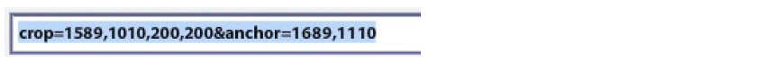

# 자르기, 조정된 이미지 및 확대/축소 Target {#crop-adjusted-zoom-targets}

Dynamic Media Classic 마스터 이미지 개념의 주요 강점 중 하나는 여러 용도로 이미지 에셋을 재활용할 수 있다는 것입니다. 일반적으로 세부 정보 또는 견본을 표시하기 위해 각 이미지의 잘린 버전을 별도로 만들어야 합니다. Dynamic Media Classic을 사용하는 경우 단일 마스터에서 동일한 작업을 수행하고, 잘린 버전을 새 실제 파일로 저장하거나 스토리지 공간이 없는 가상 파생물로 저장할 수 있습니다.

이 자습서 섹션이 끝날 때까지 다음 방법을 알 수 있습니다.

- Dynamic Media Classic에서 이미지를 자르고 새 마스터 파일 또는 가상 이미지로 저장합니다. [자세히 알아보기](https://experienceleague.adobe.com/docs/dynamic-media-classic/using/master-files/cropping-image.html).
- 가상 조정된 이미지를 저장하고 마스터 자산 대신 사용합니다. [자세히 알아보기](https://experienceleague.adobe.com/docs/dynamic-media-classic/using/master-files/adjusting-image.html).
- 이미지에 [확대/축소] Target을 만들어 강조 표시를 표시합니다. [자세히 알아보기](https://experienceleague.adobe.com/docs/dynamic-media-classic/using/zoom/creating-zoom-targets-guided-zoom.html).

## 자르기

Dynamic Media Classic에는 자르기 도구를 포함하여 UI에서 편리하게 사용할 수 있는 몇 가지 이미지 편집 도구가 있습니다. 여러 가지 이유로 Dynamic Media Classic 내에서 마스터 이미지를 자를 수 있습니다. 예:

- 원본 파일에 대한 액세스 권한이 없습니다. 자르기 비율이나 종횡비가 다른 이미지를 표시하려고 하지만 컴퓨터에 원본 파일이 없거나 집에서 작업하고 있습니다. 이 경우 Dynamic Media Classic으로 이동하여 이미지를 찾은 다음 자르거나 새 버전으로 저장할 수 있습니다.
- 불필요한 공백을 제거합니다. 이미지는 너무 많은 화이트 스페이스로 촬영되어 제품이 작아 보입니다. 썸네일 이미지가 캔버스를 최대한 채우도록 합니다.
- 조정된 이미지를 만들려면 디스크 공간이 없는 이미지의 가상 복사본을 만듭니다. 일부 회사에는 동일한 이미지에 대해 다른 이름의 사본을 별도로 보관해야 하는 비즈니스 규칙이 있습니다. 또는 동일한 이미지를 자르고 자르지 않은 버전으로 만들 수도 있습니다.
- 소스 이미지에서 새 이미지를 만듭니다. 예를 들어 색상 견본이나 기본 이미지의 세부 사항을 만들 수 있습니다. Adobe Photoshop에서 이 작업을 수행하고 별도로 업로드하거나 Dynamic Media Classic의 자르기 도구를 사용할 수 있습니다.

>[!NOTE]
>
>자르기에 대한 다음 논의의 모든 URL은 설명 목적으로만 사용되며 라이브 링크가 아닙니다.

### 자르기 도구 사용

Dynamic Media Classic의 자르기 도구는 에셋에 대한 세부 정보 페이지에서 액세스하거나 **편집** 단추를 클릭합니다. 이 도구를 사용하여 다음 두 가지 방법으로 자를 수 있습니다.

- 자르기 창의 핸들을 드래그하거나 [크기] 상자에 값을 입력하는 기본 자르기 모드입니다. 방법 알아보기 [수동 자르기](https://experienceleague.adobe.com/docs/dynamic-media-classic/using/master-files/cropping-image.html#select-an-area-to-crop).
- 트림. 이미지와 일치하지 않는 픽셀 수를 계산하여 이미지 주위의 추가 공백을 제거하려면 이 옵션을 사용하십시오. 방법 알아보기 [트리밍을 통한 자르기](https://experienceleague.adobe.com/docs/dynamic-media-classic/using/master-files/cropping-image.html#crop-to-remove-white-space-around-an-image).

### _수동 자르기_

수동으로 자른 버전을 저장하면 이미지가 영구적으로 잘린 것으로 표시됩니다. Dynamic Media Classic은 실제로 이미지를 자를 내부 URL 수정자를 추가하여 픽셀을 숨깁니다. 게시할 때 이미지가 잘리는 것으로 모든 사람에게 표시되지만 나중에 자르기 편집기로 돌아가서 자르기 제거를 수행할 수 있습니다.

그런 다음 새 기본 이미지로 저장할지 마스터의 추가 보기로 저장할지 선택할 수 있습니다. 새 마스터는 스토리지 공간을 차지하는 새로운 물리적 파일(예: TIFF 또는 JPEG)입니다. 추가 보기는 서버 공간을 차지하지 않는 가상 이미지입니다. 마스터를 덮어쓰고 자르기를 영구화하므로 원본 바꾸기를 선택하지 않는 것이 좋습니다. 새 마스터 또는 추가 보기로 저장하는 경우 새 자산 ID를 선택해야 합니다. 다른 에셋 ID와 마찬가지로 Dynamic Media Classic에서 고유한 이름이어야 합니다.

### _자르기 트리밍_

이미지의 주 제목 주위에 너무 많은 공백(추가 캔버스)이 있는 이미지를 업로드하면 크기를 조정할 때 웹에서 훨씬 작게 보입니다. 150픽셀 이하의 축소판 이미지의 경우 특히 그렇습니다. 사진 주제가 주변의 모든 추가 공간에서 손실될 수 있습니다.

동일한 이미지의 이 두 버전을 비교합니다.

오른쪽에 있는 이미지는 제품 주변의 여분의 공간을 제거하여 훨씬 더 눈에 띄게 만듭니다. 트리밍은 자르기 도구를 사용하여 한 번에 하나의 이미지를 만들거나 업로드할 때 일괄 처리 프로세스로 실행할 수 있습니다. 모든 이미지를 기본 주체의 경계까지 일관되게 자르려면 일괄 처리 프로세스로 실행하는 것이 좋습니다. 자르기는 테두리 상자(이미지를 둘러싸는 사각형)로 자릅니다.

>[!NOTE]
>
>트리밍을 해도 이미지 주위에 투명도가 만들어지지 않습니다. 이를 위해 이미지에 클리핑 패스를 포함하고 **클립 경로에서 마스크 만들기** 업로드 옵션입니다.
>
>또한 를 사용했을 때 이미지를 잘라낸 후 원래 상태로 복원하려면 **저장** 옵션을 선택하고 자르기 편집기 화면에 이미지를 표시한 다음 **재설정** 단추를 클릭합니다.

### _업로드 시 자르기_

앞에서 언급했듯이 업로드할 때 이미지를 자르도록 선택할 수도 있습니다. 업로드 시 트림 자르기를 사용하려면 **작업 옵션** 버튼을 클릭하고 자르기 옵션에서 **트림**.

Dynamic Media Classic은 다음 업로드를 위해 이 옵션을 기억합니다. 이 업로드에 대한 이미지를 자를 수 있지만 모든 업로드에 대해 자르지 않도록 할 수도 있습니다. 또 다른 옵션은 특별히 예약된 FTP 업로드 작업을 설정하고 여기에 자르기 옵션을 배치하는 것입니다. 이렇게 하면 이미지를 자를 필요가 있을 때만 작업을 실행할 수 있습니다.

>[!IMPORTANT]
>
>업로드에 대해 자르기를 설정하는 경우, Dynamic Media Classic은 다음에 해당 설정을 기억하도록 쿠키를 추가합니다. 우수 사례로서, **회사 기본값으로 재설정** 다음 업로드 전에 버튼을 클릭하여 마지막 업로드에서 남은 자르기 옵션을 지웁니다. 그렇지 않으면 실수로 다음 이미지 배치를 자를 수 있습니다.

### URL로 자르기

Dynamic Media Classic에서는 명확하지 않지만 URL을 통해 순수하게 자를 수도 있습니다(또는 이미지 사전 설정에 자르기 추가).

자르기 도구를 사용할 때마다 맨 아래 필드에 URL 값이 표시됩니다. 이러한 값을 가져와 이미지에 URL 수정자로 직접 적용할 수 있습니다.

_자르기 편집기 하단의 자르기 명령 수정자_

트리밍으로 자르기를 사용할 때는 이미지별로 크기를 계산해야 하므로 URL을 통해 자동화할 수 없습니다. 트림 자르기는 업로드 시 또는 한 번에 하나의 이미지만 적용하여 실행할 수 있습니다.

### _이미지 사전 설정에서 자르기_

이미지 사전 설정에는 추가 이미지 제공 명령을 추가할 수 있는 필드가 있습니다. 이미지 사전 설정에 위와 동일한 자르기를 추가하려면 사전 설정을 편집하고 URL 수정자 필드에 값을 입력하거나 붙여넣은 다음 저장하고 게시합니다.

_이미지 사전 설정의 URL 수정자에 자르기 명령(또는 명령)을 추가합니다._

자르기 는 이제 해당 이미지 사전 설정의 일부이며 사용될 때마다 자동으로 적용됩니다. 물론 이 방법은 동일한 자르기 양을 필요로 하는 모든 이미지에 따라 다릅니다. 이미지가 동일한 방식으로 모두 촬영되지 않으면 이 방법이 작동하지 않습니다.

## 조정된 이미지

자르기 도구를 사용하는 경우 다음과 같은 옵션이 제공됩니다. **기본의 추가 보기로 저장**. 저장하면 새로운 종류의 Dynamic Media Classic 에셋(조정된 이미지)이 만들어집니다. [조정된 이미지]는 도함수라고도 하며 가상 이미지입니다. 실제 이미지는 아닙니다. 실제 마스터 이미지에 대한 데이터베이스 참조(예: 별칭 또는 바로 가기)입니다.

### 진짜 이미지를 띄워주시겠어요`?`

누가 마스터이고 어떤 것이 조정된 이미지인지 알 수 있습니까?

Dynamic Media Classic을 보고 SBR_MAIN2에 대한 &quot;조정된 이미지&quot;의 에셋 유형을 보지 않고는 알 수 없습니다.

조정된 이미지는 데이터베이스에 라인 항목으로만 존재하므로 디스크 공간을 사용하지 않습니다. 또한 원본 에셋에 영구적으로 연결되어 있습니다. 원본이 삭제되면 조정된 이미지도 삭제됩니다. 자르지 않은 전체 이미지나 이미지의 일부(자르기)로 구성할 수 있습니다.

일반적으로 [자르기 도구]를 사용하여 조정된 이미지를 만들 수 있지만 [조정] 및 [선명] 도구인 다른 이미지 편집기에서도 만들 수 있습니다.

조정된 이미지에는 고유한 자산 ID가 필요합니다. 게시되면(다른 에셋처럼 게시해야 함) 다른 이미지로 작동하며 에셋 ID로 URL에서 호출됩니다. 세부 사항 페이지의 아래에서 마스터 이미지와 연관된 조정된 이미지를 볼 수 있습니다. **빌드 및 파생** 탭.

_마스터 이미지 ASIAN_BR_MAIN에 대해 조정된 보기_

## 확대/축소 Target

확대/축소 Target은 **편집** 메뉴 및 **세부 사항** 이미지의 페이지입니다. 이를 통해 &quot;핫스팟&quot;을 설정하여 확대/축소 이미지의 특정 머천다이징 기능을 강조 표시할 수 있습니다. 확대/축소 뷰어는 큰 마스터를 잘라서 별도의 이미지를 만드는 대신 사용자가 만드는 짧은 레이블과 함께 이미지 위에 세부 정보를 제공할 수 있습니다.

Zoom Target은 기본적으로 머천다이징 기능이며 제품의 판매 지점에 대한 지식이 필요하므로 일반적으로 회사의 머천다이징 또는 제품 팀의 사람이 만들 수 있습니다.

이 프로세스는 매우 간단합니다. 기능을 클릭하고 수사적 이름을 지정한 다음 저장합니다. Target이 유사한 경우 한 이미지에서 다른 이미지로 복사할 수 있지만, 이 프로세스는 수동입니다. Dynamic Media Classic에서는 각 이미지가 서로 다르고 다양한 기능을 가지므로 확대/축소 Target 생성을 자동화할 방법이 없습니다.

확대/축소 Target 사용 여부를 결정하는 또 다른 요소는 뷰어를 선택하는 것입니다. 일부 뷰어 유형에서는 확대/축소 Target을 표시할 수 없습니다(예: 플라이아웃 뷰어가 이를 지원하지 않음).

방법 알아보기 [확대/축소 Target 만들기](https://experienceleague.adobe.com/docs/dynamic-media-classic/using/zoom/creating-zoom-targets-guided-zoom.html#creating-and-editing-zoom-targets).

### 확대/축소 Target 도구 사용

다음은 Dynamic Media Classic에서 대상을 만드는 워크플로우입니다.

1. 이미지를 찾은 다음 **편집** 단추 및 선택 **확대/축소 Target**.
2. 확대/축소 Target 편집기가 로드됩니다. 중간 부분에 이미지가 표시되고, 맨 위에 일부 버튼이 있으며, 오른쪽에는 빈 타겟 패널이 있습니다. 왼쪽 하단에 뷰어 사전 설정이 선택되어 있습니다. 기본값은 &quot;Zoom1-Guided&quot;입니다.
3. 마우스로 빨간색 상자를 이동하고 클릭하여 새 대상을 만듭니다.

   - 빨간색 상자는 대상 영역입니다. 사용자가 해당 대상을 클릭하면 상자 안의 영역으로 확대/축소됩니다.
   - 대상 크기는 뷰어 사전 설정 내의 보기 크기에 따라 결정됩니다. 주 확대/축소 이미지의 크기를 결정합니다. 다음을 참조하십시오 _보기 크기 설정_, 아래에 그룹화됩니다.

4. 방금 만든 대상이 파란색으로 바뀌고 오른쪽에는 해당 대상의 축소판 버전과 기본 이름 &quot;target-0&quot;이 표시됩니다.
5. 대상의 이름을 바꾸려면 해당 썸네일을 클릭하고 새 이름을 입력합니다 **이름**, 및 클릭 **입력** 또는 **탭** — 그냥 클릭하면 이름이 저장되지 않습니다.
6. 대상을 선택하면 상자 주위에 녹색 점선이 표시되며 크기를 조정하고 이동할 수 있습니다. 코너를 드래그하여 크기를 조정하거나 대상 상자를 드래그하여 이동합니다.

   - 이렇게 하면 기본 사용자 지정 확대/축소 뷰어 내에 이미지가 로드됩니다. 뷰어 사전 설정이 확대/축소 Target을 지원하는지 확인합니다. 일반적으로 &quot;-안내가 있는&quot;이라는 단어가 포함된 모든 표준 사전 설정은 확대/축소 Target과 함께 사용하도록 설계되었습니다. 대상을 사용하려면 대상 썸네일(또는 핫스팟 아이콘) 위로 마우스를 가져가면 레이블이 표시되고, 클릭하여 뷰어가 해당 기능을 확대하는 것을 확인합니다.
   - Dynamic Media Classic에서 수행하는 다른 모든 작업과 마찬가지로 웹에서 Zoom Target을 사용하려면 게시해야 합니다. 대상을 지원하는 뷰어를 이미 사용 중인 경우 캐시가 지워지면 즉시 표시됩니다. 그러나 [확대/축소] Target 지원 뷰어를 사용하지 않는 경우에는 숨겨진 상태로 유지됩니다.

      

7. 또한 대상을 제거해야 하는 경우 해당 축소판을 클릭하여 대상을 선택하고 **Target 삭제** 키보드에서 DELETE 키를 누르거나 누릅니다.
8. 계속 클릭하여 새 대상을 추가하고, 추가 후 이름을 바꾸거나 크기를 조정합니다.
9. 완료되면 다음을 클릭합니다. **저장** 단추 및 **미리 보기**.

### 확대/축소 뷰어 사전 설정에서 보기 크기 설정

Zoom Target의 크기가 어디에서 오는지 잠시 살펴보겠습니다. 확대/축소 뷰어용 뷰어 사전 설정 내부에는 보기 크기라는 설정이 있습니다. 보기 크기는 뷰어 내의 확대/축소 이미지 크기입니다. UI 구성 요소 및 아트워크를 포함하여 뷰어의 전체 크기인 스테이지 크기와는 다릅니다.

새 대상을 만들면 뷰 크기에서 크기와 종횡비가 파생됩니다. 예를 들어 보기 크기가 200 x 200인 경우 최대 확대/축소 영역이 200픽셀인 사각형 대상만 만들 수 있습니다. 대상은 200픽셀보다 클 수 있지만 항상 사각형입니다. 그러나 이는 확대/축소 뷰어 내부의 이미지가 200픽셀이라는 의미이기도 합니다. 확대/축소 대상의 크기는 뷰어의 크기와 직접적인 관련이 있습니다. 따라서 대상을 설정하기 전에 먼저 뷰어 디자인을 결정합니다.

그러나 기본 뷰 이미지의 크기는 동적이고 스테이지의 크기에 따라 자동으로 파생되므로 기본적으로 뷰 크기는 비어 있습니다(0 x 0으로 설정). 문제는 사전 설정에서 보기 크기를 명시적으로 설정하지 않은 경우 확대/축소 Target 도구에서 대상을 만들 크기를 알 수 없다는 것입니다.

[확대/축소 Target] 도구를 로드하면 사전 설정 이름 옆에 보기 크기가 표시됩니다. 내장된 Zoom1 가이드 사전 설정과 사용자 지정 ZT_AUTHORING 사전 설정 간의 보기 크기를 비교합니다.

기본 제공 사전 설정의 크기가 900 x 550인 것을 볼 수 있습니다. 즉, 대상이 이보다 더 작아질 수는 없습니다. 너무 클 수 있습니다. 2000픽셀 이미지인 경우 가로 길이가 최소 900픽셀인 기능만 호출할 수 있습니다. 사용자가 수동으로 더 크게 확대할 수 있지만 더 가까이 안내할 수는 없습니다. 보기 크기를 350 x 350으로 설정하면 대상을 매우 가깝게 확대하거나 크기를 크게 조정할 수 있습니다. 그러나 뷰어에서 확대/축소 이미지를 더 크게 하려면 사전 설정을 새로 만들어야 합니다. 이는 사용자의 이미지가 350픽셀로 잠겨 있기 때문입니다.

### 확대/축소 Target을 지원하는 뷰어 사전 설정 만들기 또는 편집

보기 크기를 설정하려면 확대/축소 Target을 지원하는 뷰어 사전 설정을 만들거나 편집합니다.

1. 뷰어 사전 설정에서 로 이동합니다. **확대/축소 설정** 옵션을 선택합니다.
2. 폭과 높이를 설정합니다.
3. 사전 설정을 저장하고 닫습니다. 라이브 사이트에서 해당 사전 설정을 사용하려면 나중에 게시해야 합니다.
4. [확대/축소 Target] 도구로 이동하여 왼쪽 하단에서 편집한 사전 설정을 선택합니다. 타겟에 새 보기 크기가 반영되는 것을 즉시 볼 수 있습니다.
