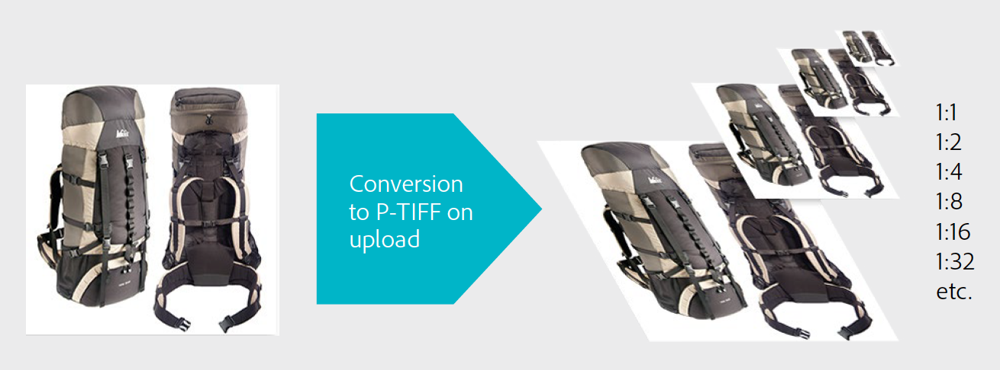

# Dynamic Media Classic 기본 워크플로 및 자산 미리 보기 {#main-workflow}

Dynamic Media는 만들기(및 업로드), 작성자(및 게시) 및 전달 워크플로우 프로세스를 지원합니다. 먼저 에셋을 업로드한 다음 이미지 세트 구축과 같은 이러한 에셋으로 작업을 수행하고 이를 생동감 있게 게시합니다. 일부 워크플로우에서는 빌드 단계가 선택 사항입니다. 예를 들어 이미지 크기를 동적으로 조정하고 확대/축소하거나 비디오를 변환하여 스트리밍하는 것이 목표인 경우 필요한 빌드 단계는 없습니다.

Dynamic Media Classic 솔루션의 워크플로우는 다음 세 가지 주요 단계로 구성됩니다.

1. SourceContent 만들기(및 업로드)
2. 자산 작성(및 게시)
3. 자산 제공

## 1단계:만들기(및 업로드)

워크플로우의 시작입니다. 이 단계에서는 사용 중인 워크플로우에 맞는 소스 컨텐츠를 수집하거나 만들어 Dynamic Media Classic에 업로드합니다. 이 시스템은 이미지, 비디오 및 글꼴뿐만 아니라 PDF, Adobe Illustrator 및 Adobe InDesign용 다양한 파일 유형을 지원합니다.

[지원되는 파일 형식](https://docs.adobe.com/content/help/en/dynamic-media-classic/using/upload-publish/uploading-files.html#supported-asset-file-formats)의 전체 목록을 참조하십시오.

다음과 같은 다양한 방법으로 소스 컨텐츠를 업로드할 수 있습니다.

- 데스크탑 또는 로컬 네트워크에서 바로 사용 [방법](https://docs.adobe.com/content/help/en/dynamic-media-classic/using/upload-publish/uploading-files.html#upload-files-using-sps-desktop-application) 살펴보기
- Dynamic Media Classic FTP 서버에서 가져옵니다. [방법](https://docs.adobe.com/content/help/en/dynamic-media-classic/using/upload-publish/uploading-files.html#upload-files-using-via-ftp) 살펴보기

기본 모드는 로컬 네트워크에서 파일을 찾아 업로드를 시작하는 데스크탑입니다.

>[!TIP]
>
>폴더를 수동으로 추가하지 마십시오. 대신 FTP에서 업로드를 실행하고 **하위 폴더 포함** 옵션을 사용하여 Dynamic Media Classic 내에서 폴더 구조를 다시 만듭니다.

가장 중요한 두 개의 업로드 옵션은 기본적으로 활성화되어 있습니다. **게시**&#x200B;에 표시(이전에 설명한 것) 및 **덮어쓰기**). 덮어쓰는 것은 업로드되는 파일의 이름이 시스템에 있는 파일과 같은 경우 새 파일이 기존 버전을 대체한다는 의미입니다. 이 옵션의 선택을 취소하면 파일이 업로드되지 않을 수 있습니다.

### 이미지 업로드 시 덮어쓰기 옵션

전체 회사에 대해 설정할 수 있는 이미지 덮어쓰기 옵션의 네 가지 변형이 있으며 이러한 옵션은 종종 잘못 인식됩니다. 간단히 말해, 이름이 같은 자산을 더 자주 덮어쓰도록 규칙을 설정하거나, 덮어쓰는 횟수가 적으면(새 이미지의 이름이 &quot;-1&quot; 또는 &quot;-2&quot; 확장자로 표시됨)

- **현재 폴더에 동일한 기본 이미지 이름/확장자를 덮어씁니다**.
이 옵션은 교체에 대한 가장 엄격한 규칙입니다. 교체 이미지를 원본과 동일한 폴더에 업로드하고 교체 이미지의 파일 이름 확장자는 원본과 같아야 합니다. 이러한 요구 사항이 충족되지 않으면 복제본이 만들어집니다.

- **확장명에 관계없이 동일한 기본 자산 이름으로 현재 폴더에 덮어씁니다**.
원본 이미지와 동일한 폴더에 대체 이미지를 업로드해야 하지만 파일 이름 확장자는 원본과 다를 수 있습니다. 예를 들어 chair.tif는 chair.jpg를 대체합니다.

- **동일한 기본 에셋 이름/확장명으로 모든 폴더에 덮어씁니다**.
교체 이미지의 파일 이름 확장자가 원본 이미지와 동일해야 합니다(예: chair.jpg는 chair.tif가 아니라 chair.jpg를 사용해야 함). 그러나 원본 이미지와 다른 폴더에 교체 이미지를 업로드할 수 있습니다. 업데이트된 이미지는 새 폴더에 있습니다.원본 위치에서 파일을 더 이상 찾을 수 없습니다.

- **확장명에 관계없이 동일한 기본 자산 이름으로 모든 폴더에 덮어씁니다**.
이 옵션은 가장 포괄적인 대체 규칙입니다. 원본 파일과 다른 폴더에 교체 이미지를 업로드하고 파일 이름 확장자가 다른 파일을 업로드한 다음 원본 파일을 바꿀 수 있습니다. 원본 파일이 다른 폴더에 있는 경우 교체 이미지는 업로드된 새 폴더에 있습니다.

[이미지 덮어쓰기 옵션](https://docs.adobe.com/content/help/en/dynamic-media-classic/using/setup/application-setup.html#using-the-overwrite-images-option)에 대해 자세히 알아보십시오.

위의 두 가지 방법 중 하나를 사용하여 업로드할 때는 필요하지 않지만 특정 업로드에 대한 작업 옵션을 지정할 수 있습니다. 예를 들어, 반복 업로드를 예약하고, 업로드 시 자르기 옵션을 설정하는 등의 작업이 가능합니다. 이러한 기능은 일부 워크플로우에서 유용할 수 있으므로 유용한지 고려해 볼 만한 가치가 있습니다.

[작업 옵션](https://docs.adobe.com/content/help/en/dynamic-media-classic/using/upload-publish/uploading-files.html#upload-options)에 대해 자세히 알아보십시오.

업로드는 Dynamic Media Classic에서 해당 시스템에 아직 없는 모든 콘텐츠로 작동할 수 없기 때문에 모든 워크플로우에서 첫 번째로 필요한 단계입니다. 업로드 도중 백그라운드에서 시스템은 업로드된 모든 자산을 중앙 집중식 Dynamic Media Classic 데이터베이스에 등록하고, ID를 할당하고, 이를 스토리지에 복사합니다. 또한 이미지 파일을 동적 크기 조정 및 확대/축소를 허용하는 포맷으로 변환하고 비디오 파일을 MP4 웹에 적합한 포맷으로 변환합니다.

### 개념:Dynamic Media Classic에 이미지를 업로드할 때 나타나는 결과

모든 유형의 이미지를 Dynamic Media Classic에 업로드하면 Pyramid TIFF 또는 P-TIFF라는 마스터 이미지 형식으로 변환됩니다. P-TIFF는 서로 다른 레이어 대신 동일한 이미지의 여러 크기(해상도)를 포함하는 파일을 제외하고 레이어로 구성된 TIFF 비트맵 이미지의 형식과 유사합니다.

이미지가 변환되면 Dynamic Media Classic은 이미지의 전체 크기의 &quot;스냅샷&quot;을 촬영하여 이미지 크기를 절반으로 조절하여 저장하고, 크기를 절반으로 다시 조절하고 저장하는 등 원래 크기의 여러 배까지 채울 때까지 계속 진행합니다. 예를 들어 2000픽셀 P-TIFF는 동일한 파일에서 1000-, 500-, 250- 및 125픽셀 크기(및 소형)를 가집니다. P-TIFF 파일은 Dynamic Media Classic에서 &quot;마스터 이미지&quot;라고 하는 포맷입니다.

특정 크기 이미지를 요청할 때 P-TIFF를 만들면 Dynamic Media Classic용 이미지 서버가 더 큰 다음 크기를 빠르게 찾아 축소할 수 있습니다. 예를 들어 2000픽셀 이미지를 업로드하고 100픽셀 이미지를 요청하는 경우 Dynamic Media Classic에서는 125픽셀 버전을 찾아 2000픽셀에서 100픽셀까지의 크기 조정 대신 100픽셀로 크기를 조정합니다. 이것은 그 수술을 매우 빠르게 한다. 또한, 이미지를 확대할 때, 확대/축소 뷰어는 전체 해상도 이미지가 아닌 확대되는 이미지 타일만 요청할 수 있습니다. 마스터 이미지 포맷인 P-TIFF 파일은 동적 크기 및 확대/축소를 모두 지원하는 방식입니다.

마찬가지로 마스터 소스 비디오를 Dynamic Media Classic에 업로드할 수 있습니다. Dynamic Media Classic을 업로드하면 자동으로 크기를 조정하여 MP4 웹에 적합한 형식으로 변환할 수 있습니다.

### 업로드한 이미지의 최적 크기를 결정하기 위한 경험의 규칙

**필요한 최대 크기로 이미지 업로드**

- 확대/축소해야 하는 경우 가장 긴 차원의 1500-2500픽셀 범위의 고해상도 이미지를 업로드합니다. 제공할 세부 정보, 소스 이미지의 품질 및 표시되는 제품의 크기를 고려합니다. 예를 들어 작은 고리에 1000픽셀 이미지를 업로드하지만 전체 회의실에 3000픽셀 이미지를 업로드할 수 있습니다.
- 확대/축소할 필요가 없는 경우 표시되는 것과 동일한 크기로 업로드합니다. 예를 들어 페이지에 배치할 로고나 시작/배너 이미지가 있는 경우 정확하게 1:1 크기로 업로드하고 해당 크기로 전화하십시오.

**Dynamic Media Classic에 업로드하기 전에 이미지를 업샘플링하거나 확대하지 마십시오.** 예를 들어 작은 이미지를 2000픽셀 이미지로 만들기 위해 업샘플링하지 마십시오. 안 좋아 보일 거야 업로드하기 전에 이미지를 최대한 완벽하게 만들 수 있습니다.

**최소 확대/축소 크기는 없지만 기본적으로 뷰어는 100% 이상 확대/축소되지 않습니다.** 이미지가 너무 작으면 확대/축소되지 않거나 아주 작은 양만 확대/축소하여 이미지 손상을 방지합니다.

**이미지 크기를 최소로 설정할 수는 없지만 큰 이미지를 업로드하는 것은 권장되지 않습니다.** 큰 이미지는 4000픽셀 이상으로 간주됩니다. 이 크기의 이미지를 업로드하면 이미지의 먼지나 머리카락과 같은 잠재적 결함을 나타낼 수 있습니다. 이러한 이미지는 Dynamic Media Classic 서버의 공간을 더 차지하므로 계약 저장소 제한을 넘을 수 있습니다.

[파일 업로드](https://docs.adobe.com/content/help/en/dynamic-media-classic/using/upload-publish/uploading-files.html#uploading-your-files)에 대해 자세히 알아보십시오.

## 2단계:작성자(및 게시)

컨텐츠를 만들고 업로드하면 하나 이상의 하위 워크플로우를 수행하여 업로드된 자산에서 새 리치 미디어 자산을 만듭니다. 여기에는 이미지, 견본, 회전, 혼합 미디어 집합, 템플릿 등 모든 유형의 세트 컬렉션이 포함됩니다. 비디오도 포함되어 있습니다. 각 유형의 이미지 컬렉션 세트와 비디오 리치 미디어에 대해 나중에 자세히 살펴봅니다. 하지만 거의 모든 경우 하나 이상의 자산을 선택하거나 자산을 선택하지 않은 상태에서 빌드할 자산의 유형을 선택하여 시작합니다. 예를 들어 기본 이미지와 해당 이미지의 몇 가지 보기를 선택하고 동일한 제품의 대체 보기 모음인 이미지 세트를 빌드하도록 선택할 수 있습니다.

>[!IMPORTANT]
>
>모든 자산이 게시로 표시되는지 확인하십시오. 기본적으로 모든 에셋이 업로드 시 게시되도록 자동으로 표시되지만 업로드된 컨텐츠에서 새로 작성된 에셋도 게시용으로 표시되어야 합니다.

새 자산을 빌드하면 게시 작업이 실행됩니다. 수동으로 수행하거나 자동으로 실행되는 게시 작업을 예약할 수 있습니다. 게시를 사용하면 비공개 Dynamic Media Classic 구 내의 모든 콘텐트가 공식으로 복사되고 서버 구 방정식을 게시할 수 있습니다. 다이내믹 미디어 게시 작업의 제품은 게시된 각 자산에 대한 고유 URL입니다.

게시할 서버는 컨텐츠 및 워크플로우의 유형에 따라 달라집니다. 예를 들어 모든 이미지는 이미지 서버로 이동하고 비디오를 FMS 서버로 스트리밍합니다. 편의상 단일 서버에 대한 단일 이벤트로 &quot;게시&quot;를 언급하게 됩니다.

게시를 사용하면 컨텐츠 뿐만 아니라 게시용으로 표시된 모든 컨텐츠가 게시됩니다. 일반적으로 단일 관리자는 게시를 실행하는 개별 사용자가 아닌 모든 사람을 대신하여 게시합니다. 관리자는 필요에 따라 게시하거나 자동 게시할 일일, 주별 또는 10분마다 반복되는 작업을 설정할 수 있습니다. 비즈니스에 적합한 일정에 게시할 수 있습니다.

>[!TIP]
>
>게시 작업을 자동화하고 전체 게시를 예약하여 매일 오전 12:00AM에 실행하거나 저녁 늦게 실행할 수 있습니다.

### 개념:Dynamic Media Classic URL 이해

Dynamic Media Classic 작업 과정의 최종 제품은 자산(이미지 세트 또는 응용 비디오 세트)을 가리키는 URL입니다. 이러한 URL은 매우 예측 가능하고 동일한 패턴을 따릅니다. 이미지의 경우 각 이미지가 P-TIFF 마스터 이미지에서 생성됩니다.

다음은 두 가지 예제가 있는 이미지의 URL에 대한 구문입니다.

URL에서 질문 표시 왼쪽에 있는 모든 항목은 특정 이미지의 가상 경로입니다. 물음표 오른쪽에 있는 모든 것은 이미지를 처리하는 방법에 대한 지침인 이미지 서버 수정자입니다. 여러 개의 수정자가 있는 경우 수정자가 앰퍼맨드로 구분됩니다.

첫 번째 예에서 이미지 &quot;Backpack_A&quot;의 가상 경로는 `http://sample.scene7.com/is/image/s7train/BackpackA`입니다. 이미지 서버 수정자는 이미지 크기를 250픽셀의 너비(wid=250픽셀)로 조정하고 크기를 조정함과 동시에(resMode=sharp2)하는 랜커스 보간 알고리즘을 사용하여 이미지를 다시 샘플링합니다.

두 번째 예는 $!로 표시된 동일한 Backpack_A 이미지에 &quot;이미지 사전 설정&quot;이라고 하는 것을 적용합니다._template300$. 표현식 양쪽의 $ 기호는 패키지된 이미지 수정자 세트인 이미지 사전 설정이 이미지에 적용되고 있음을 나타냅니다.

Dynamic Media Classic URL의 통합 방법을 이해하면 프로그래밍 방식으로 URL을 변경하는 방법과 이러한 URL을 사이트 및 백엔드 시스템에 통합하는 방법을 알게 됩니다.

### 개념:캐싱 지연 이해

새로 업로드되고 게시된 자산은 바로 볼 수 있지만 업데이트된 에셋은 10시간 캐싱 지연이 발생할 수 있습니다. 기본적으로 게시된 모든 자산은 만료되기 최소 10시간을 갖습니다. 이미지를 볼 때마다 10시간이 지나도 아무도 해당 이미지를 보지 못한 시간이 경과하기 전까지는 만료되지 않는 시계가 시작되기 때문에 최소라고 합니다. 이 10시간 기간은 자산의 &quot;Time to Live&quot;입니다. 해당 에셋에 대한 캐시가 만료되면 업데이트된 버전을 제공할 수 있습니다.

일반적으로 오류가 발생하지 않는 한 문제가 되지 않으며 이미지/자산의 이름이 이전에 게시된 버전과 동일하지만 이미지에 문제가 있습니다. 예를 들어 실수로 저해상도 버전을 업로드했거나 아트 디렉터가 이미지를 승인하지 않았습니다. 이 경우 원본 이미지를 다시 불러온 다음 동일한 자산 ID를 사용하여 새 버전으로 바꾸려고 합니다.

[업데이트해야 하는 URL에 대한 캐시를 수동으로 지우는 방법을 알아봅니다](https://docs.adobe.com/content/help/en/experience-manager-65/assets/dynamic/invalidate-cdn-cached-content.html).

>[!TIP]
>
>캐싱 지연과 관련된 문제를 방지하려면 저녁, 하루, 2주 등의 작업을 항상 미리 수행하십시오. 공개적으로 발표하기 전에 내부 당사자가 작업을 입증하기 위한 QA/수락 시간을 작성합니다. 전날 저녁에 작업하는 경우에도 변경 사항을 적용하고 그날 저녁에 다시 게시할 수 있습니다. 아침까지 10시간이 지나자 캐시가 올바른 이미지로 업데이트됩니다.

- [게시 작업 만들기](https://docs.adobe.com/content/help/en/dynamic-media-classic/using/upload-publish/publishing-files.html#creating-a-publish-job)에 대해 자세히 알아보십시오.
- [게시](https://docs.adobe.com/content/help/en/dynamic-media-classic/using/upload-publish/publishing-files.html)에 대해 자세히 알아보십시오.

## 3단계:전달

Dynamic Media Classic 작업 과정의 최종 제품은 자산을 가리키는 URL입니다. 이 URL은 개별 이미지, 이미지 세트, 스핀 세트, 기타 일부 이미지 세트 컬렉션 또는 비디오를 가리킬 수 있습니다. `` 태그가 현재 사이트에서 오는 이미지를 가리키는 대신 Dynamic Media Classic 이미지를 가리키도록 HTML을 편집하는 등 해당 URL을 사용하여 작업을 수행해야 합니다.

전달 단계에서 이러한 URL을 웹 사이트, 모바일 앱, 이메일 캠페인 또는 자산을 표시하려는 기타 모든 디지털 접점에 통합해야 합니다.

이미지의 Dynamic Media Classic URL을 웹 사이트에 통합하는 예:

빨간색 URL은 Dynamic Media Classic에만 적용되는 유일한 요소입니다.

IT 팀이나 통합 파트너는 코드를 작성하고 변경하는 작업을 주도하여 Dynamic Media Classic URL을 사이트에 통합할 수 있습니다. Adobe에는 기술, 크리에이티브 또는 일반 안내를 제공하면 이러한 작업에 도움이 되는 컨설팅 팀이 있습니다.

확대/축소 뷰어 또는 확대/축소와 대체 보기를 결합하는 뷰어와 같은 보다 복잡한 솔루션의 경우, 일반적으로 URL은 Dynamic Media Classic에서 호스팅되는 뷰어를 가리키며, 또한 해당 URL 내의 ID는 자산 ID에 대한 참조입니다.

새 팝업 창의 뷰어에서 이미지 세트를 여는 링크(빨간색)의 예:

>[!IMPORTANT]
>
>Dynamic Media Classic URL을 웹 사이트, 모바일 앱, 이메일 및 기타 디지털 접점에 통합해야 합니다. Dynamic Media Classic에서는 이렇게 할 수 없습니다.

## 자산 미리 보기

업로드한 자산을 미리 보거나 만들고 있거나 편집 중인 자산이 고객이 볼 때 원하는 대로 표시되는지 확인할 수 있습니다. **미리 보기** 단추를 클릭하거나 **찾아보기/빌드 패널**&#x200B;의 상단에 있는 또는 **파일 > 미리 보기**&#x200B;로 이동하여 미리 보기 창에 액세스할 수 있습니다. 브라우저 창에서 현재 패널에 있는 에셋이 이미지, 비디오 또는 이미지 세트와 같은 빌드 자산인지 미리 봅니다.

### 동적 크기 미리 보기(이미지 사전 설정)

**크기** 미리 보기를 사용하여 여러 크기로 이미지를 미리 볼 수 있습니다. 사용 가능한 이미지 사전 설정 목록이 로드됩니다. 나중에 이미지 사전 설정에 대해 논의하겠지만, 이러한 사전 설정을 특정 양의 선명하게 하기 및 이미지 품질로 지정된 크기로 이미지를 로드할 수 있는 &quot;레서피&quot;로 간주합니다.

### 확대/축소 미리 보기

또한 **확대/축소** 옵션을 사용하여 여러 가지 포함된 확대/축소 뷰어를 기반으로 미리 작성된 여러 사전 설정 중 하나에서 이미지를 미리 볼 수도 있습니다.

[자산 미리 보기](https://docs.adobe.com/content/help/en/dynamic-media-classic/using/managing-assets/previewing-asset.html)에 대해 자세히 알아보십시오.
