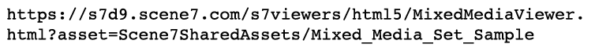

# 이미지, 견본, 회전 및 혼합 미디어 집합 {#media-sets}

다이내믹한 크기 조정 및 확대/축소를 위해 단일 이미지 외에도 Dynamic Media Classic 세트 컬렉션을 통해 보다 풍부한 온라인 경험을 제공할 수 있습니다. 자습서의 이 섹션에서는 Dynamic Media Classic에서 다음과 같은 리치 미디어 세트를 만드는 방법을 살펴봅니다.

- 이미지 집합
- 견본 집합
- 회전 집합
- 혼합 미디어 집합

또한 일괄 세트 사전 설정을 사용하여 업로드를 통해 세트 생성을 자동화하는 방법도 설명합니다.

## 세트에 대해 항상 알고 싶은 모든 것

기본 동적 크기 조정 및 확대/축소 옆에서 세트는 가장 널리 사용되는 Dynamic Media Classic 하위 제품일 수 있습니다. 세트는 실제 이미지가 포함되지 않지만 다른 이미지 및/또는 비디오에 대한 관계 세트로 구성되는 &quot;가상&quot; 자산입니다. 세트의 주요 매력은 그것들이 &quot;선반 밖으로&quot; 준비가 된 미니 어플리케이션이라는 것이다. 즉, 각 세트 뷰어에는 자체 로직과 인터페이스가 포함되어 있으므로 사이트에서 해당 뷰어를 호출하기만 하면 됩니다. 또한 모든 멤버 자산과 관계를 직접 관리할 필요 없이 세트당 단일 자산 ID만 추적하면 됩니다.

세트를 만들 때 해당 세트는 URL에서 서비스를 제공하기 전에 게시용으로 표시되고 게시되어야 하는 별도의 자산으로 관리됩니다. 모든 멤버 자산도 게시되어야 합니다.

### 세트 유형

Dynamic Media Classic에서 만들 수 있는 4가지 유형의 세트에 대해 알아봅니다.이미지, 견본, 회전 및 혼합 미디어 집합.

## 이미지 집합

이것은 가장 일반적인 세트의 유형입니다. 일반적으로 동일한 항목의 대체 보기에 사용합니다. 이 이미지는 해당 이미지의 관련 축소판을 클릭하여 뷰어에 로드하는 여러 이미지로 구성됩니다.

_이미지 세트의 예_

위의 이미지 집합에 대한 URL은 다음과 같이 나타날 수 있습니다.

- [이미지 세트에 빠른 시작](https://docs.adobe.com/content/help/en/dynamic-media-classic/using/image-sets/quick-start-image-sets.html)을 사용하여 이미지 세트에 대해 자세히 알아보십시오.
- [이미지 집합 만들기](https://docs.adobe.com/content/help/en/dynamic-media-classic/using/image-sets/creating-image-set.html#creating-an-image-set)에 대해 알아봅니다.

### 견본 집합

이 유형의 세트는 일반적으로 동일한 항목의 색상 보기를 표시하는 데 사용됩니다. 이미지와 색상 견본 쌍으로 구성됩니다.

견본 세트와 이미지 세트의 주요 차이점은 견본 세트는 클릭 가능한 견본으로 다른 이미지를 사용하지만 이미지 세트는 원본 이미지의 클릭 가능한 미니어처 축소판 버전을 사용합니다.

견본 집합은 이미지에 색상을 적용하지 않습니다(일반적인 오해). 이미지 집합에서와 마찬가지로 이미지는 간단하게 교체됩니다. Photoshop을 사용하여 미니 견본 이미지를 제작하거나, 각 색상이 별도로 촬영되거나, Dynamic Media Classic의 자르기 도구를 사용하여 색상 이미지 중 하나의 견본을 만들 수 있었습니다.

_견본 집합 예_

위의 견본 집합에 대한 URL은 다음과 같이 나타날 수 있습니다.

- [견본 집합 빠른 시작](https://docs.adobe.com/content/help/en/dynamic-media-classic/using/swatch-sets/quick-start-swatch-sets.html)을 사용하는 견본 집합에 대해 자세히 알아보십시오.
- [견본 집합 만들기](https://docs.adobe.com/content/help/en/dynamic-media-classic/using/swatch-sets/creating-swatch-set.html#creating-a-swatch-set) 방법을 알아봅니다.

### 회전 집합

이 세트는 일반적으로 항목의 360도 보기를 표시하는 데 사용됩니다. 견본 집합과 같이 회전 집합은 3D 기능 없이 모든 면에서 이미지의 많은 사진을 만드는 실제 작업입니다. 뷰어에서는 정지 모션 애니메이션과 같은 이미지 간을 전환할 수 있습니다.

회전 집합은 단일 축을 따라 한 방향으로 회전하거나, 2D 회전 집합으로 교대로 생성한 경우 여러 축을 회전할 수 있습니다. 예를 들어, 모든 바퀴가 땅에 있는 동안 차를 회전할 수 있고, 그리고 나서 뒷바퀴도 &quot;뒤집고 회전&quot;할 수 있습니다. 2D 회전 집합을 올바르게 설정하려면 각 축에 대한 행당 이미지 수는 같아야 합니다. 즉, 두 축에서 회전하는 경우 단일 각도 회전보다 두 배 많은 이미지가 필요합니다.

_회전 집합의 예_

위의 회전 집합에 대한 URL은 다음과 같이 나타날 수 있습니다.

- [회전 집합에 빠른 시작](https://docs.adobe.com/content/help/en/dynamic-media-classic/using/spin-sets/quick-start-spin-sets.html)을 사용하여 스핀 세트에 대해 자세히 알아보십시오.
- [스핀 세트 만들기](https://docs.adobe.com/content/help/en/dynamic-media-classic/using/spin-sets/creating-spin-set.html#creating-a-spin-set) 방법을 알아봅니다.

## 혼합 미디어 집합

조합 집합입니다. 이 플러그인을 사용하면 비디오를 추가하는 것은 물론 이전 세트를 단일 뷰어에 결합할 수 있습니다. 이 워크플로우에서는 먼저 구성 요소 세트를 만든 다음 혼합 미디어 세트로 결합합니다.

_혼합 미디어 집합의 예_

위의 혼합 미디어 집합에 대한 URL은 다음과 같이 나타날 수 있습니다.

- [혼합 미디어 세트로 빠른 시작](https://docs.adobe.com/content/help/en/dynamic-media-classic/using/mixed-media-sets/quick-start-mixed-media-sets.html)을 사용하여 혼합 미디어 세트에 대해 자세히 알아보십시오.

- [혼합 미디어 집합 만들기](https://docs.adobe.com/content/help/en/dynamic-media-classic/using/mixed-media-sets/creating-mixed-media-set.html#creating-a-mixed-media-set) 방법을 알아봅니다.

웹 사이트의 확대/축소, 세트 또는 비디오에 사용할 이미지를 표시하려면 Dynamic Media Classic &quot;뷰어&quot;에서 이미지를 호출합니다. Dynamic Media Classic에는 견본 집합, 회전 집합, 비디오 등 리치 미디어 에셋을 위한 뷰어가 포함되어 있습니다.

AEM Assets 및 Dynamic Media Classic용 [뷰어에 대해 자세히 알아보십시오](https://docs.adobe.com/content/help/en/dynamic-media-developer-resources/library/viewers-aem-assets-dmc/c-html5-s7-aem-asset-viewers.html).

## 일괄처리 집합 사전 설정

지금까지 Dynamic Media Classic Build 함수를 사용하여 수동으로 세트를 빌드하는 방법에 대해 논의했습니다. 하지만 표준 명명 규칙이 있는 경우 일괄 세트 사전 설정을 사용하여 이미지 세트와 스핀 세트 생성을 자동화할 수 있습니다.

각 사전 설정은 정의된 이름 지정 규칙과 일치하는 이미지를 사용하여 세트를 구성하는 방법을 정의하는 고유한 이름 지정 지침 세트입니다. 사전 설정에서 먼저 세트로 그룹화할 에셋에 대한 이름 지정 규칙을 정의합니다. 그런 다음 이러한 이미지를 참조하기 위해 배치 집합 사전 설정을 만들 수 있습니다.

사전 설정을 직접 만들 수는 있지만(이 사전 설정은 **설정 > 응용 프로그램 설정 > 일괄 설정 사전 설정** )에서 컨설팅 팀이나 기술 지원 팀에서 자동으로 설정하는 것이 좋습니다. 그 이유는 다음과 같습니다.

- 배치 집합 사전 설정은 설정하기가 복잡할 수 있습니다. 이러한 사전 설정은 일반 표현식으로 작동하며, 개발자가 아닌 경우 이 구문이 친숙하거나 혼동될 수 있습니다.
- 만든 후에는 기본적으로 켜져 있습니다. &quot;실행 취소&quot; 함수가 없습니다. 수천 개의 이미지를 업로드하기 시작하고 사전 설정이 잘못 구성된 경우 수동으로 찾아 삭제해야 하는 수백 또는 수천 개의 깨진 세트가 있을 수 있습니다.

이전에 일괄 세트 사전 설정으로 손쉽게 만들 수 있는 간단한 명명 규칙을 제안했었습니다. 하지만 사전 설정은 매우 유연하므로 복잡한 이름 지정 전략을 처리할 수 있습니다. 즉, 세트에 속하는 이미지는 일반적인 이름으로 함께 연결해야 합니다. SKU 번호 또는 제품 ID인 경우도 있습니다. Dynamic Media Classic에서는 사전 설정에 사용할 모든 이미지에 대한 기본 이름 지정 규칙을 지정하거나 각각 다른 이름 지정 규칙을 사용하는 여러 사전 설정을 만들 수 있습니다.

일괄 세트 사전 설정은 업로드 시에만 적용됩니다.이미지를 업로드한 후에는 실행할 수 없습니다. 따라서 모든 이미지를 로드하기 전에 이름 지정 규칙을 계획하고 사전 설정을 빌드하는 것이 중요합니다.

사전 설정이 만들어지면 회사 관리자는 사전 설정이 활성 상태인지 비활성 상태인지 여부를 선택할 수 있습니다. 활성화됨을 의미합니다. 비활성 사전 설정은 숨겨진 상태로 유지되지만, **작업 옵션** 아래에 업로드 페이지에 표시됩니다.

[배치 집합 사전 설정 만들기](https://docs.adobe.com/content/help/en/dynamic-media-classic/using/setup/application-setup.html#creating-a-batch-set-preset) 방법을 알아봅니다.

### 업로드 시 배치 집합 사전 설정 사용

다음은 배치 집합 사전 설정을 만든 후 업로드할 때 사용하는 방법입니다.

1. **업로드**&#x200B;를 클릭하고 **바탕 화면에서** 또는 **FTP 사용**&#x200B;을 선택합니다.
2. **작업 옵션**&#x200B;을 클릭합니다.
3. **일괄 세트 사전 설정** 옵션을 열고 업로드와 함께 사용할 사전 설정을 선택하거나 선택 취소합니다.
4. 업로드가 완료되면 폴더에서 완료된 세트를 찾습니다.

[일괄 세트 사전 설정](https://docs.adobe.com/content/help/en/dynamic-media-classic/using/setup/application-setup.html#batch-set-presets)에 대해 자세히 알아보십시오.
