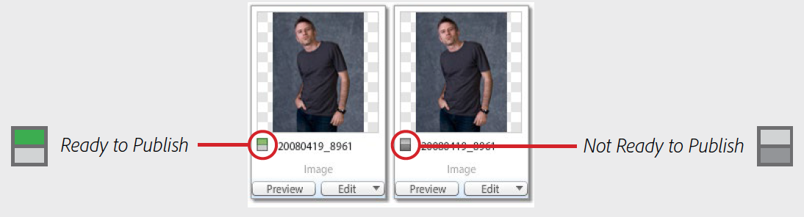

# Dynamic Media Classic 모범 사례 자습서를 시작합니다

이 안내서는 Dynamic Media Classic의 현재 사용자와 새 사용자가 Adobe의 강력한 리치 미디어 솔루션을 사용하여 수행할 수 있는 작업을 보다 완벽하게 이해할 수 있도록 돕기 위한 것입니다. 다음 방법으로 수행합니다.

- Dynamic Media Classic을 소개하고 용도를 설명하고 핵심 기능 및 UI(사용자 인터페이스)에 대한 개요를 제공합니다.
- 일반적인 만들기, 작성 및 게재 워크플로우를 설명하는 것은 솔루션의 자산을 사용하여 작업할 때 따라야 합니다.
- 솔루션 시작 및 사용 전에 설정해야 할 중요한 항목에 대해 토론합니다.
- 솔루션의 핵심 기능 중 몇 가지를 자세히 살펴봅니다.

안내서 전체에서 예, 팁 및 모범 사례를 제공합니다. Dynamic Media Classic을 사용할 때 알고 있어야 하는 중요한 용어와 개념을 설명하겠습니다. 특정 주제에 대해 사용할 수 있는 경우 관련 웨비나, 블로그 게시물 및 온라인 설명서를 소개합니다.

Dynamic Media Classic 솔루션의 가치를 극대화하는 데 필요한 정보를 이 안내서에 제공하기를 바랍니다. 이 안내서의 장을 보다 쉽게 탐색하려면 안내서의 왼쪽에 있는 책갈피 아이콘을 클릭하여 해당 내용을 확인합니다.

## Dynamic Media Classic 개요

Dynamic Media Classic은 고객이 리치 미디어 컨텐츠를 작성, 작성 및 제공하는 중심지입니다. Dynamic Media Classic은 통합 리치 미디어 관리, 게시 및 서비스 환경입니다. 리치 미디어는 웹, 인쇄 자료, 이메일 캠페인, 웹 애플리케이션, 데스크탑 및 장치를 포함한 모든 마케팅 및 판매 채널로 전달될 수 있습니다.

이미지 제공은 Dynamic Media Classic에서 가장 많이 사용되는 기능일 수 있습니다. 실제로 대부분의 고객은 Dynamic Media Classic을 사용하여 확대/축소 또는 리치 미디어용 이미지를 포함하여 웹 사이트에서 모든 이미지를 제공합니다. 그러나 비디오 제공, AI 사용 등 다양한 용도로 사용하여 배달된 이미지를 최적화할 수도 있습니다.

## Dynamic Media Classic의 핵심 기능

이 안내서에서는 Dynamic Media Classic의 다음 핵심 기능에 대해 설명합니다.

- **동적 이미징.** 실시간 편집, 서식 및 크기 조정, 대화형 확대/축소 및 패닝에 대한 엄포형 용어입니다. 색상 및 텍스쳐 시청 360도 회전 이미지 템플릿; 및 멀티미디어 뷰어입니다.
- **비디오.** 최종 비디오를 업로드하고 게시한 다음 구성 가능한 비디오 뷰어에 점진적으로 다운로드합니다.
- **스마트 이미징.** Adobe Sensei AI 기능을 활용하고 기존 &quot;이미지 사전 설정&quot;과 함께 사용하면 클라이언트 브라우저 기능을 기반으로 이미지 형식, 크기 및 품질을 자동으로 최적화하여 이미지 전달 성능을 향상시킬 수 있습니다.

솔루션의 추가 기능을 살펴보려면 [Dynamic Media Classic 설명서](https://docs.adobe.com/content/help/en/dynamic-media-classic/using/intro/introduction.html)를 방문하십시오.

## Dynamic Media Classic 사용자 인터페이스(UI)

Dynamic Media Classic 기본 UI는 다음 세 가지 주요 영역으로 구성됩니다. 전역 탐색 막대, 자산 라이브러리 및 찾아보기 패널/빌드 패널입니다.

_Dynamic Media 클래식 UI_

**전역 탐색 모음.** 화면 맨 위에 있는 이 막대의 버튼을 사용하여 솔루션의 주요 영역과 기능에 액세스합니다. 예를 들어 이 파일을 사용하여 업로드 기능에 액세스하고, 다양한 자산 작성 영역(이미지 세트, 스핀 세트 등)을 열고, 이미지 사전 설정 및 뷰어 사전 설정 설정과 같은 중요한 작업을 수행하고, 자산을 게시할 수 있습니다. 여기에서 작업을 모니터링하고, 최근 활동을 확인하고, 다양한 도움말 옵션 중에서 선택할 수도 있습니다.

**자산 라이브러리.** 화면 왼쪽에 있는 자산 라이브러리는 자산 라이브러리입니다. 이 패널은 사용자가 만드는 폴더와 하위 폴더에서 자산을 구성하는 데 사용합니다. 패널 상단에 자산을 찾는 데 도움이 되는 검색 및 필터가 있습니다. 고급 검색을 사용하면 해당 자산에 첨부된 숨겨진 메타데이터 필드를 포함하여 검색 기준으로 여러 옵션을 지정하여 검색할 수 있습니다. 패널 하단에서 휴지통 아이콘을 클릭하여 삭제된 항목을 볼 수 있습니다. 처음에, 계정 이름과 동일한 이름을 갖는 최상위 폴더 이외의 다른 폴더는 사용하여 시작하지 않습니다.

>[!NOTE]
>
>휴지통의 자산은 사용자가 복원하지 않는 한 휴지통으로 보낸 후 7일 후에 자동으로 영구적으로 삭제됩니다.

**찾아보기/빌드 패널.** UI의 중심입니다. 여기서 검색 모드에서 자산을 찾아보거나 작성 모드에 있는 경우 이 자산을 워크플로우의 일부로 빌드하기 위한 캔버스로 사용합니다. 처음 로그인하면 찾아보기 패널이 표시됩니다. 화면 가운데에는 격자 보기에 있는 이미지의 축소판 버전이 있습니다. 목록 보기로 변경하거나 자산을 선택하고 세부 사항 보기를 사용하여 자산에 대한 세부 사항을 볼 수 있습니다.

>[!IMPORTANT]
>
>각 자산 ID 옆에는 **Publish** 스위치에 대한 표시가 있습니다. 토글이 켜져 있는 경우(녹색), 자산이 게시로 표시되어 있음을 나타냅니다.

>[!TIP]
>
>업로드 대화 상자에서 **업로드 후 게시** 확인란을 선택하여 업로드 시 자산을 자동으로 게시합니다.

[Dynamic Media Classic UI 탐색](https://docs.adobe.com/content/help/en/dynamic-media-classic/using/getting-started/navigation-basics.html)에 대해 자세히 알아보십시오.
