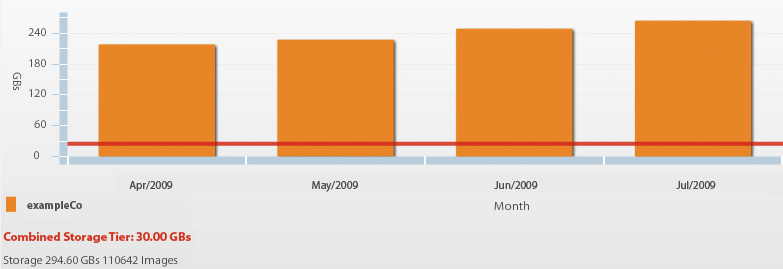

# 관리자에게 유용한 보고서 {#valuable-reports}

이 마지막 장에서는 관리자일 경우 설정할 수 있는 2개의 중요한 보고서에 대해 알 수 있습니다.대역폭 및 저장소 보고서와 이미지 오류 보고서를 참조하십시오.

## 대역폭 및 저장소 보고서

대역폭 및 저장소 보고서는 매월 이미지 서버 대역폭이 얼마이며 Dynamic Media Classic에서 사용하고 있는 저장소에 대해 자세히 설명합니다. 보관은 계약 금액이므로 초과 비용을 피하기 위해 반드시 필요한 한도액을 유지하고 확인하는 것이 중요합니다.

_대역폭 및 저장소 보고서에는 이 계정이 30GB 저장 공간 제한을 넘는 방식으로 표시됩니다._

## 이미지 오류 보고서

URL이 누락된 이미지를 요청할 때마다 이미지 서버에서 오류가 발생합니다. 이러한 경우 기본 이미지가 나타나도록 설정할 수 있지만 여전히 오류를 인식해야 합니다. 이미지 오류 보고서는 지난 24시간 동안 가장 자주 발생하는 20개의 이미지 오류 목록을 제공하며, 이러한 오류 발생 횟수, 오류가 있는 이미지, 문제 이미지가 있는 페이지 등의 세부 정보를 제공합니다. 응답이 &quot;기본값&quot;이면 기본 이미지가 대신 제공되었음을 의미합니다.

_이미지 오류 보고서._

## 결론

강력한 리치 미디어 솔루션을 시작하거나 활용하는 데 도움이 되는 이 모범 사례 가이드의 컨텐츠를 찾았으면 합니다.

Dynamic Media Classic에 대한 자세한 내용은 다음 리소스를 참조하십시오.

- [Experience League의 Dynamic Media Classic - 가치 창출](https://guided.adobe.com/?launch=AEM-5a#recommended/solutions/experience-manager)
- [Experience League의 Dynamic Media Classic - 더 보기](https://guided.adobe.com/?launch=AEM-6a#recommended/solutions/experience-manager)
- [Dynamic Media 뉴스레터 아카이브](https://docs.adobe.com/content/help/en/dynamic-media-classic/using/dynamic-media-newsletter.html)
- [Dynamic Media 뉴스레터 구독 페이지](https://www.adobe.com/subscription/dynamic-media-newsletter.html)
- [Dynamic Media Classic 설명서](https://docs.adobe.com/content/help/en/dynamic-media-classic/using/home.html)
- [리치 미디어 블로그 게시물](https://theblog.adobe.com/tag/dynamic-media)
