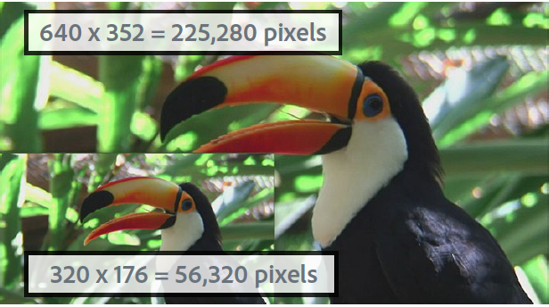
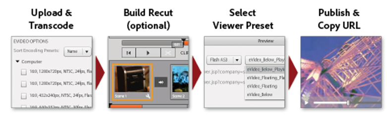
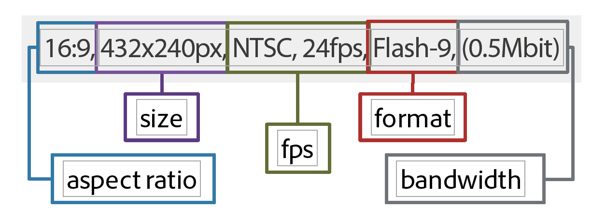
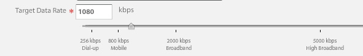

# 비디오 개요 {#video-overview}

Dynamic Media Classic에는 업로드 시 비디오를 자동으로 변환하는 기능, 데스크탑 및 모바일 디바이스로의 비디오 스트리밍, 디바이스 및 대역폭에 따라 재생에 최적화된 적응형 비디오 세트가 포함되어 있습니다. 비디오에 대한 가장 중요한 점은 워크플로우가 간단하다는 것입니다. 비디오 기술에 익숙하지 않더라도 누구나 사용할 수 있도록 설계되었습니다.

자습서의 이 섹션 끝 부분에는 다음 방법을 알 수 있습니다.

- 비디오를 다른 크기 및 포맷으로 업로드 및 인코딩(트랜스코딩)
- 업로드에 사용할 수 있는 비디오 사전 설정 중에서 선택
- 비디오 인코딩 사전 설정 추가 또는 편집
- 비디오 뷰어에서 비디오 미리 보기
- 웹 및 모바일 사이트에 비디오 배포
- 비디오에 캡션 및 장 마커 추가
- 데스크탑 및 모바일 사용자를 위한 비디오 뷰어 사용자 정의 및 게시

>[!NOTE]
>
>이 장의 모든 URL은 실례만을 위한 것입니다.라이브 링크가 아닙니다.

## Dynamic Media Classic 비디오 개요

먼저 Dynamic Media Classic을 사용하여 비디오의 가능성을 더 잘 이해하겠습니다.

### 기능 및 기능

Dynamic Media Classic 비디오 플랫폼은 비디오 업로드, 전환 및 관리 등 비디오 솔루션의 모든 부분을 제공합니다.비디오에 캡션 및 장 마커를 추가하는 기능;사전 설정을 사용하여 손쉽게 재생할 수 있습니다.

데스크탑, iOS, Android, Blackberry 및 Windows 모바일 디바이스를 비롯한 다양한 화면에서 스트리밍을 위한 고품질 적응형 비디오를 손쉽게 제작할 수 있습니다. 응용 비디오 세트는 다른 비트율 및 형식(예: 400kbps, 800kbps 및 1000kbps)으로 인코딩된 동일한 비디오 버전을 그룹화합니다. 데스크탑 컴퓨터 또는 모바일 장치에서 사용 가능한 대역폭을 감지합니다.

또한 데스크탑 또는 모바일 디바이스에서 네트워크 상태가 변경되면 비디오 품질이 자동으로 동적으로 전환됩니다. 또한 고객이 데스크탑의 전체 화면 모드로 전환하면 응용 비디오 세트가 더 나은 해상도를 사용하여 응답하여 고객의 보기 환경을 개선합니다. 응용 비디오 세트를 사용하면 여러 화면 및 장치에서 Dynamic Media Classic 비디오를 재생하는 고객에게 최상의 재생 방법을 제공합니다.

### 비디오 관리

스틸 디지털 이미지 작업보다 비디오 작업이 훨씬 복잡할 수 있습니다. 비디오를 사용하면 다양한 포맷과 표준을 준수하고 사용자가 클립을 재생할 수 있는지 여부에 대한 불확실성을 해결할 수 있습니다. Dynamic Media Classic을 사용하면 손쉽게 비디오를 작업할 수 있으며 &quot;백그라운드에서&quot; 많은 강력한 툴을 제공하면서 복잡한 비디오 작업을 제거할 수 있습니다.

Dynamic Media Classic은 사용 가능한 다양한 소스 형식을 인식하고 사용할 수 있습니다. 그러나 비디오를 읽는 것은 웹에 적합한 포맷으로 변환해야 합니다. Dynamic Media Classic에서는 비디오를 H.264 비디오로 변환할 수 있도록 하여 이를 처리합니다.

비디오를 직접 변환하는 것은 사용 가능한 많은 전문 툴과 애호가 툴을 사용하여 매우 복잡해질 수 있습니다. Dynamic Media Classic에서는 다양한 품질 설정에 맞게 최적화된 간편한 사전 설정을 제공하므로 간소화할 수 있습니다. 그러나 사용자 정의 설정을 원하는 경우에는 사용자 고유의 사전 설정을 만들 수도 있습니다.

많은 비디오가 있는 경우 Dynamic Media Classic에서 이미지 및 기타 미디어와 함께 모든 에셋을 관리하는 기능을 사용할 수 있습니다. 강력한 XMP 메타데이터 지원을 통해 비디오 에셋을 비롯한 에셋을 구성하거나 분류하고 검색할 수 있습니다.

### 비디오 재생

비디오를 웹에 익숙하고 액세스 가능하도록 변환하는 문제와 마찬가지로 비디오를 사이트에 구현하고 배포하는 경우에도 문제가 발생합니다. 플레이어를 구매할지 직접 만들지 여부를 선택하여 다양한 디바이스와 화면에 맞게 플레이어를 호환되는 다음 플레이어를 유지 관리하는 것은 정규적인 작업이 될 수 있습니다.

다시 한 번 Dynamic Media Classic의 접근 방식을 사용하면 사용자의 요구 사항에 맞는 사전 설정과 뷰어를 선택할 수 있습니다. 다양한 뷰어 선택 사항과 다양한 사전 설정 라이브러리를 사용할 수 있습니다.

Dynamic Media Classic은 HTML5 비디오를 지원하므로 웹 및 모바일 디바이스에 비디오를 쉽게 전달할 수 있습니다. 이 비디오에서는 Android 및 iOS 플랫폼 사용자는 물론 다양한 브라우저를 실행하는 사용자를 타깃팅할 수 있습니다. 스트리밍 비디오를 사용하면 보다 길거나 고해상도 컨텐츠를 매끄럽게 재생할 수 있고 점진적 HTML5 비디오에는 작은 화면에 맞게 최적화된 사전 설정이 있습니다.

비디오용 뷰어 사전 설정은 뷰어 유형에 따라 부분적으로 구성할 수 있습니다.

모든 뷰어와 마찬가지로 통합도 뷰어 또는 비디오당 단일 Dynamic Media Classic URL을 통해 이루어집니다.

>[!NOTE]
>
>Dynamic Media Classic HTML5 비디오 뷰어를 사용하는 것이 좋습니다. HTML5 비디오 뷰어에 사용되는 사전 설정은 강력한 비디오 플레이어입니다. HTML5 및 CSS를 사용하여 재생 구성 요소를 디자인하고 내장된 재생을 제공하며 브라우저의 기능에 따라 적응형 및 점진적 스트리밍을 사용하는 기능을 단일 플레이어로 통합함으로써 리치 미디어 컨텐츠의 범위를 데스크탑, 태블릿 및 모바일 사용자로 확장하고 간소화된 비디오 경험을 제공할 수 있습니다.

일부 고객에게 적용될 수 있는 Dynamic Media Classic 비디오에 대한 마지막 참고 사항:모든 회사가 자신의 계정에 대해 자동 변환, 스트리밍 또는 비디오 사전 설정이 활성화되어 있는 것은 아닙니다. 어떤 이유로 스트리밍 비디오에 대한 URL에 액세스할 수 없는 경우 이러한 이유가 될 수 있습니다. 점진적으로 다운로드되는 비디오를 업로드 및 게시할 수 있으며 모든 비디오 뷰어에 액세스할 수 있습니다. 그러나 전체 Dynamic Media Classic 비디오 기능을 활용하려면 계정 관리자 또는 영업 관리자에게 문의하여 이러한 기능을 활성화하도록 하십시오.

Dynamic Media Classic의 [비디오에 대해 자세히 알아보십시오](https://docs.adobe.com/content/help/en/dynamic-media-classic/using/video/quick-start-video.html).

## Video 101

### 기본 비디오 개념 및 용어

시작하기 전에 비디오로 작업하기 위해 익숙해야 할 몇 가지 조건을 살펴보겠습니다. 이러한 개념은 Dynamic Media Classic에만 국한되지 않으며, 전문 웹 사이트의 비디오를 관리하는 경우에는 해당 주제에 대한 자세한 교육을 받는 것이 좋습니다. 이 섹션의 끝에서 몇 가지 리소스를 권장합니다.

- **인코딩/트랜스코딩.** 인코딩은 비디오 압축을 적용하여 Raw 및 압축되지 않은 비디오 데이터를 쉽게 작업할 수 있는 포맷으로 변환하는 프로세스입니다. 코드 변환은 비슷하지만 한 인코딩 메서드에서 다른 인코딩 방법으로 변환하는 것을 의미합니다.

   - 비디오 편집 소프트웨어에서 기본 만든 비디오 파일이 너무 커서 온라인 대상으로 전달하는 데 적합한 형식이 아닌 경우가 많습니다. 일반적으로 데스크탑에서 빠르게 재생하고 편집하기 위해 인코딩되지만 웹을 통해 전달하지는 않습니다.
   - 디지털 비디오를 서로 다른 화면에서 재생하기 위한 올바른 형식 및 사양으로 변환하기 위해 비디오 파일은 웹 및 모바일 장치에 전달하기 위해 최적화된 작고 효율적인 파일 크기로 코드 변환됩니다.

- **비디오 압축.** 디지털 비디오 이미지를 나타내는 데 사용되는 데이터의 양을 줄이며 공간 이미지 압축 및 임시 모션 보상의 조합입니다.

   - 대부분의 압축 기법은 손실입니다. 즉, 더 작은 크기를 얻기 위해 데이터를 throw합니다.
   - 예를 들어 DV 비디오는 상대적으로 압축률이 낮아 소스 영상을 손쉽게 편집할 수 있지만 웹을 사용하거나 DVD를 입기에는 너무 큽니다.

- **파일 포맷** 형식은 ZIP 파일과 유사한 컨테이너로서, 비디오 파일에서 파일이 구성되는 방식을 결정하지만 일반적으로 파일이 인코딩되는 방법은 아닙니다.

   - 소스 비디오에 사용되는 일반적인 파일 포맷에는 Windows Media(WMV), QuickTime(MOV), Microsoft AVI 및 MPEG 등이 있습니다. Dynamic Media Classic에서 게시한 형식은 MP4입니다.
   - 비디오 파일에는 일반적으로 상호 관련되고 동기화된 비디오 트랙(오디오 없음) 및 하나 이상의 오디오 트랙(비디오 없음)이 들어 있습니다.
   - 비디오 파일 형식은 이러한 서로 다른 데이터 트랙 및 메타데이터를 구성하는 방법을 결정합니다.

- **코덱.** 비디오 코덱은 압축을 사용하여 비디오를 인코딩하는 알고리즘을 설명합니다. 오디오는 오디오 코덱을 통해 인코딩됩니다.

   - 코덱은 비디오를 재생하는 데 필요한 정보의 양을 최소화합니다. 각 개별 프레임에 대한 정보가 아니라 한 프레임과 다음 프레임 간의 차이에 대한 정보만 저장됩니다.
   - 대부분의 비디오는 한 프레임에서 다음 프레임으로 거의 변경되지 않으므로, 코덱을 사용하면 압축 비율이 높아지고 파일 크기가 작아집니다.
   - 비디오 플레이어는 코덱에 따라 비디오를 디코딩한 다음 화면에 일련의 이미지 또는 프레임을 표시합니다.
   - 일반적인 비디오 코덱에는 H.264, On2 VP6 및 H.263이 포함됩니다.

- **해상도.** 비디오의 높이 및 너비(픽셀 단위)입니다.

   - 소스 비디오의 크기는 편집 소프트웨어의 카메라와 출력에 의해 결정됩니다. HD 카메라는 일반적으로 고해상도 1920 x 1080 비디오를 만들지만, 웹에서 매끄럽게 재생되도록 하려면 1280 x 720, 640 x 480 이하 작은 해상도로 다운샘플링(크기 조정)합니다.
   - 해상도는 해당 비디오를 재생하는 데 필요한 대역폭뿐만 아니라 파일 크기에 직접적으로 영향을 줍니다.

- **화면비 표시** 비디오 폭과 비디오 높이의 비율 비디오의 종횡비가 플레이어의 비율과 일치하지 않으면 &quot;검정 막대&quot; 또는 빈 공간이 표시될 수 있습니다. 비디오를 표시하는 데 사용되는 두 가지 일반적인 종횡비는 다음과 같습니다.

   - 4:3(1.33:1). 거의 모든 SD TV 방송 내용에 사용됩니다.
   - 16:9(1.78:1). 거의 모든 와이드 스크린, HD TV 컨텐츠(HDTV) 및 영화에 사용됩니다.

- **비트 전송률/데이터 전송률** 비디오 재생 1초(초당 킬로비트 수)를 구성하기 위해 인코딩되는 데이터의 양입니다.

   - 일반적으로 비트 전송률이 낮을수록 보다 빠르게 다운로드할 수 있으므로 웹에 더 적합합니다. 그러나 압축 손실 때문에 품질이 낮다는 것을 의미할 수도 있습니다.
   - 우수한 코덱은 낮은 비트 전송률과 좋은 품질의 균형을 잡아야만 합니다.

- **프레임 속도(초당 프레임 수 또는 FPS).** 비디오의 각 초마다 프레임 또는 스틸 이미지 수입니다. 일반적으로 북미 TV(NTSC)는 29.97FPS로 방송됩니다.유럽 및 아시아 TV(PAL)가 25FPS로 방송됩니다.및 필름(아날로그 및 디지털)은 일반적으로 24(23.976) FPS입니다.

   - 더욱 혼란스러워질 수 있도록 점진적이고 인터레이스된 프레임도 있습니다. 각 점진적 프레임에는 전체 이미지 프레임이 포함되어 있지만 인터레이스된 프레임에는 이미지 프레임에 있는 다른 모든 픽셀 행이 포함됩니다. 프레임은 매우 빠르게 재생되고 함께 혼합되어 나타납니다. 필름은 점진적인 스캔 방법을 사용하는 반면 디지털 비디오는 일반적으로 인터레이스됩니다.
   - 일반적으로 소스 푸티지가 인터레이스되는지 여부는 중요하지 않습니다. Dynamic Media Classic에서는 변환된 비디오의 스캔 방법을 유지합니다.
   - 스트리밍/점진적 전달. 비디오 스트리밍은 미디어가 도착할 때 재생할 수 있는 연속 스트림으로 전송되며 점진적으로 다운로드되는 비디오는 서버의 다른 파일처럼 다운로드되며 브라우저에서 로컬로 캐시됩니다.

이 입문서는 Dynamic Media Classic 비디오 사용과 관련된 다양한 옵션을 이해하는 데 도움이 될 것입니다.

## 비디오 워크플로우

Dynamic Media Classic에서 비디오를 사용하여 작업하는 경우 이미지를 사용한 작업과 유사한 기본 작업 과정을 따릅니다.

1. 먼저 Dynamic Media Classic에 비디오 파일을 업로드합니다. 이렇게 하려면 Dynamic Media Classic 확장 패널 아래쪽에 있는 **도구 메뉴**&#x200B;를 열고 **Dynamic Media Classic에 업로드 > 폴더 이름** 또는 **Dynamic Media Classic에 업로드 > 폴더 이름**&#x200B;을 선택합니다. &quot;폴더 이름&quot;은 현재 확장명으로 탐색하는 모든 폴더가 됩니다. 비디오 파일의 크기가 클 수 있으므로 대용량 파일을 업로드하려면 FTP를 사용하는 것이 좋습니다. 업로드의 일부로 비디오를 인코딩할 비디오 사전 설정을 하나 이상 선택합니다. 업로드 시 비디오를 MP4 비디오로 트랜스코딩할 수 있습니다. 인코딩 사전 설정 사용 및 만들기에 대한 자세한 내용은 아래 비디오 사전 설정 항목을 참조하십시오. [업로드 및 인코딩 비디오](https://docs.adobe.com/content/help/en/dynamic-media-classic/using/video/uploading-encoding-videos.html)에 대해 알아보십시오.
2. 비디오 뷰어 사전 설정을 선택 또는 선택하고 수정하고 비디오를 미리 봅니다. 미리 만들어진 뷰어 사전 설정을 선택하거나 사용자 정의 뷰어 사전 설정을 선택합니다. 모바일 사용자를 타깃팅하는 경우 모바일 플랫폼에는 뷰어나 사전 설정이 필요하지 않으므로 여기서 아무 작업도 수행할 필요가 없습니다. [비디오 뷰어에서 비디오 미리 보기](https://docs.adobe.com/content/help/en/dynamic-media-classic/using/video/previewing-videos-video-viewer.html) 및 [비디오 뷰어 사전 설정 추가 또는 편집](https://docs.adobe.com/content/help/en/dynamic-media-classic/using/video/previewing-videos-video-viewer.html#adding-or-editing-a-video-viewer-preset)에 대해 자세히 알아보십시오.
3. 비디오 게시를 실행하고 URL을 얻고 통합합니다. 비디오 워크플로와 이미지 작업 과정의 이 단계 간의 주요 차이점은 표준 이미지 제공 게시 대신 특수 비디오 게시를 실행한다는 것입니다. 데스크탑에 설치된 비디오 뷰어 통합은 이미지 뷰어 통합과 정확히 일치하지만 모바일 장치의 경우 더욱 간단해지며 비디오 자체에 대한 URL만 있으면 됩니다.

### 트랜스코딩 정보

코드 변환은 한 인코딩 메서드에서 다른 인코딩 방법으로 변환하는 과정에서 이전에 정의되었습니다. Dynamic Media Classic의 경우 소스 비디오를 현재 형식의 MP4로 변환하는 프로세스입니다. 비디오가 데스크톱 브라우저나 모바일 장치에 표시되기 전에 필요합니다.

Dynamic Media Classic을 사용하면 모든 트랜스코딩 작업을 처리할 수 있으므로 매우 많은 이점을 얻을 수 있습니다. 직접 비디오를 트랜스코딩하고 이미 MP4로 변환된 파일을 업로드할 수 있지만 정교한 소프트웨어가 필요한 복잡한 프로세스가 될 수 있습니다. 여러분이 무엇을 하고 있는지 모른다면, 일반적으로 첫 번째 시도에서는 좋은 결과를 얻지 못할 것이다.

Dynamic Media Classic은 파일을 자동으로 변환할 뿐만 아니라 사용하기 쉬운 사전 설정을 제공하므로 한결 수월하게 파일을 변환할 수 있습니다. 이 과정의 기술적인 측면을 잘 알 필요가 없습니다. 시스템에서 벗어나고자 하는 최종 크기와 최종 사용자가 갖고 있는 대역폭에 대해 아는 것뿐입니다.

사전 구성된 사전 설정이 유용하고 대부분의 요구 사항을 충족하지만 사용자 요구에 맞게 변경 가능한 사전 설정을 원할 수도 있습니다. 이 경우 고유한 인코딩 사전 설정을 만들 수 있습니다. Dynamic Media Classic에서 인코딩 사전 설정을 비디오 사전 설정이라고 합니다. 이 내용은 이 장의 후반부에 설명되어 있습니다.

### 스트리밍 정보

주목할 만한 또 다른 주요 기능은 Dynamic Media Classic 비디오 플랫폼의 표준 기능인 비디오 스트리밍입니다. 스트리밍 미디어는 전달받는 동안 지속적으로 수신되고 최종 사용자에게 제공됩니다. 이것은 많은 이유에서 중요하고 바람직한 것이다.

일반적으로 시청되는 비디오의 일부만 실제로 제공되기 때문에 스트리밍은 일반적으로 점진적 다운로드보다 적은 대역폭이 필요합니다. Dynamic Media Classic 비디오 스트리밍 서버 및 뷰어는 자동 대역폭 검색을 사용하여 사용자의 인터넷 연결에 가장 적합한 스트림을 제공합니다.

스트리밍을 사용하면 다른 방법을 사용할 때보다 빠르게 비디오가 재생됩니다. 또한 보이는 비디오의 부분만 클라이언트에 전송되므로 네트워크 리소스를 보다 효율적으로 사용할 수 있습니다.

다른 전달 방법은 점진적 다운로드입니다. 스트리밍 비디오와 비교할 때 점진적 다운로드에 대한 하나의 일관된 이점 덕분에 비디오를 전달하는 데 스트리밍 서버가 필요하지 않습니다. 물론 Dynamic Media Classic이 포함되어 있습니다. Dynamic Media Classic에는 스트리밍 서버가 플랫폼에 내장되어 있으므로 이 전용 하드웨어를 유지 관리하는 데 소요되는 번거로움 또는 추가 비용이 필요하지 않습니다.

모든 일반 웹 서버에서 점진적 다운로드 비디오를 제공할 수 있습니다. 이 경우 편리하고 비용 효과적일 수 있지만 점진적 다운로드에는 검색 및 탐색 기능이 제한되며 사용자는 컨텐츠를 액세스하고 재사용할 수 있습니다. 매우 엄격한 네트워크 방화벽 뒤에서 재생되는 것과 같은 일부 상황에서는 스트리밍 전달이 차단될 수 있습니다.이러한 경우 점진적 게재로 롤백하는 것이 바람직할 수 있습니다.

점진적 다운로드는 낮은 트래픽 요구 사항을 갖는 애호가나 웹 사이트에 적합한 옵션입니다.사용자 컴퓨터에 자신의 컨텐츠가 캐시되는지 여부를 변경하지 않는 것입니다.짧은 동영상만 제공할 필요가 있는 경우(10분 미만)방문자가 어떤 이유로 스트리밍 비디오를 받을 수 없는 경우입니다.

고급 기능과 비디오 전달을 제어해야 하는 경우 비디오를 스트림해야 하며/또는 비디오를 더 많은 사용자(예: 수백 명의 동시 뷰어)에게 표시해야 하는 경우, 사용량을 추적 및 보고하거나 통계 보기를 보고하거나 사용자에게 최상의 인터랙티브한 재생 경험을 제공하고자 하는 경우 비디오를 스트리밍해야 합니다.

마지막으로, 지적 재산권이나 저작권 관리 문제를 위한 미디어 보안이 우려될 경우 스트리밍은 스트리밍할 때 미디어가 클라이언트의 캐시에 저장되지 않으므로 비디오를 보다 안전하게 전달할 수 있습니다.

## 비디오 사전 설정

비디오를 업로드할 때 마스터 비디오를 인코딩을 통해 웹에 적합한 포맷으로 변환하기 위한 설정이 포함된 하나 이상의 사전 설정 중에서 선택합니다. 비디오 사전 설정은 2가지 버전인 응용 비디오 사전 설정과 단일 인코딩 사전 설정으로 제공됩니다.

[사용 가능한 비디오 사전 설정](https://docs.adobe.com/content/help/en/dynamic-media-classic/using/setup/application-setup.html#video-presets-for-encoding-video-files)을 참조하십시오.

응용 비디오 사전 설정은 기본적으로 활성화되므로 인코딩에 사용할 수 있습니다. 단일 인코딩 사전 설정을 사용하려면 관리자가 이 사전 설정이 비디오 사전 설정 목록에 나타나도록 활성화해야 합니다.

[비디오 사전 설정 활성화 또는 비활성화 방법에 대해 알아봅니다](https://docs.adobe.com/content/help/en/dynamic-media-classic/using/video/uploading-encoding-videos.html#activating-or-deactivating-video-encoding-presets).

Dynamic Media Classic에 포함된 사전 설정 중 하나를 선택하거나 직접 만들 수 있습니다.그러나 기본적으로 업로드하도록 선택된 사전 설정은 없습니다. 즉, 업로드 시 비디오 사전 설정을 선택하지 않으면 비디오가 변환되지 않고 잠재적으로 게시 불가능&#x200B;**할 수 있습니다.** 그러나 오프라인으로 비디오를 변환하고 업로드하고 게시할 수도 있습니다. 비디오 사전 설정은 Dynamic Media Classic에서 자동으로 전환하도록 하려는 경우에만 필요합니다.

업로드 시 [작업 옵션] 패널에서 **비디오 옵션**&#x200B;을 선택하여 비디오 사전 설정을 선택합니다. 그런 다음 컴퓨터, 모바일 또는 태블릿용으로 인코딩할지 여부를 선택합니다.

- 컴퓨터는 데스크탑용입니다. 일반적으로 더 많은 대역폭을 사용하는 더 큰 사전 설정(예: HD)을 찾을 수 있습니다.
- 모바일 및 태블릿은 iPhone 및 Android 스마트폰과 같은 디바이스용 MP4 비디오를 제작할 수 있습니다. 모바일과 태블릿의 유일한 차이점은 태블릿 사전 설정은 WiFi 사용을 기반으로 하기 때문에 일반적으로 더 높은 대역폭을 가지고 있다는 것입니다. 모바일 사전 설정은 느린 3G 사용을 위해 최적화되었습니다.

### 사전 설정을 선택하기 전에 스스로에게 질문하기

사전 설정을 선택할 때 소스 영상은 물론 잠재 고객도 알고 있어야 합니다. 고객에 대해 알고 계십니까? 컴퓨터 모니터나 모바일 디바이스를 사용하여 어떻게 비디오를 시청하고 있습니까?

당신의 비디오는 어떤 해상도입니까? 원본보다 큰 사전 설정을 선택하면 흐림/픽셀화된 비디오가 표시될 수 있습니다. 비디오가 사전 설정보다 큰 경우 괜찮지만 소스 비디오보다 큰 사전 설정을 선택하지 마십시오.

종횡비는 어떻게 됩니까? 변환된 비디오 주위에 검정 막대가 표시되면 잘못된 종횡비를 선택했습니다. Dynamic Media Classic에서는 업로드하기 전에 파일을 검사해야 하므로 이 설정을 자동으로 감지할 수 없습니다.

### 비디오 옵션 분류

비디오 사전 설정은 이러한 설정을 지정하여 비디오를 인코딩하는 방법을 결정합니다. 이러한 용어에 익숙하지 않은 경우 위의 기본 비디오 개념 및 용어를 검토하십시오.

- **종횡비.** 일반적으로 표준 4:3 또는 와이드 스크린 16:9.
- **크기.** 이것은 표시 해상도와 동일하며 픽셀 단위로 측정됩니다. 종횡비와 관련이 있습니다. 16:9 비율로, 비디오는 432 x 240픽셀이고 4:3은 320 x 240픽셀입니다.
- **FPS.** 표준 프레임 속도는 비디오 표준(NTSC, PAL 또는 필름)에 따라 30, 25 또는 초당 24프레임(fps)입니다. Dynamic Media Classic에서는 항상 소스 비디오와 동일한 프레임 속도를 사용하기 때문에 이 설정은 문제가 되지 않습니다.
- **형식.** 이것은 MP4입니다.
- **대역폭.** 타깃팅된 사용자의 원하는 연결 속도입니다. 빠른 인터넷 연결이 가능합니까, 느린 것이 있습니까? 일반적으로 데스크탑 컴퓨터나 모바일 장치를 사용하고 있습니까? 이것은 또한 해상도(크기)와 관련이 있습니다. 비디오가 클수록 필요한 대역폭이 크기 때문입니다.

### 비디오에 대한 데이터 전송률 또는 &quot;비트율&quot; 결정

비디오의 비트 전송률을 계산하는 것은 웹에 비디오를 제공하는 데 가장 잘 알려지지 않은 요소 중 하나이지만 사용자 경험에 직접 영향을 주므로 가장 중요한 요소가 될 수 있습니다. 비트 전송률이 너무 높으면 비디오 품질이 높지만 성능이 떨어집니다. 비디오가 재생될 때 끊김 없이 인터넷 연결이 느린 사용자는 비디오가 일시 정지될 때 기다려야 합니다. 하지만 너무 낮게 설정하면 품질이 저하됩니다. 비디오 사전 설정 내에서 Dynamic Media Classic에서는 대상 대역폭에 따라 데이터 범위를 제안합니다. 그곳은 출발하기에 좋은 곳이다.

그러나 여러분이 그것을 직접 이해하려면, 약간의 요율 계산기가 필요합니다. 비디오 전문가 및 매니아가 일반적으로 사용하는 툴로 특정 스트림 또는 미디어(예: DVD)에 얼마나 많은 데이터가 적합한지 예측할 수 있습니다.

## 사용자 정의 비디오 사전 설정 만들기

내장 인코딩 비디오 사전 설정의 설정과 일치하지 않는 특별한 비디오 사전 설정이 필요할 수도 있습니다. 3D 애니메이션 소프트웨어에서 만든 비디오나 원래 크기에서 잘리는 비디오와 같이 특정 크기의 사용자 정의 비디오가 있는 경우 이러한 문제가 발생할 수 있습니다. 고품질의 비디오를 제공하기 위해 다른 대역폭 설정을 실험해 보는 것이 좋습니다. 어떤 경우든 사용자 정의 단일 인코딩 비디오 사전 설정을 만들어야 합니다.

### 비디오 사전 설정 워크플로우

1. 비디오 사전 설정은 **설정 > 응용 프로그램 설정 > 비디오 사전 설정** 아래에 있습니다. 회사에서 사용할 수 있는 모든 인코딩 사전 설정 목록을 확인할 수 있습니다.

   - 모든 스트리밍 비디오 계정에는 특별한 사전 설정이 수십 개 있습니다. 고유한 사용자 정의 사전 설정을 만들면 여기에서 이러한 사전 설정을 볼 수 있습니다.
   - 드롭다운 메뉴를 사용하여 유형별로 필터링할 수 있습니다. 사전 설정은 컴퓨터, 모바일 및 태블릿으로 분할됩니다.
      

2. [활성] 열을 사용하면 업로드 시 모든 사전 설정을 표시할지 또는 선택한 사전 설정만 표시할지 선택할 수 있습니다. 미국에 있는 경우 유럽 PAL 사전 설정을 선택 해제할 수 있으며, 영국/EMEA의 경우 NTSC 사전 설정을 선택 취소합니다.
3. **추가** 단추를 클릭하여 사용자 정의 사전 설정을 만듭니다. 그러면 비디오 사전 설정 추가 패널이 열립니다. 이 프로세스는 이미지 사전 설정 만들기와 유사합니다.
4. 먼저 사전 설정 목록에 표시하려면 **사전 설정 이름**&#x200B;을 지정합니다. 위의 예에서 이 사전 설정은 화면 캡처 자습서 비디오용입니다.
5. **설명**&#x200B;은 선택 사항이지만 사용자에게 이 사전 설정의 용도를 설명하는 도구 설명을 제공합니다.
6. **파일 접미어 인코딩**&#x200B;은 여기서 만들고 있는 비디오의 끝 부분에 추가됩니다. 이 인코딩된 비디오와 마스터기본의 파생물이며 Dynamic Media Classic에 있는 두 개의 에셋은 동일한 에셋 ID를 가질 수 없다는 점을 기억해야 합니다.
7. **재생** 장치는 원하는 비디오 파일 형식(컴퓨터, 모바일 또는 태블릿)을 선택합니다. 모바일 및 태블릿은 동일한 MP4 포맷을 제작합니다. Dynamic Media Classic에서는 사전 설정을 배치할 카테고리를 알아야 합니다.그러나 이론적인 차이점은 태블릿 사전 설정은 모든 WiFi를 지원하므로 일반적으로 보다 빠른 인터넷 연결을 위한 것이라는 점입니다.
8. **Target 데이터** 레이테는 직접 알아두어야 하지만 아래 이미지에서 제안된 범위를 확인할 수 있습니다. 또는 슬라이더를 적절한 대상 대역폭으로 드래그할 수도 있습니다. 보다 정확한 수치를 얻으려면 비트율 계산기를 사용하십시오. 약간의 시행착오가 있습니다.

   

9. 소스 파일의 **종횡비**&#x200B;를 설정합니다. 이 설정은 아래의 크기에 직접 연결되어 있습니다. _사용자 지정_&#x200B;을 선택하는 경우 너비와 높이를 모두 수동으로 입력해야 합니다.
10. 종횡비를 선택하는 경우 **해상도 크기**&#x200B;에 대해 한 값을 설정하면 Dynamic Media Classic에서 다른 값을 자동으로 채웁니다. 그러나 사용자 지정 종횡비에 대해서는 두 값을 모두 채웁니다. 크기는 데이터 속도와 일치해야 합니다. 데이터 전송률이 매우 낮고 크기가 큰 경우 품질이 좋지 않을 것으로 예상할 수 있습니다.
11. 사전 설정을 저장하려면 **저장**&#x200B;을 클릭합니다. 다른 모든 사전 설정과 달리 사전 설정은 파일을 업로드하는 용이므로 이 시점에서 게시할 필요가 없습니다. 나중에 인코딩된 비디오를 게시해야 하지만 사전 설정은 내부 Dynamic Media Classic 사용에만 적용됩니다.
12. 비디오 사전 설정이 업로드 목록에 있는지 확인하려면 **업로드**.작업 옵션&#x200B;**을 선택하고**&#x200B;비디오 옵션&#x200B;**을 확장합니다.** 사전 설정이 선택한 재생 장치(컴퓨터, 모바일 또는 태블릿)의 카테고리에 나열됩니다.

[비디오 사전 설정 추가 또는 편집에 대해 자세히 알아보십시오](https://docs.adobe.com/content/help/en/dynamic-media-classic/using/video/uploading-encoding-videos.html#adding-or-editing-a-video-encoding-preset).

## 비디오에 캡션 추가

비디오에 캡션을 추가하는 것이 유용할 수 있습니다. 예를 들어 비디오를 여러 언어로 시청자에게 제공해야 하지만 다른 언어로 오디오를 더하거나 별도의 언어로 다시 비디오를 기록하지 않으려는 경우가 있습니다. 또한 캡션을 추가하면 청각 장애가 있는 사용자도 액세스할 수 있고 자막을 사용할 수 있습니다. Dynamic Media Classic을 사용하면 비디오에 캡션을 손쉽게 추가할 수 있습니다.

[비디오에 캡션 추가 방법](https://docs.adobe.com/content/help/en/dynamic-media-classic/using/video/adding-captions-video.html)에 대해 알아봅니다.

## 비디오에 장 마커 추가

장편 비디오의 경우 장 마커로 비디오를 이동함으로써 제공되는 기능과 편리함을 시청자가 경험할 수 있습니다. Dynamic Media Classic에서는 비디오에 장 마커를 쉽게 추가할 수 있습니다.

[비디오](https://docs.adobe.com/content/help/en/dynamic-media-classic/using/video/adding-chapter-markers-video.html)에 장 마커를 추가하는 방법을 알아봅니다.

## 비디오 구현 항목

### URL 게시 및 복사

Dynamic Media Classic 워크플로우의 마지막 단계는 비디오 컨텐츠를 게시하는 것입니다. 그러나 비디오에는 [고급] 아래에 있는 비디오 서버 게시라는 자체 게시 작업이 있습니다.

[비디오 게시](https://docs.adobe.com/content/help/en/dynamic-media-classic/using/video/deploying-video-websites-mobile-sites.html#publishing-video)하는 방법을 알아봅니다.

비디오 게시를 실행하면 URL을 가져와 비디오에 액세스할 수 있고 웹 브라우저에서 바로 사용 가능한 Dynamic Media Classic 뷰어 사전 설정을 사용할 수 있습니다. 그러나 비디오 뷰어 사전 설정을 사용자 정의하거나 만드는 경우에는 별도의 이미지 서버 게시를 계속 실행해야 합니다.

- [URL을 모바일 사이트 또는 웹 사이트](https://docs.adobe.com/content/help/en/dynamic-media-classic/using/video/deploying-video-websites-mobile-sites.html#linking-a-video-url-to-a-mobile-site-or-a-website)에 연결하는 방법을 알아봅니다.
- 웹 페이지에 [비디오 뷰어를 포함하는 방법을 알아봅니다](https://docs.adobe.com/content/help/en/dynamic-media-classic/using/video/deploying-video-websites-mobile-sites.html#embedding-the-video-viewer-on-a-web-page).

또한 타사 또는 사용자 정의 빌드 비디오 플레이어를 사용하여 비디오를 배포할 수도 있습니다.

타사 비디오 플레이어를 사용하여 [비디오를 배포하는 방법에 대해 학습합니다](https://docs.adobe.com/content/help/en/dynamic-media-classic/using/video/deploying-video-websites-mobile-sites.html#deploying-video-using-a-third-party-video-player).

또한 비디오에서 추출된 이미지, 비디오 축소판을 사용하려면 이미지 서버 게시를 실행해야 합니다. 비디오의 축소판 이미지는 이미지 서버에 있는 반면 비디오 자체는 비디오 서버에 있기 때문입니다. 비디오 축소판은 비디오 검색 결과, 비디오 재생 목록에 사용할 수 있으며 비디오가 재생되기 전에 비디오 뷰어에 표시되는 초기 &quot;포스터 프레임&quot;으로 사용할 수 있습니다.

[비디오 축소판 작업](https://docs.adobe.com/content/help/en/dynamic-media-classic/using/video/deploying-video-websites-mobile-sites.html#working-with-video-thumbnails)에 대해 자세히 알아보십시오.

### 뷰어 사전 설정 선택 및 사용자 정의

뷰어 사전 설정을 선택하고 사용자 정의하는 프로세스는 이미지의 프로세스와 동일합니다. 새 사전 설정을 만들거나 기존 사전 설정을 수정하고 새 이름으로 저장하고 편집하고 이미지 제공 게시를 실행합니다. 모든 뷰어 사전 설정은 이미지의 사전 설정뿐만 아니라 이미지 서버에 게시되므로 새 사전 설정이나 수정된 사전 설정을 보려면 이미지 게시를 실행해야 합니다.

>[!TIP]
>
>비디오 서버 게시 후 이미지 제공 게시를 실행하여 비디오와 연관된 축소판 이미지를 게시합니다.

## 비디오 검색 엔진 최적화

검색 엔진 최적화(SEO)는 검색 엔진에서 웹 사이트 또는 웹 페이지의 가시성을 향상시키는 프로세스입니다. 검색 엔진은 텍스트 기반 컨텐츠에 대한 정보를 수집하는 데 우수하지만 이 정보를 제공하지 않으면 비디오에 대한 정보를 충분히 얻을 수 없습니다. Dynamic Media Classic 비디오 SEO를 사용하면 메타데이터를 사용하여 비디오 설명이 포함된 검색 엔진을 제공할 수 있습니다. 비디오 SEO 기능을 사용하면 비디오 사이트 맵과 미디어 RSS(mRSS) 피드를 만들 수 있습니다.

- **비디오 사이트 맵을 참조하십시오**. 사이트에서 비디오 컨텐츠의 위치와 위치를 Google에 정확히 알려줍니다. 결과적으로, 비디오는 Google에서 완전히 검색 가능합니다. 예를 들어 비디오 사이트 맵은 비디오의 실행 시간 및 카테고리를 지정할 수 있습니다.
- **mRSS 피드**. 컨텐츠 게시자가 미디어 파일을 Yahoo!에 제공하는 데 사용됨 비디오 검색을 참조하십시오. Google은 검색 엔진에 정보를 제출하는 비디오 사이트 맵과 미디어 RSS(mRSS) 피드 프로토콜을 모두 지원합니다.

비디오 사이트 맵과 mRSS 피드를 만들 때 비디오 파일에서 포함할 메타데이터 필드를 결정합니다. 이렇게 하면 검색 엔진이 웹 사이트의 비디오에 트래픽을 더 정확하게 연결할 수 있도록 검색 엔진에 비디오를 설명할 수 있습니다.

Sitemap 또는 피드가 만들어지면 Dynamic Media Classic에서 자동으로 게시하거나 수동으로 게시하거나 나중에 편집할 수 있는 파일을 생성하도록 할 수 있습니다. 또한 Dynamic Media Classic에서는 매일 이 파일을 자동으로 생성하고 게시할 수 있습니다.

이 과정이 끝나면 검색 엔진에 파일이나 URL을 제출합니다. 이 작업은 Dynamic Media Classic 외부에서 수행됩니다.그러나 우리는 아래에 간단히 그것에 대해 논의할 것이다.

### Sitemap/mRSS 파일에 대한 요구 사항

Google 및 다른 검색 엔진이 파일을 거부하지 않도록 하려면 올바른 형식의 파일이어야 하며 특정 정보를 포함해야 합니다. Dynamic Media Classic에서는 올바른 형식의 파일을 생성합니다.그러나 일부 비디오에 대한 정보를 사용할 수 없는 경우에는 파일에 포함되지 않습니다.

필수 필드는 랜딩 페이지(비디오 자체의 URL이 아니라 비디오를 제공하는 페이지의 URL), 제목 및 설명입니다. 각 비디오에는 이러한 항목에 대한 항목이 있어야 합니다. 그렇지 않으면 생성된 파일에 포함되지 않습니다. 선택적 필드는 태그 및 카테고리입니다.

컨텐츠 URL, 비디오 에셋 자체에 대한 URL, 축소판 이미지 URL 등 2개의 필수 필드가 있지만 Dynamic Media Classic에서는 자동으로 해당 값을 채웁니다.

권장되는 워크플로우는 XMP 메타데이터를 사용하여 업로드하기 전에 이 데이터를 비디오에 포함시키는 것입니다. Dynamic Media Classic에서는 업로드 시 해당 데이터를 추출합니다. 모든 Adobe Creative Cloud 애플리케이션에 포함되어 있는 Adobe Bridge과 같은 애플리케이션을 사용하여 데이터를 표준 메타데이터 필드에 채웁니다.

이 방법을 따르면 Dynamic Media Classic을 사용하여 이 데이터를 수동으로 입력할 필요가 없습니다. 하지만 매번 동일한 데이터를 빠르게 입력할 수 있도록 Dynamic Media Classic에서 메타데이터 사전 설정을 사용할 수도 있습니다.

해당 항목에 대한 자세한 내용은 [메타데이터 보기, 추가 및 내보내기](https://docs.adobe.com/content/help/en/dynamic-media-classic/using/managing-assets/viewing-adding-exporting-metadata.html)를 참조하십시오.

메타데이터가 채워지면 해당 비디오 자산에 대한 세부 사항 보기에서 해당 메타데이터를 볼 수 있습니다. 키워드도 있지만 키워드 탭 아래에 있습니다.

- [키워드 추가](https://docs.adobe.com/content/help/en/dynamic-media-classic/using/managing-assets/viewing-adding-exporting-metadata.html#add-or-edit-keywords)에 대해 자세히 알아보십시오.
- [비디오 SEO](https://docs.adobe.com/content/help/en/dynamic-media-classic/using/setup/video-seo-search-engine-optimization.html)에 대해 자세히 알아보십시오.
- [비디오 SEO 설정](https://docs.adobe.com/content/help/en/dynamic-media-classic/using/setup/video-seo-search-engine-optimization.html#choosing-video-seo-settings)에 대해 알아보십시오.

#### 비디오 SEO 설정

비디오 SEO 설정에서는 원하는 형식 유형, 생성 방법 및 파일에 들어갈 메타데이터 필드를 선택합니다.

1. **설정 > 애플리케이션 설정 > 비디오 SEO > 설정**&#x200B;으로 이동합니다.
2. **생성 모드** 메뉴에서 파일 형식을 선택합니다. 기본값은 [해제]이므로 이 설정을 활성화하려면 비디오 사이트 맵, mRSS 또는 둘 다를 선택합니다.
3. 자동으로 생성할지 수동으로 생성할지를 선택합니다. 단순하게 사용하려면 **자동 모드**&#x200B;로 설정하는 것이 좋습니다. [자동]을 선택하는 경우 **게시용으로 표시** 옵션도 설정하거나 그렇지 않으면 파일이 활성 상태가 되지 않습니다. Sitemap 및 RSS 파일은 XML 문서의 유형이므로 다른 에셋과 마찬가지로 게시되어야 합니다. 현재 모든 정보를 준비하지 않았거나 1회 생성 작업만 하려는 경우 수동 모드 중 하나를 사용합니다.
4. 파일에 사용할 메타데이터 태그를 채웁니다. 이 단계는 선택 사항이 아닙니다. 최소한 별표(\*)가 표시된 세 필드를 포함해야 합니다.**랜딩 페이지** , **제목** 및 **설명**. 이러한 작업에 메타데이터를 사용하려면 오른쪽에 있는 메타데이터 패널의 필드를 양식의 해당 필드로 드래그하여 놓습니다. Dynamic Media Classic은 각 비디오의 실제 데이터로 자리 표시자 필드를 자동으로 채웁니다. 메타데이터 필드를 사용할 필요가 없습니다. 대신 여기에 정적 텍스트를 입력할 수 있지만 각 비디오에 동일한 텍스트가 나타납니다.
5. 3개의 필수 필드에 정보를 입력하면 Dynamic Media Classic에서 **저장** 및 **저장 및 생성** 단추를 활성화합니다. 설정을 저장하려면 하나를 클릭합니다. 자동 모드에 있고 Dynamic Media Classic에서 나중에 파일을 생성하도록 하려면 **저장**&#x200B;을 사용합니다. **저장 및 생성**&#x200B;을 사용하여 파일을 즉시 만듭니다.

### 비디오 사이트 맵, mRSS 피드 또는 두 파일 모두 테스트 및 게시

생성된 파일은 계정의 루트(기본) 디렉토리에 표시됩니다.

비디오 SEO 도구는 직접 게시를 실행할 수 없으므로 이러한 파일을 게시해야 합니다. 게시로 표시된 한, 다음 번에 게시를 실행할 때 게시 서버로 전송됩니다.

게시한 후에는 이 URL 형식을 사용하여 파일을 사용할 수 있습니다.

예:

### 검색 엔진에 제출

이 프로세스의 마지막 단계는 파일 및/또는 URL을 검색 엔진에 제출하는 것입니다. Dynamic Media Classic에서는 이 단계를 수행할 수 없습니다.그러나 XML 파일 자체가 아닌 URL을 제출한다고 가정할 경우, 다음에 파일이 생성되고 게시가 발생할 때 피드를 업데이트해야 합니다.

검색 엔진에 제출하는 방법은 다르지만 Google의 경우 Google 웹 마스터 도구를 사용합니다. 해당 위치에서 **사이트 구성 > 사이트 맵**&#x200B;으로 이동하고 **사이트 맵 제출** 단추를 클릭합니다. 여기에서 Dynamic Media Classic URL을 SEO 파일에 배치할 수 있습니다.

### 비디오 SEO 보고서

Dynamic Media Classic에서는 파일에 포함된 비디오 수와 오류로 인해 포함되지 않은 비디오 수를 보여주는 보고서를 제공합니다. 보고서에 액세스하려면 **설정 > 애플리케이션 설정 > 비디오 SEO > 보고서**&#x200B;로 이동하십시오.

## MP4 비디오용 모바일 구현

지원되는 모바일 장치에서 비디오를 재생하는 데 뷰어가 필요하지 않으므로 Dynamic Media Classic에는 모바일용 뷰어 사전 설정이 포함되어 있지 않습니다. 업로드 시 변환하거나 데스크탑에서 사전 인코딩하여 H.264 MP4 포맷으로 인코딩하는 경우 지원되는 태블릿과 스마트폰은 뷰어가 필요 없이 비디오를 재생할 수 있습니다. 이 기능은 Android 및 iOS(iPhone 및 iPad) 장치에서 지원됩니다.

뷰어가 필요하지 않은 이유는 두 플랫폼 모두에 기본 H.264 지원이 있기 때문입니다. HTML5 웹 페이지에 비디오를 포함하거나 애플리케이션 자체에 비디오를 포함할 수 있으며 Android 및 iOS 운영 체제에서 비디오를 재생할 컨트롤러를 제공합니다.

따라서 Dynamic Media Classic에서는 모바일 장치용 뷰어에 URL을 제공하지 않고 대신 비디오에 직접 URL을 제공합니다. MP4 비디오에 대한 미리 보기 창에는 데스크탑 및 모바일에 대한 링크가 있습니다. 모바일 URL은 게시된 비디오를 가리킵니다.

게시된 비디오에 대해 주목해야 할 중요한 것은 URL은 자산 ID뿐만 아니라 비디오에 대한 전체 경로를 나열한다는 것입니다. 이미지를 처리할 때 폴더 구조에 상관없이 해당 자산 ID로 이미지를 호출합니다. 그러나 비디오의 경우 폴더 구조도 지정해야 합니다. 위의 URL에서 비디오는 다음 경로에 저장됩니다.

이 이름은 비디오의 회사 이름/폴더 경로/이름으로도 나타낼 수도 있습니다.

### 메서드 #1:브라우저 재생 — HTML5 코드

MP4 비디오를 웹 페이지에 포함하려면 HTML5 비디오 태그를 사용합니다.

이 방법은 데스크탑 웹에서도 작동하지만 일부 데스크탑 웹 브라우저는 기본적으로 Firefox를 비롯한 H.264 비디오를 지원하지 않으므로 브라우저 지원 시 문제가 발생할 수 있습니다.

### 메서드 #2:iOS에서 앱 재생 — Media Player Framework

또는 모바일 애플리케이션 코드에 Dynamic Media Classic MP4 비디오를 포함할 수 있습니다. 다음은 Media Player 프레임워크를 사용하는 iOS에 대한 일반적인 예로서, 일러스트레이션 목적으로만 제공됩니다.

## 추가 리소스

[Dynamic Media 스킬 빌더 보기:Dynamic Media Classic에서 비디오 기능을 사용하는 방법에 대해 살펴보려면 Dynamic Media Classic](https://seminars.adobeconnect.com/p2ueiaswkuze) on-demand 웨비나에서 비디오를 참조하십시오.
