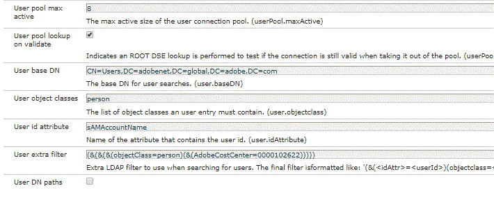

# AEM Forms 워크플로우에서 LDAP 사용

제출자의 관리자에 AEM Forms 워크플로우 작업 할당

AEM 워크플로우에서 적응형 양식을 사용할 때 양식 제출자의 관리자에 작업을 동적으로 할당할 수 있습니다. 이 사용 사례를 수행하려면 Ldap를 사용하여 AEM을 구성해야 합니다.

LDAP를 사용하여 AEM을 구성하는 데 필요한 단계는 [여기에 자세히 설명되어 있습니다.](https://helpx.adobe.com/experience-manager/6-5/sites/administering/using/ldap-config.html)

이 문서의 목적에 따라 Adobe Ldap를 사용하여 AEM 구성에 사용된 구성 파일을 첨부합니다. 이러한 파일은 패키지 관리자를 사용하여 가져올 수 있는 패키지에 포함되어 있습니다.

아래 스크린샷에서는 특정 비용 센터에 속한 모든 사용자를 가져옵니다. LDAP에서 모든 사용자를 가져오려는 경우 추가 필터를 사용할 수 없습니다.



아래 스크린샷에서는 그룹을 LDAP에서 AEM으로 가져온 사용자에게 할당합니다. 가져온 사용자에게 지정된 forms-users 그룹에 주목하십시오. 사용자는 AEM Forms와의 상호 작용을 위해 이 그룹의 구성원이어야 합니다. 또한 AEM의 profile/manager 노드 아래에 manager 속성이 저장됩니다.


LDAP를 구성하고 사용자를 AEM으로 가져온 후에는 작업을 제출자의 관리자에게 지정하는 워크플로우를 만들 수 있습니다. 이 문서의 목적에 따라 간단한 1단계 승인 워크플로우를 개발했습니다.

워크플로우의 첫 번째 단계에서는 초기 단계의 값을 아니오로 설정합니다. 적응형 양식의 비즈니스 규칙은 &quot;제출자 세부 사항&quot; 패널을 비활성화하고 초기 단계 값을 기반으로 &quot;승인됨&quot; 패널을 표시합니다.

두 번째 단계에서는 제출자의 관리자에게 작업을 할당합니다. 사용자 지정 코드를 사용하여 제출자의 관리자를 받습니다.


```java
public String getParticipant(WorkItem workItem, WorkflowSession wfSession, MetaDataMap arg2) throws WorkflowException{
resourceResolver = wfSession.adaptTo(ResourceResolver.class);
UserManager userManager = resourceResolver.adaptTo(UserManager.class);
Authorizable workflowInitiator = userManager.getAuthorizable(workItem.getWorkflow().getInitiator());
.
.
String managerPorperty = workflowInitiator.getProperty("profile/manager")[0].getString();
.
.

}
```

코드 조각은 관리자 ID를 가져와서 관리자에게 작업을 할당합니다.

워크플로우 초기자를 파악합니다. 그런 다음 manager 속성의 값을 가져옵니다.

관리자 속성이 LDAP에 저장되는 방식에 따라 관리자 ID를 얻으려면 몇 가지 문자열을 조작해야 할 수 있습니다.

자신의 [ ParticipantChooser 를 구현하려면 이 문서를 읽어 보십시오.](https://helpx.adobe.com/experience-manager/using/dynamic-steps.html)

시스템에서 테스트하려면(Adobe 직원의 경우 즉시 이 샘플을 사용할 수 있음)

* [setvalue 번들을 다운로드하고 배포합니다](/help/forms/assets/common-osgi-bundles/SetValueApp.core-1.0-SNAPSHOT.jar). 관리자 속성을 설정하는 사용자 정의 OSGI 번들입니다.
* [DevelopingWithServiceUserBundle 다운로드 및 설치](/help/forms/assets/common-osgi-bundles/DevelopingWithServiceUser.jar)
* [패키지 관리자를 사용하여 이 아티클과 연결된 에셋을 AEM으로 가져옵니다](assets/aem-forms-ldap.zip). 이 패키지의 일부로 포함되는 것은 LDAP 구성 파일, 워크플로우 및 적응형 양식입니다.
* 적절한 LDAP 자격 증명을 사용하여 LDAP로 AEM을 구성합니다.
* LDAP 자격 증명을 사용하여 AEM에 로그인합니다.
* [timeoffrequestform](http://localhost:4502/content/dam/formsanddocuments/helpx/timeoffrequestform/jcr:content?wcmmode=disabled) 열기
* 양식을 작성하고 제출합니다.
* 제출자의 관리자는 검토할 수 있는 양식을 받아야 한다.

>[!NOTE]
>
>관리자 이름을 추출하기 위한 이 사용자 지정 코드는 Adobe LDAP에 대해 테스트되었습니다. 다른 LDAP에 대해 이 코드를 실행하는 경우 관리자 이름을 얻으려면 자신의 getParticipant 구현을 수정하거나 작성해야 합니다.
